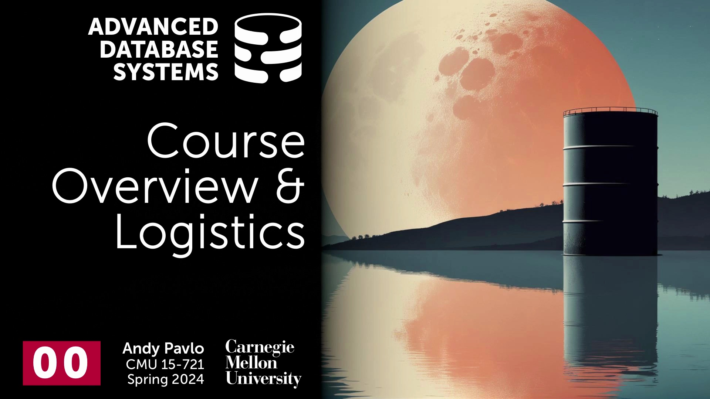
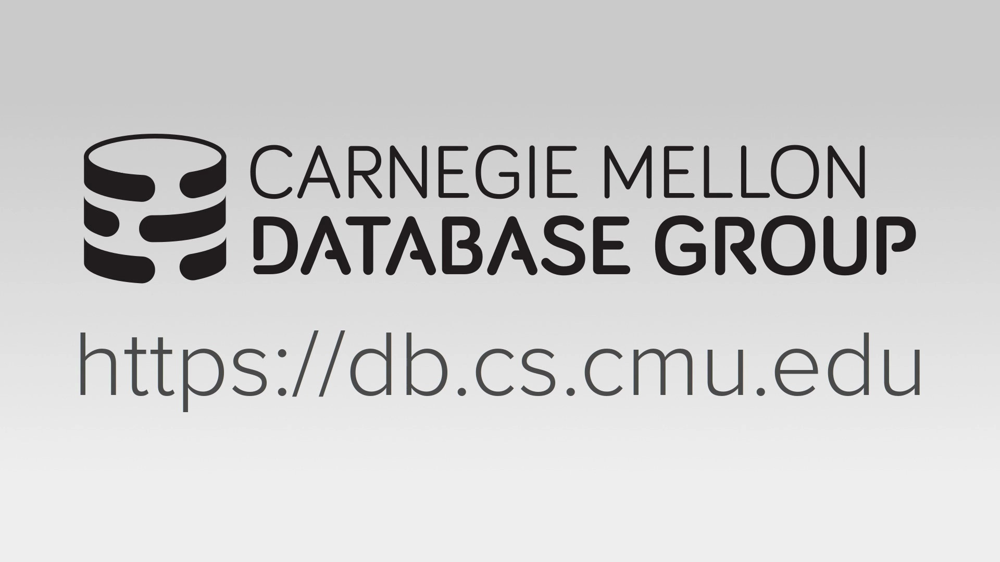
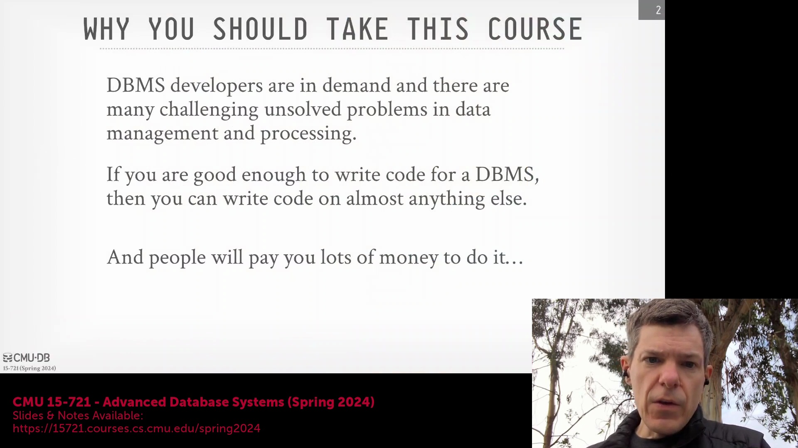
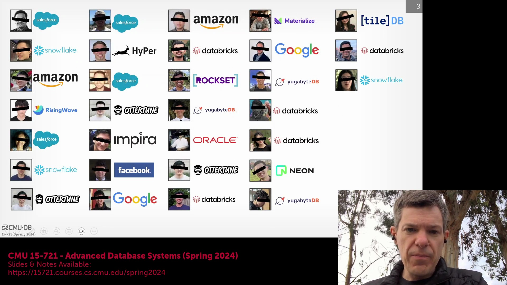
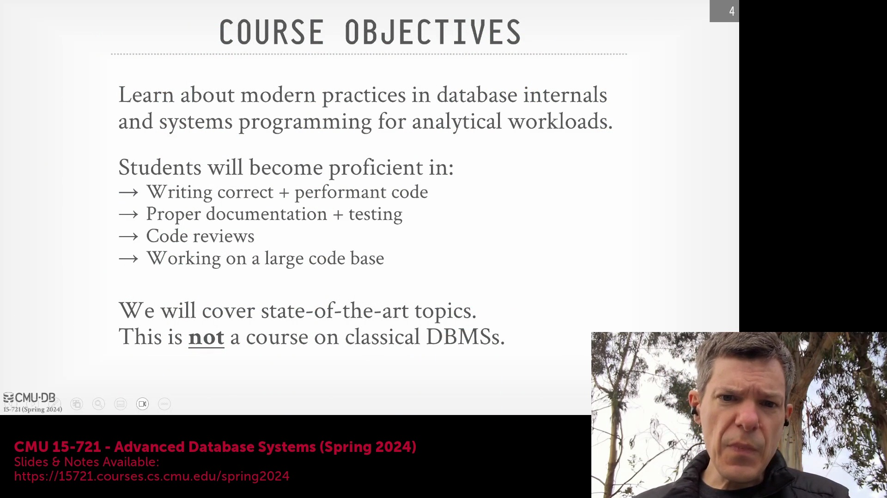
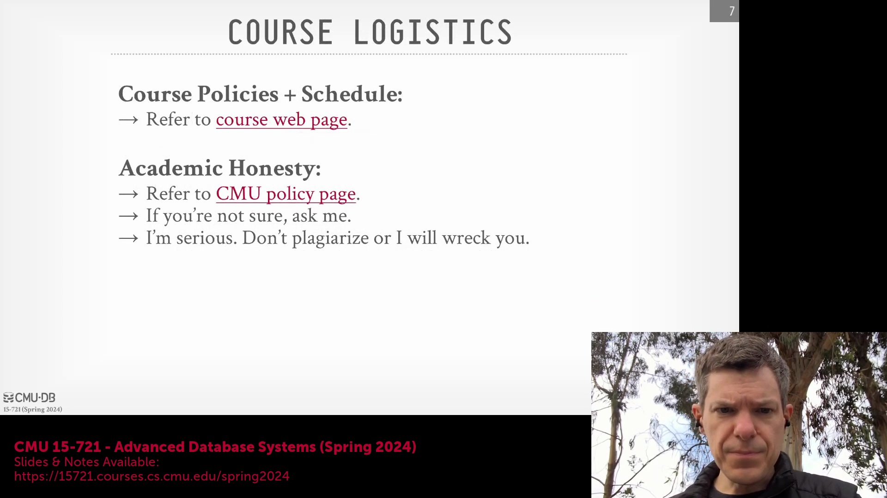
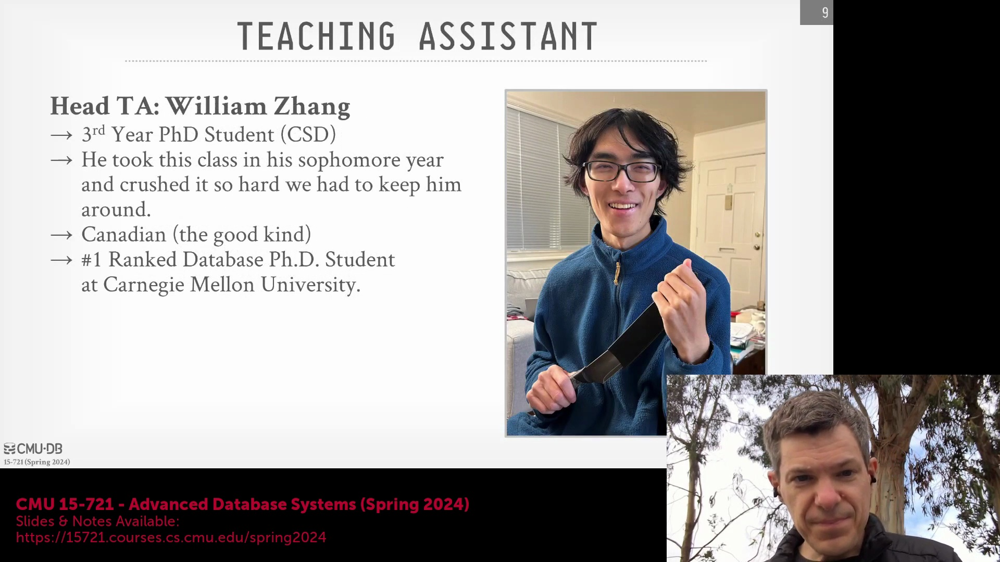

## 课程简介与概述
欢迎来到卡内基梅隆大学(Carnegie Mellon University)的高级数据库系统(Advanced Database Systems)课程。本课程在演播室现场观众面前录制，本次讲座旨在为本学期的演播室式授课奠定基调并梳理整体框架。

## 课程目标与项目要求
本课程的核心目标是掌握构建现代分析型数据库(Analytical Database)系统所采用的方法与技术。你将学习如何编写高质量代码、撰写详尽的技术报告与文档，并制定严格的测试方案以确保系统正确性。本课程不仅要求交付完整的项目成果，更强调建立完善的测试方法论(Testing Methodology)与持续验证(Continuous Verification)机制。在整个学期中，你将参与代码审查(Code Review)并投身于长期项目开发。这些项目将大幅扩充你的代码库(Codebase)，从而高度模拟真实的工业级开发环境。

## 核心课程与现代数据库技术
本课程将突破入门级知识，聚焦于课程专题与数据库系统开发领域的最新研究(Research)。尽管系统的高层架构(High-level Architecture)仍沿袭经典设计，但教学重点将深度融合过去十年的技术突破，以大幅提升查询执行(Query Execution)效率。核心模块涵盖数据格式与编码压缩(Data Formats and Encoding/Compression)（旨在实现更低的存储开销与更快的访问速度）、向量化查询执行(Vectorized Query Execution)、查询编译(Query Compilation)以及高效的物理执行计划(Physical Execution Plan)。我们还将深入探讨跨工作负载(Workload)的系统级调度、并发控制(Concurrency Control)以及网络协议(Network Protocol)。查询优化(Query Optimization)是本课程的重中之重，因为即便搭配最迅捷的执行引擎(Execution Engine)，次优的查询计划依然无法保证性能。此外，本学期将安排大量课时剖析行业巨头与初创企业的真实案例，探讨如何将理论概念落地应用于 Snowflake 和 Yellowbrick 等生产级(Production-grade)数据库系统。

## 管理政策与课程安排
关于所有课程政策与日程安排，请务必以官方课程网站(Official Course Website)发布的信息为准，该网站将随后续阅读材料(Reading Materials)的更新而同步维护。校方严格执行学术诚信(Academic Integrity)政策；任何形式的抄袭、作弊或未经授权的协作(Unauthorized Collaboration)均将导致严重后果，包括正式的校级纪律处分(Disciplinary Action)。每周课后将安排两次答疑时间(Office Hours)，亦可通过邮件灵活预约。这些时段非常适合用于讨论项目进展、深入研读研究论文(Research Paper)、探讨课程外的高级主题，或获取关于数据库工程(Database Engineering)岗位的职业指导。

## 助教与学术支持
本课程由助教(Teaching Assistant) William Zhang 协助支持。他是一名优秀的博士生，曾在本科阶段修读本课程并取得优异成绩，且在 SingleStore 积累了丰厚的业界实践经验。他将凭借扎实的专业背景，积极指导项目开发，并协助各团队在整个学期中攻克技术难题。
