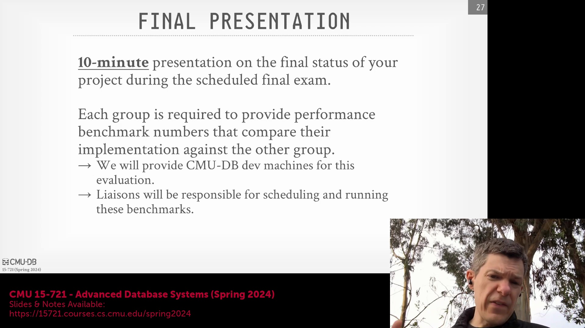
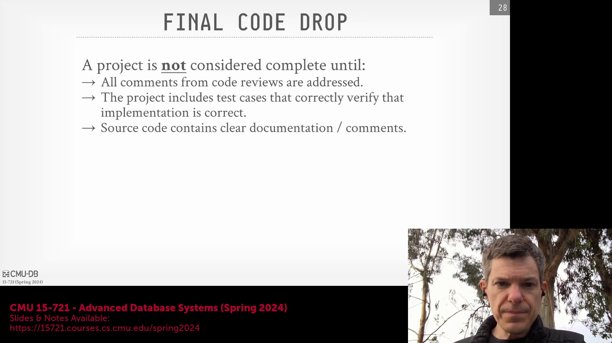
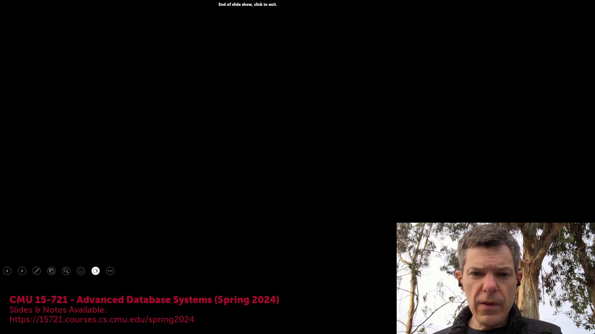
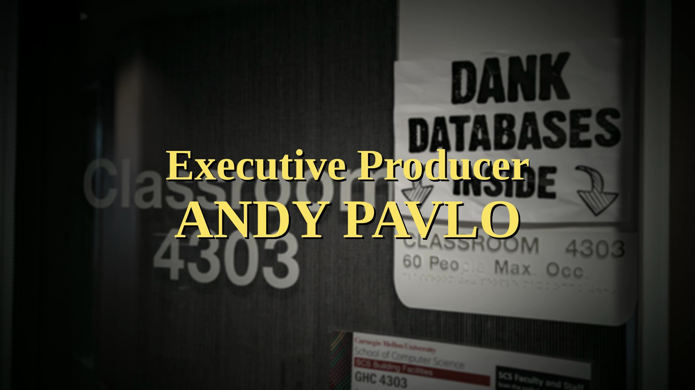
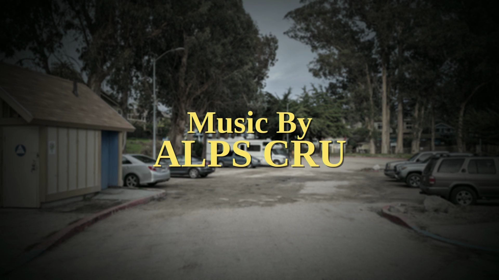
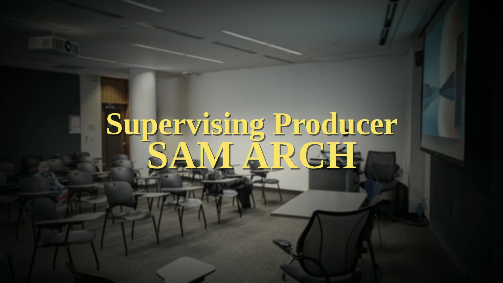
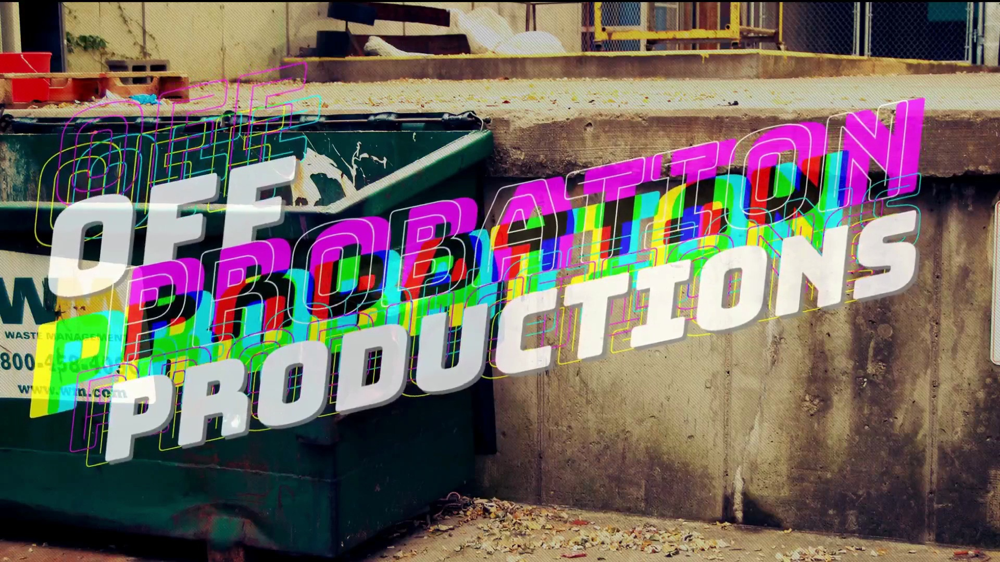

## 公平基准测试与对比评估
为确保竞争项目小组之间进行真正“公平对等（Apples-to-Apples）”的比较，各团队联络人将协调在专用硬件(Dedicated Hardware)上统一安排并执行最终基准测试(Final Benchmarking)。这种标准化方法确保了性能指标(Performance Metrics)、正确性(Correctness)和 API 覆盖率(API Coverage)在完全一致的条件下进行评估，从而为客观公正地遴选最优实现方案，并将其整合至本课程持续迭代的数据库系统中提供坚实依据。

## 最终代码提交与项目可持续性
仅在 GitHub 上完成最终代码交付(Final Code Drop)后，项目方可视为正式结项。该里程碑要求彻底清理所有待处理问题(Pending Issues)及存储卷相关任务(Storage Volume Tasks)，实现完整的测试用例(Test Suite)，并提供详尽的代码内文档与注释。核心目标是构建一个整洁、高可维护性(Maintainable)的代码库(Codebase)，以便后续届次的学生能够无缝承接并持续开发，无论其应用于课程迭代、硕士学位论文(Master's Thesis)还是毕业设计(Capstone Project)。

## 学术诚信与开源代码复用
在整个项目周期内，必须严格遵守学术诚信(Academic Integrity)政策。尽管鼓励学生深入研究 DataFusion 等开源项目，以汲取高层架构设计(High-level Architecture Design)与编码模式(Coding Patterns)的灵感，但严禁在未获明确授权的情况下直接抄袭或复用源代码。所有代码贡献均须保持清晰的代码溯源(Code Provenance)、规范的作者署名(Attribution)以及合法可验证的开源许可证(Open Source License)声明，以确保在协作开发环境中完全符合学术伦理与法律合规要求。

## 下一步安排与即时行动项
在接下来的讲座中，我们将深入研讨首篇关于现代分析型数据库系统(Modern Analytical Database Systems)的指定阅读文献(Assigned Reading)。学生须在课前通过指定的 Google Form 提交阅读摘要(Reading Summary)。此外，关于团队组建(Team Formation)与项目提案提交(Project Proposal Submission)的具体时间安排（截止日期为 1 月 31 日）将发布于 Piazza。请同学们尽快确认组队名单，并着手起草初步设计文档(Design Document)。

## 行政事务总结与课堂笔记
请务必在课程管理表(Course Management Spreadsheet)中核对分配给您的课堂笔记(Lecture Notes)提交排期。鉴于本学期选课人数增加，我们将对安排进行动态调整，可能通过任务分担(Workload Sharing)或指派替代性作业(Alternative Assignments)的方式，以公平平衡各学生的工作量。所有最终的行政事务细节(Administrative Details)将于近期正式公布。感谢大家的专注与配合，课程将于下周一恢复正常授课，并正式开启首次技术讲座(Technical Lecture)。

