## 课程简介与概述
欢迎来到卡内基梅隆大学(Carnegie Mellon University)的高级数据库系统(Advanced Database Systems)课程。本课程在演播室现场观众面前录制，本次讲座旨在为本学期的演播室式授课奠定基调并梳理整体框架。

## 课程目标与项目要求
本课程的核心目标是掌握构建现代分析型数据库(Analytical Database)系统所采用的方法与技术。你将学习如何编写高质量代码、撰写详尽的技术报告与文档，并制定严格的测试方案以确保系统正确性。本课程不仅要求交付完整的项目成果，更强调建立完善的测试方法论(Testing Methodology)与持续验证(Continuous Verification)机制。在整个学期中，你将参与代码审查(Code Review)并投身于长期项目开发。这些项目将大幅扩充你的代码库(Codebase)，从而高度模拟真实的工业级开发环境。

## 核心课程与现代数据库技术
本课程将突破入门级知识，聚焦于课程专题与数据库系统开发领域的最新研究(Research)。尽管系统的高层架构(High-level Architecture)仍沿袭经典设计，但教学重点将深度融合过去十年的技术突破，以大幅提升查询执行(Query Execution)效率。核心模块涵盖数据格式与编码压缩(Data Formats and Encoding/Compression)（旨在实现更低的存储开销与更快的访问速度）、向量化查询执行(Vectorized Query Execution)、查询编译(Query Compilation)以及高效的物理执行计划(Physical Execution Plan)。我们还将深入探讨跨工作负载(Workload)的系统级调度、并发控制(Concurrency Control)以及网络协议(Network Protocol)。查询优化(Query Optimization)是本课程的重中之重，因为即便搭配最迅捷的执行引擎(Execution Engine)，次优的查询计划依然无法保证性能。此外，本学期将安排大量课时剖析行业巨头与初创企业的真实案例，探讨如何将理论概念落地应用于 Snowflake 和 Yellowbrick 等生产级(Production-grade)数据库系统。

## 管理政策与课程安排
关于所有课程政策与日程安排，请务必以官方课程网站(Official Course Website)发布的信息为准，该网站将随后续阅读材料(Reading Materials)的更新而同步维护。校方严格执行学术诚信(Academic Integrity)政策；任何形式的抄袭、作弊或未经授权的协作(Unauthorized Collaboration)均将导致严重后果，包括正式的校级纪律处分(Disciplinary Action)。每周课后将安排两次答疑时间(Office Hours)，亦可通过邮件灵活预约。这些时段非常适合用于讨论项目进展、深入研读研究论文(Research Paper)、探讨课程外的高级主题，或获取关于数据库工程(Database Engineering)岗位的职业指导。

## 助教与学术支持
本课程由助教(Teaching Assistant) William Zhang 协助支持。他是一名优秀的博士生，曾在本科阶段修读本课程并取得优异成绩，且在 SingleStore 积累了丰厚的业界实践经验。他将凭借扎实的专业背景，积极指导项目开发，并协助各团队在整个学期中攻克技术难题。

---

## 沟通规范与评分结构
所有技术问题及项目讨论请统一使用 Piazza 平台，以便全班同学共同参与并互相学习。涉及个人事务或课程安排(Schedule)的疑问，请通过邮件直接联系授课教师(Instructor)。课程最终成绩由四部分组成，其中贯穿全学期的学期项目(Semester Project)所占权重最大。
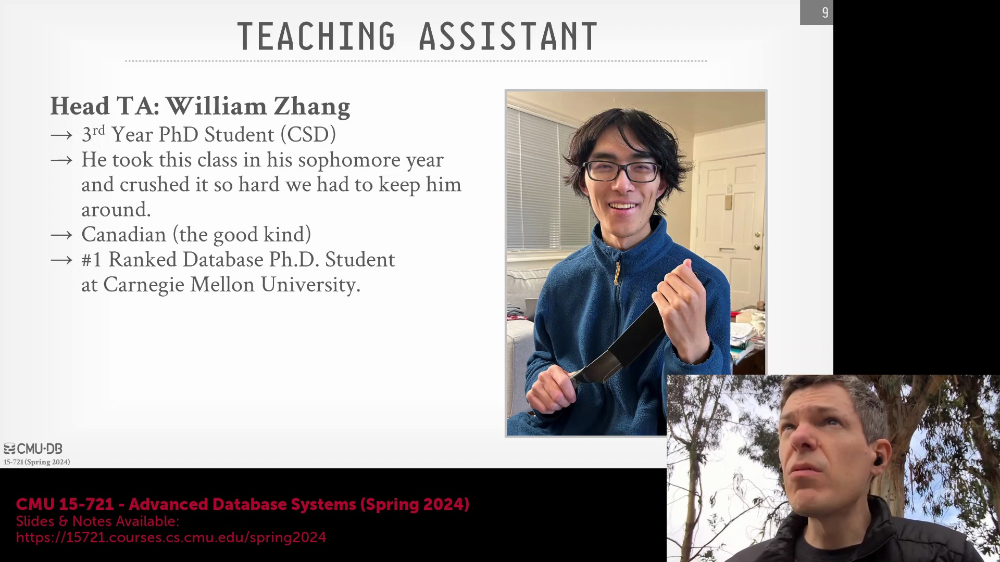
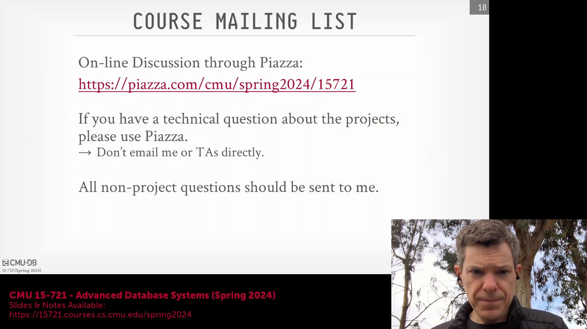

## 阅读作业与摘要要求
每次讲座均配备一篇核心阅读材料(Core Reading)，在课程表中以皇冠图标标记，该材料对讲座涉及的技术提供了基础性讲解。每次上课前，学生须通过 Google Form 提交一份简明摘要(Summary)。该摘要应清晰概述论文的核心思想与背景，指明文中所实现的系统，并具体说明所评估的工作负载(Workload)或基准测试(Benchmark)。全学期内，每位学生享有三次豁免提交此类作业的机会。

## 学术诚信与 AI 使用政策
提交的摘要必须完全原创。严禁使用人工智能(AI)自动生成摘要，或抄袭同学作业及网络资源。此类行为将通过 Turnitin 系统进行严格查重检测。然而，针对另一项独立的课堂笔记作业(Lecture Notes Assignment，每学期每位学生仅需完成一次)，允许使用 AI 工具作为辅助，以便根据讲座录音稿(Transcript)和演示幻灯片(Slides)起草或整理内容。学生仍须对所有 AI 辅助生成的内容进行严格审核，以确保技术准确性，并杜绝提交包含 AI 幻觉(AI Hallucinations，即虚构或错误信息)的内容。
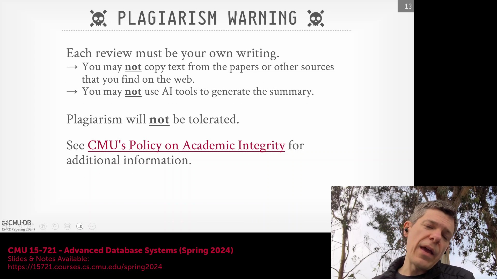

## 期末考试评估策略
期末考试(Final Exam)采用开卷长作业(Open-book Take-home)形式，将于最后一节课发放，并在考试周(Final Exam Week)截止。该考试不侧重于对单篇论文的机械记忆，而是重点评估你综合运用多项课程概念，并将其应用于设计全新理论系统的能力。考核核心在于理解不同的数据库技术(Database Technologies)如何在更宏大的系统架构(System Architecture)中相互整合并协同工作。
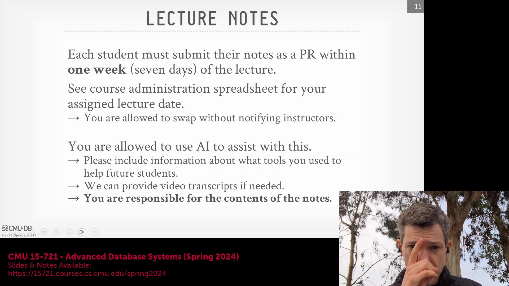

## 学期项目架构与工作流程
本学期的核心任务是协作构建一个全新的数据响应型(Data-Reactive)数据库系统，开发语言采用 Rust。该系统将根据工作负载(Workload)特征和硬件配置自动调整执行策略(Execution Strategy)。Rust 编程能力将通过项目实践自然习得，课程不提供专门的语法授课。学生需三人一组，五个核心组件(Core Components)将分配给各团队并行开发。各团队需在接口规格说明(Specifications)上保持协作，但在实现质量上展开竞争。学期末将通过全班投票，决定哪个团队的实现方案将被采纳并用于后续的研究与集成工作。查询优化器(Query Optimizer)模块除外，该分支采用独立的开发与评估机制。
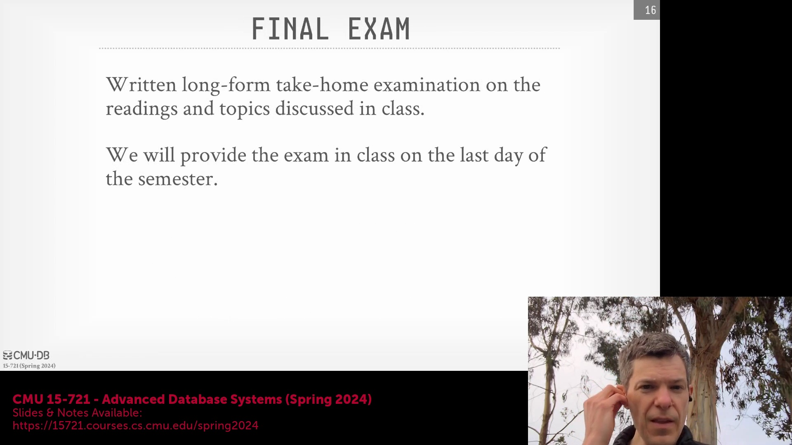

---

## 查询优化器：一项协作式例外
由于查询优化(Query Optimization)本身具有极高的复杂性，在一个学期内从零开始构建一个功能完整的优化器(Optimizer)是不太现实的。与项目其他分支中各小组独立开发相同组件并展开竞争的模式不同，负责查询优化器的团队将采用高度协作的工作模式。各小组之间不进行直接竞争，而是在同一个统一的代码库(Codebase)中紧密合作，共同开发不同的子系统(Subsystems)，以最大化地推进项目整体进度。
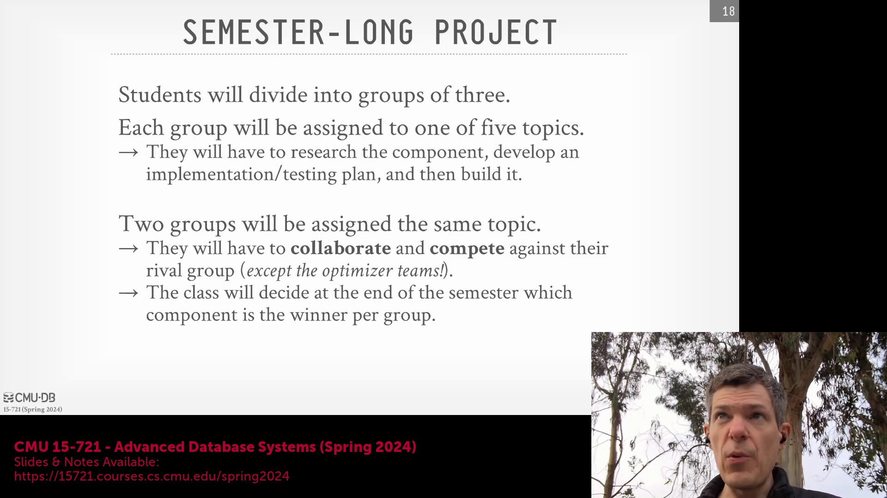

## 核心项目组件与架构
本学期的核心任务是构建新数据库系统的五个基础组件。**调度器(Scheduler)**将负责跨节点分配查询任务，并维持系统工作负载(Workload)的饱和度。**执行引擎(Execution Engine)**负责处理物理查询计划(Physical Query Plan)，为简化设计，该引擎默认在单节点上运行。**目录服务(Catalog Service)**将负责追踪数据库文件与数据模式(Schema)的元数据(Metadata)。**I/O 服务(IO Service)**将处理从本地磁盘(Local Disk)或云对象存储(Cloud Object Storage)中检索数据的任务，并实现一个统一的本地缓存(Unified Local Cache)，以尽可能降低高昂的远程数据获取开销。
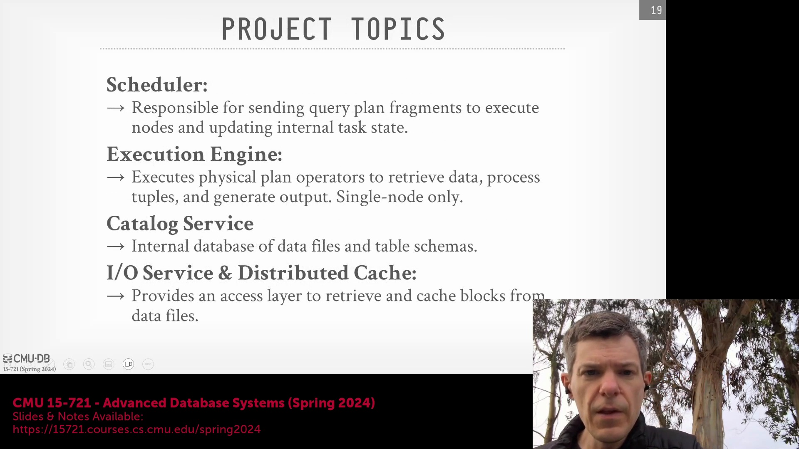

## 优化器设计与开源灵感
查询优化器(Query Optimizer)将采用混合架构，结合基于规则的启发式算法(Rule-Based Heuristics)与基于代价的搜索(Cost-Based Search)，以生成最优执行计划(Execution Plan)。该项目将基于 OTB 进行开发，这是往届学生基于 Apache DataFusion 分支(Fork)而来的衍生项目。它保留了 DataFusion 的内部计划格式(Internal Plan Format)，但解耦了连接排序逻辑(Join Ordering Logic)。尽管鼓励学生从 Velox 和 DataFusion 等成熟的开源引擎中汲取架构灵感，但所有代码实现均须使用 Rust 语言从头编写，授课教师将针对合适的设计模式(Design Patterns)提供专业指导。
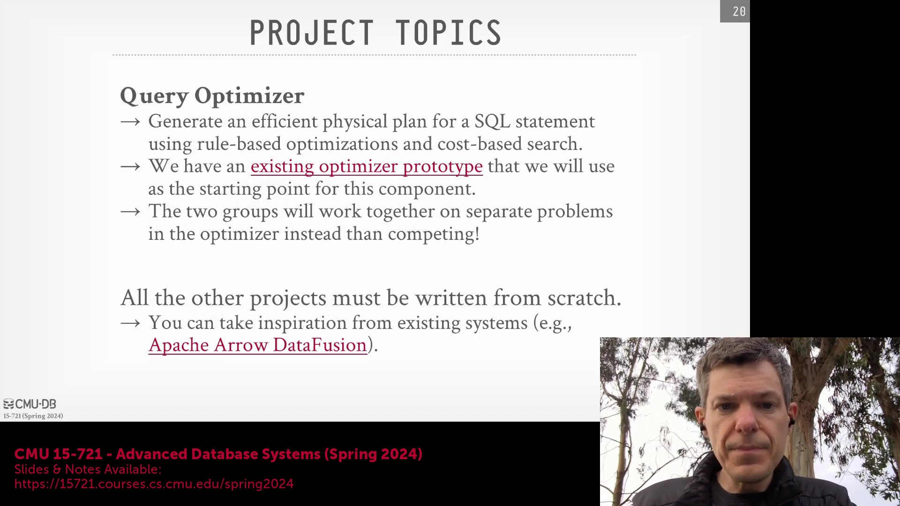
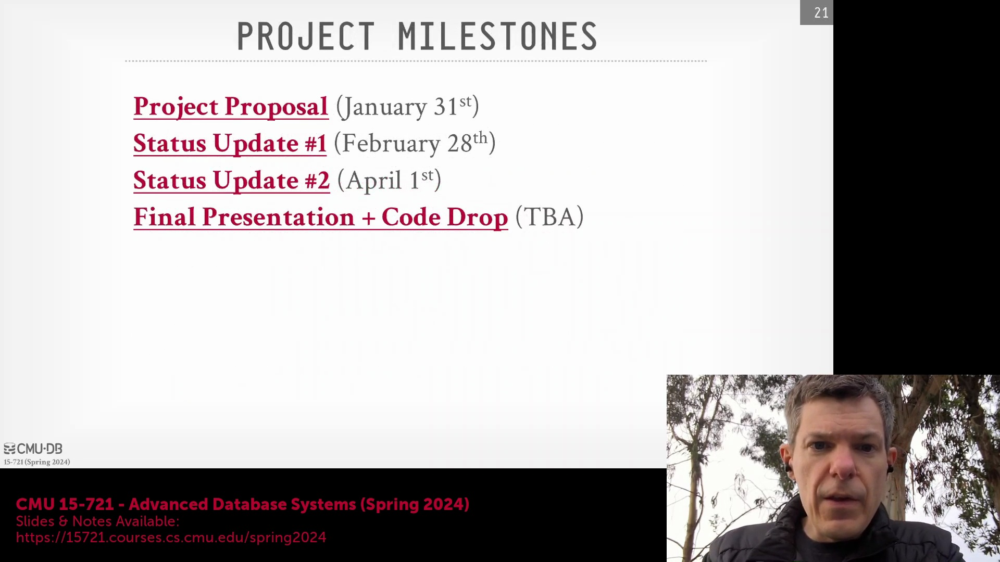

## 项目里程碑与渐进式反馈
为确保项目稳步推进并规避期末阶段的集成风险(Integration Risk)，整个项目周期围绕四个关键里程碑(Milestone)展开。项目将于 1 月 31 日以提交项目提案(Project Proposal)正式启动，随后安排两次月度课堂进度汇报。学期末将于 5 月举行最终演示与答辩(Final Presentation & Demo)，并强制要求在 GitHub 上提交完整代码。常规课堂时间将专门用于进度同步与问题排查(Debugging)，确保各小组开发步调一致，并清晰理解各自模块如何融入更广泛的系统架构(System Architecture)。
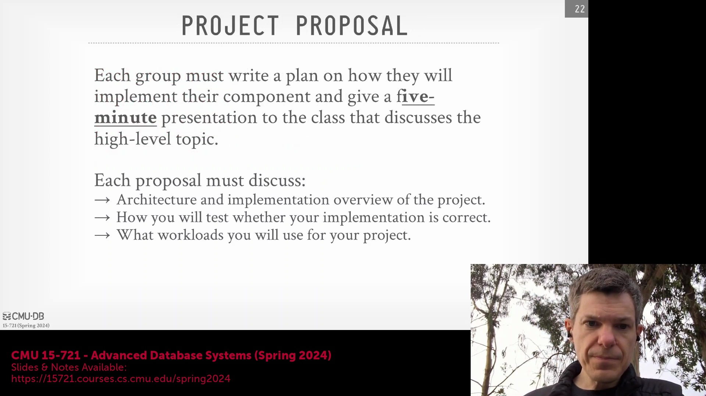

## 提案交付物与 API 标准化
初始提案需包含一份 1-2 页的 Markdown 格式设计文档(Design Document)、一次 5 分钟的课堂展示，以及一套全面的测试策略(Testing Strategy)。关键在于，各团队必须提交一份 **API 规范(API Specification)**，明确定义其组件将如何与其他模块进行交互，并将每个组件视为独立的内部微服务(Internal Microservice)。参与同一组件开发的竞争团队需各指派一名联络人负责跨组协调，确保双方在输入、输出、指令集及错误处理(Error Handling)标准上保持一致。这种对齐机制(Alignment Mechanism)保证了无论最终采纳哪一方的实现方案，都能无缝集成至最终系统中。
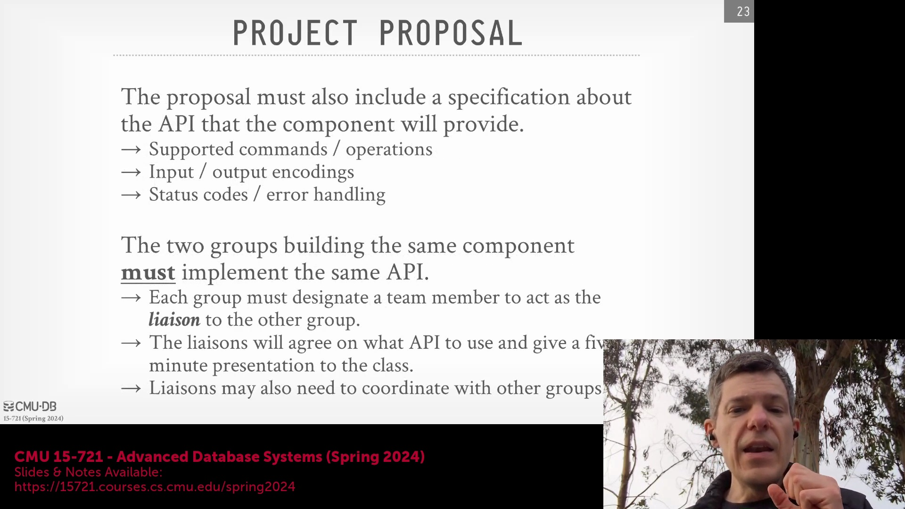

## API 复用与共享测试基础设施
为加速开发进程并与业界最佳实践接轨，强烈建议各团队直接采用成熟的开源 API 接口，而非自行设计专有接口(Proprietary Interface)。例如，目录服务应遵循 Apache Iceberg 标准，优化器需与 Apache Calcite 规范对齐，执行引擎则应兼容 Velox 或 DataFusion 的接口协议。对这些 API 进行标准化，不仅能显著降低初期的开发开销，还能使竞争双方复用同一套端到端测试框架(End-to-End Testing Framework)与验证脚本(Validation Scripts)。
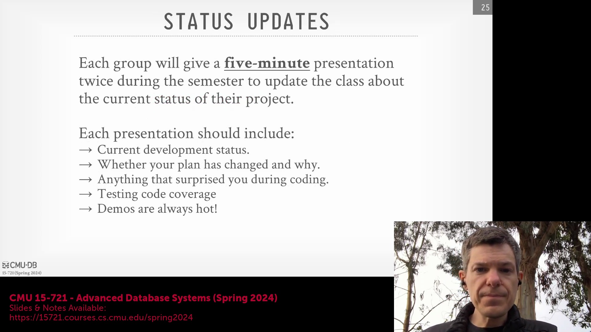

## 进度跟踪与最终基准测试
在整个学期中，每次进度更新均需包含 5 分钟的演示环节，内容涵盖进度指标(Progress Metrics)、测试覆盖率(Test Coverage)数据、实时演示(Live Demo)以及持续迭代的设计文档。各团队联络人需提前协调并统一基准测试方法(Benchmarking Methodology)。在考试周期间，各小组将进行最终成果展示，并在 CMU 专用硬件集群上执行对比评估(Comparative Evaluation)。评估系统将严格测量各项指标的性能(Performance)、逻辑正确性(Correctness)以及 API 覆盖率(API Coverage)，以此决定哪一组的实现方案将被正式收录至本课程持续迭代的数据库系统中。
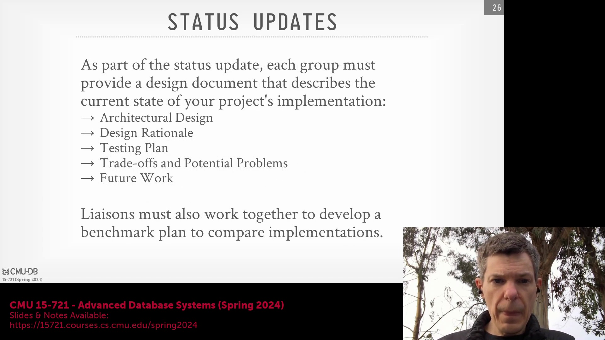

---

## 公平基准测试与对比评估
为确保竞争项目小组之间进行真正“公平对等（Apples-to-Apples）”的比较，各团队联络人将协调在专用硬件(Dedicated Hardware)上统一安排并执行最终基准测试(Final Benchmarking)。这种标准化方法确保了性能指标(Performance Metrics)、正确性(Correctness)和 API 覆盖率(API Coverage)在完全一致的条件下进行评估，从而为客观公正地遴选最优实现方案，并将其整合至本课程持续迭代的数据库系统中提供坚实依据。

## 最终代码提交与项目可持续性
仅在 GitHub 上完成最终代码交付(Final Code Drop)后，项目方可视为正式结项。该里程碑要求彻底清理所有待处理问题(Pending Issues)及存储卷相关任务(Storage Volume Tasks)，实现完整的测试用例(Test Suite)，并提供详尽的代码内文档与注释。核心目标是构建一个整洁、高可维护性(Maintainable)的代码库(Codebase)，以便后续届次的学生能够无缝承接并持续开发，无论其应用于课程迭代、硕士学位论文(Master's Thesis)还是毕业设计(Capstone Project)。

## 学术诚信与开源代码复用
在整个项目周期内，必须严格遵守学术诚信(Academic Integrity)政策。尽管鼓励学生深入研究 DataFusion 等开源项目，以汲取高层架构设计(High-level Architecture Design)与编码模式(Coding Patterns)的灵感，但严禁在未获明确授权的情况下直接抄袭或复用源代码。所有代码贡献均须保持清晰的代码溯源(Code Provenance)、规范的作者署名(Attribution)以及合法可验证的开源许可证(Open Source License)声明，以确保在协作开发环境中完全符合学术伦理与法律合规要求。

## 下一步安排与即时行动项
在接下来的讲座中，我们将深入研讨首篇关于现代分析型数据库系统(Modern Analytical Database Systems)的指定阅读文献(Assigned Reading)。学生须在课前通过指定的 Google Form 提交阅读摘要(Reading Summary)。此外，关于团队组建(Team Formation)与项目提案提交(Project Proposal Submission)的具体时间安排（截止日期为 1 月 31 日）将发布于 Piazza。请同学们尽快确认组队名单，并着手起草初步设计文档(Design Document)。

## 行政事务总结与课堂笔记
请务必在课程管理表(Course Management Spreadsheet)中核对分配给您的课堂笔记(Lecture Notes)提交排期。鉴于本学期选课人数增加，我们将对安排进行动态调整，可能通过任务分担(Workload Sharing)或指派替代性作业(Alternative Assignments)的方式，以公平平衡各学生的工作量。所有最终的行政事务细节(Administrative Details)将于近期正式公布。感谢大家的专注与配合，课程将于下周一恢复正常授课，并正式开启首次技术讲座(Technical Lecture)。

