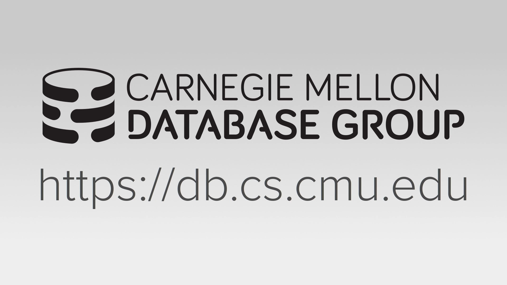
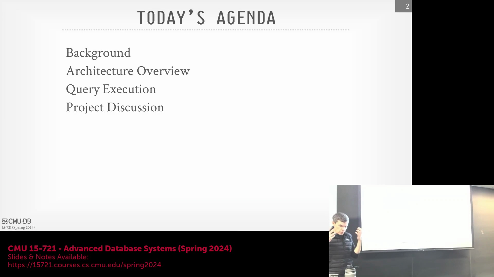
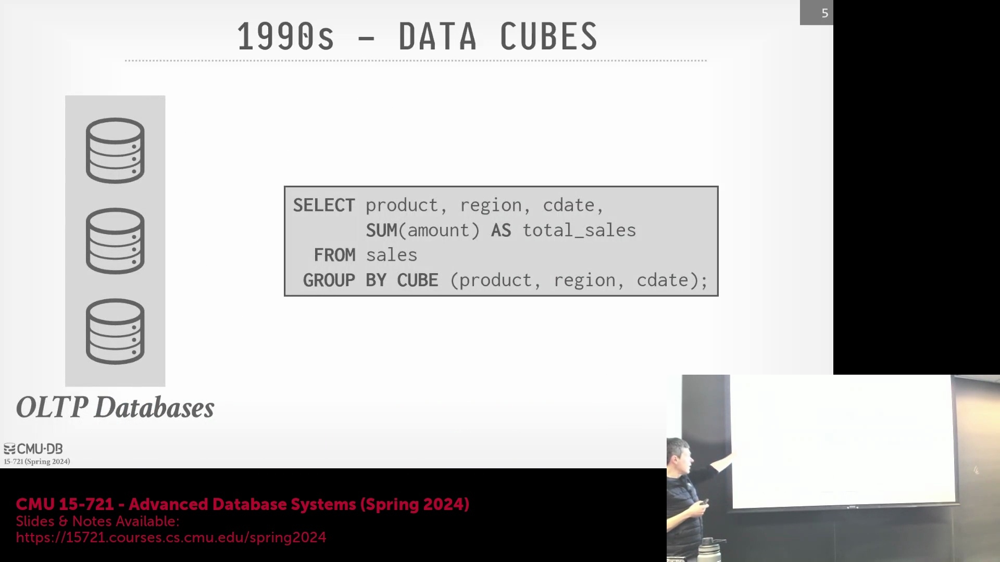
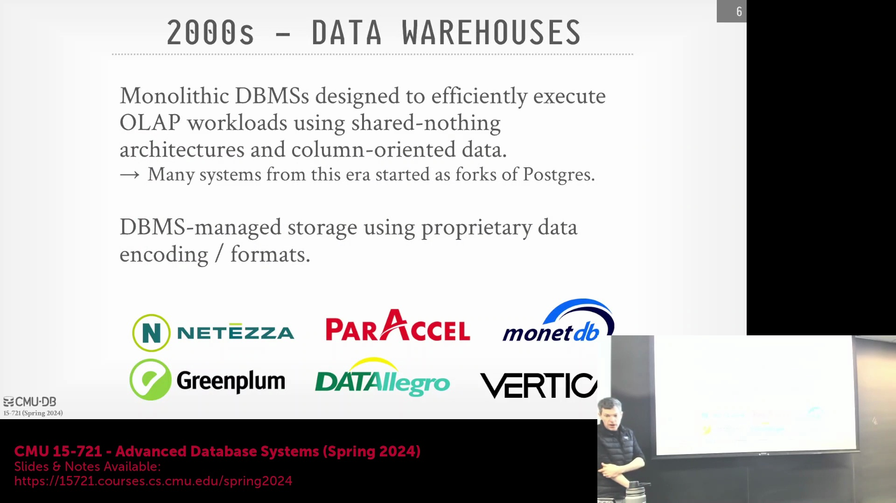
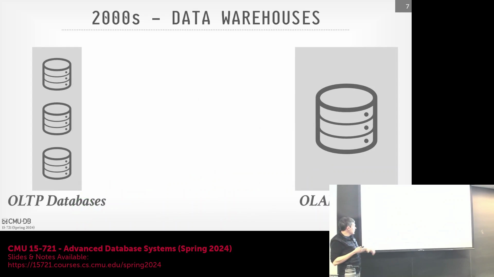
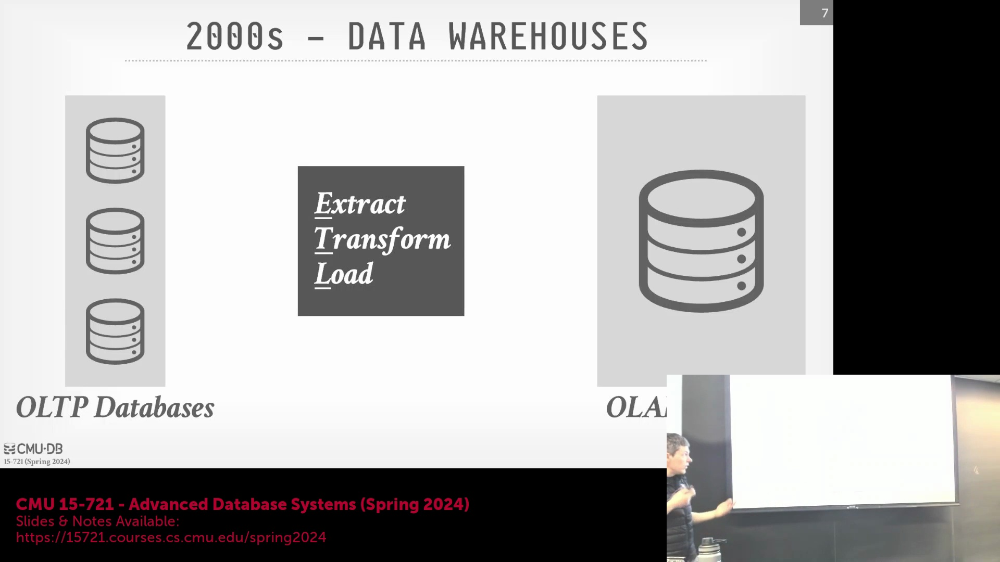

## 课程介绍与学期规划
欢迎来到卡内基梅隆大学高级数据库系统(Advanced Database Systems)课程。本课程在配有现场观众的演播室中录制完成。第一讲旨在提供宏观概览，并为整个学期的学习奠定基础知识背景。课程将涵盖构建现代数据库系统(Modern Database Systems)各核心组件的基本原理，这些内容将直接支撑本学期后期的实践项目(Hands-on Project)。 

## 确立现代 OLAP 架构的背景
课程将从数据库系统(Database Systems)的历史演进讲起，追溯该行业如何发展至如今广泛应用于现代在线分析处理(OLAP)工作负载(Workload)的主流架构。我们将探讨高层级架构决策，剖析核心系统设计挑战，并逐步梳理查询执行(Query Execution)的端到端(End-to-End)生命周期。作为一门研究生课程(Graduate Course)，我们鼓励大家在整个学期中积极参与讨论并踊跃提问。

## OLTP 与 OLAP：理解工作负载的差异
理解两者差异的一个关键起点，是区分在线事务处理(OLTP)与在线分析处理(OLAP)系统。OLTP数据库充当直接面向用户或应用程序的业务操作前端，其首要目标是实现新事务数据的高速摄入(Ingestion)与存储。随着数据不断积累，系统重心便转向OLAP。OLAP的核心目标是查询已存储的数据，以提取业务洞察、发现潜在趋势，并驱动明智的商业或机构决策。本学期的课程将重点围绕如何针对此类分析型查询(Analytical Query)任务进行系统优化展开。

## 历史架构：单体数据库与数据立方体
历史上，分析型工作负载通常在PostgreSQL、MySQL或SQLite等单体数据库系统(Monolithic Database Systems)上运行。这类系统将所有的查询执行(Query Execution)与存储子系统(Storage Subsystems)打包于单一软件中，并依赖于采用集中式磁盘管理的行存架构(Row-store Architecture)。尽管行存架构在快速事务写入方面极为高效，但在OLAP场景下却表现不佳：因为即便查询仅需访问少数几列，系统仍会读取完整的数据页(Data Page)与整行记录。为缓解这一I/O低效问题，早期系统引入了“数据立方体”(Data Cubes)——即预计算(Pre-computed)的多维聚合数组（其功能类似于物化视图(Materialized Views)）。这些数据立方体需人工维护，通常通过`cron`任务在夜间定期刷新；但其优势在于允许分析查询直接命中预聚合数据，从而显著加快查询响应。在行业架构再次演进之前，主流关系型数据库管理系统(Relational Database Management Systems, RDBMS)厂商曾广泛采用此方案。

## 专用数据仓库的崛起
21世纪初至中期，行业重心转向了专为分析型工作负载设计的专用数据仓库(Dedicated Data Warehouses)。尽管许多知名系统（包括Redshift、Vertica和Greenplum）最初均源自PostgreSQL的代码分支(Fork)，但它们从根本上移除了传统的行式存储与执行引擎，转而采用专为OLAP优化的列式架构(Columnar Architecture)。另一些系统（如MonetDB）则是完全从零开始构建的，后续广受欢迎的DuckDB亦衍生自其生态。这些现代系统通常采用“无共享”(Shared-Nothing)架构：每个计算节点(Compute Node)独立管理自身的CPU、内存与磁盘资源，并负责处理全局数据集的特定数据分区(Data Partition)。

## ETL 管道与数据仓库部署
在实际生产环境中，此类架构高度依赖结构化的数据摄入管道(Data Ingestion Pipeline)。来自OLTP系统的业务数据需经过提取、转换与加载(Extract, Transform, Load / ETL)流程后，方可汇入集中式数据仓库。该流程负责捕获增量变更、执行数据清洗与实体解析(Entity Resolution)，进而构建出统一的全局信息视图。由于传统数据仓库对底层专有存储格式与计算资源分配实行严格控制，因此在导入任何数据前，必须预先完成数据模式(Schema)设计与硬件资源调配。这种预先配置(Pre-provisioned)且基于无共享架构的部署模式，主导了数据仓库时代多年的技术发展。

