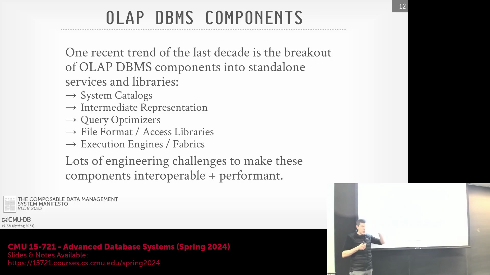
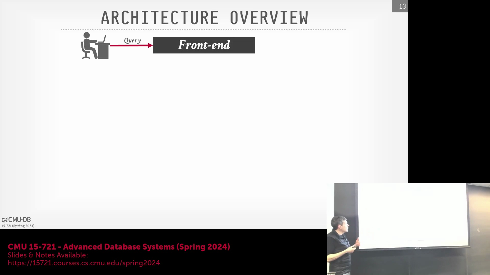
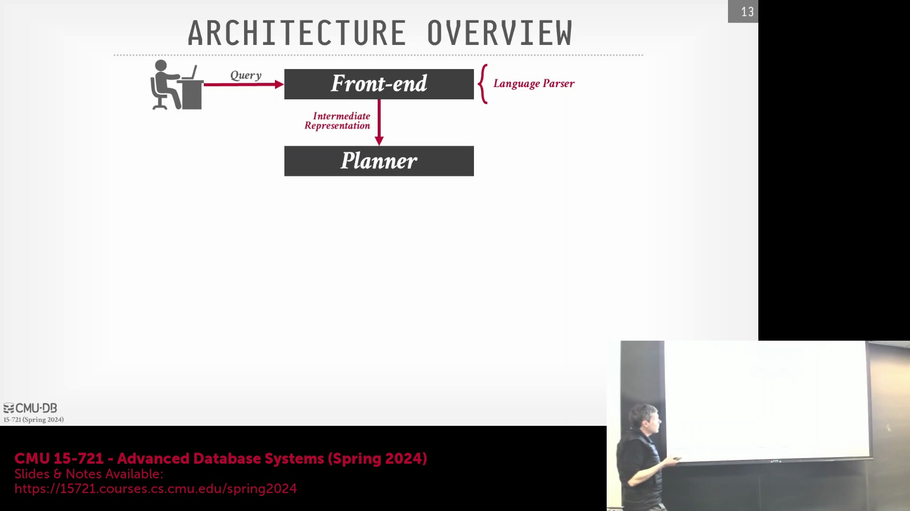
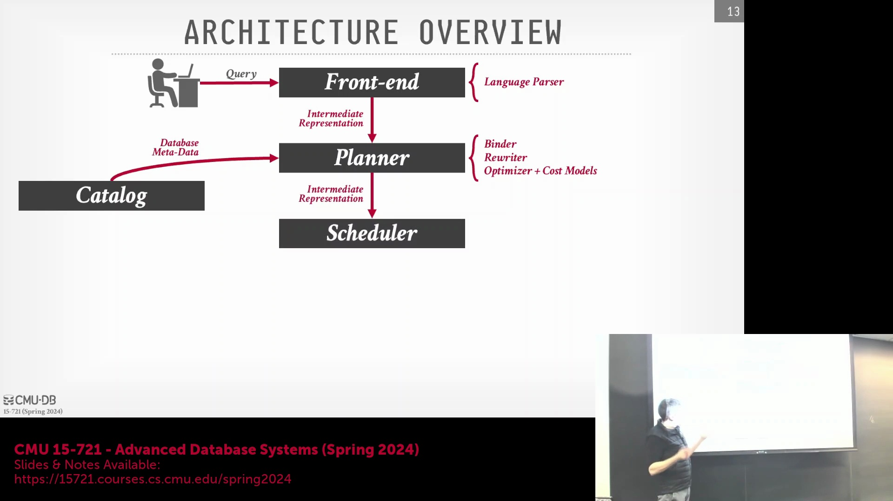
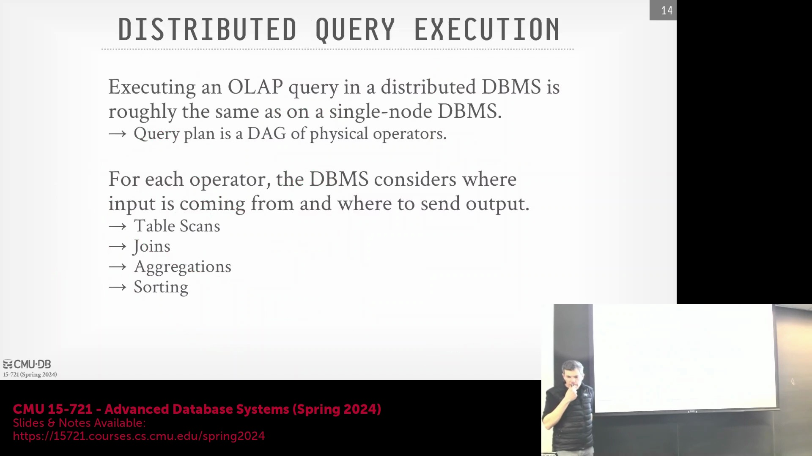
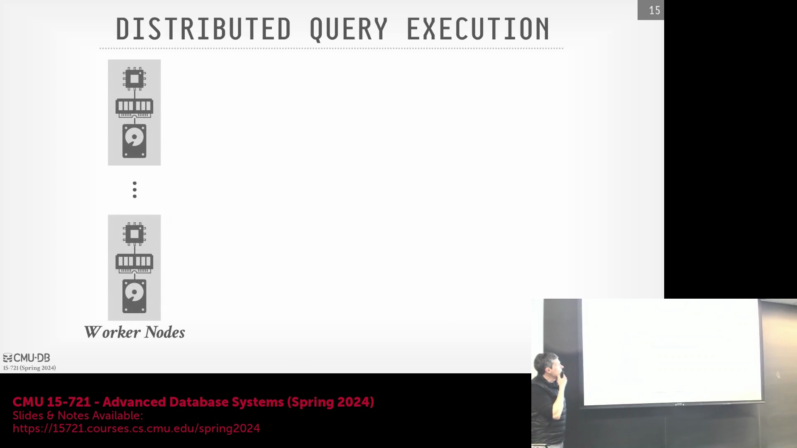

## 可组合数据库架构的挑战

通过组合现成组件来构建数据库系统会面临巨大的集成障碍。底层数据类型的不匹配，例如整数位宽(Integer Width)差异（32位 vs 64位）、定点小数(Fixed-point Number)处理逻辑不一致以及存储格式(Storage Format)各异，会迅速导致数据流水线(Data Pipeline)崩溃。尽管业界已有 Apache Ray 等分布式执行框架(Execution Framework)和各类文件标准，但历史上试图仅依赖现有 Java 库“组装”出生产级数据库的尝试，大多仍停留在学术实验阶段。现代研究（包括 Meta/Facebook 的 Velox 论文）主张转向专门构建的独立组件，这些组件通过稳定且定义明确的 API 进行互操作(Interoperability)，而非依赖松耦合(Loosely Coupled)的通用第三方库。

## 高级 OLAP 系统架构

现代 OLAP 系统的内部流水线(Internal Pipeline)遵循结构化的多阶段处理流程。用户向系统前端提交 SQL 查询后，查询解析器(Query Parser)会对其进行词法分析(Lexical Analysis)与语法解析，并将其转换为中间表示(Intermediate Representation, IR)。随后，IR 被传递给查询规划器(Query Planner)，该模块包含负责解析表与列引用的绑定器(Binder/Name Resolver)以及基于成本的优化器(Cost-Based Optimizer, CBO)。规划器高度依赖中央目录(Central Catalog)来验证数据库对象的存在性、检索模式定义(Schema Definition)，并获取用于成本估算(Cost Estimation)的数据统计信息(Statistics)。优化过程结束后，规划器将输出最终的物理执行计划(Physical Execution Plan)。

物理执行计划随后交由调度器(Scheduler)处理。调度器会评估数据局部性(Data Locality)与集群拓扑(Cluster Topology)，从而决定将特定任务分配至哪些计算节点执行。接着，调度器将拆解后的工作负载(Workload)分发给底层的执行引擎(Execution Engine)。当执行算子(Execution Operator)需要读取底层数据时，会通过专用的 I/O 服务(I/O Service)发起请求。该服务负责从持久化存储(Persistent Storage)（涵盖本地磁盘、Amazon S3 或分布式文件系统）中高效获取数据块(Data Block)。执行引擎对这些数据块进行计算处理后，会将最终结果沿执行路径流式传输(Streaming)回客户端或终端用户。

与此同时，系统内部维护着一个关键的元数据反馈循环(Metadata Feedback Loop)。为避免规划器重复实现繁琐的文件扫描逻辑，执行引擎会在查询运行期间（例如在执行顺序扫描(Sequential Scan)时）动态提取底层元数据。这些动态发现的信息（如文件级统计信息或模式推断(Schema Inference)结果）会自动回传并更新至中央目录。这一机制有效保障了目录的准确性与时效性，同时避免了在多个系统层级中重复编写 I/O 解析代码。

## 目录实现的复杂性
构建一个生产级(Production-Grade)的目录系统本身就是一项极具挑战性的工程任务。它必须满足事务完整性(Transaction Integrity)、高可用性容错(Fault Tolerance)以及高并发(High Concurrency)读写要求，因此通常需要依赖专门的元数据存储后端（例如 Snowflake 底层采用的 FoundationDB）。尽管增量更新(Incremental Update)和时间旅行(Time Travel)等高级湖仓一体(Lakehouse)特性极具商业价值，但系统开发的首要任务仍是夯实基础的执行引擎与健壮的目录服务。唯有在核心架构能够稳定可靠地完成查询解析、优化规划、任务调度与底层执行之后，才应在其之上叠加更高层级的数据湖仓管理功能。

## 单节点执行与查询计划结构

尽管现代 OLAP 平台普遍采用分布式架构，但深入理解查询执行(Query Execution)机制仍需从单节点(Single-Node)层面切入。现代 CPU 已广泛支持多核并行(Multi-core Parallelism)与非统一内存访问(Non-Uniform Memory Access, NUMA)架构，这使得分布式查询执行在核心逻辑上与单机并行高度一致，唯一的额外变量是跨节点通信带来的网络延迟(Network Latency)。在理想情况下，查询计划应被构建为由物理算子(Physical Operator)组成的有向无环图(Directed Acyclic Graph, DAG)。尽管部分传统数据库仍采用严格的树形结构(Tree Structure)，但 DAG 架构更具优势，因为它能够有效实现子查询(Subquery)与嵌套操作的计算复用(Computation Reuse)。传统的树形结构强制每个节点仅能拥有一个父节点，这种拓扑限制严重阻碍了中间结果(Intermediate Result)的高效共享。此外，在数据湖环境中，由于文件实际内容在扫描前往往不可见，查询优化阶段的初始成本估算(Initial Cost Estimation)极易出现偏差。引入自适应执行(Adaptive Execution)机制后，系统能够基于运行时的实时数据特征，动态重调优执行计划并重新分配计算资源。

## 工作节点与中间数据处理

在查询执行期间，各工作节点(Worker Node)将充分调用本地的 CPU、内存与磁盘资源，以处理分配到的查询片段(Query Fragment)。执行流程通常从计划树的叶节点(Leaf Node)（如全表顺序扫描）启动，工作节点负责从底层存储中拉取持久化的数据元组(Data Tuple)。随着各层算子的逐级运算，系统会不断产生中间结果(Intermediate Result)——这些临时数据流必须被高效、低延迟地传递至查询计划的后续处理阶段。精细化管理这些中间结果的生命周期(Lifecycle)、内存占用(Memory Footprint)以及节点间传输机制，是保障系统性能的核心。数据库内核必须精密编排算子间的数据流(Data Flow Orchestration)，实现计算任务的最优负载均衡，从而在最大化 CPU 并行度(CPU Parallelism)的同时，将 I/O 瓶颈(I/O Bottleneck)与内存开销(Memory Overhead)降至最低。