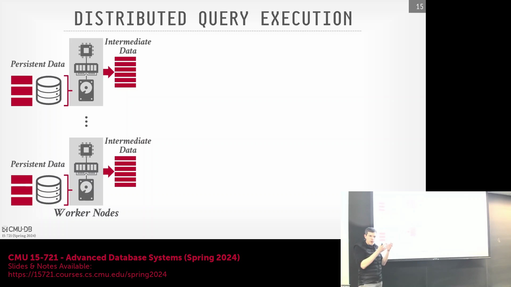
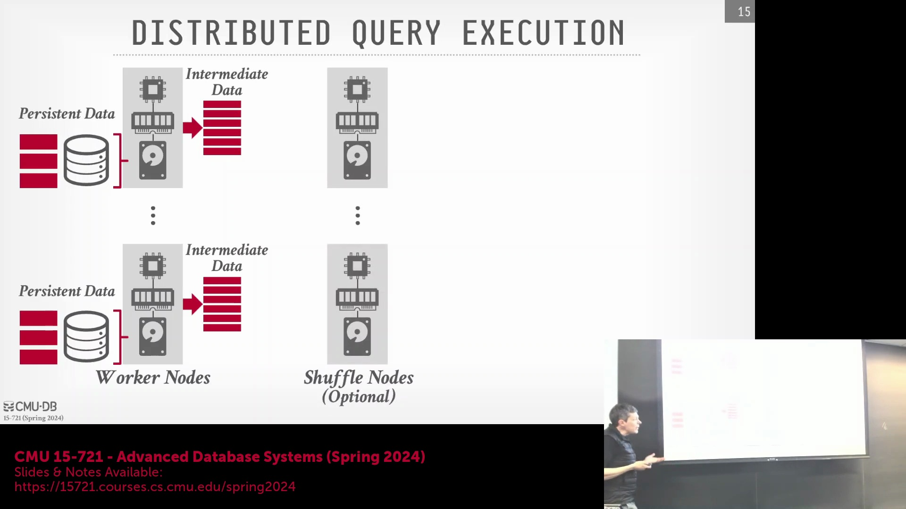
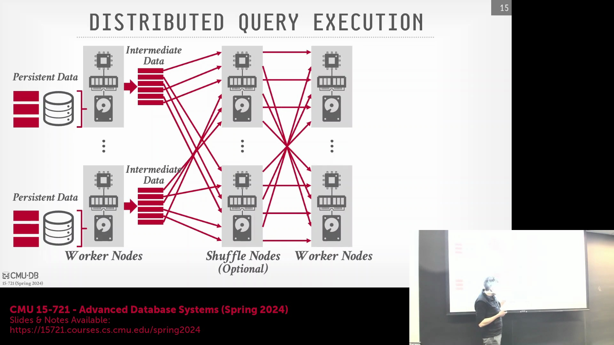
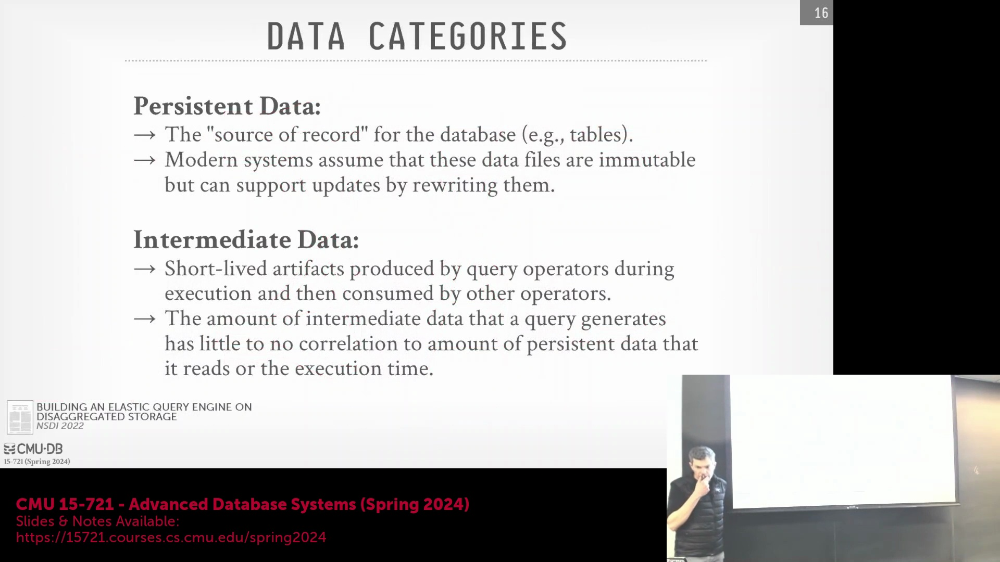

## 流水线执行与 Shuffle 架构

现代分布式查询执行(Distributed Query Execution)高度依赖流水线执行模型(Pipeline Execution Model)，工作节点(Worker Node)在该模型中持续处理数据流，直至遇到“流水线阻断点(Pipeline Breaker)”。在阻断点处，系统通常会引入 Shuffle 节点(Shuffle Node)以执行数据重分布(Data Redistribution)。系统基于指定的分区键(Partition Key)进行哈希计算(Hashing)，将数据路由至相应的 Shuffle 节点。这些节点充当高吞吐量(High-Throughput)的内存键值存储(Memory Key-Value Store)，在将数据转发至下一阶段的工作节点前对其进行暂存。BigQuery 与 Dremel 等云原生系统(Cloud-Native System)广泛采用此架构，部分系统甚至部署专用硬件以确保 Shuffle 操作完全在内存中完成(In-Memory Shuffle)，从而实现快速弹性扩缩容(Elastic Scaling)与执行计划的动态调整。

## 流式 Shuffle 与自适应资源扩缩容
Shuffle 阶段是自适应查询执行(Adaptive Query Execution)的关键控制点。与传统批处理框架(Batch Processing Framework)（如 Hadoop MapReduce）要求必须完全累积(Accumulate) Shuffle 数据后方可进入下一阶段不同，现代 OLAP 引擎采用流式传输(Streaming)方式持续处理 Shuffle 数据。这使得系统能够实时监控实际数据量与优化器初始基数估算(Cardinality Estimation)之间的偏差。若中间数据集(Intermediate Dataset)出现意外膨胀，调度器(Scheduler)可动态弹性调配工作节点资源，或实时修改下游执行计划。尽管架构图为简化起见通常将 Shuffle 节点与工作节点绘制为 1:1 的映射关系，但实际生产系统会将这两类资源池彻底解耦(Resource Pool Decoupling)，以高效应对中间数据规模远超原始持久化表(Persistent Table)的复杂查询负载。

## 查询感知调度与基础设施编排的对比
负责统筹分布式执行的是数据库内置的调度器(Scheduler)与协调器(Coordinator)，其运行机制与 Kubernetes 等基础设施编排器(Infrastructure Orchestrator)存在本质差异。Kubernetes 主要关注 Pod 的存活状态(Liveness)、资源配额(Resource Quota)及容器重启策略(Container Restart Policy)；而数据库查询调度器则具备深度的查询级细粒度可见性(Query-Level Visibility)。它持续监控算子执行进度(Operator Progress)、中间数据生成速率(Intermediate Data Generation Rate)以及工作节点的实时负载。这种具备应用感知能力(Application-Aware)的协调机制，对于实现任务故障恢复(Failure Recovery)、动态缓解数据倾斜(Data Skew)，以及确保底层物理执行(Physical Execution)严格遵循查询优化器(Query Optimizer)的预设意图至关重要。

## 持久化存储与中间数据生命周期的对比

云原生数据库架构的核心差异之一，在于如何分别管理持久化数据(Persistent Data)与中间结果(Intermediate Result)。持久化数据作为系统的权威数据源(Authoritative Data Source)，通常托管于 Amazon S3 等不可变对象存储(Immutable Object Storage)中。由于对象存储底层不支持原位修改(In-Place Modification)，现代系统普遍依赖仅追加(Append-Only)的日志结构存储格式(Log-Structured Storage Format)，并在写入前对更新进行批量合并(Batch Compaction)。相比之下，中间数据属于生命周期短暂且具备查询作用域(Query-Scoped)的临时产物。因其在查询结束后即被自动回收，故无需满足严格的持久化(Persistence)与强容错(Fault Tolerance)要求。系统通常将中间结果暂存于本地内存(Local Memory)或固态硬盘(SSD)中，当遭遇节点故障时，优先采用数据重算(Recomputation)或任务重路由(Task Rerouting)策略进行优雅恢复，而非维护高成本的冗余副本(Redundant Replica)。

## 不可预测的中间数据与优化挑战
来自 Snowflake 等大型云数据平台的实证研究(Empirical Study)表明，持久化输入规模(Persistent Input Size)、查询执行耗时(Query Execution Duration)与实际生成的中间数据量(Intermediate Data Volume)之间并不存在严格的线性相关性。一个在逻辑上看似轻量级的查询，可能在执行过程中意外生成极其庞大的中间结果集(Intermediate Result Set)。这种高度不可预测性显著增加了静态查询优化(Static Query Optimization)的复杂度，尤其是在连接算法(Join Algorithm)的选择上。系统究竟应采用标准哈希连接(Hash Join)，还是最坏情况最优连接(Worst-Case Optimal Join, WCOJ)策略，往往高度依赖运行时反馈(Runtime Feedback)。这也为本课程后续将深入探讨的高级自适应执行技术(Advanced Adaptive Execution Techniques)埋下了伏笔。

## 数据传输范式：Push 与 Pull 模型
算子间的数据移动策略(Data Movement Strategy)在很大程度上取决于计算逻辑的执行位置。在历史上，无共享架构(Shared-Nothing Architecture)普遍倾向于“将计算推向数据(Move-Compute-to-Data)”的推送模型(Push Model)。由于查询计划(Query Plan)的体积通常比底层数据集小数个数量级，将执行逻辑分发至邻近数据的计算节点、在本地完成数据处理并仅返回过滤后的中间结果，是一种极为高效的做法。在本地磁盘 I/O 吞吐远高于跨节点网络带宽的时代，该策略有效规避了网络带宽瓶颈(Network Bandwidth Bottleneck)。然而，现代对象存储(Object Storage)仅暴露基础的读写 API，缺乏近数据计算(Near-Data Computing)能力。因此，系统无法将执行逻辑直接推送至 S3 等存储层，而必须转向“将数据拉取至计算端(Pull-Data-to-Compute)”的拉取模型(Pull Model)，将原始数据块(Data Block)迁移至专用计算节点进行处理。随着高速云网络(High-Speed Cloud Network)的普及，推送(Push)与拉取(Pull)模型之间的界限日益模糊，进而催生了混合执行架构(Hybrid Execution Architecture)。该架构能够根据实时的集群拓扑(Cluster Topology)与存储性能特征，动态择优切换最高效的数据移动范式。