## 课程介绍与学期规划
欢迎来到卡内基梅隆大学高级数据库系统(Advanced Database Systems)课程。本课程在配有现场观众的演播室中录制完成。第一讲旨在提供宏观概览，并为整个学期的学习奠定基础知识背景。课程将涵盖构建现代数据库系统(Modern Database Systems)各核心组件的基本原理，这些内容将直接支撑本学期后期的实践项目(Hands-on Project)。 

## 确立现代 OLAP 架构的背景
课程将从数据库系统(Database Systems)的历史演进讲起，追溯该行业如何发展至如今广泛应用于现代在线分析处理(OLAP)工作负载(Workload)的主流架构。我们将探讨高层级架构决策，剖析核心系统设计挑战，并逐步梳理查询执行(Query Execution)的端到端(End-to-End)生命周期。作为一门研究生课程(Graduate Course)，我们鼓励大家在整个学期中积极参与讨论并踊跃提问。

## OLTP 与 OLAP：理解工作负载的差异
理解两者差异的一个关键起点，是区分在线事务处理(OLTP)与在线分析处理(OLAP)系统。OLTP数据库充当直接面向用户或应用程序的业务操作前端，其首要目标是实现新事务数据的高速摄入(Ingestion)与存储。随着数据不断积累，系统重心便转向OLAP。OLAP的核心目标是查询已存储的数据，以提取业务洞察、发现潜在趋势，并驱动明智的商业或机构决策。本学期的课程将重点围绕如何针对此类分析型查询(Analytical Query)任务进行系统优化展开。

## 历史架构：单体数据库与数据立方体
历史上，分析型工作负载通常在PostgreSQL、MySQL或SQLite等单体数据库系统(Monolithic Database Systems)上运行。这类系统将所有的查询执行(Query Execution)与存储子系统(Storage Subsystems)打包于单一软件中，并依赖于采用集中式磁盘管理的行存架构(Row-store Architecture)。尽管行存架构在快速事务写入方面极为高效，但在OLAP场景下却表现不佳：因为即便查询仅需访问少数几列，系统仍会读取完整的数据页(Data Page)与整行记录。为缓解这一I/O低效问题，早期系统引入了“数据立方体”(Data Cubes)——即预计算(Pre-computed)的多维聚合数组（其功能类似于物化视图(Materialized Views)）。这些数据立方体需人工维护，通常通过`cron`任务在夜间定期刷新；但其优势在于允许分析查询直接命中预聚合数据，从而显著加快查询响应。在行业架构再次演进之前，主流关系型数据库管理系统(Relational Database Management Systems, RDBMS)厂商曾广泛采用此方案。

## 专用数据仓库的崛起
21世纪初至中期，行业重心转向了专为分析型工作负载设计的专用数据仓库(Dedicated Data Warehouses)。尽管许多知名系统（包括Redshift、Vertica和Greenplum）最初均源自PostgreSQL的代码分支(Fork)，但它们从根本上移除了传统的行式存储与执行引擎，转而采用专为OLAP优化的列式架构(Columnar Architecture)。另一些系统（如MonetDB）则是完全从零开始构建的，后续广受欢迎的DuckDB亦衍生自其生态。这些现代系统通常采用“无共享”(Shared-Nothing)架构：每个计算节点(Compute Node)独立管理自身的CPU、内存与磁盘资源，并负责处理全局数据集的特定数据分区(Data Partition)。

## ETL 管道与数据仓库部署
在实际生产环境中，此类架构高度依赖结构化的数据摄入管道(Data Ingestion Pipeline)。来自OLTP系统的业务数据需经过提取、转换与加载(Extract, Transform, Load / ETL)流程后，方可汇入集中式数据仓库。该流程负责捕获增量变更、执行数据清洗与实体解析(Entity Resolution)，进而构建出统一的全局信息视图。由于传统数据仓库对底层专有存储格式与计算资源分配实行严格控制，因此在导入任何数据前，必须预先完成数据模式(Schema)设计与硬件资源调配。这种预先配置(Pre-provisioned)且基于无共享架构的部署模式，主导了数据仓库时代多年的技术发展。

---

## 无共享架构的局限与共享磁盘架构的崛起
传统的无共享架构(Shared-Nothing Architecture)数据仓库面临显著的扩展瓶颈(Scalability Bottleneck)，因为扩容(Scaling Out)不仅需要增加计算节点，还会触发复杂且成本高昂的数据重分布(Data Redistribution)。20世纪末至21世纪初，行业开始转向共享磁盘架构(Shared-Disk Architecture)以突破这一限制。通过将计算与存储解耦(Compute-Storage Decoupling)，数据库系统将数据持久化(Data Persistence)任务卸载(Offload)至外部服务（如云对象存储(Cloud Object Storage)，例如 AWS S3）。这种架构分离使得计算层能够独立扩展(Scale Independently)并实现高度优化，而无需直接管理底层存储机制。
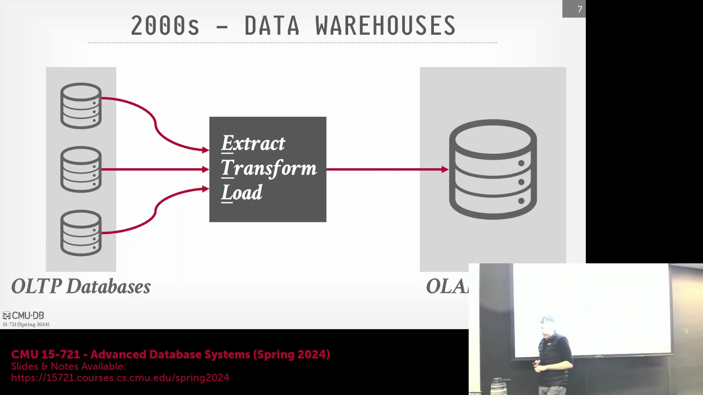
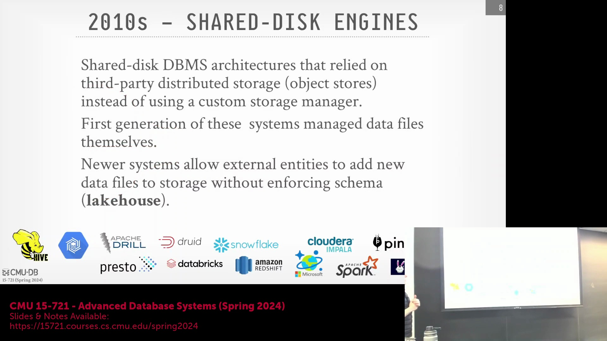

## 从专有数据仓库到开放湖仓系统
由 Snowflake 开创的第一代共享磁盘系统采用专有格式(Proprietary Format)将数据存储在对象存储中，导致这些数据仅能通过其特定的查询引擎(Query Engine)进行访问。现代演进版本则被冠以“湖仓一体”(Lakehouse)架构之名，全面转向开放标准(Open Standards)。用户不再受限于必须通过数据库专用接口摄入数据，而是可以直接将原始文件写入对象存储，并在中央目录(Central Catalog)中进行元数据注册。随后，查询引擎便能无缝读取这些文件，从而将数据湖(Data Lake)的灵活性与低成本优势，与传统数据仓库的数据治理能力、高性能及模式(Schema)控制能力完美结合。

## 市场繁荣与系统差异化
分析型数据库(Analytical Database)领域竞争异常激烈，这主要源于数据基础设施(Data Infrastructure)巨大的商业价值，以及云厂商生态系统带来的供应商锁定效应(Vendor Lock-in)。许多知名系统最初仅为科技巨头内部使用的数据平台（例如 Facebook 的 Presto、LinkedIn 的 Pinot），随后才剥离为独立的开源项目(Open Source Projects)。尽管底层的存储引擎(Storage Engine)与执行引擎(Execution Engine)在技术上已趋于同质化，成为基础标配，但真正的产品差异化(Differentiation)如今主要体现在用户体验、云原生集成能力，以及最关键的一点——查询优化器(Query Optimizer)的先进程度。尽管终端用户主要与顶层应用接口交互，但深入掌握这些底层内部机制对于系统开发者而言依然至关重要。
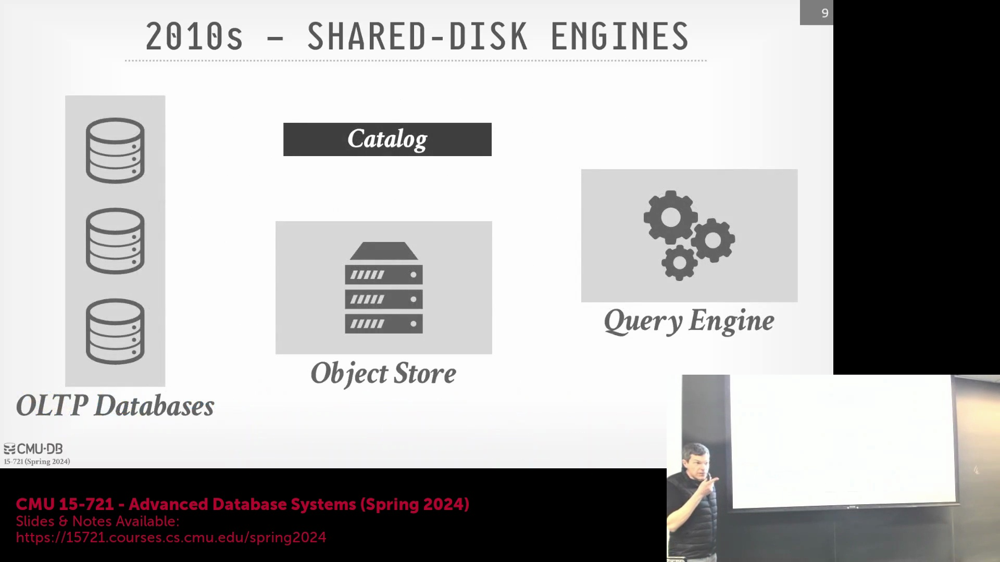

## 数据湖与湖仓一体：架构澄清
“数据湖”(Data Lake)本质上仅指原始的对象存储层，文件在此以无强制结构的方式存放，这将模式发现(Schema Discovery)与数据解析的负担全部推给了下游的查询端（即“读时模式” Schema-on-Read）。湖仓一体架构在此基础上引入了自动化目录管理、模式强制约束(Schema Enforcement)以及统一的管理控制平面。湖仓系统无需在不同服务间手动同步元数据，而是能够自动追踪文件位置、处理模式演进(Schema Evolution)，并基于底层原始文件提供无缝的、类传统数据库的查询体验。

## 核心 OLAP 架构与课程重点
在现代分析型数据管道(Analytical Data Pipeline)中，业务操作型(OLTP)数据库的数据通过 ETL 流程或流式中间件，被持续路由(Routing)至集中的对象存储层。目录服务(Catalog Service)持续追踪文件位置与数据模式，使解耦的查询引擎能够实时获取元数据(Metadata)，并直接下推查询至存储层执行分析操作。本学期的课程将重点聚焦于该查询引擎的设计与性能优化——它是连接元数据目录与底层存储的核心 OLAP 组件。这一架构范式(Architectural Paradigm)由 Google Dremel 等先驱系统开创，后经 Snowflake 成功商业化，已成为过去十年来业界的主流架构标准。
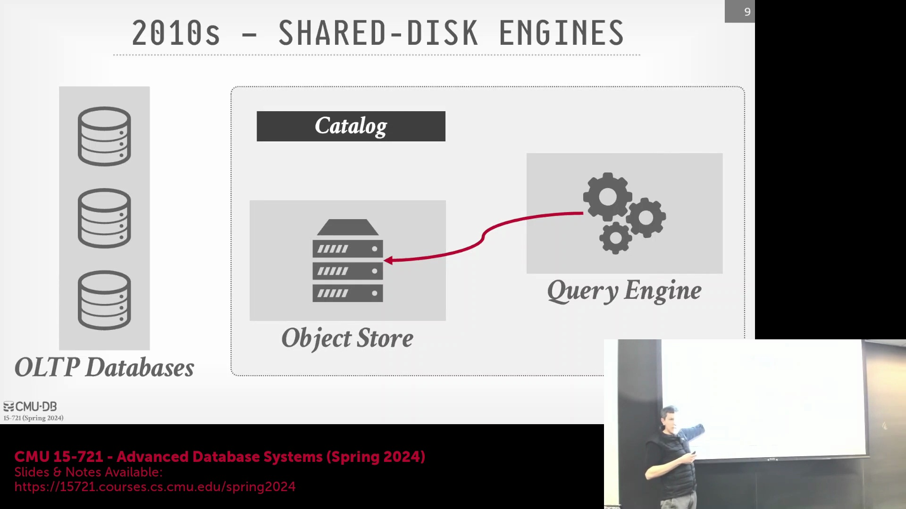

## 管理数据新鲜度与事务性更新
不可变对象存储(Immutable Object Storage)面临的一大核心挑战是如何处理数据的持续更新，同时避免产生数据过期(Stale Data)或存储碎片化问题。现代湖仓系统通过在底层文件存储之上实现符合 ACID 标准的事务处理能力(Transactional Capabilities)（涵盖插入、更新与删除操作）来解决此难题。具体而言，系统通常采用追加轻量级事务日志(Transaction Log)的方式来追踪数据变更，随后在后台异步运行压缩合并(Compaction)任务。该任务负责合并增量更新、清理过期记录，并重写优化后的列式文件格式(Columnar File Format)（如 Parquet）。这种日志结构合并(Log-Structured Merge)方法在保障查询数据新鲜度(Data Freshness)的同时，完整保留了现代分析型列存格式的高吞吐读取性能优势。

---

## 现代数据湖基础设施与目录系统
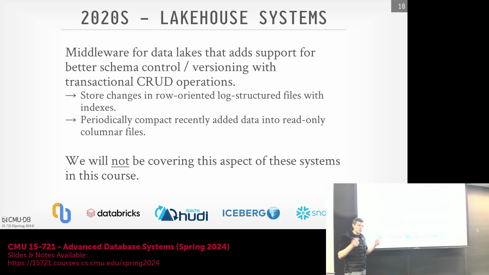
数据通常以 Parquet 等格式存储在数据湖(Data Lake)中，或托管于 Databricks 的 Delta Lake 等专业系统内。这些系统接收 Parquet 文件并将其写入对象存储(Object Storage)，同时更新目录(Catalog)以追踪数据的最新版本。它们能够自动处理模式(Schema)变更，并提供额外的基础设施，确保对象存储层能够维护精确的内容元数据(Metadata)。业内知名的实现包括 Delta Lake、Uber 开源的 Hudi、Netflix 开源的 Iceberg、Snowflake 的混合表(Hybrid Tables)，以及谷歌内部正在逐步对外公开的 Napa 系统。

## 课程重点与核心设计原则
尽管目录与增量更新(Delta-Update)架构在工业界至关重要，但本学期课程不会对其进行深入探讨。课程的核心重心仍将聚焦于查询执行(Query Execution)的性能优化，增量更新机制将在后续章节中展开。不过，近期研究论文中提出的一些基础性洞见将贯穿始终，用以指导本课程中的系统设计决策。牢记这些设计原则，不仅对构建数据库内核(Database Kernel)大有裨益，也能在未来的工程实践中，帮助大家为特定场景甄选出最合适的联机分析处理(OLAP)系统。
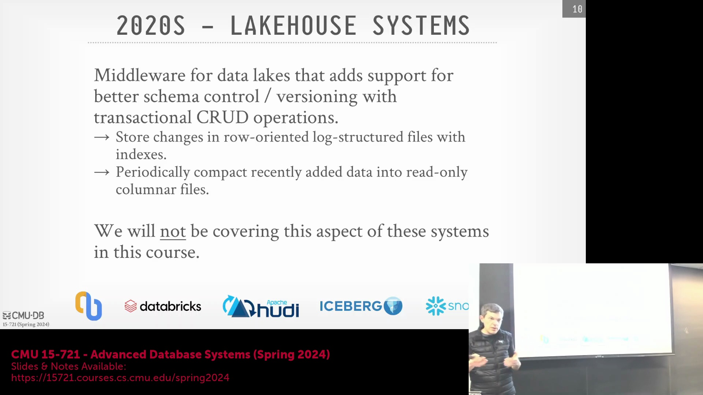
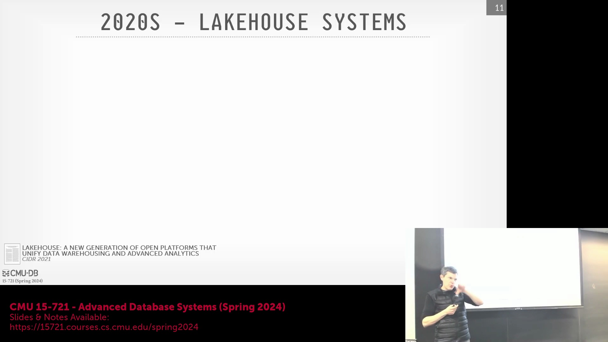

## 趋势一：超越传统 SQL 的多样化工作负载
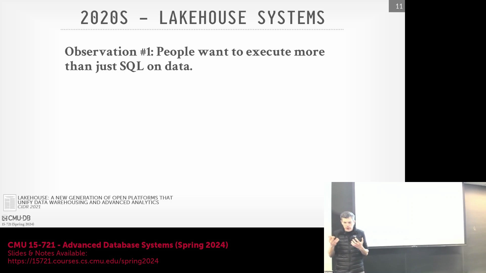
现代企业越来越多地需要处理传统结构化查询语言(SQL)之外的多样化工作负载。尽管 SQL 仍是数据查询的首选语言，但在实际生产环境中，数据科学家(Data Scientist)频繁在交互式 Notebook 环境中，依托 PyTorch 与 TensorFlow 等框架运行机器学习(Machine Learning)任务。与标准的 OLAP 查询相比，这类机器学习工作负载呈现出截然不同的数据访问模式(Data Access Pattern)。例如，相较于传统的 JDBC/ODBC 驱动进行结果集转换，工程师们更倾向于采用 Apache Arrow 等内存原生格式(Memory-Native Format)进行批量数据导出。尽管机器学习与 SQL 工作负载在后端查询规划器(Query Planner)与执行引擎(Execution Engine)层面存在共性，但前端 API 与数据访问接口的设计必须具备足够的灵活性，以适配这些日益多样化的需求。
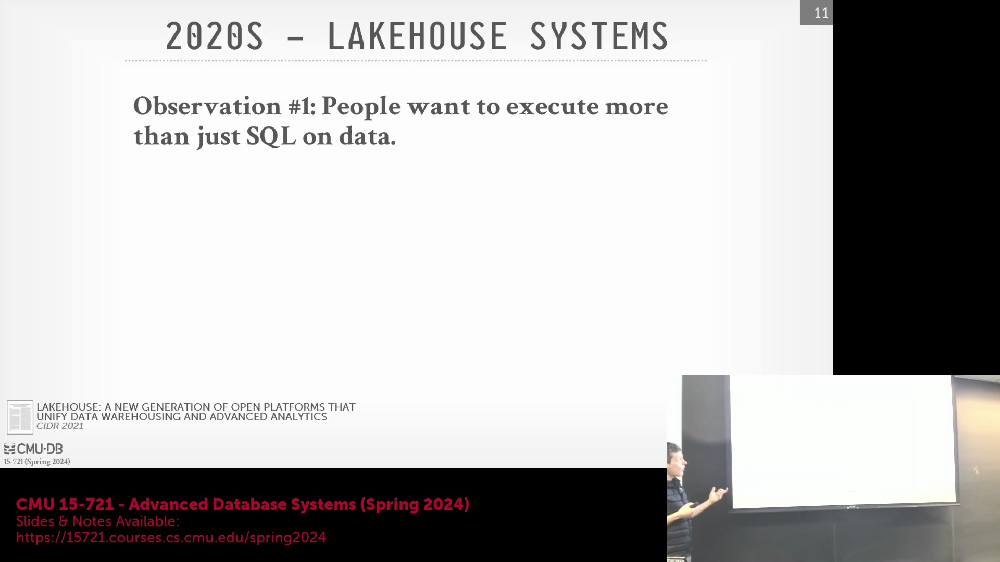

## 趋势二：共享磁盘架构与目录治理
向共享磁盘(Shared-Disk)架构的演进（即将数据直接存放于 Amazon S3 等对象存储中）削弱了对数据摄入(Data Ingestion)与访问的强管控。由于数据可直接写入云存储，而无需经由传统的数据库前端网关，过去严格的管控流程已不再是硬性约束。然而，维护一个健壮的目录(Catalog)系统对于追踪模式(Schema)演进、管理文件版本以及清晰掌握底层存储中的实际数据资产依然至关重要。这种以目录为中心(Catalog-Centric)的治理范式，在系统灵活性与必要的数据管控之间取得了良好平衡。
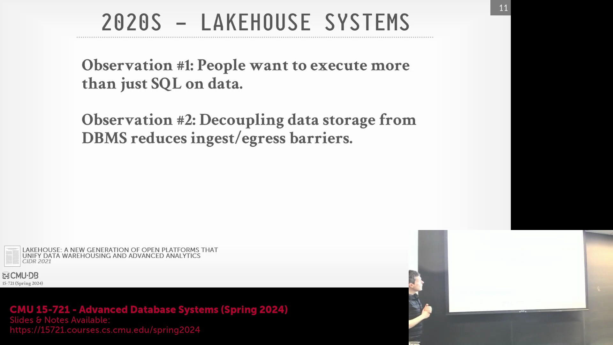

## 趋势三：处理非结构化与半结构化数据
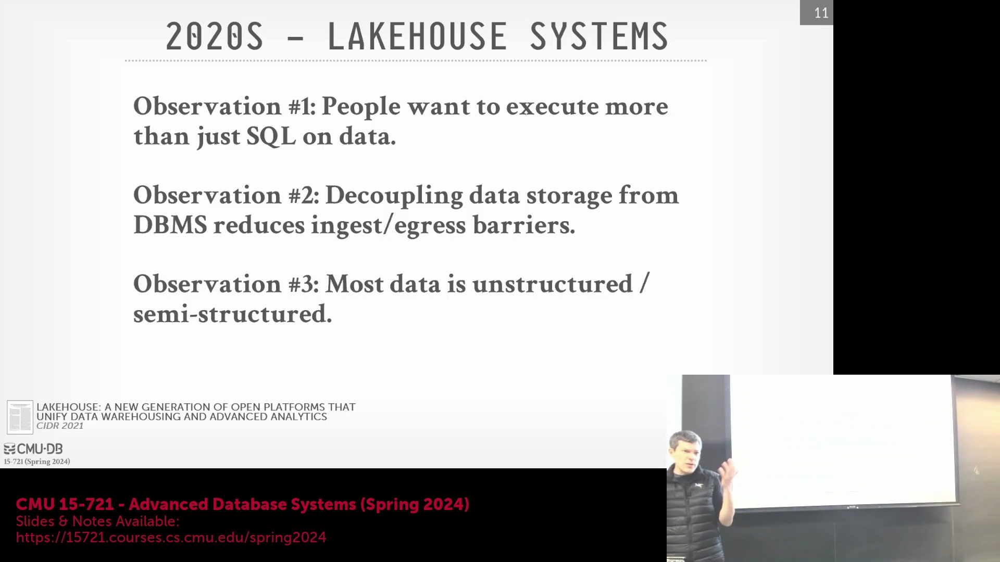
现代企业数据中有相当大比例属于非结构化数据(Unstructured Data)（如图像、视频文件）或半结构化数据(Semi-structured Data)（如 JSON 日志、包含文本嵌入 Embedding 的混合元组）。虽然非结构化数据通常需借助 Transformer 等外部机器学习(Machine Learning)框架来提取结构化特征，但半结构化数据则对数据库系统提出了直接的技术挑战。即便数据已存储在 Parquet 或 ORC 等经过高度优化的文件格式中，系统仍须高效地解析并查询其中的嵌套(Nested)或不规则结构。各大厂商的应对策略各有侧重：Snowflake 通常倾向于在数据摄入(Data Ingestion)阶段进行显式的列展开与物化，而 Databricks 则可能采用动态(On-the-fly)解析技术。本课程后续将对这些核心策略展开深入探讨。
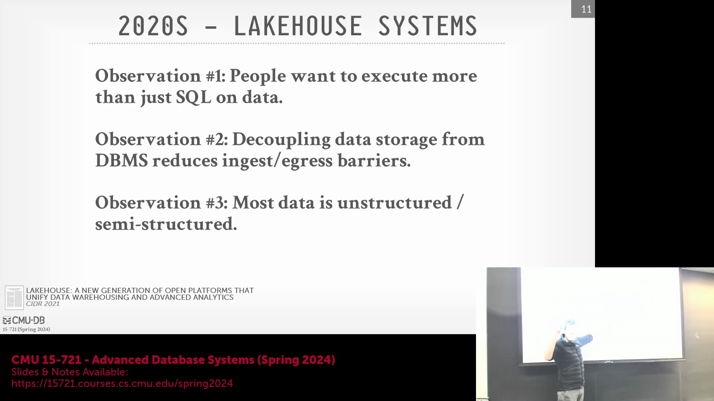

## 从单体架构向可组合数据库服务的转变

在过去十年间，行业趋势已逐渐从单体(Monolithic)数据库系统，转向由独立服务或组件拼装而成的可组合(Composable)架构。只要各组件均能提供稳定且定义清晰的应用程序接口(API)，它们便可实现独立开发、无缝替换或采用成熟的第三方方案。这与 PostgreSQL、DuckDB 或 SQLite 等传统数据库形成鲜明对比，后者的核心模块（如查询解析器(Parser)、优化器(Optimizer)、目录(Catalog)等）通常由单一团队紧密耦合、从零构建。可组合架构虽然带来了更高的系统灵活性与更短的开发迭代周期，但同时也引入了全新的工程权衡(Engineering Trade-offs)。
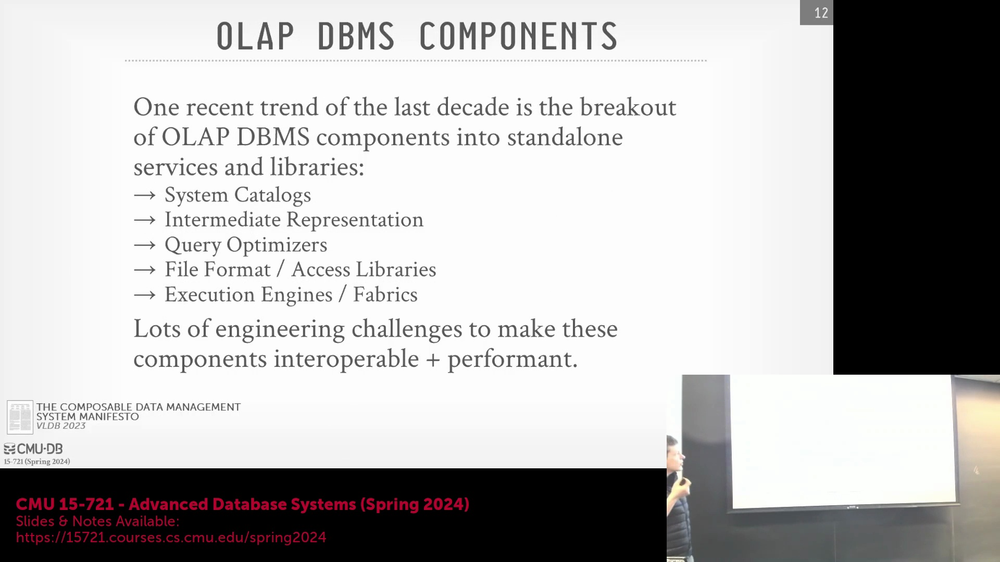

## 组件集成与抽象层成本的挑战
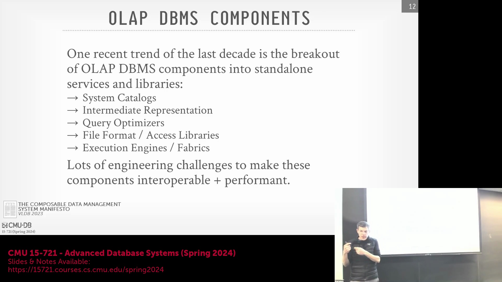
集成独立组件必然因引入额外的抽象层(Abstraction Layer)而产生性能开销。当系统的全局状态与优化知识被割裂至不同服务时，整体性能优化往往只能妥协于各组件间兼容性的最低标准。构建或集成独立的查询优化器(Query Optimizer)等复杂组件（如 Apache Calcite、ORCA）向来以技术门槛极高著称，因为它们内部携带的隐式假设(Implicit Assumptions)极少能与外部系统完美契合。如何使这些服务实现高效通信——突破基础的 RESTful 或 HTTP 协议限制——并在此过程中规避协议不匹配与性能瓶颈，依然是业界一项重大且极具挑战性的系统工程难题。

## 中间表示与数据类型同步
可组合数据库设计的一个核心环节，是明确定义用于组件间信息交换的中间表示(Intermediate Representation, IR)。例如，当查询优化器(Query Optimizer)将生成的执行计划(Execution Plan)传递给任务调度器(Scheduler)时，双方必须对查询结构与操作符的内部表示达成严格一致。此外，数据类型(Data Type)定义必须在服务边界处进行强制同步；若独立开发的组件在整数位宽或类型定义上出现偏差，极易引发静默失败(Silent Failure)或严重的性能衰退。建立统一的中间表示规范与严格的类型契约(Type Contract)，是利用模块化组件构建连贯、高性能数据库系统的基石。
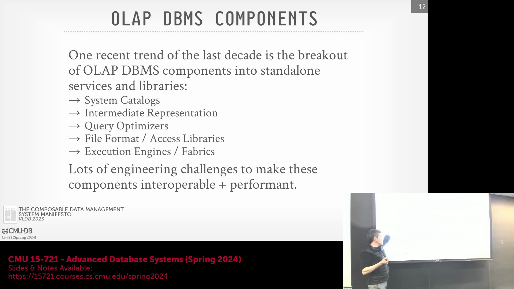

---

## 可组合数据库架构的挑战

通过组合现成组件来构建数据库系统会面临巨大的集成障碍。底层数据类型的不匹配，例如整数位宽(Integer Width)差异（32位 vs 64位）、定点小数(Fixed-point Number)处理逻辑不一致以及存储格式(Storage Format)各异，会迅速导致数据流水线(Data Pipeline)崩溃。尽管业界已有 Apache Ray 等分布式执行框架(Execution Framework)和各类文件标准，但历史上试图仅依赖现有 Java 库“组装”出生产级数据库的尝试，大多仍停留在学术实验阶段。现代研究（包括 Meta/Facebook 的 Velox 论文）主张转向专门构建的独立组件，这些组件通过稳定且定义明确的 API 进行互操作(Interoperability)，而非依赖松耦合(Loosely Coupled)的通用第三方库。

## 高级 OLAP 系统架构

现代 OLAP 系统的内部流水线(Internal Pipeline)遵循结构化的多阶段处理流程。用户向系统前端提交 SQL 查询后，查询解析器(Query Parser)会对其进行词法分析(Lexical Analysis)与语法解析，并将其转换为中间表示(Intermediate Representation, IR)。随后，IR 被传递给查询规划器(Query Planner)，该模块包含负责解析表与列引用的绑定器(Binder/Name Resolver)以及基于成本的优化器(Cost-Based Optimizer, CBO)。规划器高度依赖中央目录(Central Catalog)来验证数据库对象的存在性、检索模式定义(Schema Definition)，并获取用于成本估算(Cost Estimation)的数据统计信息(Statistics)。优化过程结束后，规划器将输出最终的物理执行计划(Physical Execution Plan)。

物理执行计划随后交由调度器(Scheduler)处理。调度器会评估数据局部性(Data Locality)与集群拓扑(Cluster Topology)，从而决定将特定任务分配至哪些计算节点执行。接着，调度器将拆解后的工作负载(Workload)分发给底层的执行引擎(Execution Engine)。当执行算子(Execution Operator)需要读取底层数据时，会通过专用的 I/O 服务(I/O Service)发起请求。该服务负责从持久化存储(Persistent Storage)（涵盖本地磁盘、Amazon S3 或分布式文件系统）中高效获取数据块(Data Block)。执行引擎对这些数据块进行计算处理后，会将最终结果沿执行路径流式传输(Streaming)回客户端或终端用户。

与此同时，系统内部维护着一个关键的元数据反馈循环(Metadata Feedback Loop)。为避免规划器重复实现繁琐的文件扫描逻辑，执行引擎会在查询运行期间（例如在执行顺序扫描(Sequential Scan)时）动态提取底层元数据。这些动态发现的信息（如文件级统计信息或模式推断(Schema Inference)结果）会自动回传并更新至中央目录。这一机制有效保障了目录的准确性与时效性，同时避免了在多个系统层级中重复编写 I/O 解析代码。

## 目录实现的复杂性
构建一个生产级(Production-Grade)的目录系统本身就是一项极具挑战性的工程任务。它必须满足事务完整性(Transaction Integrity)、高可用性容错(Fault Tolerance)以及高并发(High Concurrency)读写要求，因此通常需要依赖专门的元数据存储后端（例如 Snowflake 底层采用的 FoundationDB）。尽管增量更新(Incremental Update)和时间旅行(Time Travel)等高级湖仓一体(Lakehouse)特性极具商业价值，但系统开发的首要任务仍是夯实基础的执行引擎与健壮的目录服务。唯有在核心架构能够稳定可靠地完成查询解析、优化规划、任务调度与底层执行之后，才应在其之上叠加更高层级的数据湖仓管理功能。

## 单节点执行与查询计划结构

尽管现代 OLAP 平台普遍采用分布式架构，但深入理解查询执行(Query Execution)机制仍需从单节点(Single-Node)层面切入。现代 CPU 已广泛支持多核并行(Multi-core Parallelism)与非统一内存访问(Non-Uniform Memory Access, NUMA)架构，这使得分布式查询执行在核心逻辑上与单机并行高度一致，唯一的额外变量是跨节点通信带来的网络延迟(Network Latency)。在理想情况下，查询计划应被构建为由物理算子(Physical Operator)组成的有向无环图(Directed Acyclic Graph, DAG)。尽管部分传统数据库仍采用严格的树形结构(Tree Structure)，但 DAG 架构更具优势，因为它能够有效实现子查询(Subquery)与嵌套操作的计算复用(Computation Reuse)。传统的树形结构强制每个节点仅能拥有一个父节点，这种拓扑限制严重阻碍了中间结果(Intermediate Result)的高效共享。此外，在数据湖环境中，由于文件实际内容在扫描前往往不可见，查询优化阶段的初始成本估算(Initial Cost Estimation)极易出现偏差。引入自适应执行(Adaptive Execution)机制后，系统能够基于运行时的实时数据特征，动态重调优执行计划并重新分配计算资源。

## 工作节点与中间数据处理

在查询执行期间，各工作节点(Worker Node)将充分调用本地的 CPU、内存与磁盘资源，以处理分配到的查询片段(Query Fragment)。执行流程通常从计划树的叶节点(Leaf Node)（如全表顺序扫描）启动，工作节点负责从底层存储中拉取持久化的数据元组(Data Tuple)。随着各层算子的逐级运算，系统会不断产生中间结果(Intermediate Result)——这些临时数据流必须被高效、低延迟地传递至查询计划的后续处理阶段。精细化管理这些中间结果的生命周期(Lifecycle)、内存占用(Memory Footprint)以及节点间传输机制，是保障系统性能的核心。数据库内核必须精密编排算子间的数据流(Data Flow Orchestration)，实现计算任务的最优负载均衡，从而在最大化 CPU 并行度(CPU Parallelism)的同时，将 I/O 瓶颈(I/O Bottleneck)与内存开销(Memory Overhead)降至最低。

---

## 流水线执行与 Shuffle 架构

现代分布式查询执行(Distributed Query Execution)高度依赖流水线执行模型(Pipeline Execution Model)，工作节点(Worker Node)在该模型中持续处理数据流，直至遇到“流水线阻断点(Pipeline Breaker)”。在阻断点处，系统通常会引入 Shuffle 节点(Shuffle Node)以执行数据重分布(Data Redistribution)。系统基于指定的分区键(Partition Key)进行哈希计算(Hashing)，将数据路由至相应的 Shuffle 节点。这些节点充当高吞吐量(High-Throughput)的内存键值存储(Memory Key-Value Store)，在将数据转发至下一阶段的工作节点前对其进行暂存。BigQuery 与 Dremel 等云原生系统(Cloud-Native System)广泛采用此架构，部分系统甚至部署专用硬件以确保 Shuffle 操作完全在内存中完成(In-Memory Shuffle)，从而实现快速弹性扩缩容(Elastic Scaling)与执行计划的动态调整。

## 流式 Shuffle 与自适应资源扩缩容
Shuffle 阶段是自适应查询执行(Adaptive Query Execution)的关键控制点。与传统批处理框架(Batch Processing Framework)（如 Hadoop MapReduce）要求必须完全累积(Accumulate) Shuffle 数据后方可进入下一阶段不同，现代 OLAP 引擎采用流式传输(Streaming)方式持续处理 Shuffle 数据。这使得系统能够实时监控实际数据量与优化器初始基数估算(Cardinality Estimation)之间的偏差。若中间数据集(Intermediate Dataset)出现意外膨胀，调度器(Scheduler)可动态弹性调配工作节点资源，或实时修改下游执行计划。尽管架构图为简化起见通常将 Shuffle 节点与工作节点绘制为 1:1 的映射关系，但实际生产系统会将这两类资源池彻底解耦(Resource Pool Decoupling)，以高效应对中间数据规模远超原始持久化表(Persistent Table)的复杂查询负载。

## 查询感知调度与基础设施编排的对比
负责统筹分布式执行的是数据库内置的调度器(Scheduler)与协调器(Coordinator)，其运行机制与 Kubernetes 等基础设施编排器(Infrastructure Orchestrator)存在本质差异。Kubernetes 主要关注 Pod 的存活状态(Liveness)、资源配额(Resource Quota)及容器重启策略(Container Restart Policy)；而数据库查询调度器则具备深度的查询级细粒度可见性(Query-Level Visibility)。它持续监控算子执行进度(Operator Progress)、中间数据生成速率(Intermediate Data Generation Rate)以及工作节点的实时负载。这种具备应用感知能力(Application-Aware)的协调机制，对于实现任务故障恢复(Failure Recovery)、动态缓解数据倾斜(Data Skew)，以及确保底层物理执行(Physical Execution)严格遵循查询优化器(Query Optimizer)的预设意图至关重要。

## 持久化存储与中间数据生命周期的对比

云原生数据库架构的核心差异之一，在于如何分别管理持久化数据(Persistent Data)与中间结果(Intermediate Result)。持久化数据作为系统的权威数据源(Authoritative Data Source)，通常托管于 Amazon S3 等不可变对象存储(Immutable Object Storage)中。由于对象存储底层不支持原位修改(In-Place Modification)，现代系统普遍依赖仅追加(Append-Only)的日志结构存储格式(Log-Structured Storage Format)，并在写入前对更新进行批量合并(Batch Compaction)。相比之下，中间数据属于生命周期短暂且具备查询作用域(Query-Scoped)的临时产物。因其在查询结束后即被自动回收，故无需满足严格的持久化(Persistence)与强容错(Fault Tolerance)要求。系统通常将中间结果暂存于本地内存(Local Memory)或固态硬盘(SSD)中，当遭遇节点故障时，优先采用数据重算(Recomputation)或任务重路由(Task Rerouting)策略进行优雅恢复，而非维护高成本的冗余副本(Redundant Replica)。

## 不可预测的中间数据与优化挑战
来自 Snowflake 等大型云数据平台的实证研究(Empirical Study)表明，持久化输入规模(Persistent Input Size)、查询执行耗时(Query Execution Duration)与实际生成的中间数据量(Intermediate Data Volume)之间并不存在严格的线性相关性。一个在逻辑上看似轻量级的查询，可能在执行过程中意外生成极其庞大的中间结果集(Intermediate Result Set)。这种高度不可预测性显著增加了静态查询优化(Static Query Optimization)的复杂度，尤其是在连接算法(Join Algorithm)的选择上。系统究竟应采用标准哈希连接(Hash Join)，还是最坏情况最优连接(Worst-Case Optimal Join, WCOJ)策略，往往高度依赖运行时反馈(Runtime Feedback)。这也为本课程后续将深入探讨的高级自适应执行技术(Advanced Adaptive Execution Techniques)埋下了伏笔。

## 数据传输范式：Push 与 Pull 模型
算子间的数据移动策略(Data Movement Strategy)在很大程度上取决于计算逻辑的执行位置。在历史上，无共享架构(Shared-Nothing Architecture)普遍倾向于“将计算推向数据(Move-Compute-to-Data)”的推送模型(Push Model)。由于查询计划(Query Plan)的体积通常比底层数据集小数个数量级，将执行逻辑分发至邻近数据的计算节点、在本地完成数据处理并仅返回过滤后的中间结果，是一种极为高效的做法。在本地磁盘 I/O 吞吐远高于跨节点网络带宽的时代，该策略有效规避了网络带宽瓶颈(Network Bandwidth Bottleneck)。然而，现代对象存储(Object Storage)仅暴露基础的读写 API，缺乏近数据计算(Near-Data Computing)能力。因此，系统无法将执行逻辑直接推送至 S3 等存储层，而必须转向“将数据拉取至计算端(Pull-Data-to-Compute)”的拉取模型(Pull Model)，将原始数据块(Data Block)迁移至专用计算节点进行处理。随着高速云网络(High-Speed Cloud Network)的普及，推送(Push)与拉取(Pull)模型之间的界限日益模糊，进而催生了混合执行架构(Hybrid Execution Architecture)。该架构能够根据实时的集群拓扑(Cluster Topology)与存储性能特征，动态择优切换最高效的数据移动范式。

---

## 数据传输的演进与智能存储下推
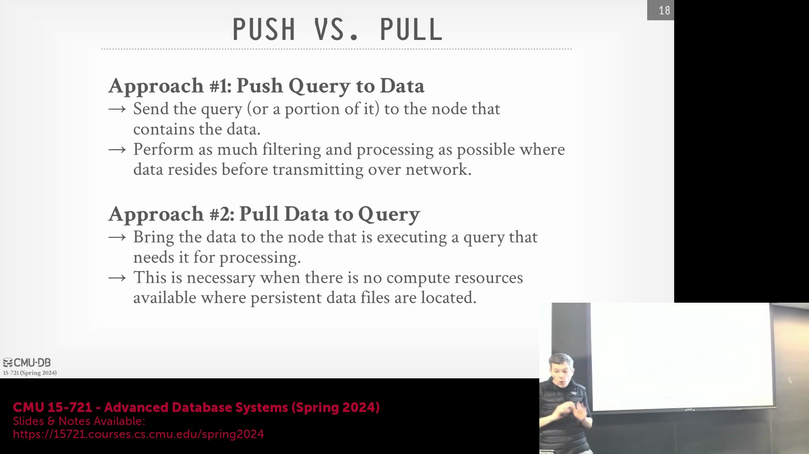
历史上，分布式数据库普遍倾向于采用“将计算推向数据(Move-Compute-to-Data)”模型，尤其是在无共享架构(Shared-Nothing Architecture)中。这是因为在过去，跨节点网络带宽(Network Bandwidth)往往是比本地磁盘 I/O 更为严重的性能瓶颈。现代云对象存储(Cloud Object Storage)通过将基础计算能力直接下沉至存储层，从根本上颠覆了这一传统范式。以 AWS S3 Select 为代表的服务，允许客户端在标准的 HTTP `GET` 请求中直接嵌入类 SQL 的过滤(Filter)与投影(Projection)谓词(Predicate)。得益于存储层原生支持对 CSV、JSON 及 Parquet 等格式的解析，系统能够仅在存储端处理并返回相关的数据子集(Data Subset)，从而大幅削减跨网络传输的数据量。尽管该机制在共享磁盘(Shared-Disk)环境中实现了高效的谓词下推(Predicate Pushdown)，但它并非在所有场景下均为最优解。当多个并发查询(Concurrent Query)携带不同的过滤条件反复访问同一数据块(Data Block)时，一次性拉取完整数据块并在计算节点本地缓存(Local Cache)，通常比频繁发起局部读取请求(Partial Read Request)更具成本效益。诸如 Amazon Redshift 等高级查询引擎会通过成本模型动态评估上述权衡(Trade-off)，以实现系统吞吐量(Throughput)最大化与存储 API 调用成本的最小化。
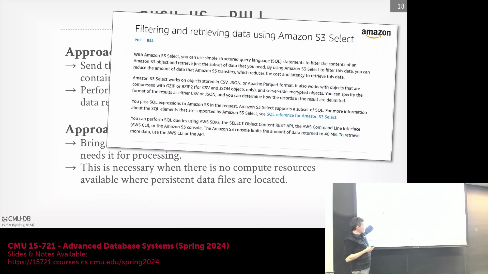

## 经典的无共享架构
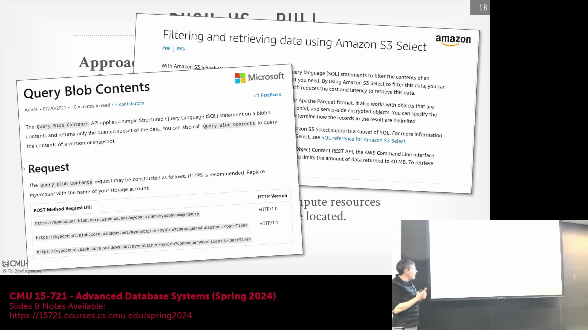
无共享架构(Shared-Nothing Architecture)起源于 20 世纪 80 年代，并在随后的三十余年间主导了分布式数据库(Distributed Database)的设计范式。在该架构下，每个节点均作为独立且自包含(Self-Contained)的计算单元运行，独占专属的 CPU、内存及本地直连存储(Direct-Attached Storage)。数据通常依据范围分区(Range Partitioning)或哈希分区(Hash Partitioning)策略在集群内明确切分，节点间的所有通信均依赖 TCP 或 UDP 等标准网络协议(Network Protocol)。借助标准 POSIX API（如 `open`、`read`、`fstat`），数据库内核能够对底层物理文件保持直接且精细的控制，从而实现对 I/O 路径(I/O Path)与缓冲区管理(Buffer Management)的高精度优化。然而，计算与存储的紧密耦合(Tight Coupling)也带来了显著的运维复杂性(Operational Complexity)。水平扩缩容(Horizontal Scaling)需伴随谨慎的数据重分布(Data Rebalancing)；此外，若系统未显式管理数据复制(Replication)与一致性(Consistency)，单点节点故障将直接威胁整体数据的可用性(Data Availability)。

## 数据局部性与元数据管理的挑战
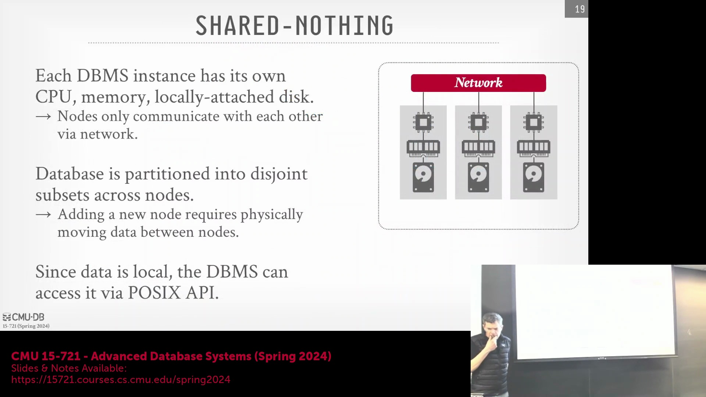
尽管 NFS 或 AFS 等传统分布式文件系统(Distributed File System)看似提供了更为简便的共享存储替代方案，但它们往往对数据库引擎隐藏了关键的数据局部性(Data Locality)信息。这类系统提供高度抽象的透明 POSIX 接口，致使数据库无法感知数据在物理存储介质上的确切位置及其底层磁盘分布(Disk Layout)。这种物理位置的不可见性严重阻碍了查询规划器(Query Planner)优化数据放置策略(Data Placement)、减少网络传输跳数(Network Hop)以及实施基于局部性感知(Locality-Aware)的智能调度。现代分布式数据库亟需显式且高保真(High-Fidelity)的元数据管理(Metadata Management)机制——通常依托专用的目录服务(Catalog Service)（如基于 FoundationDB 或 Cassandra 构建）——来精准追踪数据分区状态、副本分布及物理存储位置。相较于传统不透明的文件系统挂载(Mount)，云对象存储暴露了丰富的元数据接口，并对数据地理分布(Geographic Distribution)、生命周期策略(Lifecycle Policy)及一致性模型(Consistency Model)提供细粒度控制，赋能数据库引擎做出智能且具备成本感知(Cost-Aware)的调度决策。

## 共享磁盘系统中的计算与存储解耦
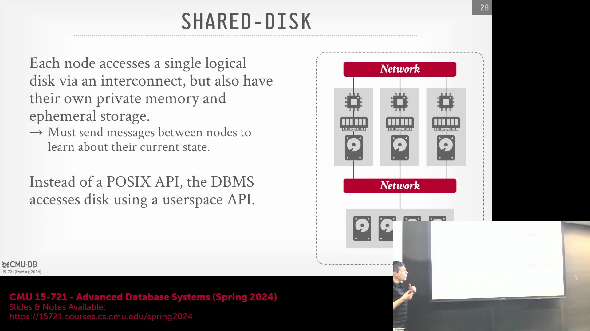
云原生架构(Cloud-Native Architecture)已全面转向共享磁盘模型(Shared-Disk Model)，该模型的核心特征在于实现计算层(Compute Layer)与持久化存储层(Persistent Storage Layer)的严格解耦(Decoupling)。在此架构设计中，计算节点彻底实现无状态化(Stateless)，并通过经过深度优化的用户空间 API(User-Space API)（而非传统的 FUSE 文件系统挂载）直接访问中心化的高持久性(High-Durability)对象存储。这种架构分离从根本上重塑了系统的弹性扩缩容(Elastic Scaling)与资源管理范式。
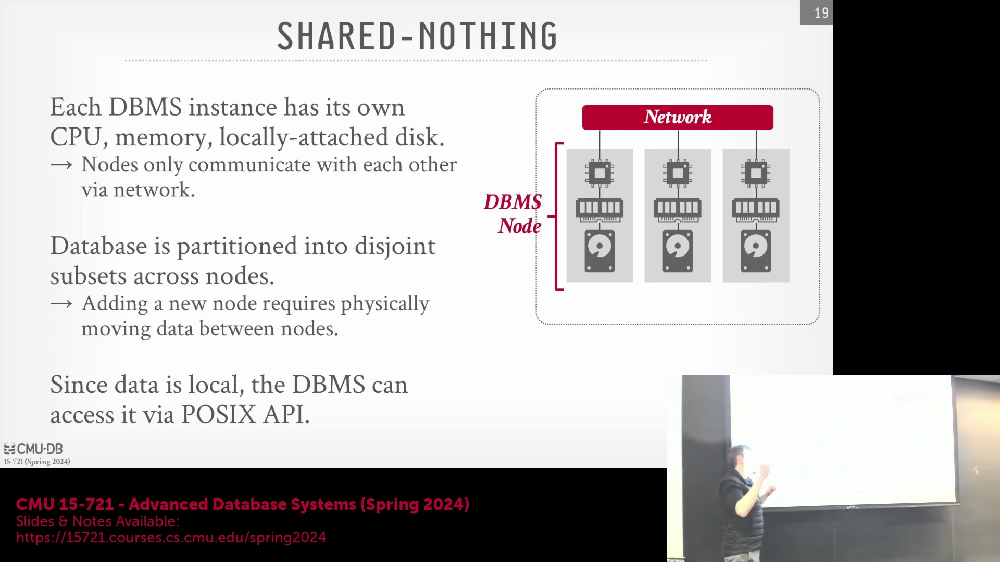
增加或削减计算资源变得即时且无缝(Seamless)，因为底层数据分区(Data Partition)无需进行任何物理重分布或额外复制。无论计算层实例的生命周期如何变化，核心数据始终安全、持久地驻留于独立的存储层中。企业可按需动态启动大规模计算集群以应对繁重的分析型工作负载(Analytical Workload)，并在业务低谷期完全释放计算资源。这种按实际处理时间计费(Pay-as-you-go)的模式，在保留全部历史数据的同时大幅降低了总体拥有成本(TCO)。这种极致的弹性彻底消除了传统无共享架构所必需的刚性容量规划(Rigid Capacity Planning)——因为在无共享系统中，节点下线本质上意味着其物理承载的数据随之不可用。
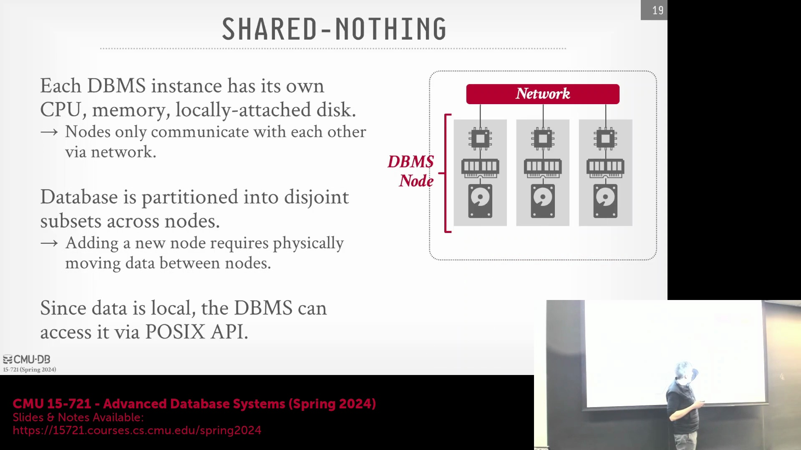

## 平滑扩缩容与查询容错
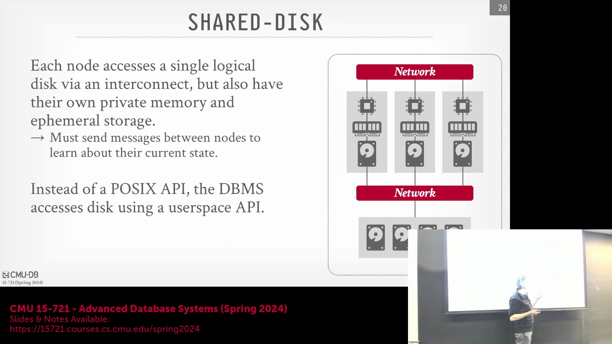
计算节点的无状态特性虽极大简化了底层基础设施管理，但也为查询执行(Query Execution)的韧性(Resilience)引入了新的工程考量。在计划内的扩缩容或系统维护期间，协调器(Coordinator)会优雅排空(Graceful Drain)活跃的工作负载：通知目标节点在安全下线前，完成当前队列中查询片段(Query Fragment)的处理，确保数据零丢失，并安全交接中间状态(Intermediate State)。然而，突发的硬件故障(Hardware Failure)将不可避免地导致正在执行的查询丢失其内存状态(Memory State)与中间结果(Intermediate Result)。尽管底层持久化数据在对象存储中依然绝对安全，但已丢失的计算成果必须通过重新执行(Re-execution)来恢复。现代查询调度器(Query Scheduler)通常采用任务重调度(Task Rescheduling)策略，将因故障孤立(unassigned)的计划片段重新分发至健康的计算节点。这种机制以牺牲单次查询执行的连续性为代价，换取了系统基础设施弹性、整体成本效益与运维简便性的大幅跃升。

---

## 云架构中的目录管理与弹性扩缩容
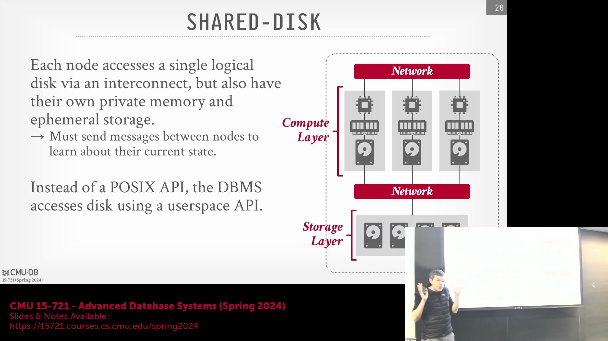
即使在现代的共享磁盘(Shared-Disk)云环境中，逻辑数据分区(Logical Data Partitioning)对于查询优化(Query Optimization)依然至关重要。中央目录服务(Centralized Catalog Service)会持续追踪哪些计算节点(Compute Node)负责对象存储(Object Storage)中的特定文件或数据范围(Data Range)。当集群容量进行弹性扩缩容(Elastic Scaling)时，系统仅需更新目录元数据以重新分配数据归属权(Data Ownership)，而无需在物理层面迁移底层数据文件。借助一致性哈希(Consistent Hashing)等技术，数据库能够在新节点间重新均衡工作负载(Workload Rebalancing)，同时最大程度减少数据重分布(Data Redistribution)开销，从而使传统的分布式数据库(Distributed Database)设计原则得以无缝适配云原生架构(Cloud-Native Architecture)。

## 向云原生共享磁盘模型的战略转变
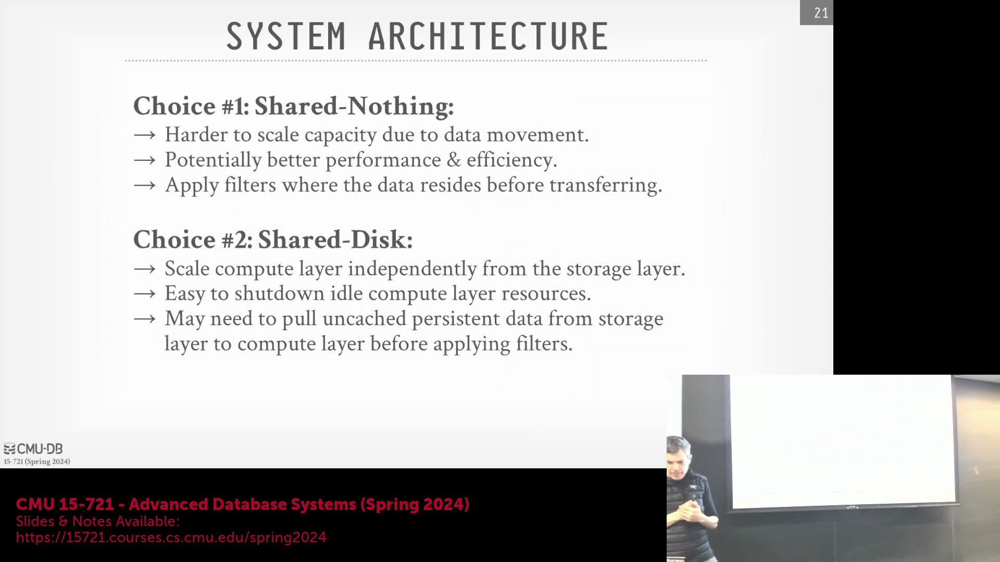
尽管无共享架构(Shared-Nothing Architecture)凭借严格的数据局部性(Data Locality)能提供极致的底层性能，但在弹性扩缩容(Elastic Scaling)与运维开销(Operational Overhead)方面却面临显著瓶颈。计算与存储解耦(Compute-Storage Decoupling)所带来的工程灵活性与成本优势，已促使共享磁盘架构(Shared-Disk Architecture)成为现代联机分析处理(OLAP)系统的主流范式，甚至倒逼传统的无共享数据库供应商进行架构迁移。以 Amazon S3 为代表的云对象存储正以极低的成本持续迭代新功能（例如支持谓词下推(Predicate Pushdown)的 S3 Select）。尽管访问远程对象存储的网络延迟(Network Latency)显著高于本地直连磁盘，但现代数据库系统通过引入复杂的缓存层(Caching Layer)与精细的缓冲池管理(Buffer Pool Management)有效掩盖了该延迟开销，使得共享磁盘模型成为构建可扩展云分析(Scalable Cloud Analytics)平台最为务实的选择。

## 历史先例：云前的共享磁盘一体机
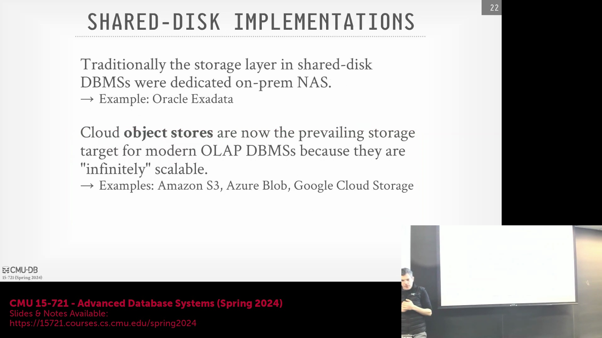
计算与存储解耦(Compute-Storage Decoupling)的理念最早可追溯至 20 世纪 80 年代，尽管早期实现往往受制于当时的网络带宽瓶颈(Network Bottleneck)。现代高性能本地部署(On-Premises)共享磁盘系统的典范当属 Oracle Exadata。这款企业级数据库一体机(Enterprise Database Appliance)集成了专用的计算与存储服务器机架，并通过 InfiniBand 或光纤通道(Fibre Channel)等高带宽、低延迟网络进行互联。其核心优势在于，存储节点(Storage Node)具备在本地执行谓词下推(Predicate Pushdown)的能力。这充分证明，只要借助专用硬件(Dedicated Hardware)与私有互连网络(Private Interconnect)消除网络延迟瓶颈，共享磁盘模型同样能展现出卓越的性能表现。

## 对象存储集成与 PAX 文件格式
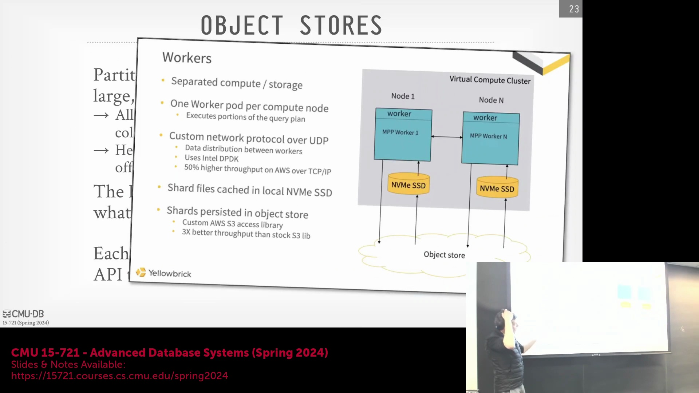
从数据库内核的视角来看，云对象存储(Cloud Object Storage)的功能等效于远程磁盘(Remote Disk)，需通过云厂商特定的专属 API 而非传统的 POSIX 系统调用进行访问。现代 OLAP 系统广泛采用 Parquet 或 ORC 等列式存储格式(Columnar Format)，它们将底层数据组织为行组(Row Group)或数据块(Data Block)。在单个数据块内部，各列(Column)的值采用 PAX（Partition Attributes Across，跨分区属性）布局进行连续存储。这与早期将每列独立存储为单一文件的列式数据库截然不同，PAX 布局有效保留了元组(Tuple)在存储空间上的局部性(Locality)，极大提升了批处理(Batch Processing)的执行效率。此类格式还将关键元数据(Metadata)——包括压缩编解码器(Compression Codec)、列偏移量(Column Offset)及数据概要(Sketches)——集中存储于文件尾部(File Footer)。执行引擎(Execution Engine)会优先读取尾部信息以快速解析文件结构，避免全量扫描远程对象，随后将提取的统计信息(Statistics)回传至目录(Catalog)，以指导查询规划器(Query Planner)生成最优执行计划。

## 极致的底层优化：Yellowbrick 案例研究

当 Yellowbrick 将其高性能的本地无共享一体机(Shared-Nothing Appliance)迁移至公有云环境时，直接调用标准 S3 SDK 与常规 TCP/IP 网络栈遭遇了严重的延迟瓶颈(Latency Bottleneck)。为突破对象存储的性能限制，工程团队实施了极为激进的底层系统优化。他们彻底绕过标准云网络库，转而采用基于 Intel DPDK（数据平面开发套件）实现内核旁路(Kernel Bypass)的自定义用户态网络栈(User-Space Networking)，从而消除了昂贵的上下文切换(Context Switch)与内存拷贝(Memory Copy)开销。此外，团队弃用了传统 TCP 协议，改用定制化的轻量级 UDP 传输协议，并自主开发了专用的 PCIe 驱动程序以最大化硬件通信效率。这些突破常规的工程实践，辅以计算节点上积极的本地缓存策略(Aggressive Local Caching)，生动诠释了现代数据库系统如何跨越网络协议与操作系统内核的边界，在云环境中维系极高的数据吞吐量(High Throughput)。

## 课程路线图与自底向上的实现策略

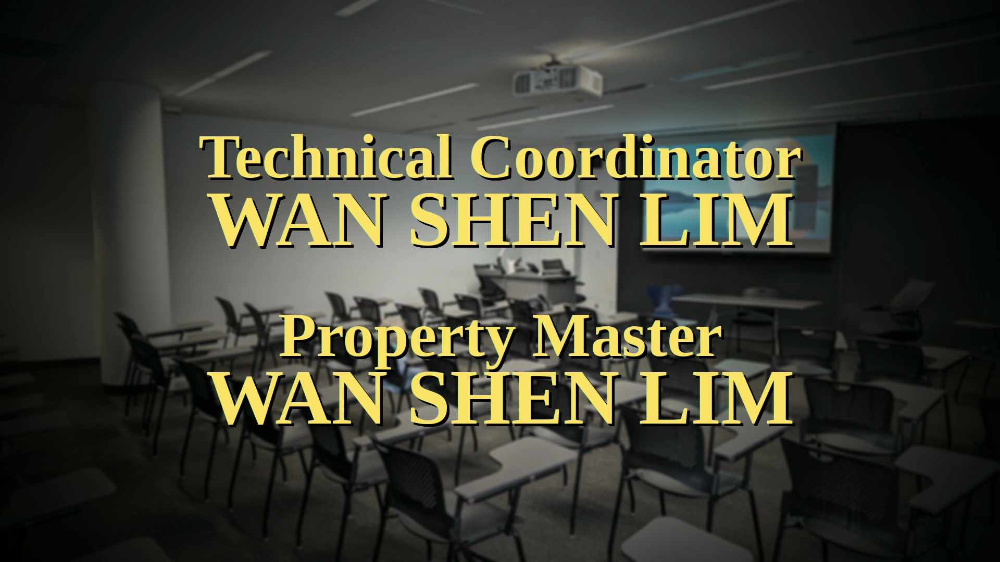

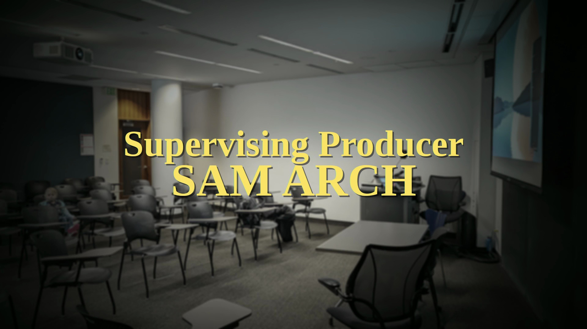

本课程将调整初始的教学大纲，摒弃最初自上而下(Top-Down)的概览模式，转而采用自底向上(Bottom-Up)的构建策略来深入剖析数据库内核(Database Kernel)。我们将从底层物理存储格式(Physical Storage Format)讲起，逐步向上构建并集成执行引擎(Execution Engine)、任务调度器(Task Scheduler)与查询优化器(Query Optimizer)。课程内容将高度聚焦于基于通用 CPU 的查询执行(CPU-based Query Execution)，刻意暂不涉及 GPU 或 FPGA 等硬件专用加速器(Hardware Accelerator)，以确保学生能够集中精力掌握核心算法(Core Algorithms)与系统架构基础(System Architecture Foundations)。下一节课将深入拆解 Parquet 与 ORC 等行业标准文件格式的底层内部机制，随后重点考察旨在突破当前性能与结构局限的新一代存储格式。通过研读这些奠基性学术论文(Foundational Research Papers)与剖析主流实现策略，学员将全方位理解现代 OLAP 系统如何在海量数据规模下实现极致的高性能(High Performance)查询处理。