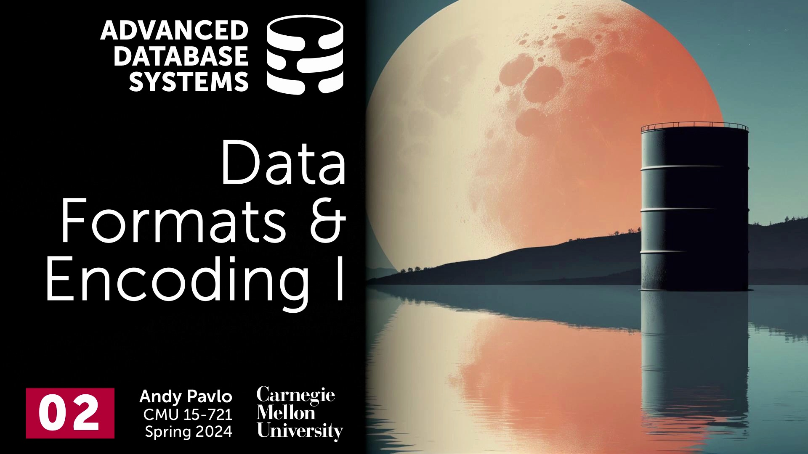
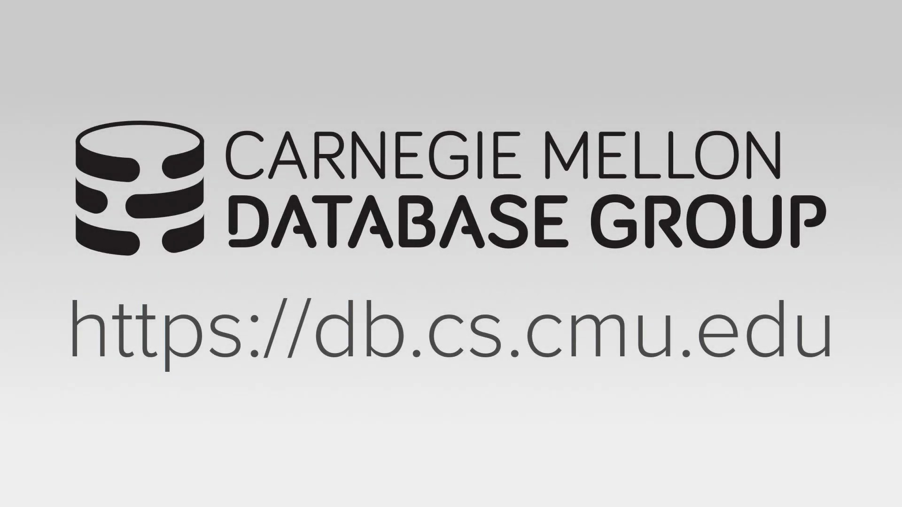
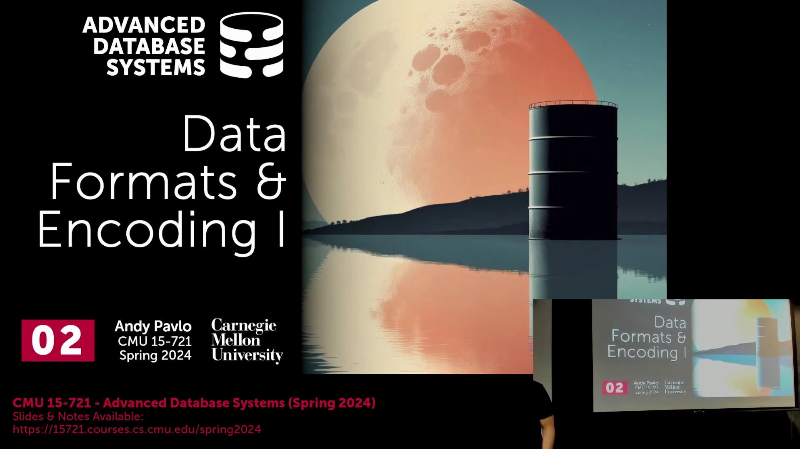
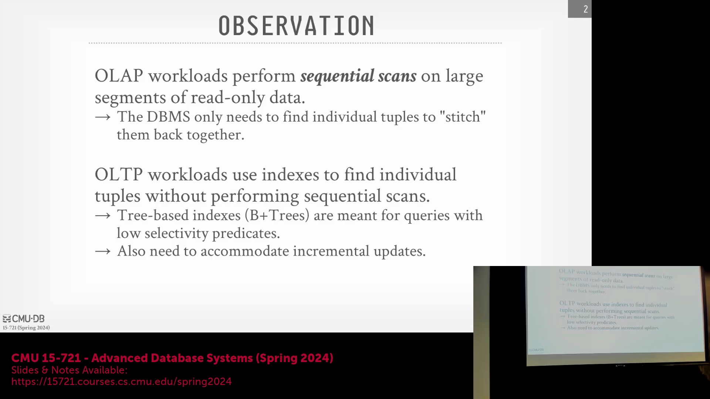
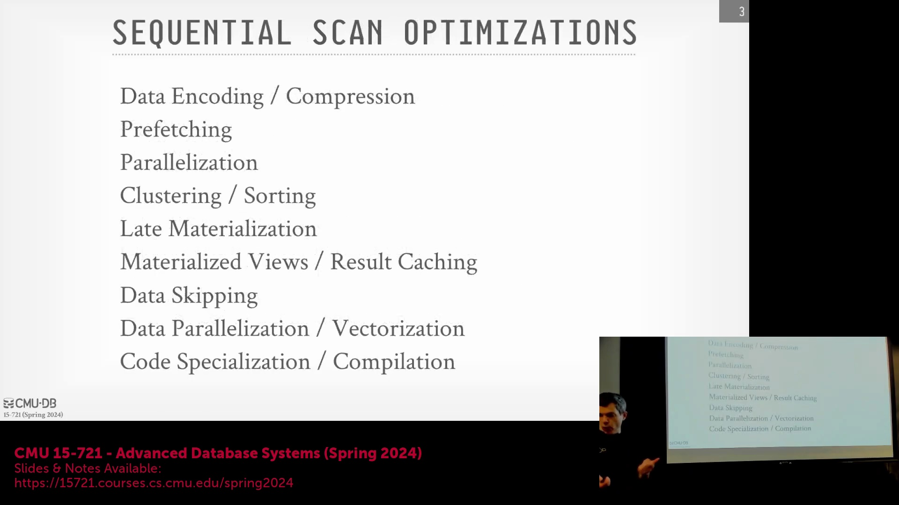

## 数据重组与 OLTP(联机事务处理) 对比分析型工作负载(Analytical Workloads)

生成最终查询结果通常需要先定位给定元组(Tuple)的分散属性，再将其重新组装(Reassemble)。在传统的 OLTP(联机事务处理) 环境中，工作负载主要集中在检索单条记录上，例如查询特定用户的订单或银行账户详情。为了高效处理这类点查询(Point Query)，以及频繁的增、删、改操作，OLTP 系统依赖于 B+ 树(B+ Tree)等动态数据结构，这类结构能够自动扩容并维持数据的有序性。相比之下，分析型系统(OLAP, 联机分析处理)更侧重于批量处理(Batch Processing)，通常避免使用此类动态结构，转而采用针对扫描优化的数据结构（如哈希表(Hash Table)）或列式存储(Columnar Storage)格式。

## 延迟物化(Late Materialization)的概念

分析型数据库(Analytical Database)中的一项核心优化是“延迟物化(Late Materialization)”。其核心原则是在查询执行(Query Execution)过程中，尽可能推迟将分散属性重新组装成完整元组的时间。通过将完整数据行的重组推迟至查询执行计划(Query Execution Plan)的最后阶段，系统能够避免对最终可能被过滤(Filter)掉的属性执行不必要的 I/O 操作与内存分配。为实现该机制，数据库需跟踪额外的元数据(Metadata)（如记录偏移量(Record Offset)），以精准关联属于同一原始元组的分散属性，从而仅在生成最终结果时才进行完整的行重建。

## OLAP(联机分析处理) 工作负载的核心优化策略

由于分析型工作负载主要依赖于顺序扫描或范围扫描，因此采用了多种优化技术来加速执行：
- **预取(Prefetching)：** 预测扫描过程中即将访问的数据块(Data Block)，并在执行引擎(Execution Engine)发起请求前，提前将其加载至内存或本地缓存中。
- **并行化(Parallelization)：** 支持同时运行多个查询，或将单个查询计划拆解为可在不同线程、进程或计算节点上并发执行的子任务。
- **聚类与排序(Clustering & Sorting)：** 对数据进行物理布局重组，使满足特定过滤条件的查询仅需扫描更少的数据块，因为关联值在磁盘上存储得更加紧凑。
- **数据跳过(Data Skipping)：** 利用元数据（如每个数据块的最小值/最大值(Min/Max)）来跳过读取那些明显不满足查询谓词(Query Predicate)的数据块。

## 物化视图(Materialized View)与增量更新(Incremental Update)
物化视图(Materialized View)与结果缓存(Result Cache)专为需要反复访问相同查询或数据子集的场景而设计。系统通过持久化存储预先计算好的结果，避免重复执行底层查询(Underlying Query)。物化视图本质上充当了针对特定查询模式(Query Pattern)（例如“当月所有订单”）的持久化缓存。尽管在概念上与传统的数据立方体(Data Cube)相似，但物化视图的设计初衷是支持增量维护(Incremental Maintenance)。理想情况下，当底层数据发生变更时，系统应能高效地更新视图，从而避免代价高昂的全量重新计算(Full Recomputation)；然而，实现真正的增量刷新(Incremental Refresh)逻辑极为复杂，因此在基础数据库系统中，该功能通常被暂时搁置或采用简化策略。

## 高级执行(Advanced Execution)：向量化与编译
除了高级架构优化之外，现代分析型引擎还采用底层执行技术：
- **数据并行化/向量化(Data Parallelism / Vectorization)：** 借助 SIMD(单指令多数据流, Single Instruction Multiple Data) 等硬件指令集，在单个 CPU 时钟周期内并行处理多个数据值或元组。
- **代码特化与编译(Code Specialization & Compilation)：** 执行引擎不再于运行时动态解释查询计划，而是直接生成高度优化的原生机器码（如 C 语言代码或 LLVM 中间表示(LLVM IR)），并针对特定查询的结构与数据类型进行精准定制。这种经编译的代码彻底消除了解释器开销，执行速度显著提升。

## 课程路线图与视图概念澄清
结合本课程当前的教学规划，预取技术与复杂的物化视图维护机制将暂时不作深入探讨。课程将首先聚焦于数据编码与压缩(Data Encoding & Compression)，这将为后续讲座中讨论的向量化执行技术奠定直接基础。为明确普通视图(Standard View)与物化视图的区别：普通视图仅作为虚拟表或查询宏存在，每次被访问时都会重新触发执行其底层的 `SELECT` 语句。相比之下，物化视图在创建时便会完成计算并物理持久化结果，允许后续查询直接读取已计算的数据，本质上是一种典型的“以存储空间换取查询性能”(Space-Time Tradeoff)的优化策略。