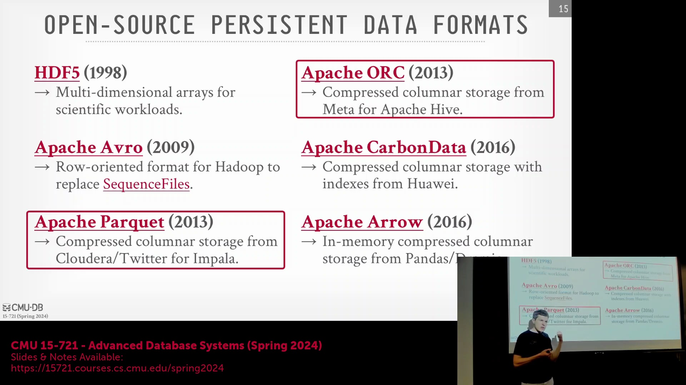
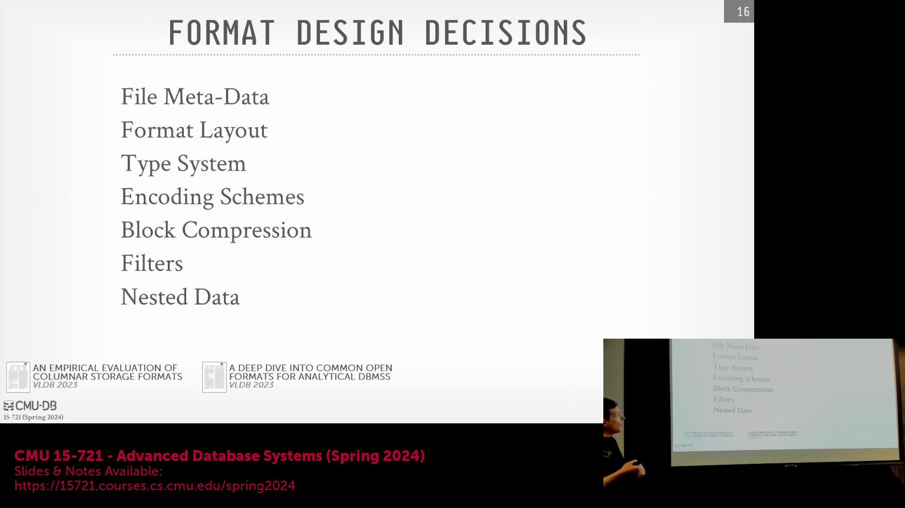
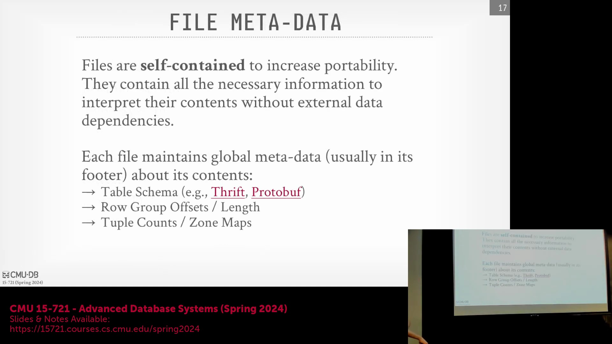
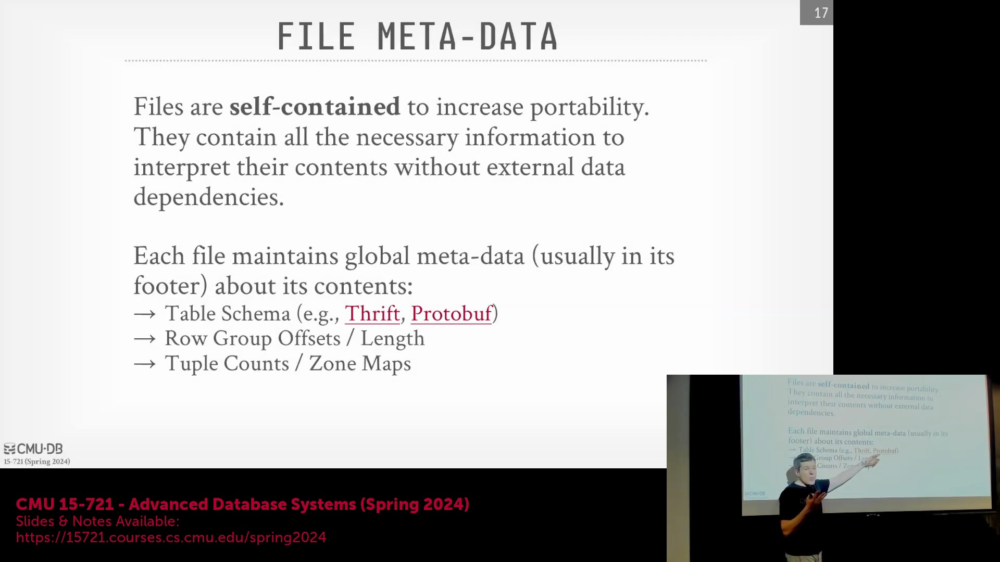

## 行业标准化与格式演进

尽管 Dwarves 与 Alpha 等实验性格式(Experimental Formats)不断涌现，但 Parquet 与 ORC(Optimized Row Columnar) 依然是分析型存储(Analytical Storage)领域无可争议的行业标准(Industry Standard)。类似于 SQL 语言，这些格式在理论设计上未必尽善尽美，但其庞大的生态系统采纳率(Ecosystem Adoption)确保了其长久的生命力。如今，主流数据平台(Data Platform)已原生支持将数据集直接导出为 Parquet 格式，这使得对该类开放规范的稳健支持成为现代数据库引擎(Database Engine)的必备特性。这些格式的核心设计聚焦于优化元数据管理(Metadata Management)、物理数据布局(Physical Data Layout)、编码方案(Encoding Scheme)、块压缩(Block Compression)以及数据跳过过滤器(Data Skipping Filter)，上述机制对于支撑高吞吐量(High Throughput)的分析型工作负载至关重要。

## 自描述架构(Self-Describing Architecture)与模式序列化(Schema Serialization)

与传统关系型数据库(Relational Database)的一个根本区别在于，Parquet 与 ORC 采用完全自描述(Self-Describing)且自包含(Self-Contained)的架构设计。此类格式无需依赖外部系统目录(System Catalog)来建立字节偏移量(Byte Offset)与列名及数据类型的映射关系，而是将完整的模式定义(Schema Definition)直接内嵌于数据文件中。该特性通常借助 Thrift 或 Protobuf(Protocol Buffers) 等序列化框架(Serialization Framework)对模式定义进行编码实现。尽管此设计有效消除了外部依赖并显著提升了数据可移植性(Portability)，但也引入了潜在的解析瓶颈(Parse Bottleneck)：当从拥有数千个属性的宽表中仅查询少数几列时，执行引擎必须首先反序列化(Deserialize)整个内嵌的模式消息(Schema Message)，从而在实际数据处理启动前产生了额外的 CPU 开销。

## 元数据布局(Metadata Layout)与区域映射过滤(Zone Map Filtering)
文件尾部(File Footer)充当核心导航层，集中存储了行组偏移量(Row Group Offset)、数据块字节长度(Byte Length)、元组计数(Tuple Count)以及区域映射(Zone Maps，即各列块的最小/最大值统计摘要)。借助此类元数据，系统能够在零读取原始数据字节(Zero Raw Data Read)的前提下，执行激进的数据跳过(Aggressive Data Skipping)策略。在执行查询时，引擎会基于区域映射统计信息对过滤谓词(Filter Predicate)进行求值评估。若查询目标值范围完全偏离某列块记录的极值区间(Min/Max Range)，引擎将安全地跳过整个对应的物理字节范围。该机制将传统的全表扫描(Full Table Scan)转化为高度精准的定向 I/O 操作(Targeted I/O Operation)，从而大幅削减内存带宽消耗(Memory Bandwidth Consumption)与访问延迟。

## 行组大小调整策略与性能权衡

Parquet 与 ORC 在划定行组边界(Row Group Boundary)时采用了截然不同的策略。Parquet 以固定的元组数量(例如每行组约一百万行)为切分基准，而 ORC 则以固定的未压缩数据体积(Uncompressed Data Size，通常设定为 256 MB)为目标阈值。两种策略各具其特定的性能权衡(Performance Trade-off)。过大的行组会削弱区域映射(Zone Map)的过滤效能，因为聚合范围内的最小/最大值跨度过于宽泛，导致数据过滤(Data Filtering)失去实际意义。此外，大尺寸行组会迫使系统在解压缩(Decompression)与处理阶段分配庞大的内存缓冲区(Memory Buffer)以承载完整的数据块。另一方面，较大规模的行组能够保障充足的连续数据流，从而最大化 SIMD 向量化执行(SIMD Vectorized Execution)效率，并确保多 CPU 线程维持高负载状态，有效防止并行调度开销(Parallel Scheduling Overhead)主导整体查询耗时。

## 云原生 I/O(Cloud-Native I/O)与执行并行度(Execution Parallelism)

在 Amazon S3 等云对象存储(Cloud Object Storage)环境中，查询引擎绝不会全量下载数 GB 规模的完整文件。取而代之的是，引擎会依据文件尾部元数据与区域映射的过滤结果，发起精准的 HTTP 字节范围请求(HTTP Byte-Range Request)，仅按需拉取目标行组与列块。此 I/O 模型的执行效率高度依赖于行组的数据密度(Row Group Data Density)。针对包含海量宽列(Wide Columns)的极宽表(Wide Table)，其生成的行组可能仅包含稀疏的少量元组。这将导致 SIMD 执行管道(SIMD Execution Pipeline)因数据供给不足而陷入“饥饿”(Starvation)状态，进而造成并行工作线程(Parallel Worker Threads)的利用率骤降。尽管部分现代系统正尝试采用混合切分策略(Hybrid Sizing Strategy)以平衡内存占用(Memory Footprint)与执行并行度，但这不可避免地抬升了文件格式的复杂度，并在元组重建(Tuple Reconstruction)阶段引入了额外的解码开销(Decoding Overhead)。