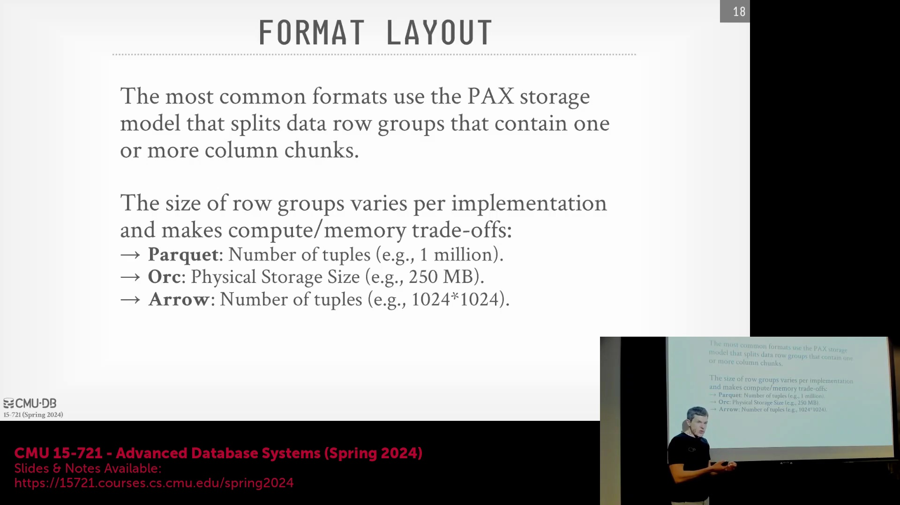
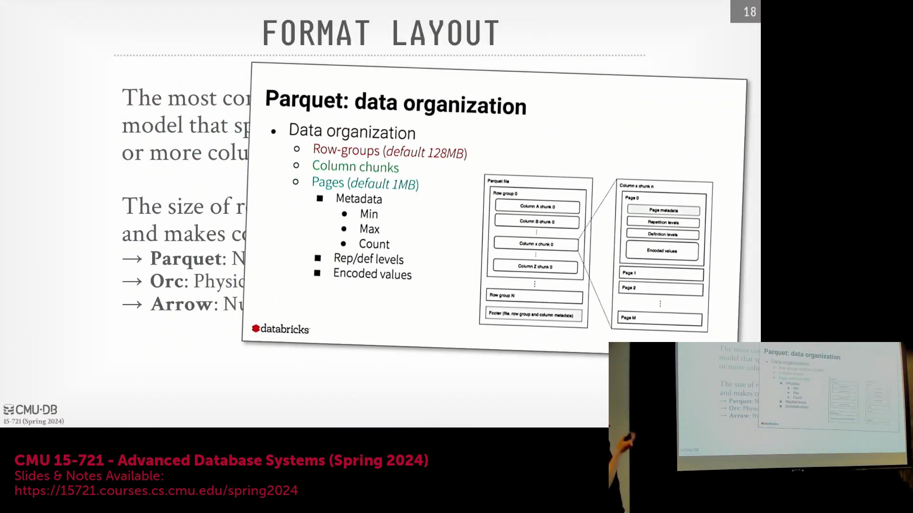
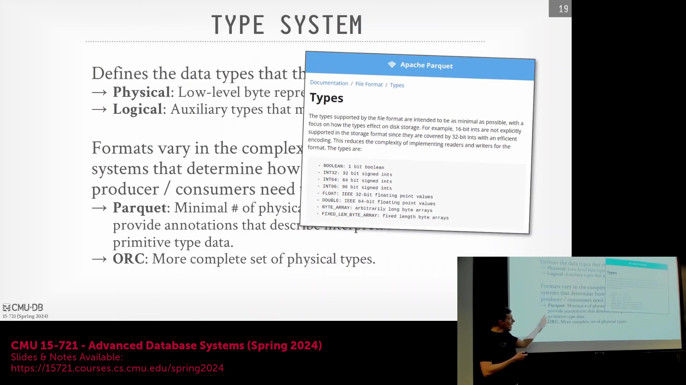
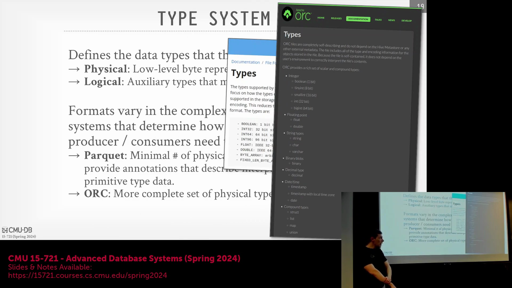
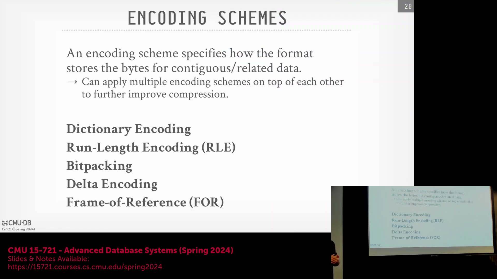
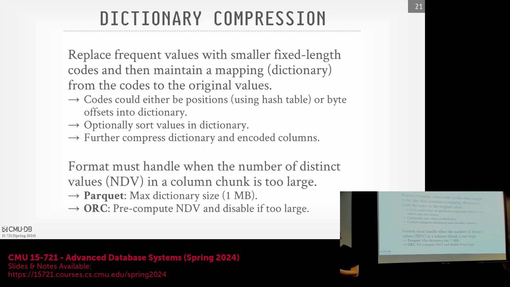
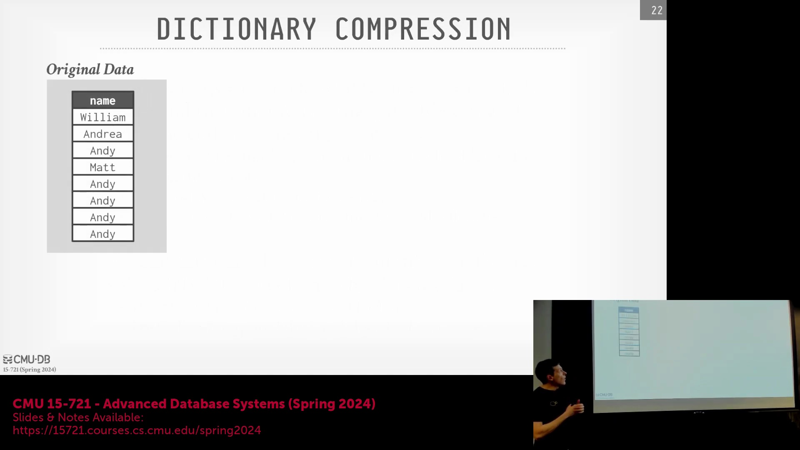

## 工程复杂性与设计权衡(Engineering Complexity & Design Trade-offs)

数据库文件格式刻意避免采用混合或多策略方法(Hybrid/Multi-Strategy Approaches)，旨在最小化工程复杂性(Engineering Complexity)与运行时开销(Runtime Overhead)。支持多种尺寸切分策略（例如基于元组数量或基于字节阈值）会引发分支预测惩罚(Branch Prediction Penalty)，不仅增加代码复杂度(Code Complexity)，还会使内存管理(Memory Management)变得错综复杂。若行组(Row Group)数据超出可用内存容量，系统将被迫执行磁盘溢写(Spill to Disk)或转为增量处理(Incremental Processing)，从而导致显著的性能降级(Performance Degradation)。因此，Parquet 与 ORC 等格式始终坚持单一、确定的切分策略，而非尝试动态自适应。此举类似于事务系统为确保持久稳定性与行为可预测性(Behavioral Predictability)，而标准化采用单一并发控制协议(Concurrency Control Protocol)（如两阶段锁(Two-Phase Locking, 2PL) 或乐观并发控制(Optimistic Concurrency Control, OCC)）的设计哲学。

## 分层文件架构(Hierarchical File Architecture)

现代列式文件(Modern Columnar Files)的内部结构遵循严格的分层布局(Hierarchical Layout)，行业规范对此有明确定义。文件由有序编号的行组(Row Group)序列构成，每个行组内含一个或多个列块(Column Chunk)。在列块内部，额外的页级元数据(Page-Level Metadata)负责追踪编码方案(Encoding Scheme)、压缩算法(Compression Algorithm)及数据值域(Data Value Range)。此种嵌套架构(Nested Architecture)使系统得以在每一层级嵌入细粒度元数据(Fine-Grained Metadata)，同时有效避免文件头部(File Header)过度膨胀。尽管 Parquet 与 ORC 在精确字节边界(Byte Boundary)界定与元数据锚点(Metadata Placement)上存在差异，但其核心设计原则高度一致：构建一种自描述、树状拓扑(Self-Describing Tree-like Topology)的存储结构，以支撑精准的字节范围检索(Byte-Range Retrieval)与高效的谓词下推(Predicate Pushdown)优化。

## 物理类型(Physical Type)与逻辑类型(Logical Type)系统

文件格式严格区分物理类型与逻辑类型，以实现存储与处理性能的双重优化。物理类型定义了最底层的二进制位布局(Bit Layout)，通常遵循 IEEE 754 浮点标准等硬件规范，或采用定宽整数(Fixed-Width Integer，如 `int32`、`int64`)及原始字节数组(Raw Byte Array)。逻辑类型(Logical Type)则在物理表示之上赋予数据明确的语义(Semantic Meaning)；例如，时间戳在逻辑上代表日历时间，但在物理层仅存储为自纪元时间(Epoch Time)起算的毫秒级 `int64` 整数。Parquet 有意维持极简的物理类型系统以削减解析开销(Parse Overhead)，甚至将短整型也统一映射为 32 位值，转而依赖后端压缩算法剔除冗余的前导零字节(Leading Zero Bytes)。相比之下，ORC 支持更为丰富且细粒度的类型层级(Type Hierarchy)，将更多的类型解释与校验工作前置至数据生产者端(Data Producer)，从而为数据消费者(Data Consumer)提供更精细的控制能力与更高的类型安全性。

## 编码策略(Encoding Strategy)与基准值编码(Frame-of-Reference Encoding, FOR)

编码方案(Encoding Scheme)决定了列块内连续数据值如何被高效转换为紧凑的位序列(Bit Sequence)。除基础的差分编码(Delta Encoding)外，列式格式广泛采用基准值编码(Frame-of-Reference Encoding, FOR)。该机制将数值存储为相对于单一基准值（通常取列块全局最小值）的偏移量，而非存储与前驱值的差值。部分基准值编码(Partial Frame-of-Reference)（常关联于 P4 打包编码）进一步演进此方法，通过隔离并单独处理那些会异常拉大整体位宽(Bit-Width)的统计离群值(Statistical Outlier)来实现优化。各格式的核心差异在于编码触发的阈值策略：ORC 采取激进策略，仅需三个连续相同值即激活游程编码(Run-Length Encoding, RLE)；而 Parquet 的触发门槛则设定为八个。尽管如此，字典编码(Dictionary Encoding)仍是最具主导性的策略，因其能显著压缩数据基数(Data Cardinality)，并为后续二级压缩(Secondary Compression)阶段创造极高的压缩密度。

## 字典编码(Dictionary Encoding)与高基数回退机制(High-Cardinality Fallback)

字典编码利用存储于行组头部(Row Group Header)的局部字典(Local Dictionary)，将重复或变长数据替换为紧凑的定宽整数代码。该技术不仅标准化了数据宽度(Data Width)，简化了元数据追踪逻辑，还为向量化执行(Vectorized Execution)提供了底层支持。然而，面对高基数数据(High-Cardinality Data)（如唯一标识符或高精度时间戳），局部字典的体积极易膨胀并超越原始数据本身。为规避此风险，主流格式均内置了严格的回退机制(Fallback Mechanism)：一旦局部字典体积突破 1 MB 阈值，Parquet 便会立即终止字典编码，对后续数据流降级采用普通编码(Plain Encoding)。ORC 则采用前瞻缓冲区(Lookahead Buffer)对流入数据进行采样与基数预测(Cardinality Prediction)；若预判字典收益不足，系统同样会动态禁用字典编码，并将剩余数据以原生格式(Native Format)直接刷盘。

## 字典索引(Dictionary Index)：位置索引(Position Index)与偏移量索引(Offset Index)

在重建原始数据值时，列数据流采用两种核心索引策略之一来引用局部字典。基于位置的方法(Position-Based Approach)存储指向字典第 *n* 个条目的顺序索引(Sequential Index)，该机制通常需借助哈希表(Hash Table)以实现 $O(1)$ 时间复杂度的快速查找。基于偏移量的方法(Offset-Based Approach)则直接记录目标值在序列化字典数据块(Serialized Dictionary Block)内的精确字节位移量(Byte Offset)，使查询引擎得以摆脱辅助数据结构(Auxiliary Data Structure)的依赖，直接寻址至目标字符串。字典条目通常默认按首次出现顺序(Insertion Order)存储，但若按字典序(Lexicographical Order)或词频(Frequency)进行重排，则可衍生出额外的压缩红利。在执行向量化扫描(Vectorized Scan)时，位置索引与偏移量索引的选型需综合权衡查找延迟(Lookup Latency)、元数据体积(Metadata Footprint)以及解码复杂度(Decoding Complexity)。