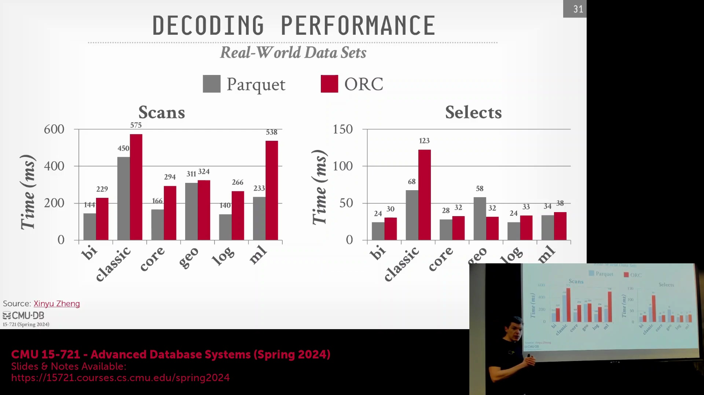
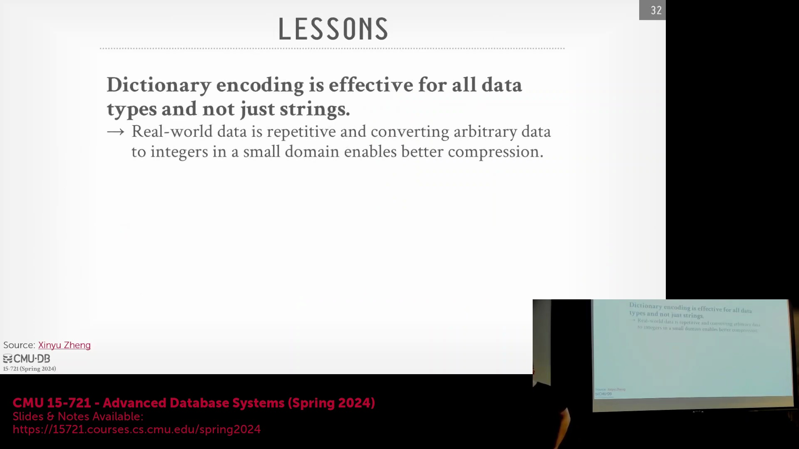
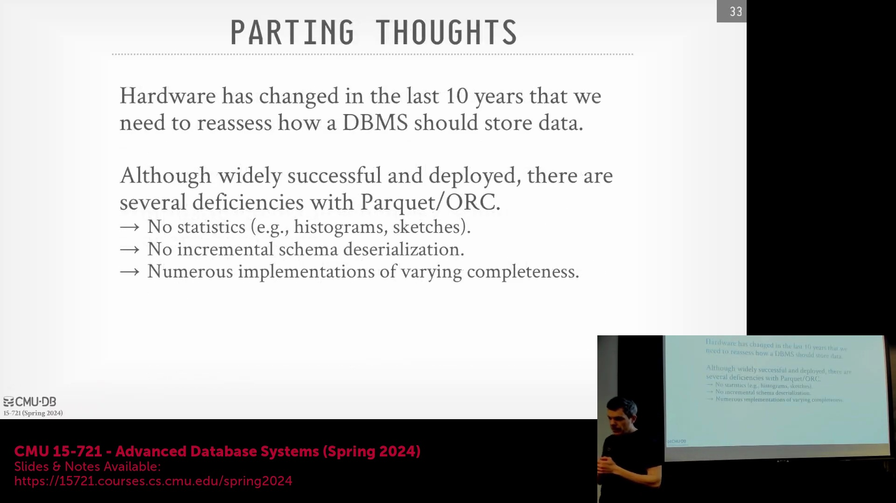
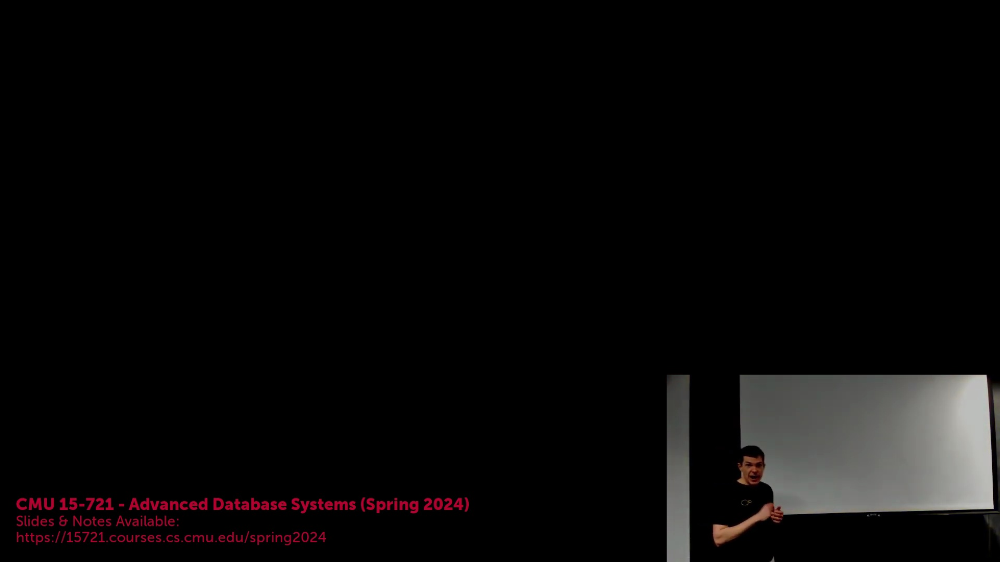

## 代码特化(Code Specialization)与架构简洁性(Architectural Simplicity)

现代查询引擎(Query Engine)广泛采用代码特化与编译技术，以彻底消除运行时分派(Runtime Dispatch)开销。传统数据库系统在执行期往往依赖冗长的 `switch-case` 结构来处理异构数据类型，这不仅引入高昂的间接调用开销(Indirect Call Overhead)，更易触发 CPU 分支预测错误(Branch Misprediction)。通过在编译期(Compile Time)生成类型感知(Type-Aware)的特化代码，执行引擎得以完全规避此类复杂的控制流(Control Flow)。Parquet 刻意维持的极简类型系统(Type System)与此设计范式高度契合，其精简的编码方案(Encoding Scheme)使编译器能够直接输出高度优化的线性机器码(Linear Machine Code)，无需引入复杂的运行时类型检查(Runtime Type Checking)或条件分支(Conditional Branches)。

## 字典编码(Dictionary Encoding)的普适有效性(Universal Effectiveness)

近期实证研究(Empirical Research)揭示了一个关键洞见：字典编码在**所有**数据类型上均能带来显著的压缩率与性能增益，其适用范围绝不仅限于变长字符串(Variable-Length Strings)。与传统认知(Conventional Wisdom)相反，将字典编码应用于浮点数(Floating-Point Numbers)与整型(Integer Types)数据，通常能大幅缩减存储体积并加速下游处理流水线。这种普适性极大简化了存储引擎(Storage Engine)的架构设计，有力证明了单一且高度优化的编码策略(Encoding Strategy)往往优于复杂且碎片化的类型特定启发式算法(Type-Specific Heuristics)。

## 硬件演进(Hardware Evolution)与摒弃不透明压缩(Opaque Compression)的转变

自 Parquet 与 ORC 等列式格式(Columnar Formats)问世十余年来，底层硬件环境已发生根本性演进。随着网络带宽(Network Bandwidth)与 SSD 吞吐量(SSD Throughput)的指数级跃升，计算瓶颈已从磁盘/网络 I/O 转移至 CPU 算力(CPU Cycles)。在此背景下，继续依赖 Snappy 或 Zstandard 等通用且不透明(Opaque)的块压缩算法(Block Compression Algorithms)已显得愈发低效。此类方案强制查询引擎在执行任何分析逻辑前，必须对数据块进行全量解压(Full Decompression)，从而彻底扼杀了向量化执行(Vectorized Execution)的优化空间。当前，业界更倾向于采用原生且具备语义感知(Semantic-Aware)特性的轻量级编码技术（如字典编码、游程编码 Run-Length Encoding, RLE、位打包 Bit-Packing）。这些方案在实现数据压缩的同时，完整保留了底层逻辑结构，使系统能够直接在编码数据流(Encoded Data Stream)上执行算子运算，彻底免除了昂贵且会阻塞 CPU 流水线(Pipeline-Stalling)的解压开销。

## 当前文件格式的关键局限性(Key Limitations of Current File Formats)

尽管 Parquet 与 ORC 已获得业界广泛采用，但其固有的架构局限性(Architectural Limitations)正逐渐制约现代分析型处理(Modern Analytical Processing)的进一步演进。首先，文件内嵌的统计信息(Embedded Statistics)过于匮乏；尽管原生支持基础的区域映射(Zone Maps)与布隆过滤器(Bloom Filters)，却缺乏查询优化器(Query Optimizer)进行精准基数估计(Cardinality Estimation)所必需的直方图(Histograms)与概率草图(Probabilistic Sketches)。其次，模式反序列化(Schema Deserialization)效率低下。此类格式普遍采用 Protobuf 或 Thrift 对完整模式(Schema)进行序列化，导致执行引擎必须预先解析海量列定义(Column Definitions)，即便查询实际仅触及寥寥数字段。最后，开发生态系统呈现高度碎片化(Ecosystem Fragmentation)。各语言特定实现(Language-Specific Bindings)在代码质量与规范遵循度(Specification Compliance)上差异显著，众多第三方库至今仍未集成 SIMD 硬件加速(SIMD Hardware Acceleration)，或对可选元数据规范(Optional Metadata Specifications)的支持参差不齐。

## 下一代编码(Next-Generation Encoding)：面向 SIMD 与 FastLanes 的优化

分析型存储(Analytical Storage)的演进方向，明确指向专为现代 CPU 微架构(Modern CPU Microarchitectures)量身定制的编码方案。正如《FastLanes》学术论文(FastLanes Paper)所强调，下一代数据格式将内存布局(Memory Layout)的优化置于首位，而非拘泥于数据的逻辑插入顺序(Logical Insertion Order)或传统排序规则。此类系统摒弃了按数据到达时序盲目写入的模式，转而在内存中执行显式的数据重组(Data Reorganization)，旨在极致压榨 SIMD(单指令多数据流, Single Instruction Multiple Data)硬件通道的并行算力。通过将底层位级(Bit-Level)与数据块(Block-Level)的物理排布，与向量化执行流水线(Vectorized Execution Pipelines)进行严格对齐，现代编码策略成功突破了传统硬件瓶颈(Hardware Bottlenecks)，将查询吞吐量(Query Throughput)推升至传统列式格式(Traditional Columnar Formats)难以企及的性能新高度。