## 数据重组与 OLTP(联机事务处理) 对比分析型工作负载(Analytical Workloads)

生成最终查询结果通常需要先定位给定元组(Tuple)的分散属性，再将其重新组装(Reassemble)。在传统的 OLTP(联机事务处理) 环境中，工作负载主要集中在检索单条记录上，例如查询特定用户的订单或银行账户详情。为了高效处理这类点查询(Point Query)，以及频繁的增、删、改操作，OLTP 系统依赖于 B+ 树(B+ Tree)等动态数据结构，这类结构能够自动扩容并维持数据的有序性。相比之下，分析型系统(OLAP, 联机分析处理)更侧重于批量处理(Batch Processing)，通常避免使用此类动态结构，转而采用针对扫描优化的数据结构（如哈希表(Hash Table)）或列式存储(Columnar Storage)格式。

## 延迟物化(Late Materialization)的概念

分析型数据库(Analytical Database)中的一项核心优化是“延迟物化(Late Materialization)”。其核心原则是在查询执行(Query Execution)过程中，尽可能推迟将分散属性重新组装成完整元组的时间。通过将完整数据行的重组推迟至查询执行计划(Query Execution Plan)的最后阶段，系统能够避免对最终可能被过滤(Filter)掉的属性执行不必要的 I/O 操作与内存分配。为实现该机制，数据库需跟踪额外的元数据(Metadata)（如记录偏移量(Record Offset)），以精准关联属于同一原始元组的分散属性，从而仅在生成最终结果时才进行完整的行重建。

## OLAP(联机分析处理) 工作负载的核心优化策略

由于分析型工作负载主要依赖于顺序扫描或范围扫描，因此采用了多种优化技术来加速执行：
- **预取(Prefetching)：** 预测扫描过程中即将访问的数据块(Data Block)，并在执行引擎(Execution Engine)发起请求前，提前将其加载至内存或本地缓存中。
- **并行化(Parallelization)：** 支持同时运行多个查询，或将单个查询计划拆解为可在不同线程、进程或计算节点上并发执行的子任务。
- **聚类与排序(Clustering & Sorting)：** 对数据进行物理布局重组，使满足特定过滤条件的查询仅需扫描更少的数据块，因为关联值在磁盘上存储得更加紧凑。
- **数据跳过(Data Skipping)：** 利用元数据（如每个数据块的最小值/最大值(Min/Max)）来跳过读取那些明显不满足查询谓词(Query Predicate)的数据块。

## 物化视图(Materialized View)与增量更新(Incremental Update)
物化视图(Materialized View)与结果缓存(Result Cache)专为需要反复访问相同查询或数据子集的场景而设计。系统通过持久化存储预先计算好的结果，避免重复执行底层查询(Underlying Query)。物化视图本质上充当了针对特定查询模式(Query Pattern)（例如“当月所有订单”）的持久化缓存。尽管在概念上与传统的数据立方体(Data Cube)相似，但物化视图的设计初衷是支持增量维护(Incremental Maintenance)。理想情况下，当底层数据发生变更时，系统应能高效地更新视图，从而避免代价高昂的全量重新计算(Full Recomputation)；然而，实现真正的增量刷新(Incremental Refresh)逻辑极为复杂，因此在基础数据库系统中，该功能通常被暂时搁置或采用简化策略。

## 高级执行(Advanced Execution)：向量化与编译
除了高级架构优化之外，现代分析型引擎还采用底层执行技术：
- **数据并行化/向量化(Data Parallelism / Vectorization)：** 借助 SIMD(单指令多数据流, Single Instruction Multiple Data) 等硬件指令集，在单个 CPU 时钟周期内并行处理多个数据值或元组。
- **代码特化与编译(Code Specialization & Compilation)：** 执行引擎不再于运行时动态解释查询计划，而是直接生成高度优化的原生机器码（如 C 语言代码或 LLVM 中间表示(LLVM IR)），并针对特定查询的结构与数据类型进行精准定制。这种经编译的代码彻底消除了解释器开销，执行速度显著提升。

## 课程路线图与视图概念澄清
结合本课程当前的教学规划，预取技术与复杂的物化视图维护机制将暂时不作深入探讨。课程将首先聚焦于数据编码与压缩(Data Encoding & Compression)，这将为后续讲座中讨论的向量化执行技术奠定直接基础。为明确普通视图(Standard View)与物化视图的区别：普通视图仅作为虚拟表或查询宏存在，每次被访问时都会重新触发执行其底层的 `SELECT` 语句。相比之下，物化视图在创建时便会完成计算并物理持久化结果，允许后续查询直接读取已计算的数据，本质上是一种典型的“以存储空间换取查询性能”(Space-Time Tradeoff)的优化策略。

---

## 物化视图(Materialized View)与增量维护(Incremental Maintenance)
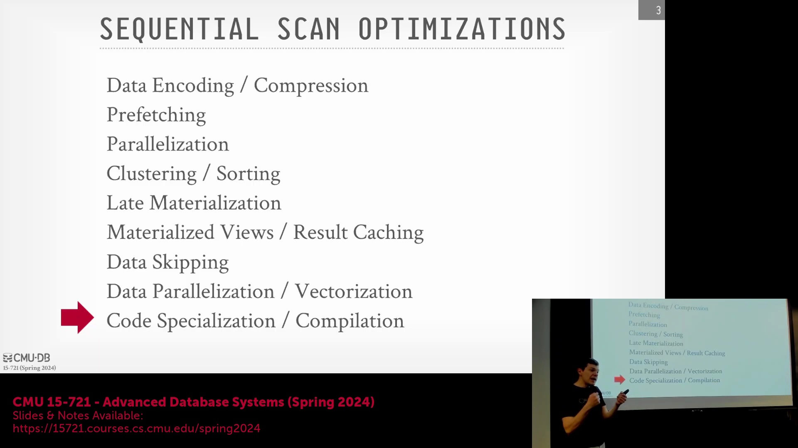
当向支持物化视图的基表(Base Table)插入新数据时，必须刷新(Refresh)视图以维持数据一致性。尽管部分数据库系统支持自动增量刷新，但如 PostgreSQL 等系统仍需手动触发。增量维护的核心挑战在于效率：当插入单行数据时，经过优化的系统无需从头重新计算整个聚合查询(Aggregation Query)，而是精准识别数据变更（例如递增运行总计(Running Total)），并相应地更新已持久化的结果。从功能上看，物化视图充当一种持久化的辅助数据结构，类似于系统重启后依然可存取的临时表(Temporary Table)或索引(Index)。

## 课程重点：持久化数据格式(Persistent Data Format)与编码(Data Encoding)

本讲座重点探讨数据编码如何直接支撑数据并行化(Data Parallelism)与向量化(Vectorization)等高级执行技术，相关内容将在后续查询处理(Query Processing)章节中深入展开。讨论将严格聚焦于持久化数据格式——即实际落盘至磁盘或对象存储(Object Storage)中的底层字节与文件结构，而非内存中的临时中间格式。透彻理解这些文件的物理布局(Physical Layout)是设计存储模型(Storage Model)的基石，其核心目标是为分析型工作负载(Analytical Workload)最大化 I/O 效率与计算吞吐量(Computational Throughput)。

## 面向 OLTP 工作负载的 N 元存储模型(N-ary Storage Model, NSM)（行式存储(Row-Oriented Storage)）
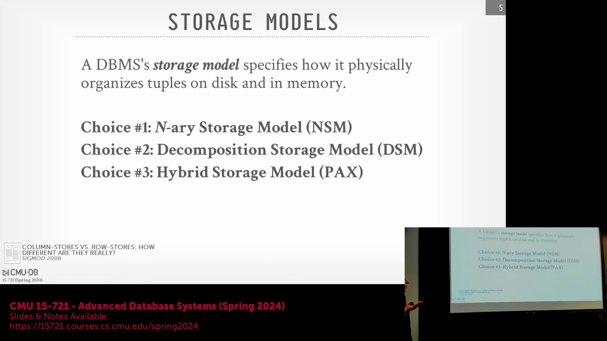
N 元存储模型(N-ary Storage Model, NSM)，即行式存储，是 PostgreSQL、MySQL 与 SQLite 等系统的默认架构。该模型将单个元组(Tuple)的所有属性(Attribute)连续存储于固定大小的数据页(Data Page)中，页大小通常介于 4KB 至 16KB 之间。此布局针对 OLTP(联机事务处理) 环境进行了深度优化，以高效支撑事务频繁检索、插入或更新单条记录的访问模式。由于整行数据通常可完整容纳于单个数据页内，事务提交(Commit)或刷盘(Flush)所需的 I/O 操作被降至最低。然而，该模型依赖 Volcano 迭代器模型(Volcano Iterator Model)进行逐元组处理，在执行分析型查询时效率低下。在 OLAP(联机分析处理) 场景中，当查询仅需访问众多列中的少数几列时，行式存储会迫使系统读取并解析全部无关属性，从而严重浪费内存带宽与 CPU 缓存(Cache)空间。

## 面向 OLAP 的分解存储模型(Decomposition Storage Model, DSM)（列式存储(Column-Oriented Storage)）
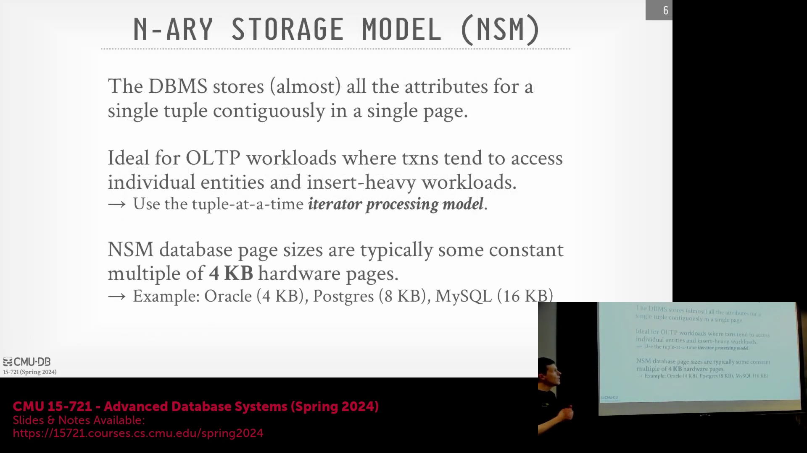
为突破行式存储在分析处理中的瓶颈，分解存储模型(Decomposition Storage Model, DSM)，即列式存储，将元组按属性进行垂直拆分。同一列的所有值被连续存储于独立的文件或存储区域中。该架构彻底消除了读取未使用列的 I/O 开销，并生成高度同质的数据分布(Data Distribution)，极为契合高级压缩算法的应用。鉴于 OLAP 系统主要执行只读的批量扫描(Batch Scan)，而非频繁的定点更新(Point Update)，列式存储有效避免了因修改单行数据而需同步更新数十个独立列文件所引发的事务开销(Transaction Overhead)。此类物理文件通常体积庞大（可达数百兆字节），但在逻辑上会被划分为更小、易于管理的块(Block)或行组(Row Group)，从而支持精准的数据跳过(Data Skipping)机制。

## 列式文件的物理布局(Physical Layout)
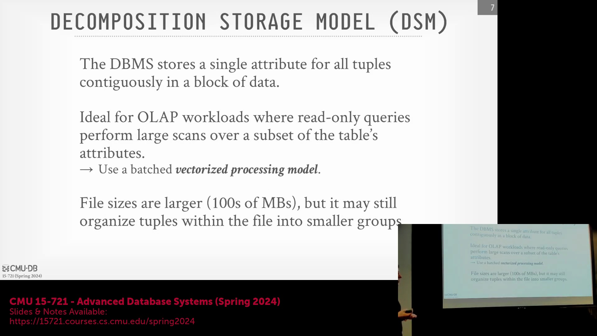
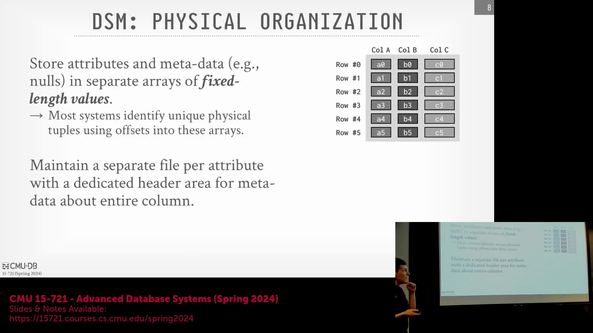
在纯列式布局(Pure Columnar Layout)中，每个属性均写入其专属的物理文件中。文件起始处设有元数据头部(Metadata Header)，其中记录系统版本、统计摘要(Statistical Summary)（如用于数据跳过的区域映射(Zone Map)），以及用于追踪缺失值的空值位图(Null Bitmap)。为优化扫描性能并简化内存寻址，列式存储架构极度偏好固定长度数据类型(Fixed-Length Data Type)。当列内每个值占用一致的字节数时，存储引擎即可执行高速且可预测的顺序扫描(Sequential Scan)，无需解析复杂的变长分隔符或长度前缀(Length Prefix)。

## 元组重建(Tuple Reconstruction)与变长数据处理(Variable-Length Data Handling)
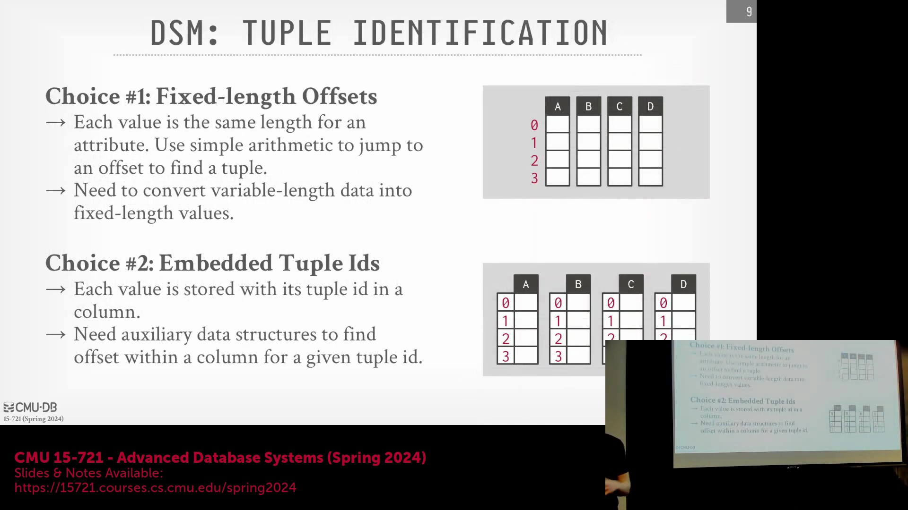
当查询请求多个属性时，系统必须将垂直拆分的列数据重新“拼接”(Reassemble)。行业标准做法采用隐式偏移量计算(Implicit Offset Calculation)：鉴于执行引擎明确掌握当前处理位置及各列的固定字节宽度(Fixed Byte Width)，可瞬时推算出其他列文件中对应值在内存或磁盘上的精确偏移量(Offset)。替代方案是为每个值嵌入显式元组 ID(Explicit Tuple ID)，并依赖辅助哈希表(Hash Table)或范围查找(Range Lookup)来定位匹配属性，但这会引入显著的额外开销。为在保留定长处理性能优势的同时，原生兼容字符串等常见变长数据类型，列式存储广泛采用字典编码(Dictionary Encoding)技术，将变长值映射为紧凑的定宽整数编码(Fixed-Width Integer Codes)。该机制确保列式引擎在异构数据类型处理中，仍能维持其高吞吐量的扫描性能。

---

## 元组标识与定长优化
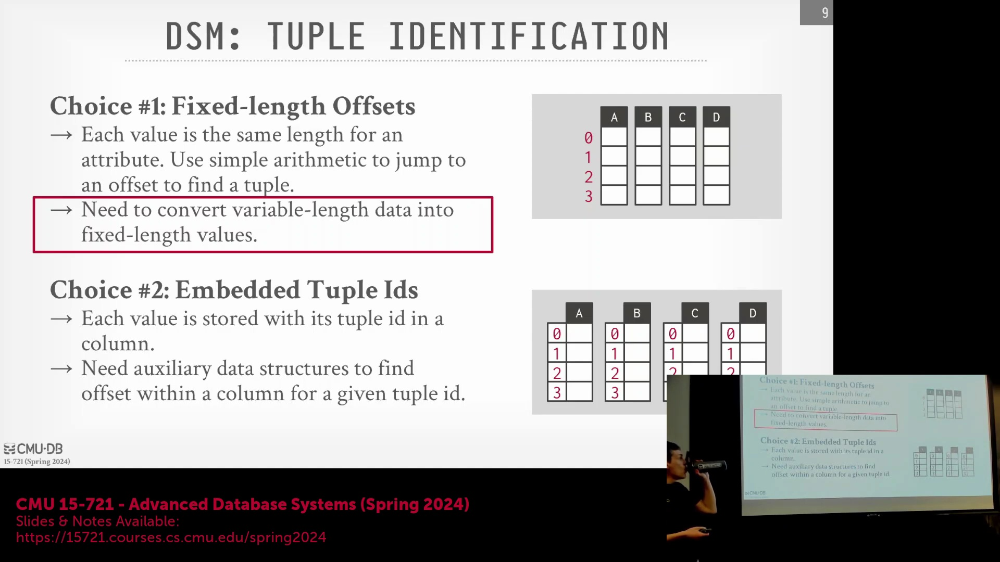
尽管部分混合或遗留系统会在列值中嵌入显式元组标识符(Tuple ID)并依赖辅助哈希表(Auxiliary Hash Table)进行关联查找，但该机制会引入显著的额外开销。现代列式存储的行业标准倾向于采用定长编码(Fixed-Length Encoding)。通过确保每个数据值占用恒定的字节宽度，查询引擎仅需基于当前扫描偏移量(Scan Offset)，即可通过简单且可预测的算术运算精准重建完整元组(Tuple Reconstruction)。此举彻底免除了对复杂指针追踪(Pointer Tracing)或额外索引查找的依赖。即便引入了游程编码(Run-Length Encoding)等压缩算法，系统仍可通过遍历压缩块(Compressed Block)精准定位目标行的确切字节偏移量(Byte Offset)，从而完好保留定长寻址的性能优势。

## 字典编码与半结构化数据处理
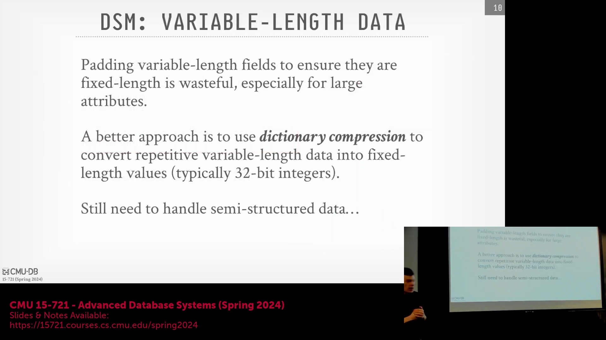
为在维持定长处理性能的同时兼容字符串等变长数据类型(Variable-Length Data Type)，列式系统广泛采用字典编码(Dictionary Encoding)。该技术将基数庞大(高唯一值域)的原始数据映射为紧凑的定宽整数编码。以 Parquet 为代表的现代文件格式会积极地将字典编码应用于各类数据类型（甚至包括整型），因为该策略能显著压缩数据值域(Cardinality)，并生成高度同质化的数据分布，从而为后续的二级压缩(Secondary Compression)创造极佳条件。针对 JSON 等半结构化数据(Semi-Structured Data)，系统会避免在查询运行时进行耗时的文本解析。取而代之的是，在数据摄入(Data Ingestion)阶段将嵌套的层次结构扁平化(Flattening)为独立的关系列。这些源自嵌套字段的字符串值随后将被统一施以字典编码，使得查询引擎能够沿用标准关系列的高吞吐量定长扫描机制进行处理。

## 多列查询挑战与 PAX 模型
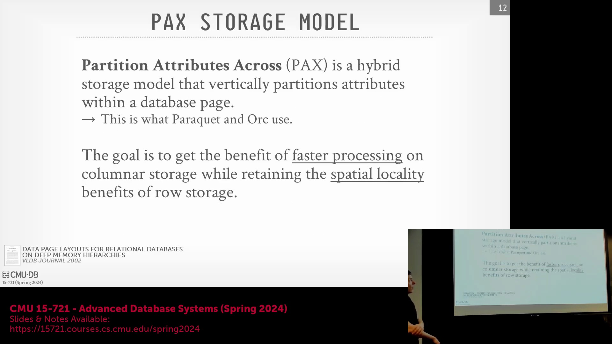
分析型工作负载极少孤立地扫描单一列；此类查询通常需要联合多个属性以执行过滤(Filter)、分组(Group By)或聚合(Aggregation)操作。纯粹的分解存储模型(Decomposition Storage Model, DSM)将各属性分散存储于完全独立的物理文件中，这迫使执行引擎为重建完整元组而在不同文件间频繁执行高成本的 I/O 寻址。此种物理碎片化严重破坏了数据访问的空间局部性(Spatial Locality)，进而导致 CPU 缓存效率(Cache Efficiency)大幅下降。为打破此性能权衡，PAX(Partition Attributes Across, 跨属性分区)模型应运而生。PAX 模型既保留了列式存储的核心优势（如高压缩率与向量化执行(Vectorized Execution)），又通过将相关属性值在物理上聚合至更大的内存页或磁盘块中，成功恢复了行式存储所具备的空间局部性。

## 行组、列块与基于元数据的数据跳过
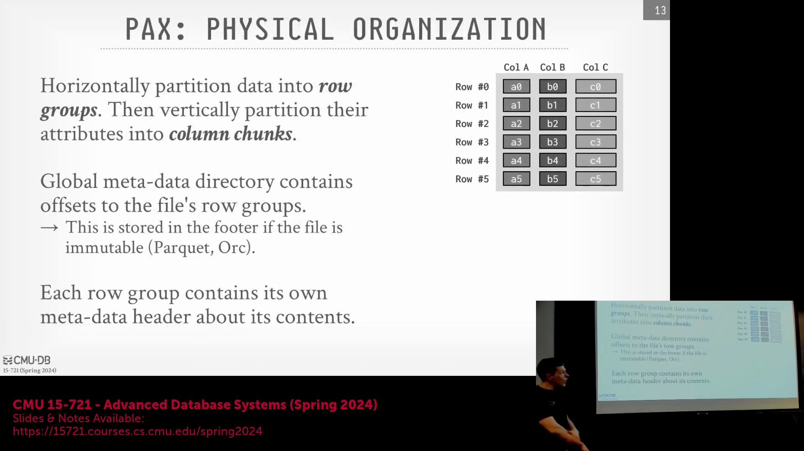
PAX 通过数据表的水平切分来实现其混合架构，切分单元被称为“行组”(Row Group)，其体积通常维持在数十兆字节量级。该尺寸设定在元数据管理开销(Metadata Overhead)与细粒度数据跳过(Fine-Grained Data Skipping)的需求之间达成了最佳平衡。在单个行组内部，数据以“列块”(Column Chunk，亦称条带(Stripe))为单位进行顺序排布：即先将某一属性的全部值连续写入，随后再切换至下一属性的存储布局。上述所有结构最终均封装于单一物理文件中，且文件头与文件尾均附带了详尽的元数据信息。文件尾部集中存储了各自行组的区域映射(Zone Map，即最小/最大值等统计摘要)，使得查询规划器(Query Planner)能够仅通过解析元数据即可完成谓词(Predicate)评估。若某行组的统计极值明确超出查询过滤范围，执行引擎将直接跳过对该数据块的整体读取。此举在避免依赖海量零碎小文件的同时，亦未牺牲列式处理的固有优势，从而实现了 I/O 开销的大幅削减。

---

## 编码可变性与基于元数据的寻址(Metadata-Driven Addressing)
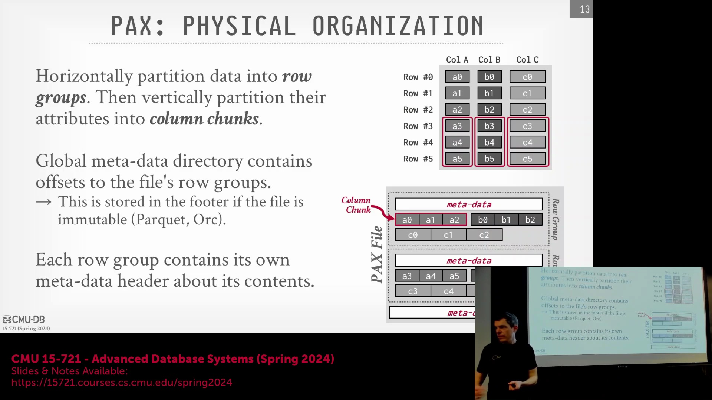
在 PAX 风格的列式布局中，同一行组内各列块包含的元组数量保持一致，但具体的编码方案(Encoding Scheme)在不同行组或文件间可独立变更。尽管存在这种编码可变性，系统仍通过嵌入式元数据维持了严格的数据寻址可预测性。当查询请求特定逻辑行偏移量(Logical Row Offset)的数据时，执行引擎(Execution Engine)会查阅该行组(Row Group)的元数据(Metadata)，以获取当前激活的编码方式及目标属性的字节宽度(Byte Width)。基于这些信息，引擎仅需通过简单的算术运算即可推算出精确的物理偏移量(Physical Offset)，并直接跳转至目标值。该机制免除了对全量数据集强制采用单一编码格式的限制，同时确保了数据访问的快速性与确定性(Deterministic Access)。

## 尾部元数据与仅追加型文件系统(Append-Only File Systems)
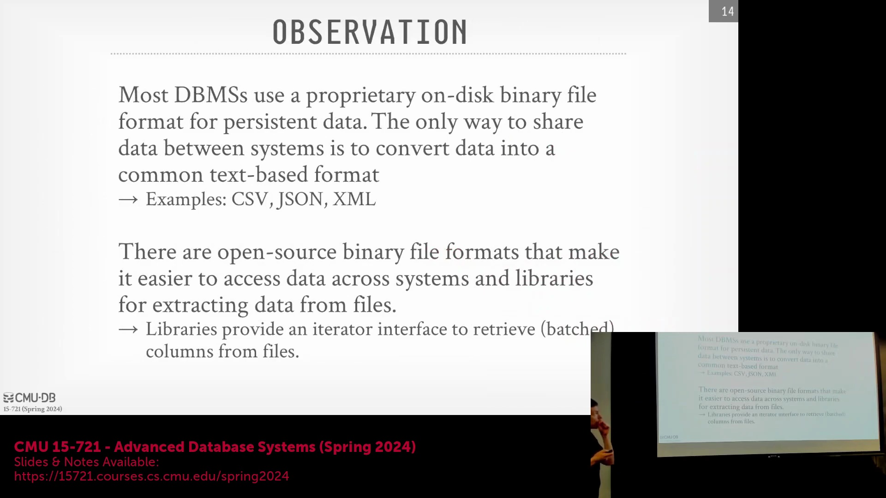
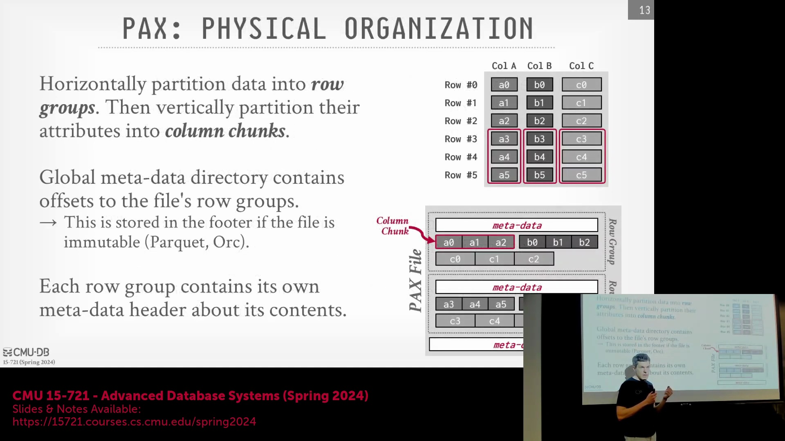
现代列式文件格式刻意将完整的元数据集中存放于文件尾部(File Footer)，而非传统的文件头部。此设计主要解决两项核心技术约束：首先，诸如最小/最大值(Min/Max)、空值计数(Null Count)及区域映射(Zone Map)等关键统计摘要，必须在完整处理完数据块后方可生成；其次，HDFS 与云对象存储(如 Amazon S3)等分布式存储生态本质上遵循仅追加模式(Append-Only)，这意味着任何针对文件头部的原地更新(In-Place Update)都将触发全文件重写(Full Rewrite)，对于 GB 乃至 TB 级数据集而言，其 I/O 成本极为高昂。为高效解析此结构，数据读取器(Data Reader)首先会读取文件末尾的固定长度字节（通常包含指向 Footer 的指针与长度信息），从而获取尾部元数据区的精确偏移。借助该指针，引擎可快速向前定位至文件尾部，将完整元数据加载至内存(Memory)，进而在零数据扫描(Zero Data Scan)的前提下直接启动谓词求值(Predicate Evaluation)。

## 从专有格式向通用标准的转变(Shift to Open Standards)
在早期发展阶段，关系型与分析型数据库高度依赖专有闭源二进制格式(Proprietary Binary Formats)，这些格式仅针对其底层引擎进行了深度优化。尽管在封闭生态内能提供极致的性能，但此类格式严重阻碍了跨系统的数据互操作性(Data Interoperability)。数据工程师(Data Engineer)通常被迫将数据导出为 CSV 或 JSON 等低效的纯文本格式(Plain Text Formats)，随后再通过批量导入(Bulk Load)流程写入目标系统。2010 年代初，Hadoop 与云数据湖(Cloud Data Lake)的迅猛普及彻底暴露了此类重度数据转换工作流的性能瓶颈。业界随之迫切需要一种通用开放二进制文件格式(Universal Open Binary File Format)：该格式应允许上游业务系统直接写入，且可供下游分析型引擎直接消费(Direct Consumption)，全程免除中间解析、模式映射(Schema Mapping)或冗余的数据复制(Data Duplication)。

## 列式文件格式的演进：从 HDF5 到 Parquet 和 ORC
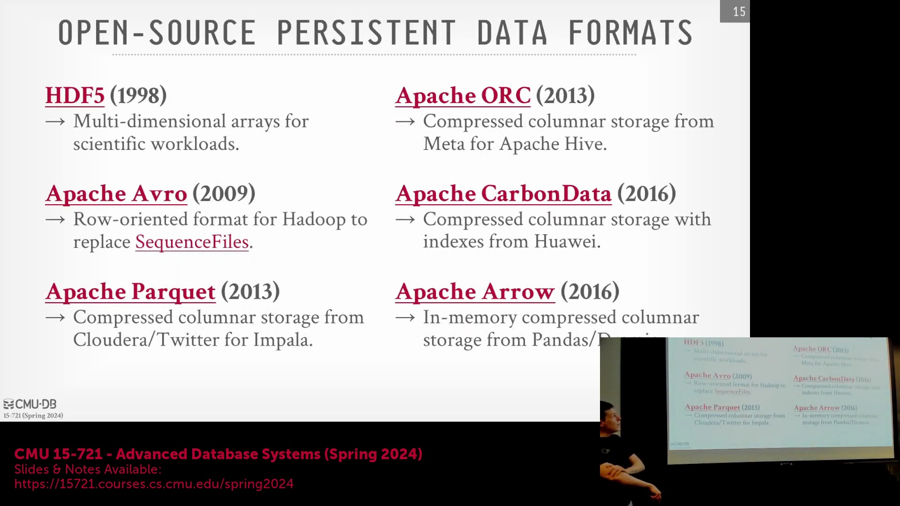
通用二进制数据格式的概念最早可追溯至 20 世纪 90 年代的科学计算(Scientific Computing)领域，当时为高效压缩存储多维数组(Multi-dimensional Arrays)而设计了 HDF5 格式，但该方案并未引起早期传统数据库厂商的广泛关注。Hadoop 生态兴起之初，系统最初依赖 SequenceFiles（无模式(Schema-less)的简单键值对结构)，随后演进至 Avro（支持模式演进(Schema Evolution)的行式存储格式)。在充分认识到行式存储在分析型场景中的性能瓶颈后，整个大数据生态系统开始全面转向列式存储架构(Columnar Storage Architecture)。2013 年，Cloudera 与 Twitter 联合开源了 Parquet，而 Meta(Facebook)同期也为 Apache Hive 推出了 ORC(Optimized Row Columnar)格式。这两种格式均深度借鉴了 PAX 混合存储模型，具备高压缩比(High Compression Ratio)、内置模式定义(Embedded Schema Definition)以及对向量化执行(Vectorized Execution)的原生支持。时至今日，它们仍稳居行业标准地位。其现代演进版本如 Apache CarbonData 进一步引入了支持 ACID 特性的事务性元数据(Transaction Metadata)，而 Apache Arrow 则定义了标准化的零拷贝(Zero-Copy)内存列式格式，专为实现高效的进程间通信(Inter-Process Communication)与跨网络数据交换(Network Data Exchange)而设计。

---

## 行业标准化与格式演进

尽管 Dwarves 与 Alpha 等实验性格式(Experimental Formats)不断涌现，但 Parquet 与 ORC(Optimized Row Columnar) 依然是分析型存储(Analytical Storage)领域无可争议的行业标准(Industry Standard)。类似于 SQL 语言，这些格式在理论设计上未必尽善尽美，但其庞大的生态系统采纳率(Ecosystem Adoption)确保了其长久的生命力。如今，主流数据平台(Data Platform)已原生支持将数据集直接导出为 Parquet 格式，这使得对该类开放规范的稳健支持成为现代数据库引擎(Database Engine)的必备特性。这些格式的核心设计聚焦于优化元数据管理(Metadata Management)、物理数据布局(Physical Data Layout)、编码方案(Encoding Scheme)、块压缩(Block Compression)以及数据跳过过滤器(Data Skipping Filter)，上述机制对于支撑高吞吐量(High Throughput)的分析型工作负载至关重要。

## 自描述架构(Self-Describing Architecture)与模式序列化(Schema Serialization)

与传统关系型数据库(Relational Database)的一个根本区别在于，Parquet 与 ORC 采用完全自描述(Self-Describing)且自包含(Self-Contained)的架构设计。此类格式无需依赖外部系统目录(System Catalog)来建立字节偏移量(Byte Offset)与列名及数据类型的映射关系，而是将完整的模式定义(Schema Definition)直接内嵌于数据文件中。该特性通常借助 Thrift 或 Protobuf(Protocol Buffers) 等序列化框架(Serialization Framework)对模式定义进行编码实现。尽管此设计有效消除了外部依赖并显著提升了数据可移植性(Portability)，但也引入了潜在的解析瓶颈(Parse Bottleneck)：当从拥有数千个属性的宽表中仅查询少数几列时，执行引擎必须首先反序列化(Deserialize)整个内嵌的模式消息(Schema Message)，从而在实际数据处理启动前产生了额外的 CPU 开销。

## 元数据布局(Metadata Layout)与区域映射过滤(Zone Map Filtering)
文件尾部(File Footer)充当核心导航层，集中存储了行组偏移量(Row Group Offset)、数据块字节长度(Byte Length)、元组计数(Tuple Count)以及区域映射(Zone Maps，即各列块的最小/最大值统计摘要)。借助此类元数据，系统能够在零读取原始数据字节(Zero Raw Data Read)的前提下，执行激进的数据跳过(Aggressive Data Skipping)策略。在执行查询时，引擎会基于区域映射统计信息对过滤谓词(Filter Predicate)进行求值评估。若查询目标值范围完全偏离某列块记录的极值区间(Min/Max Range)，引擎将安全地跳过整个对应的物理字节范围。该机制将传统的全表扫描(Full Table Scan)转化为高度精准的定向 I/O 操作(Targeted I/O Operation)，从而大幅削减内存带宽消耗(Memory Bandwidth Consumption)与访问延迟。

## 行组大小调整策略与性能权衡

Parquet 与 ORC 在划定行组边界(Row Group Boundary)时采用了截然不同的策略。Parquet 以固定的元组数量(例如每行组约一百万行)为切分基准，而 ORC 则以固定的未压缩数据体积(Uncompressed Data Size，通常设定为 256 MB)为目标阈值。两种策略各具其特定的性能权衡(Performance Trade-off)。过大的行组会削弱区域映射(Zone Map)的过滤效能，因为聚合范围内的最小/最大值跨度过于宽泛，导致数据过滤(Data Filtering)失去实际意义。此外，大尺寸行组会迫使系统在解压缩(Decompression)与处理阶段分配庞大的内存缓冲区(Memory Buffer)以承载完整的数据块。另一方面，较大规模的行组能够保障充足的连续数据流，从而最大化 SIMD 向量化执行(SIMD Vectorized Execution)效率，并确保多 CPU 线程维持高负载状态，有效防止并行调度开销(Parallel Scheduling Overhead)主导整体查询耗时。

## 云原生 I/O(Cloud-Native I/O)与执行并行度(Execution Parallelism)

在 Amazon S3 等云对象存储(Cloud Object Storage)环境中，查询引擎绝不会全量下载数 GB 规模的完整文件。取而代之的是，引擎会依据文件尾部元数据与区域映射的过滤结果，发起精准的 HTTP 字节范围请求(HTTP Byte-Range Request)，仅按需拉取目标行组与列块。此 I/O 模型的执行效率高度依赖于行组的数据密度(Row Group Data Density)。针对包含海量宽列(Wide Columns)的极宽表(Wide Table)，其生成的行组可能仅包含稀疏的少量元组。这将导致 SIMD 执行管道(SIMD Execution Pipeline)因数据供给不足而陷入“饥饿”(Starvation)状态，进而造成并行工作线程(Parallel Worker Threads)的利用率骤降。尽管部分现代系统正尝试采用混合切分策略(Hybrid Sizing Strategy)以平衡内存占用(Memory Footprint)与执行并行度，但这不可避免地抬升了文件格式的复杂度，并在元组重建(Tuple Reconstruction)阶段引入了额外的解码开销(Decoding Overhead)。

---

## 工程复杂性与设计权衡(Engineering Complexity & Design Trade-offs)

数据库文件格式刻意避免采用混合或多策略方法(Hybrid/Multi-Strategy Approaches)，旨在最小化工程复杂性(Engineering Complexity)与运行时开销(Runtime Overhead)。支持多种尺寸切分策略（例如基于元组数量或基于字节阈值）会引发分支预测惩罚(Branch Prediction Penalty)，不仅增加代码复杂度(Code Complexity)，还会使内存管理(Memory Management)变得错综复杂。若行组(Row Group)数据超出可用内存容量，系统将被迫执行磁盘溢写(Spill to Disk)或转为增量处理(Incremental Processing)，从而导致显著的性能降级(Performance Degradation)。因此，Parquet 与 ORC 等格式始终坚持单一、确定的切分策略，而非尝试动态自适应。此举类似于事务系统为确保持久稳定性与行为可预测性(Behavioral Predictability)，而标准化采用单一并发控制协议(Concurrency Control Protocol)（如两阶段锁(Two-Phase Locking, 2PL) 或乐观并发控制(Optimistic Concurrency Control, OCC)）的设计哲学。

## 分层文件架构(Hierarchical File Architecture)

现代列式文件(Modern Columnar Files)的内部结构遵循严格的分层布局(Hierarchical Layout)，行业规范对此有明确定义。文件由有序编号的行组(Row Group)序列构成，每个行组内含一个或多个列块(Column Chunk)。在列块内部，额外的页级元数据(Page-Level Metadata)负责追踪编码方案(Encoding Scheme)、压缩算法(Compression Algorithm)及数据值域(Data Value Range)。此种嵌套架构(Nested Architecture)使系统得以在每一层级嵌入细粒度元数据(Fine-Grained Metadata)，同时有效避免文件头部(File Header)过度膨胀。尽管 Parquet 与 ORC 在精确字节边界(Byte Boundary)界定与元数据锚点(Metadata Placement)上存在差异，但其核心设计原则高度一致：构建一种自描述、树状拓扑(Self-Describing Tree-like Topology)的存储结构，以支撑精准的字节范围检索(Byte-Range Retrieval)与高效的谓词下推(Predicate Pushdown)优化。

## 物理类型(Physical Type)与逻辑类型(Logical Type)系统

文件格式严格区分物理类型与逻辑类型，以实现存储与处理性能的双重优化。物理类型定义了最底层的二进制位布局(Bit Layout)，通常遵循 IEEE 754 浮点标准等硬件规范，或采用定宽整数(Fixed-Width Integer，如 `int32`、`int64`)及原始字节数组(Raw Byte Array)。逻辑类型(Logical Type)则在物理表示之上赋予数据明确的语义(Semantic Meaning)；例如，时间戳在逻辑上代表日历时间，但在物理层仅存储为自纪元时间(Epoch Time)起算的毫秒级 `int64` 整数。Parquet 有意维持极简的物理类型系统以削减解析开销(Parse Overhead)，甚至将短整型也统一映射为 32 位值，转而依赖后端压缩算法剔除冗余的前导零字节(Leading Zero Bytes)。相比之下，ORC 支持更为丰富且细粒度的类型层级(Type Hierarchy)，将更多的类型解释与校验工作前置至数据生产者端(Data Producer)，从而为数据消费者(Data Consumer)提供更精细的控制能力与更高的类型安全性。

## 编码策略(Encoding Strategy)与基准值编码(Frame-of-Reference Encoding, FOR)

编码方案(Encoding Scheme)决定了列块内连续数据值如何被高效转换为紧凑的位序列(Bit Sequence)。除基础的差分编码(Delta Encoding)外，列式格式广泛采用基准值编码(Frame-of-Reference Encoding, FOR)。该机制将数值存储为相对于单一基准值（通常取列块全局最小值）的偏移量，而非存储与前驱值的差值。部分基准值编码(Partial Frame-of-Reference)（常关联于 P4 打包编码）进一步演进此方法，通过隔离并单独处理那些会异常拉大整体位宽(Bit-Width)的统计离群值(Statistical Outlier)来实现优化。各格式的核心差异在于编码触发的阈值策略：ORC 采取激进策略，仅需三个连续相同值即激活游程编码(Run-Length Encoding, RLE)；而 Parquet 的触发门槛则设定为八个。尽管如此，字典编码(Dictionary Encoding)仍是最具主导性的策略，因其能显著压缩数据基数(Data Cardinality)，并为后续二级压缩(Secondary Compression)阶段创造极高的压缩密度。

## 字典编码(Dictionary Encoding)与高基数回退机制(High-Cardinality Fallback)

字典编码利用存储于行组头部(Row Group Header)的局部字典(Local Dictionary)，将重复或变长数据替换为紧凑的定宽整数代码。该技术不仅标准化了数据宽度(Data Width)，简化了元数据追踪逻辑，还为向量化执行(Vectorized Execution)提供了底层支持。然而，面对高基数数据(High-Cardinality Data)（如唯一标识符或高精度时间戳），局部字典的体积极易膨胀并超越原始数据本身。为规避此风险，主流格式均内置了严格的回退机制(Fallback Mechanism)：一旦局部字典体积突破 1 MB 阈值，Parquet 便会立即终止字典编码，对后续数据流降级采用普通编码(Plain Encoding)。ORC 则采用前瞻缓冲区(Lookahead Buffer)对流入数据进行采样与基数预测(Cardinality Prediction)；若预判字典收益不足，系统同样会动态禁用字典编码，并将剩余数据以原生格式(Native Format)直接刷盘。

## 字典索引(Dictionary Index)：位置索引(Position Index)与偏移量索引(Offset Index)

在重建原始数据值时，列数据流采用两种核心索引策略之一来引用局部字典。基于位置的方法(Position-Based Approach)存储指向字典第 *n* 个条目的顺序索引(Sequential Index)，该机制通常需借助哈希表(Hash Table)以实现 $O(1)$ 时间复杂度的快速查找。基于偏移量的方法(Offset-Based Approach)则直接记录目标值在序列化字典数据块(Serialized Dictionary Block)内的精确字节位移量(Byte Offset)，使查询引擎得以摆脱辅助数据结构(Auxiliary Data Structure)的依赖，直接寻址至目标字符串。字典条目通常默认按首次出现顺序(Insertion Order)存储，但若按字典序(Lexicographical Order)或词频(Frequency)进行重排，则可衍生出额外的压缩红利。在执行向量化扫描(Vectorized Scan)时，位置索引与偏移量索引的选型需综合权衡查找延迟(Lookup Latency)、元数据体积(Metadata Footprint)以及解码复杂度(Decoding Complexity)。

---

## 字典编码(Dictionary Encoding)与二级压缩(Secondary Compression)
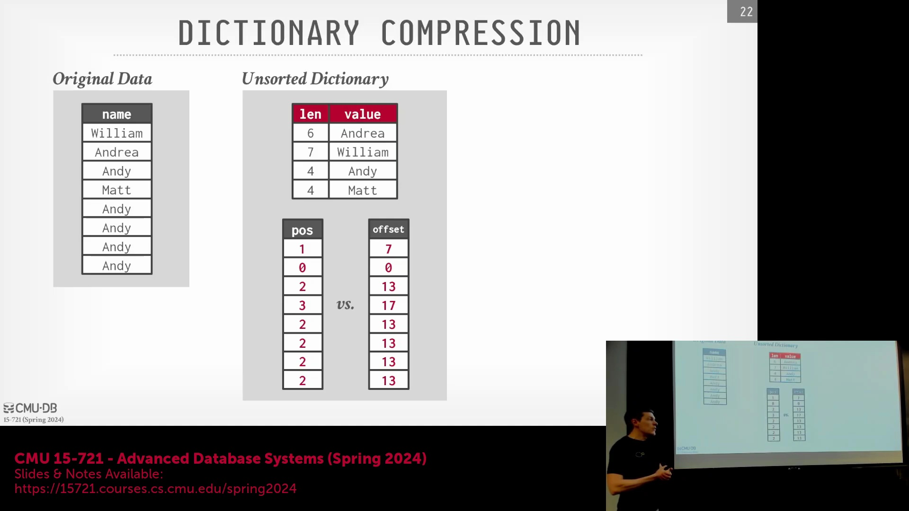
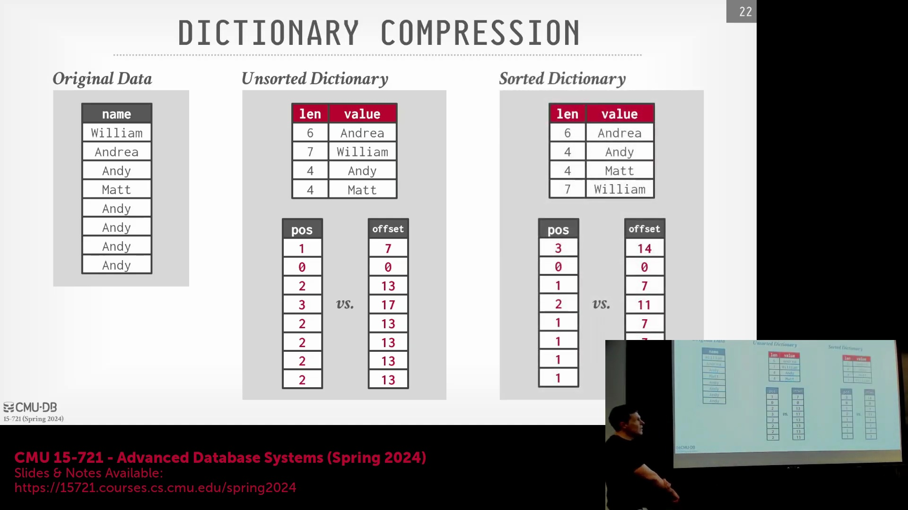
字典编码将重复或变长数据映射为紧凑的定长代码(Fixed-Length Codes)，从而实现可预测的内存访问(Predictable Memory Access)与高效的向量化扫描(Vectorized Scan)。Apache Arrow 等系统通过预排序字典条目(Pre-sorted Dictionary Entries)优化该过程，允许引擎直接通过字节偏移量(Byte Offset)进行定位，无需在运行时动态维护哈希表(Hash Table)。一旦原始值被转换为字典代码，生成的列数据流(Column Data Stream)通常会产生长序列的连续重复整数。针对此类序列，系统可应用游程编码(Run-Length Encoding, RLE)、差分编码(Delta Encoding)或基准值编码(Frame-of-Reference, FOR)等二级编码技术(Secondary Encoding Techniques)实现深度压缩。此外，若按字母序或词频对字典条目进行重排，相同代码将在物理上高度聚集，从而在触发后续重量级块级压缩(Heavyweight Block Compression)前，最大化轻量级编码方案的压缩增益。

## 处理高基数(High Cardinality)与压缩范围(Compression Scope)
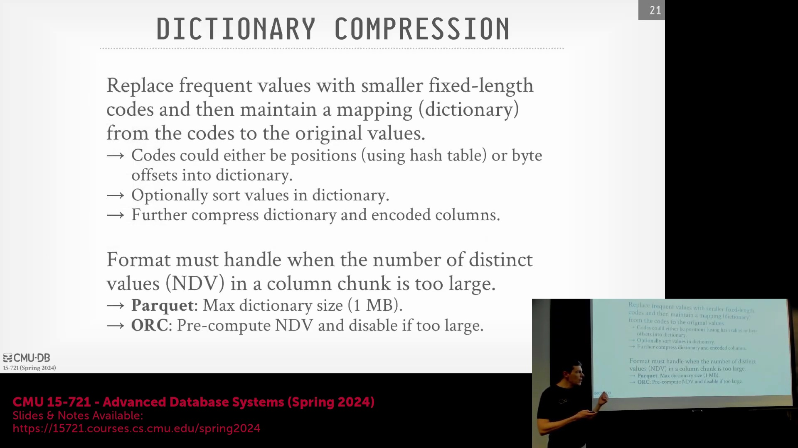
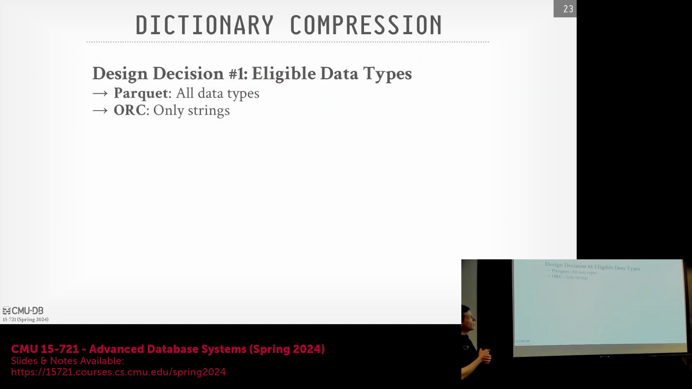
当目标列呈现极高基数或包含极长唯一字符串时，盲目应用字典编码可能适得其反，甚至导致存储开销(Storage Overhead)不降反升。在此类场景下，现代文件格式会触发回退机制(Fallback Mechanism)：原始长字符串被剥离并存放于独立的二进制大对象(BLOB, Binary Large Object)存储区，而主列数据流仅保留指向目标字符串的定长字节偏移量(Fixed-Length Byte Offsets)。除回退策略外，各格式对字典编码的适用类型界定亦存在分歧。ORC 传统上将其严格限定于字符串类型，认为数值列的数据分布过于随机(Random Distribution)而难以获益。相反，Parquet 采取普适策略，对包括整型与浮点型(Floating-Point Types)在内的所有数据类型均默认启用字典编码。实证基准测试(Empirical Benchmarks)表明，Parquet 的激进策略能达成更优的整体压缩率，因为有效降低全量列的数据基数，能为后续编码层创造显著更高的压缩密度。

## 块压缩(Block Compression)与现代硬件权衡(Modern Hardware Trade-offs)
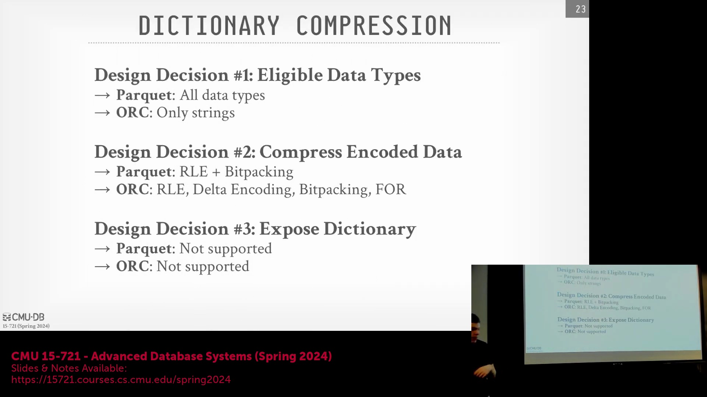
完成基础编码后，列式格式通常会对行组(Row Group)应用 Snappy 或 Zstandard 等通用块级压缩算法(General-Purpose Block Compression Algorithms)。在传统架构中，该策略的权衡逻辑明确偏向于“以 CPU 周期换取 I/O 带宽”，旨在缓解缓慢磁盘与网络链路的压力。然而，在现代云原生环境与 NVMe 等高性能存储架构中，CPU 算力已取代 I/O 成为核心瓶颈。Zstandard 等不透明压缩方案(Opaque Compression Schemes)要求查询引擎在执行任何过滤或谓词评估前，必须全量解压(Decompress Entire Block)目标数据块，这直接扼杀了向量化执行(Vectorized Execution)与谓词下推(Predicate Pushdown)的性能优势。尽管此类高压缩比算法在冷数据归档(Cold Data Archiving)中仍具价值，但现代分析型引擎正日益转向 CPU 友好型轻量级编码(CPU-Friendly Lightweight Encodings)，旨在支持直接在压缩比特流(Compressed Bitstream)上执行算子，彻底免除强制性的全块解压开销。

## 字典暴露(Dictionary Exposure)与谓词下推(Predicate Pushdown)

传统 Parquet 与 ORC 库的核心局限在于，字典结构通常被严密封装于内部迭代器(Internal Iterator)底层。当查询引擎请求列数据时，获取的已是全量解压后的原始值，这从根本上阻断了将过滤谓词(Filter Predicate)下推至存储层的可能。为突破此瓶颈，Google 的 Prasella（基于 Artists 格式）等新兴架构选择将字典显式暴露(Explicitly Expose)给查询规划器(Query Planner)。该设计允许引擎将语义谓词（如 `WHERE name = 'Andy'`）动态编译为对应的字典代码(Dictionary Codes)，直接在编码列数据流(Encoded Column Stream)上执行过滤运算，并跳过所有非匹配数据块的解码流程。此种“压缩态评估”架构在海量数据扫描期间，实现了内存带宽消耗(Memory Bandwidth Consumption)与 CPU 开销的断崖式下降。

## 元数据过滤器(Metadata Filters)：区域映射(Zone Maps)与布隆过滤器(Bloom Filters)
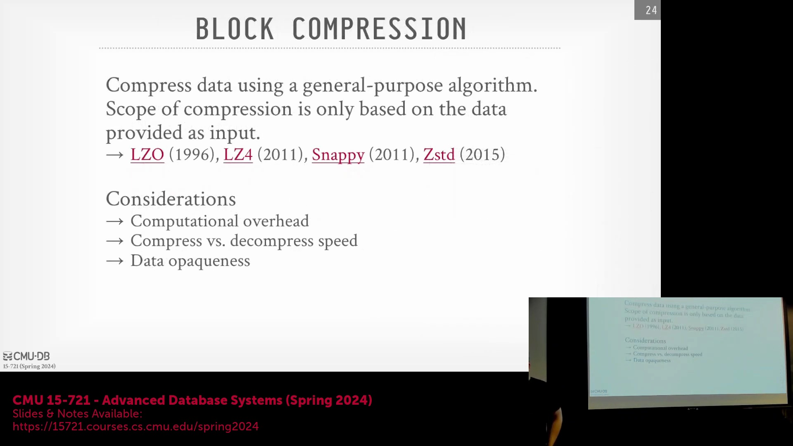
为在不读取原始数据载荷(Raw Data Payload)的前提下加速查询规划(Query Planning)，现代格式会在行组层级嵌入轻量级元数据过滤器。区域映射(Zone Maps)为每个列块(Column Chunk)维护确定性的最小/最大值统计(Min/Max Statistics)；若查询谓词的目标范围与该统计区间无交集，引擎即可安全跳过(Skip)整个数据块。然而，区域映射仅能界定数据的潜在存在范围，对于通过过滤的块仍需执行全量顺序扫描。针对等值匹配或点查询(Point Queries)，布隆过滤器(Bloom Filters)提供了高效的概率型替代方案。该结构严格保证零假阴性(Zero False Negatives)，仅容忍极低的假阳性率(False Positive Rate)，使引擎能够迅速剔除绝对不含目标值的冗余数据块。值得注意的是，受限于哈希算法特性，布隆过滤器对数据插入顺序并不敏感；而区域映射则能从物理数据聚类(Physical Data Clustering)中显著获益。通过对底层数据进行预排序或分区(Partitioning)，可有效收窄极值统计范围，将原本宽泛低效的元数据转化为高选择性的数据跳过机制(Data Skipping Mechanism)，从而实现 I/O 开销的指数级优化。

---

## 缓存优化的布隆过滤器(Cache-Optimized Bloom Filter)
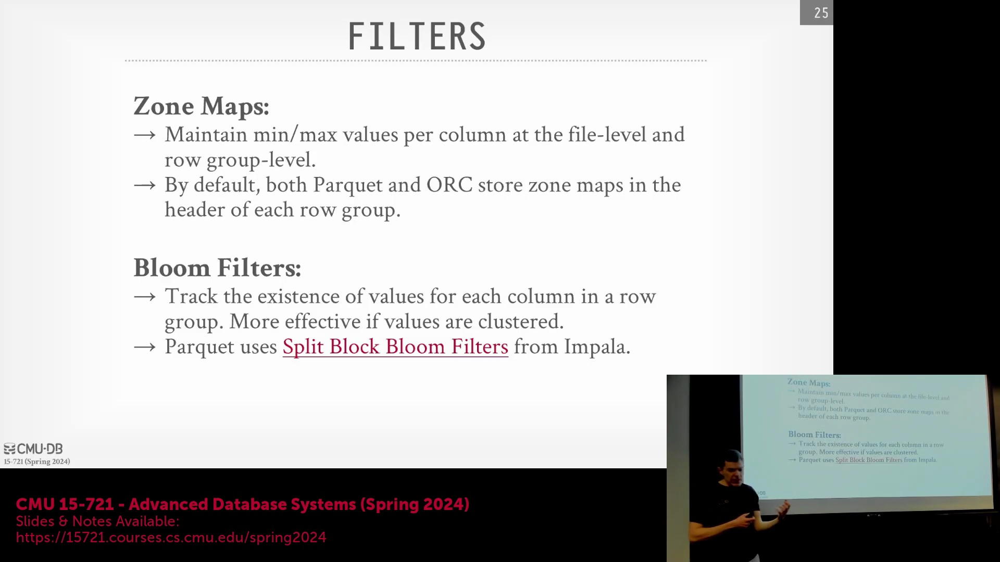
现代分析型文件格式针对硬件效率，对布隆过滤器(Bloom Filter)等概率数据结构(Probabilistic Data Structures)进行了深度优化。分块布隆过滤器(Blocked Bloom Filter)通过限制哈希映射范围，使其仅针对能够恰好装入单个 CPU 缓存行(CPU Cache Line)的位组进行操作。通过确保整个过滤器结构常驻于 L1 缓存中，系统显著降低了昂贵的缓存未命中(Cache Miss)开销，并在谓词过滤(Predicate Filtering)期间实现超高速的成员资格检测(Membership Testing)。

## 嵌套数据结构的记录拆解(Record Shredding for Nested Data)
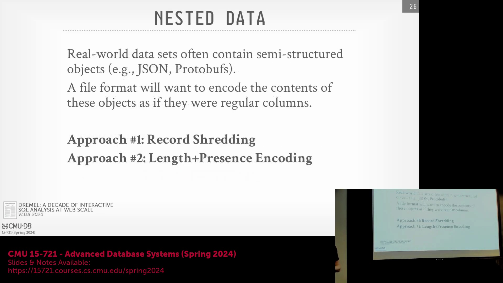
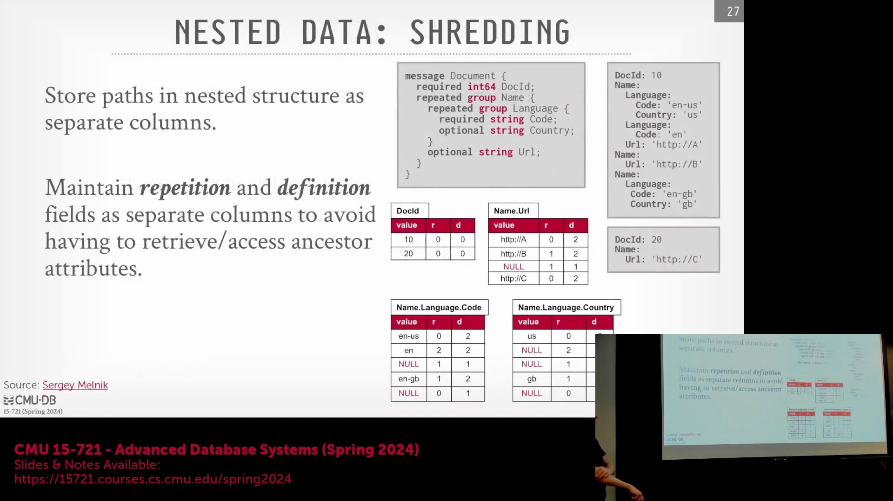
高效处理半结构化数据(Semi-Structured Data)（如 Protobuf 或 JSON）要求突破将完整文档存储为不透明二进制块(Opaque Binary Blobs)的传统范式。由 Google Dremel 系统首创的**记录拆解(Record Shredding)**技术，能够将层次化文档(Hierarchical Documents)扁平化(Flatten)为离散的列式字段。该技术摒弃了显式的父子指针(Parent-Child Pointers)，转而依赖辅助的 `repetition`（重复级别(Repetition Level)）与 `definition`（定义级别(Definition Level)）列。定义级别用于标识当前值在模式层次结构(Schema Hierarchy)中的嵌套深度，而重复级别则用于标记新记录的起始或重复字段的复位。此类元数据使查询引擎得以直接扫描各嵌套字段，并在运行时动态重建文档层级关系(Document Hierarchy)，彻底免除了对完整半结构化数据负载(Semi-Structured Data Payload)的运行时解析开销。

## 存在长度编码(Length-of-Presence Encoding)
作为记录拆解(Record Shredding)的轻量化替代方案，存在长度编码(Length-of-Presence Encoding)通过为记录中缺失的可选属性(Optional Attributes)插入占位符或空值(Null Values)，以维持严格的列对齐(Column Alignment)。该机制确保每一列与文档偏移量(Document Offset)之间保持精确的一对一位置映射，使系统仅需借助简单的存在标志(Presence Flag)与字节偏移量即可高效重建元组。尽管处理稀疏字段(Sparse Fields)时可能略微增加存储开销，但该方法能与标准的字典编码(Dictionary Encoding)及块压缩(Block Compression)方案无缝集成，从而有效规避了由重复/定义级别机制引发的复杂元数据遍历(Metadata Traversal)开销。

## Parquet 与 ORC 的真实世界评估(Real-World Evaluation)
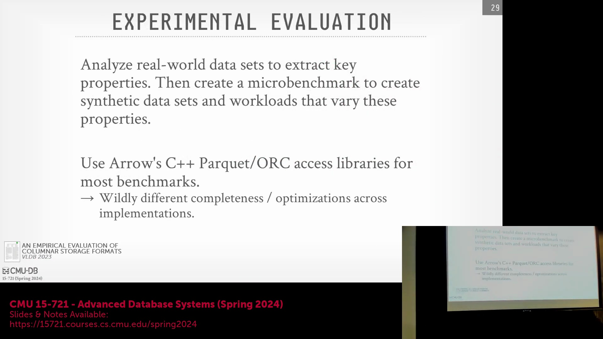
为突破合成基准测试(Synthetic Benchmarks)的局限性，研究人员采用源自 Hugging Face 与 GitHub 等平台的真实生产数据集(Real-World Datasets)，对 Parquet 与 ORC 进行了深度评估。对比分析面临的核心挑战在于各语言特定实现(Language-Specific Implementations)间的行为差异。为确保公平且高性能的横向对比，本研究统一采用 Apache Arrow 的 C++ 库(Apache Arrow C++ Library)作为底层读写引擎，从而规避了传统 Java 实现中常见的 SIMD 指令集支持不统一，或对可选规范特性（如页级区域映射(Page-Level Zone Map)）处理不一致等问题。该实验配置提供了真正意义上的公平对标(Fair Comparison)，精准量化了两种格式在现代硬件优化型查询执行引擎(Hardware-Optimized Query Execution Engine)下的实际性能表现。

## 压缩效率与查询性能的权衡(Compression Efficiency vs. Query Performance Trade-offs)
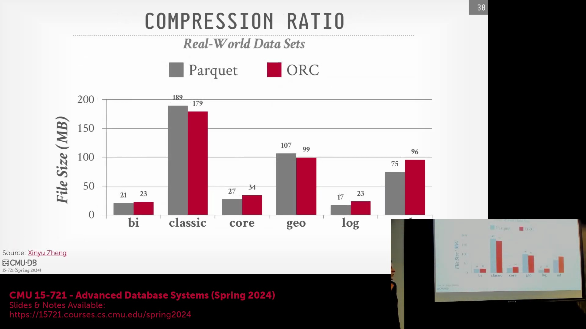
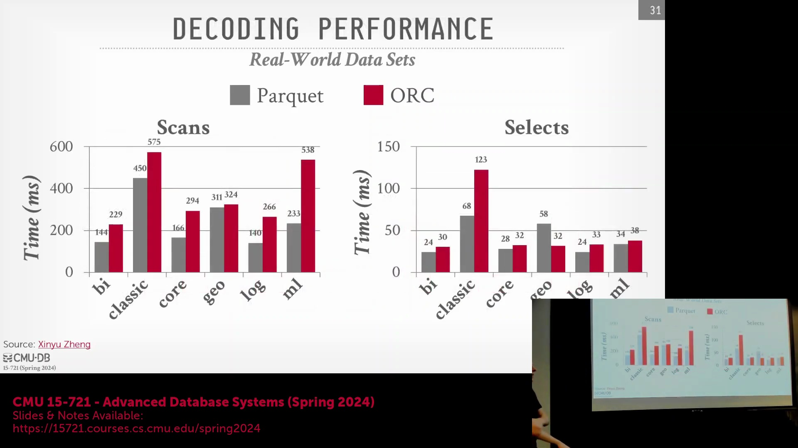
尽管 Parquet 与 ORC 在整体文件大小(Overall File Size)上差异微乎其微，但其底层压缩策略会因目标工作负载(Workload)的不同而呈现出截然不同的性能特征(Performance Characteristics)：
- **存储效率(Storage Efficiency)：** 在以浮点数(Floating-Point Numbers)为主导的机器学习(Machine Learning)与日志记录(Logging)工作负载中，Parquet 凭借对浮点数据激进应用字典编码(Dictionary Encoding)，实现了更优的压缩收益（此类数据在特定分布下往往具备意外的可压缩性）。而在富含字符串(String-Rich)的传统业务与地理空间(Geospatial)工作负载中，ORC 则表现更为出色，这得益于其采用了更为丰富的字典后编码(Post-Dictionary Encoding)策略。
- **执行速度与向量化(Execution Speed & Vectorization)：** Parquet 始终展现出更快的顺序扫描(Sequential Scan)性能。其对直接位打包(Direct Bit-Packing)的依赖，为实现高度优化的线性无分支(Branch-Free) SIMD 向量化(SIMD Vectorization)创造了条件。相比之下，ORC 倾向于激进采用游程编码(Run-Length Encoding, RLE)；该策略虽能在连续重复数据上频繁生效，但往往会打断向量化流水线，迫使执行引擎回退至标量 SISD(Single Instruction, Single Data)处理模式。
- **分支预测错误代价(Branch Misprediction Penalty)：** ORC 依赖启发式规则(Heuristic-Based Rules)进行动态编码选择，这会在运行时解码(Decoding)阶段引入大量条件分支。在现代超标量 CPU(Superscalar CPU)架构中，此类不可预测分支极易引发流水线冲刷(Pipeline Flush)与执行停顿(Stall)。Parquet 则凭借更简洁、确定性更强的编码路径(Encoding Path)，彻底规避了此类性能损耗。
- **设计理念(Design Philosophy)：** 评估结果深刻揭示，在现代硬件架构下，设计的简洁性(Architectural Simplicity)与可预测的内存访问模式(Predictable Memory Access Patterns)通常优于复杂的自适应压缩(Complex Adaptive Compression)算法。相较于追求微乎其微的存储空间节省，最小化分支预测错误(Branch Misprediction)并最大化连续、可向量化的数据流(Continuous Vectorizable Data Stream)具有更高的性能价值。这一核心原则也正持续驱动着现代查询编译(Query Compilation)与代码特化(Code Specialization)技术的演进。

---

## 代码特化(Code Specialization)与架构简洁性(Architectural Simplicity)

现代查询引擎(Query Engine)广泛采用代码特化与编译技术，以彻底消除运行时分派(Runtime Dispatch)开销。传统数据库系统在执行期往往依赖冗长的 `switch-case` 结构来处理异构数据类型，这不仅引入高昂的间接调用开销(Indirect Call Overhead)，更易触发 CPU 分支预测错误(Branch Misprediction)。通过在编译期(Compile Time)生成类型感知(Type-Aware)的特化代码，执行引擎得以完全规避此类复杂的控制流(Control Flow)。Parquet 刻意维持的极简类型系统(Type System)与此设计范式高度契合，其精简的编码方案(Encoding Scheme)使编译器能够直接输出高度优化的线性机器码(Linear Machine Code)，无需引入复杂的运行时类型检查(Runtime Type Checking)或条件分支(Conditional Branches)。

## 字典编码(Dictionary Encoding)的普适有效性(Universal Effectiveness)

近期实证研究(Empirical Research)揭示了一个关键洞见：字典编码在**所有**数据类型上均能带来显著的压缩率与性能增益，其适用范围绝不仅限于变长字符串(Variable-Length Strings)。与传统认知(Conventional Wisdom)相反，将字典编码应用于浮点数(Floating-Point Numbers)与整型(Integer Types)数据，通常能大幅缩减存储体积并加速下游处理流水线。这种普适性极大简化了存储引擎(Storage Engine)的架构设计，有力证明了单一且高度优化的编码策略(Encoding Strategy)往往优于复杂且碎片化的类型特定启发式算法(Type-Specific Heuristics)。

## 硬件演进(Hardware Evolution)与摒弃不透明压缩(Opaque Compression)的转变

自 Parquet 与 ORC 等列式格式(Columnar Formats)问世十余年来，底层硬件环境已发生根本性演进。随着网络带宽(Network Bandwidth)与 SSD 吞吐量(SSD Throughput)的指数级跃升，计算瓶颈已从磁盘/网络 I/O 转移至 CPU 算力(CPU Cycles)。在此背景下，继续依赖 Snappy 或 Zstandard 等通用且不透明(Opaque)的块压缩算法(Block Compression Algorithms)已显得愈发低效。此类方案强制查询引擎在执行任何分析逻辑前，必须对数据块进行全量解压(Full Decompression)，从而彻底扼杀了向量化执行(Vectorized Execution)的优化空间。当前，业界更倾向于采用原生且具备语义感知(Semantic-Aware)特性的轻量级编码技术（如字典编码、游程编码 Run-Length Encoding, RLE、位打包 Bit-Packing）。这些方案在实现数据压缩的同时，完整保留了底层逻辑结构，使系统能够直接在编码数据流(Encoded Data Stream)上执行算子运算，彻底免除了昂贵且会阻塞 CPU 流水线(Pipeline-Stalling)的解压开销。

## 当前文件格式的关键局限性(Key Limitations of Current File Formats)

尽管 Parquet 与 ORC 已获得业界广泛采用，但其固有的架构局限性(Architectural Limitations)正逐渐制约现代分析型处理(Modern Analytical Processing)的进一步演进。首先，文件内嵌的统计信息(Embedded Statistics)过于匮乏；尽管原生支持基础的区域映射(Zone Maps)与布隆过滤器(Bloom Filters)，却缺乏查询优化器(Query Optimizer)进行精准基数估计(Cardinality Estimation)所必需的直方图(Histograms)与概率草图(Probabilistic Sketches)。其次，模式反序列化(Schema Deserialization)效率低下。此类格式普遍采用 Protobuf 或 Thrift 对完整模式(Schema)进行序列化，导致执行引擎必须预先解析海量列定义(Column Definitions)，即便查询实际仅触及寥寥数字段。最后，开发生态系统呈现高度碎片化(Ecosystem Fragmentation)。各语言特定实现(Language-Specific Bindings)在代码质量与规范遵循度(Specification Compliance)上差异显著，众多第三方库至今仍未集成 SIMD 硬件加速(SIMD Hardware Acceleration)，或对可选元数据规范(Optional Metadata Specifications)的支持参差不齐。

## 下一代编码(Next-Generation Encoding)：面向 SIMD 与 FastLanes 的优化

分析型存储(Analytical Storage)的演进方向，明确指向专为现代 CPU 微架构(Modern CPU Microarchitectures)量身定制的编码方案。正如《FastLanes》学术论文(FastLanes Paper)所强调，下一代数据格式将内存布局(Memory Layout)的优化置于首位，而非拘泥于数据的逻辑插入顺序(Logical Insertion Order)或传统排序规则。此类系统摒弃了按数据到达时序盲目写入的模式，转而在内存中执行显式的数据重组(Data Reorganization)，旨在极致压榨 SIMD(单指令多数据流, Single Instruction Multiple Data)硬件通道的并行算力。通过将底层位级(Bit-Level)与数据块(Block-Level)的物理排布，与向量化执行流水线(Vectorized Execution Pipelines)进行严格对齐，现代编码策略成功突破了传统硬件瓶颈(Hardware Bottlenecks)，将查询吞吐量(Query Throughput)推升至传统列式格式(Traditional Columnar Formats)难以企及的性能新高度。