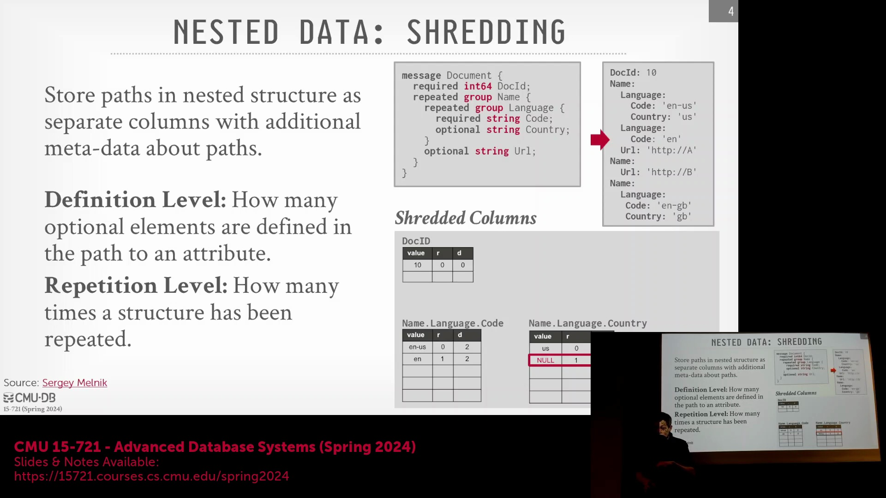
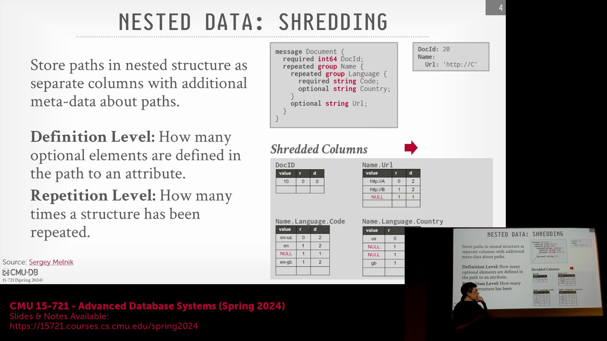
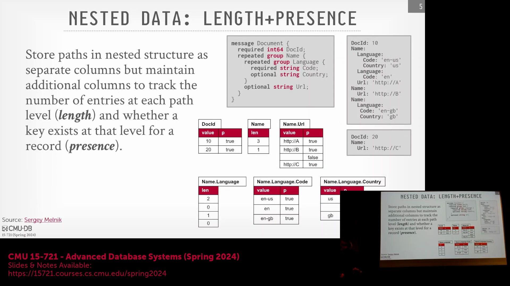
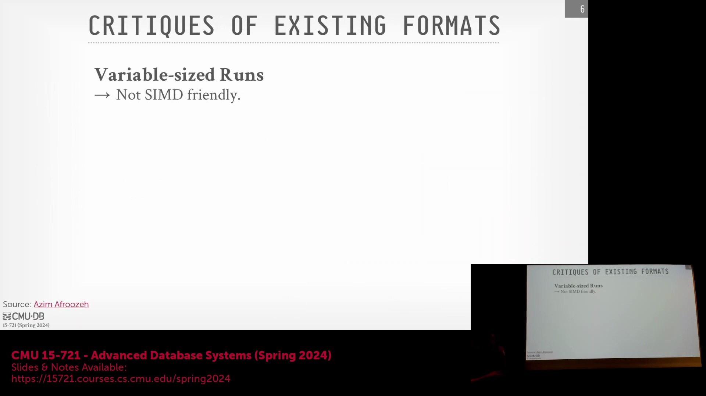
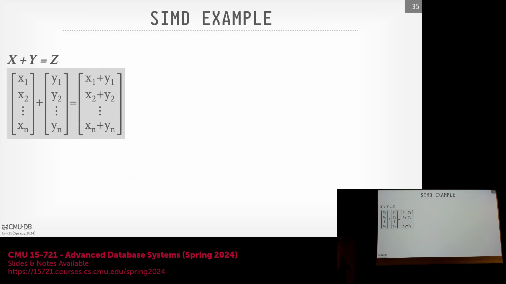
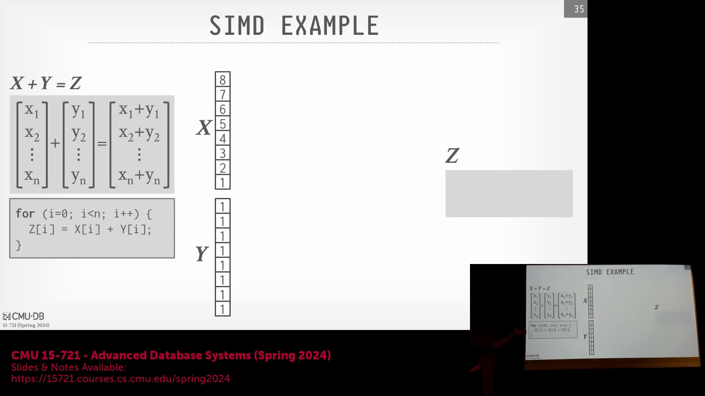
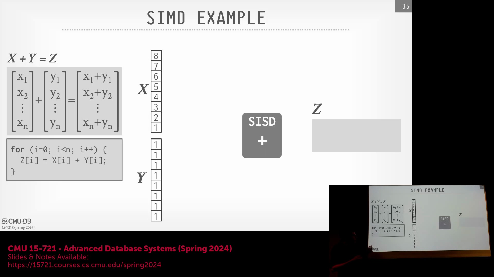

## 通过列式拆分优化查询性能
在讨论 Dremel 的拆分(Shredding)机制时，常有一个疑问：将嵌套结构(Nested Structure)存储为独立的列是否优于使用指针？答案通常是肯定的，尤其是在分析型查询(Analytical Query)性能方面。通过将数据路径物化(Materialize)为独立的列，数据库引擎可以直接扫描目标列（例如 `name.language.code`），而无需在执行 `SELECT` 查询时遍历指针链(Pointer Chain)或重建中间对象。尽管从拆分后的列中重新组装完整的原始文档会产生显著开销，但这种设计是一种有意的权衡(Trade-off)。该格式优先考虑读取密集型工作负载(Read-Intensive Workload)和基于路径的快速查找，而非写入时的结构重建，而这正是数据仓库(Data Warehouse)中的主导访问模式(Access Pattern)。

## 逻辑 JSON 与物理存储策略
在逻辑层(Logical Layer)，SQL 标准(SQL Standard)定义了供开发者交互的原生 JSON 数据类型(Native JSON Data Type)与结构。然而，物理存储层(Physical Storage Layer)可以灵活地采用任何有利于提升性能的方式来组织数据。Snowflake 等系统便是典型代表：它们在保留原始 JSON 二进制大对象(Binary Large Object, BLOB)的同时，会在后台自动构建出经过优化的强类型列(Strongly-Typed Column)（如 `VARCHAR` 或 `INT`）。Dremel 选择将嵌套结构完全拆分，旨在优化最常见的路径遍历(Path Traversal)场景。若将所有数据存储为不透明的二进制大对象(Opaque BLOB)，查询引擎就必须在每次执行查询时重新解析和解码数据结构；而拆分技术实质上完成了预解析(Pre-parsing)与布局物化(Layout Materialization)，从而实现了数据的即时访问。

## Dremel 编码级别与性能权衡
在逐步解析 Dremel 论文示例时，我们对原始演示幻灯片中重复级别(Repetition Level)和定义级别(Definition Level)的具体数值进行了细微修正。需要强调的是，重复级别严格追踪的是重复组(Repetition Group)在特定层级上出现的次数，而非单纯的路径深度。尽管业界存在诸如“长度与存在性编码(Length-and-Presence Encoding)”等替代方案（即为每一层记录布尔型存在标志(Boolean Presence Flag)），但 Dremel 团队的实证研究(Empirical Study)表明，在实际分析场景中，采用重复/定义列的完整拆分技术始终表现更优。基于这些已验证的结论，本课程仅简要提及长度与存在性编码，随后将重点转向更宏观的系统架构设计(System Architecture Design)问题。

## 现代硬件环境下的传统文件格式
Parquet 和 ORC(Optimized Row Columnar) 等传统列式文件格式(Columnar File Format)设计于 2011 至 2012 年前后，彼时网络带宽(Network Bandwidth)与磁盘输入/输出(Disk I/O)是主要性能瓶颈。因此，它们大量采用高压缩率算法以最小化数据传输量，并容忍较高的中央处理器(CPU)解码开销。如今的云基础设施(Cloud Infrastructure)已彻底改变了这一格局，超高速网络连接（如 100+ Gbps）的普及使得输入/输出(I/O)不再是关键瓶颈，新的性能瓶颈往往转移至 CPU 计算效率。此外，Parquet 和 ORC 会在列块(Column Chunk)中生成变长编码序列(Variable-Length Encoded Sequence)，迫使执行引擎在解码时大量依赖条件分支(Conditional Branch)。这些难以预测的执行路径(Unpredictable Execution Path)严重制约了现代向量化执行引擎(Vectorized Execution Engine)的性能发挥。

## SIMD 架构与向量化执行
为了突破这些限制，现代数据库广泛采用 SIMD(Single Instruction, Multiple Data) 并行架构。与传统的标量(Single Instruction, Single Data, SISD)处理模式（即在循环中逐个处理数据元素）不同，SIMD 允许中央处理器(CPU)使用单条指令同时作用于多个数据元素。通过将数据打包至宽位宽硬件寄存器(Wide Hardware Register)（如 128 位、256 位或 512 位的 AVX-512(Advanced Vector Extensions 512-bit) 指令集），向量加法(Vector Addition)等运算能够并行处理整块数据。例如，累加 8 个 32 位整数所需的操作可从 8 条标量指令(Scalar Instruction)骤降至仅 2 条 SIMD 指令。尽管在实际部署中仍需考量特定硬件因素（例如部分 CPU 在启用 AVX-512 时会触发频率降频(Frequency Throttling)），但其带来的吞吐量(Throughput)提升优势是毋庸置疑的。因此，现代文件格式与查询引擎必须优先采用定长、无分支(Fixed-Length, Branch-Free)的数据布局，从而充分释放 SIMD 寄存器的潜力，实现极致的计算效率。

