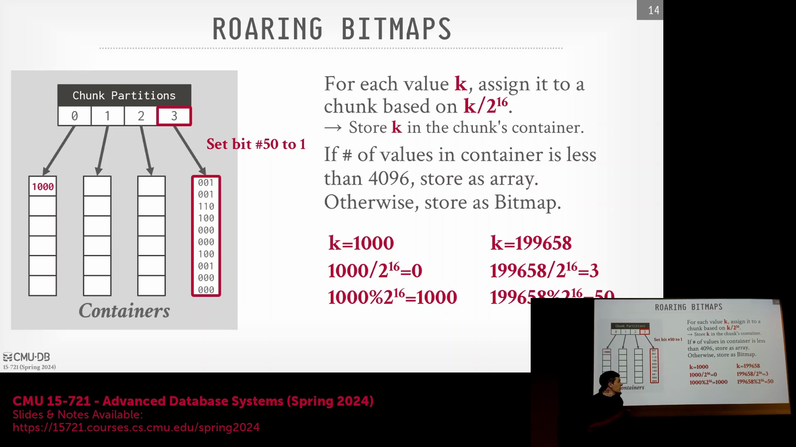
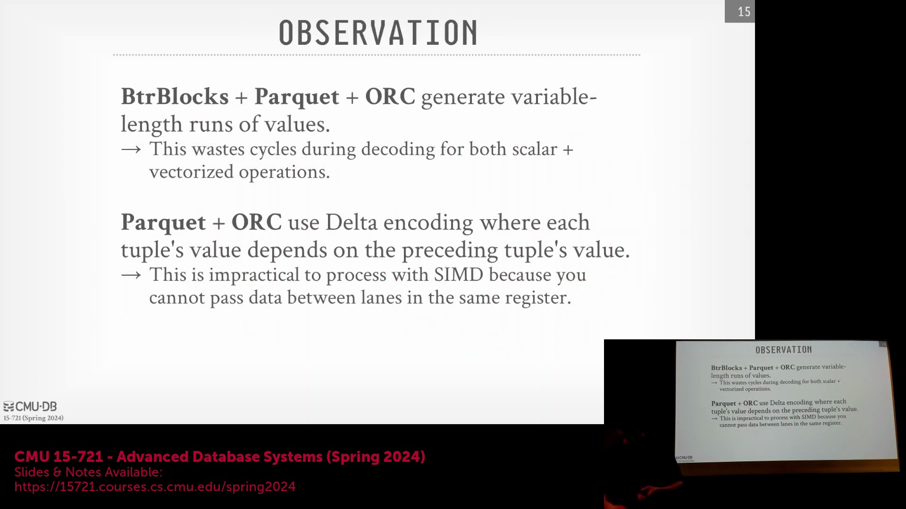
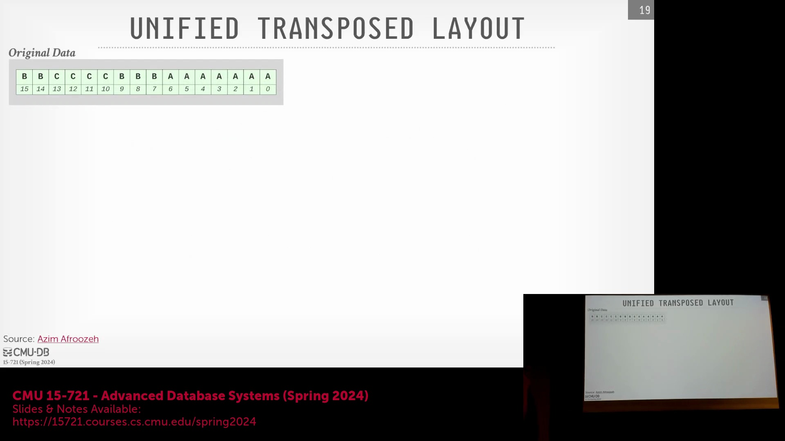
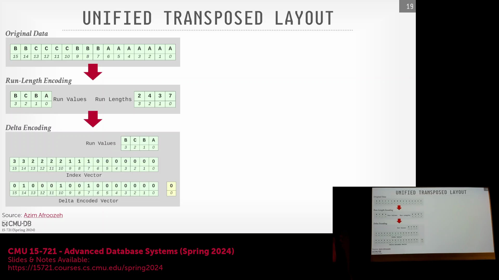

## 咆哮位图(Roaring Bitmaps)：自适应密度与查找机制
咆哮位图(Roaring Bitmaps)通过根据数据密度动态调整内部数据结构，有效解决了传统稀疏位图(Sparse Bitmap)的效率瓶颈。64位整数空间(64-bit Integer Space)被划分为多个大小为 2^16 的数据容器(Container)。在每个容器内，若置位(Set Bit)数量少于 4,096 个，系统采用紧凑的 16 位整数有序数组(Sorted Array of 16-bit Integers)进行存储；一旦数据密度超过该阈值，则自动切换为标准的未压缩位图(Bitset)。这种混合架构不仅确保了集合成员资格查询(Set Membership Query)的快速响应与绝对精确（零误报，区别于概率型的布隆过滤器(Bloom Filter)），还显著降低了缓存未命中率(Cache Miss Rate)。尽管早期曾提出过复杂的分层分块方案(Hierarchical Chunking Scheme)，但现代系统已基本弃用，因为过多的条件分支(Conditional Branch)与指针跳转(Pointer Chasing)会严重破坏超标量处理器流水线(Superscalar CPU Pipeline)的执行效率。

## SIMD 对齐与填充开销
诸如 Parquet 的传统列式格式(Columnar Format)在存储时会产生变长编码序列(Variable-Length Encoded Sequence)，从而严重损害 SIMD(Single Instruction, Multiple Data) 指令的执行效率。Better Blocks 通过规避 Delta 编码等强数据依赖方案缓解了该问题，但仍需直面数据对齐(Data Alignment)的挑战。当一组数值无法恰好填满 SIMD 寄存器(SIMD Register)时（例如在具有 16 个通道(Lane)的 AVX-512 寄存器中仅加载了 12 个有效数值），系统必须在剩余通道中填充占位数据(Padding)，并在后续阶段执行掩码清理操作(Mask Cleanup)。这种固有的数据不对齐现象不仅浪费了宝贵的计算周期(CPU Cycles)，还导致查询引擎在连续数据扫描时无法充分释放中央处理器(CPU)向量运算单元(Vector Processing Unit)的并行算力。

## FastLanes 与虚拟指令集架构抽象
FastLanes 并非一种完整的独立文件格式，而是一种专为数据并行计算(Data Parallel Computing)设计的高度优化的底层编码策略(Low-level Encoding Strategy)。为确保跨平台兼容性(Cross-Platform Compatibility)与技术前瞻性，研究团队定义了一套“虚拟指令集架构(Virtual Instruction Set Architecture, Virtual ISA)”，该架构预设使用 1024 位宽的 SIMD 寄存器。所有核心操作均基于此抽象层实现，随后被编译转换为可在现有硬件（如 AVX-512）上高效运行的机器码，或在必要时自动降级至标量(Single Instruction, Single Data, SISD)指令执行。这种抽象设计成功将核心算法逻辑与特定硬件供应商的底层限制相解耦(Decoupling)，使得该编码策略能够伴随更宽向量寄存器(Vector Register)的硬件迭代实现无缝扩展。

## 元组重排与正弦波布局
FastLanes 的核心突破在于其创新性引入的“正弦波传输布局(Sinewave Transport Layout)”，该布局允许对数据元组(Data Tuple)进行物理重排。基于关系模型(Relational Model)中数据表本质为无序集合(Unordered Set)的理论，数据库引擎可自由调整物理存储顺序以优化执行效率。FastLanes 巧妙利用这一特性，在数据编码前执行重排操作，确保数值序列严格对齐 SIMD 通道边界(SIMD Lane Boundary)。此举彻底消除了冗余的填充操作(Padding Operation)，移除了传统解码流程中的条件分支指令(Conditional Branch)，并确保处理器在每个指令周期均执行有效计算。随后，系统针对重排后的数据序列组合应用游程编码(Run-Length Encoding, RLE)与 Delta 编码(Delta Encoding)。这一流程充分证明了：通过结构化的数据重排，能够将原本与 SIMD 架构不兼容的存储格式，转化为高度向量化且无分支的高效数据流(Highly Vectorized and Branch-Free Data Stream)。

