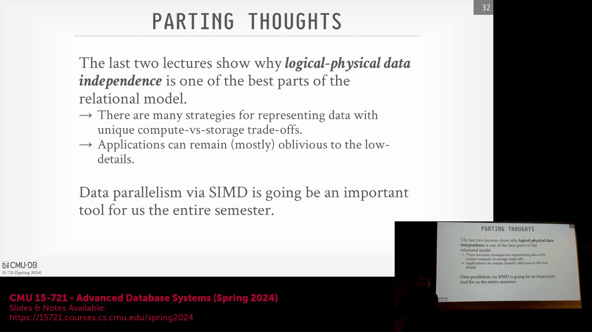

## 逻辑与物理数据独立性
“哦，你的数据指针(Data Pointer)究竟指向哪里？”作为一名深谙关系模型(Relational Model)的开发者，这种底层设计简直令人噩梦连连。为何要暴露指针？为何要依赖指针？这绝对是个糟糕的设计决策。我们期望数据库底层能够仅通过固定长度偏移量(Fixed-length Offset)来自由管理数据，而无需显式处理指针或其他复杂细节。更重要的是，应用程序开发者绝不应直接感知到这些底层指针。所有底层操作必须对上层完全透明(Transparent)。唯有如此，开发者才能专注于编写正确的 SQL(Structured Query Language) 语句。无论底层采用何种存储引擎或执行语言，面向用户的上层接口(Interface)都必须保持稳定不变。

## SIMD 在数据库系统中的作用
此外，基于 SIMD(Single Instruction, Multiple Data) 实现的数据并行性(Data Parallelism) 将成为贯穿本学期的核心工具。下周一指定的阅读文献，正是将 SIMD 技术引入数据库领域的先驱之作(Pioneering Work)。该论文发表于 2006 至 2007 年间。尽管当时 SIMD 在数据库系统中的实际应用潜力尚未完全显现，但作者提出了一种创新的查询处理模型(Query Processing Model)，旨在对海量数据库操作进行向量化(Vectorization)优化。后续课程中，我们将陆续看到基于 SIMD 的新型连接(Join)、过滤(Filter)及其他核心算法不断涌现。

## 结语与背景歌词片段
数之不尽，你懂的，你得勒紧腰带去拎那瓶 40 盎司的烈酒。
稳住阵脚，浅酌一口，便又是一地空瓶的战场。
没什么难解的谜题，只因我生来便是硬汉。

沉醉于这 40 盎司的微醺，剑畔斜倚着四罐佳酿。
桌上堆叠着六罐装的阵列，目光所及仍是那熟悉的酒标。

别留余地，备好行头，你清楚是什么摆平了一切？
旋开瓶盖，初次倾壶而饮。将它置于冰柜深处，只为一饮而尽。

当心碎玻璃，宝贝，我们不过是在清理残局。
且听我说，这感觉太过癫狂，连同那浸透衣衫的苦涩。

隔着粗布将其咽下，绷紧肌肉。收起那包药剂。
此刻无需多言，那不过是又一个奔向深渊的醉客。

尽情摇摆吧，滋味确是醇厚，击碎那些懦弱的伪装。
做个顶天立地的汉子，切勿怀揣虚妄之心。
