## 课程简介与注意事项
欢迎来到卡内基梅隆大学高级数据库系统(Advanced Database Systems)课程，本次课程在演播室现场观众面前录制。在深入技术内容之前，先说明一项课程安排：我们将于本周三结束关于项目提案(Project Proposal)汇报的讨论，因此请将相关问题留到届时再提出。

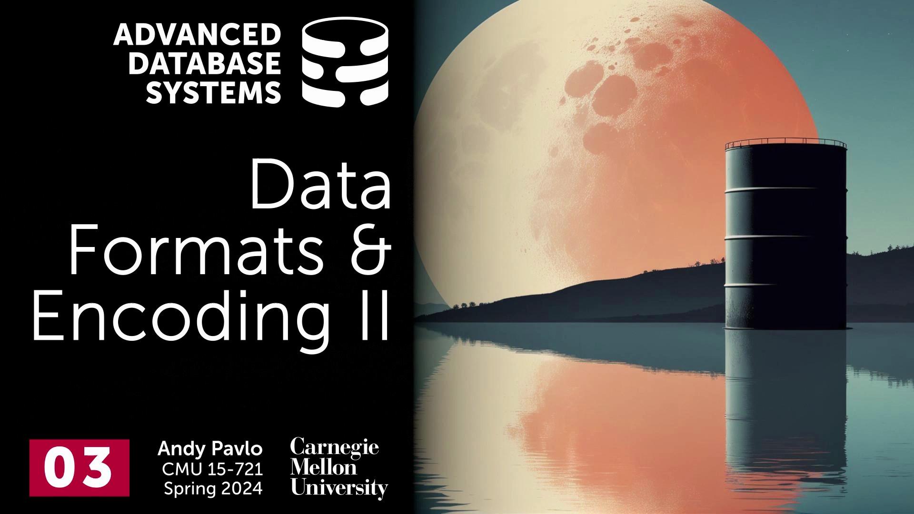
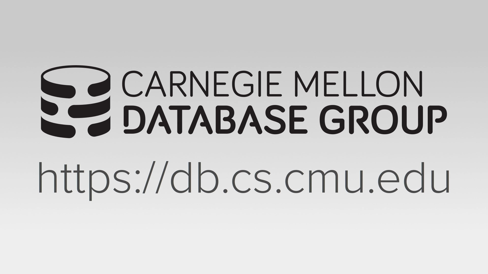

## 存储模型与文件元数据回顾
今天的课程承接上次内容，重点讲解数据文件的物理布局(Physical Layout)。回顾一下，现代数据库系统通常不再采用纯粹的 N元组存储模型(N-ary Storage Model, NSM)或分解存储模型(Decomposition Storage Model, DSM)，而是转向混合列式架构(Hybrid Columnar Architecture)。数据表会被划分为水平分区或行组(Row Group)，在每个组内，各列的数据会连续排列，处理完一列后再跳转到下一列。这种设计既吸收了列式存储的高压缩率优势，又保留了行式存储的空间局部性(Spatial Locality)。我们还探讨了文件格式的底层细节，包括存储在文件页脚(Footer)中的元数据(Metadata)、行组跳转偏移量、数据布局（行式与列式），以及类型系统(Type System)中的嵌套结构。

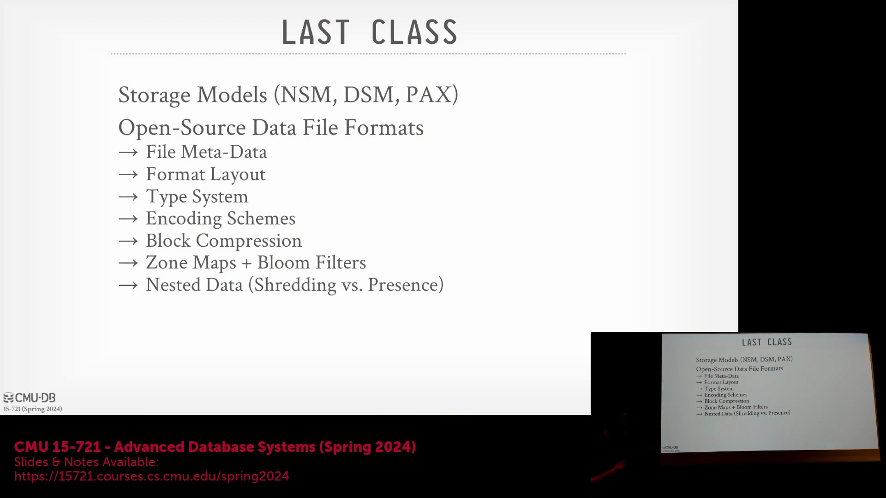

## 压缩技术与拆分简介
在应用编码方案(Encoding Scheme)之后，标准的数据处理流水线通常会对编码后的数据应用通用的块压缩算法(Block Compression Algorithm)，例如 Snappy 或 Zstandard（请注意，GZip 在现代分析型数据库(Analytical Database)中已很少使用）。我们之前简要介绍了“拆分(Shredding)”的概念，该技术源自 Google BigQuery 的底层引擎 Dremel 项目。今天，在过渡到本学期重点研读的论文之前，我将更详细地讲解拆分技术，因为这一核心概念将在后续课程中反复出现。

## 半结构化数据处理与隐式模式
现实世界的数据集中充斥着 JSON 文档或 Protocol Buffers 数据。将其存储为单一的 `varchar` 或 `blob` 列虽能实现基础的数据提取，但会丧失列式存储的核心性能优势，例如 PAX模型(Partition Attributes Across) 和向量化执行(Vectorized Execution)。取而代之的是，系统会对每个文档进行“拆分(Shred)”或展开操作，将每个 JSON 路径(JSON Path)存储为独立的列。尽管 NoSQL 数据库以“无模式(Schema-less)”为卖点（即无需编写显式的 `CREATE TABLE` 语句），但隐式模式(Implicit Schema)始终存在。应用程序极少生成完全随机的文档；它们之间存在足够的结构重叠(Structural Overlap)，足以将数据可靠地分解为具有明确数据类型的列。

## 记录拆分的核心机制
记录拆分(Record Shredding)机制将每个文档路径存储为独立的列，并使用两个辅助整型列来追踪嵌套上下文(Nested Context)：**定义级别(Definition Level)**和**重复级别(Repetition Level)**。定义级别记录了从根节点到达当前值的路径上，实际存在多少个有效的非空步骤。重复级别则用于追踪特定层级上重复组(Repetition Group)的重复次数。与传统的空值填充策略不同，拆分技术避免了为缺失字段存储显式空值标记(Explicit Null Marker)。尽管该方法为每个属性引入了额外的元数据列，但这些整型数组具有极高的压缩率(Compression Ratio)，能在保留优异查询性能的同时，最大限度地降低存储开销。

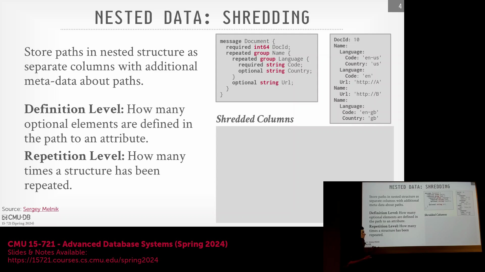

## 逐步示例演示与问答
为了具体说明，假设存在一个类似 Protocol Buffer 或具有明确 JSON Schema 的文档。对于顶层字段 `document ID`，其重复级别(Repetition Level)和定义级别(Definition Level)的初始值均为零。当进入包含重复 `language` 子组的嵌套 `name` 结构时，第一个 `code` 条目的重复级别为零（表示首次出现），定义级别为二（表示路径深入了两层）。当添加 `country` 字段（值为 "US"）时，重复级别设为零，定义级别设为三，以反映其更深的嵌套路径。在处理第二个 `language` 组时，重复级别递增为一。若在某次重复迭代中 `country` 等可选字段缺失，系统仍会记录一条带有相应重复级别的条目，但其定义级别会降低，以反映实际存在的最浅有效路径。这种方法能在不增加额外存储负担的情况下，高效地表示字段缺失。在示例演示环节，关于深度计算规则得到了进一步澄清：定义级别仅严格统计路径中实际存在的非空节点步骤。若某个可选节点缺失，则不计入深度累加，这使查询引擎(Query Engine)能够在执行时准确重建原始的嵌套数据结构。

---

## 通过列式拆分优化查询性能
在讨论 Dremel 的拆分(Shredding)机制时，常有一个疑问：将嵌套结构(Nested Structure)存储为独立的列是否优于使用指针？答案通常是肯定的，尤其是在分析型查询(Analytical Query)性能方面。通过将数据路径物化(Materialize)为独立的列，数据库引擎可以直接扫描目标列（例如 `name.language.code`），而无需在执行 `SELECT` 查询时遍历指针链(Pointer Chain)或重建中间对象。尽管从拆分后的列中重新组装完整的原始文档会产生显著开销，但这种设计是一种有意的权衡(Trade-off)。该格式优先考虑读取密集型工作负载(Read-Intensive Workload)和基于路径的快速查找，而非写入时的结构重建，而这正是数据仓库(Data Warehouse)中的主导访问模式(Access Pattern)。

## 逻辑 JSON 与物理存储策略
在逻辑层(Logical Layer)，SQL 标准(SQL Standard)定义了供开发者交互的原生 JSON 数据类型(Native JSON Data Type)与结构。然而，物理存储层(Physical Storage Layer)可以灵活地采用任何有利于提升性能的方式来组织数据。Snowflake 等系统便是典型代表：它们在保留原始 JSON 二进制大对象(Binary Large Object, BLOB)的同时，会在后台自动构建出经过优化的强类型列(Strongly-Typed Column)（如 `VARCHAR` 或 `INT`）。Dremel 选择将嵌套结构完全拆分，旨在优化最常见的路径遍历(Path Traversal)场景。若将所有数据存储为不透明的二进制大对象(Opaque BLOB)，查询引擎就必须在每次执行查询时重新解析和解码数据结构；而拆分技术实质上完成了预解析(Pre-parsing)与布局物化(Layout Materialization)，从而实现了数据的即时访问。

## Dremel 编码级别与性能权衡
在逐步解析 Dremel 论文示例时，我们对原始演示幻灯片中重复级别(Repetition Level)和定义级别(Definition Level)的具体数值进行了细微修正。需要强调的是，重复级别严格追踪的是重复组(Repetition Group)在特定层级上出现的次数，而非单纯的路径深度。尽管业界存在诸如“长度与存在性编码(Length-and-Presence Encoding)”等替代方案（即为每一层记录布尔型存在标志(Boolean Presence Flag)），但 Dremel 团队的实证研究(Empirical Study)表明，在实际分析场景中，采用重复/定义列的完整拆分技术始终表现更优。基于这些已验证的结论，本课程仅简要提及长度与存在性编码，随后将重点转向更宏观的系统架构设计(System Architecture Design)问题。

## 现代硬件环境下的传统文件格式
Parquet 和 ORC(Optimized Row Columnar) 等传统列式文件格式(Columnar File Format)设计于 2011 至 2012 年前后，彼时网络带宽(Network Bandwidth)与磁盘输入/输出(Disk I/O)是主要性能瓶颈。因此，它们大量采用高压缩率算法以最小化数据传输量，并容忍较高的中央处理器(CPU)解码开销。如今的云基础设施(Cloud Infrastructure)已彻底改变了这一格局，超高速网络连接（如 100+ Gbps）的普及使得输入/输出(I/O)不再是关键瓶颈，新的性能瓶颈往往转移至 CPU 计算效率。此外，Parquet 和 ORC 会在列块(Column Chunk)中生成变长编码序列(Variable-Length Encoded Sequence)，迫使执行引擎在解码时大量依赖条件分支(Conditional Branch)。这些难以预测的执行路径(Unpredictable Execution Path)严重制约了现代向量化执行引擎(Vectorized Execution Engine)的性能发挥。

## SIMD 架构与向量化执行
为了突破这些限制，现代数据库广泛采用 SIMD(Single Instruction, Multiple Data) 并行架构。与传统的标量(Single Instruction, Single Data, SISD)处理模式（即在循环中逐个处理数据元素）不同，SIMD 允许中央处理器(CPU)使用单条指令同时作用于多个数据元素。通过将数据打包至宽位宽硬件寄存器(Wide Hardware Register)（如 128 位、256 位或 512 位的 AVX-512(Advanced Vector Extensions 512-bit) 指令集），向量加法(Vector Addition)等运算能够并行处理整块数据。例如，累加 8 个 32 位整数所需的操作可从 8 条标量指令(Scalar Instruction)骤降至仅 2 条 SIMD 指令。尽管在实际部署中仍需考量特定硬件因素（例如部分 CPU 在启用 AVX-512 时会触发频率降频(Frequency Throttling)），但其带来的吞吐量(Throughput)提升优势是毋庸置疑的。因此，现代文件格式与查询引擎必须优先采用定长、无分支(Fixed-Length, Branch-Free)的数据布局，从而充分释放 SIMD 寄存器的潜力，实现极致的计算效率。

---

## SIMD 约束与传统格式的限制
现代 SIMD(Single Instruction, Multiple Data) 架构要求硬件寄存器通道(Register Lane)内的所有数据元素必须具有固定且统一的大小。因此，变长编码(Variable-Length Encoding)在加载至寄存器前必须进行定长化处理，这会带来显著的计算开销。此外，Parquet 和 ORC(Optimized Row Columnar) 等传统列式格式(Columnar Format)通常会在读取时直接解压数据，从而剥离了宝贵的底层结构信息。这种做法隐藏了底层的字典编码(Dictionary Encoding)，并使经过块压缩(Block Compression)的数据（例如通过 Snappy 或 Zstandard 压缩的数据）对数据库引擎而言成为完全不透明的黑盒(Opaque Black Box)。其结果是，系统无法直接在编码流上执行查找或原生操作，导致在查询执行前必须进行完整的数据物化(Data Materialization)。

## 数值间依赖与 SIMD 并行性
某些轻量级编码方案（如 Delta 编码(Delta Encoding) 和游程编码(Run-Length Encoding, RLE)）会在相邻数据值之间引入顺序依赖(Sequential Dependency)。在 SIMD 寄存器中，硬件操作旨在同时处理多个相互独立的数据元素。当当前值的计算依赖于前序值（例如，需通过将增量与前一个值累加以重建当前值）时，中央处理器(CPU) 便无法高效地执行并行算术运算。相反，系统必须执行代价高昂的寄存器重排(Register Shuffle)和顺序移位操作，从而完全抵消了向量化执行(Vectorized Execution)的性能优势。这种根本性的架构不兼容性，使得传统的编码策略已不再适配现代的硬件加速(Hardware Acceleration)环境。

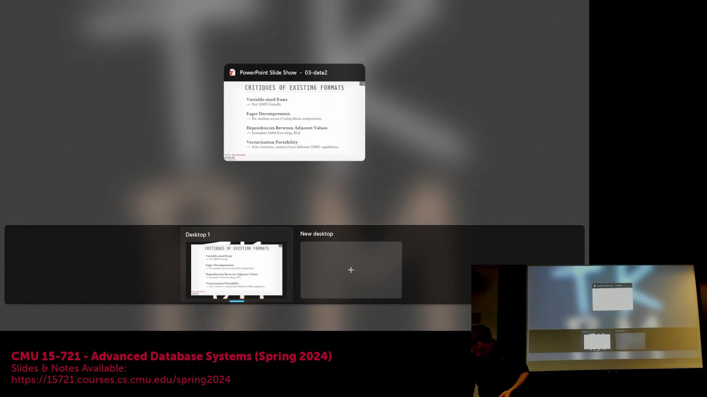

## 硬件多样性与可移植性挑战
ARM、x86（含 AVX-512(Advanced Vector Extensions 512-bit)）、图形处理器(GPU) 和张量处理器(TPU) 等多样化硬件架构的迅速普及，使得底层向量化代码的实现变得日益复杂。每种指令集架构(Instruction Set Architecture, ISA) 都提供不同的 SIMD 能力与底层内建函数(Intrinsics)。尽管存在抽象库可根据底层 CPU 特性动态分派(Dynamic Dispatch)操作，但主流数据库系统为追求极致性能，通常避免使用此类抽象层，转而直接采用手动调优的内建函数。然而，这种硬编码方法牺牲了软件可移植性(Portability)，并迫使执行引擎去适配那些本质上会阻碍编译器自动向量化(Compiler Auto-Vectorization)的僵化文件格式设计。

## 下一代文件格式：FastLanes 与 Better Blocks
为突破上述传统瓶颈，近期学术界引入了全新的存储范式(Storage Paradigm)。*Better Blocks*（源自慕尼黑工业大学）可视为“Parquet++”的演进版本，它利用贪心算法(Greedy Algorithm)对列块(Column Chunk)进行采样，并自动甄选最优的轻量级编码方案(Lightweight Encoding Scheme)。该系统会递归地将最匹配的编码器应用于派生列(Derived Column)，在不依赖不透明块压缩(Opaque Block Compression)的前提下实现高压缩率(Compression Ratio)。*FastLanes* 则采用了截然不同的策略，其刻意以特定的非连续布局(Discontinuous Layout)存储数据，旨在最大限度减少条件分支(Conditional Branch)并最大化运行时解码速度。这两种设计均致力于保持数据结构对中央处理器(CPU)友好且透明，使查询引擎能够在维持高吞吐量(High Throughput)的同时，规避完整数据解压(Data Decompression)的步骤。

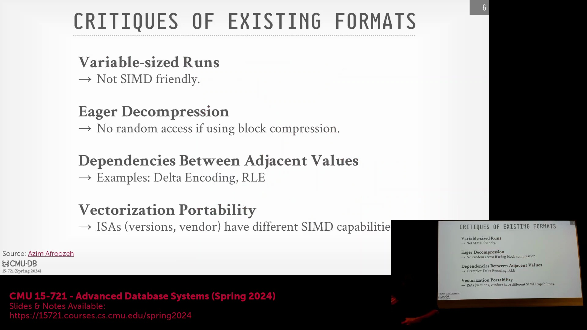

## 外部元数据与设计权衡
*Better Blocks* 一项显著的架构决策是将数据模式(Data Schema)与文件元数据(File Metadata)存储于外部元数据管理服务中，而非嵌入数据文件内部。支持者认为此举实现了底层存储与格式定义的解耦(Decoupling)，但批评者指出，这在文件的自包含性(Self-Containment)与可移植性(Portability)方面做出了重大妥协。将元数据内嵌至文件可确保其在离线或孤立状态下仍能被完整解析，而外部存储方案则引入了额外的依赖风险并增加了数据共享的复杂度。在现代云基础设施中，高度冗余的对象存储(Object Storage)已大幅降低数据永久损坏的风险，因此这种架构分离更多是基于特定设计理念的取舍，而非绝对的技术刚需。最终，这些新一代文件格式优先考量执行效率(Execution Efficiency)与硬件对齐(Hardware Alignment)，在抽象底层复杂性的同时，为应用开发者带来了显著的性能跃升。

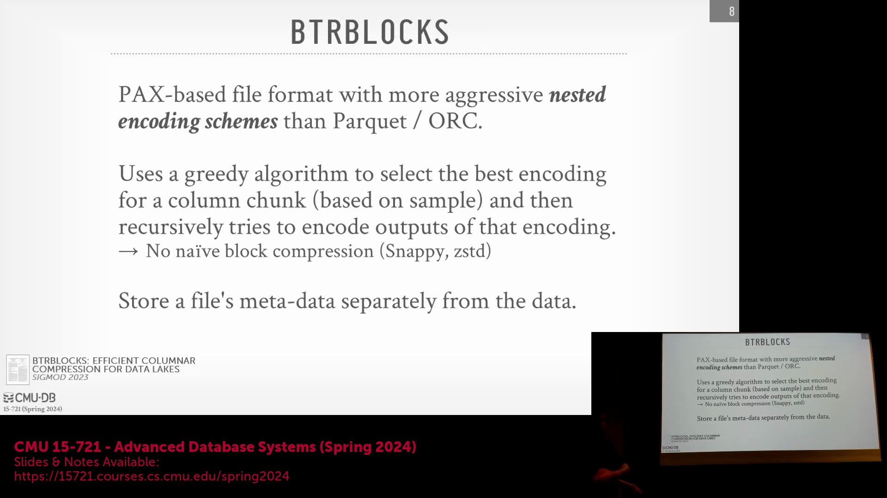

---

## 元数据架构与格式对比
本节首先对比了 Parquet、ORC 以及较新的 *Better Blocks* 等现代列式格式(Columnar Format)。一个关键的设计分歧在于元数据(Metadata)的存储位置：传统格式将数据模式(Data Schema)和编码信息直接嵌入文件页脚(File Footer)，而 *Better Blocks* 则提议将元数据存储在独立的外部管理服务中。支持者认为，这种架构分离允许系统通过字节范围请求(Byte-Range Request)快速扫描元数据（例如 Z-Order 映射(Z-Order Mapping)），从而精准判断是否真正需要读取底层的数据文件(Data File)。然而，讲师指出，像 Amazon S3 这样的云对象存储(Cloud Object Storage)已原生支持高效的字节范围读取，因此内嵌式与外部化元数据在实现查询剪枝(Query Pruning)方面的实际效能是等效的。最终的技术选型，本质上归结于对文件自包含性(Self-Containment)带来的可移植性，与解耦存储架构(Decoupled Storage Architecture)之间的理念权衡(Trade-off)。

## 轻量级编码方案分类
*Better Blocks* 引入了一套全面且对中央处理器(CPU)友好的编码策略(Encoding Strategy)，旨在规避 Delta 编码(Delta Encoding)的顺序依赖(Sequential Dependency)以及重量级块压缩(Heavyweight Block Compression)带来的不透明性。该策略涵盖了针对高度重复数据的游程编码(Run-Length Encoding, RLE)，以及源自 IBM DB2 的频率编码(Frequency Encoding)。频率编码利用位图(Bitmap)隔离出高频常见值，并将低频异常值(Outlier)进行单独存储。其他方案包括结合位打包(Bit Packing)的参考系编码(Frame of Reference, FOR)（即相对于全局最小值存储增量，而非依赖相邻值差值）、标准字典编码(Dictionary Encoding)，以及用于浮点数转换的定点小数编码(Fixed-Point Encoding)。在字符串处理方面，系统采用 FSST 算法(Fast Static Symbol Table, FSST)，在字节或子字符串(Sub-string)级别进行压缩映射，而非针对完整字符串进行字典映射。这一特性使其极其适用于 URL 或日志路径(Log Path)等数据。此外，系统利用 roaring 位图(Roaring Bitmaps)高效追踪空值(Null Values)与异常值的出现频率，从而有效避免存储空间的无谓膨胀(Storage Bloat)。

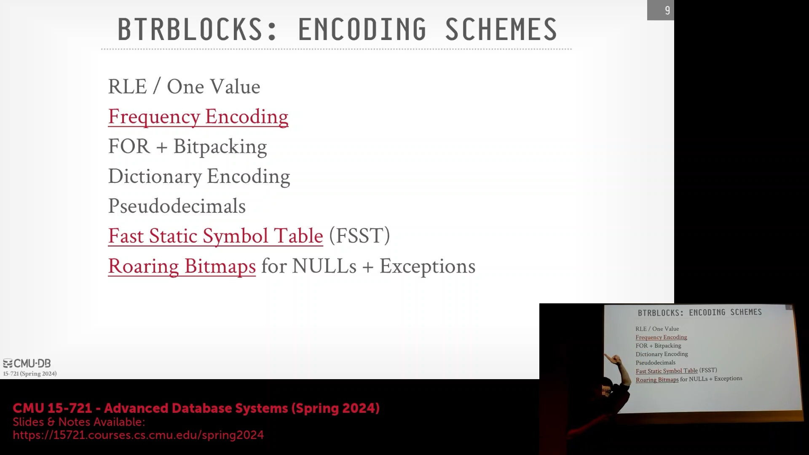

## 用于编码优化的空间采样
与 ORC 依赖小型前瞻缓冲区(Look-ahead Buffer)动态预测编码方案不同，*Better Blocks* 在数据加载(Data Ingestion)阶段执行了更为精细的编码选择流程。为规避纯随机采样(Random Sampling)（易破坏 RLE 的数据连续性）或纯顺序采样(Sequential Sampling)（可能无法准确表征列块整体数据分布(Data Distribution)）的缺陷，该算法在包含 64,000 个数据值的列块(Column Chunk)中，跳转至 10 个均匀间隔的起始位置，并在每个位置提取连续的 64 个值。这种混合采样策略(Hybrid Sampling Strategy)既保留了全局数据的随机代表性，又维持了局部数值的连续性，从而使算法能够精准评估游程编码、字典编码或位打包中哪一种为最优解。一旦针对采样数据确定了最佳编码方案，该方案将被直接推广并应用于整个目标数据块。

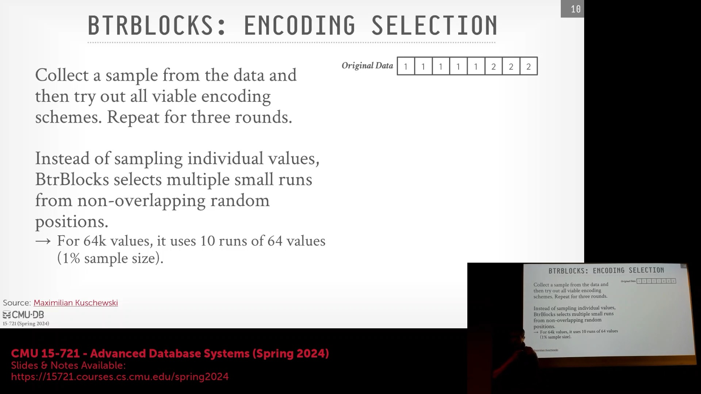

## 贪心选择与计算权衡
该编码选择过程(Encoding Selection Process)对采样数据采用贪心算法(Greedy Algorithm)进行穷举评估，仅在数据加载阶段引入约 2% 的额外计算开销(Computational Overhead)。系统最多会在生成的衍生列(Derived Column)上递归应用(Recursively Apply)所选编码器三次（例如，对 RLE 产出的长度数组再次执行位打包）。尽管有学员质疑为何不采用回溯算法(Backtracking Algorithm)以搜索全局最优的编码路径(Global Optimal Path)，但该设计实为有意规避。在数 TB 级(Terabyte-Scale)的数据集上运行回溯或穷举搜索(Exhaustive Search)将引发难以承受的计算成本，并严重拖慢数据加载吞吐量。当前采用的 1% 采样率(Sampling Rate)代表了一个务实的最佳平衡点，在编码压缩精度与可接受的计算开销之间实现了有效权衡。

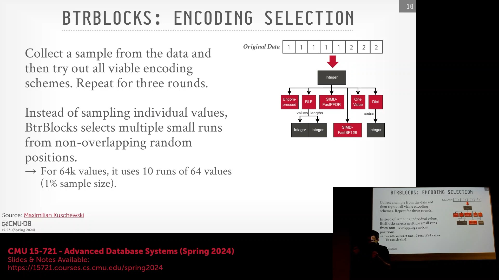
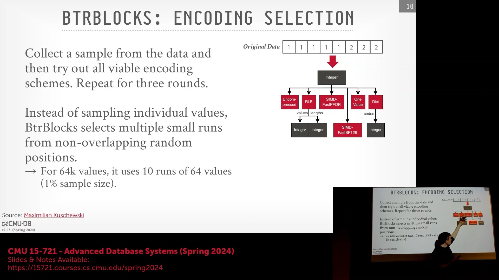
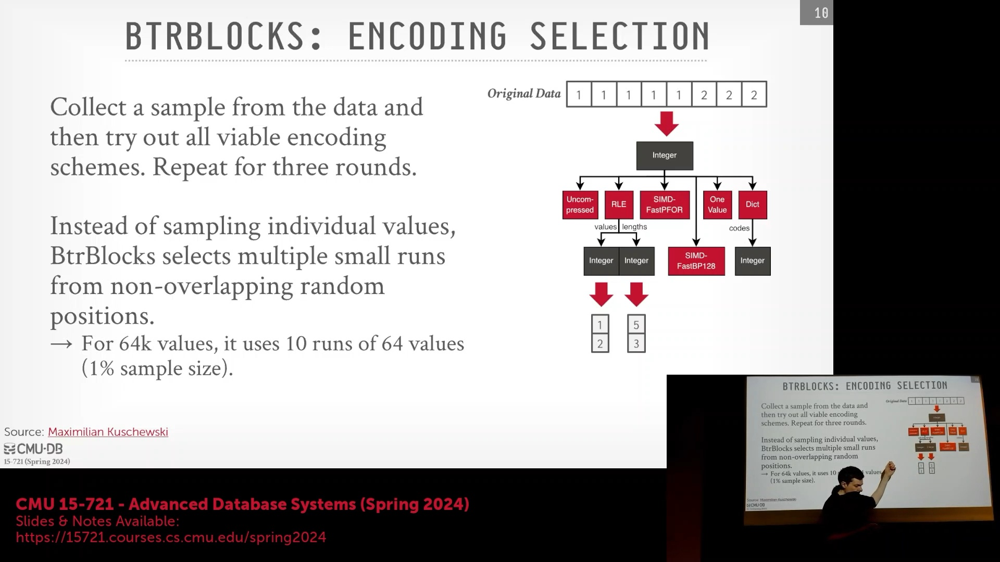

## 结论：优先保障查询性能
驱动 *Better Blocks* 及同类现代文件格式的核心理念十分明确：分析型数据库(Analytical Database)的绝大多数业务场景均属于读密集型工作负载(Read-Intensive Workload)。通过在数据加载阶段承担可控的前期计算成本(Upfront Computational Cost)，以智能化地进行采样、评估并应用轻量级编码(Lightweight Encoding)，系统确保了最高频的操作场景——即查询执行(Query Execution)与全表数据扫描(Data Scanning)——能够获得显著的性能加速。这种架构权衡(Architectural Trade-off)确保了数据以一种高度契合 SIMD 向量化指令(SIMD Vectorization)且运行时解码开销(Decoding Overhead)极低的结构进行持久化存储。最终，系统在无需应用开发者修改现有 SQL 工作流(SQL Workflow)的前提下，提供了更具成本效益且高效的分析处理能力。

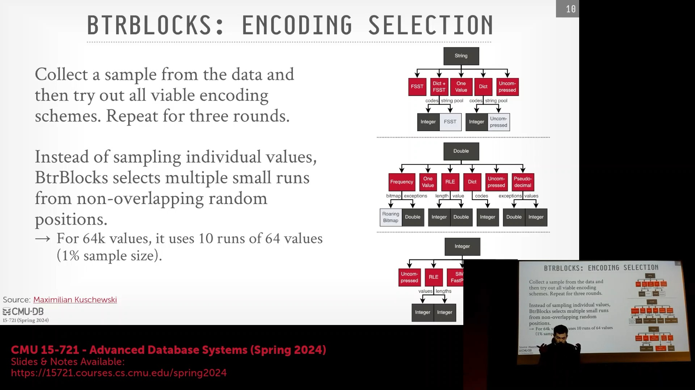

---

## BetterBlocks 编码策略与采样权衡
课程首先阐明了 BetterBlocks 的贪心编码算法(Greedy Encoding Algorithm)的运作机制。尽管嵌套编码(Nested Encoding)的默认递归深度(Recursion Depth)设为三层，但系统完全依赖每个包含 64,000 个数据值的列块(Column Chunk)中抽取的 1% 代表性采样数据(Sample Data)来选择最优编码方案。学员提出疑问：若完整数据集(Data Set)的特征与采样数据不一致，算法是否会执行回溯(Backtracking)？讲师明确答复：不会。对整个数据集重新评估或回滚编码方案将带来难以承受的计算开销(Computational Overhead)。相反，该设计有意在数据加载(Data Ingestion)阶段引入约 2% 的可控前期开销，以此作为架构权衡(Architectural Trade-off)，从而确保运行时(Runtime)的查询执行(Query Execution)保持高度优化与高效。

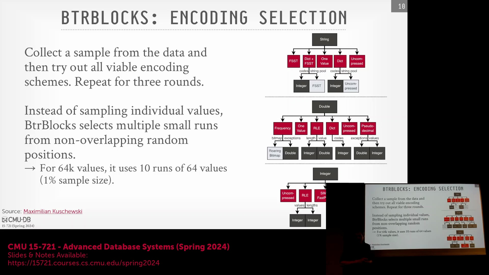

## FSST：快速静态字符串文本压缩
在介绍完整数编码格式(Integer Encoding Format)后，讨论转向 FSST(Fast Static String Table)。这是一项 2020 年提出的创新技术，专为高效字符串压缩(String Compression)与快速随机访问(Random Access)而设计。与传统字典编码(Dictionary Encoding)将整个字符串映射为不透明标识符(Opaque Identifier)不同，FSST 能够识别频繁出现的子字符串(Substring)（最长 8 字节），并将其替换为单字节代码(Single-Byte Code)。该方法保留了直接在编码数据上执行局部查找(Partial Lookup)、前缀匹配(Prefix Matching)及其他查询优化(Query Optimization)操作的能力。尽管底层子字符串长度可变，但编码输出为每个代码维持了定长结构(Fixed-Length Structure)，因此需引入特定的终止标记(Terminator)来标识字符串结束，以防止尾部字节被错误解析。

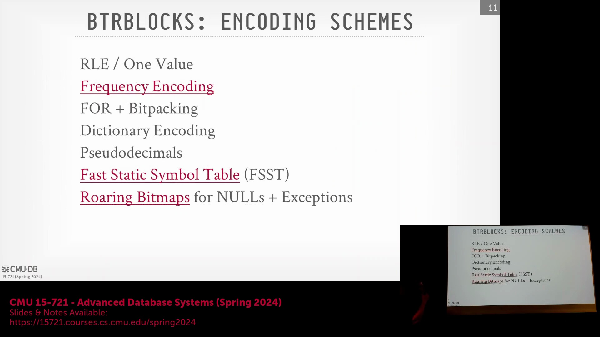

## 针对 SIMD 优化的符号表生成
构建最优的 FSST 符号表(Symbol Table)属于 NP 完全问题(NP-Complete Problem)，因此作者采用了一种务实的启发式算法(Heuristic Algorithm)，而非穷举搜索(Exhaustive Search)或动态规划(Dynamic Programming)。系统在扫描数据时，采用直接覆盖策略(Direct Overwrite Strategy)将候选子字符串插入哈希表(Hash Table)：若目标哈希槽位(Hash Slot)已被占用，现有条目(Entry)将被立即驱逐(Evict)。这种看似激进的做法实为精心设计：真正能提升压缩率(Compression Ratio)的高价值符号自然会反复出现并被重新插入，从而使符号表随时间推移收敛(Converge)至一个高效的符号集合。其核心优势在于，消除线性探测(Linear Probing)与条件分支(Conditional Branch)后，整个符号表的生成与查找过程得以完全兼容 SIMD 单指令多数据(SIMD Vectorization)架构，有效规避了传统哈希表实现的性能陷阱(Performance Pitfall)。

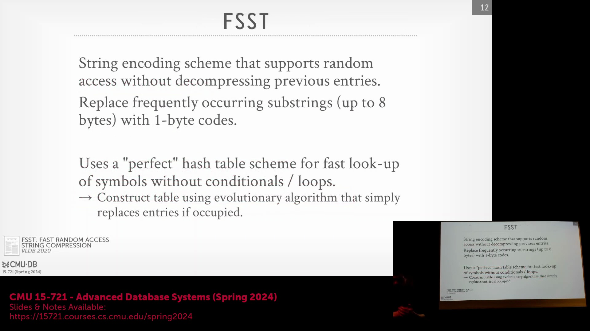

## Roaring Bitmaps：自适应位图索引
本节最后探讨了 Roaring Bitmaps(Roaring 位图)，这是一种高度优化的数据结构(Data Structure)，用于管理位图索引(Bitmap Index)，并能动态适配数据密度(Data Density)。其将 64 位整数空间(64-bit Integer Space)划分为多个包含 $2^{16}$ 个值的容器(Container)。针对每个容器，系统根据其稀疏性(Sparsity)动态选择最高效的存储格式：若置位(Set Bit)数量少于 4,096 个，则采用紧凑的 16 位整数排序数组(Sorted Array of 16-bit Integers)；若密度超过该阈值，则切换为标准的位图阵列(Bitset Array)。查找操作通过计算目标键(Target Key)除以 $2^{16}$ 的商来定位对应容器，随后执行相应的数组搜索或位掩码操作(Bitwise Mask Operation)。这种混合存储策略(Hybrid Storage Strategy)使 Polaris 和 Futurebase 等系统在维持极低内存占用(Memory Footprint)的同时，能够高效支持集合成员资格检查(Set Membership Check)、空值追踪(Null Tracking)及位图遍历操作(Bitmap Traversal)。

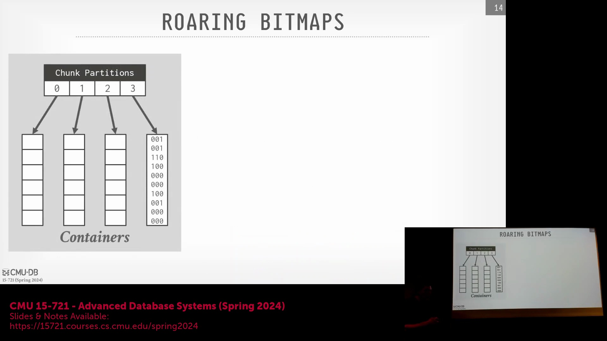

---

## 咆哮位图(Roaring Bitmaps)：自适应密度与查找机制
咆哮位图(Roaring Bitmaps)通过根据数据密度动态调整内部数据结构，有效解决了传统稀疏位图(Sparse Bitmap)的效率瓶颈。64位整数空间(64-bit Integer Space)被划分为多个大小为 2^16 的数据容器(Container)。在每个容器内，若置位(Set Bit)数量少于 4,096 个，系统采用紧凑的 16 位整数有序数组(Sorted Array of 16-bit Integers)进行存储；一旦数据密度超过该阈值，则自动切换为标准的未压缩位图(Bitset)。这种混合架构不仅确保了集合成员资格查询(Set Membership Query)的快速响应与绝对精确（零误报，区别于概率型的布隆过滤器(Bloom Filter)），还显著降低了缓存未命中率(Cache Miss Rate)。尽管早期曾提出过复杂的分层分块方案(Hierarchical Chunking Scheme)，但现代系统已基本弃用，因为过多的条件分支(Conditional Branch)与指针跳转(Pointer Chasing)会严重破坏超标量处理器流水线(Superscalar CPU Pipeline)的执行效率。

## SIMD 对齐与填充开销
诸如 Parquet 的传统列式格式(Columnar Format)在存储时会产生变长编码序列(Variable-Length Encoded Sequence)，从而严重损害 SIMD(Single Instruction, Multiple Data) 指令的执行效率。Better Blocks 通过规避 Delta 编码等强数据依赖方案缓解了该问题，但仍需直面数据对齐(Data Alignment)的挑战。当一组数值无法恰好填满 SIMD 寄存器(SIMD Register)时（例如在具有 16 个通道(Lane)的 AVX-512 寄存器中仅加载了 12 个有效数值），系统必须在剩余通道中填充占位数据(Padding)，并在后续阶段执行掩码清理操作(Mask Cleanup)。这种固有的数据不对齐现象不仅浪费了宝贵的计算周期(CPU Cycles)，还导致查询引擎在连续数据扫描时无法充分释放中央处理器(CPU)向量运算单元(Vector Processing Unit)的并行算力。

## FastLanes 与虚拟指令集架构抽象
FastLanes 并非一种完整的独立文件格式，而是一种专为数据并行计算(Data Parallel Computing)设计的高度优化的底层编码策略(Low-level Encoding Strategy)。为确保跨平台兼容性(Cross-Platform Compatibility)与技术前瞻性，研究团队定义了一套“虚拟指令集架构(Virtual Instruction Set Architecture, Virtual ISA)”，该架构预设使用 1024 位宽的 SIMD 寄存器。所有核心操作均基于此抽象层实现，随后被编译转换为可在现有硬件（如 AVX-512）上高效运行的机器码，或在必要时自动降级至标量(Single Instruction, Single Data, SISD)指令执行。这种抽象设计成功将核心算法逻辑与特定硬件供应商的底层限制相解耦(Decoupling)，使得该编码策略能够伴随更宽向量寄存器(Vector Register)的硬件迭代实现无缝扩展。

## 元组重排与正弦波布局
FastLanes 的核心突破在于其创新性引入的“正弦波传输布局(Sinewave Transport Layout)”，该布局允许对数据元组(Data Tuple)进行物理重排。基于关系模型(Relational Model)中数据表本质为无序集合(Unordered Set)的理论，数据库引擎可自由调整物理存储顺序以优化执行效率。FastLanes 巧妙利用这一特性，在数据编码前执行重排操作，确保数值序列严格对齐 SIMD 通道边界(SIMD Lane Boundary)。此举彻底消除了冗余的填充操作(Padding Operation)，移除了传统解码流程中的条件分支指令(Conditional Branch)，并确保处理器在每个指令周期均执行有效计算。随后，系统针对重排后的数据序列组合应用游程编码(Run-Length Encoding, RLE)与 Delta 编码(Delta Encoding)。这一流程充分证明了：通过结构化的数据重排，能够将原本与 SIMD 架构不兼容的存储格式，转化为高度向量化且无分支的高效数据流(Highly Vectorized and Branch-Free Data Stream)。

---

## 差分编码与 SIMD 物化设置
在此之前，我们仅计算了差分值（即基准值 Base Value）。在完成反向差分编码/解码（Reverse Differential Encoding）后，索引向量（Index Vector）将指导物化（Materialization）过程，以还原出实际所需的原始数据。系统会按此逻辑进行初始化，但随后会直接处理该差分编码向量。实际上，索引向量并非直接被消费，而是需要先经过物化。抱歉更正：实际流程应为先对索引向量进行物化，然后再应用差分编码。
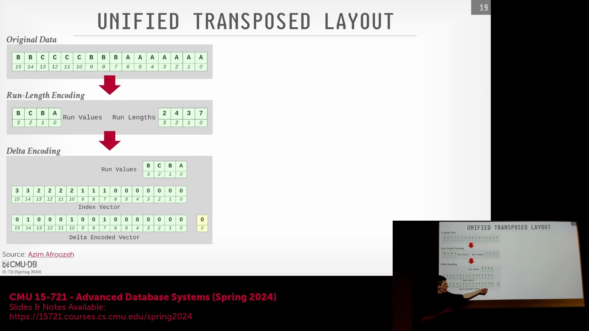

## 数据重排序与 SIMD 执行
随后，数据会以特定方式重排：原本在数据集中连续的值不再紧密相邻。在此示例中，它们之间相隔四个元素。因此，当以这种方式解码该向量时，由于采用了差分编码，基向量（Base Vector）现在将包含四个元素，而非先前的单个元素。
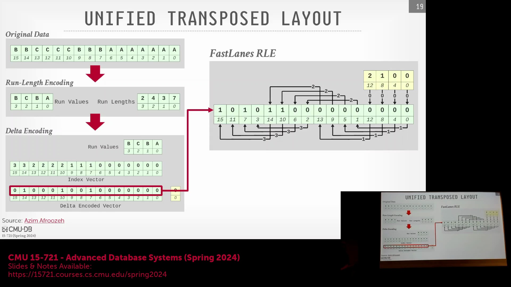
执行解码时，首先提取这四个元素，并利用 SIMD 加法（SIMD Addition）将其应用到目标向量上以生成输出。此外，还需执行额外步骤，确保数据被写入输出向量在内存中的正确位置，这些位置对应于它们在原始索引向量中的实际偏移。若仅将输出结果紧密排列，将打乱为计算其他列偏移量所必需的顺序。
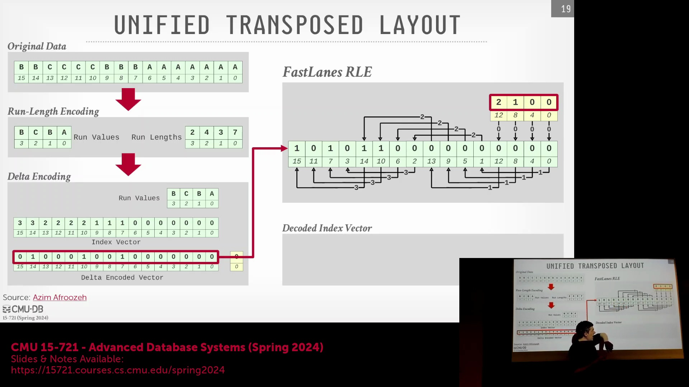
因此，尽管解码输出是增量且非连续的，我们仍需按间隔分布数据以恢复其原始顺序。该过程可通过 SIMD 中的位移（Shift）及其他位操作实现。随后，将处理窗口滑动至下一组数据。在此示例中，我们利用当前生成的输出，通过 SIMD 将其应用于下一个基值，以计算下一批输出值。依此类推，沿序列持续向下执行。

## 存储与解压速度的权衡
（提问）对于这种方案，我们实际存储的是顶部部分，对吗？准确来说，我们存储的是图中黄色高亮部分。并非整个原始数据集，仅存储黄色部分？是的，需存储完整数据集的基础结构，再加上黄色标注的差分与索引信息。对。那么，这与其他编码方案相比，存储开销不是大很多吗？毕竟针对重复数据的编码通常体积更小？换言之，在存储体积上，这是否不如直接编码？确实如此，但它的优势在于解压（Decompression）速度更快。这再次体现了经典的计算机科学权衡（Trade-off）：存储空间与计算开销。我们可以减少存储数据量，但需在解压阶段投入更多计算资源。实际上，目前尚无主流开源系统采用此种存储格式，该设计较为激进。相关论文中也探讨了针对其他编码方案的替代处理策略。但其核心思想在于：将数据位“喷洒”（Spraying）至特定向量中，使解码时数据能完美对齐至 SIMD 寄存器。如此一来，便无需再依赖分散/聚集（Scatter-Gather）操作来移动和重组数据，即可直接得到所需格式。

## SIMD 下游程编码的局限性
因此，实际上无法直接使用 SIMD 解码游程编码（Run-Length Encoding, RLE），对吗？因为此时必须引入条件循环来判断：例如，识别到某处游程长度为 7，则需循环执行 7 次 SIMD 操作。虽然理论上可通过代码生成（Code Generation）技术实现（该主题将在数周后深入探讨），但代码生成会引入一系列额外问题，显著增加开发与维护的复杂度。那么，能否对该结构再次应用游程编码？例如 Better Blocks 系统是否会采用此方案？我认为不会。因为若在此结构上叠加游程编码，我们将重新陷入前述的性能瓶颈。理解这一点吗？

## 位切片与短路操作简介
接下来，我将简要总结位切片（Bit Slicing）与位级读取的相关讨论。截至目前所介绍的技术（如 Parquet、Better Blocks、FastLanes 等）均存在一个共同点：在扫描列数据时，每次都必须完整读取每个元组（Tuple）的全部数值。这意味着扫描或过滤（Filtering）操作无法实现短路优化（Short-circuit Evaluation）。
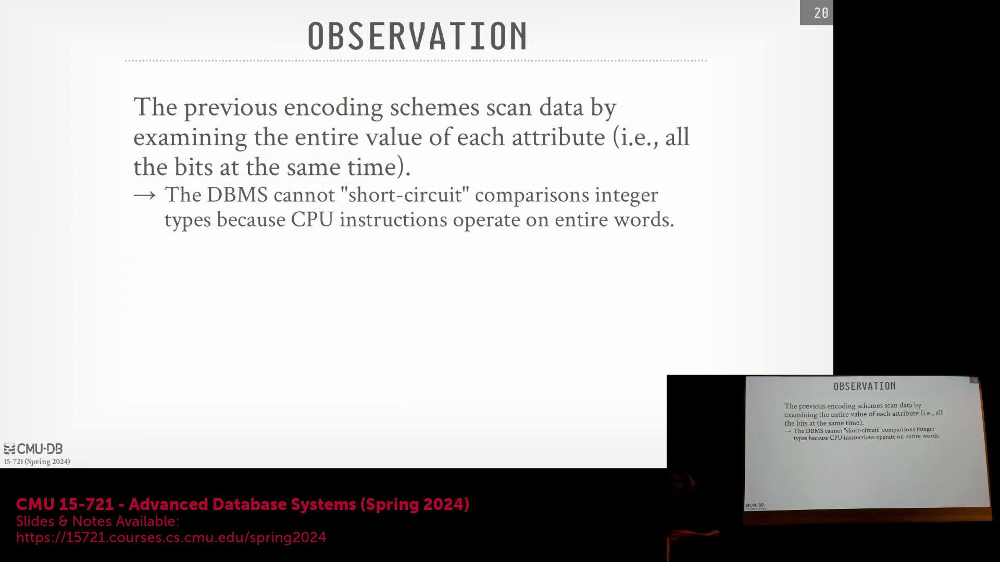
理想情况下，系统应能尽早识别出永不匹配的数据。以字符串为例，字符串通常经过解码处理，执行字符串比较（如 `strcmp`）时，会逐字符进行检查。一旦发现不匹配，循环立即终止，这便是短路机制。然而，在比较两个整数时（暂不考虑 SIMD），硬件仅提供单条指令用于判断相等性。在底层硬件层面，你面对的是固定长度的基本数据类型，无法通过软件逻辑干预：“既然发现首位不同，何必继续比较剩余 31 位？”因为硬件接口并不支持此类动态截断。那么，能否实现类似机制？是否存在一种方法，允许我们仅检查数值的某个子集进行比对，仅在认为有必要或可能匹配时，才读取剩余位？这一核心思想即为位切片（Bit Slicing）。该概念诞生于 20 世纪 90 年代，Sybase IQ 数据库系统曾率先实现（该系统至今仍在服役）。此外，我之前提及的向量化处理系统（Vectorized Processing System）目前也广泛采用此技术。

## 位切片存储布局与查询执行
其核心思想是：放弃直接存储完整的整数值，转而将数据的各个二进制位连续存储。这可视为列式存储（Columnar Storage）的极端演进形式。传统列存将行数据拆解，按列连续存储；而位切片则进一步将列内的每一位剥离，按位维度进行连续存储。
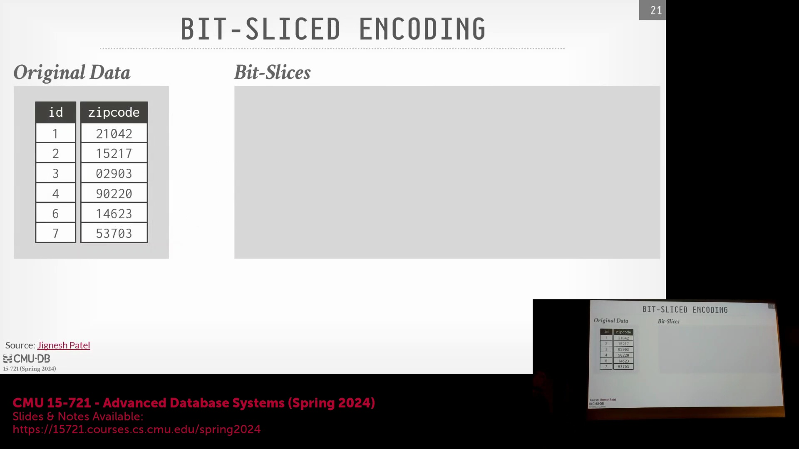
具体而言，将所有元组（Tuple）数值的第 1 位连续存放，随后是第 2 位，依此类推。举例说明：假设记录某人在各地居住的邮编，如马里兰州的 2042，以及康普顿、匹兹堡等地的邮编。以 2042 为例，将其转换为二进制后，为二进制的每一位单独分配一列进行位级存储。
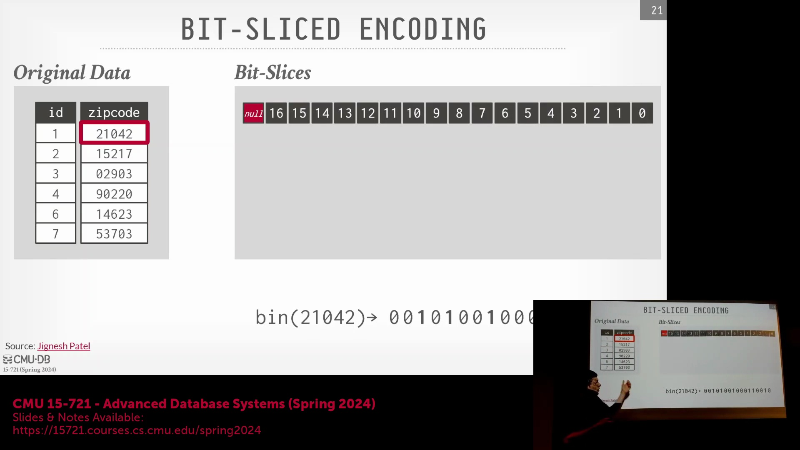
此处以 32 位整数为例，为适配幻灯片仅展示了 17 个位平面，但这不影响原理。系统通常会维护一个空值位图（Null Bitmap）。沿列扫描时，可提取所有位并分别存入独立向量中。对其余所有数值执行相同操作，如所示。需再次强调，这些应被视为连续的位图（Bitmap）。此时，可采用游程编码（Run-Length Encoding）对位图进行压缩。在某些数据分布下，最低有效位（Least Significant Bit, LSB）可能较为稀疏，而最高有效位（Most Significant Bit, MSB）则相对密集。现执行查询：`SELECT * FROM customer WHERE zipcode < 15217`。
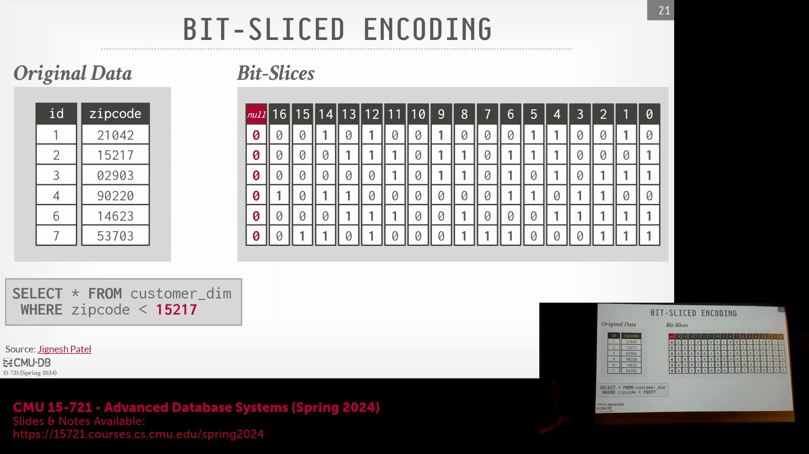
现在，可遍历每一个位切片（Bit Slice），并构建结果位图，从而在位级别上判定哪些元组匹配查询谓词（Predicate）。若在遍历过程中发现剩余位切片已不可能产生匹配，即可提前终止扫描。以 15217 的二进制表示为例，为简化说明，仅观察其最高三位（均为 0）。这意味着，若任意元组在这前三组位切片向量中的对应位为 1，则其数值必然大于 15217，无法匹配查询条件。因此，可判定无需继续检查该元组的剩余位。此即位切片（Bit Slicing）的核心原理。

## 利用位切片加速聚合运算
早期位切片算法完全依赖标量指令（Scalar Instructions）。后续将介绍的“位交织”（Bit Weaving）技术则可在 SIMD 架构下高效完成同类任务。此外，位切片还能赋能其他高级查询优化。例如在聚合查询（Aggregation Query）中，可通过极简的位操作快速计算结果。
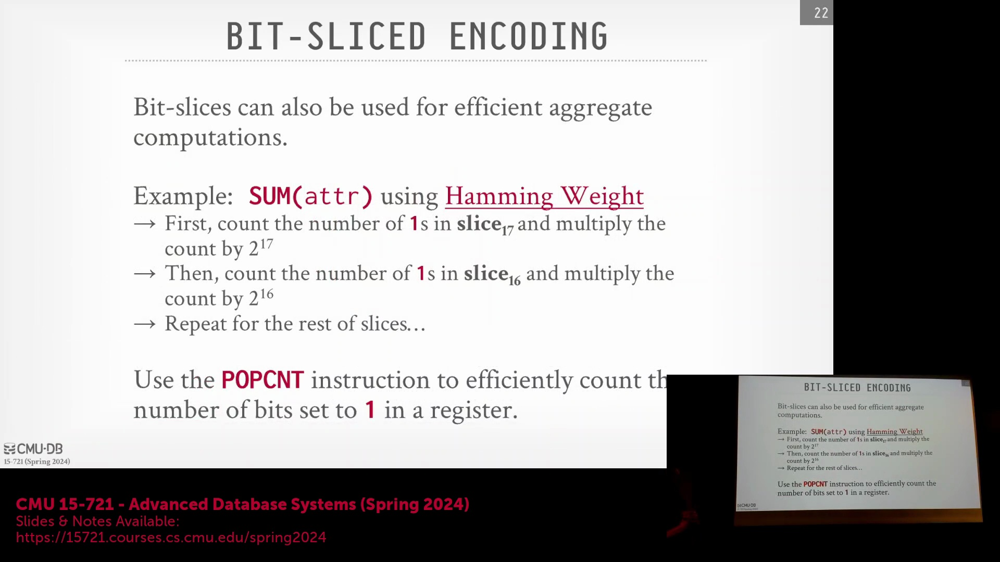
若需计算整数列的总和，可利用汉明重量（Hamming Weight）或种群计数（Population Count），统计列中值为 1 的位的数量。Intel SIMD 指令集已提供针对此优化的专用指令 `POPCNT`。仅需单条指令，即可统计向量中置 1 位的总数。计算聚合值时，只需统计首个位切片中 1 的数量并乘以 $2^{17}$，接着统计次一切片乘以 $2^{16}$，依此类推。最终，即可快速得出整列数据的聚合结果。显然，此方法的计算速度远优于传统的逐值整数加法指令。

## 过渡到位交织
位切片（Bit Slicing）源于 20 世纪 90 年代的早期概念。Jignesh Patel 教授在十年前曾深入探讨该主题，目前他正重新研究一项名为“位交织”（Bit Weaving）的进阶技术。

其核心思想在于：提出一种面向列式数据库的替代编码方案。该方案沿袭了位切片的基本理念，但在数据布局与处理流程上进行了特定优化……

---

## 位交织概述与历史背景
这是一种旨在最大化挖掘 SIMD（Single Instruction, Multiple Data）潜力的编码方案。令人瞩目的是，该研究早在 2013 年便已完成。彼时的 SIMD 指令集仅支持至 AVX2（Advanced Vector Extensions 2），尚未引入我们将在两周后讲解的分散/聚集（Scatter-Gather）指令或 AVX-512 的特性。因此，后续将介绍的“水平位交织”（Horizontal Bit Weaving）方法本质上完全基于标量操作（Scalar Operations）。而“垂直位交织”（Vertical Bit Weaving）虽然在原理上与位切片（Bit Slicing）类似，但它演示了如何利用 SIMD 实现该过程。需指出的是，受限于当时的硬件条件，研究者并未拥有现今完备的 SIMD 指令集支持。
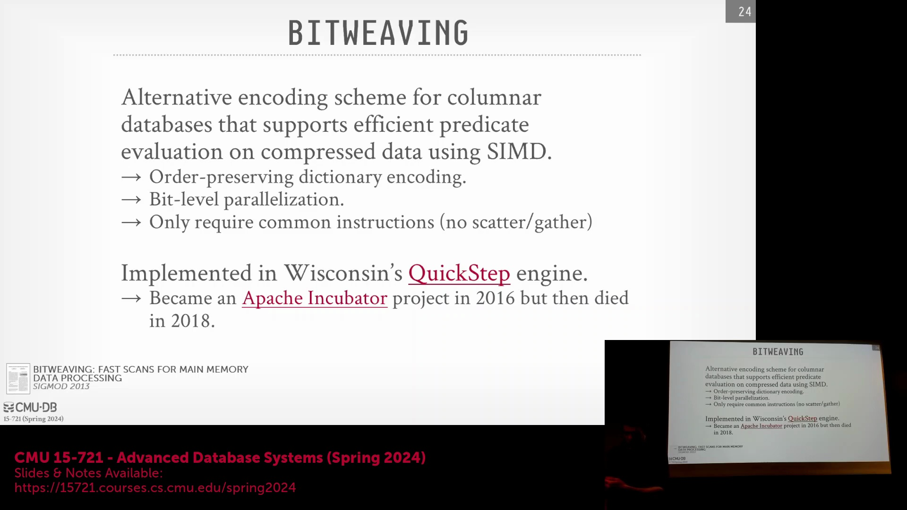

Jignesh Patel 教授在名为 QuickStep 的项目中实现了该技术。你可以将其视为专注于 OLAP（Online Analytical Processing）场景的 DuckDB。它是一个嵌入式 OLAP 引擎，虽无独立的 SQL 前端，但可作为存储管理器高效处理 OLAP 查询与列式数据存储。本质上，它就是 OLAP 领域的 DuckDB 雏形。后来，该项目被开源并贡献至 Apache 基金会。遗憾的是，Jignesh 教授于 2018 年逝世。其代码库至今依然留存，且应仍有社区维护，对吗？但需注意，目前的开源版本并未包含位交织功能，该实现仅见于其学术论文中。据我所知，尚无其他数据库系统正式采用此项技术。

好了，该研究提出了两种核心编码方案：水平方案本质上是一种位级行存储（Bit-level Row Storage）；垂直方案则与位切片类似，但采用了更精巧的数据布局，以便通过向量化执行（Vectorized Execution）实现更高的并行度。

## 水平位交织存储布局
我将快速梳理该部分，以便大家掌握其核心原理。在水平存储布局中，所有待存储的元组（Tuple）及其位表示（图中红色代表数值）会被划分为若干段（Segment）。你可以将此概念类比于数据文件中的“行组”（Row Group）。
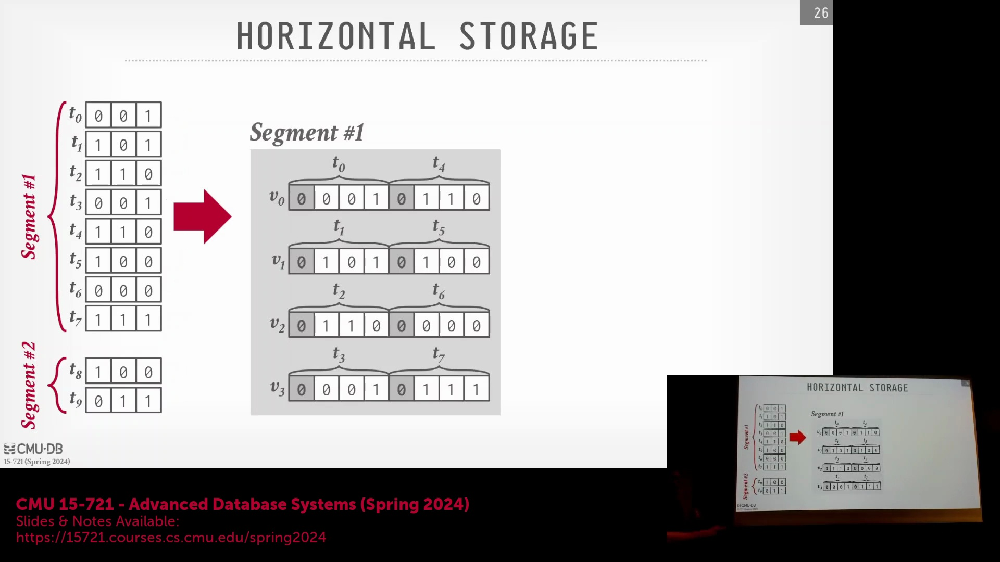

在段内部，数据按自上而下的顺序存储。因此，首个向量仅包含元组 t0；第二个向量则依次存储 t1、t2、t3，随后回绕（Wrap-around）至 t4。另一段同理，但因无剩余数据条目，故无需分配更多向量。
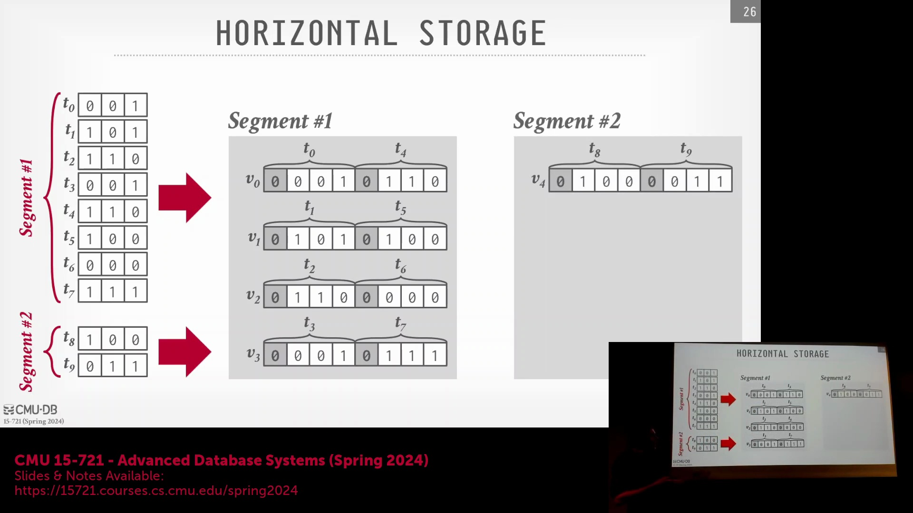

演示中使用了 8 位向量作为示例，但其实际容量应对应处理器的字长（Word Length，此处指处理器单次可处理的最大数据单元）。因此，除使用 3 位存储实际数值外，还会预留一个填充位（Padding Bit），用于记录比较或算术操作的结果（真/假）。
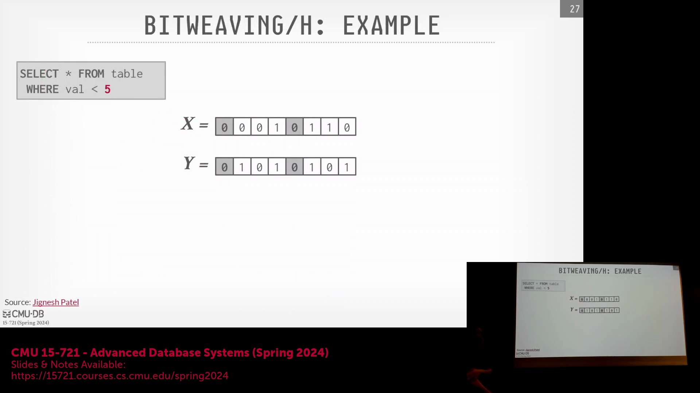

由此可见，采用此位交织方法存储数据时，必然会产生一定的空间开销。

## 谓词求值与选择向量重建
在实际查询评估中，数据按向量序列组织。系统确保从首个向量开始读取，以便高效访问。以首个向量为例，其包含 t0 与 t4。假设需评估谓词 `< 5`，我们将数值 5 编码为二进制（101），并广播（Broadcast）生成与待比较元组位等宽的掩码向量（Mask Vector）。随后，通过纯位运算（Bitwise Operations）执行比较逻辑。图中展示了基于位操作的加法/比较公式，其中操作数全置 1。运算完成后将生成一个选择向量（Selection Vector），系统依据填充位的状态（1 或 0）判定谓词是否成立。在此示例中，t0 的值为 1（满足 `< 5`，结果为真/置 1），而 t4 的值为 7 或 6（不满足条件，结果为假/置 0）。该方案的优势在于，仅需三条指令即可完成一个机器字（Machine Word）的谓词评估。传统列式存储需逐值判断（如“1<5 吗？5<6 吗？”），而在此位交织布局下，即便仅使用常规标量指令，也能实现类似 SIMD 的数据级并行性（Data-Level Parallelism）。
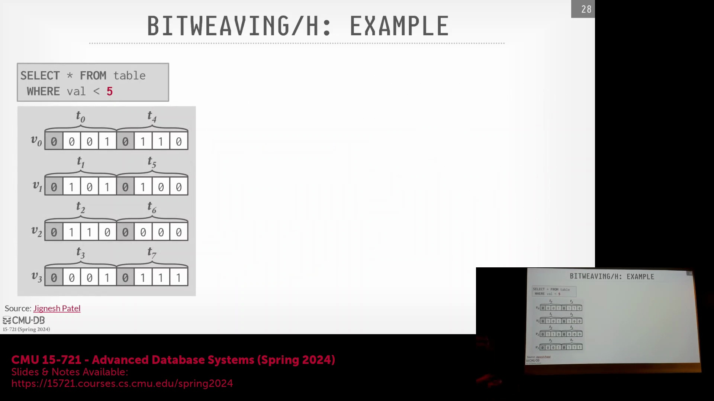

若将此过程应用于所有数据向量，将生成多个局部选择向量。为定位原始列中满足谓词的元组偏移量，需对这些向量进行重组。具体而言，可通过位移操作（Bit Shift）将各向量按步长滑动对齐，随后执行逻辑或（OR）运算进行合并，最终生成全局选择向量，精准标记所有匹配的元组。后续若需物化原始数据，即可据此索引直接获取对应元组。

选择向量的本质仅为二进制位序列。我们需要一种高效方法将其“解码”，识别出所有置 1 的位置，从而还原匹配元组在原始向量中的偏移量。最直观的实现是编写 `for` 循环逐位遍历：若某位为真，则将其偏移量写入输出缓冲区。然而，此类循环效率极低，其核心开销仅在于将位掩码转换为实际索引值。
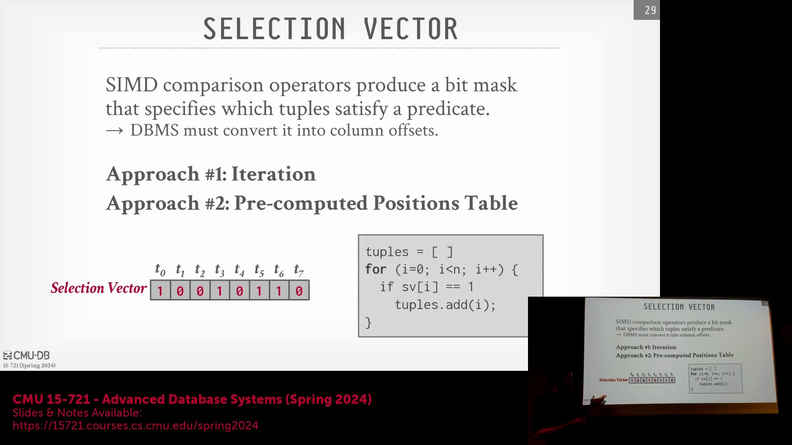

## 利用查找表加速位到偏移量的转换
据我所知，目前尚无专用的 SIMD 或 CPU 指令可直接完成此转换。一种高效的替代方案是借鉴 Peter Boncz 在 Vectorwise 论文（课程下周将安排阅读）中提出的技巧：预计算位模式映射。具体而言，可提前枚举所有可能的选择向量状态，并维护一个静态查找数组。例如，将 8 位二进制选择向量解析为十进制索引 150，直接访问数组偏移量 150 处，即可快速取出对应的偏移量列表，明确指示哪些位为真。
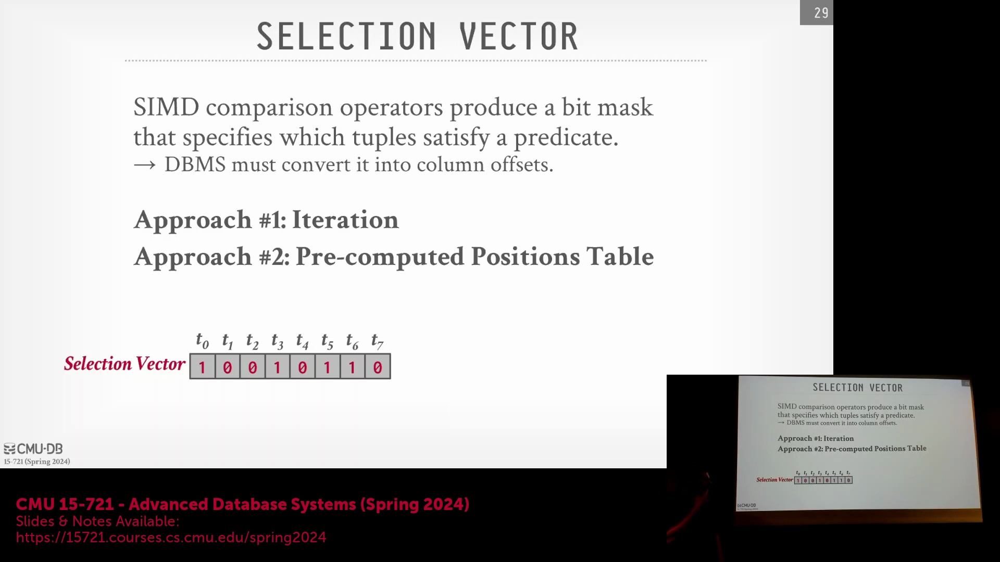

以本例中 8 位选择向量为例，其可能状态仅 $2^8$ 种。此类微型查找表（Lookup Table）可轻松驻留于 L1 或 L2 缓存（Cache）中，无需消耗大量内存。其唯一用途便是实现位图到索引值的瞬时转换。

## 垂直位交织与提前终止
最后介绍垂直位交织（Vertical Bit Weaving）方案。
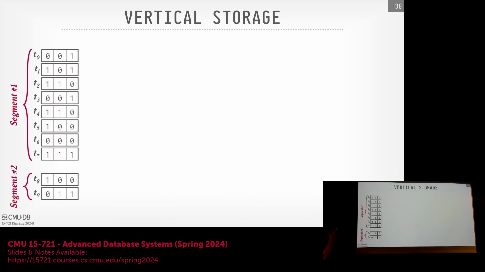

在此方案中，数据按位平面（Bit Plane）组织：首个向量连续存储所有元组的第 0 位，次个向量存储所有第 1 位，依此类推。对于数据量不足的段（如仅含两个元组），系统仍需分配完整长度的向量，并使用零值填充（Zero Padding）。尽管此举会牺牲部分存储空间与指令效率（FastLanes 等后续方案对此进行了优化），但它极大简化了向量化计算逻辑。向量长度同样对齐至处理器字长。
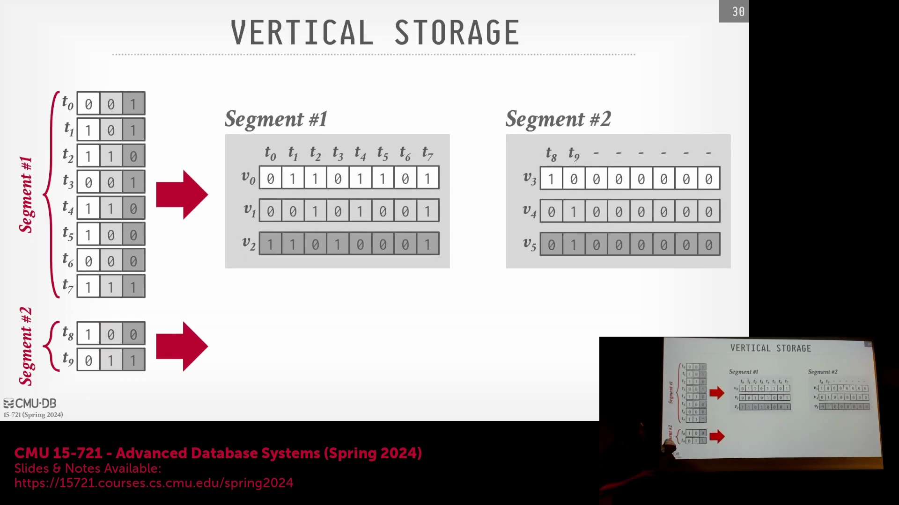

此布局不再依赖填充位记录中间状态，所有操作均可在 SIMD 架构下原生执行。假设需检索值为 2 的元组，其二进制模式已知。系统提取首个位向量，生成对应的比较掩码。若目标位为 0，则检查该位平面的数据是否全匹配，进而更新选择向量。随后执行 `POPCNT`（Population Count）指令统计置 1 位数：若计数大于 0，则继续扫描下一位平面；若结果为 0，则触发短路终止（Short-circuit Termination），无需处理剩余向量。该机制允许系统仅在位级子集上进行初步过滤。本例中，第 1 位存在匹配项，故继续处理下一向量并应用新掩码。若此时选择向量全 0，即可判定无后续匹配数据，立即终止扫描。
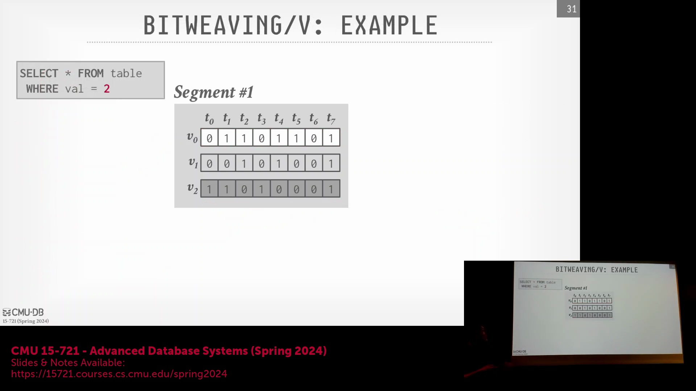

此示例仅演示 3 位数值。若扩展至 32 位或 64 位整数，提前终止带来的性能增益将更为显著。在 SIMD 执行模型下，单条指令可并行比对的数据量远超传统逐值扫描。我们由此实现了高效的早期剪枝（Early Pruning），并复现了位切片的核心优势。此外，全零的位向量可直接跳过，无需计算。原始论文中还包含一系列针对其他算子的优化算法。尽管讲解节奏较快，且该技术未广泛见于后续文献，但其为数据库底层存储提供了一种极具启发性的设计范式，我个人十分推崇。

## 逻辑与物理数据独立性结语
今日讲座中我已多次强调：本案例再次印证了逻辑与物理数据独立性（Logical and Physical Data Independence）的至关重要性。正如课程开篇所探讨的：“底层指针究竟指向何种物理结构？”——正是这种独立性，使得上层查询逻辑无需感知底层存储格式的演进与优化。

---

## 逻辑与物理数据独立性
“哦，你的数据指针(Data Pointer)究竟指向哪里？”作为一名深谙关系模型(Relational Model)的开发者，这种底层设计简直令人噩梦连连。为何要暴露指针？为何要依赖指针？这绝对是个糟糕的设计决策。我们期望数据库底层能够仅通过固定长度偏移量(Fixed-length Offset)来自由管理数据，而无需显式处理指针或其他复杂细节。更重要的是，应用程序开发者绝不应直接感知到这些底层指针。所有底层操作必须对上层完全透明(Transparent)。唯有如此，开发者才能专注于编写正确的 SQL(Structured Query Language) 语句。无论底层采用何种存储引擎或执行语言，面向用户的上层接口(Interface)都必须保持稳定不变。

## SIMD 在数据库系统中的作用
此外，基于 SIMD(Single Instruction, Multiple Data) 实现的数据并行性(Data Parallelism) 将成为贯穿本学期的核心工具。下周一指定的阅读文献，正是将 SIMD 技术引入数据库领域的先驱之作(Pioneering Work)。该论文发表于 2006 至 2007 年间。尽管当时 SIMD 在数据库系统中的实际应用潜力尚未完全显现，但作者提出了一种创新的查询处理模型(Query Processing Model)，旨在对海量数据库操作进行向量化(Vectorization)优化。后续课程中，我们将陆续看到基于 SIMD 的新型连接(Join)、过滤(Filter)及其他核心算法不断涌现。

## 结语与背景歌词片段
数之不尽，你懂的，你得勒紧腰带去拎那瓶 40 盎司的烈酒。
稳住阵脚，浅酌一口，便又是一地空瓶的战场。
没什么难解的谜题，只因我生来便是硬汉。

沉醉于这 40 盎司的微醺，剑畔斜倚着四罐佳酿。
桌上堆叠着六罐装的阵列，目光所及仍是那熟悉的酒标。

别留余地，备好行头，你清楚是什么摆平了一切？
旋开瓶盖，初次倾壶而饮。将它置于冰柜深处，只为一饮而尽。

当心碎玻璃，宝贝，我们不过是在清理残局。
且听我说，这感觉太过癫狂，连同那浸透衣衫的苦涩。

隔着粗布将其咽下，绷紧肌肉。收起那包药剂。
此刻无需多言，那不过是又一个奔向深渊的醉客。

尽情摇摆吧，滋味确是醇厚，击碎那些懦弱的伪装。
做个顶天立地的汉子，切勿怀揣虚妄之心。
