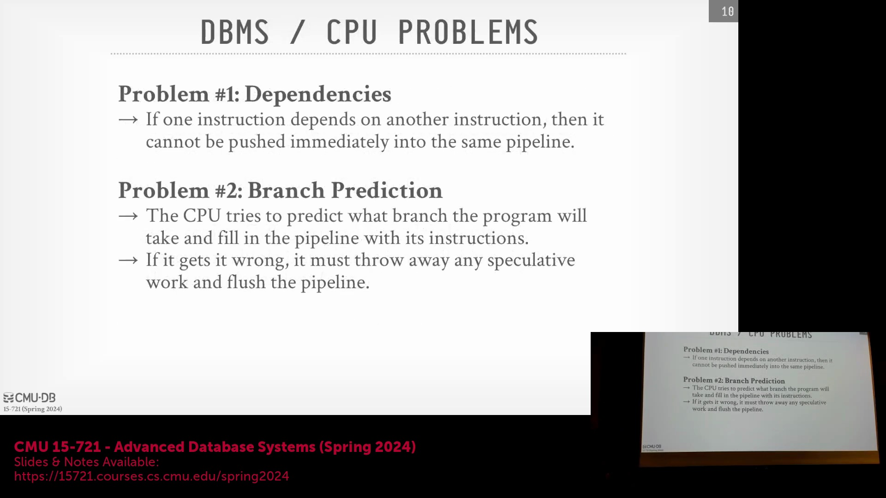
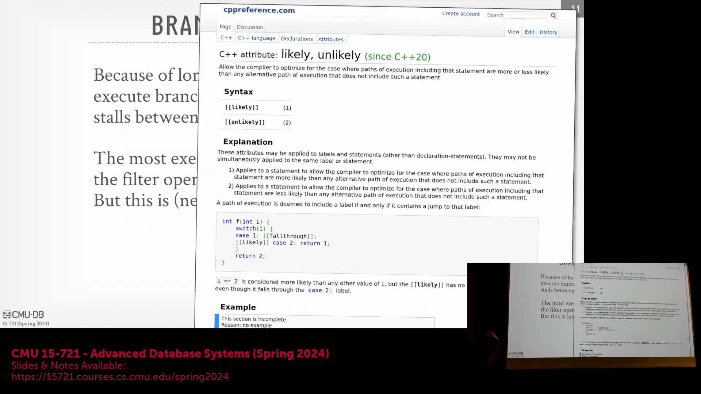
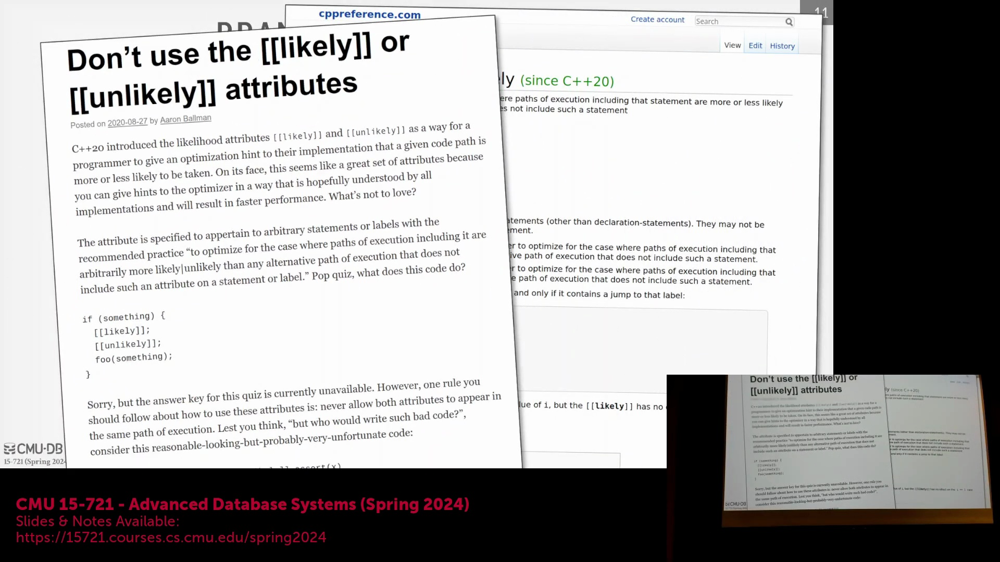
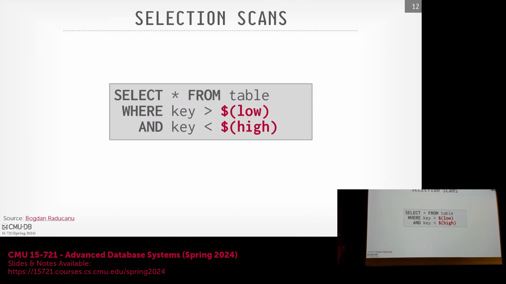
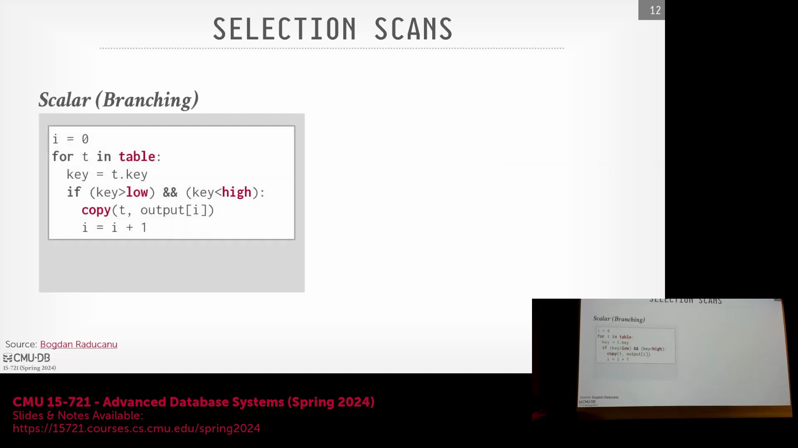

## 乱序执行与超标量架构
现代中央处理器(Central Processing Unit, CPU)（如英特尔(Intel)与超威半导体(AMD)的产品）会动态采用乱序执行(Out-of-Order Execution)策略，以最大化指令吞吐量(Throughput)。然而，硬件在幕后进行了大量协调工作，以确保最终计算结果与指令严格按顺序执行(In-Order Execution)时完全一致。需要明确的是，“超标量”(Superscalar)并非指多核(Multi-Core)架构，而是指单个 CPU 核心内部集成了多条执行流水线(Execution Pipelines)。与这些高度优化的 CPU 不同，图形处理器(Graphics Processing Unit, GPU)核心通常采用顺序执行以简化设计复杂度。CPU 的指令推测执行(Speculative Execution)机制与数据库中的乐观并发控制(Optimistic Concurrency Control)颇为相似：它假设数据依赖关系能够正确解析，从而继续向前处理指令，并在最后阶段验证结果的正确性。

## 流水线停顿与分支预测错误
当预测准确时，推测执行表现卓越；但当 CPU 遭遇未解决的数据依赖(Data Dependency)或分支预测错误(Branch Misprediction)时，流水线停顿(Pipeline Stall)的代价将极为高昂。依赖停顿发生于某条指令必须等待前序指令的输出数据才能继续执行时。分支预测错误的代价则更为严重：当 CPU 遇到条件分支（如 `if/else` 代码块）时，会预先猜测执行路径，并沿该路径进行后续指令的推测执行。若猜测错误，整个指令流水线必须被冲刷(Flush)，执行状态回滚，并从正确的分支路径重新开始执行。这种“冲刷-重启”(Flush-and-Restart)循环会引入严重的执行延迟，直接导致查询性能下降。

## 数据库工作负载中的分支预测
数据库引擎面临的核心挑战在于，顺序扫描(Sequential Scan)与过滤(Filter)操作本质上依赖于数据驱动(Data-Driven)且高度不可预测的条件分支。SQL 中的 `WHERE` 子句本质上即是一个条件分支，其执行路径完全取决于底层的数据分布(Data Distribution)。由于 CPU 的分支预测器(Branch Predictor)无法感知数据库模式(Database Schema)、查询语义(Query Semantics)或数据内在规律，在处理大规模数据集时难以准确预测分支走向。因此，传统的基于迭代器的执行模型(Iterator-Based Execution Model)极易触发预测错误，将原本简单的顺序工作负载转化为低效且频繁停顿的处理过程。

## 编译器提示的局限性
为缓解分支不可预测性问题，开发者有时会使用 `likely` 和 `unlikely` 等编译器提示(Compiler Hints)（常见于 C++、PostgreSQL 和 ClickHouse 中）。然而，这些仅是提供给编译器的静态提示，用于在编译期重新排列汇编代码，将预测为“高概率”执行的代码块放置在更靠近跳转目标的位置，以提升指令缓存(Instruction Cache)的局部性。它们无法、也不会干预 CPU 内部的动态硬件分支预测器(Dynamic Hardware Branch Predictor)。现代处理器配备了历经数十年演进、高度复杂且具备自调节能力(Self-Tuning)的硬件预测器。人为注入的静态提示往往会干扰硬件的智能决策，甚至可能适得其反地降低执行性能。鉴于此，英特尔(Intel)于 2006 年在其处理器架构中正式移除了硬件级的分支提示操作码(Branch Hint Opcodes)。

## 过滤操作的瓶颈
考虑一个标准的范围查询(Range Query)：`SELECT * FROM table WHERE key > low AND key < high`。传统的执行模型通常通过简单的循环来实现该查询：遍历元组(Tuple)、提取键值(Key)，并通过 `if` 语句判断该元组是否满足谓词条件(Predicate Condition)。若匹配成功，则将该元组复制至输出缓冲区(Output Buffer)。该模型的核心低效之处正是 `if` 条件分支。由于谓词的真值结果随数据变化而高度不可预测，CPU 难以维持稳定的指令流水线。这会引发频繁的分支预测错误、流水线冲刷及指令周期浪费，从根本上制约了内存驻留型(Memory-Resident) OLAP 工作负载的性能上限。

