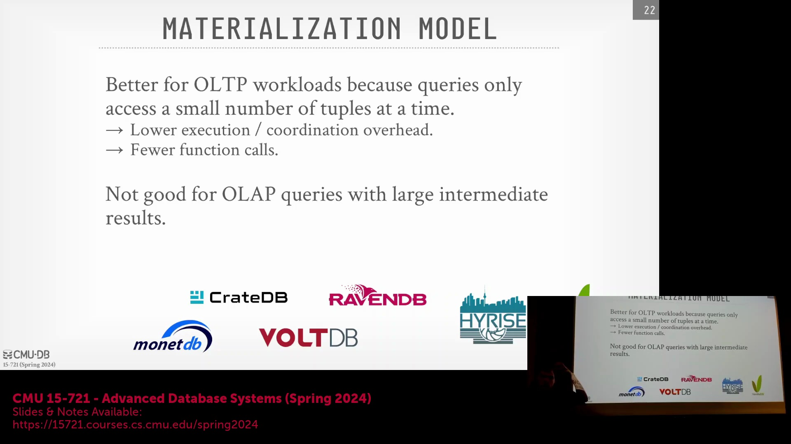
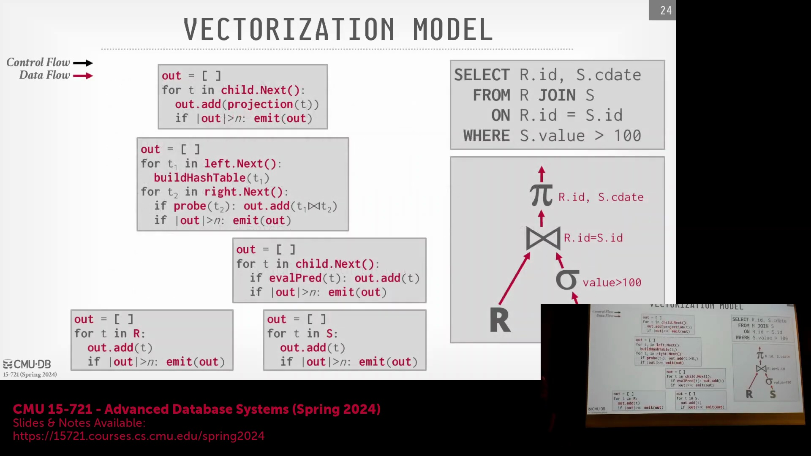
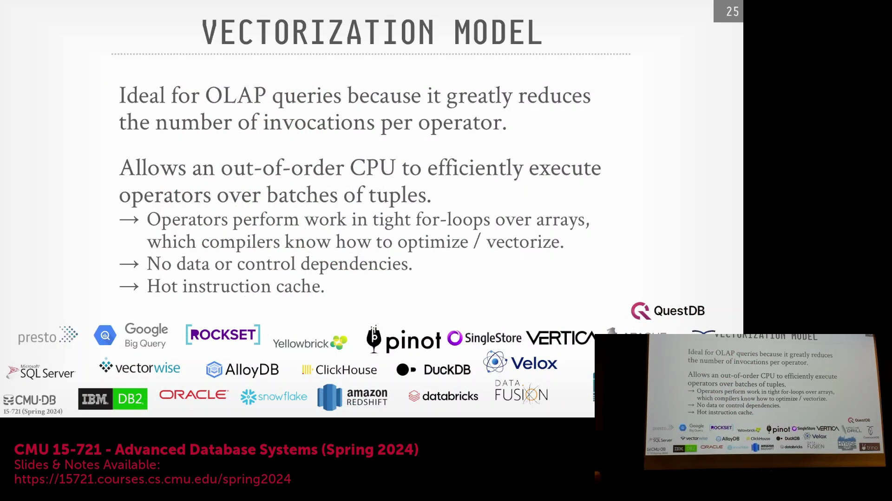
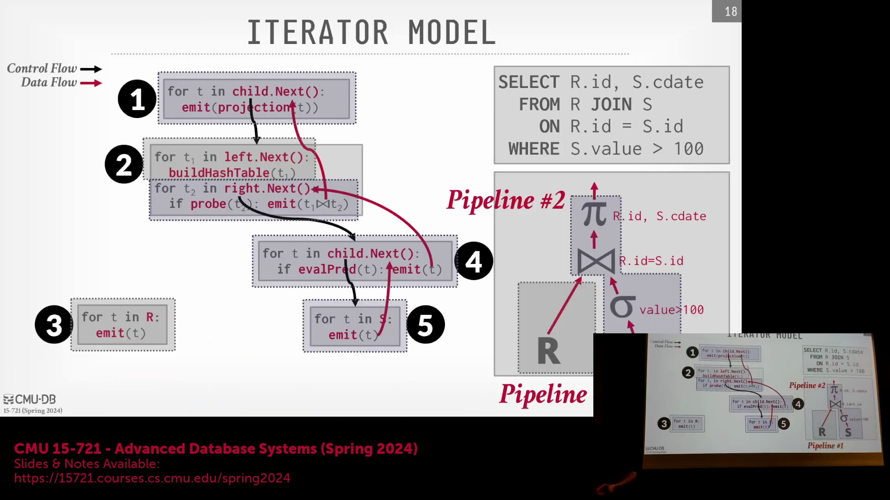
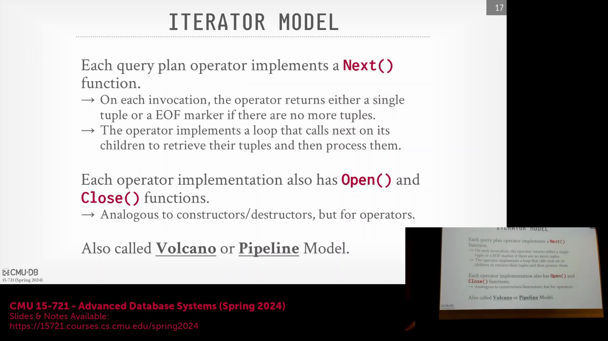
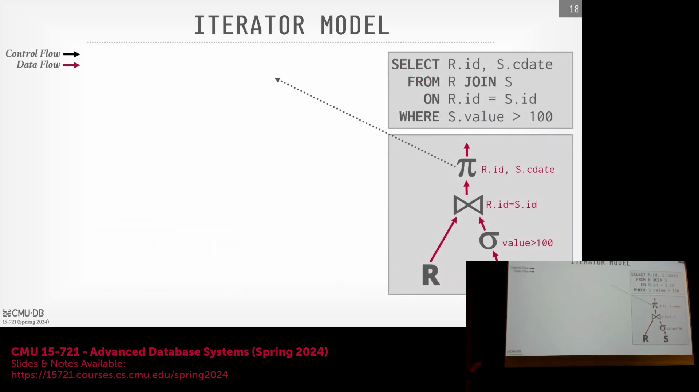
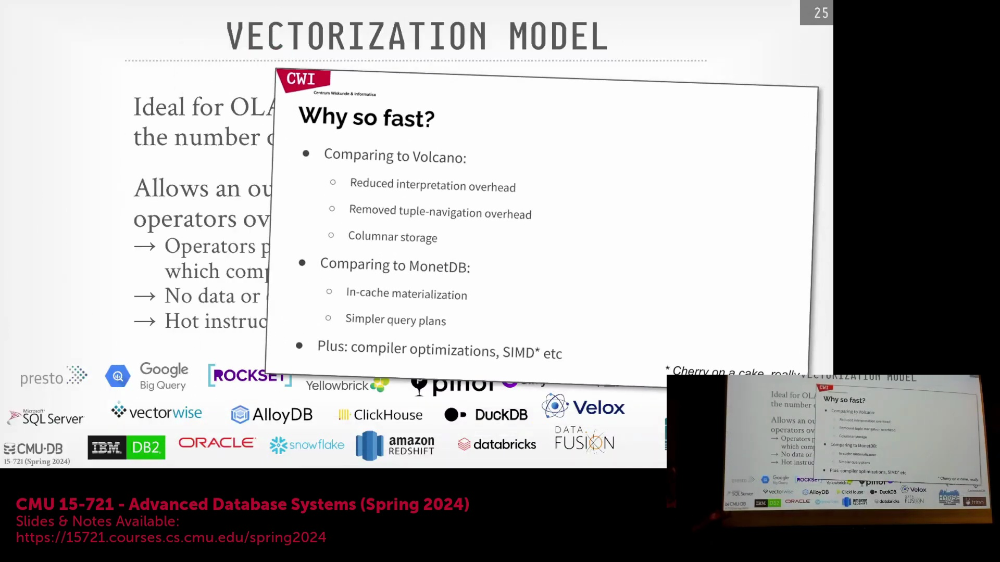

## 物化模型的局限性与向量化模型的引入
尽管物化模型(Materialization Model)减少了 `next()` 调用的次数，但其经常在算子(Operator)之间传递庞大的列数据块或完整的结果集，导致传输的数据量远超实际需求。向量化模型(Vectorized Model)作为一种理想的折中方案应运而生，它兼具迭代模型(Iterator Model)与物化模型的优势。算子之间不再交换单个元组(Tuple)或完整的结果集，而是以固定大小的元组批次或向量（通常约为 1,024 个）进行交互。这种方法有时被称为按数组处理(Array-at-a-time Processing)，它通过大小适中的数据块来处理数据，并能根据数据特征或硬件限制动态调整块的大小。

## 批处理的实现
在向量化实现中，每个算子维护一个输出缓冲区(Output Buffer)以累积元组。当累积数量达到预定义的向量大小(Vector Size)时，该批次数据便会向上游(Upstream)传递。若执行至数据集末尾时缓冲区仍未填满，系统也会强制将剩余的元组刷出(Flush)。为了高效处理过滤条件与谓词(Predicate)，系统通常借助位图(Bitmap)或偏移数组(Offset Array)来标记每个批次中的有效行。这确保了即使批次数据经过过滤，下游算子(Downstream Operator)也能精准识别向量中哪些元组依然有效。

## 对现代 OLAP 系统的优势
向量化模型已成为现代联机分析处理(OLAP)数据库的标准执行模式。它在保留流水线执行(Pipeline Execution)优势的同时，大幅降低了逐元组处理带来的函数调用开销(Function Call Overhead)。通过处理固定大小的数组，算子能够构建紧凑的执行循环(Tight Execution Loop)，该循环针对现代 CPU 的乱序执行(Out-of-Order Execution)与超标量架构(Superscalar Architecture)进行了高度优化。与完全物化不同，向量化批次(Vector Batch)的大小经过精心设计，通常可完全容纳于 CPU 的 L2 或 L3 缓存(Cache)中，从而避免了在沿查询计划向上游传递大型中间结果时引发的缓存抖动(Cache Thrashing)。这种细粒度的批处理机制使数据库引擎能够以大小适宜的数据块进行运算，无需预先物化(Materialize)整个数据集。

## 区分控制流与数据流
深入理解查询执行(Query Execution)的关键在于厘清控制流(Control Flow)与数据流(Data Flow)的区别。控制流负责决定算子的触发时机与执行顺序；在拉取式(Pull-based)模型中，它通常通过自上而下的 `next()` 调用来驱动。数据流则定义了算子之间实际传输的数据单元：可以是单个元组（迭代模型）、完整的结果集（物化模型）或固定大小的批次（向量化模型）。在推送式(Push-based)架构中，控制流通常被解耦并由中央调度器(Central Scheduler)统一管理；而在拉取式模型中，控制流则直接嵌入到各个算子的执行逻辑内部。向量化模型完整保留了拉取模型的控制结构，但将数据流的传输粒度从单个元组升级为对缓存友好的数组(Cache-friendly Array)。

## 编译器优化与性能验证
向量化执行(Vectorized Execution)与现代编译器的优化能力及底层 CPU 架构高度契合。在同构数组(Homogeneous Array)上运行的紧凑循环能够使算子逻辑常驻指令缓存(Instruction Cache)，并最大限度地减少迭代间的控制与数据依赖(Control and Data Dependencies)。这种高度可预测的执行模式使编译器能够自动应用 SIMD（单指令多数据流，Single Instruction, Multiple Data）指令，从而实现对多个元组值的并行处理。正如 Peter Boncz 的奠基性研究(Foundational Research)所强调，向量化执行彻底消除了火山模型(Volcano Model)中逐元组解释(Per-tuple Interpretation)带来的开销，同时简化了早期物化系统（如 NDB）中复杂的隐式状态跟踪(Implicit State Tracking)逻辑。最终，系统能够生成高度精简的查询计划(Query Plan)，自然地利用底层硬件并行性(Hardware Parallelism)，以极低的架构复杂度实现显著的性能跃升。
