## 课程简介与数据编码回顾
欢迎来到卡内基梅隆大学(Carnegie Mellon University)高级数据库系统(Advanced Database Systems)课程。今天，我们将从理论数据结构转向查询的实际执行。在过去的两节课中，我们重点探讨了数据布局(Data Layout)以及编码方案(Encoding Schemes)的设计，旨在最小化从磁盘或远程对象存储(Remote Object Storage)加载至内存的数据量。通过高效的数据编码，我们力求直接在压缩或编码格式下处理数据，并借助游程编码(Run-Length Encoding, RLE)等技术显著缓解 I/O 瓶颈(I/O Bottleneck)。
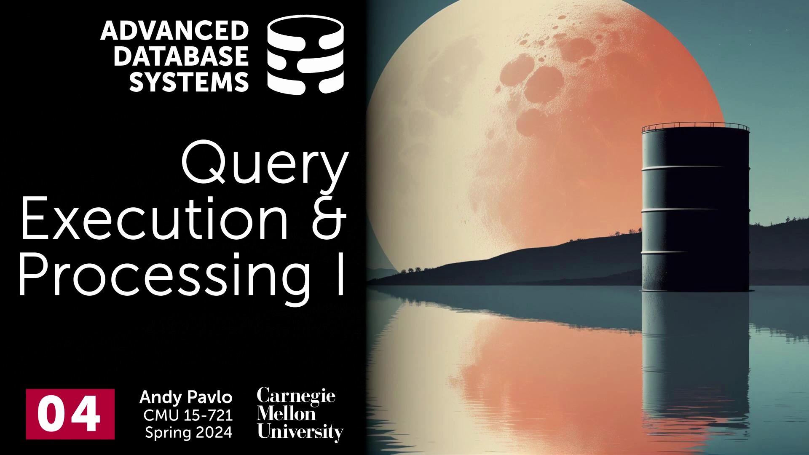
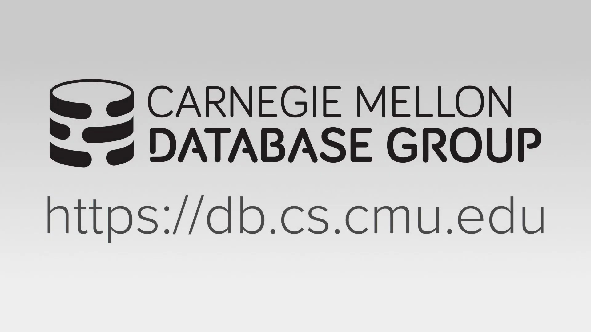

## OLAP 查询执行与优化“技巧库”
在联机分析处理(Online Analytical Processing, OLAP)范式中，查询执行主要依赖于顺序扫描(Sequential Scan)，而非索引查找或位图索引(Bitmap Index)。尽管 B+树(B+ Tree)等结构仍可能用于定位单条记录，但核心工作负载(Workload)在于大规模数据块的扫描。我们将深入探讨一套全面的“优化技巧库”以加速此类扫描。尽管区域映射(Zone Maps)能够有效跳过无关数据块，但我们的重点将放在更宏观的优化策略上，例如任务与查询并行化(Task and Query Parallelism)、高效连接算法(Join Algorithms)以及代码特化(Code Specialization)。这些概念将在本学期内逐步引入。我们的核心目标是构建能够充分榨取硬件性能的数据库系统，通过优化的乘法叠加效应实现更快的执行速度。然而，每项技术都伴随着工程实现与维护成本上的权衡(Trade-offs)。例如，尽管即时查询编译(Just-In-Time, JIT Query Compilation)能带来卓越的性能，但其复杂性往往促使生产系统转而采用预编译的向量化原语(Vectorized Primitives)。

## 核心优化目标与编译器考量
为最大化查询性能，我们确立了三项核心工程目标。其一是减少执行特定工作负载(Workload)所需的 CPU 指令总数。尽管编译器可通过 `-O2` 等编译标志(Compilation Flags)提供辅助，但生产级数据库通常避免使用 `-O3`。因为过于激进的优化可能会重排指令，从而损害程序正确性；Linux 之父 Linus Torvalds 曾就系统稳定性对此提出过著名警告。因此，数据库引擎的设计宗旨是从算法底层减少指令使用量，而非依赖激进的编译器优化标志。本次讲座将为任务并行化(Task Parallelism)奠定基础，并确立支持未来向量化执行(Vectorized Execution)所必需的查询处理模型(Query Processing Model)。

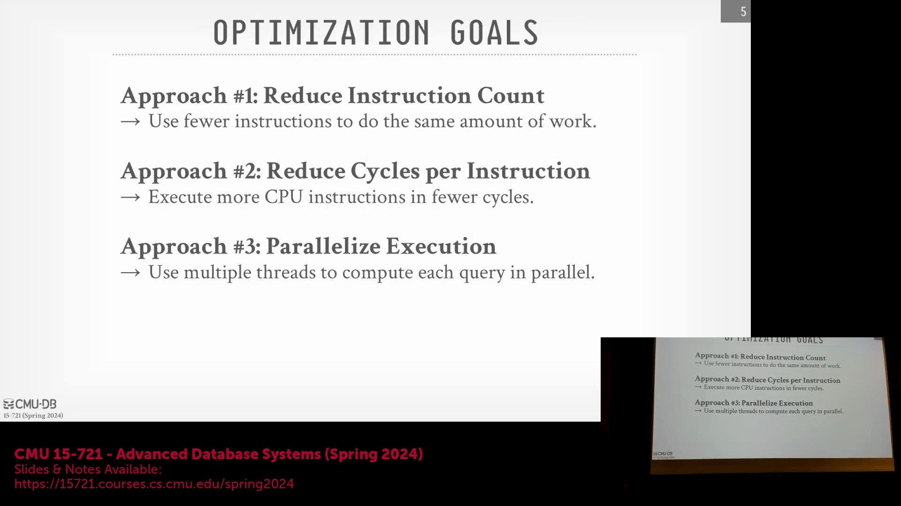

## 最小化每条指令周期（CPI）与对齐 CPU 架构
第二个目标是降低每条指令周期数(Cycles Per Instruction, CPI)。这要求确保数据操作数(Data Operands)驻留在 CPU 最快的存储层级中，即寄存器(Registers)或 L1/L2 缓存(L1/L2 Cache)。通过最大化算子(Operators)与执行计划内的数据局部性(Data Locality)，我们可以极大程度地避免代价高昂的缓存未命中(Cache Misses)。在此过程中，流水线技术(Pipelining)、算子融合(Operator Fusion)以及基于推送的执行模型(Push-based Execution Model)至关重要。实现与 CPU 架构的最佳对齐颇具挑战，因为人类易读的代码逻辑往往与现代乱序执行(Out-of-Order Execution)、超标量处理器(Superscalar Processors)的实际执行模式相冲突。编译器无法自动弥合这一鸿沟；我们必须刻意设计契合硬件预期的算法。第三个目标——并行化(Parallelism)——则顺应了业界向多核 CPU、异构/混合架构(Heterogeneous/Hybrid Architectures)以及大规模 GPU 集群演进的趋势，旨在将计算能力扩展至多线程与多节点环境。
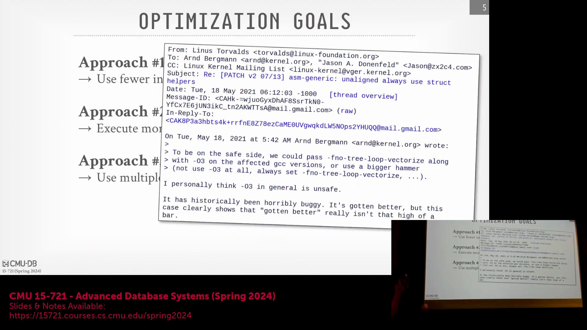

## 查询处理术语：计划、算子与任务
为确保表述清晰，我们统一了查询执行相关的术语。查询计划(Query Plan)以算子的有向无环图(Directed Acyclic Graph, DAG)形式组织。一条 SQL 查询会被转化为物理计划(Physical Plan)，其中包含扫描(Scan)、投影(Projection)、过滤(Filter)和连接(Join)等操作。随后，系统会将其实例化为“算子实例”(Operator Instances)，以代表具体的执行调用。这种区分使得并行化成为可能；例如，针对一张超大表的单个扫描算子可被拆分为多个实例，每个实例负责处理不同的行组(Row Groups)或文件。“任务”(Task)将一个或多个算子实例打包为一个可调度单元，其形态通常类似于流水线，扫描与过滤等操作在此被融合执行。最后，“任务集”(Task Set)则是这些任务的集合，已准备就绪以便在系统资源中进行调度与执行。
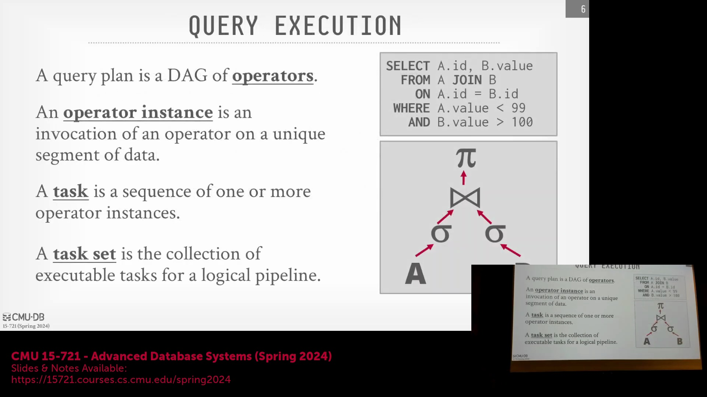

---

## 查询流水线与执行边界
流水线(Pipeline)定义了查询计划内的执行边界，决定了在遇到阻塞算子(Block Operator)之前能够连续处理的元组(Tuples)或数据批次(Batches)数量。以典型的哈希连接(Hash Join)为例，在开始探测(Probe Phase)之前，必须完整构建(Build)构建端(Build Side)的数据。过早进行探测可能导致漏报(False Negatives)，因为匹配的元组可能仍位于构建端尚未处理的数据中。为最大化数据复用(Data Reuse)并最小化时钟周期(Clock Cycles)开销，应将算子分组为紧密协作的流水线，并尽可能沿查询计划向上推送数据。将执行计划拆分为相互独立的流水线并物化(Materialize)中间结果，会因不必要的内存或磁盘写入引入显著开销，最终降低执行速度。
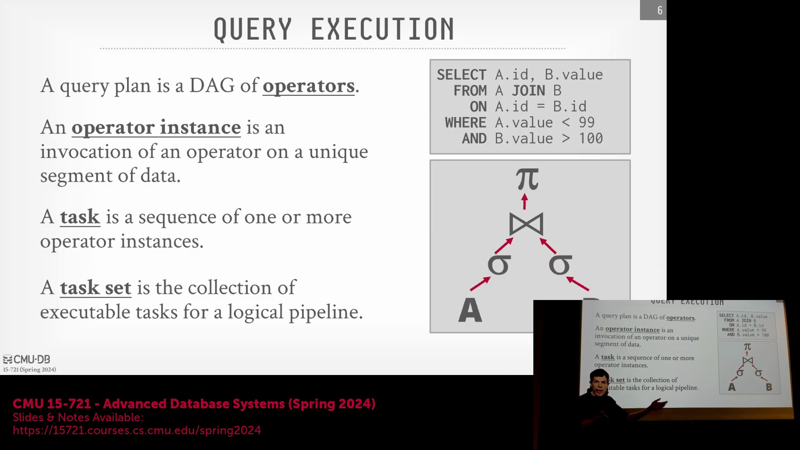

## 里程碑式的 2005 年 MonetDB/X100 论文
尽管这篇指定阅读论文(Required Reading Paper)发表于2005年，但其至今仍极具参考价值，因为它奠定了现代高性能联机分析处理(Online Analytical Processing, OLAP)系统的基础设计原则。X100 原型最初源自 MonetDB 项目，该研究证明了在算子之间逐元组传递数据(Tuple-at-a-Time)的传统模型会严重制约 CPU 性能。这项研究直接催生了商业数据库引擎 Vectorwise，该引擎随后被 Actian 收购，并演进为 Actian Vector 和 AdVelanche 等产品。该论文近期荣获 CIDR 时间检验奖(Test of Time Award)，进一步巩固了其作为数据库领域基石研究的地位。该论文作者此后主导或深刻影响了众多主流现代数据库系统(Database Systems)，包括 DuckDB、MonetDB、Snowflake 和 Apache Flink。
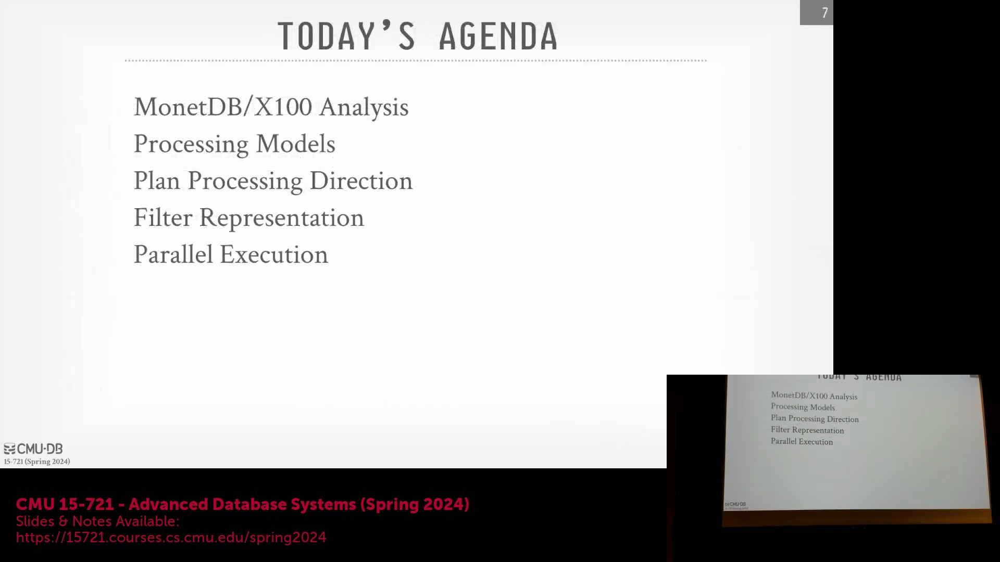

## 以 CPU 为中心的数据库架构
X100 论文的核心突破在于指出：传统数据库执行模型(Database Execution Model)与现代 CPU 架构从根本上存在不匹配(Mismatch)。该论文主张，系统设计不应仅侧重于代码可读性或常规软件工程实践，而应精心编排数据流(Data Flow)与指令序列(Instruction Sequences)，以显式匹配乱序执行(Out-of-Order Execution)与超标量处理器(Superscalar Processor)的硬件行为。尽管此举可能增加实现复杂度与维护成本，但能显著提升硬件执行指令的效率。通过优先顺应 CPU 的运行特性——例如保持可预测的内存访问模式(Memory Access Patterns)并最小化分支预测失败(Branch Misprediction)——数据库引擎能够实现仅依赖编译器优化(Compiler Optimizations)无法企及的显著性能提升。
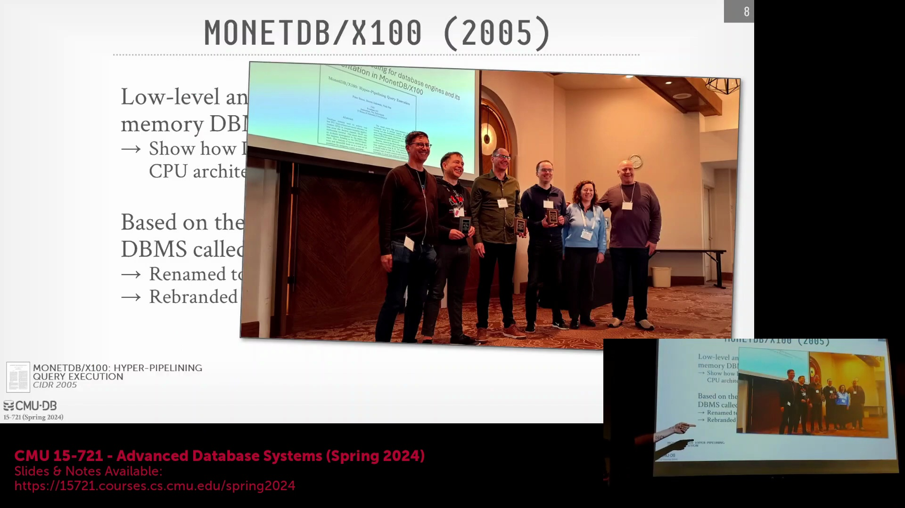

## 面向查询执行的 CPU 架构基础
深入理解数据库性能需掌握现代 CPU 的基本工作原理。CPU 的运行机制类似于装配线，通过多个流水线阶段(Pipeline Stages)逐级处理指令。硬件设计的首要目标是确保持续为指令流水线提供待处理的工作负载(Workload)。当某条指令发生停滞(Stall)时（例如因缓存未命中(Cache Miss)需从主存(Main Memory)获取数据），CPU 会尝试调度执行其他独立指令，以避免时钟周期(Clock Cycles)空闲。在超标量架构(Superscalar Architecture)中，多个执行单元可并行运行，使处理器能够在单个时钟周期内调度(Dispatch)并完成多条指令。因此，数据库系统在设计时必须提供稳定且缓存友好(Cache-Friendly)的操作流，以充分释放这种并行处理与乱序执行(Out-of-Order Execution)的硬件潜力。

---

## 乱序执行与超标量架构
现代中央处理器(Central Processing Unit, CPU)（如英特尔(Intel)与超威半导体(AMD)的产品）会动态采用乱序执行(Out-of-Order Execution)策略，以最大化指令吞吐量(Throughput)。然而，硬件在幕后进行了大量协调工作，以确保最终计算结果与指令严格按顺序执行(In-Order Execution)时完全一致。需要明确的是，“超标量”(Superscalar)并非指多核(Multi-Core)架构，而是指单个 CPU 核心内部集成了多条执行流水线(Execution Pipelines)。与这些高度优化的 CPU 不同，图形处理器(Graphics Processing Unit, GPU)核心通常采用顺序执行以简化设计复杂度。CPU 的指令推测执行(Speculative Execution)机制与数据库中的乐观并发控制(Optimistic Concurrency Control)颇为相似：它假设数据依赖关系能够正确解析，从而继续向前处理指令，并在最后阶段验证结果的正确性。

## 流水线停顿与分支预测错误
当预测准确时，推测执行表现卓越；但当 CPU 遭遇未解决的数据依赖(Data Dependency)或分支预测错误(Branch Misprediction)时，流水线停顿(Pipeline Stall)的代价将极为高昂。依赖停顿发生于某条指令必须等待前序指令的输出数据才能继续执行时。分支预测错误的代价则更为严重：当 CPU 遇到条件分支（如 `if/else` 代码块）时，会预先猜测执行路径，并沿该路径进行后续指令的推测执行。若猜测错误，整个指令流水线必须被冲刷(Flush)，执行状态回滚，并从正确的分支路径重新开始执行。这种“冲刷-重启”(Flush-and-Restart)循环会引入严重的执行延迟，直接导致查询性能下降。

## 数据库工作负载中的分支预测
数据库引擎面临的核心挑战在于，顺序扫描(Sequential Scan)与过滤(Filter)操作本质上依赖于数据驱动(Data-Driven)且高度不可预测的条件分支。SQL 中的 `WHERE` 子句本质上即是一个条件分支，其执行路径完全取决于底层的数据分布(Data Distribution)。由于 CPU 的分支预测器(Branch Predictor)无法感知数据库模式(Database Schema)、查询语义(Query Semantics)或数据内在规律，在处理大规模数据集时难以准确预测分支走向。因此，传统的基于迭代器的执行模型(Iterator-Based Execution Model)极易触发预测错误，将原本简单的顺序工作负载转化为低效且频繁停顿的处理过程。

## 编译器提示的局限性
为缓解分支不可预测性问题，开发者有时会使用 `likely` 和 `unlikely` 等编译器提示(Compiler Hints)（常见于 C++、PostgreSQL 和 ClickHouse 中）。然而，这些仅是提供给编译器的静态提示，用于在编译期重新排列汇编代码，将预测为“高概率”执行的代码块放置在更靠近跳转目标的位置，以提升指令缓存(Instruction Cache)的局部性。它们无法、也不会干预 CPU 内部的动态硬件分支预测器(Dynamic Hardware Branch Predictor)。现代处理器配备了历经数十年演进、高度复杂且具备自调节能力(Self-Tuning)的硬件预测器。人为注入的静态提示往往会干扰硬件的智能决策，甚至可能适得其反地降低执行性能。鉴于此，英特尔(Intel)于 2006 年在其处理器架构中正式移除了硬件级的分支提示操作码(Branch Hint Opcodes)。

## 过滤操作的瓶颈
考虑一个标准的范围查询(Range Query)：`SELECT * FROM table WHERE key > low AND key < high`。传统的执行模型通常通过简单的循环来实现该查询：遍历元组(Tuple)、提取键值(Key)，并通过 `if` 语句判断该元组是否满足谓词条件(Predicate Condition)。若匹配成功，则将该元组复制至输出缓冲区(Output Buffer)。该模型的核心低效之处正是 `if` 条件分支。由于谓词的真值结果随数据变化而高度不可预测，CPU 难以维持稳定的指令流水线。这会引发频繁的分支预测错误、流水线冲刷及指令周期浪费，从根本上制约了内存驻留型(Memory-Resident) OLAP 工作负载的性能上限。

---

## 过滤谓词的无分支执行
传统的过滤操作(Filter Operation)依赖于条件 `if` 语句，这迫使中央处理器(CPU)猜测执行路径，并在分支预测错误(Branch Misprediction)时遭受严重的性能惩罚(Performance Penalty)。对于现代硬件而言，更高效的方法是无分支执行(Branchless Execution)。系统在复制数据前不再显式检查谓词(Predicate)，而是无条件地将每个元组(Tuple)写入输出缓冲区(Output Buffer)。随后，系统利用三元运算符(Ternary Operator)根据谓词是否满足来计算写入偏移量(Write Offset)（0 或 1）。若某元组未通过过滤，后续迭代只需简单地覆盖此前写入的元组。尽管从软件工程角度而言，这种持续的数据复制(Data Copy)看似计算冗余，但它会被转化为线性、确定性的汇编指令(Assembly Instructions)，使 CPU 能够在零分支预测开销的情况下高速执行。

Vectorwise 的性能基准测试(Performance Benchmark)表明，尽管传统分支方法在极低选择率(Selectivity, <5%)时表现更优，但当选择率接近 50% 时，由于频繁的流水线冲刷(Pipeline Flush)，其性能会急剧下降。相比之下，无分支执行(Branchless Execution)无论数据分布(Data Distribution)如何，均能保持平稳且可预测的执行成本，这印证了面向硬件的优化(Hardware-Oriented Optimization)往往优于直观的软件逻辑。
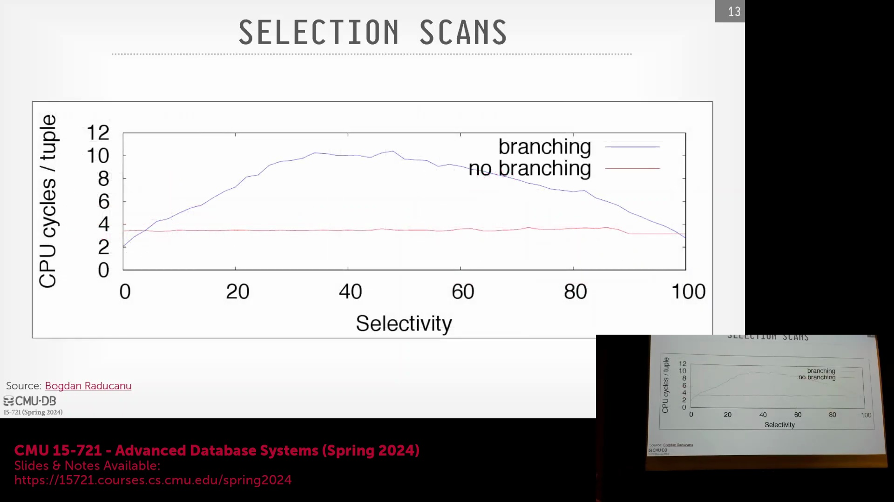

## 代码特化与消除运行时分发
为进一步最小化 CPU 周期(CPU Cycles)，数据库系统应采用代码特化(Code Specialization)技术，以消除运行时类型检查(Runtime Type Checking)与动态分发(Dynamic Dispatch)机制。传统实现通常依赖冗长的 `switch` 语句或表达式树遍历(Expression Tree Traversal)来处理不同的数据类型(Data Types)与操作符，PostgreSQL 的 `numeric` 加法函数便是典型示例。此类结构迫使 CPU 执行大量跳转指令(Jump Instructions)与间接函数调用(Indirect Function Calls)，严重破坏了指令流水线(Instruction Pipeline)与缓存局部性(Cache Locality)。尽管 Rust 等现代编程语言或高级编译器(Advanced Compiler)可能优化掉部分逻辑，但间接跳转(Indirect Branch)对于现代超标量架构(Superscalar Architecture)而言本质上依然代价高昂。

现代联机分析处理(Online Analytical Processing, OLAP)系统通过在查询规划(Query Planning)阶段利用系统目录元数据(System Catalog Metadata)预先确定精确的数据类型与操作，从而规避了此问题。通过提前编译(Ahead-Of-Time, AOT)或即时编译(Just-In-Time, JIT)生成高度特化且具备类型感知(Type-Aware)的执行原语(Execution Primitives)，引擎为 CPU 提供了一段专为该查询量身定制的连续指令序列，从而在执行期彻底绕过了条件逻辑与动态类型解析(Dynamic Type Resolution)。

## 查询执行模型：控制流与数据流
在确立面向硬件的优化策略后，讨论重点转向决定算子(Operators)交互方式的架构级执行模型(Architectural Execution Model)。每种查询处理模型(Query Processing Model)均由两条独立路径定义：控制流(Control Flow)与数据流(Data Flow)。控制流决定调度顺序(Scheduling Order)，规定算子或其算子实例(Operator Instances)何时被激活调用。数据流则指定数据传递路径，明确每个算子的输入来源(Input Source)与输出目的地(Output Destination)。在 OLAP 环境中，数据流通常针对列的子集(Column Subsets)进行处理，而非完整的行元组(Row Tuples)，以此优化缓存命中率(Cache Hit Rate)。这两条路径构成了评估不同处理范式(Processing Paradigms)的基础，最终指引系统设计向能够最大化分析型工作负载(Analytical Workloads)硬件利用率的方向演进。

## 迭代器（火山）模型
历史上最为流行的执行范式是迭代器模型(Iterator Model)，亦称为火山模型(Volcano Model)。在 MonetDB/X100 取得突破之前，该架构主导了数据库系统设计，且至今仍是众多行式存储(Row Store)与联机事务处理(Online Transaction Processing, OLTP)系统的标准实现。在此模型中，每个算子均需实现标准的 `next()` 接口。执行流程沿控制流自上而下展开：父算子(Parent Operator)通过调用子算子(Child Operator)的 `next()` 接口请求数据，子算子继而递归调用其下属算子的 `next()`，从而将单个元组沿查询计划(Query Plan)自底向上拉取(Pull)，直至传递至根节点。
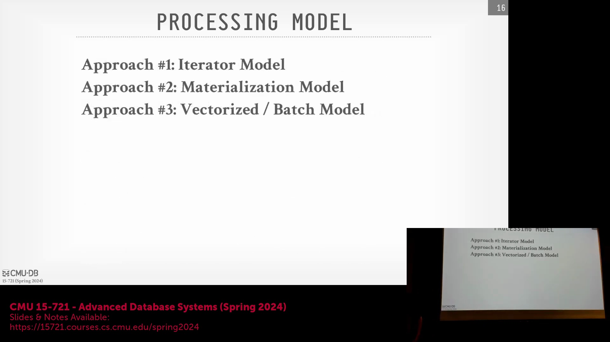

尽管这种基于拉取(Pull-Based)的方法具备良好的模块化(Modularity)与代码简洁性，但会引入显著的函数调用开销(Function Call Overhead)，并阻碍高效的数据批处理(Data Batching)。每次 `next()` 调用均代表一次控制流转移，现代 CPU 难以对此类调用进行高效的流水线化(Pipelining)处理。这使得传统迭代器模型从根本上不适用于需要沿执行计划持续处理大数据块的高吞吐量 OLAP 工作负载。

---

## 迭代执行模型与算子生命周期
迭代模型(Iterator Model)（亦称火山模型(Volcano Model)）将每个数据库算子(Operator)设计为一个迭代循环，用于从其子算子中拉取元组(Tuple)。该模型的执行过程依赖于三个核心函数：`open`、`next` 和 `close`，它们分别负责初始化状态、驱动迭代取数以及清理资源。根据算子是否为流水线阻断算子(Blocking Operator/Pipeline Breaker)，其执行策略有所不同：阻断型算子会一次性从子节点拉取全部所需数据，而非阻断型算子则逐次获取并处理单个元组，并在满足内部逻辑时输出结果。算子内部的执行状态与游标(Cursor)用于在连续的 `next()` 调用之间跟踪执行进度。
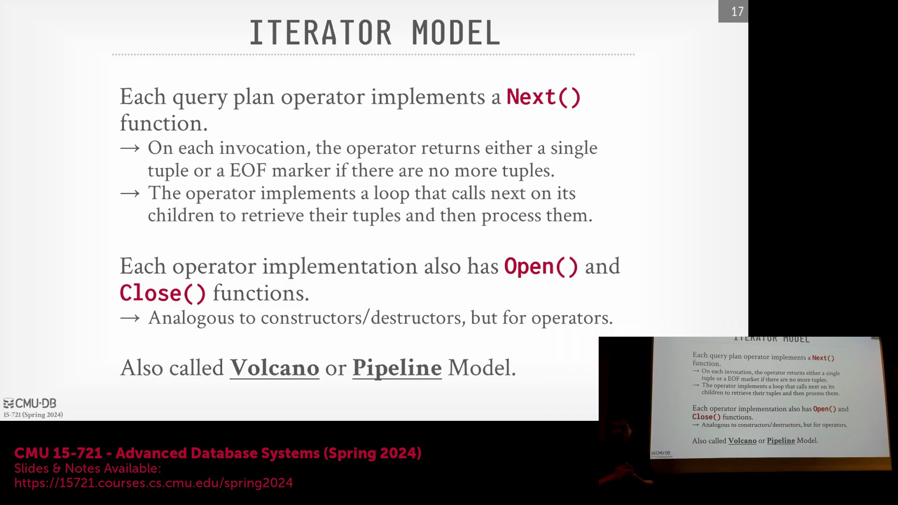

## 高级查询执行示例
以高级查询执行为例，假设需要对表 R 和表 S 执行连接操作(Join)，并对 S 表应用过滤条件(Filter)。查询执行采用自顶向下(Pull-based)的调用流程：根算子发起 `next()` 调用，进而触发向子算子的级联请求。以哈希连接(Hash Join)为例，其控制流(Control Flow)首先向下推进，通过扫描输入的一侧（如 R 表）来构建哈希表(Hash Table)。在此构建(Build)阶段，算子会维护内部游标状态并逐个处理返回的元组。当哈希表构建完毕后，算子随即转入探测(Probe)阶段，开始扫描另一侧输入（S 表），应用谓词(Predicate)过滤条件，并通过探查哈希表来生成最终的匹配结果。

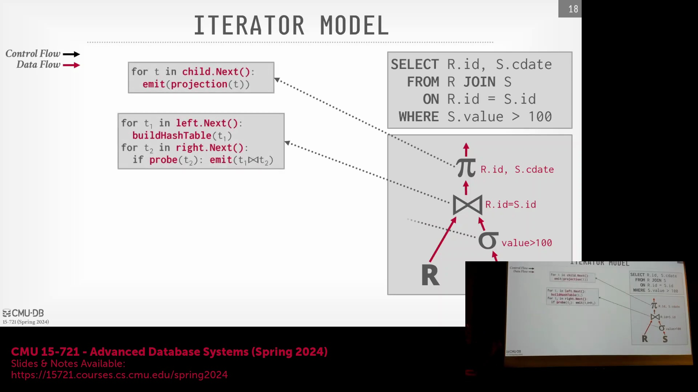

## 流水线技术与执行边界
该执行模式会自然地将查询计划划分为多个独立的流水线(Pipeline)。例如，扫描 R 表及其对应的初始构建阶段可构成流水线 1，而扫描 S 表、过滤及探测阶段则构成流水线 2。流水线技术的核心目标在于：在遭遇流水线阻断器(Pipeline Breaker)或产生最终结果之前，尽可能沿查询计划向上游推进，对每个传入的元组执行深度处理。通过让单个元组驻留于内存中，并在处理下一个元组前对其应用所有可执行的操作，该机制能够有效最大化缓存局部性(Cache Locality)。
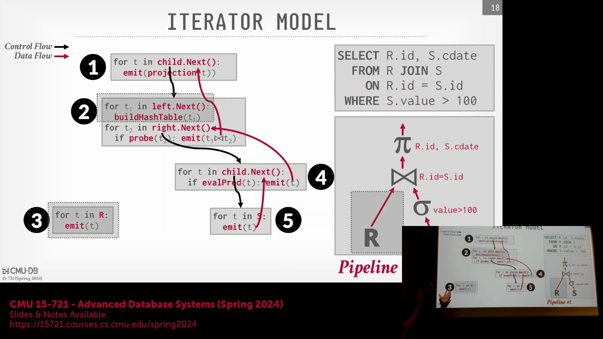
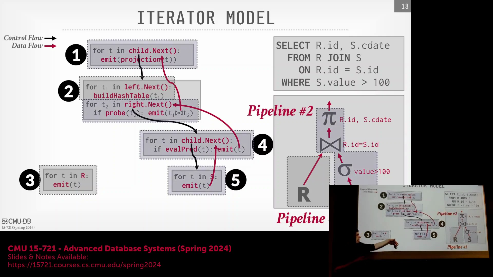

## 迭代方法的局限性
尽管迭代模型在 PostgreSQL 等经典数据库系统中被广泛采用，但其本身存在明显的局限性。该模型本质上将控制流(Control Flow)与数据流(Data Flow)紧密耦合，导致当查询达到所需的结果数量限制时，难以实现执行过程的提前终止(Early Termination)。更为关键的是，该模型会引入显著的函数调用开销(Function Call Overhead)。处理数十亿量级的元组意味着需要在算子树(Operator Tree)中发起数十亿次 `next()` 调用，这种高频调用极易引发 CPU 指令流水线停顿(Instruction Pipeline Stall)及函数调用上下文切换(Context Switch)，从而导致整体性能下降。
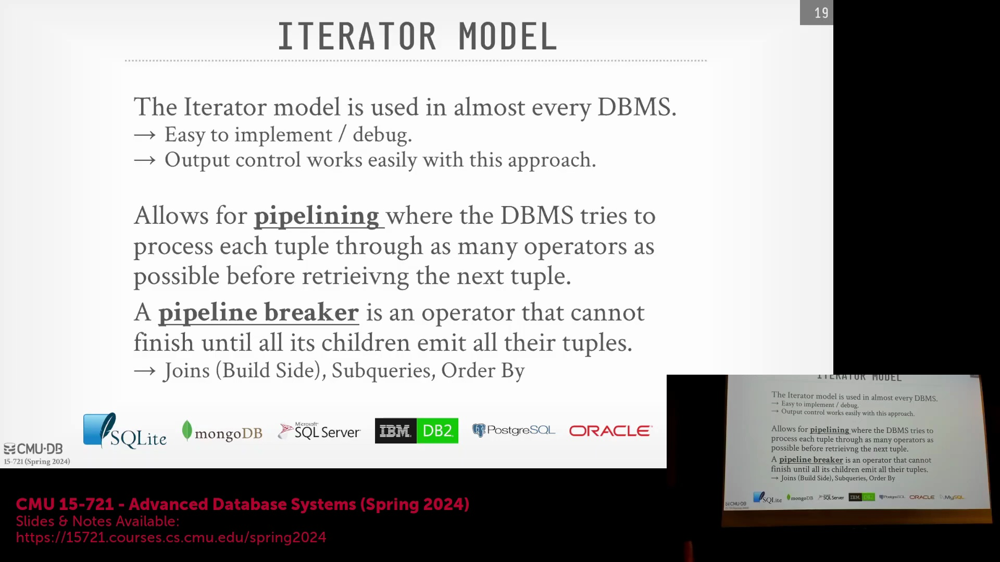

## 物化模型
作为由 MonetDB 开创的一种替代方案，物化模型(Materialization Model)彻底改变了算子返回结果的方式。与迭代模型中每次调用 `next()` 仅返回单个元组不同，物化模型要求每个算子一次性物化(Materialize)并返回其完整的输出结果集。单次 `next()` 调用即可触发算子内部逻辑的完整执行：算子会先将全部结果填充至内部输出缓冲区(Output Buffer)，随后一次性交付给父算子。这种机制消除了为处理增量数据而反复调用 `next()` 的需求，并确保每个算子在其输出被父节点消费前已完全执行完毕。

## 物化在实际中的应用与算子融合
将物化模型应用于前述的连接示例时，针对 R 表的扫描算子(Scan Operator)会在将控制权交还至哈希连接构建器之前，率先填满整个输出缓冲区。同理，右侧输入的扫描与过滤操作也会在探测阶段开始前，将所有符合条件的元组完全物化。在此架构下，一项显著的优化手段是算子融合(Operator Fusion)（亦称内联(Inlining)）：将扫描与过滤逻辑合并为单一执行步骤。通过在数据扫描期间直接评估谓词(Predicate)，并仅将满足条件的元组写入输出缓冲区，系统有效避免了“先物化海量中间数据、随后又将其立即丢弃”所带来的冗余开销。
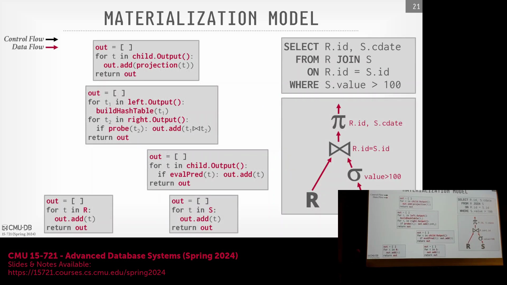
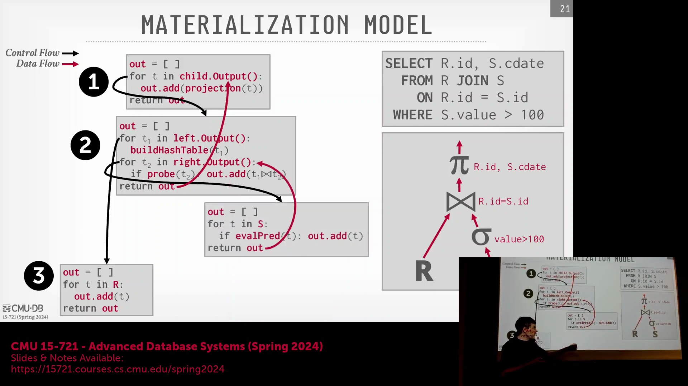

## 工作负载适用性：OLTP 与 OLAP
物化模型在联机事务处理(OLTP)环境中表现优异，因为此类查询通常仅访问或返回极少量的元组。对微小的结果集进行物化能够最大限度地削减函数调用开销，从而加速查询执行。然而，该模型在联机分析处理(OLAP)工作负载下往往表现欠佳。处理海量数据集时，若在每个算子阶段都物化庞大的中间结果，将导致内存占用激增、CPU 开销上升以及缓存未命中率(Cache Miss Rate)显著提高。HStore（即后续演进为 VoltDB 的系统）等早期数据库曾为事务型场景采用此方法，但现代分析型数据库通常需借助混合执行模型或向量化执行(Vectorized Execution)等技术来规避上述性能瓶颈。
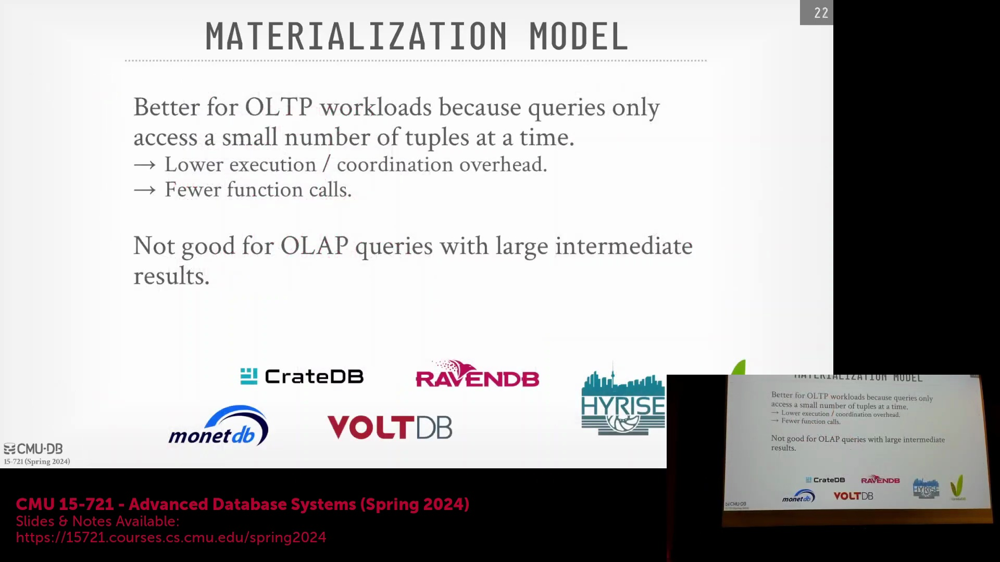

---

## 物化模型的局限性与向量化模型的引入
尽管物化模型(Materialization Model)减少了 `next()` 调用的次数，但其经常在算子(Operator)之间传递庞大的列数据块或完整的结果集，导致传输的数据量远超实际需求。向量化模型(Vectorized Model)作为一种理想的折中方案应运而生，它兼具迭代模型(Iterator Model)与物化模型的优势。算子之间不再交换单个元组(Tuple)或完整的结果集，而是以固定大小的元组批次或向量（通常约为 1,024 个）进行交互。这种方法有时被称为按数组处理(Array-at-a-time Processing)，它通过大小适中的数据块来处理数据，并能根据数据特征或硬件限制动态调整块的大小。

## 批处理的实现
在向量化实现中，每个算子维护一个输出缓冲区(Output Buffer)以累积元组。当累积数量达到预定义的向量大小(Vector Size)时，该批次数据便会向上游(Upstream)传递。若执行至数据集末尾时缓冲区仍未填满，系统也会强制将剩余的元组刷出(Flush)。为了高效处理过滤条件与谓词(Predicate)，系统通常借助位图(Bitmap)或偏移数组(Offset Array)来标记每个批次中的有效行。这确保了即使批次数据经过过滤，下游算子(Downstream Operator)也能精准识别向量中哪些元组依然有效。

## 对现代 OLAP 系统的优势
向量化模型已成为现代联机分析处理(OLAP)数据库的标准执行模式。它在保留流水线执行(Pipeline Execution)优势的同时，大幅降低了逐元组处理带来的函数调用开销(Function Call Overhead)。通过处理固定大小的数组，算子能够构建紧凑的执行循环(Tight Execution Loop)，该循环针对现代 CPU 的乱序执行(Out-of-Order Execution)与超标量架构(Superscalar Architecture)进行了高度优化。与完全物化不同，向量化批次(Vector Batch)的大小经过精心设计，通常可完全容纳于 CPU 的 L2 或 L3 缓存(Cache)中，从而避免了在沿查询计划向上游传递大型中间结果时引发的缓存抖动(Cache Thrashing)。这种细粒度的批处理机制使数据库引擎能够以大小适宜的数据块进行运算，无需预先物化(Materialize)整个数据集。

## 区分控制流与数据流
深入理解查询执行(Query Execution)的关键在于厘清控制流(Control Flow)与数据流(Data Flow)的区别。控制流负责决定算子的触发时机与执行顺序；在拉取式(Pull-based)模型中，它通常通过自上而下的 `next()` 调用来驱动。数据流则定义了算子之间实际传输的数据单元：可以是单个元组（迭代模型）、完整的结果集（物化模型）或固定大小的批次（向量化模型）。在推送式(Push-based)架构中，控制流通常被解耦并由中央调度器(Central Scheduler)统一管理；而在拉取式模型中，控制流则直接嵌入到各个算子的执行逻辑内部。向量化模型完整保留了拉取模型的控制结构，但将数据流的传输粒度从单个元组升级为对缓存友好的数组(Cache-friendly Array)。

## 编译器优化与性能验证
向量化执行(Vectorized Execution)与现代编译器的优化能力及底层 CPU 架构高度契合。在同构数组(Homogeneous Array)上运行的紧凑循环能够使算子逻辑常驻指令缓存(Instruction Cache)，并最大限度地减少迭代间的控制与数据依赖(Control and Data Dependencies)。这种高度可预测的执行模式使编译器能够自动应用 SIMD（单指令多数据流，Single Instruction, Multiple Data）指令，从而实现对多个元组值的并行处理。正如 Peter Boncz 的奠基性研究(Foundational Research)所强调，向量化执行彻底消除了火山模型(Volcano Model)中逐元组解释(Per-tuple Interpretation)带来的开销，同时简化了早期物化系统（如 NDB）中复杂的隐式状态跟踪(Implicit State Tracking)逻辑。最终，系统能够生成高度精简的查询计划(Query Plan)，自然地利用底层硬件并行性(Hardware Parallelism)，以极低的架构复杂度实现显著的性能跃升。

---

## 拉取式（自上而下）执行模型
传统的查询执行依赖于拉取式(Pull-based)、自上而下(Top-down)的架构。处理流程从根算子(Root Operator)开始，并沿查询计划(Query Plan)向下级联调用。执行过程由重复的 `next()` 调用驱动：根算子向其子算子请求数据，子算子继续向下请求，直至从叶节点(Leaf Node)的扫描算子(Scan Operator)处逐层向上拉取数据，最终生成查询结果。这种迭代器模型(Iterator Model)构成了大多数经典数据库系统的基础设计，并天然支持流水线边界(Pipeline Boundary)，用于在特定阶段暂存中间结果(Intermediate Results)。
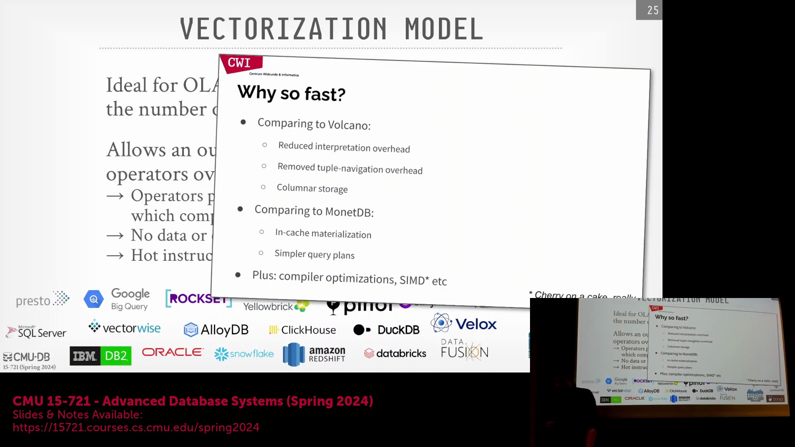

## 函数调用开销与 CPU 流水线中断
尽管实现简单且应用广泛，但拉取式模型引入了显著的运行时开销(Runtime Overhead)。每次 `next()` 调用通常涉及虚函数调用(Virtual Function Call)与指针间接寻址(Pointer Indirection)，这在现代超标量 CPU(Superscalar CPU) 上会转化为代价高昂的跳转指令(Jump Instruction)。频繁的控制流切换会破坏指令预取(Instruction Prefetch)与分支预测(Branch Prediction)，进而阻碍处理器的并行执行能力。随着查询复杂度的提升，数百万次逐元组(Tuple-at-a-time)或逐批次(Batch-at-a-time)的函数调用所累积的开销，往往成为系统性能的主要瓶颈。
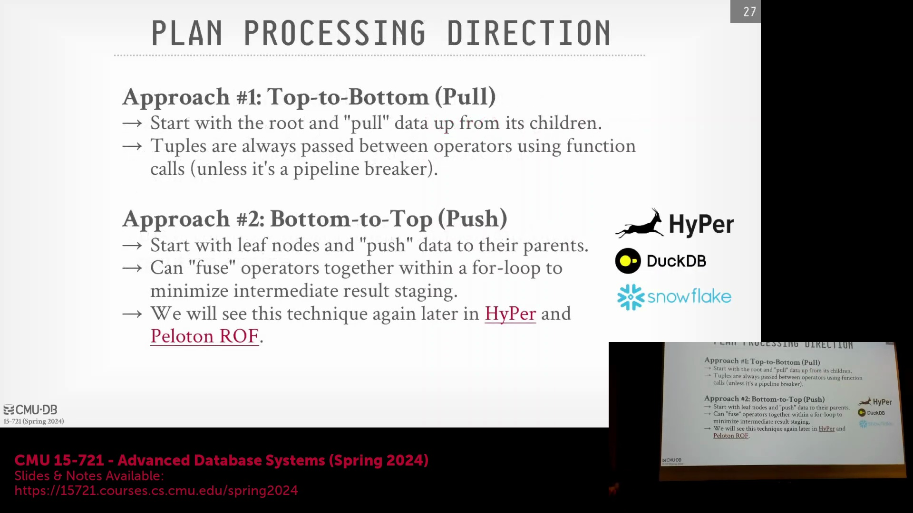

## 推送式（自下而上）替代方案
为消除 `next()` 调用带来的开销，推送式模型(Push-based Model)通过从叶节点启动并将数据逐层向上传递，彻底反转了执行方向。外部调度器(External Scheduler)或执行控制器(Execution Controller)采用自下而上的方式启动流水线(Pipeline)，使算子能够在生成数据后，立即将其推送(Push)给父算子。该架构因 Hyper 和 Umbra 等数据库系统而广为人知，这些系统率先在查询执行中引入了即时编译(JIT Compilation)技术。通过将控制流(Control Flow)与数据移动(Data Movement)解耦，推送式模型实现了更具可预测性且更契合底层硬件的执行模式。
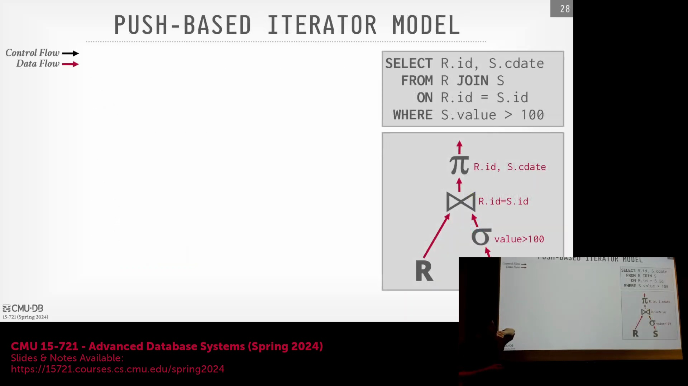

## 算子融合与紧凑的流水线循环
在推送式架构中，整个流水线被融合(Operator Fusion)为连续的代码块，而非依赖离散独立的算子对象。例如，哈希连接(Hash Join)可被编译为两个紧凑的 `for` 循环：一个负责扫描构建侧(Build Side)并构建哈希表(Hash Table)；另一个负责扫描探测侧(Probe Side)、评估谓词(Predicate)、探测哈希表并输出结果。这种融合机制确保每个元组或向量批次(Vector Batch)在引擎处理下一批次之前，都能完成从数据源到目的地的完整处理流程，从而大幅削减了上下文切换(Context Switch)与中间物化(Intermediate Materialization)的开销。
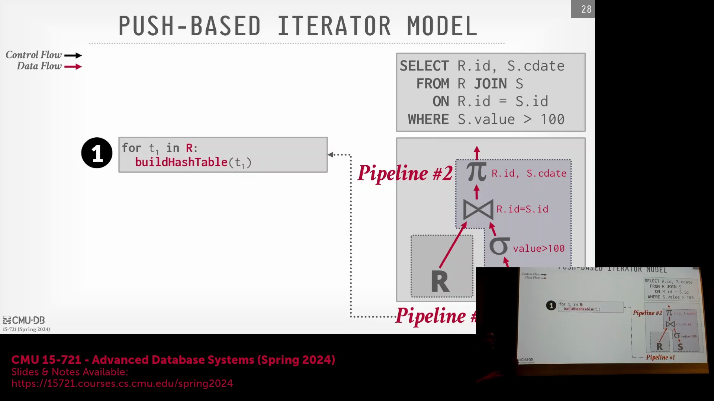

## 实现策略：JIT 编译与代码特化
若要在不硬编码(Hardcoding)所有可能查询计划的前提下实现算子融合，必须依赖先进的编译技术。目前主要有两种实现路径：即时编译(JIT Compilation)与代码特化(Code Specialization)。以 Hyper 为代表的 JIT 系统会在运行时动态生成 LLVM IR（中间表示(Intermediate Representation)）甚至原生 x86 汇编代码，将其编译为共享对象(Shared Object)，并通过动态链接(Dynamic Linking)加载执行。另一种方案如 Vectorwise 系统，则采用代码特化技术，将算子逻辑表示为预编译函数指针数组。在处理向量化批次(Vectorized Batch)时，函数指针调用的开销可被均摊至上千个元组，从而在无需完整运行时编译的情况下，依然保持高吞吐量(Throughput)。

## 集中式调度与数据路由
推送式执行依赖集中式调度器(Centralized Scheduler)来统一管理控制流，精确指定每个流水线的触发时机及其输出数据的流向。调度器负责预先分配输出缓冲区(Output Buffer)，在数据需分发至多个下游算子(Downstream Operator)时处理分支逻辑(Branch Logic)，并在分布式架构中将数据分发工作委托给 Shuffle 服务。这种显式编排(Explicit Orchestration)彻底取代了传统 `next()` 调用链中的隐式控制流(Implicit Control Flow)，使数据库引擎能够对跨查询计划的执行顺序、资源分配与数据路由(Data Routing)实现完全掌控。

## 性能权衡与架构复杂性
尽管推送式 JIT 模型通过将数据紧密驻留于 L1 缓存(L1 Cache)与 CPU 寄存器(CPU Register)中，提供了卓越的性能表现，但其也引入了极高的工程复杂度。即便对经验丰富的数据库研发团队而言，构建并维护一个健壮的 JIT 编译器(JIT Compiler)与调度器依然是一项艰巨挑战。相比之下，拉取式模型虽存在虚函数调用开销，却为早期终止(Early Termination)（如 `LIMIT` 操作）提供了更直观的控制流，且更易于调试与排查。最终，在架构模型之间的抉择，实质上是在硬件资源利用率(Hardware Resource Utilization)与开发复杂度、系统可维护性(System Maintainability)之间寻求最佳平衡。

---

## 推送式输出控制的局限性
尽管推送式(Push-based)（自下而上）执行模型在最小化函数调用开销(Function Call Overhead)和最大化 CPU 流水线(CPU Pipeline)利用率方面表现出色，但其在管理输出数据量(Output Data Volume)时引入了特定的挑战。在传统的拉取式(Pull-based)模型中，根算子(Root Operator)保留着显式控制权：一旦满足 `LIMIT` 条件，它便会直接停止发起 `next()` 调用，从而立即终止下游(Downstream)的执行流程。然而，在推送式架构中，流水线(Pipeline)的触发由外部调度器(External Scheduler)主导。即使所需的输出结果已达成，引擎仍可能继续生成并向下游推送完整的批次数据(Batch Data)，从而导致对非必要数据进行冗余处理。这一权衡凸显出：拉取式控制流(Control Flow)能够提供更简洁的提前终止(Early Termination)机制，而推送式模型则更侧重于维持连续且不间断的数据流。
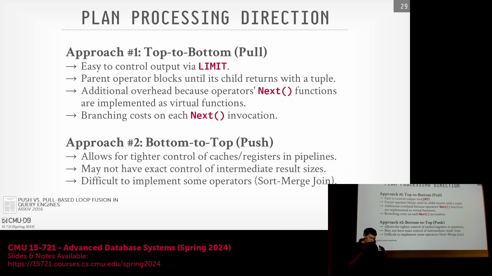

## 执行方向与数据粒度的正交性
推送(Push-based)与拉取(Pull-based)执行模式的选择，与数据的分批方式(Data Batching)是相互独立（即正交(Orthogonal)）的。即使在推送式模型中，算子(Operator)仍可被设计为处理单个元组(Tuple)、完全物化(Fully Materialized)的结果集(Result Set)，或固定大小的向量(Vector)。例如，一个推送流水线可遍历一批元组，并一次性对整个批次调用向量化谓词评估(Vectorized Predicate Evaluation)函数。这表明执行方向(Execution Direction)（即由谁发起处理）与数据粒度(Data Granularity)（元组与向量的对比）是两个独立的架构维度(Architectural Dimension)，可根据特定工作负载(Workload)的特征进行灵活组合。
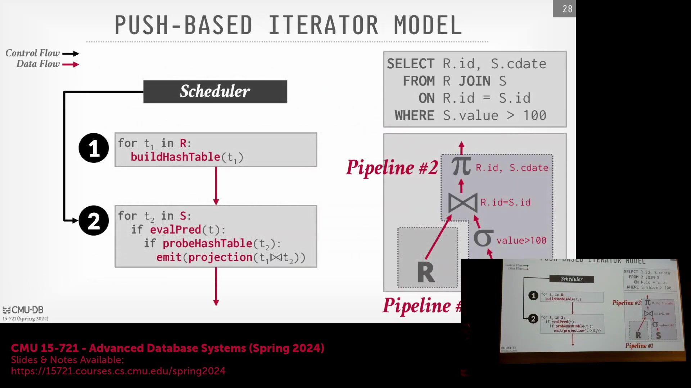

## 部分过滤批次的处理挑战
在经典的迭代器模型(Iterator Model)中，若某个元组未通过谓词检查(Predicate Check)，它会在传递至父算子(Parent Operator)前被直接丢弃，从而确保仅有有效数据流经查询计划(Query Plan)。向量化执行(Vectorized Execution)从根本上改变了这一机制。由于算子处理的是固定大小的批次，单个输入向量(Input Vector)在经过过滤后，往往会混合包含有效与无效的元组。核心的工程挑战随之而来：系统应如何表示这种部分过滤的批次，同时避免产生高昂的内存分配(Memory Allocation)与数据拷贝(Data Copy)开销？若在每一步算子处理中都将有效元组物理压缩(Physical Compaction)至新的缓冲区(Buffer)，过度的内存管理开销将严重拖累整体性能。

## 选择向量（位置列表）
解决该问题的高效方案是**选择向量**（Selection Vector），亦称**位置列表**（Position List）。该元数据结构(Metadata Structure)是一个紧密排列的整数偏移量(Integer Offsets)数组，专门用于索引原始数据向量(Raw Data Vector)中的有效元组。例如，若一个包含五个元组的批次仅在索引 1、3 和 4 处匹配成功，选择向量只需存储 `[1, 3, 4]`。该紧凑列表将被传递至下游，使后续算子(Subsequent Operator)仅处理相关元组，并安全地跳过“无效”数据。包括 Databricks Photon 引擎相关研究在内的现代文献表明，选择向量通常是实现通用过滤(General Filtering)的最快方法，因为它彻底消除了中间内存(Intermediate Memory)的重新分配开销。

## 位图与硬件加速掩码
另一种主流表示方法是**位图**（Bitmap），亦称**有效性掩码**（Validity Mask）。它为批次中的每个元组分配一个二进制位(Binary Bit)，用于标记其状态为有效（`1`）或已过滤（`0`）。该方法在硬件加速(Hardware Acceleration)环境中表现尤为突出。AVX-512 等现代 SIMD（单指令多数据流）指令集原生支持掩码操作(Mask Operations)，允许 CPU 直接在寄存器级别跳过对无效数据通道(Data Lane)的处理，从而避免分支跳转(Branching)。通过将位图加载至 SIMD 执行掩码(SIMD Execution Mask)，向量化引擎可在多个数据通道上并行执行谓词评估(Predicate Evaluation)或算术运算(Arithmetic Operations)，并在硬件层面自动屏蔽被过滤的结果。

## 零拷贝理念与拉取模型的状态跟踪开销
选择向量与位图背后的核心理念是**零拷贝执行**（Zero-Copy Execution）。传递未经修改的数据缓冲区(Data Buffer)并附带轻量级元数据，其计算成本远低于频繁调整数组大小与执行紧凑化操作(Compaction)。若下游算子检查位图或选择向量后发现其为空，即可立即中止对该批次的全部处理。相反，若在拉取式模型中尝试部分填充输出缓冲区，则需引入复杂的状态管理(State Management)与记录机制，以便跨算子边界(Operator Boundary)跟踪剩余的可用槽位(Slot)。此类间接处理方式将抵消向量化带来的性能优势。实践表明：保持数据原地驻留，仅移动有效性元数据(Validity Metadata)，才是现代查询引擎(Query Engine)的最优策略。
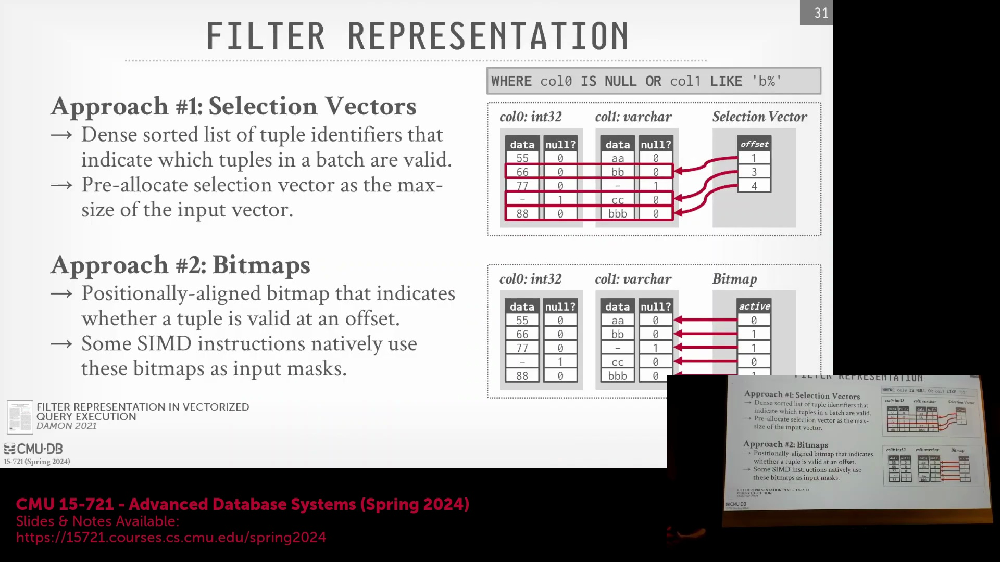

---

## 无分支执行与硬件对齐
在向量化查询执行(Vectorized Query Execution)中，强烈不建议在热路径(Hot Path)中实现复杂的条件逻辑或动态压缩(Dynamic Compaction)已过滤的元组。当谓词(Predicate)过滤掉批次中的大部分数据时（例如 1,024 个元组中仅有 1 个有效），将无效数据传递至下游(Downstream)看似效率低下。然而，显式跟踪空槽位、填补数据空隙或引入重度分支(Heavy Branching)会创建控制依赖(Control Dependency)，从而导致现代超标量 CPU(Superscalar CPU) 发生流水线停顿(Pipeline Stall)。严格遵循无分支执行(Branchless Execution)原则，即仅通过轻量级元数据(Lightweight Metadata)传递有效信息并直接跳过“垃圾”元组，实际消耗的 CPU 周期(CPU Cycles)反而更少。通过保持直接且线性的执行路径(Execution Path)，避免在循环内部插入条件判断，该设计与底层硬件的架构偏好高度契合，优先保障可预测的指令流(Instruction Flow)与绝对吞吐量(Absolute Throughput)，而非追求逻辑层面的紧凑性。
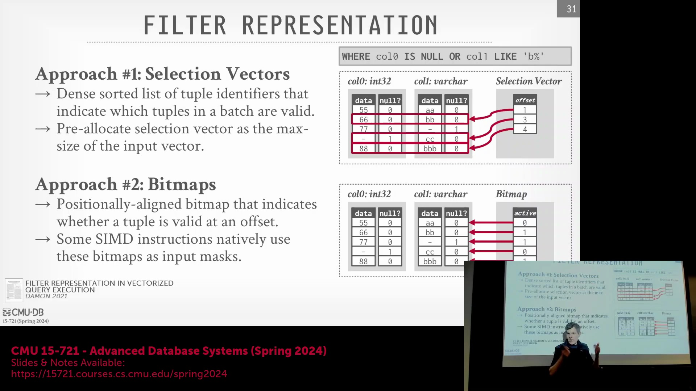

## 选择向量的大小与元数据管理
为了在不重构内存结构的前提下高效追踪有效元组，选择向量(Selection Vector)（亦称位置列表(Position List)）通常按最大向量大小(Vector Size)进行预分配(Pre-allocation)，默认容量一般为 1,024 个元素。该结构不依赖动态扩缩容(Dynamic Resizing)，而是通过简单的长度计数器(Length Counter)或结束偏移量(End Offset)来界定有效数据的边界。此外，为最大限度压缩内存占用，此类位置列表普遍采用 16 位整型(16-bit Integer)而非 64 位指针(64-bit Pointer)。由于偏移量仅需索引单个固定大小批次内的相对位置，16 位数值已完全满足需求。这种定长且紧凑的元数据结构确保了可预测的内存访问模式，使辅助数据具备缓存友好性(Cache-friendly)，并彻底规避了在执行期管理变长数组(Variable-length Array)的额外开销。

## 禁止运行时内存分配
尽管采用 Slab 分配(Slab Allocation)或动态大小缓冲区(Dynamic-sized Buffer)看似能将中间结果紧密打包并驻留于 L1 缓存(L1 Cache)中，但高性能数据库执行引擎严格禁止在查询执行循环内调用 `malloc` 或触发任何操作系统级(Operating System-level)内存管理例程(Memory Management Routine)。系统调用(System Call)会引入不可预测的延迟(Unpredictable Latency)，破坏指令流水线(Instruction Pipeline)，并严重拖累系统吞吐量。相反，所有数据缓冲区、向量及元数据结构均在查询执行前完成预分配(Pre-allocation)。尽管该策略可能导致少量内存冗余，但其整体权衡(Trade-off)极为有利：它彻底消除了运行时分配开销，确保 CPU 维持紧密且无中断的执行循环(Tight Execution Loop)。这深刻体现了一项核心工程原则——架构简洁性(Simplicity)与硬件对齐(Hardware Alignment)的优先级，始终高于精巧却复杂的动态内存管理(Dynamic Memory Management)策略。

## 课程总结与并行执行预览
本模块圆满结束了对查询执行模型(Query Execution Model)的基础探讨，重点梳理了数据库架构从传统迭代拉取式(Iterator Pull-based)系统向向量化(Vectorized)与推送式(Push-based)设计的演进历程。核心结论明确指出：现代数据库引擎(Database Engine)优先采用无分支(Branchless)、预分配(Pre-allocated)且具备硬件感知(Hardware-aware)特性的执行路径，旨在最大化 CPU 执行效率，并最小化指令流水线停顿(Instruction Pipeline Stall)。在奠定上述单线程执行(Single-threaded Execution)基础后，后续章节将深入探讨并行执行策略(Parallel Execution Strategy)，剖析如何将查询工作负载(Query Workload)高效调度至多核 CPU(Multi-core CPU)，从而实现线性可扩展性(Linear Scalability)并进一步加速分析型数据处理(Analytical Processing)。

