## 查询处理模型简介与回顾
我们的高等数据库系统课程能否像在有现场观众的演播室中录制那样进行呢？今天，我们将承接上节课的内容，探讨查询的实际执行方式。在上一讲中，我们重点探讨了查询处理模型(Query Processing Model)，即如何确定查询计划(Query Plan)中各个算子(Operator)之间传递数据的形态与体量。我们还研究了用于触发算子执行的控制机制，重点区分了推式(Push-based)与拉式(Pull-based)模型。
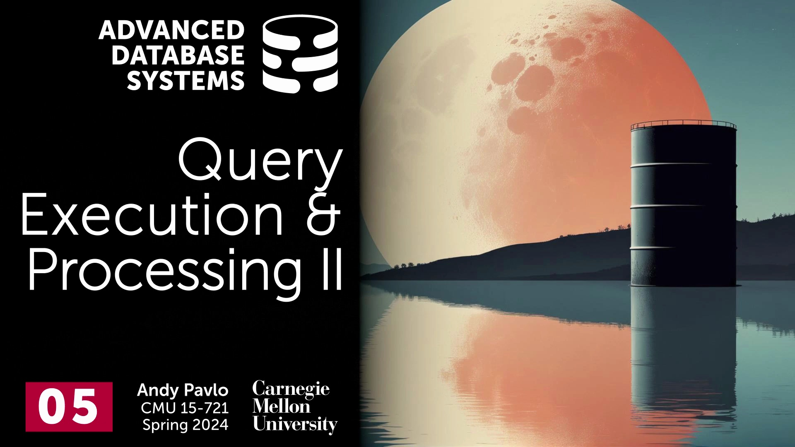

尽管 BusTub 采用拉式(Pull-based)架构，但本课程主要聚焦于推式(Push-based)系统。我们还讲解了如何表示谓词(Predicate)和过滤器(Filter)的输出，例如使用选择向量(Selection Vector)、位置列表(Position List)或位图(Bitmap)来指示哪些元组(Tuple)满足特定条件。
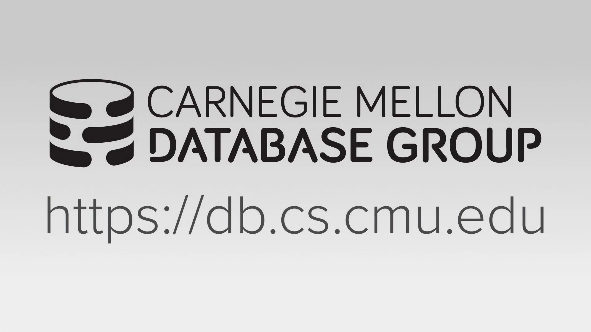

## 数据表示与推式系统架构
在本学期的后续内容中，我们将假设所讨论的概念系统采用向量化(Vectorized)与推式(Push-based)架构。如今，向量化已成为几乎所有现代数据库系统的标准配置。尽管许多系统仍依赖拉式(Pull-based)执行，但推式模型具有显著优势：集中式调度器(Centralized Scheduler)能够完全掌控任务的执行时机。这种集中式方法实现了细粒度(Fine-grained)管理，例如在内存受限时，只需停止任务调度即可暂停执行。同样，若某个算子需要发起阻塞式网络调用(Blocking Network Call)，调度器可暂时挂起该任务，待资源可用时再恢复执行，从而提供比拉式方案更强的控制力。
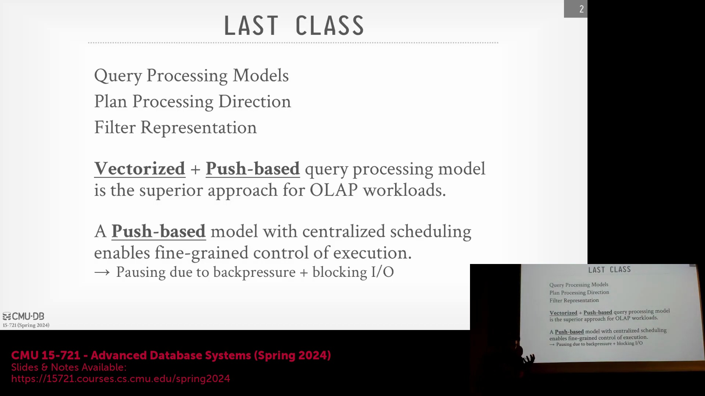

## 课程路线图与后续主题
今天的课程将继续探讨查询的并行执行(Parallel Execution)，探索不同类型的并行机制以及允许多个算子实例(Operator Instance)并发运行的系统架构。从下周开始，我们将深入探讨查询计划(Query Plan)中单个算子的并行化，研究算子的输出格式，并讨论诸如延迟物化(Late Materialization)等数据访问策略。我们将讲解算子之间的数据流动方式，并以 Apache Arrow 作为系统的标准数据格式。此外，我们还将预览表达式求值(Expression Evaluation)与自适应查询执行(Adaptive Query Execution)，重点介绍基于 Veloc 论文的谓词求值自适应性。在本学期后半段，我们将探讨查询优化(Query Optimization)以及查询自适应性的复杂性，这类特性必须从零开始进行架构设计，而非事后修补。

## 现代硬件下并行执行的动机
并行执行(Parallel Execution)的核心思想非常直观：我们希望数据库系统能够通过同时运行多个操作来充分利用可用硬件。现代系统早已不再依赖传统的单核机器。即便是单路 CPU(Single-socket CPU)如今也拥有数十个核心，而多路配置(Multi-socket Configuration)在功能上已等效于分布式系统(Distributed System)。在这种环境下，我们必须设计能够将单个查询分发至多台机器以并行化各项操作的系统。无论系统采用多线程、多进程还是多节点架构，高层级的并行概念始终保持一致。尽管网络通信会引入延迟，但现代机架内网络(Intra-rack Network)已高度优化，且并行抽象在不同部署规模下保持一致。

## 查询间并行与调度策略
从高层级来看，并行主要分为两种类型：查询间并行(Inter-query Parallelism)与查询内并行(Intra-query Parallelism)。查询间并行侧重于在系统内并发执行多个查询，由协调器(Coordinator)或调度器(Scheduler)决定执行时机与资源分配。许多现有系统采用基础的先来先服务策略(First-Come, First-Served, FCFS)，根据查询到达时间和资源需求分配优先级，后续查询则排队等待可用资源。企业级系统通常会实施更复杂的调度策略，例如为特定用户或连接标识(Connection String)设置优先级。无论采用何种策略，其核心目标都是保持所有系统资源处于活跃状态。例如，若某个查询需要执行单节点交换操作(Single-node Exchange Operation)，调度器可将其他空闲核心分配给不同任务。我们将在本学期后期更详细地探讨调度算法(Scheduling Algorithm)与数据分发策略(Data Distribution Strategy)。

## 查询内并行与声明式 SQL 的优势
查询内并行(Intra-query Parallelism)涉及将单个查询分发至多个工作节点(Worker Node)与计算资源。这充分凸显了 SQL 等声明式语言(Declarative Language)的优势：用户无需了解底层架构，无论查询实际跨越单个节点还是上百个节点。相同的 SQL 查询可被系统自动编译为不同的查询计划片段(Query Plan Fragment)并进行分发，无需用户手动重写或针对本地环境进行调试。查询内并行主要有两种实现方式：水平并行(Horizontal Parallelism)与垂直/异步 I/O 并行(Vertical/Asynchronous I/O Parallelism)。尽管两者可结合使用，但在现代执行引擎(Execution Engine)中，水平并行更为普遍。

## 水平（算子内）并行
水平并行(Horizontal Parallelism)，亦称算子内并行(Intra-operator Parallelism)，其核心是将查询计划中的单个算子拆分为多个独立实例。每个实例对各自的输入执行完全相同的计算逻辑，但处理的是数据的不同分区(Data Partition)。根据具体实现，算子可能显式感知自身的并行状态，也可能对此无感知。当算子对并行无感知时，系统通常会在执行计划中引入交换算子(Exchange Operator)，以收集并合并各并行任务的结果。每个标准算子均配有对应的并行化版本，交换机制确保了结果的无缝整合，使下游算子(Downstream Operator)无需额外管理分布式执行状态。

---

## 并行数据扫描与独立执行
当对分区数据(Partitioned Data)执行查询（例如扫描多个 Parquet 文件）时，系统会将每个数据分区(Partition)分配给一个独立的算子实例(Operator Instance)。这些实例在并发执行期间无需协调中间结果(Intermediate Result)。然而，在后续阶段，系统必须合并这些结果，以便传递给下游算子(Downstream Operator)或作为最终的应用输出。这种协调工作由交换算子(Exchange Operator)处理，这一基础概念可追溯至 20 世纪 90 年代，至今仍是现代分布式与并行数据库架构的核心。
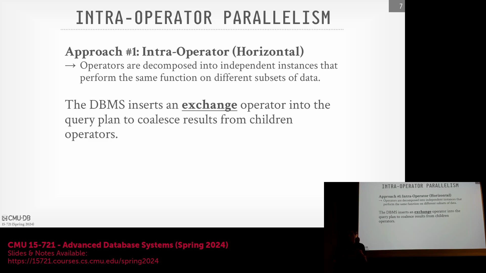

## 流水线构建与哈希连接构建阶段
将逻辑查询计划(Logical Query Plan)转换为物理计划(Physical Plan)时，需要将数据分配至可用的工作节点(Worker Node)。例如，扫描表 A 的三个分区会生成三个并行的算子实例。扫描完成后，各流水线(Pipeline)会独立且立即地应用过滤(Filter)与投影(Projection)操作。随后，结果被送入哈希连接(Hash Join)的构建侧(Build Side)。在此阶段，交换算子充当流水线断点(Pipeline Breaker)，确保所有并行实例完成工作后，系统才进入下一阶段。根据具体实现，执行引擎可能构建一个共享哈希表(Shared Hash Table)，或多个局部哈希表(Local Hash Table)。采用“先独立构建局部表，再合并”的策略往往更高效，因为它避免了向共享结构并发写入时产生的复杂闩锁(Latch)开销。

## 探测、聚合与交换机制
在查询计划的探测侧(Probe Side)，多个工作节点独立扫描表 B 的分区，应用过滤器，并对已构建的哈希表执行探测(Probe)操作。由于这些工作节点会产生并行的输出流(Output Stream)，系统需要引入第二个交换算子来合并结果，再将最终输出交付给用户。交换算子本身既可以仅作为等待所有输入就绪的同步屏障(Synchronization Barrier)，也可以主动将多个数据缓冲区(Data Buffer)合并为统一的输出流。具体实现取决于输出缓冲区如何在线程间暂存，以及是否涉及物理数据移动(Physical Data Movement)。
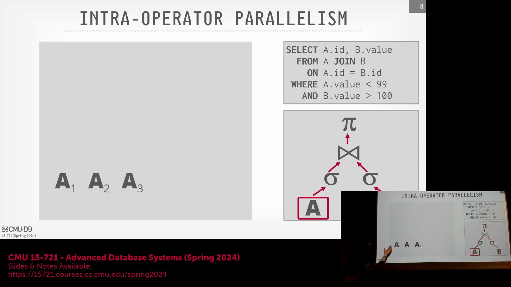
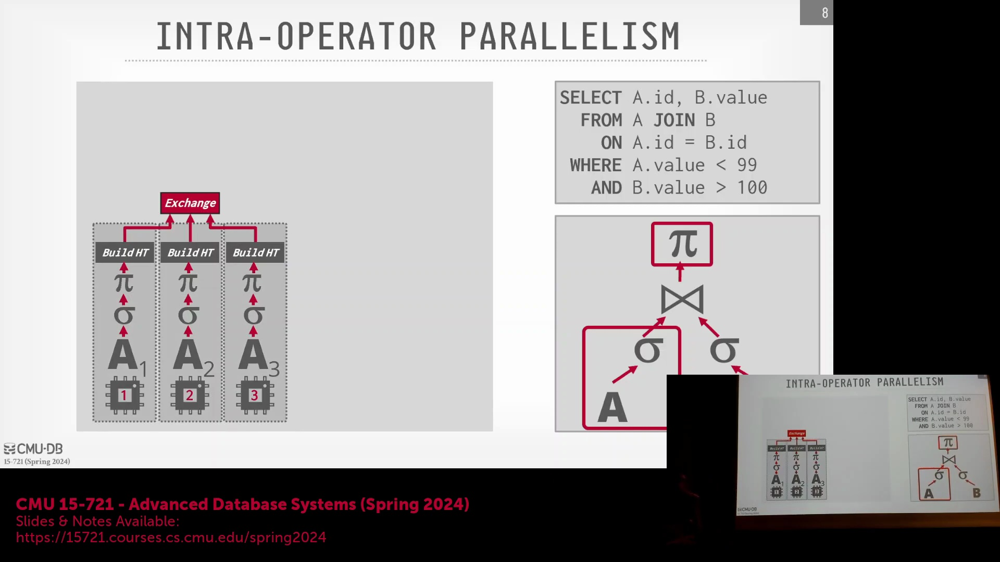

## 交换算子的线程调度与屏障逻辑
交换算子如何在线程或 CPU 核心上调度是一个常见问题。交换算子通常作为专用实例(Dedicated Instance)运行，负责追踪来自多个流水线的输入。在某些情况下，它不执行繁重的计算，仅作为屏障(Barrier)发出信号，通知下游阶段可以开始执行。在其他场景中，它会主动合并结果：既可以通过物理移动数据缓冲区来生成最终输出，也可以通过策略性地暂存缓冲区，允许多个线程并发写入。具体采用哪种方式，取决于系统的内存管理(Memory Management)机制与并发模型(Concurrency Model)。
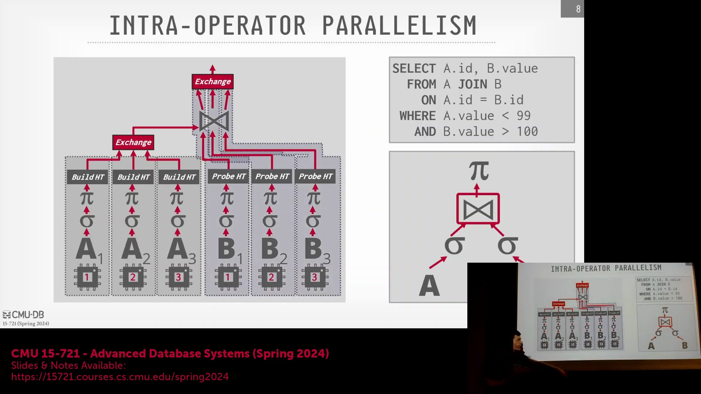

## 交换算子分类：收集模式
最常见的交换模式是收集算子(Gather Operator)，它将多个工作节点的结果整合为单一的输出流(Output Stream)。该术语在 2006 年 SQL Server 的一篇技术文献发表后被广泛采用，为理解数据移动(Data Movement)提供了清晰的框架。收集算子仅负责聚合并将并行输出转发至查询计划的下一阶段。作为合并分区结果的默认机制，它不会改变底层的数据分发逻辑(Data Distribution Logic)。
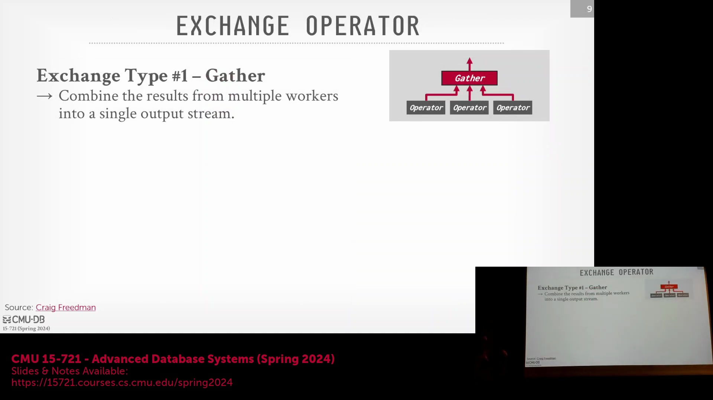

## 分发与重分区交换策略
除了收集模式外，交换算子还支持更高级的数据路由模式(Data Routing Pattern)。分发交换(Distribute Exchange)接收单一输入流(Input Stream)，并将其扇出(Fan Out)至多个下游工作节点。当需要在查询有向无环图(Directed Acyclic Graph, DAG)的不同分支间重用中间结果时（例如计算出的子查询被多次引用），该模式尤为实用。重分区交换(Repartition Exchange，通常称为混洗 Shuffle)接收多个输入，并将其重新分发至多个输出通道(Output Channel)。这使得系统能够在流水线阶段之间动态调整执行工作节点的数量。当查询优化器(Query Optimizer)估算不准确或数据规模发生意外波动时，这种动态调整能力至关重要。
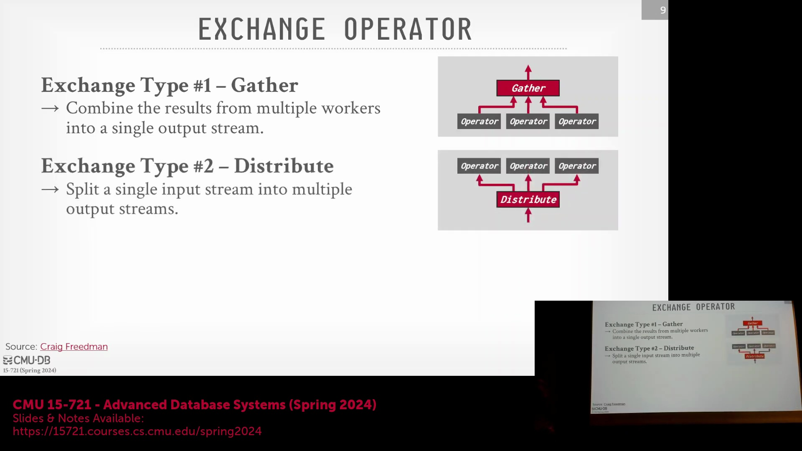

## 执行语义与自适应扩缩容
交换算子的设计引发了关于数据语义(Data Semantics)与计算开销(Computational Overhead)的重要考量。尽管收集或重分区操作在逻辑上通常维持元组(Tuple)数量的一对一映射，但当数据需路由至多个下游算子时，系统在物理层面可能会进行数据复制。这种复制虽不影响逻辑正确性(Logical Correctness)，但会改变物理资源(Physical Resource)的消耗。此外，交换算子天然充当数据暂存点(Staging Point)，能够对数据进行缓冲(Buffering)，从而使执行引擎能够自适应地管理内存、并发性以及工作节点的扩缩容(Worker Scaling)。这种灵活性确保了查询计划在不同工作负载(Workload)、硬件配置及执行估算(Execution Estimation)下均能保持稳健(Robust)。

---

## 数据倾斜、哈希与混洗术语
在跨工作节点(Worker Node)分发数据时，系统必须谨慎管理数据倾斜(Data Skew)，以避免单个节点成为性能瓶颈。重分区算子(Repartition Operator)通常通过对连接键进行哈希(Hash)处理来路由元组(Tuple)，但如果数据分布高度倾斜，则可能需要额外的哈希轮次或特殊处理逻辑。具体实现细节在不同平台间差异显著。例如，BigQuery 专门设立了一项独立服务来处理数据混洗(Shuffle)，并利用定制硬件(Custom Hardware)最大化处理速度，同时为未来的自适应执行(Adaptive Execution)铺平道路。尽管具体架构各异，但核心概念是通用的：微软历来称其为“重分区(Repartition)”，而 Google、Databricks 以及更广泛的 MapReduce 生态系统则称之为“混洗(Shuffle)”。该机制泛化了更基础的数据路由模式(Data Routing Pattern)，允许系统根据实际数据量而非静态的查询优化器估算(Query Optimizer Estimation)，在流水线阶段(Pipeline Stage)之间动态调整工作节点的数量。
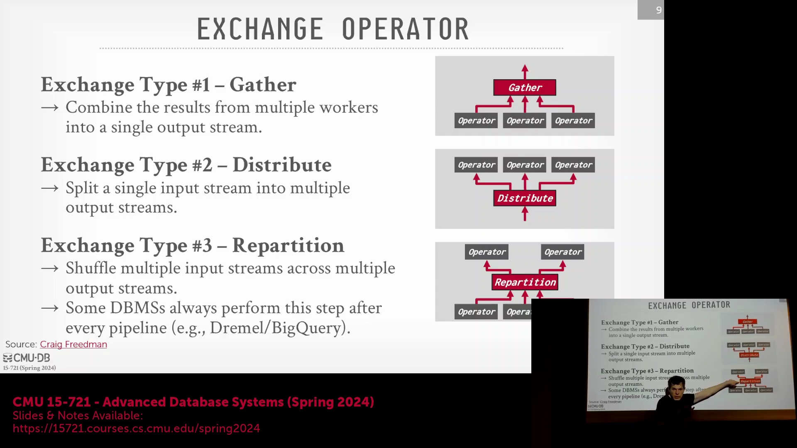

## 算子间并行与流水线并行
除了并行化单个算子(Operator)外，数据库系统还可以在单个查询计划(Query Plan)内并发执行多个流水线(Pipeline)，这种技术被称为算子间并行(Inter-operator Parallelism)或流水线并行(Pipeline Parallelism)。这种异步方法允许上游算子(Upstream Operator)持续产生数据流(Data Stream)，供下游算子(Downstream Operator)实时消费，从而无需等待整个阶段完成即可持续推进执行。

例如，在笛卡尔积(Cartesian Product)场景中，多个表扫描(Table Scan)可以并发运行，生成的元组(Tuple)一旦产出便会立即传递给连接算子(Join Operator)。这种生产者-消费者模型(Producer-Consumer Model)有效减少了线程空闲时间(Idle Time)并提升了执行速度，尤其是在数据依赖性(Data Dependency)较低的场景下。
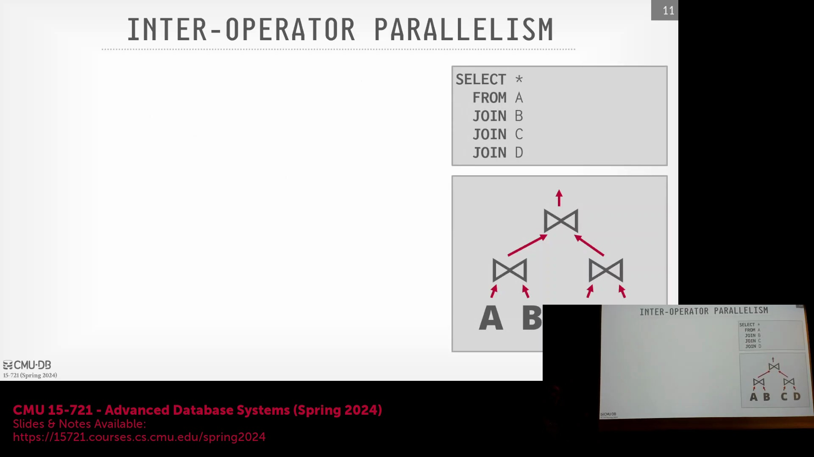

尽管该模式并非适用于所有查询结构(Query Structure)，但流水线并行在 Apache Kafka、Spark Streaming 和 RisingWave 等流处理平台(Stream Processing Platform)中被广泛采用，以维持连续、低延迟的数据处理流程。该模型依赖交换算子(Exchange Operator)无缝桥接独立的流水线段(Pipeline Segment)，确保数据在并发执行阶段之间高效流转。
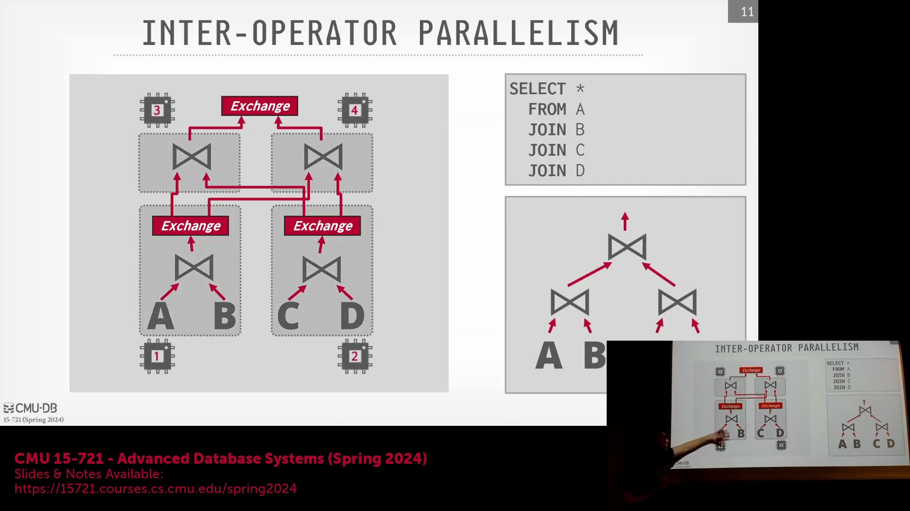

## OLAP 执行引擎的标准化与通用化
在现代数据库领域，OLAP 执行引擎(OLAP Execution Engine)已高度标准化。大多数系统均趋同于由 Snowflake 和 MonetDB 等早期先驱开创的向量化(Vectorized)、推式架构(Push-based Architecture)。开发者不再为每个新工作负载(Workload)或运行环境从头构建复杂的执行引擎，而是越来越多地依赖可组合的、开箱即用的执行库(Execution Library)。这些库提供了标准化且高度优化的算子实现(Operator Implementation)，使工程团队能够专注于领域特定功能(Domain-specific Features)，而无需重新发明基础的查询处理逻辑(Query Processing Logic)。这一转变有效解决了一个常见的行业痛点：内部代码碎片化与重复开发。例如，大型组织过去常常维护数十种实现细节各异的 `substring` 等基础函数，导致语义不一致(Semantic Inconsistency)、空值处理行为(Null Value Handling Behavior)各异，以及跨系统数据交换困难。

## Velox：架构与设计哲学
由 Meta 开发的 Velox 正是向可复用执行库(Reusable Execution Library)转型的典型代表。其创建初衷旨在整合内部碎片化的数据处理工作流，并将底层优化(Optimization)工作收敛至一个经过高度调优的代码库(Codebase)中。严格意义上，Velox 是一个后端执行引擎(Backend Execution Engine)；它刻意剥离了 SQL 解析器(SQL Parser)、查询优化器(Query Optimizer)、元数据目录(Metadata Catalog)或查询前端(Query Frontend)等高级组件。相反，它完全专注于底层算子执行(Low-level Operator Execution)、内存与线程管理(Memory & Thread Management)以及数据连接器(Data Connector)。当集成至更大的系统架构时，Velox 负责接收物理查询计划(Physical Query Plan)并生成最终结果，其利用预编译原语(Pre-compiled Primitives)与 C++ 代码生成(C++ Code Generation)技术来加速表达式求值(Expression Evaluation)。通过提供标准化、向量化(Vectorized)且推式(Push-based)的处理层(Processing Layer)，Velox 使开发团队能够在不牺牲执行性能(Execution Performance)的前提下，快速构建定制化的数据库系统。

---

## Velox 架构与外部集成
Velox 采用针对 Int32 和浮点数等特定数据类型预编译的原语(Pre-compiled Primitives)，以确保优化的执行路径(Execution Path)。尽管它与 Apache Arrow 紧密集成以实现向量化数据兼容(Vectorized Data Compatibility)，但也融入了轻量级的自适应查询优化(Adaptive Query Optimization)技术，使引擎能够在扫描(Scan)过程中动态调整表达式求值(Expression Evaluation)，而无需对整个查询计划(Query Plan)进行全局重新优化。目前，Velox 支持排序合并连接(Sort-Merge Join)与哈希连接(Hash Join)，但刻意剥离了查询优化器(Query Optimizer)、网络层(Network Layer)或专有数据格式(Proprietary Data Format)等上层组件。相反，它定位于数据湖架构(Data Lake Architecture)中运行，依赖外部连接器(External Connector)从 Amazon S3 等对象存储(Object Storage)中检索数据。类似于 Presto 或 Trino，这些连接器充当标准化 API，支持跨异构物理数据库与文件系统的联合查询(Federated Query)。此外，Velox 采用适配器(Adapter)来解码与编码多种列式存储格式(Columnar Storage Format)，包括 Parquet、ORC，以及 Meta 内部扩展的 ORC 变体（如 Dworf 和 Alpha）。
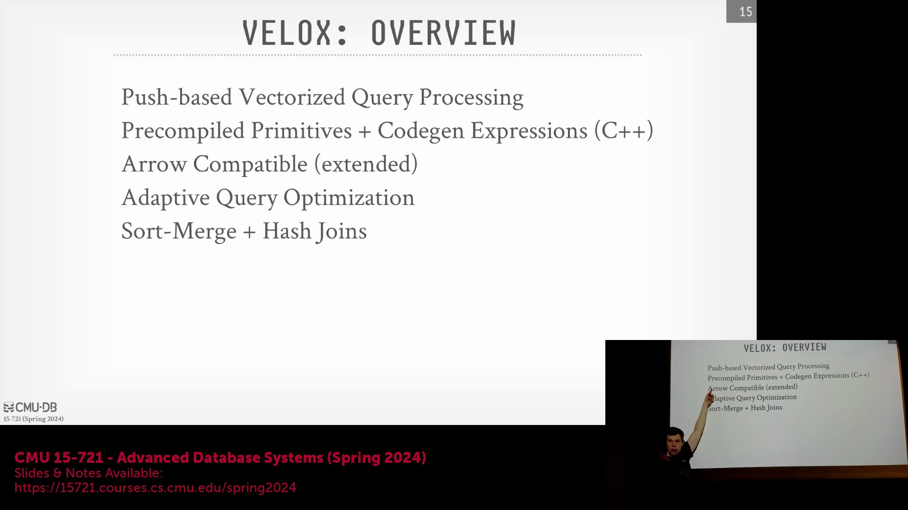

## 系统级内存管理
高性能执行引擎(High-Performance Execution Engine)需要对内存分配(Memory Allocation)进行精确控制，这也是 Velox 实现自定义内存池(Custom Memory Pool)而非依赖标准语言运行时(Language Runtime)或操作系统分配器(OS Allocator)的原因。频繁的 `malloc` 与 `free` 调用会引入显著的系统开销，即便是 Java 等托管语言(Managed Language)也难以避免不可预测的垃圾回收停顿(Garbage Collection Pause)。通过采用 Arena 风格的内存池(Arena-style Memory Pool)，引擎会预先分配大块连续内存(Contiguous Memory)并在内部进行统一管理。该机制独立于特定编程语言的底层内存模型(Memory Model)，使数据库能够完全掌控缓冲区(Buffer)的生命周期，有效减少内存碎片(Memory Fragmentation)，并确保基于 C++ 或 Rust 的实现均能获得确定性性能(Deterministic Performance)。
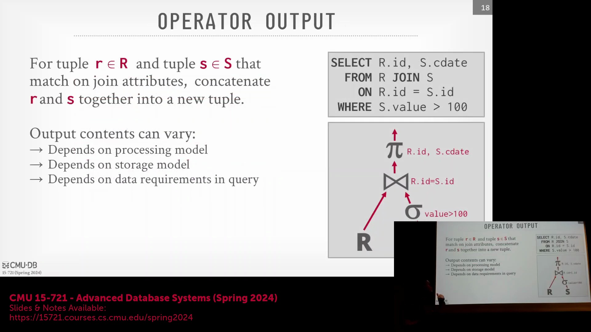

## 算子输出与元组物化策略
查询执行(Query Execution)中的一个关键设计决策是确定数据如何在算子(Operator)之间打包与传递。所选策略在很大程度上取决于底层的处理模型(Processing Model)与存储布局(Storage Layout)。在向量化列式系统(Vectorized Columnar System)中，引擎必须精确决定何时将离散的列数据组合并物化(Materialization)为完整的元组(Tuple)。这一时机选择直接影响内存带宽利用率(Memory Bandwidth Utilization)与 CPU 缓存效率(CPU Cache Efficiency)，因为在流水线(Pipeline)中传输冗余数据会引发严重的性能瓶颈。解决该问题的两种主流策略分别为早期物化(Early Materialization)与延迟物化(Late Materialization)。
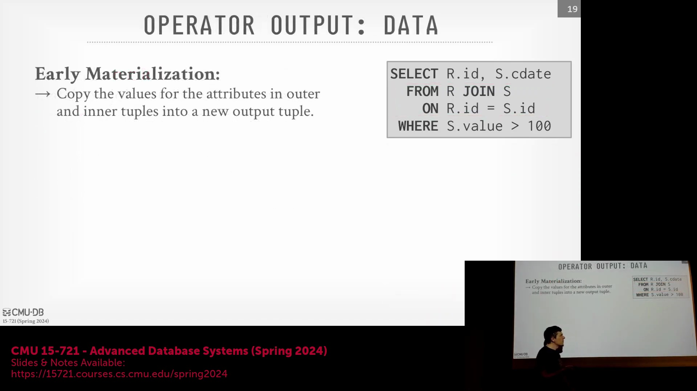

## 早期物化机制
早期物化(Early Materialization)在查询计划的叶子节点(Leaf Node)层（通常处于初始表扫描(Table Scan)阶段）即组装完整的元组(Tuple)。数据一旦读取，所有所需列便会立即拼接，并将完整的行记录向上游传递至后续算子(Operator)。该方法逻辑简单直接，且与面向行的存储(Row-oriented Storage)或 PAX 布局(PAX Layout)天然契合，因为在此类布局中，相关数据在物理磁盘上已紧密聚集。其核心优势在于，下游算子(Downstream Operator)（如过滤器(Filter)或连接算子(Join Operator)）接收到的已是完全物化的行，无需再次发起额外数据请求。然而，针对宽表(Wide Table)或仅访问少量列的查询，该方法会因重建与传输非必要属性而浪费宝贵的内存带宽(Memory Bandwidth)与 CPU 周期(CPU Cycles)。
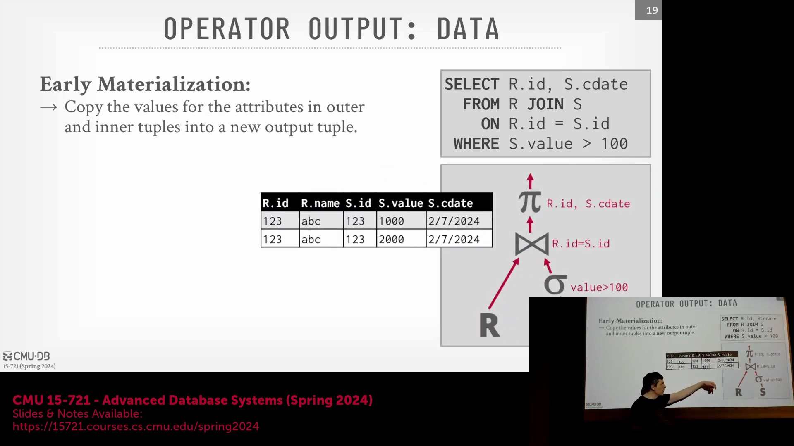

## 列式引擎中的延迟物化
诸如 Velox 等现代 OLAP 系统(Online Analytical Processing System)高度青睐延迟物化(Late Materialization)，旨在最大化列式存储(Columnar Storage)环境下的执行效率(Execution Efficiency)。在此模式下，算子(Operator)不会预先组装完整元组，而是仅传递当前计算所必需的最小属性集，例如连接键(Join Key)或元组 ID(Tuple ID)。这一设计显著减少了数据在执行流水线(Execution Pipeline)中的物理移动量。当后续算子最终需要访问额外列时，系统会利用先前传递的标识符(Identifier)，按需从原始列向量(Column Vector)或底层存储文件中提取所需数据。
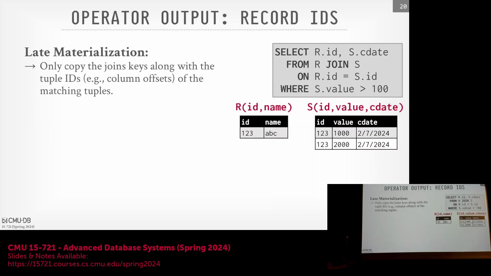

## 权衡与执行灵活性
延迟物化模型(Late Materialization Model)在前期数据移动成本与延迟获取开销之间引入了典型的权衡(Trade-off)。例如，在仅依赖连接键完成连接操作(Join Operation)后，后续的投影操作(Projection)可能仍需生成日期等额外列。此时，执行引擎(Execution Engine)可动态检索这些缺失属性，并将其拼接至最终结果集(Result Set)。尽管该机制要求系统在执行期间持续维护对底层基础数据的引用与获取能力，但在分析型工作负载(Analytical Workload)场景下，它通常优于早期物化，因为它确保了仅有实际被访问的列才会消耗内存带宽。最终的最优策略选择取决于表宽度(Table Width)、查询选择率(Query Selectivity)，以及延迟获取列的额外开销与在全局计划中传输宽行(Wide Row)成本之间的相对比值。

---

## 物化策略与系统设计权衡
早期物化(Early Materialization)与延迟物化(Late Materialization)之间的选择会显著影响查询性能(Query Performance)与内存带宽(Memory Bandwidth)的利用率。早期物化在底层表扫描(Table Scan)阶段即组装完整元组(Tuple)，并将构建完毕的行(Row)向上传递。虽然该方法逻辑简洁，且对窄表(Narrow Table)或行式存储(Row-oriented Storage)极为有效，但当查询仅访问少量列时，其执行效率会大幅下降。延迟物化则通过在算子(Operator)间仅传递最小必需属性（如连接键(Join Key)或元组标识符(Tuple ID)）来规避此问题，将完整元组的组装推迟至绝对必要时进行。尽管从理论上可行在两种策略间动态切换的混合方法(Hybrid Approach)，但这会引入繁重的状态维护(State Maintenance)与执行成本估算(Cost Estimation)复杂度。因此，大多数现代 OLAP 系统(Online Analytical Processing System)默认采用延迟物化，因其在工程实现上更为简洁，且已在分析型查询负载(Analytical Query Workload)中被验证具有更高效率。
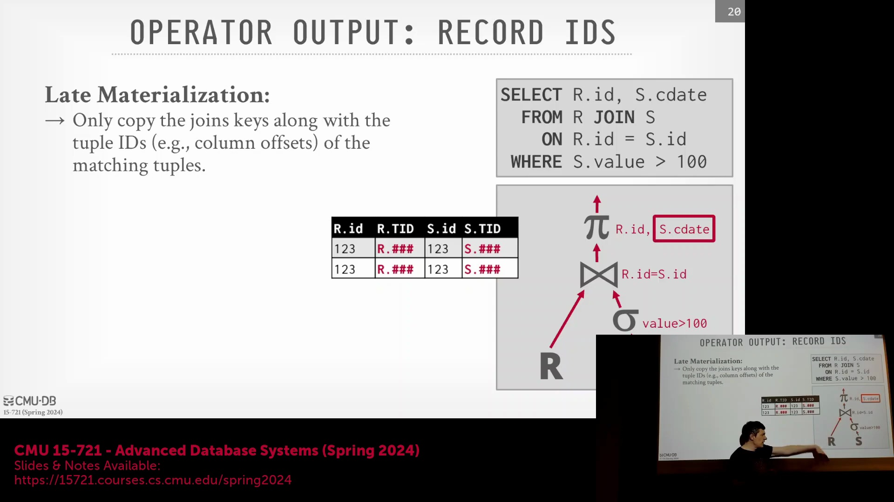

## 统一内存数据表示的必要性
现代数据湖仓架构(Data Lakehouse Architecture)必须摄取(Ingest)并处理以 Parquet、ORC 和 CSV 等多种磁盘存储格式(Disk Storage Format)保存的文件。为避免针对每种格式单独维护特定的查询算子(Query Operator)实现，执行引擎(Execution Engine)会将磁盘数据统一转换为标准化的内部内存表示(Internal Memory Representation)。该统一内存格式必须支持定长列布局(Fixed-length Column Layout)以实现可预测的内存访问模式，消除冗余的序列化与反序列化(Serialization & Deserialization)开销，并原生支持零拷贝内存传输(Zero-Copy Memory Transfer)。通过采用通用的内存模式(Memory Schema)，数据库能够高效地在算子间共享数据缓冲区(Data Buffer)，在集群节点(Cluster Node)间分发工作负载(Workload)时无需重新编码(Re-encoding)，甚至可直接将计算任务卸载(Compute Offloading)至 FPGA 或智能网卡(SmartNIC)等专用加速硬件(Specialized Acceleration Hardware)。

## Apache Arrow：面向 CPU 缓存与向量化的优化
Apache Arrow 是内存列式数据(In-Memory Columnar Data)的行业标准规范，其架构设计旨在最大化 CPU 缓存命中率(CPU Cache Hit Rate)并全面支持向量化执行(Vectorized Execution)。与优先考虑高压缩率（如差分编码(Delta Encoding)或游程编码(Run-Length Encoding, RLE)）的磁盘格式不同，Arrow 采用轻量级编码策略(Lightweight Encoding Strategy)，使算子(Operator)能够进行快速的随机访问(Random Access)，并直接通过内存偏移量(Memory Offset)读取数值，无需解码整个数据块(Data Block)。Arrow 生态系统(Arrow Ecosystem)远不止于数据序列化格式，它还提供了统一的内存池(Memory Pool)、线程管理(Thread Management)、远程过程调用(RPC)框架，以及名为 Gandiva 的内置表达式求值引擎(Expression Evaluation Engine)。Gandiva 能够将过滤(Filter)与投影(Projection)逻辑树直接编译为 LLVM 中间表示(LLVM IR)，从而绕过传统解释器(Interpreter)的性能开销，为常规操作提供接近原生(Native)的执行速度。

## 字典编码与变长字符串处理
为在查询性能与工程实现简易性(Implementation Simplicity)之间取得平衡，Arrow 主要采用字典编码(Dictionary Encoding)与轻量级的游程编码(Run-Length Encoding, RLE)变体，而非复杂的位图(Bitmap)或差分编码(Differential Encoding)方案。在字典编码机制下，列中的唯一值(Unique Value)（尤其是字符串类型）会被提取、去重排序，并集中存储于独立的字典数组(Dictionary Array)中。数据列本身仅保留紧凑的整数索引(Integer Index)或偏移量(Offset)，此举不仅显著降低了内存占用(Memory Footprint)，还大幅加速了等值比较操作(Equality Comparison)。针对变长字符串(Variable-Length String)的处理，Arrow 的底层设计在数据列中采用固定宽度（如 12 字节）的结构体来记录字符串长度与内存指针/偏移量，而实际的字符载荷(Character Payload)则存储于独立的连续内存缓冲区(Contiguous Memory Buffer)中。这种逻辑分离设计(Separation Design)使执行引擎能够维持定宽列语义(Fixed-Width Column Semantics)，从而支持高效的向量化遍历(Vectorized Traversal)，同时兼顾了处理动态长度数据类型(Dynamic-Length Data Type)所需的运行时灵活性。

---

## 优化 Arrow 中的变长字符串存储
Apache Arrow 的基础设计通过在主列向量(Main Column Vector)中存储 12 字节的定宽条目（包含长度字段(Length Field)与指针/偏移量(Pointer/Offset)）来处理变长字符串(Variable-Length String)，而实际的字符数据则存放在独立的连续 Blob 缓冲区(Blob Buffer)中。尽管该方案可行，但会迫使执行引擎(Execution Engine)在每次访问字符串时执行指针解引用(Pointer Dereferencing)。为解决此瓶颈，该规范借鉴了德国数据库研究（特别是 Umbra 项目）中更高效的内存布局(Memory Layout)进行了扩展。优化后的方案为每个列条目分配 16 字节：包含一个头部(Header)、一个长度字段、4 字节的字符串前缀(String Prefix)，以及一个 8 字节的指针或偏移量。若字符串长度可容纳于该空间内，则采用内联存储(Inline Storage)并以零填充(Zero-padding)。对于较长字符串，4 字节前缀保持内联，而指针则指向外部 Blob 区域中的完整字符串。关键在于，完整字符串数据仍保留在外部，以避免在查询执行(Query Execution)期间重组零散数据所带来的额外开销。
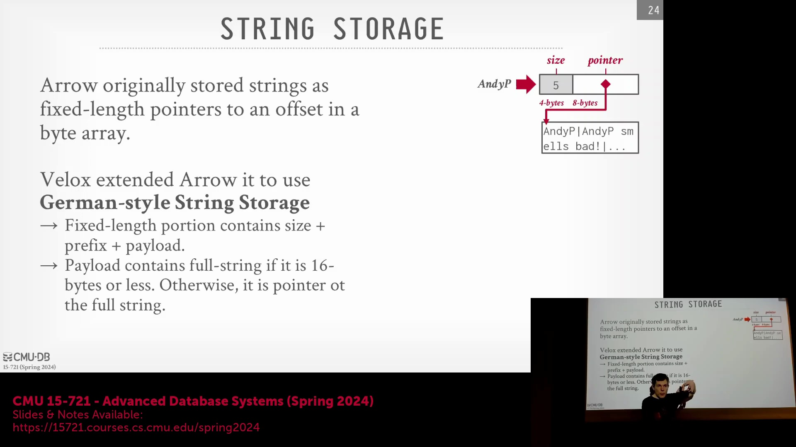

## 前缀内联存储的性能优势与应用
这种 16 字节布局的核心优势在于大幅降低了内存访问中的指针解引用(Pointer Dereferencing)频率。对于诸多常见操作（如基于字符串前缀的过滤(Filter)或模式匹配(Pattern Matching)），执行引擎可直接基于定宽的内联数据评估谓词(Predicate)，无需访问外部 Blob 区域。该设计与高性能数据库工程中“极致压榨每一可用比特(Exploit Every Available Bit)”的趋势高度一致；例如，将布隆过滤器(Bloom Filter)嵌入 64 位 x86 指针的高位闲置位(High Unused Bits)中，以快速剪枝(Prune)哈希表查找(Hash Table Lookup)。DuckDB、Velox 和 Polars 等现代系统均已广泛采用此项技术。在实际应用中，它实现了高效的两阶段过滤(Two-Stage Filtering)：引擎首先扫描紧凑的前缀列以筛选候选匹配项(Candidate Match)，随后仅针对命中元组(Tuple)按需获取完整字符串。此外，该设计极大简化了去重(Deduplication)逻辑，因为共享相同数据的字符串可由同一指针表示，从而使系统最大限度地减少了冗余的内存访问(Memory Access)与计算开销。
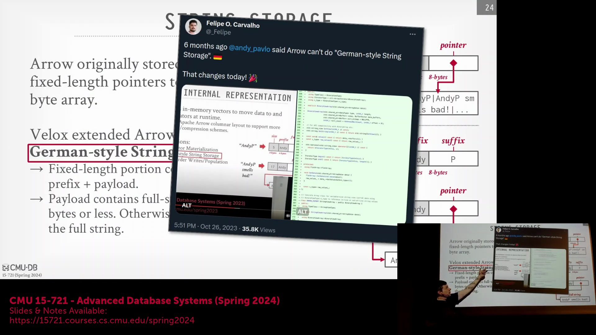
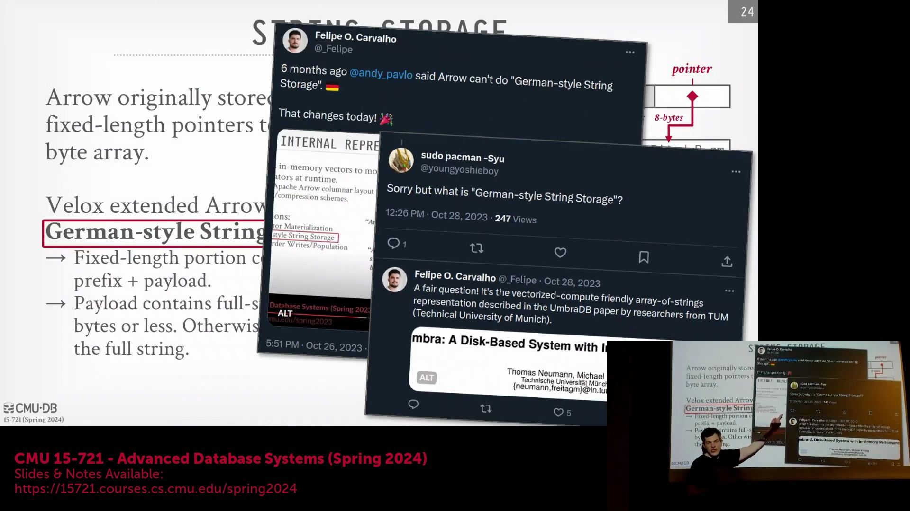

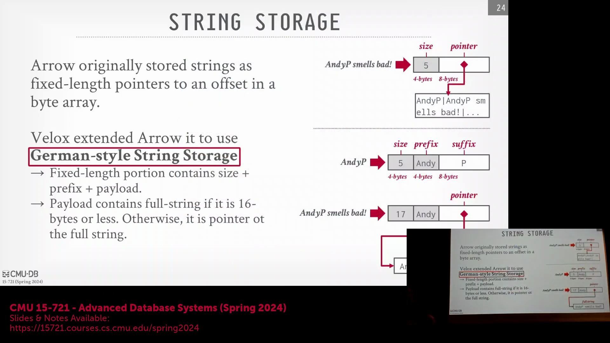

## 使用 Substrate 标准化查询计划
除统一数据表示(Data Representation)外，该生态系统正逐步迈向查询执行计划(Query Execution Plan)的标准化。Substrate 是一项开源规范(Open Specification)，旨在以通用且系统无关(System-Agnostic)的格式表示关系代数查询计划(Relational Algebra Query Plan)。其核心目标是将查询优化层(Query Optimization Layer)与底层执行引擎解耦(Decouple)，使得独立的优化器(Optimizer)能够生成可被任意兼容执行引擎解析的 Substrate 计划。尽管在理念上与 Apache Arrow 标准化数据传输的方式相似，但 Substrate 致力于对查询逻辑(Query Logic)实现同等的标准化。然而，其当前实现多局限于简单查询场景，且仅由小型团队维护。相较于拥有广泛产业支持的 Apache Arrow 联盟，Substrate 在生态扩展性(Ecosystem Scalability)方面面临显著挑战。尽管其在解耦数据库组件(Database Component)方面颇具潜力，但目前 Substrate 仍属小众工具(Niche Tool)，尚未成为通用的行业标准。

## DataFusion：全面的基于 Arrow 的执行引擎
DataFusion 已成为基于 Apache Arrow 构建的执行引擎(Execution Engine)的领先实现。与严格聚焦于底层算子执行(Low-Level Operator Execution)的 Velox 不同，DataFusion 提供了更为完整的软件栈(Software Stack)，涵盖 SQL 解析前端(SQL Frontend)、查询优化器(Query Optimizer)及向量化执行运行时(Vectorized Execution Runtime)。这使得它对于那些希望快速构建新型数据库系统且不愿重复开发基础组件的开发者极具吸引力。目前，它已被众多现代平台采纳为核心执行引擎，其中最典型的案例是 InfluxDB 3.0，该平台近期完成了重大架构重构(Architectural Refactoring)以全面拥抱 SQL 与 Arrow 生态。其他如 CnosDB 以及 pg_analytics（PostgreSQL 的 DataFusion 扩展插件）等系统也深度集成了该引擎。随着在业界的广泛落地（包括 Snowflake 提供的原生支持），Arrow 与 DataFusion 技术栈实质上已确立为现代分析数据处理(Analytical Data Processing)的事实标准(De Facto Standard)。
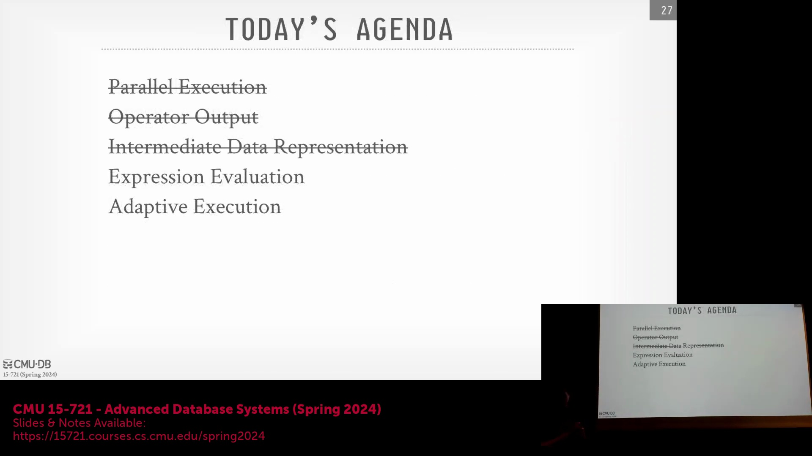

## 表达式求值简介
查询执行(Query Execution)的核心环节之一涉及表达式求值(Expression Evaluation)，它决定了在表扫描(Table Scan)或聚合(Aggregation)操作期间，如何将谓词(Predicate)、过滤条件(Filter Condition)及连接条件(Join Condition)应用于底层数据。现代执行引擎摒弃了在运行时动态解释(Run-time Interpretation)每条条件的传统模式，转而将表达式树(Expression Tree)编译为高度优化的向量化代码(Vectorized Code)。该编译过程确保布尔校验(Boolean Check)、算术运算(Arithmetic Operation)与函数调用(Function Call)能够批量应用于整个数据批次(Data Batch)，从而充分释放 CPU 的 SIMD 指令集(SIMD Instruction Set)性能，并契合缓存友好型内存布局(Cache-Friendly Memory Layout)。深入理解表达式求值机制，是构建深度向量化执行引擎的基石，这也将在后续关于查询处理流水线(Query Processing Pipeline)的探讨中作为核心议题展开。
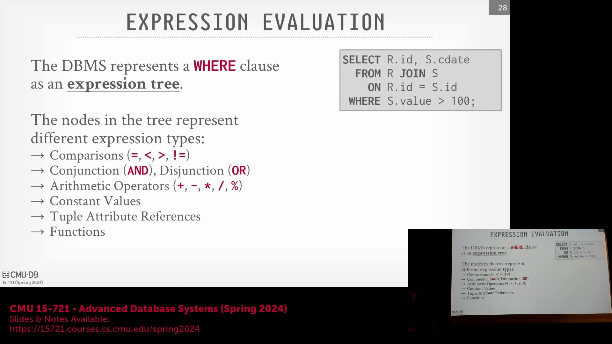

---

## 表达式树与朴素求值的代价
SQL 谓词(SQL Predicate)会被解析并转换为表达式树(Expression Tree)，其中每个节点代表一个操作符(Operator)（如 AND、OR 或比较运算符）或操作数(Operand)（常量、列引用或函数调用）。尽管该结构在概念上直观易懂，但采用朴素方法(Naive Approach)——即为每个元组(Tuple)递归遍历执行树——是极其低效的。传统的解释型执行(Interpreted Execution)严重依赖指针跳跃(Pointer Chasing)和虚函数表查找(Virtual Function Table Lookup)来动态决定下一步操作。这种间接控制流(Indirect Control Flow)会引发频繁的 CPU 缓存未命中(CPU Cache Miss)与分支预测失败(Branch Misprediction)，在处理数十亿级元组扫描时，将构成严重的性能瓶颈(Performance Bottleneck)。

## 即时编译与表达式扁平化
为消除解释执行的开销，现代系统将表达式树转换为可直接编译为原生机器码(Native Machine Code)的函数调用。诸如 Apache Arrow 的 Gandiva 等框架利用 LLVM 在运行时执行即时编译(JIT Compilation)，将历经数十年发展的编译器优化技术(Compiler Optimization Technique)直接赋能于查询执行(Query Execution)。作为替代方案，Velox 等引擎通过将表达式树扁平化(Flattening)为连续且顺序的操作数组(Operation Array)，从而规避了繁重的 JIT 编译开销。类似于 B+ 树(B+ Tree)通过连续存储节点以提升空间局部性(Spatial Locality)，这种扁平化布局使引擎能够以线性方式遍历操作指令，彻底摒弃了递归式的指针跳跃，进而显著提升了 CPU 缓存效率(Cache Efficiency)与指令流水线(Instruction Pipeline)的执行性能。
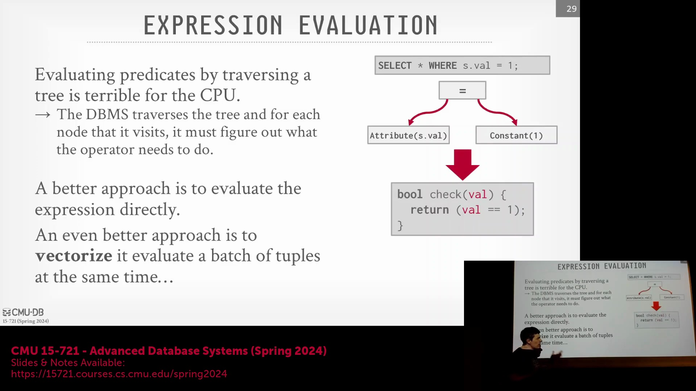
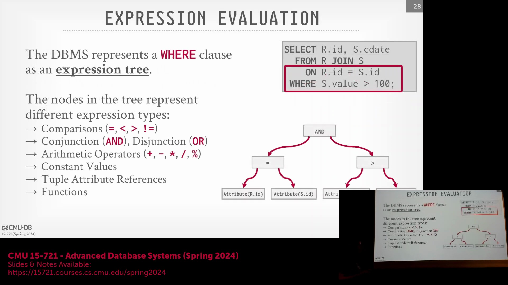

## 向量化与预编译原语
现代分析型数据库引擎(Analytical Database Engine)摒弃了针对单个元组(Tuple)的逐行求值模式，转而采用向量化执行(Vectorized Execution)技术批量处理整个数据批次(Data Batch)。系统通过引入预编译且针对特定数据类型优化的原语(Pre-compiled Primitives)（例如分别为 `int32` 或 `float64` 比较操作提供专属优化例程），彻底取代了通用的运行时求值，从而消除了动态类型检查(Dynamic Type Checking)的开销。当这些优化例程应用于包含数千个元素的列向量(Column Vector)时，函数调用成本被大规模分摊(Cost Amortization)，使得初始调用的开销几近于零。尽管将完整查询计划(Query Plan)编译为机器码有时会引发超过查询本身运行时间的编译延迟(Compilation Latency)，但仅针对表达式层(Expression Layer)实施编译或扁平化处理，则能在控制额外开销的前提下，带来持续且显著的性能收益。

## 高级优化与编译器集成
除结构扁平化之外，执行引擎还深度集成了诸如常量折叠(Constant Folding)等经典编译器优化技术(Compiler Optimization)。当表达式对静态常量(Static Constant)执行重复运算时，引擎仅需在规划阶段计算一次并缓存结果，从而彻底避免在数百万级元组上进行冗余求值(Redundant Evaluation)。此类编译器技术的引入，逐渐模糊了传统查询优化器(Query Optimizer)与代码生成器(Code Generator)之间的界限，引发了关于优化职责边界(Optimization Responsibility Boundary)的架构探讨。尽管部分系统仍选择保持各模块松散耦合，但诸如 LingoDB 等新兴研究平台已充分证明：将编译器阶段(Compiler Phase)深度嵌入数据库内核，能够实现针对关系型数据处理量身定制的、极具侵略性的上下文感知优化(Context-Aware Optimization)，从而释放极致性能。

---

## 编译策略：MLIR、LLVM 与代码生成
现代数据库研究正越来越多地利用先进的编译器基础设施(Compiler Infrastructure)来优化查询执行(Query Execution)。诸如 LingoDB 等系统会先将查询计划(Query Plan)转换为 MLIR（多级中间表示(Multi-Level Intermediate Representation)，一种专为编译器开发设计的框架），随后将其移交至 Clang 或 LLVM 等后端编译器进行最终优化(Optimization)。此方法与早期在运行时(Runtime)直接生成并编译高级 C++ 代码的技术形成鲜明对比。尽管生成原始 C++ 源码并交由系统编译器编译的过程，通常比直接生成 LLVM IR(LLVM Intermediate Representation)更为耗时，但它具备显著的调试(Debugging)优势：开发人员可直接审查生成的源代码以诊断程序崩溃(Crash)或定位性能瓶颈(Performance Bottleneck)。这两种技术路径均凸显了数据库执行引擎(Execution Engine)与现代编译器优化流水线(Compiler Optimization Pipeline)之间日益深度的融合趋势。

## 表达式优化：常量折叠与子树消除
在查询执行启动前，执行引擎会对表达式树(Expression Tree)应用经典的编译器优化技术(Compiler Optimization)，以削减运行时开销(Runtime Overhead)。常量折叠(Constant Folding)会在查询规划阶段(Query Planning Phase)对仅包含静态常量(Static Constant)的表达式（例如 `UPPER('Wang')`）进行单次求值(Evaluation)，并用预计算结果(Pre-computed Result)直接替换整个表达式子树，从而彻底避免在海量元组(Tuple)上进行重复计算。类似地，公共子表达式消除(Common Subexpression Elimination)会识别重复的表达式分支(Branch)，仅执行一次计算，并将后续算子重定向至缓存结果(Cached Result)。然而，此类优化的实现引发了关于组件职责边界(Responsibility Boundary)的架构探讨：这些优化究竟应由执行引擎负责，还是应交由独立的查询优化器(Query Optimizer)处理？在 MySQL 等紧耦合架构(Tightly Coupled Architecture)中，优化器可在规划期执行子查询(Subquery)以解析常量；而在解耦系统(Decoupled System)中，则往往需要跨组件复制函数实现，或依赖专用 API 共享求值结果。

## 自适应查询处理的挑战
传统查询优化器(Traditional Query Optimizer)高度依赖成本模型(Cost Model)与历史统计信息(Historical Statistics)来生成物理查询计划(Physical Query Plan)，但这些估算在数据规模庞大或分布复杂时往往失准，现代数据湖(Data Lake)环境尤甚。当文件未经统计信息收集即直接上传至 Amazon S3 等对象存储(Object Storage)时，优化器缺乏精准预测算子选择率(Operator Selectivity)与数据分布(Data Distribution)的关键元数据。此外，外部连接器(External Connector)通常无法透传联合数据库(Federated Database)内部的细粒度统计信息。一旦优化器选定了次优的连接顺序(Join Order)或投影策略(Projection Strategy)，即便底层采用高度优化的向量化执行(Vectorized Execution)，亦难以弥补架构层面的根本性低效。自适应查询处理(Adaptive Query Processing)应运而生，它允许执行引擎实时监测运行时数据特征(Runtime Data Characteristics)并动态调整执行计划。尽管激进的自适应策略可能涉及丢弃已计算的部分中间结果并向优化器请求全新计划，但主流商业系统普遍采用更为保守、渐进式(Progressive)的自适应机制，以期在控制额外开销的同时最大化查询性能。

## Velox 自适应技术：谓词重排序与列预取
为在不触发全局重新优化(Global Re-optimization)的前提下缓解计划次优问题，Velox 等执行引擎引入了多种运行时求值优化(Runtime Evaluation Optimization)。谓词重排序(Predicate Reordering)技术会根据实时观测到的选择率(Selectivity)与计算成本(Computational Cost)，动态调整 `WHERE` 子句中过滤器(Filter)的求值顺序。系统将高选择性(High Selectivity)的过滤条件优先前置，即使其单行计算成本较高，也能迅速缩减工作数据集(Working Dataset)，从而极大减少传递至后续算子的元组数量。此外，列预取(Column Prefetching)优化了算子内部的数据访问模式(Data Access Pattern)。当表达式需引用多个列时，引擎在处理首列数据的同时，会异步发起(Asynchronously Issue)针对后续列的 I/O 请求。待首列求值完毕时，目标数据已预先加载至内存，此举有效掩盖了底层存储延迟(Storage Latency)，确保持续填满 CPU 流水线(CPU Pipeline)，避免处理器空闲。

## 快速路径与特定类型优化
现代执行引擎通过在运行时动态检测数据属性(Data Attributes)，并无缝切换至专用的“快速路径(Fast Path)”实现，进一步压榨硬件性能。以“非空(Not-Null)快速路径”为例，引擎会实时监控算子间传递的空值位图(Null Bitmap)；若通过高效的硬件位计数指令(Hardware Popcount Instruction)判定当前数据批次(Data Batch)中不含空值，系统将直接跳过所有空值校验分支(Null Check Branch)。此举彻底消除了代价高昂的分支预测失败(Branch Misprediction)惩罚，使 CPU 得以沿精简的无分支代码路径(Branch-free Code Path)全速执行。同类优化亦广泛应用于字符串处理：当检测到某列数据纯由 ASCII 字符构成时，引擎将自动旁路昂贵的 UTF-8 验证与解码例程(Decoding Routine)。借助此类轻量级运行时检查(Lightweight Runtime Check)，系统可为当前数据负载动态匹配最高效的执行变体(Execution Variant)，在无需修改原始查询计划的前提下，大幅摊薄单条元组(Tuple)的处理开销。
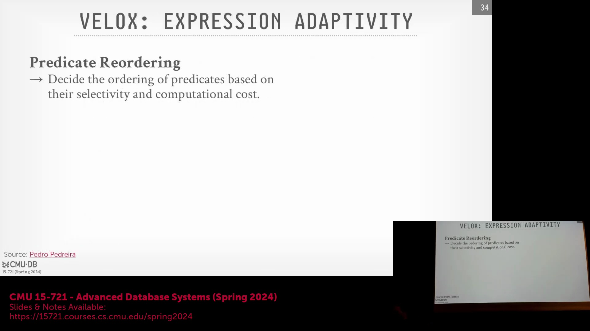

---

## 自适应字符串编码优化
现代执行引擎(Execution Engine)会在运行时(Runtime)根据数据特征(Data Characteristics)动态调整执行策略，以最大化查询性能。一个典型的例子是字符串函数求值(String Function Evaluation)：在纯 ASCII 数据上执行操作，远比处理完整的 UTF-8 编码高效得多。引擎并不依赖 Parquet 等列式存储格式(Columnar Storage Format)提供的静态元数据(Static Metadata)，而是默认从标准的 UTF-8 处理路径(UTF-8 Processing Path)开始。在扫描初始数据块(Initial Data Block)时，引擎会实时校验内容是否完全由 ASCII 字符构成。一旦确认，系统将无缝切换(Switch)至高度优化的 ASCII 执行路径(ASCII Execution Path)，从而彻底规避多字节解码(Multi-byte Decoding)带来的性能开销。若在执行过程中遭遇非 ASCII 字符，导致启发式判断(Heuristic Judgment)失效，引擎会安全中止(Safely Abort)当前快速路径(Fast Path)，并平滑回退(Fallback)至标准的 UTF-8 实现。
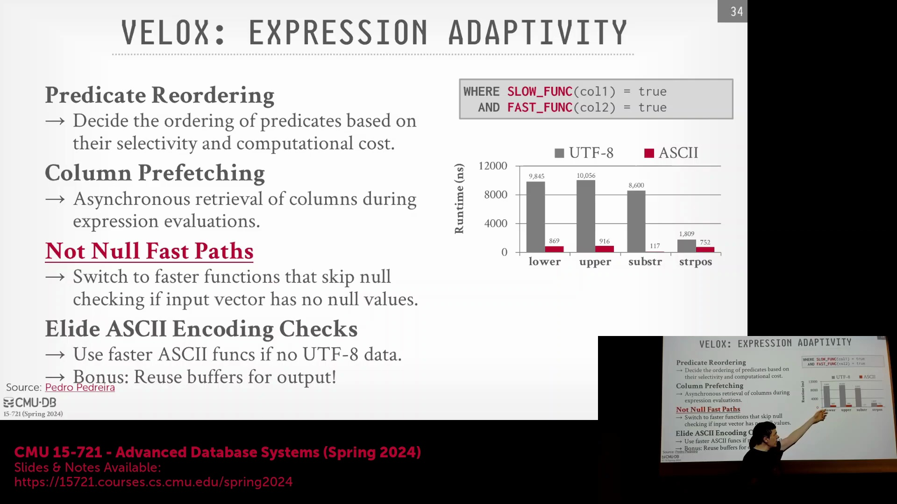

## 运行时数据属性检测
这种自适应机制(Adaptive Mechanism)完全在查询执行(Query Execution)阶段动态运行，独立于预定义的模式统计信息(Schema Statistics)。引擎不会预先假设(Assume)数据属性(Data Attribute)；相反，它会对传入的内存缓冲区(Incoming Memory Buffer)进行实时采样(Sampling)，以便在执行过程中做出精准的决策。以空值(Null Value)处理为例，系统会直接利用算子(Operator)之间传递的空值位图(Null Bitmap)。通过对空值向量(Null Vector)执行高效的硬件位计数指令(Hardware `popcount` Instruction)，系统可瞬间判定当前数据列是否包含空值。若判定结果确认无空值，引擎将直接旁路(Bypass)所有空值检查的分支逻辑(Branch Logic)，从而有效消除代价高昂的 CPU 分支预测失败(CPU Branch Misprediction)，大幅提升计算吞吐。类似的启发式策略(Heuristic Strategy)同样适用于字符串编码验证：系统在切换至特定执行路径前，会通过早期模式匹配(Early Pattern Matching)快速识别兼容的数据编码。

## 原地缓冲区复用与内存优化
另一项极为关键的优化技术是原地缓冲区复用(In-place Buffer Reuse)，它彻底消除了表达式求值(Expression Evaluation)过程中不必要的内存分配(Memory Allocation)。当算子执行数据体积保持不变的转换操作(Transformation Operation)（例如字符串转大写）时，引擎可直接将输出结果覆盖(Overwrite)至原始输入缓冲区(Input Buffer)。该技术有效避免了频繁调用底层内存分配函数（如 `malloc`）或为中间结果(Intermediate Result)分配新 Arrow 内存缓冲区(Arrow Memory Buffer)的系统开销。通过复用算子间流转的现有内存块(Existing Memory Block)，Velox 等现代执行引擎可将整体查询延迟(Query Latency)降低 25% 至 40%。性能基准测试(Performance Benchmark)清晰印证了此类优化的累积效应(Cumulative Effect)：相较于 UTF-8 基线(UTF-8 Baseline)，切换至 ASCII 快速路径(ASCII Fast Path)即可带来显著的性能跃升；当进一步结合零拷贝原地缓冲区复用(Zero-Copy In-place Buffer Reuse)时，性能增益将被进一步放大。

## 结论：利用 SIMD 进行向量化执行
本次讲座全面概述了现代分析型数据库(Analytical Database)如何利用底层硬件特性（尤其是 AVX-512 SIMD 指令集(AVX-512 SIMD Instruction Set)）来优化并向量化关系算子(Relational Operator)。通过摒弃低效的逐元组朴素解释执行(Naive Tuple-at-a-time Interpretation)，转而采用编译型向量化执行(Compiled Vectorized Execution)，系统能够以极低的 CPU 开销(CPU Overhead)高效处理数百万行数据。自适应运行时决策(Adaptive Runtime Decision)、表达式扁平化(Expression Flattening)与内存高效的缓冲区管理(Memory-Efficient Buffer Management)的深度结合，共同构筑了当今数据湖仓架构(Data Lakehouse Architecture)中高性能查询引擎(High-Performance Query Engine)的技术基石。
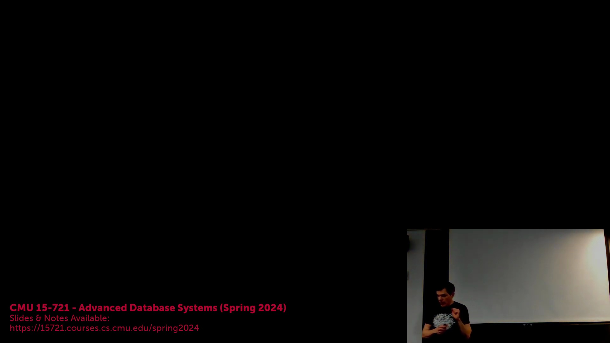

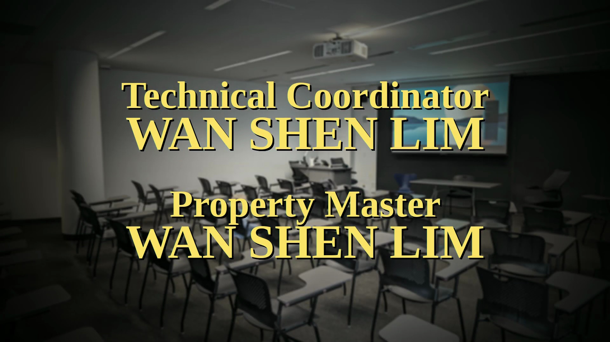

