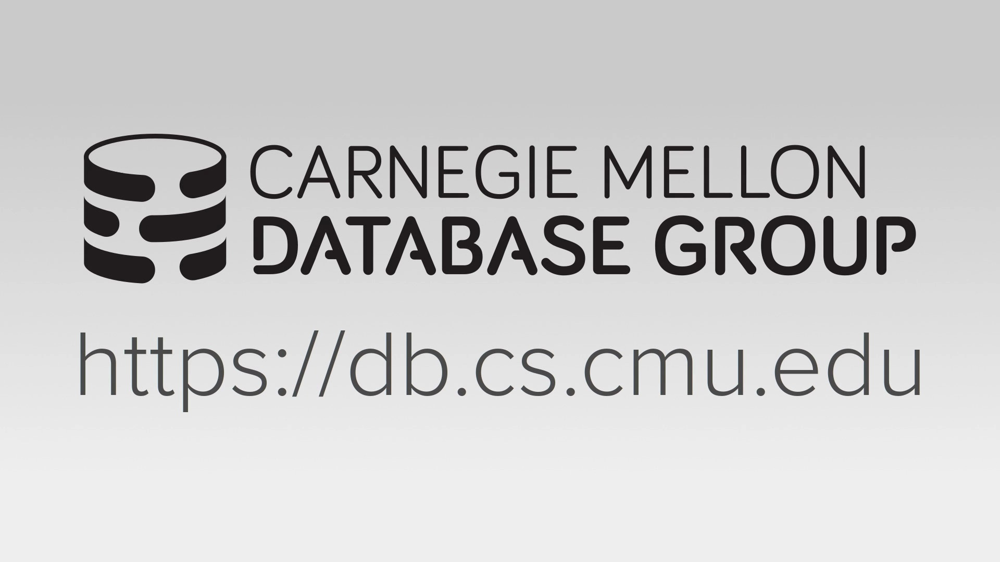
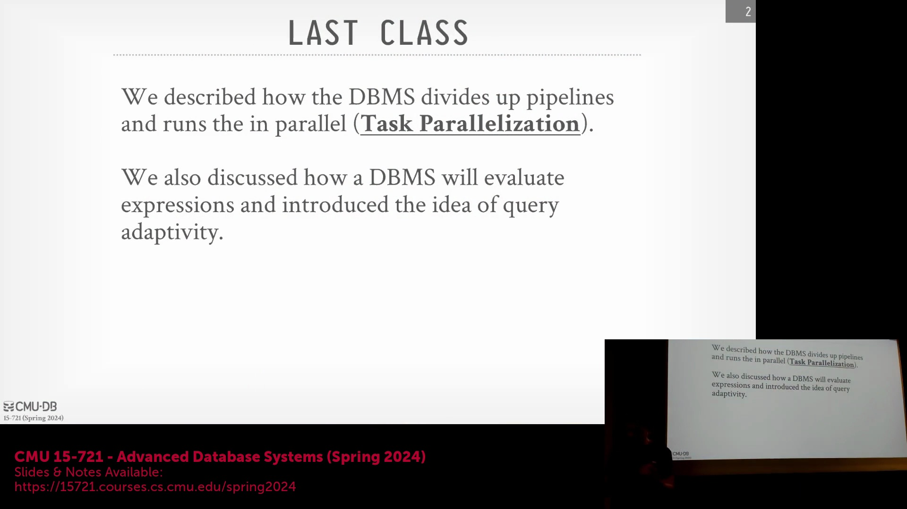
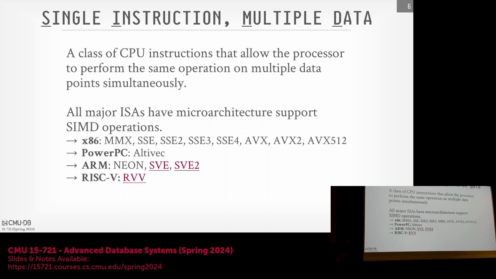
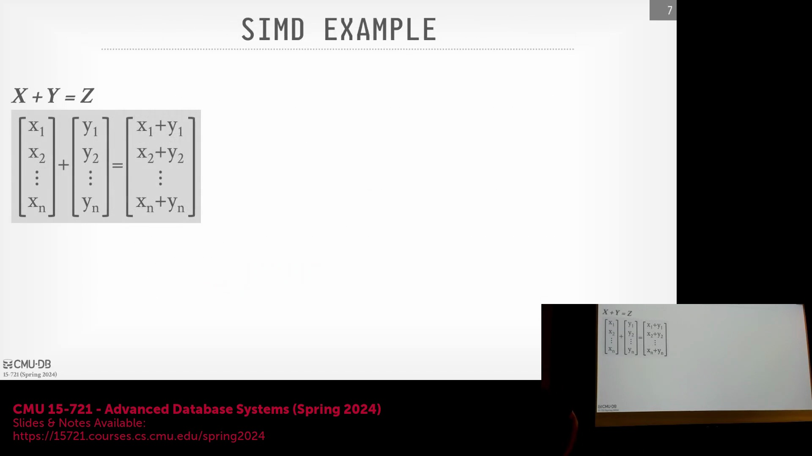
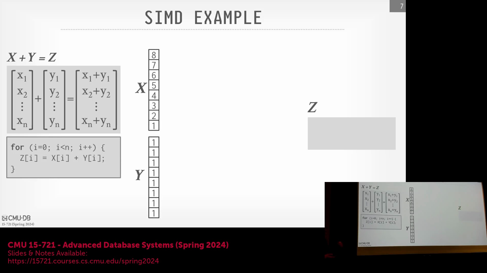
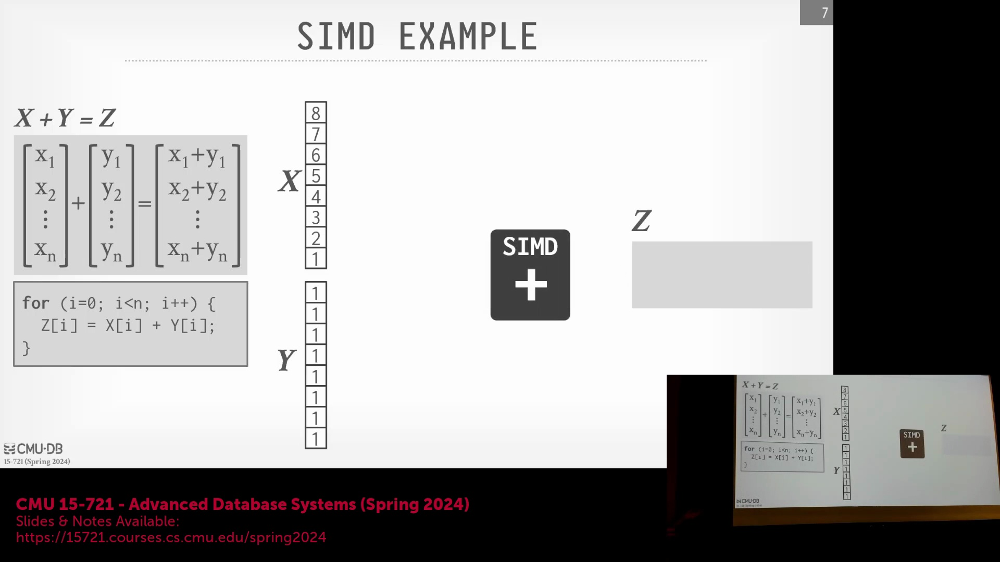

## 向量化查询执行(Vectorized Query Execution)简介
欢迎来到卡内基梅隆大学的高级数据库系统课程。今天的讲座重点介绍**向量化查询执行**（Vectorized Query Execution），这是现代 OLAP(Online Analytical Processing)系统实现高查询性能所依赖的一项基础技术。在之前的课程中，我们探讨了如何将查询计划(Query Plan)划分为多个流水线(Pipeline)以实现并行执行（任务并行化(Task Parallelism)），并讨论了查询编译(Query Compilation)与代码生成(Code Generation)的作用。我们还介绍了查询自适应技术(Adaptive Query Processing)，它允许优化器根据运行时观察到的性能动态调整执行策略。

基于这些概念，今天我们将深入探讨向量化技术，将其作为加速数据库查询处理的另一项关键优化层。

## 数据并行化(Data Parallelism)与性能扩展(Performance Scaling)
向量化技术将传统的标量算法(Scalar Algorithm)（每次处理一个元组(Tuple)或操作数(Operand)）转换为向量化格式，从而利用 CPU 提供的 SIMD(Single Instruction, Multiple Data)指令。这实现了**数据并行化**，使得单个算子(Operator)或表达式内的多个操作能够同时作用于不同的数据元素。其性能提升非常显著：正如将工作分配给多个线程或节点能带来线性加速一样，SIMD 引入了倍增效应。例如，在一台 32 核且具备理想扩展性能(Perfect Scaling)的机器上，任务并行可带来 32 倍的加速。如果 SIMD 每个周期能处理 4 个元组，那么单节点的理论最高加速比可达 128 倍。

尽管内存传输、磁盘 I/O(Disk I/O)和网络通信(Network Communication)等实际开销使我们无法达到理论峰值（实际收益通常限制在 1.4 倍左右），但即便是这种有限提升，对于数据库系统而言也是一项重大的优化成果。

## SIMD 架构(Architecture)与历史背景
SIMD 的基础可追溯到 20 世纪 60 年代的弗林分类法(Flynn's Taxonomy)，该分类法对计算机体系结构(Computer Architecture)的指令类型进行了划分。SIMD 允许处理器使用专用的宽寄存器(Wide Register)，同时对多个数据元素执行相同的操作。数据库引擎设计中的一个关键优化原则是：尽可能让数据驻留在这些 SIMD 寄存器中，在将结果写回 CPU 缓存(CPU Cache)或主存(Main Memory)之前完成最大量的计算。

尽管多种指令集架构(Instruction Set Architecture, ISA)都支持 SIMD 的变体，但本讲座将重点关注 Intel 的 **AVX-512**(Advanced Vector Extensions 512)。虽然由于遗留软件依赖，PowerPC 等传统架构仍在某些特定的企业环境中存在，但现代云基础设施和数据库优化已高度依赖 x86 架构(x86 Architecture)的演进。与早期版本相比，AVX-512 专门引入的指令集增强功能对数据库工作负载(Workload)具有显著优势。

## 实际示例：标量与 SIMD 矩阵加法(Matrix Addition)
为了说明执行上的差异，我们考虑一个简单的矩阵加法操作 `X + Y = Z`。在传统的标量方法中，循环会顺序遍历每个元素，每对值执行一条加法指令和一条存储指令。即使编译器进行了循环展开(Loop Unrolling)，根本瓶颈依然存在：一条指令恰好只能处理一个数据元素。

借助 SIMD，我们可以将数值向量直接加载到宽寄存器中（例如 128 位或 512 位）。假设使用 32 位整数，一条 SIMD 指令即可同时完成两个完整寄存器中对应位置元素的相加，并输出一个向量结果。过去需要八条独立的加法和存储指令才能完成的操作，现在仅需两条指令即可完成，这大幅降低了指令获取/解码(Instruction Fetch/Decode)的开销，并显著提升了列式数据库(Column-oriented Database)扫描的吞吐量(Throughput)。

## 水平向量化(Horizontal Vectorization)与垂直向量化(Vertical Vectorization)
数据库系统主要通过两种范式(Paradigm)来实现向量化。**水平向量化**（Horizontal Vectorization）指的是对单个 SIMD 寄存器内的所有元素进行操作，以产生一个标量结果，例如对一个包含四个数据元素的寄存器进行求和。虽然早期 CPU 缺乏对这些规约操作(Reduction Operation)的原生支持，但现代架构（AVX2 和 AVX-512）已包含专用的指令。然而，水平向量化在核心关系型查询处理(Relational Query Processing)中通常不占主导地位。

数据库引擎的主要关注点是**垂直向量化**（Vertical Vectorization），即以批处理(Batch Processing)方式将操作应用于多个数据向量的对应元素。这种模型与列式存储格式(Columnar Storage Format)天然契合，能够在数十亿个元组上实现高效且适合流水线(Pipeline)的执行，构成了现代高性能 OLAP 查询引擎的骨干。