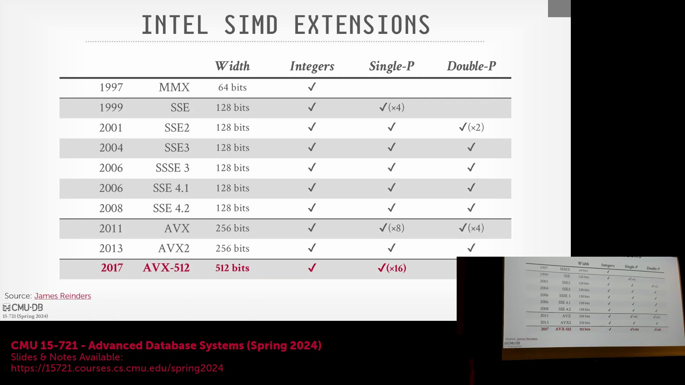
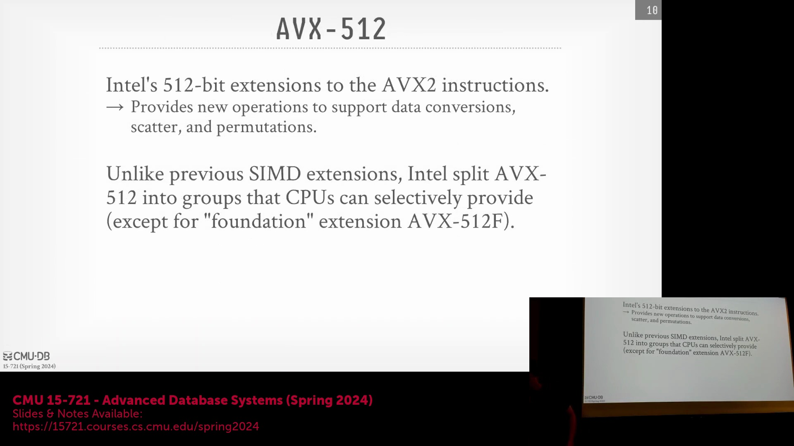
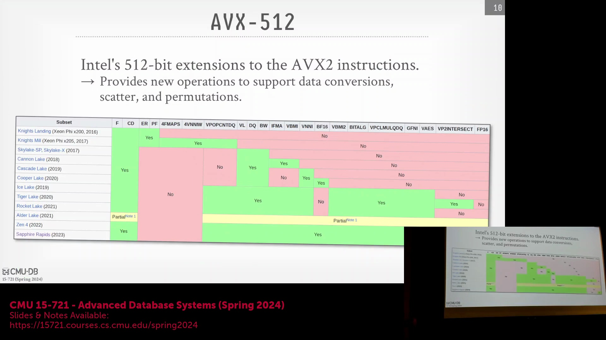
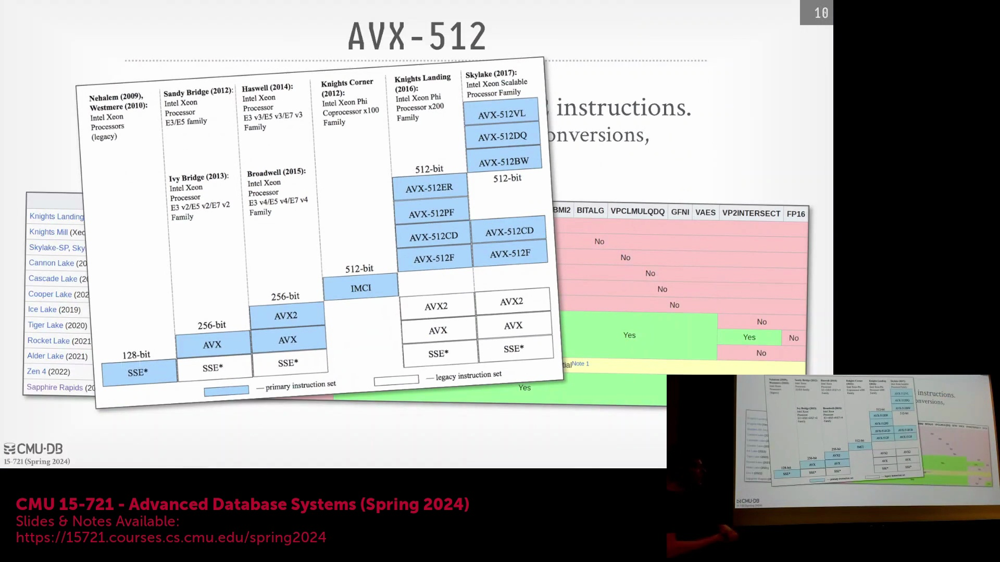
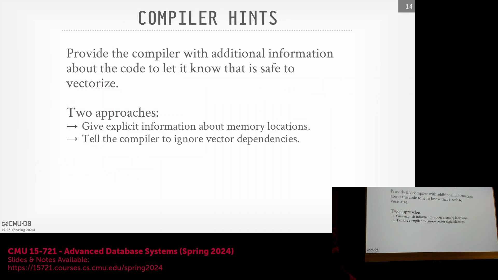
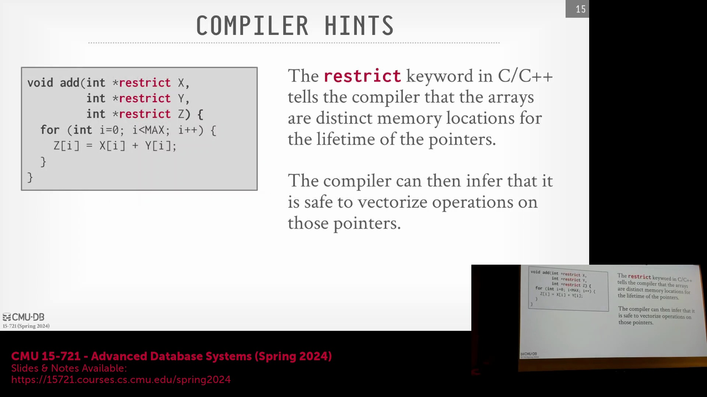

## 数据库中垂直向量化与水平向量化

数据库查询执行领域演进的关键技术是**垂直向量化(Vertical Vectorization)**。在该模型中，SIMD(Single Instruction, Multiple Data) 寄存器按数据通道(Lanes)对齐，单条指令对来自多个通道的固定宽度数据元素进行并行操作，以生成新的输出向量。这种方法与列式数据处理(Columnar Data Processing)完美契合。虽然**水平向量化(Horizontal Vectorization)**在核心关系运算(Relational Operations)中不占主导地位，但它在特定聚合操作(Aggregation Operations)中仍然非常有用。例如，ClickHouse 等系统利用水平向量化将 SIMD 寄存器内的所有元素求和为一个标量值(Scalar Value)。该功能在 AVX2(Advanced Vector Extensions 2) 及更新的架构中已得到广泛支持，但在早期的 CPU 代际(CPU Generations)中并不存在。

## Intel SIMD 与 AVX-512 的演进

回顾 Intel SIMD 扩展(SIMD Extensions)的历史，**AVX-512**(Advanced Vector Extensions 512)（约于 2017 年推出）是现代数据库系统的一个重要里程碑。它引入了 512 位宽寄存器(512-bit Wide Registers)，能够同时处理整数、单精度浮点数(Single-Precision Floating-Point)和双精度浮点数(Double-Precision Floating-Point)。AVX-512 中最具影响力的新增功能是原生支持**谓词掩码(Predicate Masks)和置换指令(Permutation Instructions)**。这些硬件级特性(Hardware-Level Features)允许开发者精确指定哪些数据通道应参与运算，从而免去了早期 SIMD 实现中必需的手动位掩码(Bitmask)模拟操作。

## 硬件碎片化与运行时自适应

与早期“全有或全无”模式的 SIMD 扩展不同，AVX-512 引入了一个碎片化的生态系统(Fragmented Ecosystem)。Intel 将 AVX-512 划分为多个可选的指令子集(Instruction Subsets)，这意味着宣称支持 AVX-512 的 CPU 可能仅实现了特定的指令组。因此，数据库引擎不能假设所有硬件都具备完整的 AVX-512 支持。像 ClickHouse 这样的系统会实施运行时 CPU 标志位检查(Runtime CPU Feature Flag Checking)和条件代码路径(Conditional Code Paths)，以动态适应底层处理器的能力。开发者必须仔细验证实际可用的指令子集，因为使用不当有时会导致性能不佳，甚至由于旧微架构上的降频惩罚(Frequency Downclocking Penalty)而导致执行变慢。

## 在数据库代码中实现 SIMD 的策略

数据库开发者通常从以下三种方法中选择一种来利用 SIMD：
1. **编译器自动向量化(Compiler Auto-Vectorization)**：编译器自动将结构紧凑的数组循环重写为向量化指令。这是最简便的方法，但高度依赖于代码结构的规范性以及不存在内存依赖关系(Memory Dependencies)。
2. **编译器提示(Compiler Hints)**：开发者通过 Pragma 或关键字提供明确指导，以鼓励编译器进行向量化，而无需编写底层内部函数(Intrinsics)。
3. **手动 SIMD 内部函数(Manual SIMD Intrinsics)**：开发者直接调用特定的 SIMD 指令，在增加复杂度和可移植性开销的代价下提供最大程度的控制。
现代编译器（GCC、Clang、ICC）在自动向量化方面已有显著改进，但成功与否仍取决于能否将数据库代码组织成结构清晰、利于循环优化(Loop Optimization)的代码块。此外，编译环境(Compilation Environment)决定了输出结果：在没有 AVX-512 的机器上编译的代码，即使部署到支持它的企业级服务器上，也不会利用该特性。

## 指针别名与编译器的保守性

阻碍自动向量化的主要障碍是**指针别名(Pointer Aliasing)**。当函数接收多个指针（例如输入数组 `x`、`y` 和输出数组 `z`）时，编译器无法在编译时(Compile Time)确定这些内存区域是否重叠。如果 `z` 与 `x` 重叠，向量化循环可能导致后续的迭代读取到过期或被覆盖的数据，从而产生与标量执行(Scalar Execution)不同的错误结果。为了保证数学正确性，编译器会采取高度保守的立场，拒绝自动向量化那些无法证明指针独立性(Pointer Independence)的循环。

## 使用 `restrict` 和 Pragmas 启用自动向量化

为了克服别名障碍，开发者可以使用 `restrict` 关键字（最初源自 C99 标准，但已广泛被 C++ 编译器支持）。通过将指针标注为 `restrict`，程序员向编译器明确保证内存区域在循环执行期间不会重叠，从而开启安全的自动向量化。或者，开发者可以采用强力的编译器 Pragma(Compiler Pragma)来禁用依赖检查(Dependency Checking)并强制向量化。虽然这如同“不系安全带驾驶”般存在风险，且要求开发者绝对确保内存安全(Memory Safety)，但在自动优化失效时，它提供了一种强有力的后备手段。理解这些编译器行为对于构建高性能的向量化数据库算子(Database Operators)至关重要。