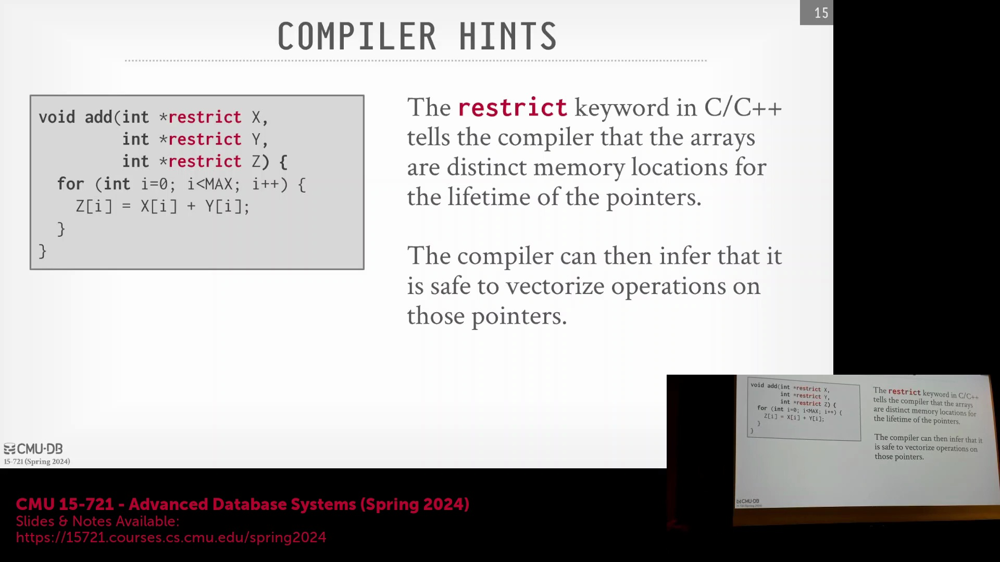
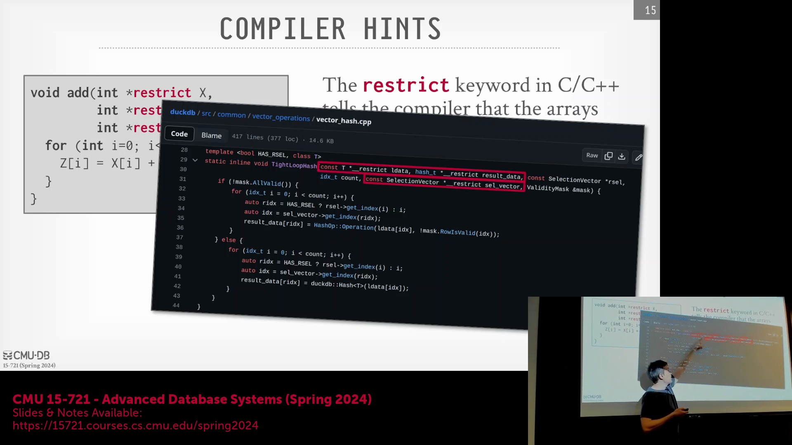
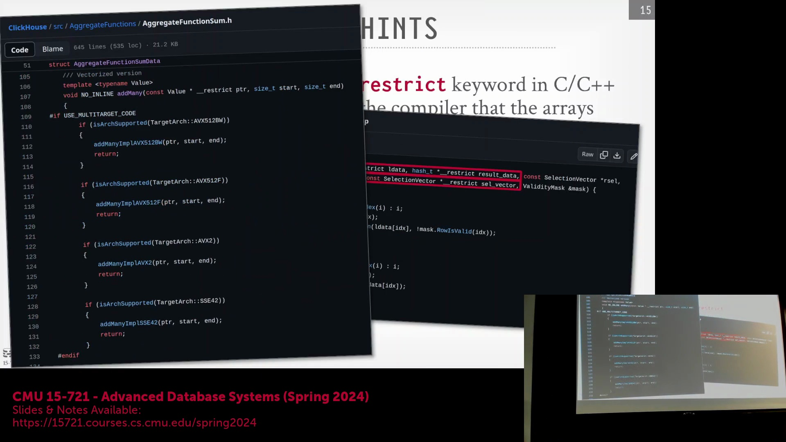
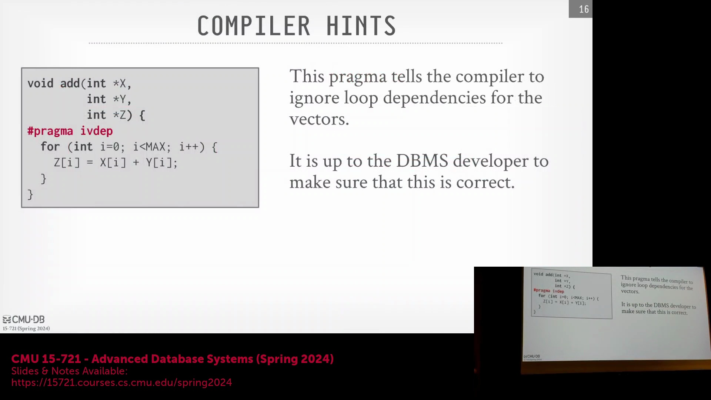
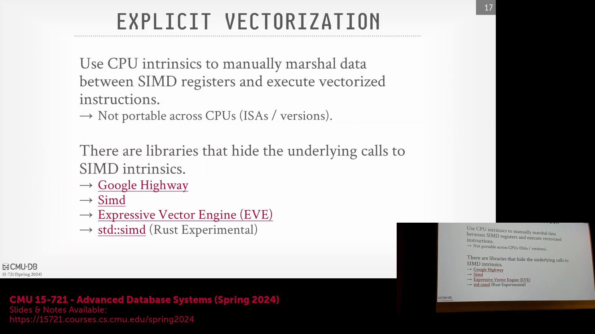
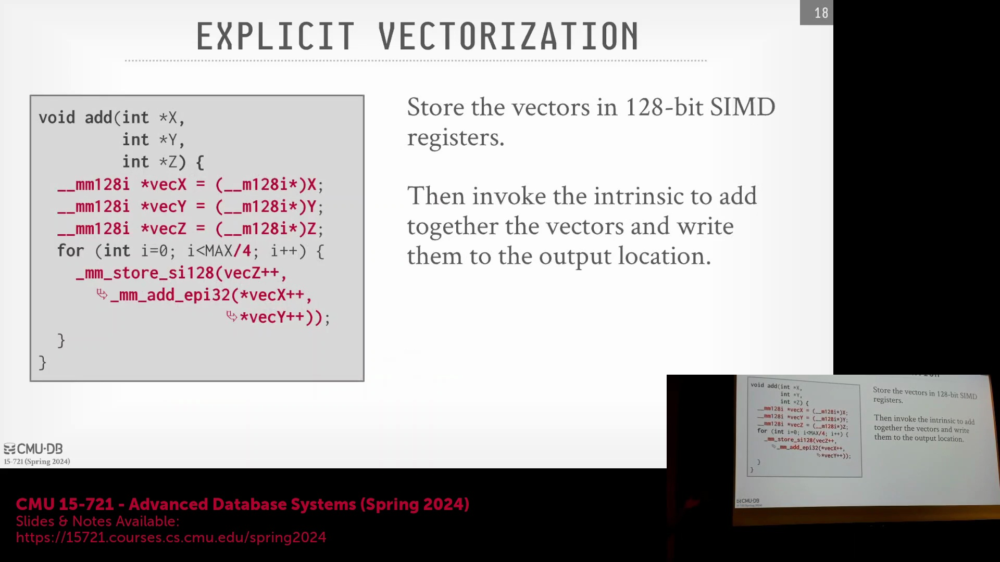
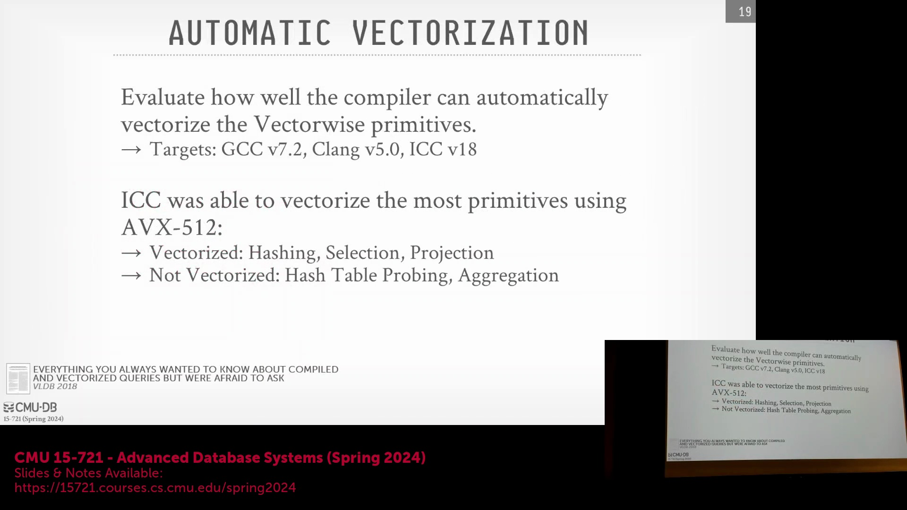
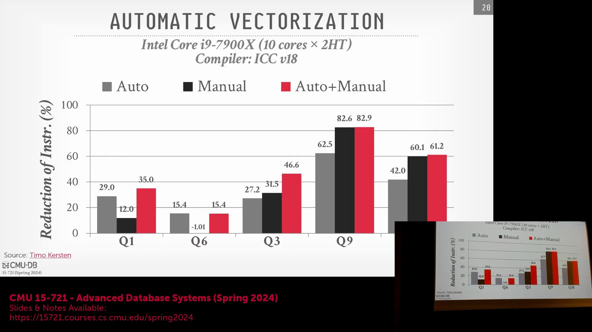

## 使用 `restrict` 实现安全的自动向量化(Auto-Vectorization)

C/C++ 中的 `restrict` 关键字是一个关键的编译器提示(Compiler Hint)，用于保证指针参数在函数生命周期内不会发生内存别名(Memory Aliasing)。通过显式声明数组引用的是独立且不重叠的内存区域，开发者能够使编译器安全地将标量循环(Scalar Loop)重写为向量化的 SIMD(Single Instruction, Multiple Data) 指令，而无需担心数据覆盖或损坏。这项技术在 DuckDB 等现代数据库引擎中至关重要，这些引擎大量使用 `__restrict` 注解来标记算子函数(Operator Functions)，从而解锁激进的自动向量化优化。系统通常会将此技术与条件位掩码(Conditional Bitmask)优化结合使用：如果有效性掩码(Validity Mask)确认整个数据批次(Data Batch)中不包含空值(Null)，引擎便会绕过逐行的空值检查逻辑，从而大幅降低分支预测开销(Branch Overhead)。这一策略与 Velox 和 ClickHouse 所采用的优化方案高度一致。

## 使用编译时宏(Compile-Time Macros)处理硬件碎片化(Hardware Fragmentation)

由于 AVX-512(Advanced Vector Extensions 512) 被划分为多个可选的指令子集(Instruction Subsets)，而非单一的整体特性集，数据库二进制文件(Database Binaries)必须能够适配不同的 CPU 能力(CPU Capabilities)。ClickHouse 等引擎通过大量使用编译时宏（如 `#if defined`）来解决这一问题，从而精确检测目标处理器所支持的具体 AVX-512 指令组。这种条件编译(Conditional Compilation)机制在单一代码库(Codebase)中衍生出多条专用代码路径(Code Paths)，确保聚合运算(Aggregation Operations)与数学原语(Mathematical Primitives)能够充分调用当前硬件确切支持的指令。尽管这提升了源代码的复杂度，但它彻底消除了运行时的特性检查(Runtime Feature Checking)开销，并确保了代码在各种 Intel 微架构(Intel Microarchitectures)上均能实现最优的执行性能。

## 编译器 Pragma 与显式 SIMD 内部函数(SIMD Intrinsics)

当自动向量化因编译器保守的别名分析(Alias Analysis)而受阻时，开发者可以使用 `#pragma ivdep` 或 OpenMP 的 `#pragma simd` 等编译器指令(Compiler Pragmas)来强制启用优化。这些指令会指示编译器忽略潜在的内存依赖(Memory Dependencies)并强制进行向量化，从而将保证代码正确性的责任完全交由程序员承担。为了获得对执行流程的绝对控制——尤其是在自主定义硬件栈(Hardware Stack)的托管云数据库(Managed Cloud Databases)（如 BigQuery、Redshift）中——工程师通常会完全绕过自动向量化，转而直接编写**显式 SIMD 内部函数(Explicit SIMD Intrinsics)**。这些内部函数在语法上表现为标准的 C/C++ 函数调用，但在编译时会直接映射为特定的 CPU 指令，从而实现对 SIMD 寄存器(SIMD Registers)的精准操控。为保持跨指令集架构(Instruction Set Architecture, ISA)的可移植性(Portability)，开发者通常会引入 Google Highway 或 `libsimd` 等硬件抽象层(Hardware Abstraction Layer)，以便在目标环境不支持 AVX-512 时，自动回退(Fallback)至更窄的寄存器或标量实现。

## 在代码中实现显式向量化(Explicit Vectorization)

编写显式向量化代码需要将传统的标量循环重构为基于 SIMD 寄存器的批量操作。开发者需将常规的数组指针转换为宽向量类型(Wide Vector Types)（例如 512 位整型向量），将连续内存中的数据批量加载(Load)至 SIMD 寄存器中，并执行并行的算术或比较指令。在此模式下，循环的迭代次数将按比例缩减（除以向量通道宽度/Vector Lane Width），这意味着单次迭代即可并行处理 4、8 或 16 个数据元素，彻底摒弃了逐一顺序处理的方式。完成 SIMD 运算后，计算结果将被批量存储(Store)回输出缓冲区(Output Buffer)。尽管该方法要求开发者严谨处理循环边界(Loop Boundaries)与尾部剩余元素(Tail Handling)，但它能提供高度稳定且极高的吞吐量(Throughput)，这对于列式存储数据库(Columnar Storage Database)中扫描数十亿元组(Tuples)的场景至关重要。

## 评估向量化策略(Vectorization Strategies)：性能基准测试(Performance Benchmarking)

针对不同向量化方法的学术基准测试(Academic Benchmarks)表明，混合策略(Hybrid Strategy)始终能带来最佳性能。在利用 Clang、GCC 和 Intel ICC 编译器，针对 TPC-H 基准测试中的核心数据库原语(Database Primitives)（如哈希连接、选择过滤、投影）进行的受控实验(Controlled Experiments)中，结果证实：仅依赖**自动向量化**虽能提供一个可靠的性能基线(Performance Baseline)，但仍有大量优化潜力未被挖掘；反之，**完全手动编写内部函数**往往会引入过高的代码复杂度(Code Complexity)，反而抵消了预期的性能收益。最优实践是：首先依赖编译器对结构清晰的循环进行自动向量化，随后通过性能分析工具(Profiling)精准定位瓶颈，再手动重写这些特定的热点代码(Hotspot Code)。这种有针对性的混合方案实现了极高的指令执行效率，充分证明了针对底层算子原语进行精细化优化，仍是加速向量化查询执行(Vectorized Query Execution)的最有效路径。