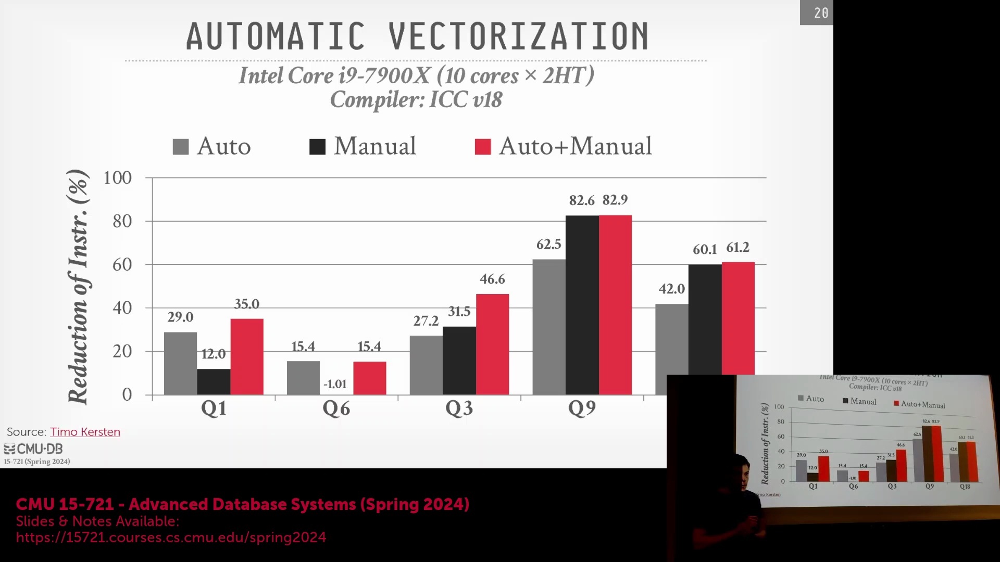
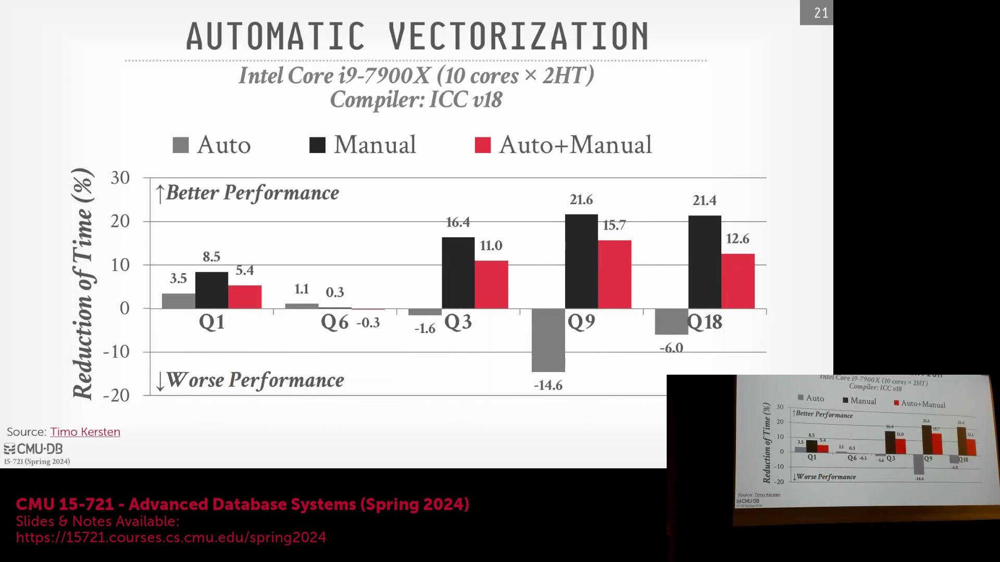
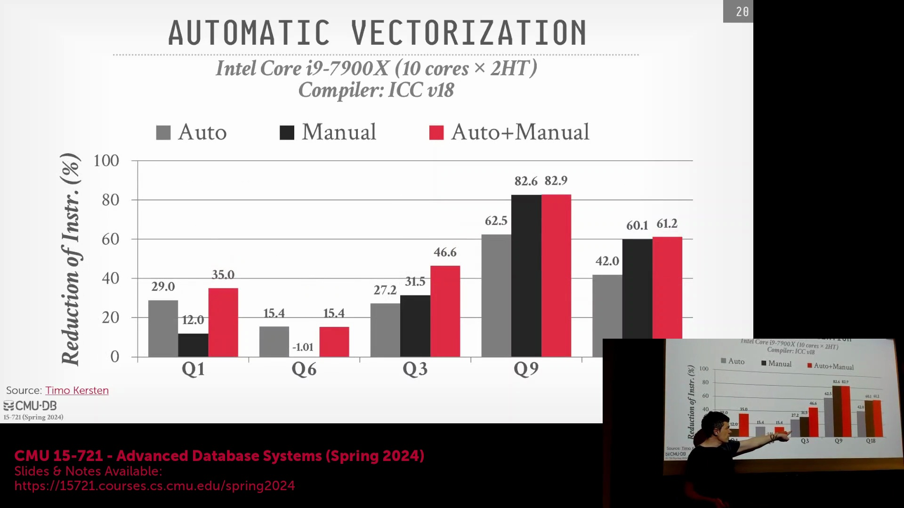
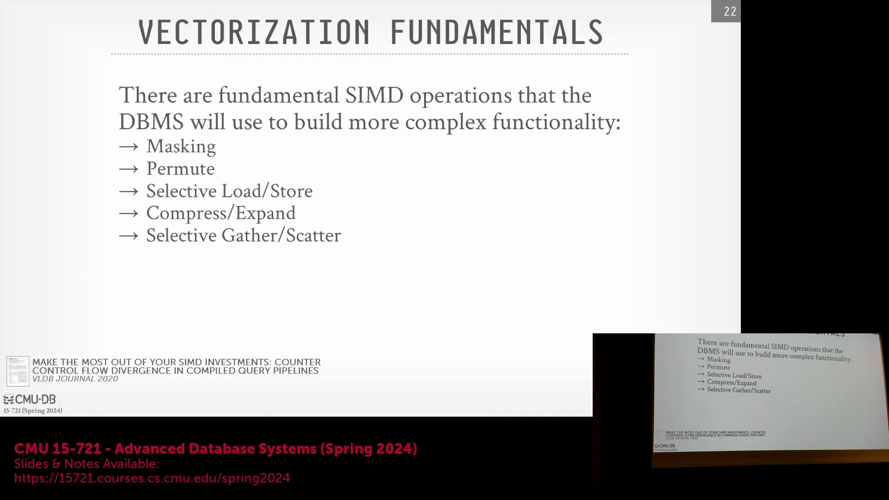
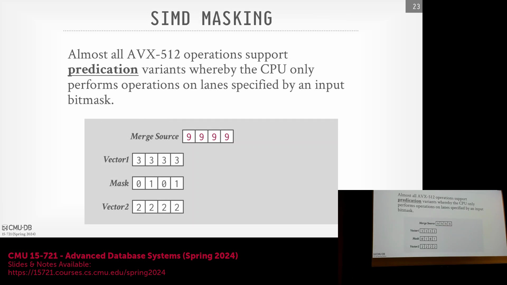
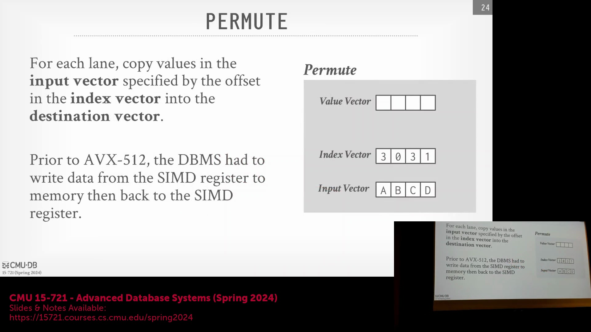

## 评估向量化策略(Vectorization Strategies)：基准测试(Benchmarking)与权衡
学术基准测试对比不同向量化策略的结果表明，并不存在一种适用于所有工作负载(Workloads)的“通用最优”方法。在针对 TPC-H 查询进行测试时，完全手动编写的 SIMD 内部函数(SIMD Intrinsics)有时能生成更精简的汇编指令(Assembly Instructions)，或比编译器自动生成的代码实现更快的执行时间。然而，这些性能收益伴随着巨大的工程成本，因为编写内部函数几乎等同于手写汇编代码。相反，纯粹的自动向量化(Auto-Vectorization)虽然能大幅提升开发者的生产效率，但也留下了未被充分挖掘的优化空间。理论上最优的策略是一种**混合方法(Hybrid Approach)**：依赖编译器自动向量化绝大多数数据库原语(Database Primitives)，随后对生成的汇编代码进行性能剖析(Profiling)以定位瓶颈，并仅选择性地使用手动内部函数重写这些热点代码(Hotspot Code)。尽管这种方法能实现极高的指令执行效率，但它要求开发者具备深厚的底层系统专业知识，且在面对不可预测的查询工作负载时难以大规模推广。

## AVX-512 降频现象(Frequency Throttling)
尽管 AVX-512(Advanced Vector Extensions 512) 提供了更宽的寄存器，但受限于硬件层面的功耗(Power Consumption)和散热(Thermal)约束，它并不能在所有场景下都保证更优的性能。密集执行 AVX-512 指令流可能会触发 **CPU 降频(CPU Downclocking)** 机制，即 Intel 处理器为控制散热与功耗，会自动降低其基础时钟频率(Base Clock Frequency)。这种架构层面的权衡(Trade-off)导致部分编译器在历史上曾默认采用 AVX2 指令集，以优先保障持续稳定的时钟频率，而非追求更宽的数据通道(Data Lanes)。其影响之大，以至于 Intel 最终在部分消费级芯片(Consumer Chips)上移除了对 AVX-512 的支持，以避免用户感知到性能倒退。尽管新一代微架构已缓解了该问题，但数据库工程师仍需意识到：在处理混合工作负载时，较窄的 SIMD 位宽有时反而优于 AVX-512，因为它们有效规避了降频惩罚(Throttling Penalty)带来的性能损耗。

## 谓词掩码(Predicate Masks)：条件化 SIMD 执行的核心
AVX-512 引入的一项变革性特性是专用的**谓词掩码寄存器(Predicate Mask Registers)**（最多支持 32 个）。与早期 SIMD 架构需占用宝贵的数据寄存器来模拟条件逻辑不同，AVX-512 允许直接通过位掩码(Bitmask)来门控(Gate)指令的执行。掩码中的每一位精确对应一个 SIMD 数据通道(Lane)：位值为 `1` 表示启用该通道的运算，为 `0` 则表示跳过。开发者可在**合并掩码(Merge Masking)**与**零掩码(Zero Masking)**之间进行选择：合并掩码会保留非活动通道(Inactive Lanes)在目标寄存器中的原有值，而零掩码则会将非活动通道的结果自动置零。这一特性是现代向量化数据库的基石，它使得 `WHERE` 子句求值、`NULL` 值处理以及复杂过滤链(Filter Chains)得以高效执行，无需依赖代价高昂的分支跳转(Branch Jumps)或会破坏流水线连续性的分散写入(Scatter Operations)。

## 使用置换原语(Permutation Primitives)构建查询算子
在高效处理谓词过滤后，向量化引擎进一步依赖数据重排原语(Data Rearrangement Primitives)来构建更复杂的查询算子。**置换(Permute)**操作作为核心基础模块，允许 CPU 根据指定的索引(Indices)或控制向量，有选择性地将一个或多个输入向量中的元素提取并重新排序至输出向量。借助宽寄存器批量重排元组(Tuples)，置换操作彻底消除了传统逐行数据移动带来的标量开销(Scalar Overhead)。当与掩码运算(Mask Arithmetic)和比较指令(Comparison Instructions)结合使用时，置换原语能够高效支撑连接(Joins)、排序(Sorting)及哈希表查找(Hash Table Lookups)等复杂操作，构成了现代 OLAP 查询执行引擎(OLAP Query Execution Engine)的底层基石。

