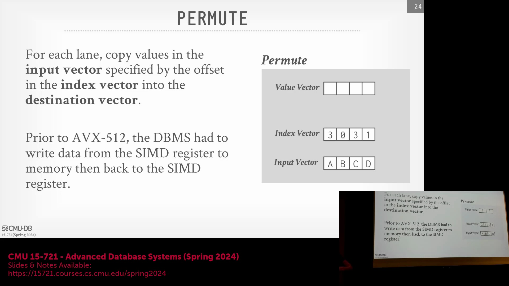
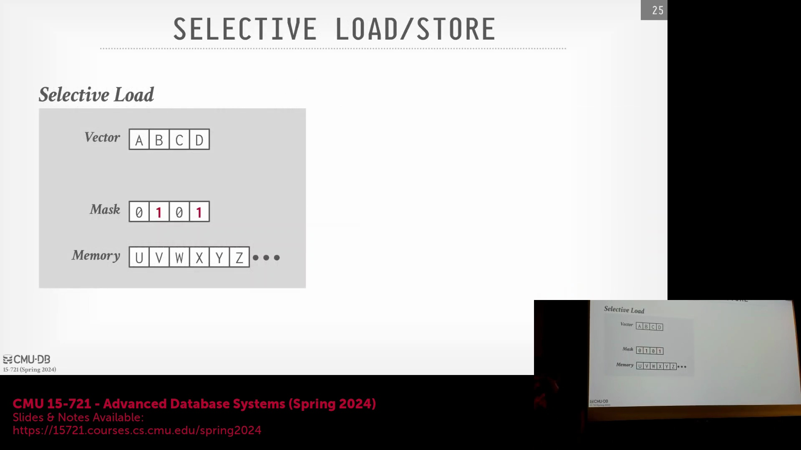
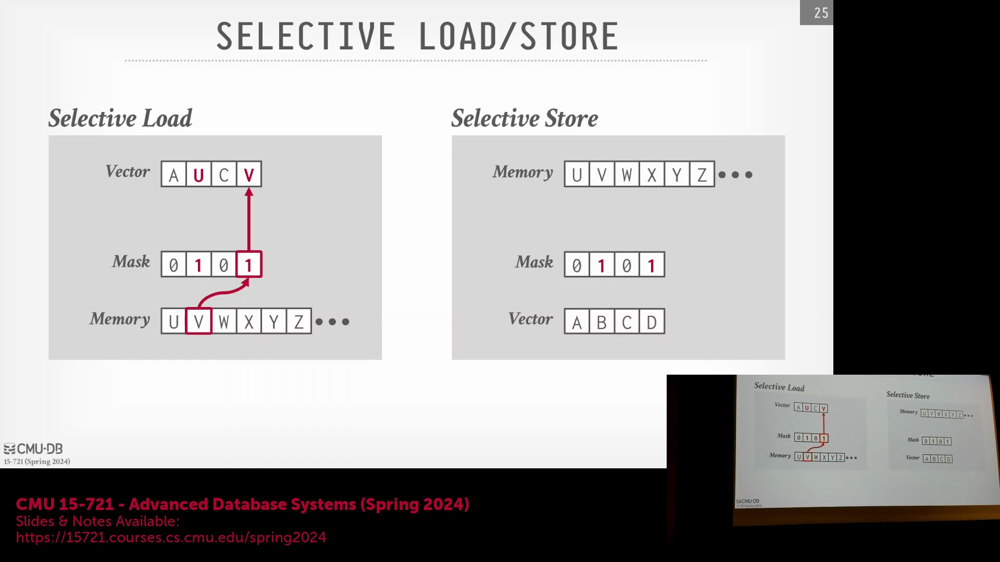
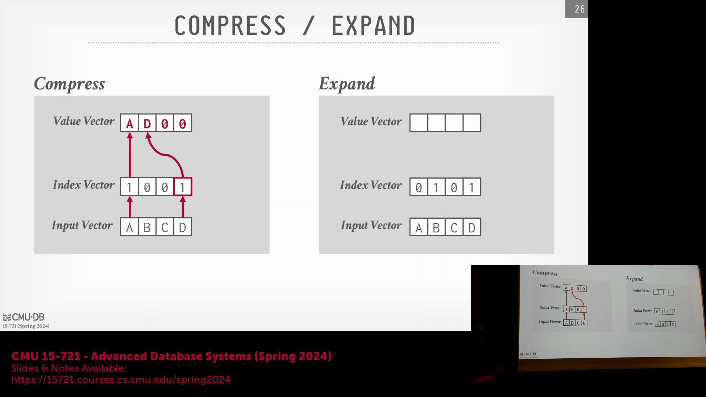
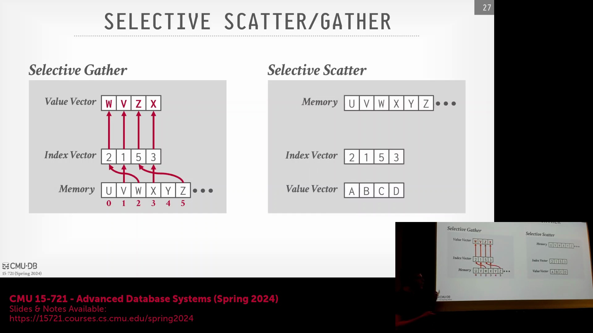
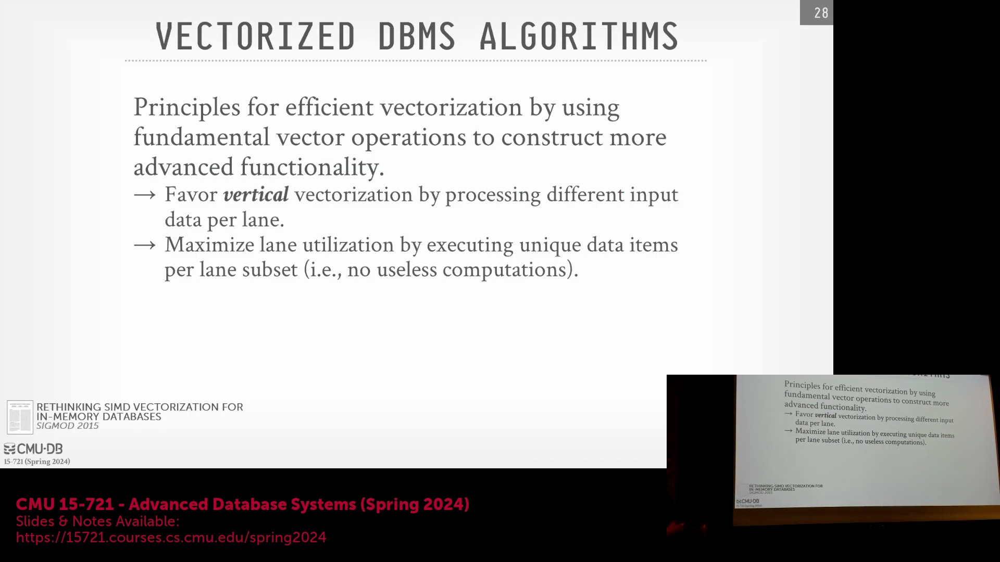
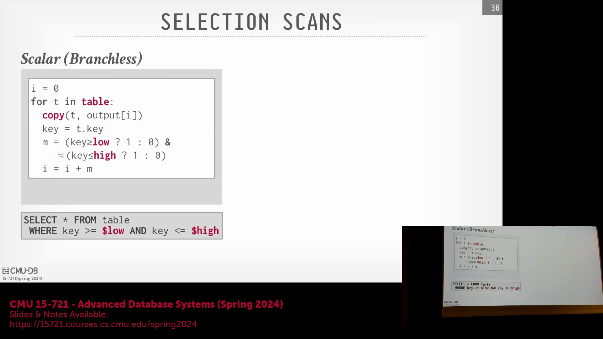
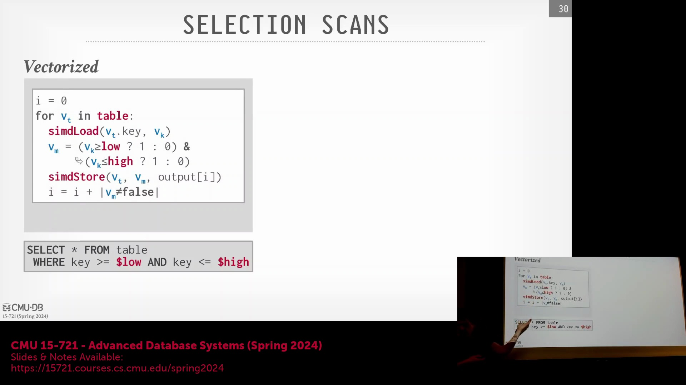
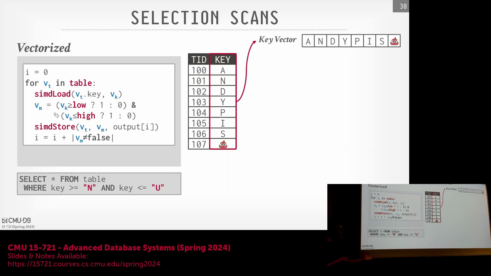

## 高效的基于寄存器的数据操作
在 AVX-512 问世之前，向量重排(Vector Permutation) 通常需要将数据从寄存器移出至内存，稍后再读回，这一过程会导致缓存污染(Cache Pollution) 并引发性能下降。AVX-512 通过单条高效指令直接在寄存器内完成所有排列操作，从而消除了这一瓶颈。借助索引向量(Index Vector)，CPU 无需经过中间内存步骤，即可将输入值精准映射到目标位置。

## 选择性加载与存储操作
掩码操作(Masked Operations) 利用位掩码(Bitmask) 有条件地控制内存与向量寄存器之间的数据流动。选择性加载(Masked Load) 仅在掩码指示为 `1` 的位置从内存中读取数据，跳过掩码为 `0` 的位置，从而保留向量寄存器中的现有内容并避免不必要的覆盖。相反，选择性存储(Masked Store) 遵循完全相同的掩码逻辑，将向量元素写回内存，确保只有指定的通道(Lane) 被更新。这两个方向的操作均可作为单条指令执行。

## 压缩与扩展变换
压缩(Compress) 操作会将活跃元素（即掩码为 `1` 的位置）紧凑地打包到目标向量的起始处，当目标空间用尽时，剩余通道将被清零或忽略。其反向操作为扩展(Expand)，它根据掩码将紧凑的数据序列重新分布到完整向量中，并将未使用的通道填充为零。这些互补指令使得完全在寄存器内进行高效的、由掩码驱动的数据重塑(Data Reshaping) 成为可能。

## 散布与收集内存访问
散布(Scatter) 和收集(Gather) 指令专门用于处理非连续的内存访问模式。收集(Gather) 指令使用索引向量从分散的内存地址获取数据，并按指定顺序将其组装到连续的向量寄存器中。散布(Scatter) 指令则执行相反的操作，将向量通道中的数据写入由索引指定的不同内存地址。尽管硬件会自动处理内存对齐问题，但为了匹配 L1 缓存(L1 Cache) 的加载/存储吞吐量限制并避免消耗过多时钟周期，这些操作的性能优化通常以缓存行(Cache Line) 为单位进行。

## 数据库中的纵向 SIMD 向量化
将这些架构特性应用于数据库系统时，优化重点从横向 SIMD 向量化(Horizontal SIMD Vectorization) 转向了纵向 SIMD 向量化(Vertical SIMD Vectorization)，以最大化通道利用率。通过在独立的通道中并行处理多个元组(Tuple)，系统可以避免在已被过滤或谓词评估结果为假的数据上浪费时钟周期。尽管 2015 年的基础研究基于 32 位指针和数据常驻 L3 缓存(L3 Cache) 的假设已略显过时，但现代实现已针对现实中的大规模工作负载，对这些位掩码和索引向量进行了充分适配与优化。

## 无分支扫描实现
在实现无分支扫描(Branchless Scan) 时，系统采用位运算替代传统的 `if-else` 条件分支逻辑，以维持 SIMD 流水线(SIMD Pipeline) 的执行效率。系统将键值加载到 SIMD 寄存器中，并针对查询的范围边界执行并行比较操作。每次比较都会生成一个独立的比较掩码，随后通过 SIMD 逻辑与(AND) 操作将这些掩码合并，生成最终的谓词掩码(Predicate Mask)，从而精准识别出满足条件的元组。

## 位掩码压缩与优化实践
逐步演示展示了系统如何评估八个单字符键值与范围边界的匹配关系。系统首先生成两个比较掩码，将其进行逻辑组合后，结合一个包含 `0-7` 顺序索引的偏移向量(Offset Vector)，交由压缩指令进行处理。该过程将符合条件元组的精确索引提取至一个紧凑的寄存器中。额外的硬件优化指令（例如 `` `rank` `` 指令）可快速统计最终掩码中置位（值为 `1`）的比特数，以便在未找到匹配项时触发提前退出(Early Exit) 机制，从而节省不必要的计算周期。
