## 将向量化集成到查询原语中
在实际数据库系统中实现单指令多数据流(Single Instruction, Multiple Data, SIMD) 通常依赖于调用显式向量化函数(Explicit Vectorization Functions) 或依赖编译器自动向量化(Compiler Auto-Vectorization)。在处理 `WHERE` 子句(WHERE Clause) 时，系统会将列值(Column Values) 与常量进行比较并生成结果。一个关键的设计抉择在于：是立即生成匹配偏移量列表(Match Offset List)，还是保留中间位掩码(Intermediate Bitmask)。位掩码(Bitmask) 极具价值，因为它们可以在最终筛选(Final Selection) 之前进行逻辑组合（例如通过 SIMD 逻辑与(SIMD AND) 操作），从而高效处理复杂的谓词逻辑(Predicate Logic)。为每一种可能的查询变体(Query Variant) 生成最优的底层原语序列(Primitive Sequence) 并非易事，通常需要超出标准自动向量化能力范围的人工优化(Manual Tuning)。
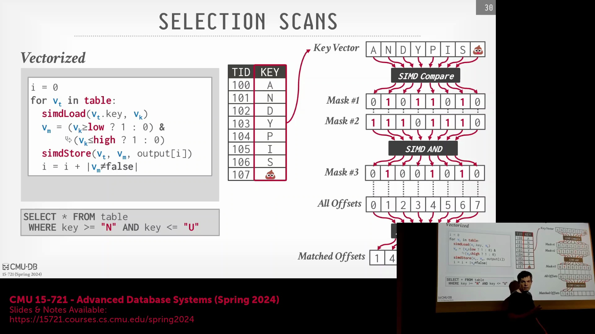

## AVX-512 基准测试与系统开销
针对哈希计算(Hash Computation)、内存收集(Gather) 和连接探测(Join Probing) 等核心操作的 AVX-512 微基准测试(Microbenchmarking) 展现了显著的加速效果，相比标量执行(Scalar Execution) 最高可实现 2.3 倍的性能提升。然而，当这些向量化原语(Vectorized Primitives) 被集成到完整的查询引擎(Query Engine) 中时，整体性能提升通常会缩减至 10% 左右。这一差异可以通过阿姆达尔定律(Amdahl's Law) 来解释：数据物化(Data Materialization)、算子间通信(Inter-Operator Communication) 以及内存移动(Memory Movement) 的开销稀释了底层计算带来的收益。尽管如此，这些优化效果具有累积性，最大化每一执行层级的处理速度对于实现系统级数量级(System-Level Order-of-Magnitude) 的性能跃升至关重要。

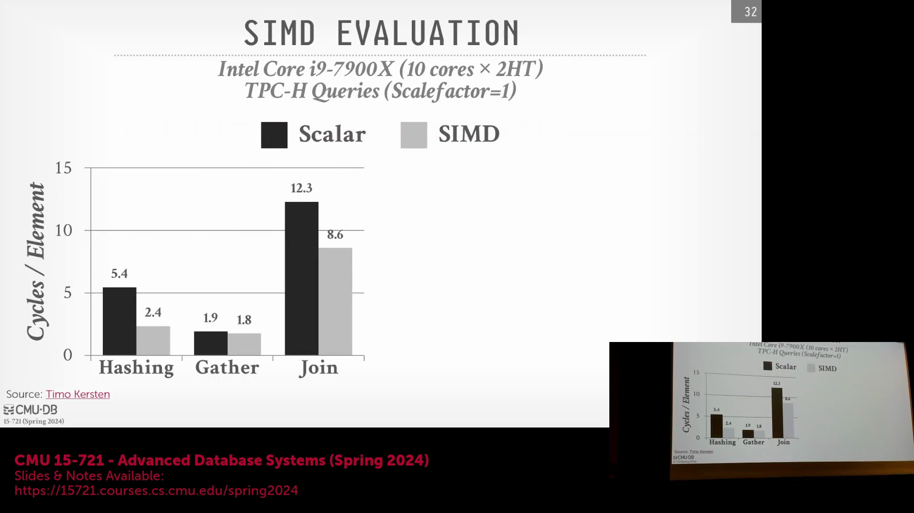
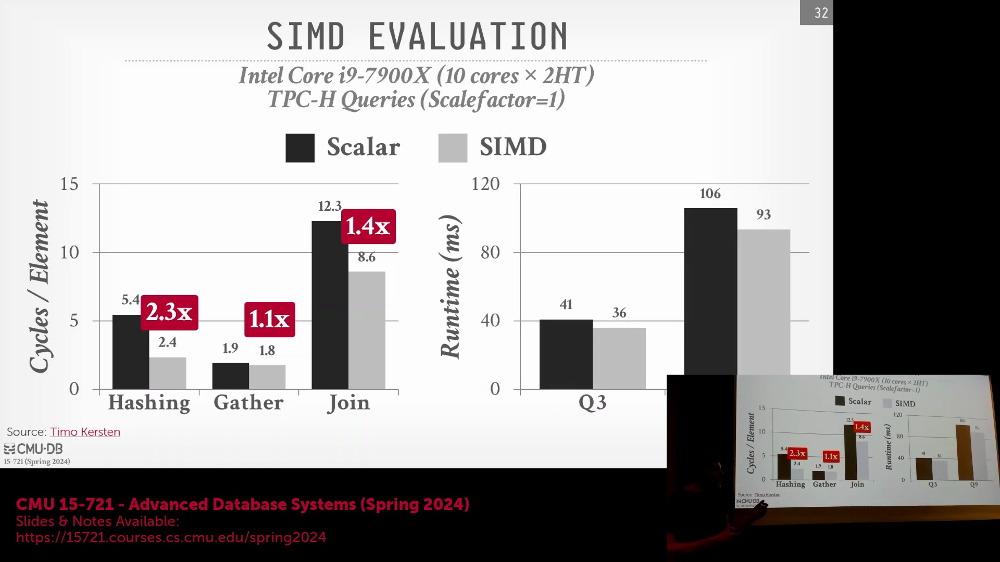

## SIMD 通道利用率难题
向量化查询执行(Vectorized Query Execution) 中一个长期存在的难题是由“无效元组”(Filtered-Out Tuples) 导致的向量通道(Lane) 利用率低下。当应用过滤谓词(Filter Predicate)（例如 `age > 20`）时，SIMD 寄存器(SIMD Register) 中的部分通道将包含不满足条件的数据。在标量执行(Scalar Execution) 中，这些数据会被直接跳过。但在向量化流水线(Vectorized Pipeline) 中，失效的元组仍会滞留在寄存器内，并被不必要地传递至聚合(Aggregation) 或连接(Join) 等后续阶段，从而浪费计算资源与缓存带宽(Cache Bandwidth)。为了维持高吞吐量(High Throughput)，系统必须阻止无效数据在执行流水线中持续向下传播。
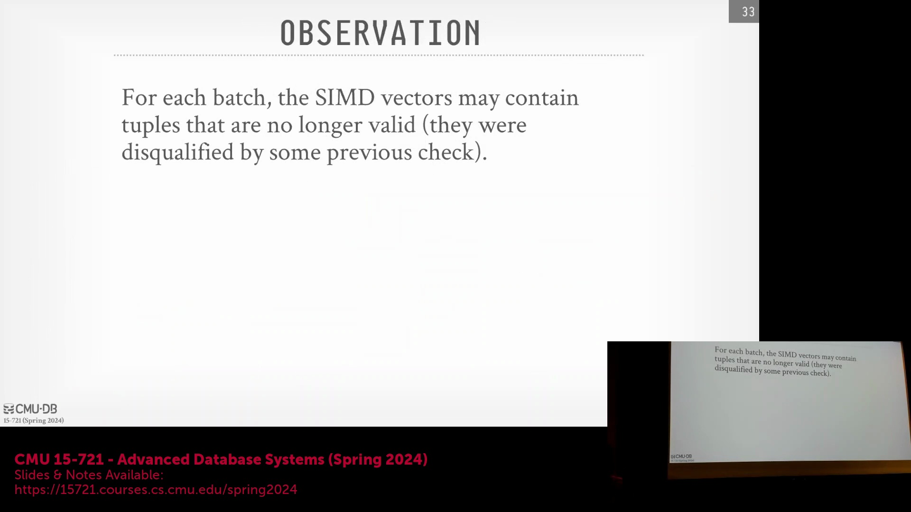
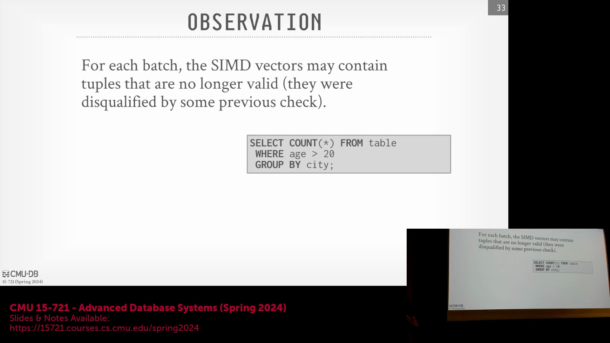
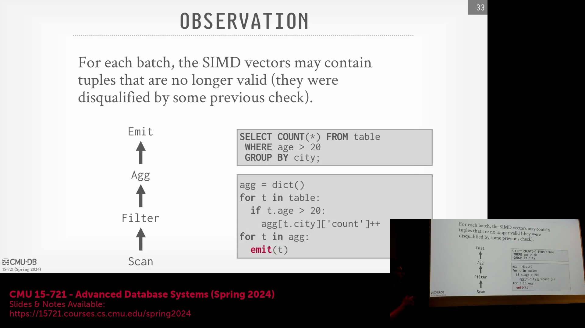

## 人造流水线断点与宽松算子融合
为了消除无效元组的传播问题，现代向量化引擎(Vectorized Engine) 引入了人造流水线断点(Synthetic Pipeline Breakers)。系统不再将所有算子(Operators) 融合到一个不间断的单一循环中，而是插入中间暂存缓冲区(Intermediate Staging Buffer)。执行引擎会扫描并过滤输入向量，仅将符合条件的元组写入紧凑缓冲区(Compact Buffer) 中。一旦缓冲区达到容量上限，流水线便会安全地过渡到下一阶段（例如聚合阶段），从而保证 100% 的通道利用率(Lane Utilization)。这种“宽松算子融合(Relaxed Operator Fusion)”架构在融合流水线(Fused Pipeline) 的高效性与数据物化点(Data Materialization Points) 的灵活性之间取得了精妙平衡。
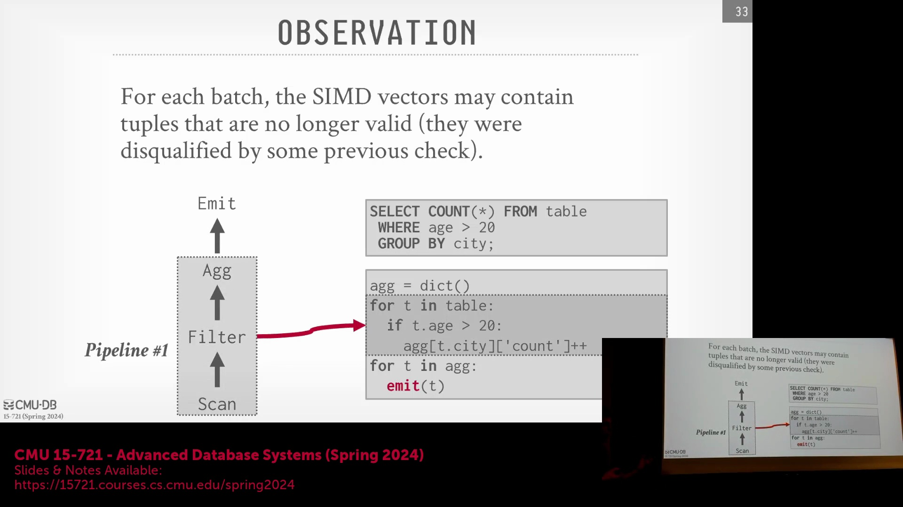
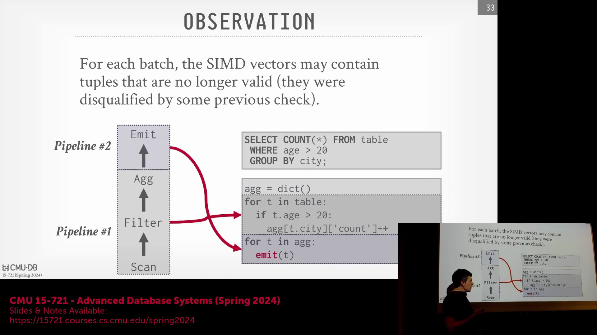

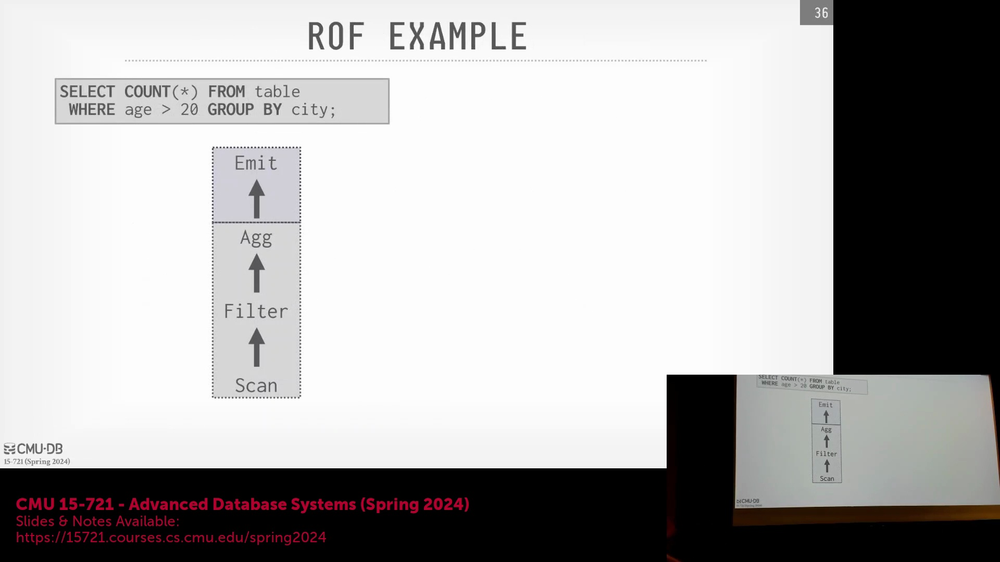

## 分阶段缓冲区实现与预取技术
其具体实现遵循一个紧凑循环(Tight Loop)：扫描输入元组，通过 SIMD 比较(SIMD Comparison) 进行过滤，并将有效结果逐步打包至暂存缓冲区(Staging Buffer) 中。若缓冲区未满，循环将继续提取更多数据；一旦填满，控制权即移交至向量化聚合阶段(Vectorized Aggregation Phase)。这种分阶段架构(Phased Architecture) 不仅确保了清晰的数据边界(Data Boundaries)，还为软件预取(Software Prefetching) 创造了理想条件。尽管 CPU 能够自动处理顺序访问的硬件预取(Hardware Prefetching)，但开发人员仍可在该紧凑的暂存循环中注入显式的预取指令(Prefetch Instructions)，主动将后续的内存块提前加载至缓存中，从而显著降低下一次数据迭代过程中的内存延迟(Memory Latency)。
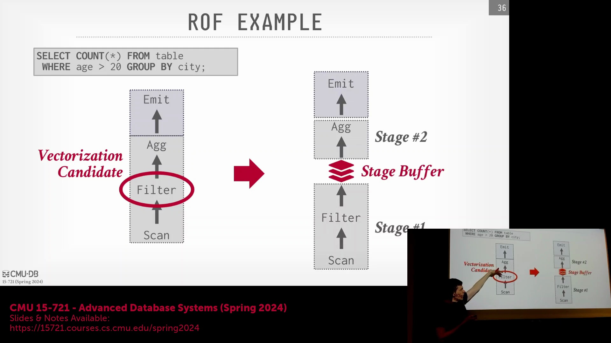
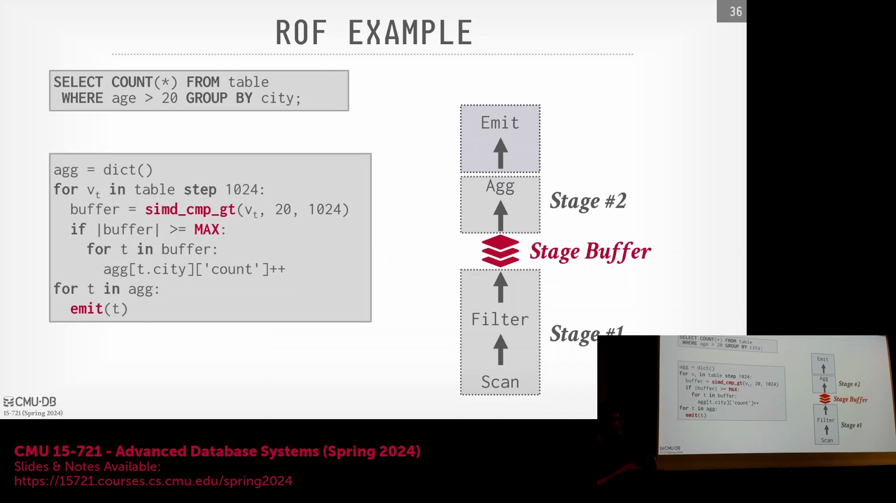
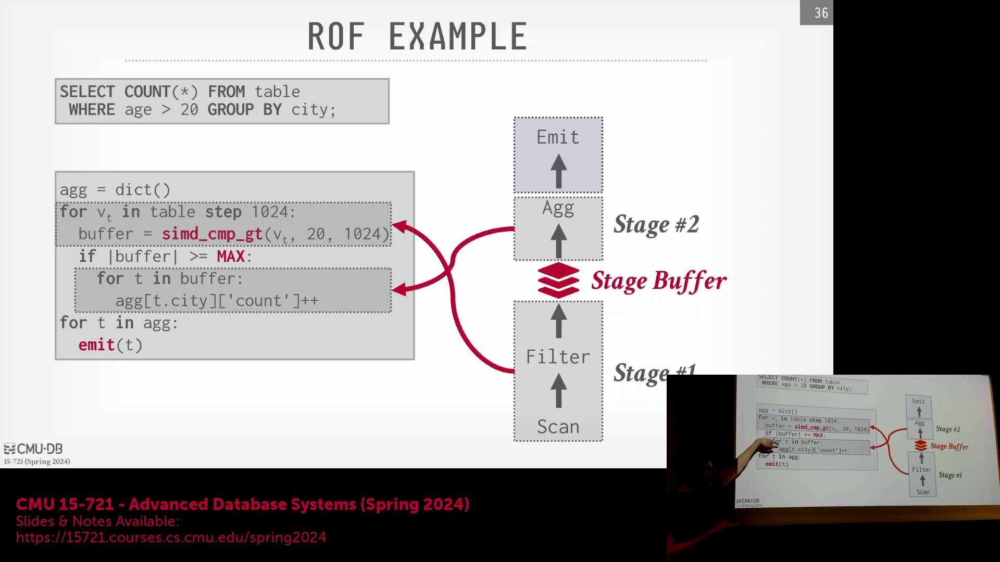