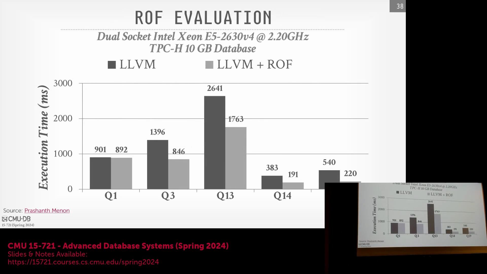
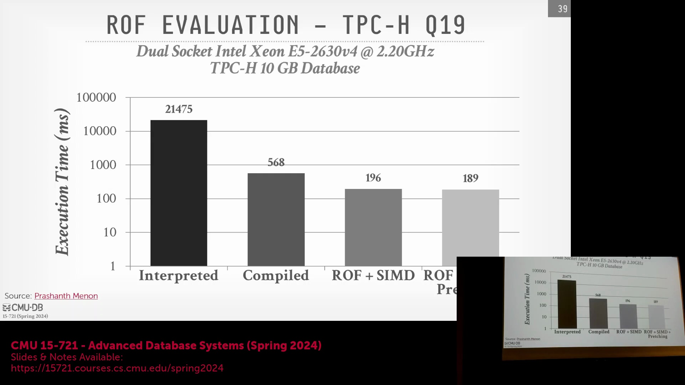
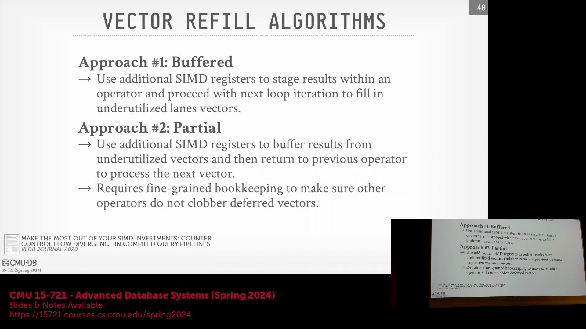
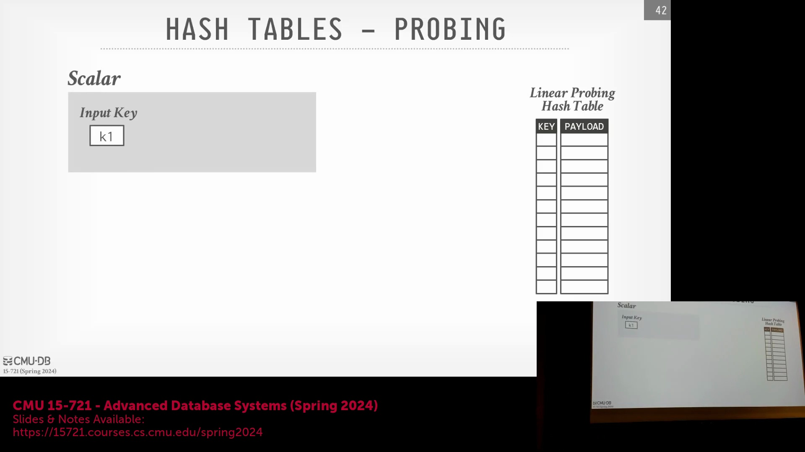
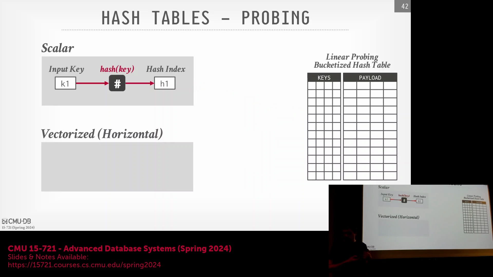
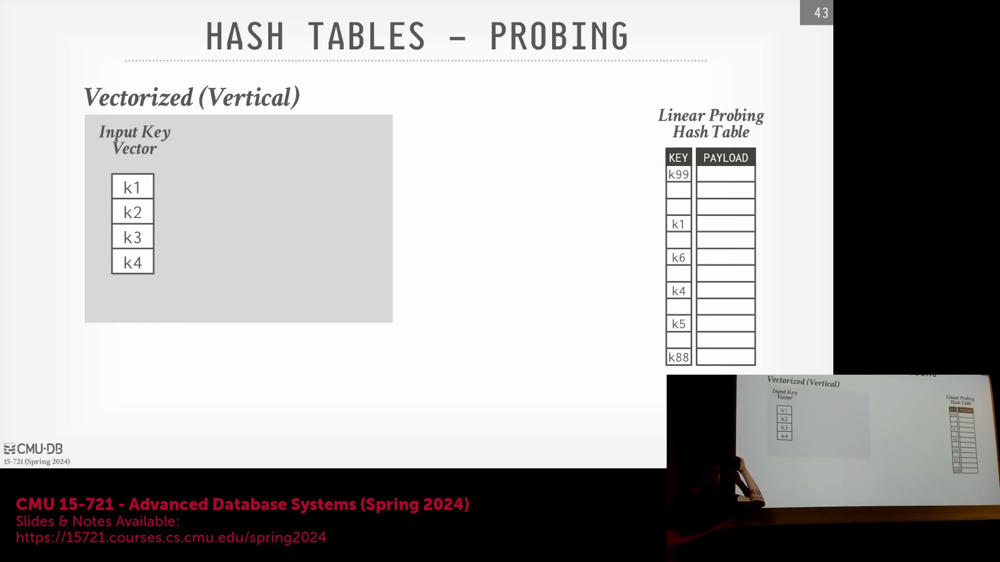
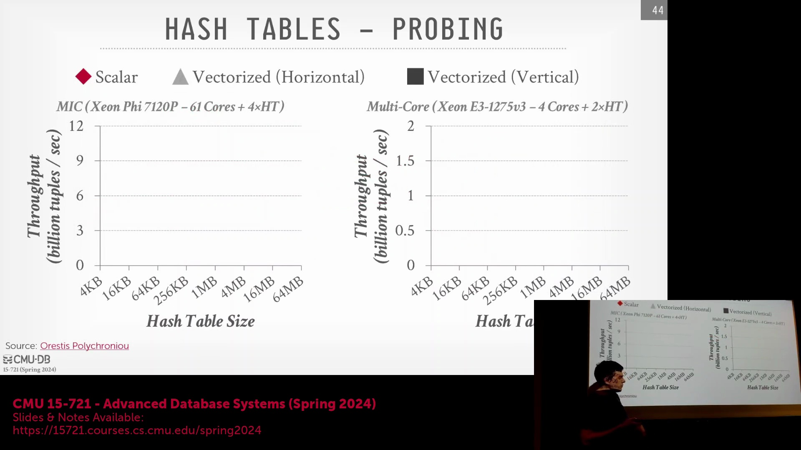

## 软件预取与整体查询编译
现代 x86 架构(x86 Architecture) 允许开发者向 CPU 发送显式的软件预取提示(Software Prefetch Hint)，告知处理器哪些内存区域即将被访问。尽管硬件并未强制必须遵循这些提示，但当它们被集成到紧凑的执行循环(Tight Execution Loop) 中时，仍能带来显著的性能提升。当该技术结合整体查询编译(Whole-Query Compilation) 与宽松算子融合(Relaxed Operator Fusion) 时，预取机制能够创建自然的流水线边界(Pipeline Boundary)，从而大幅降低缓存未命中(Cache Miss) 率。性能基准测试(Performance Benchmark) 表明，从朴素的解释执行模型(Naïve Interpretation Model) 迁移至完全编译、向量化且分阶段的执行流水线，可带来惊人的性能改进。尽管最大理论收益（例如约 97%）反映的是从未经优化的基线代码(Unoptimized Baseline Code) 升级而来的跨度，但一致的结论表明：引入暂存缓冲区(Staging Buffer) 与激进的向量化技术(Aggressive Vectorization)，能够为各类查询工作负载(Query Workload) 提供稳定且渐进的性能加速。

## 高级向量回填策略
SIMD 执行(SIMD Execution) 中长期存在的一个挑战是：在过滤操作(Filter Operation) 丢弃无效数据后，如何高效处理部分填充的寄存器。为了在避免频繁物化结果(Frequent Result Materialization) 的同时最大化向量通道(Lane) 利用率，先进的系统采用了动态向量回填策略(Dynamic Vector Backfilling Strategy)。**缓冲策略(Buffering Strategy)** 使执行过程保持在同一算子(Operator) 内部，利用额外的寄存器临时暂存有效元组。一旦主寄存器填满，SIMD 压缩指令(SIMD Compress Instruction) 会将暂存数据与当前批次数据合并，随后传递给下游算子。**部分回填策略(Partial Backfill Strategy)** 则更为激进：它会将控制权交回子算子(Child Operator) 以拉取新的输入元组，试图以更细的粒度填充空闲通道。尽管该策略在理论上具有更高的执行效率，但跨算子跟踪写入位置所需的状态维护开销(State Maintenance Overhead) 极为复杂。因此，大多数生产级数据库(Production-Grade Database) 为简化实现，通常选择直接将无效元组沿流水线传递至后续阶段。

## 哈希表的横向 SIMD 方法
由于指针追逐(Pointer Chasing) 特性和非连续内存布局(Non-Contiguous Memory Layout)，哈希表(Hash Table) 众所周知地对 SIMD 极不友好。为了解决这一难题，**横向向量化(Horizontal Vectorization)** 策略直接修改了哈希表的物理结构：每个哈希桶(Hash Bucket) 存储四个键(Key) 和四个对应的值(Value)。在查找(Lookup) 阶段，系统对单个探测键(Probe Key) 进行哈希计算以定位目标桶，随后将该探测键广播(Broadcast) 至 SIMD 寄存器的各个通道中。接着，单条并行比较指令(Parallel Compare Instruction) 将探测键与桶内存储的四个键同时进行比对，生成标识匹配项的位掩码(Bitmask)。尽管该设计颇具巧思，但面临通道利用率不可预测的挑战。空闲槽位(Empty Slot) 或负载稀疏的桶意味着比较操作经常在无效或空数据上执行，从而难以充分发挥硬件的峰值吞吐量(Peak Throughput)。

## 纵向哈希探测与输出排序挑战
**纵向向量化(Vertical Vectorization)** 方法保留了传统的哈希表结构（每个槽位存储一个键），但改为并行处理多个探测键。借助 SIMD 哈希计算与收集指令(Gather Instruction)，执行引擎将多个分散的桶条目提取至单个向量寄存器(Vector Register) 中进行同步比较。当发生哈希冲突(Hash Collision) 或特定通道提前完成匹配时，这些通道会动态从输入流中回填新的探测键，从而在多轮迭代中保持所有 SIMD 单元处于高负载状态。尽管纵向哈希探测(Vertical Hash Probing) 的性能始终优于横向方法，但它引入了一个关键的正确性挑战：输出确定性(Output Determinism)。由于各通道的回填与处理速率存在差异，最终输出的元组顺序可能不再严格匹配原始输入顺序。若查询执行(Query Execution) 要求严格的结果顺序一致性，系统则需引入额外的排序或标记机制来保证语义正确性。

