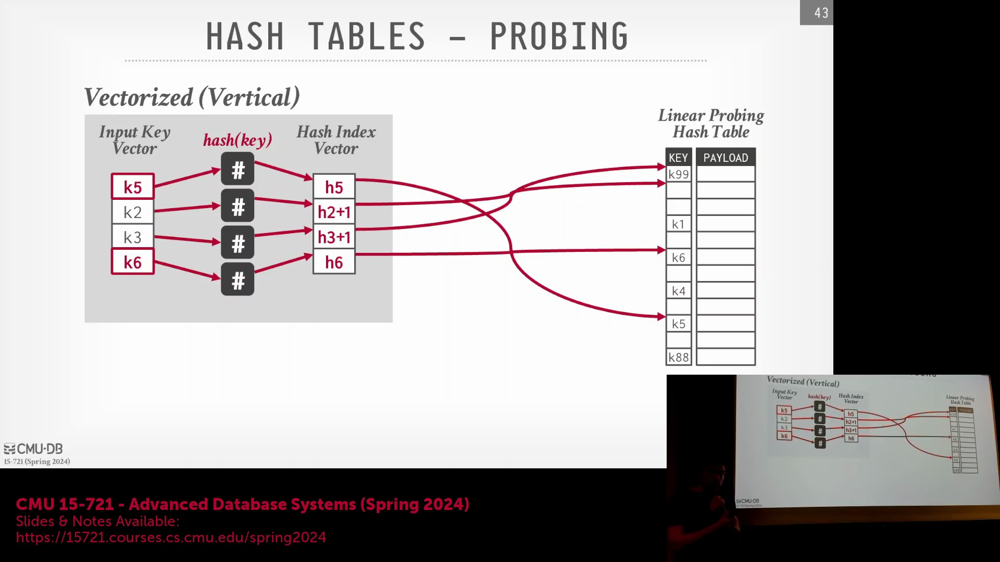
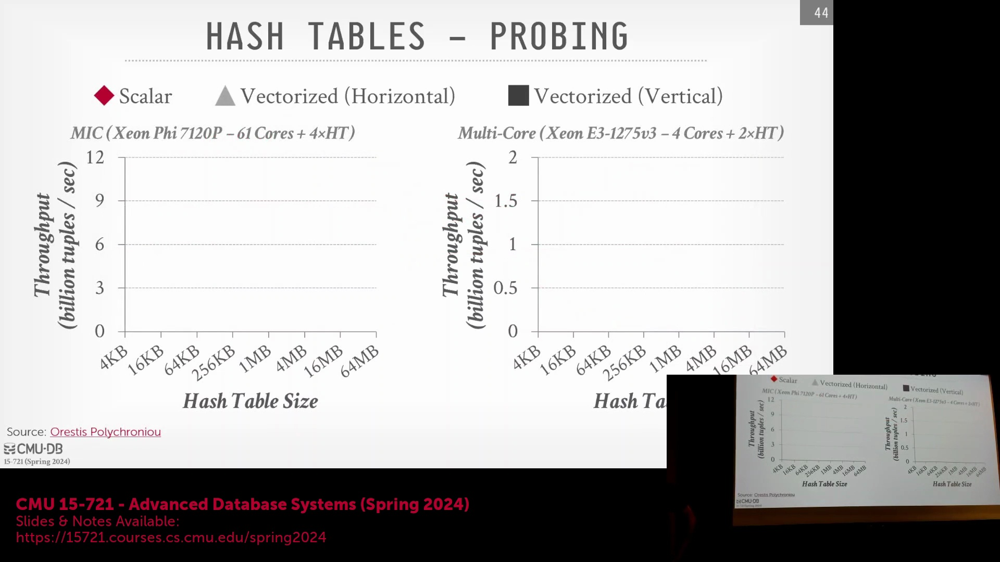
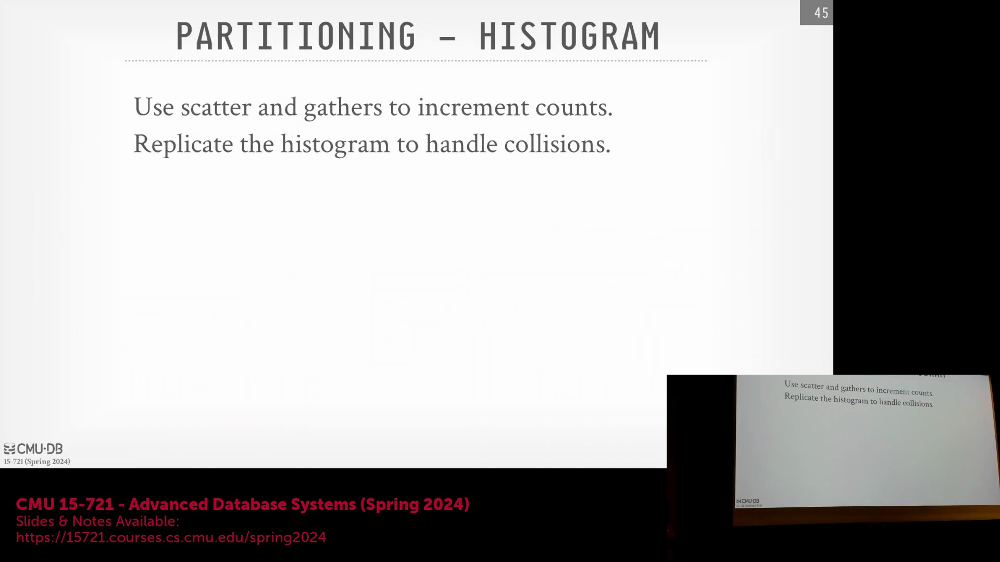
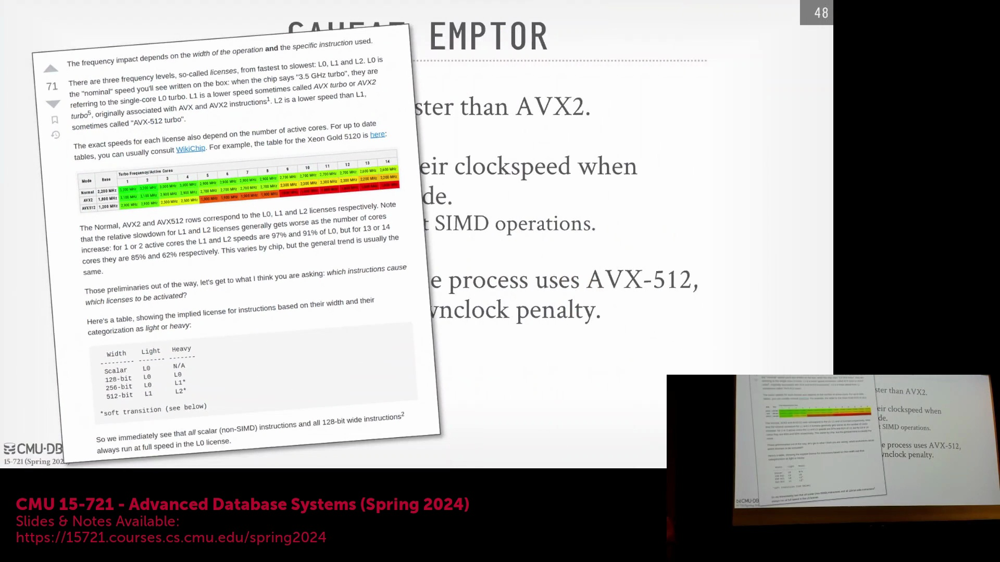

## 关系输出排序与调试权衡
哈希连接(Hash Join) 中的纵向向量化(Vertical Vectorization) 会并行处理多个探测键(Probe Key)，这本质上会导致结果解析与输出顺序的非确定性。尽管标准关系代数(Standard Relational Algebra) 并不强制要求严格的物理顺序，但这种非确定性在排查流水线异常(Pipeline Anomalies) 时，可能会增加调试(Debugging) 与结果复现(Result Reproducibility) 的难度。开发者必须认识到这一权衡(Trade-off)：正确的查询结果在不同次执行中可能会以不同的顺序呈现。

## 缓存驻留与现代处理器架构
SIMD 加速哈希连接(Hash Join) 的性能优势在很大程度上受限于内存层级(Memory Hierarchy) 的边界。当哈希表(Hash Table) 大小超出 CPU 缓存容量(CPU Cache Capacity) 时，受内存延迟(Memory Latency) 增加的影响，其相较于标量执行(Scalar Execution) 的吞吐量优势会迅速衰减。然而，现代处理器架构通过配备大容量三级缓存(L3 Cache) 显著缓解了该瓶颈，部分 AMD 芯片在单插槽(Single-Socket) 配置下即可提供高达 800MB 的缓存。通过策略性地将较小的数据集指定为连接的构建端(Build Side)，系统可使哈希结构完全驻留于缓存(Cache-Resident) 中，从而在避免内存访问性能损耗的前提下，充分释放 SIMD 的吞吐潜力。

## 无冲突 SIMD 直方图构建
在并行构建直方图(Parallel Histogram Construction) 时，若多个 SIMD 通道(SIMD Lane) 将不同的输入键哈希至同一桶(Bucket) 中，便会引发写入冲突(Write Conflict)。为避免使用代价高昂的原子操作(Atomic Operation) 或引入串行化(Serialization) 开销，系统会跨 SIMD 通道复制直方图数组(Histogram Array)，形成列式布局(Columnar Layout)，使每个通道仅在专属的内存区域进行累加。待所有通道完成本地计数(Local Counting) 后，系统通过一次横向归约操作(Horizontal Reduction) 将各列求和，最终合并为精确的全局直方图。该技术彻底消除了竞态条件(Race Condition)，同时保持了满额的向量通道利用率(Vector Lane Utilization)。

## AVX-512 降频现象
更宽的向量指令(Wider Vector Instructions) 并不自动等同于更快的执行速度。在许多 Intel 架构(Intel Architecture) 上，执行高负载的 AVX-512 工作负载会触发功耗与散热管理(Power and Thermal Management) 机制，导致 CPU 核心频率发生激进降频(Aggressive Downclocking)。这种动态频率调节(Dynamic Frequency Scaling) 往往会抵消 512 位寄存器带来的理论吞吐量收益(Theoretical Throughput Gain)，有时反而使 AVX-2 成为性能更优且更稳定的选择。AMD 处理器通常采用将 512 位操作拆分为成对的 256 位执行单元(256-bit Execution Units) 进行处理的方式，从而有效规避了该降频惩罚(Downclocking Penalty)，维持了时钟频率的稳定性。因此，GCC 和 Clang 等现代编译器(Compiler) 通常默认采用 AVX-2 内建函数(AVX-2 Intrinsics)。数据库工程师必须严格审查第三方库(Third-Party Libraries)，以防在生产环境负载(Production Workload) 中意外触发降频。

## 结论与查询执行的未来方向
尽管 SIMD 向量化(SIMD Vectorization) 是现代数据库引擎(Database Engine) 的核心优化技术，但唯有将其融入更宏观的执行策略(Execution Strategy) 中，方能释放最大效能。为最大化硬件效率(Hardware Efficiency)，系统需将核内并行(In-Core Parallelism) 与优化的数据布局(Optimized Data Layout) 紧密结合；这通常依托编译器自动向量化(Compiler Auto-Vectorization) 实现，并辅以定向内建函数(Targeted Intrinsics) 或硬件无关库(Hardware-Agnostic Libraries)。未来的演进方向聚焦于整体查询编译(Whole-Query Compilation)，该技术能够启用推送式(Push-Based)、以数据为中心(Data-Centric) 的执行模型。此架构允许对寄存器分配(Register Allocation)、缓存数据流转(Cache Data Movement) 及算子融合(Operator Fusion) 实施细粒度控制(Fine-Grained Control)，从而为下一代高度优化的查询处理器(Query Processor) 奠定坚实基础。
