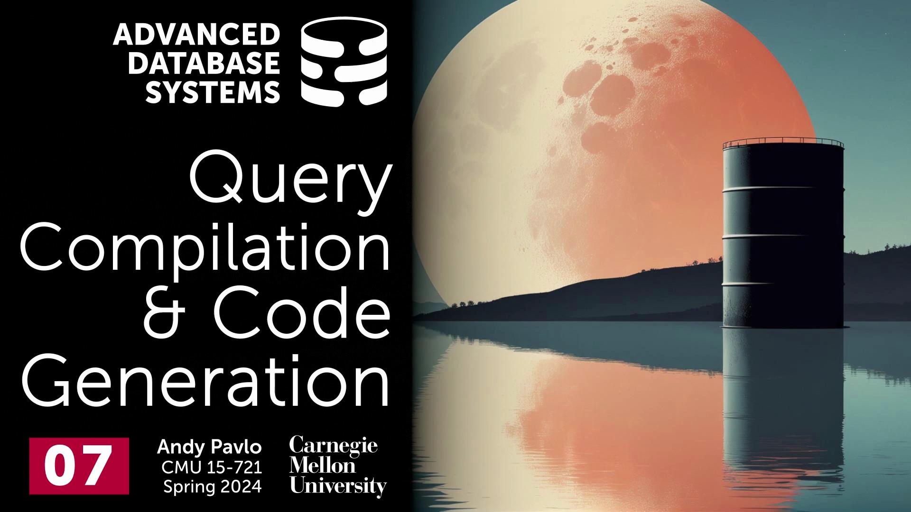
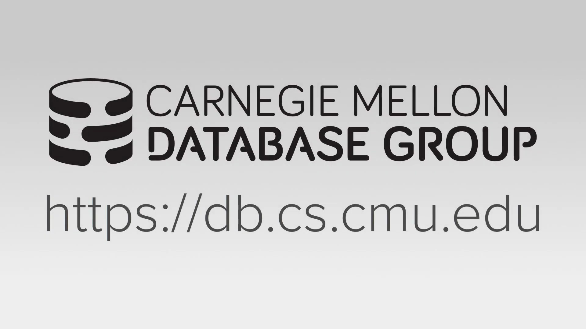
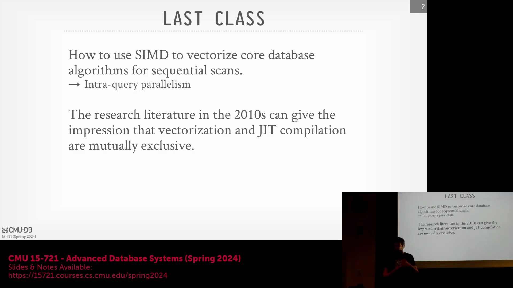
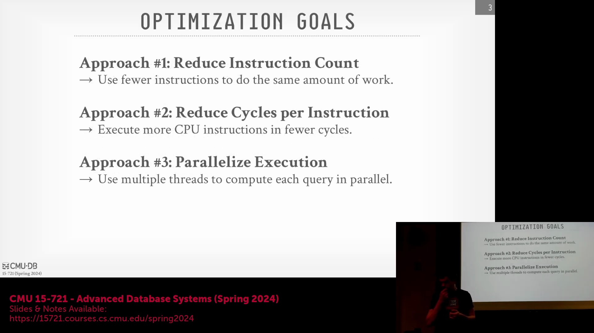
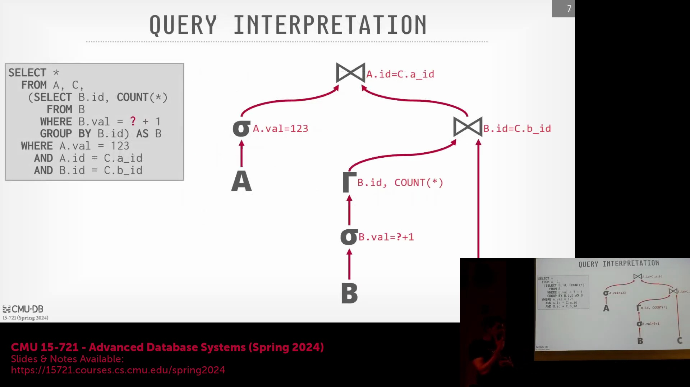
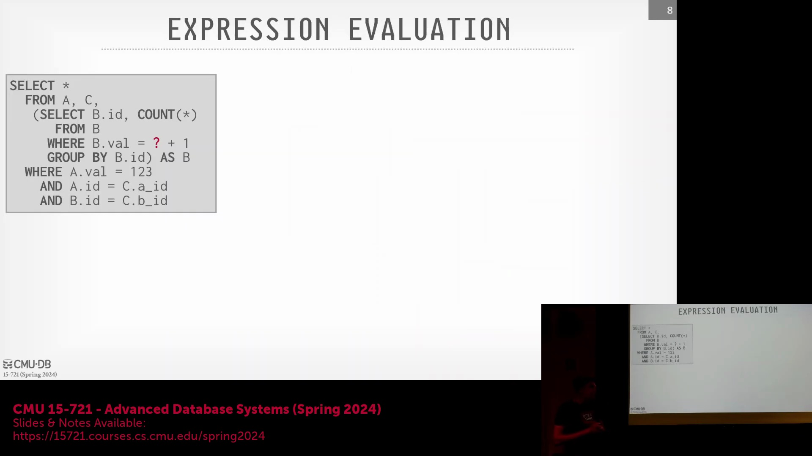
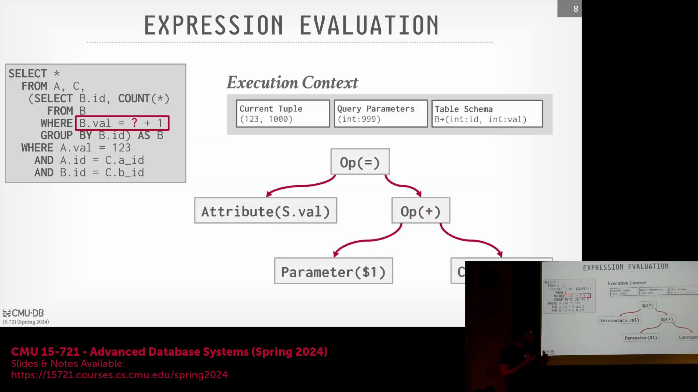

## 课程介绍与讲座范围

欢迎来到卡内基梅隆大学(Carnegie Mellon University)的高级数据库系统(Advanced Database Systems)课程。我们正式开始。在本次讲座中，我将尽可能全面地介绍查询编译(Query Compilation)与代码生成(Code Generation)的相关内容。

## 向量化与数据并行回顾

首先，我们将回顾上一讲的核心概念。我们探讨了如何利用 SIMD(Single Instruction, Multiple Data) 技术对核心数据库算法进行向量化(Vectorization)处理。 

这种方法实现了数据并行(Data Parallelism)，使数据库系统在处理多个元组时能够执行完全相同的指令序列。

## 查询编译与向量化：互补的技术

2011 年发表的关于查询编译与代码生成的奠基性论文，极大地推动了业界基于 LLVM 进行数据库查询优化的广泛研究。早期文献常给人造成一种误解，即向量化与编译技术是互斥的。尽管像 Hyper 数据库(Hyper) 的相关研究曾提出，采用推送模型(Push Model)和以数据为中心(Data-Centric)的处理策略可以替代向量化，但这两类技术在本质上并非互斥。在实际系统开发中，你完全可以且应当将两者结合使用。我们当前的重点是尽可能提升执行引擎(Execution Engine)的运行速度，尤其是针对顺序扫描(Sequential Scan)等基础操作。

## 代码特化与硬件效率的目标

代码特化(Code Specialization)的核心在于削减实际执行的指令数量。其目标是确保数据库系统仅执行特定查询所必需的精确指令，从而实质上为该查询生成一段定制化的硬编码程序。现代数据库系统会在后台处理异步 I/O(Asynchronous I/O)，通过预取大型 Parquet 或 ORC 文件来掩盖磁盘延迟(Disk Latency)。随着现代存储设备与网络设备的高速发展，CPU 执行已逐渐成为性能的关键瓶颈。业界著名研究指出，若要实现 10 倍的性能加速，需减少 90% 的指令执行量；而要实现 100 倍的加速，则需削减 99%。此类深度优化无法仅依赖标准的编译器标志(Compiler Flags)达成，必须借助代码特化进行针对性的工程设计。此外，我们还必须优化每条指令周期数(Cycles Per Instruction, CPI)。倘若剩余指令频繁停顿以等待 L3 缓存或主存数据，那么单纯减少指令数量将毫无意义。

## 代码生成方法：转译与嵌入式编译器
今天的讲座将探讨两种主流的代码生成技术。第一种是源码到源码编译(Source-to-Source Compilation)或称转译(Transpilation)，即数据库系统生成 C++ 或 Rust 等高级语言代码，随后交由传统编译器进行编译。第二种方法在 Hyper 的相关论文(Hyper-1)中有详细论述，其核心是在数据库内部直接生成低级中间表示(Low-Level Intermediate Representation, IR)，并调用 LLVM 等嵌入式编译器(Embedded Compiler)完成编译。这两种途径均能实现代码特化，但在工程复杂度与编译开销(Compilation Overhead)上各有取舍。在进入项目问答环节前，我们还将简要回顾采用这些不同技术路线的典型数据库系统。

## 通过特化消除运行时开销

代码特化的主要优势在于消除了大量用于判定算子类型、数据类型或进行表达式求值(Expression Evaluation)的 `switch` 语句与运行时虚函数表(Virtual Function Table, vtable)查找。得益于 SQL 的声明式特性，通过查询系统目录(System Catalog)，系统能够提前精确掌握所需的数据结构与查询语义。即便处理 Parquet 等外部数据格式，数据库亦可通过解析文件头验证数据模式(Schema)的对齐情况，进而触发相应的代码生成流程。传统由人工编写的代码（如经典的 Volcano/迭代器模型(Volcano/Iterator Model)）通常优先考虑工程便利性、可调试性与模块化。然而，此类设计中固有的间接调用与分支预测跳转对现代超标量处理器(Superscalar CPU)而言效率极低。机器生成的代码虽不具备人类可读性，却能够针对 CPU 的峰值性能进行极致优化。

## 传统执行模型的瓶颈

考虑一个涉及 A、B、C 三个表的三路连接(Three-Way Join)查询，该操作通常包含聚合(Aggregation)、过滤(Filtering)及连接逻辑。在 Volcano 模型下，各个算子会迭代获取子节点返回的元组、应用谓词条件(Predicate Conditions)，并将结果逐层向上推送。在运行时阶段，系统必须遍历基于指针构建的查询计划树(Query Plan Tree)，执行虚方法分派(Virtual Method Dispatch)，并通过函数指针动态解析抽象基类的具体实现。 

此类运行时开销会严重制约现代 CPU 的性能发挥。表达式求值同样存在严重的低效问题。以抽象表达式树(Abstract Expression Tree)形式表示的 `WHERE` 子句在求值时，需递归遍历每个节点、执行运算操作、查找查询上下文(Query Context)、绑定具体数值，并将中间结果逐层向上返回。这种低效的动态树遍历机制，充分凸显了采用编译期特化执行代码(Compiled Specialized Execution Code)的必要性。