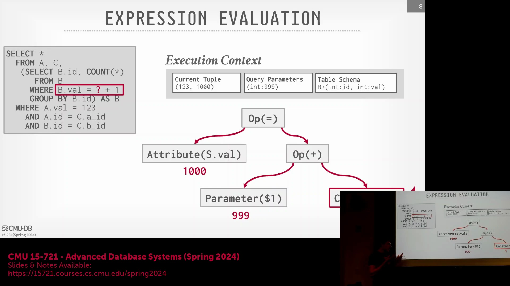
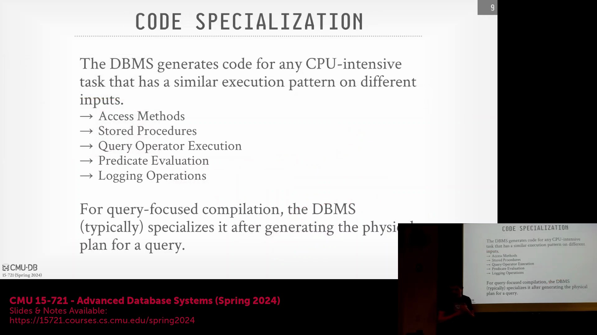
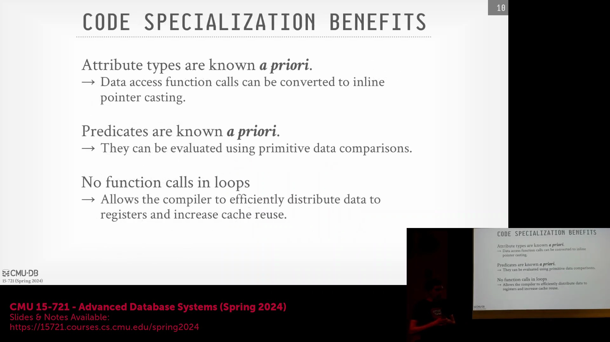
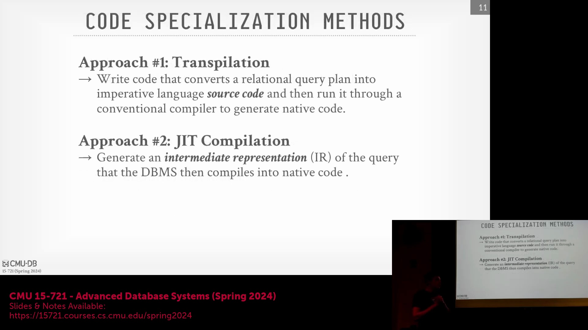
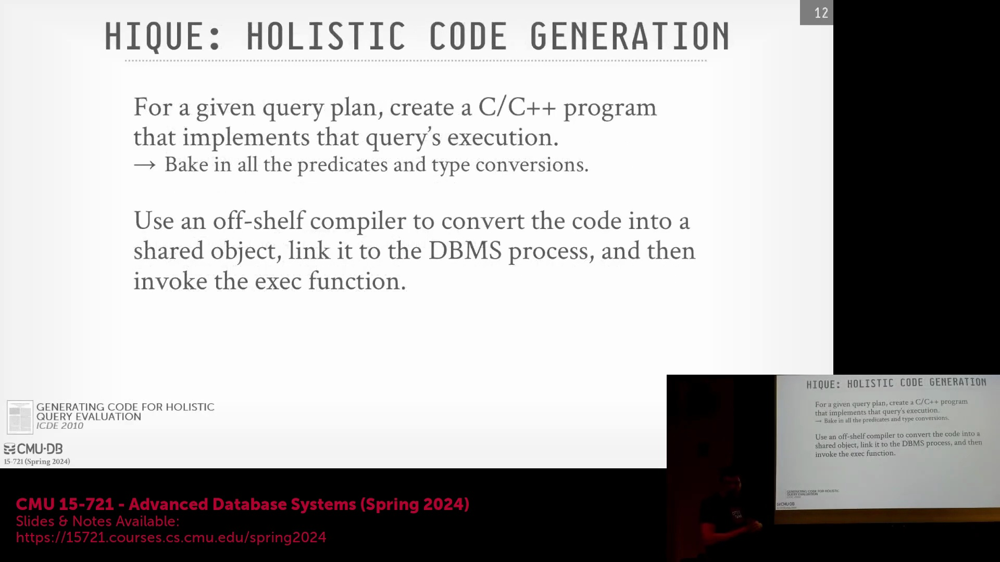
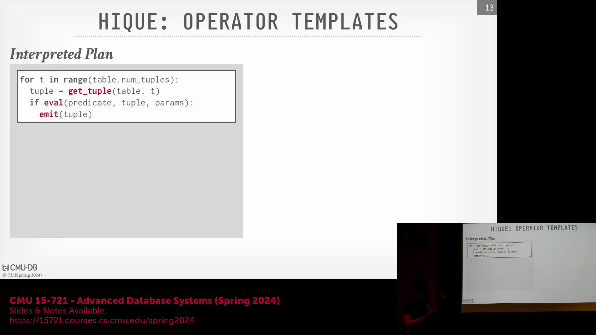

## 运行时解释的高昂代价

尽管部分简单系统在运行时通过递归遍历节点来对表达式树(Expression Tree)进行求值，但更先进的架构通过预先编译完全规避了此类开销。传统的执行引擎(Execution Engine)依然依赖庞大的 `switch` 语句或函数指针查找(Function Pointer Lookup)来动态解析算子(Operator)类型、数据类型以及 WHERE 子句(WHERE Clause)表达式。在顺序扫描(Sequential Scan)处理数十亿个元组(Tuple)时，反复执行这些运行时检查的代价将极其高昂。尽管现代 PostgreSQL 已针对谓词(Predicate)评估采用了即时编译(Just-In-Time, JIT)，但其旧版本依赖于直接线程化技术(Direct Threading)（一种基于指针数组的解释器），在处理繁重的分析型工作负载(Analytical Workload)时效率依然低下。

## 针对 CPU 密集型操作的优化

代码特化(Code Specialization)的核心原则是对查询执行中的 CPU 密集型(CPU-Intensive)部分进行激进优化，即针对引擎耗时最长的环节进行深度处理。通过消除运行时间接调用(Run-time Indirect Call)、类型查找(Type Lookup)和虚表分发(Virtual Table Dispatch)，生成的代码表现得宛如开发人员为该特定查询计划(Query Plan)手动编写的硬编码程序。这种特化可应用于多个数据库层级：访问方法(Access Method)与扫描、存储过程(Stored Procedure)（例如 Oracle 将 PL/SQL 编译为受限的 C 方言 Pro*C）、算子执行（如连接与聚合）以及谓词求值(Predicate Evaluation)。尽管从理论上讲可以为恢复机制中的日志解析器进行编译，但现代联机分析处理(Online Analytical Processing, OLAP)系统的核心焦点依然严格集中在查询执行路径上。

## 全量编译与部分编译策略
系统在代码生成范围上采用不同的策略。诸如 HyPer 和 HiQ 等研究型及现代分析引擎采用全量查询编译(Whole-Query Compilation)，它们接收完整的优化后物理执行计划(Physical Execution Plan)，并为整个执行流水线(Pipeline)生成特化的本机代码(Native Code)。相反，PostgreSQL、旧版 Apache Spark 和 QuestDB 等传统或混合系统通常将编译限制在特定的热点路径(Hot Path)上，最常见的是 WHERE 子句求值。这种部分编译(Partial Compilation)方法所需的工程开销显著更小，因为它避免了重写整个解释引擎(Interpreter Engine)。出于学术与教学演示目的，我们通常假设系统已通过外部沙盒或清理机制处理了安全边界，从而暂时忽略代码注入(Code Injection)等风险；而企业级数据库系统（如 Oracle、SQL Server）则通过将动态生成的代码严格限制在安全的 C 语言子集内来规避此类安全隐患。

## 编译期信息的威力

编译技术带来的主要性能优势，源于彻底消除了运行时的动态解析开销。由于物理执行计划已预先完全解析，系统能够确切掌握属性类型(Attribute Type)、列偏移量(Column Offset)、数据尺寸与压缩方案(Compression Scheme)。系统无需再应对运行时意外状况或执行动态类型检查(Dynamic Type Checking)。高层关系算子(Relational Operator)与复杂表达式可被精简为底层硬件原语(Hardware Primitive)（例如 `>`、`<`、`==`），直接映射至高速且支持流水线化的 CPU 指令。此外，特化代码会极力避免在紧凑循环(Tight Loop)内部进行函数调用。尽管向量化执行模型(Vectorized Execution Model)仍会保留部分函数调用，但其通过批量处理元组有效分摊了分支预测与跳转开销，相较于逐条元组迭代的传统方式，性能损耗已微乎其微。

## 代码生成的方法

生成优化查询代码主要有两种途径：转译(Transpilation，即源码到源码编译 Source-to-Source Compilation)与嵌入式中间表示(Intermediate Representation, IR)编译。在转译模式下，数据库系统内置了生成标准高级源代码（例如生成标准 C++ 代码）的逻辑模块。随后，生成的代码将被交付给传统的外部编译器以生成共享对象(Shared Object)，最终通过动态链接(Dynamic Linking)加载，并依据标准化的入口点签名(Entry Point Signature)执行。早期列式存储(Columnar Storage)系统与 Amazon Redshift 广泛推广了这一方法。相比之下，嵌入式 IR 方法直接在数据库内存中生成更低层的表示，随后调用 LLVM 等嵌入式编译器(Embedded Compiler)进行编译。该方案允许采用更灵活的执行策略，包括直接解释执行(Direct Interpretation)、本机机器代码(Native Machine Code)生成，甚至直接输出原始汇编代码。

## 编译开销问题

转译方法面临一个显著的性能瓶颈：外部编译器延迟。学术原型与早期生产系统通常采用 `fork-exec` 模式，将 GCC 作为独立的操作系统进程来编译生成的源代码。GCC 被设计为通用的命令行工具，而非用于数据库的进程内调用(In-Process Invocation)。它在启动时会产生显著开销，包括解析系统配置、定位标准库、处理复杂的链接器标志(Linker Flag)以及在进程创建期间分配内存。这种 `fork-exec` 模型会引入显著的延迟与 CPU 上下文切换(CPU Context Switching)，使其极不适用于短耗时查询或交互式查询的关键路径(Critical Path)。

## 工程权衡与执行逻辑

尽管存在编译开销，转译在工程简易性上具备显著优势。生成与调试标准 C++ 代码远比操作复杂的 LLVM IR 直观得多，这使得系统维护与性能剖析(Performance Profiling)更为便捷。为阐明其解决的运行时低效问题，考虑一个基础的 `get-tuple`（获取元组）操作。在解释执行模型中，系统必须在每次访问元组时反复查询系统目录(System Catalog)以获取模式信息(Schema Information)、计算块偏移量(Block Offset)、验证表边界并执行指针解引用(Pointer Dereferencing)。

通过代码特化，所有的目录查找、偏移量计算与类型解析均在编译期完成。生成的代码采用硬编码的类型尺寸与内联指针运算，直接访问固定且已知偏移量处的内存区域。该机制完全绕过了解释层(Interpreter Layer)，消除了冗余的条件分支，并为大规模数据扫描与处理带来了巨大的吞吐量(Throughput)提升。