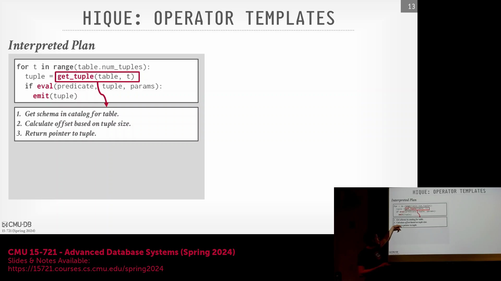
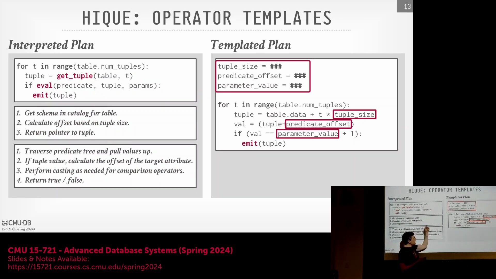
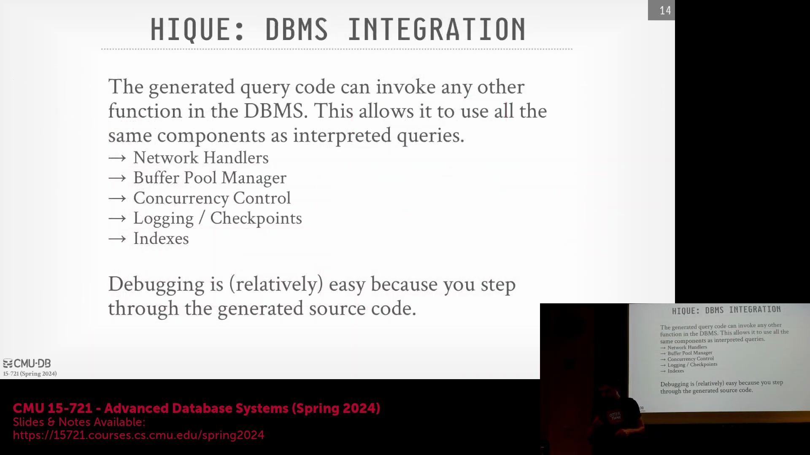
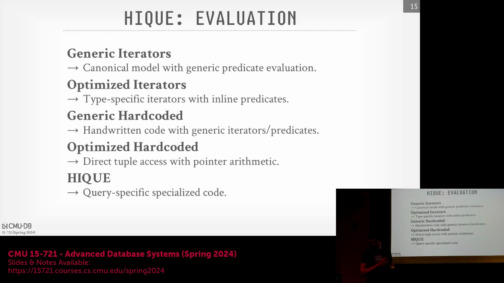
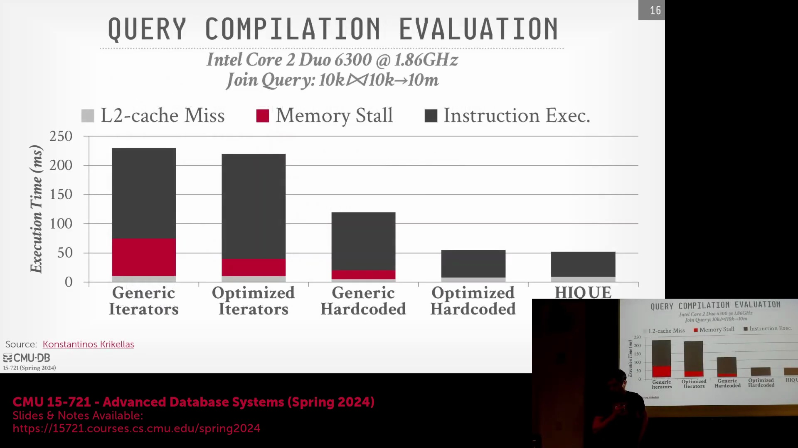

## 运行时解释的开销

传统数据库执行引擎(Execution Engine)通过在运行时动态遍历表达式树(Expression Tree)来对谓词(Predicate)进行求值。针对每个待处理的元组(Tuple)，系统必须提取数据值、遍历树节点、检查条件匹配、处理短路求值(Short-circuit Evaluation)、执行运行时类型转换(Runtime Type Casting)，并最终返回布尔结果。尽管这种高层级的解释逻辑在工程上易于实现，但在逐元组处理时重复执行动态查找与条件分支会引入巨大的冗余开销。在需要扫描数百万乃至数十亿行的分析型工作负载(Analytical Workload)中，此类解释瓶颈会严重制约系统的吞吐量(Throughput)与 CPU 利用效率。

## 将常量与逻辑嵌入生成的代码中

代码特化(Code Specialization)通过生成专为特定查询计划(Query Plan)定制的桩函数(Stub Function)，彻底消除了运行时解析的开销。所有的模式元数据(Schema Metadata)、元组尺寸(Tuple Size)、内存偏移量(Memory Offset)及列位置(Column Position)均被直接硬编码(Hard-coded)至编译后的二进制文件中，无需在执行期从系统目录(System Catalog)中动态获取。此外，生成的代码能够触发编译器更激进的优化策略，例如常量折叠(Constant Folding)。以 SQL 谓词 `value = input_param + 1` 为例，其中的 `+ 1` 算术运算会在编译期完成求值，并直接内联至机器码中。生成的 C++ 代码仅依赖标准运算符（如 `==`），这使得底层编译器能够施加最大深度的优化，同时完全规避了解释执行带来的额外损耗。

该架构能够无缝兼容复杂的 SQL 语法结构。由于生成的代码直接映射为原生 C++ 语言原语(Native C++ Primitives)，理论上任何 SQL 表达式——涵盖 `IN` 子句、数组操作(Array Operations)或嵌套条件逻辑——均可借助标准模板库(Standard Template Library, STL)或直接映射为 CPU 指令来实现。其唯一的限制在于需避免引入非标准的外部依赖，但核心执行逻辑总能被精准转化为高度优化且行为可预测的机器码(Machine Code)。

## 与数据库内部组件的无缝集成

源码到源码编译(Source-to-Source Compilation)的一项核心架构优势在于，其生成的代码在运行态上与静态编译至数据库内核的代码无异。由于数据库研发工程师直接掌控代码生成器(Code Generator)，他们能够无缝注入对任意内部子系统的调用请求——例如网络协议栈(Network Stack)、缓冲池管理器(Buffer Pool Manager)或事务管理器(Transaction Manager)——而无需依赖专用的桥接模块、外部函数接口(Foreign Function Interface, FFI)层，亦无需承受额外的上下文切换(Context Switching)开销。编译生成的共享对象(Shared Object)可直接链接数据库内部头文件与符号表，其行为表现与手工编写的引擎代码完全一致。尽管该方案要求开发者对内存生命周期(Memory Lifecycle)进行严格管控，但它为系统带来了无可比拟的执行灵活性与极致速度。

## 工程与调试优势
尽管相较于轻量级解释器或基于中间表示(Intermediate Representation, IR)的即时编译(Just-In-Time, JIT)方案，转译(Transpilation)具有较高的编译延迟(Compilation Latency)，但其在工程实践中提供了一项显著优势：卓越的可调试性(Debuggability)。当数据库生成标准 C++ 代码时，若发生崩溃，系统将输出可读的调用栈回溯(Stack Trace)与清晰的调试符号(Debug Symbols)。开发人员可直接挂载常规调试器（如 GDB 或 LLDB）以逐步跟踪编译后的执行逻辑并实时检查变量状态。为保障研发效率，代码生成器通常会在输出代码中嵌入元数据注释，将其精准映射回原始的查询计划节点(Query Plan Node)。这使得工程师能够直接针对**生成器逻辑(Code Generator Logic)**本身进行调试，而无需费力破译底层汇编代码或复杂的 LLVM IR，从而大幅降低了缺乏深厚编译器专业知识团队的系统维护负担。

## 性能基准测试：生成代码与手工优化代码

学术基准测试(Academic Benchmark)（尤以原始 Hyper 论文中的实验最为典型）系统性地对比了五个层级的执行模型(Execution Model)：基础的通用 Volcano 迭代器(Volcano Iterator)、C++ 模板特化迭代器(Template-specialized Iterator)、朴素的手工编码实现(Naive Hand-coded Implementation)、经过深度手工调优的版本(Manually Tuned Version)，以及最终的完全自动化代码生成(Fully Automated Code Generation)。值得注意的是，自动生成的 C++ 代码在性能上始终优于即便经过精心手工调优的实现方案。 

这一性能优势源于系统化且由编译器主导的优化机制(Compiler-driven Optimization)。传统手工编码需针对每种查询变体(Query Variant)单独进行调优，而设计精良的代码生成器则能集中应用各类优化策略：最大限度降低分支预测失败(Branch Misprediction)率、彻底消除动态内存分配(Dynamic Memory Allocation)，并积极实施函数内联(Function Inlining)。相关性能指标通常借助 CPU 硬件性能计数器(Hardware Performance Counters)（通过 `perf` 或 Intel VTune 等工具）进行采集。此类工具无需对目标代码进行插桩(Instrumentation)，即可精准追踪 L1/L2 缓存未命中率(Cache Miss Rate)、指令吞吐量(Instruction Throughput)及 CPU 流水线停顿(Pipeline Stall)情况。即便在现代硬件架构上，通过转译技术大幅削减 CPU 停顿时间，依然是构建高性能分析型数据库(Analytical Database)架构的基石。