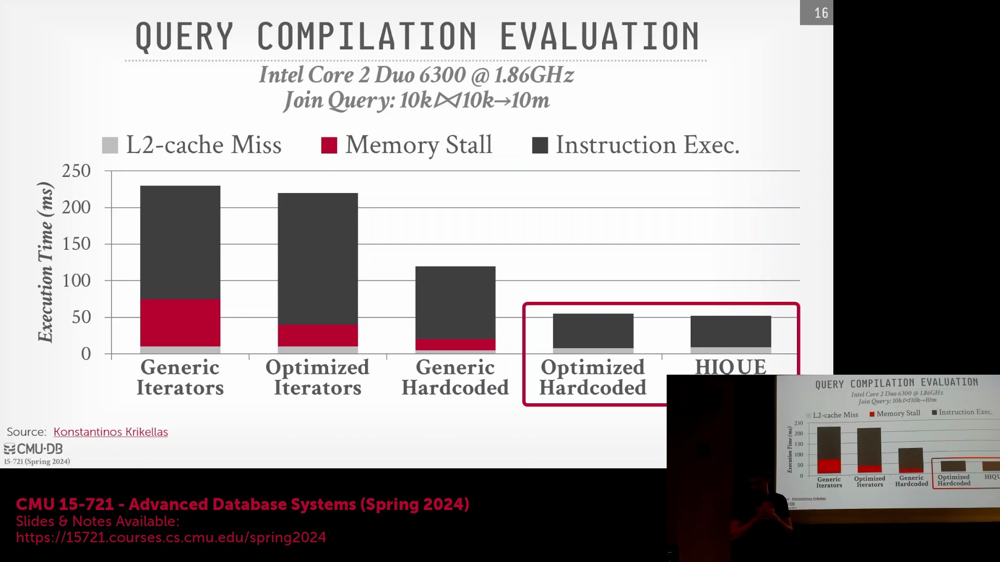
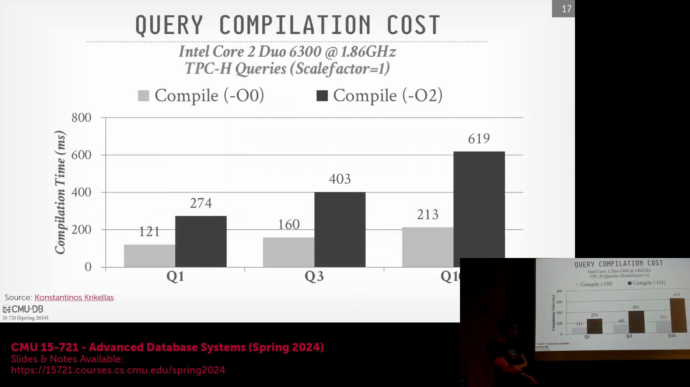
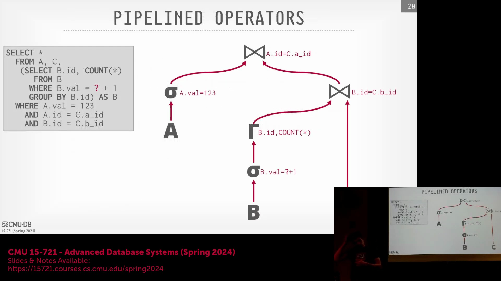
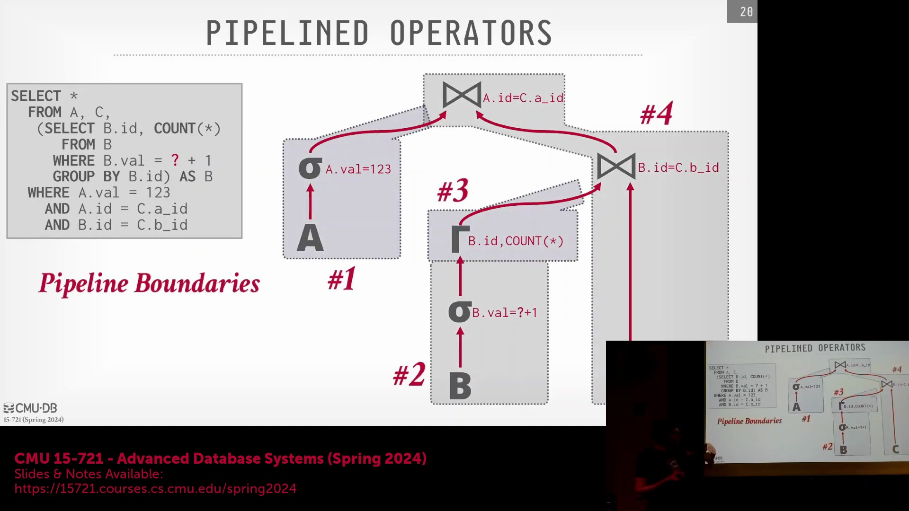
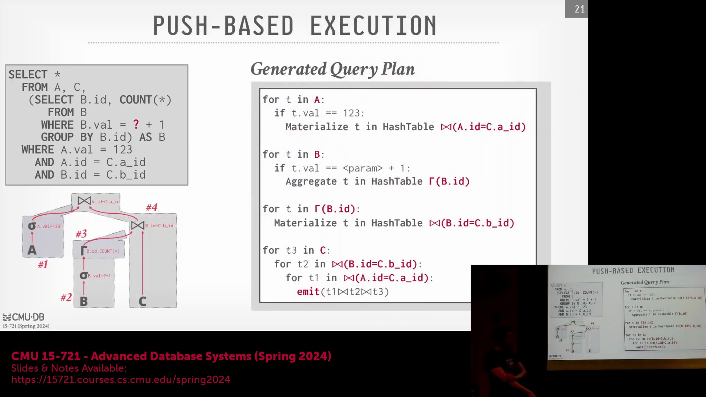
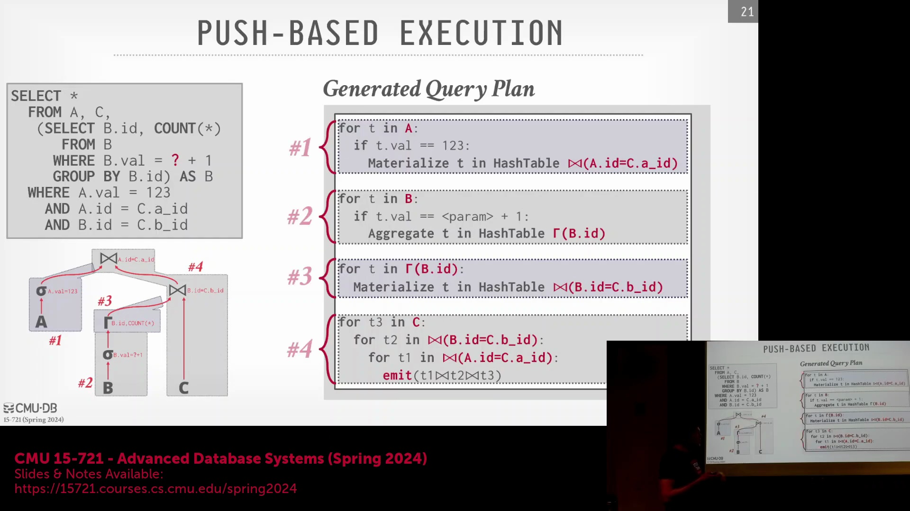
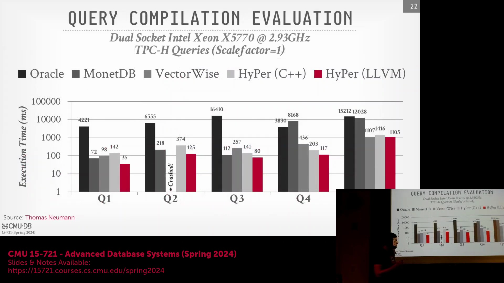

## 编译开销与优化权衡

尽管早期的基准测试(Benchmark)是在 Core 2 Duo 等过时硬件上进行的，但相对性能差异仍具有极高的参考价值。 

在编译生成的 C++ 代码时，编译器优化标志(Compiler Optimization Flag)对编译时间与执行速度均有显著影响。采用 `-O1`（较低优化级别）可加快编译速度，但运行时性能(Run-time Performance)较弱；而采用 `-O2`（标准发布优化级别）会使编译开销(Compilation Overhead)激增三倍。针对复杂查询，这可能导致编译时间超过 600 毫秒，远超优化后查询仅需 10~20 毫秒的执行时间。若编译耗时达到甚至超过查询执行时间，该开销将完全抵消即时编译(Just-In-Time, JIT)的优势，此时对于短耗时查询(Short-running Query)，传统的解释执行(Interpretation Execution)反而更具效率。

## 通过代码缓存缓解编译延迟
为缓解编译开销，生产系统在生产代码后并不会将其丢弃，而是积极缓存编译产物(Compiled Artifact)，尤其是针对参数化查询(Parameterized Query)或预编译语句(Prepared Statement)。通过将查询计划(Query Plan)抽象为可接收运行时参数(Runtime Parameter)的可复用函数(Reusable Function)，系统有效避免了对结构相同查询的重复编译。尽管该策略牺牲了全特化代码(Fully Specialized Code)所能带来的部分常量折叠(Constant Folding)优化机会，但它大幅降低了累积编译成本，其设计理念与向量化执行模型(Vectorized Execution Model)中采用的预编译算子库(Pre-compiled Operator Library)有异曲同工之妙。

## 直接生成 LLVM IR：HyPer 的方案
学术界的 HiQ 系统验证了转译为 C++ 的可行性，但其性能常受限于 GCC 沉重的启动成本(Startup Overhead)与进程创建(Fork)开销。为突破此瓶颈，HyPer 系统彻底摒弃了 C++ 代码生成环节，转而在数据库进程内直接通过 C++ 宏生成 LLVM 中间表示(Intermediate Representation, IR)。随后，这些 IR 被直接馈送至 LLVM 编译器后端(Compiler Backend)以生成原生机器码(Native Machine Code)。通过内嵌编译器(In-process Compiler)并跳过基于文本的 C++ 代码生成与解析阶段，HyPer 在达成同等高度优化机器码目标的同时，显著压降了编译开销。

## 推送型执行与算子融合

HyPer 架构的标志性特征在于将代码编译与推送型执行(Push-based Execution)模型深度融合。区别于传统的 Volcano 迭代器模型(Volcano Iterator Model)（即自下而上从算子树拉取元组），推送型模型将多个物理算子(Physical Operator)紧密融合。编译器生成的代码确保单个元组在引擎拉取下一行输入前，能够贯穿整个执行流水线(Execution Pipeline)完成全部处理。这种算子融合(Operator Fusion)彻底消除了虚函数调用(Virtual Function Call)、循环边界检查(Loop Boundary Check)及中间结果物化(Intermediate Materialization)的开销，使 CPU 在每次迭代中能够执行最大化的有效工作。

## 流水线依赖与执行顺序

查询计划被拆分为多个独立的执行流水线，并由哈希表构建(Hash Table Build)或排序(Sort)等操作充当“流水线阻断器(Pipeline Breaker)”进行物理分隔。此类阻断器强制规定：在上游流水线将中间结果完全物化(Materialize)之前，下游算子(Downstream Operator)不得启动处理。系统会构建有向无环依赖图(Dependency Graph)以调度流水线，允许无数据依赖的分支（如独立的哈希构建任务）并发执行(Concurrent Execution)，同时对存在依赖的连接(Join)或投影(Projection)阶段施加严格的拓扑执行顺序。

## 用于流水线处理的嵌套循环生成

为支撑推送型模型，LLVM 代码生成器(Code Generator)会输出深度嵌套的循环结构(Deeply Nested Loop Structure)。每一层循环精确对应一个流水线阶段，从而将原本树状的关系算子树(Relational Operator Tree)高效扁平化为单一、连续的执行流(Execution Stream)。以多表连接为例，编译器将生成嵌套循环以扫描驱动表(Driving Table)、探测首个哈希表(Probe Hash Table)、探测次级哈希表，并最终产出结果元组(Result Tuple)——所有逻辑均收敛于最内层循环作用域内。该架构确保元组一旦流入流水线，便能在系统拉取下一行输入前，完成全链路所需的数据处理。

## 最大化 CPU 寄存器利用率

算子融合的核心目标之一是最大化 CPU 寄存器级别的局部性(Register-level Locality)。通过在嵌套循环执行期间，将元组属性值与中间计算结果严格驻留于 CPU 寄存器(CPU Register)中，系统大幅削减了昂贵的内存溢出(Memory Spill)与缓存逐出(Cache Eviction)开销。编译器采用积极的寄存器分配策略(Register Allocation)，将物理寄存器映射至活跃的元组字段，从而避免在元组彻底退出融合流水线前，对主存(Main Memory)或缓冲池(Buffer Pool)发起冗余的加载(Load)与存储(Store)指令。

## 性能基准测试与系统对比

在与同期系统的基准测试(Benchmark)对比中，HyPer 基于 LLVM 的推送执行模型始终大幅领先于其早期的 C++ 转译原型及传统执行引擎。实验对标对象涵盖向量化系统(Vectorized System)、基于解释器的列式存储数据库(Columnar Storage Database)（如 MonetDB 的操作码执行器(Opcode Executor)），以及成熟的行式数据库(Row-store Database)（受商业许可限制，文中匿名标记为 `db.x`）。尽管绝对执行时间因硬件代际更迭而有所变化，但相对性能差距清晰印证了核心结论：经 LLVM 编译与寄存器深度优化的推送型执行，彻底剥离了 Volcano 模型及早期向量化迭代器固有的解释开销与分支预测失败(Branch Misprediction)损耗，从而奠定了其在联机分析处理(Online Analytical Processing, OLAP)领域的性能标杆地位。