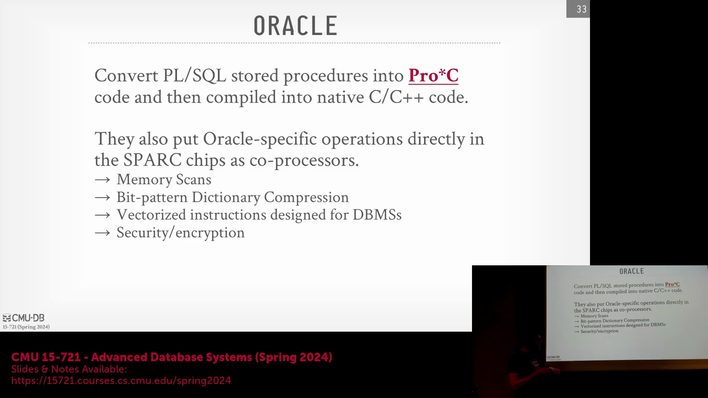
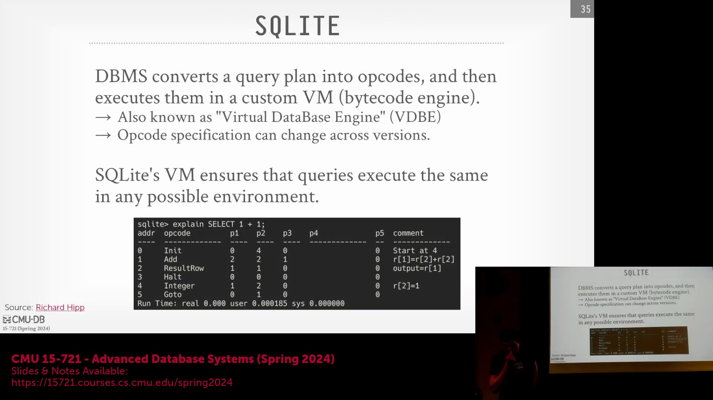
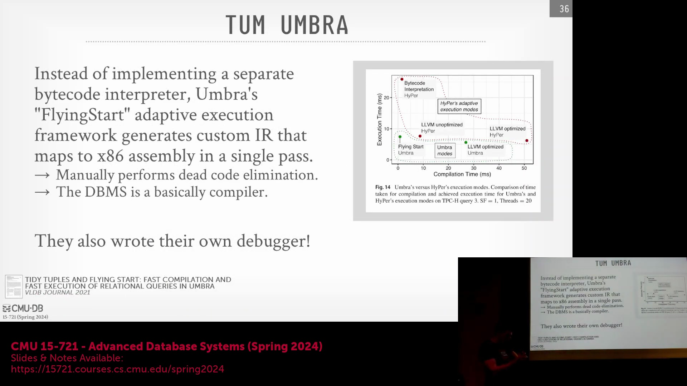
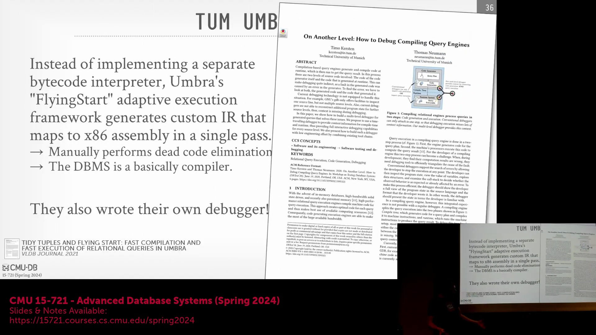
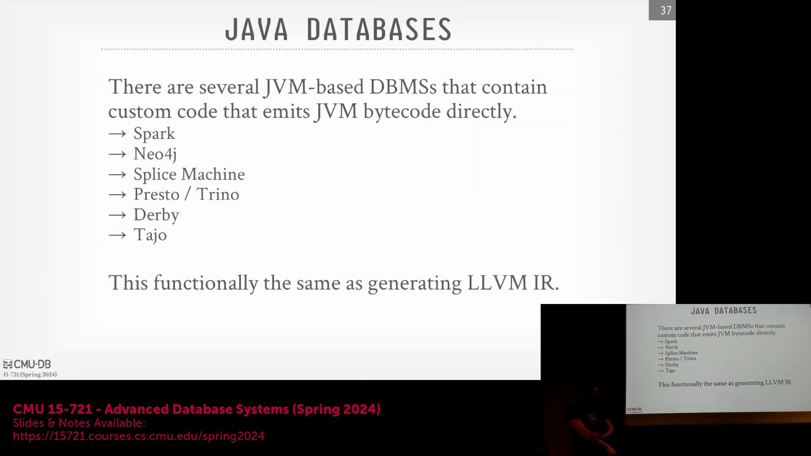
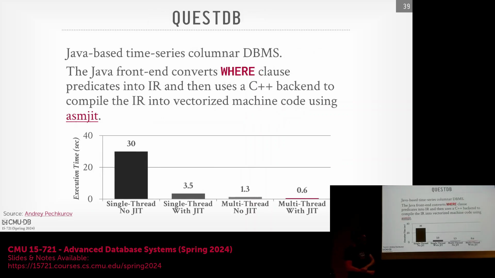

## Oracle、Hekaton 与硬件集成编译

传统数据库系统（如 Oracle）主要将转译(Transpilation)技术应用于存储过程(Stored Procedure)，而非标准 SQL 查询。PL/SQL 代码会被转换为 `Pro*C`（Oracle 专有的受限 C 语言方言(Restricted C Dialect)），随后编译为原生机器码(Native Machine Code)。通过严格限制生成的 C 语言子集，系统能够有效防止内存破坏(Memory Corruption)或非法跳转，从而确保其作为共享对象(Shared Object)安全执行。历史上，该理念曾与硬件级加速技术(Hardware Acceleration)高度契合。例如，Sun Microsystems 的 SPARC 处理器曾直接将数据压缩(Data Compression)等数据库操作固化至硅片(Silicon)中。类似地，Microsoft 的 Hekaton 内存数据库引擎(Memory-Optimized Database Engine)会将 SQL 语句与存储过程编译为 C 代码，并将其与公共语言运行时(Common Language Runtime, CLR)进行链接(Linking)。Hekaton 在生成的代码中内置了严格的缓冲区溢出(Buffer Overflow)防护与安全校验机制，以保障宿主环境(Host Environment)的稳定性。由于编译后的代码在同一地址空间(Address Space)内以共享对象形式运行，系统能够无缝调用其他 SQL Server 组件，充分展现了紧密集成编译模型(Tightly Integrated Compilation Model)的灵活性。

## SQLite 的可移植虚拟机架构

作为全球部署最广泛的数据库，SQLite 采用了一套独特的代码生成(Code Generation)策略，其核心目标是实现极致的可移植性(Portability)，而非盲目追求峰值性能。SQLite 并不直接生成原生机器码(Native Machine Code)，而是将查询计划(Query Plan)转化为一组专为定制虚拟机(Virtual Machine, VM)设计的自定义操作码序列(Custom Opcode Sequence)。在 SQLite 中执行 `EXPLAIN` 命令将输出该扁平化的 VM 指令列表(Instruction List)，而非传统的树状查询计划。该架构的核心理念是平台无关性(Architecture Independence)：为使数据库能在嵌入式设备、卫星或经过严格认证的航空系统中运行，且无需为每种新型指令集架构(Instruction Set Architecture, ISA)重写执行引擎，开发者仅需更新 VM 解释器(VM Interpreter)即可。生成的操作码在所有硬件平台上保持高度一致，而针对特定硬件的优化则完全封装于 VM 的 C 语言实现(C Implementation)之中。这种设计赋予了系统极高的可靠性(Reliability)与跨平台移植能力，代价则是放弃了即时编译器(JIT Compiler)中常见的深度硬件特定调优(Hardware-specific Tuning)。

## Umbra：直接汇编生成与反向调试

作为 HyPer 系统的继任者，Umbra 代表了对传统基于 LLVM 的即时编译(Just-In-Time, JIT Compilation)范式的彻底革新。Umbra 摒弃了生成 LLVM 中间表示(Intermediate Representation, IR)的传统路径，转而利用 C++ 宏直接从查询计划输出原始的 x86 或 ARM 汇编代码(Assembly Code)。随后，系统内置的自定义轻量级汇编器(Custom Lightweight Assembler)会将这些汇编指令直接翻译为机器码(Machine Code)。此举成功绕过了 LLVM 繁重的优化传递(Optimization Pass)，大幅缩减了编译启动时间(Compilation Startup Time)。Umbra 采用自适应执行模型(Adaptive Execution Model)：查询将立即基于快速生成的汇编代码启动执行，与此同时，后台线程会异步触发完整的 LLVM 优化流程。一旦高度优化的二进制文件(Highly Optimized Binary)准备就绪，执行引擎将在下一个任务边界(Task Boundary)无缝切换至该优化版本。为攻克动态汇编生成(Dynamic Assembly Generation)长期以来的调试(Debugging)难题，Umbra 团队自主研发了一款名为 "On Another Level" 的逆向调试器(Reverse Debugger)。该工具基于 `rr`(Record and Replay) 技术构建，能够将生成机器码中的运行时崩溃(Run-time Crash)精准回溯至原始的 C++ 代码生成逻辑行(Code Generation Logic)，使开发者能够依托完整的源码溯源信息，逐步排查(Query Troubleshooting)执行失败的查询。

## JVM 字节码与 Spark/Photon 的工程转向
基于 Java 的数据库系统通过生成 Java 虚拟机字节码(JVM Bytecode)而非 LLVM IR，以充分利用 JVM 生态中成熟的 HotSpot 编译器(HotSpot Compiler)。尽管该方案允许即时编译器自动完成向原生机器码的转换，但其背后隐含着显著的工程权衡(Engineering Trade-off)。Apache Spark 早期曾深入探索自定义代码生成(Custom Code Generation)，但 Databricks 随后果断转向，推出了 Photon 引擎——一个高度优化的向量化 C++ 执行层(Vectorized C++ Execution Layer)。这一战略转型(Strategic Pivot)主要源于高端人才的稀缺：精通编译器底层原理、汇编语言及 JIT 优化的专家极为难觅，而具备 C++ 向量化优化经验的工程师储备则相对充足。尽管自定义 JIT 编译可能在短期内带来性能红利，但向量化 C++ 引擎在长期可维护性(Long-term Maintainability)、更广泛的开发者社区贡献(Contributor Base)以及更敏捷的迭代周期(Iteration Cycle)上具备显著优势，最终为大规模分布式系统(Large-scale Distributed System)提供了更为卓越且可持续的性能表现。

## QuestDB：HFT 背景、JIT 与并行性的权衡

QuestDB 是一款源自英国、由前高频交易(High-Frequency Trading, HFT)工程师主导开发的时间序列列式数据库(Time-Series Columnar Database)，其架构展现了一种极为务实的 JIT 编译策略。QuestDB 并未对整个查询计划进行全量编译，而是聚焦于专门编译 `WHERE` 子句中的谓词逻辑(Predicate Logic)。系统采用 ASM（一款轻量级 Java 字节码操纵库(Java Bytecode Manipulation Library)，可视为极简版 LLVM）动态生成高度优化的 JVM 字节码。性能基准测试(Performance Benchmark)清晰揭示了其性能演进轨迹：基线单线程解释执行(Single-threaded Interpretation)耗时约 30 秒；引入 JIT 编译后骤降至约 3.5 秒；仅启用多线程(Multi-threading)亦能大幅超越基线；而将 JIT 编译与并行执行(Parallel Execution)深度融合，则能斩获绝对最优的性能表现。值得注意的是，QuestDB 优先实现了 JIT 功能，而后才补齐完整的并行处理能力，这在业界引发了关于系统功能开发优先级(Development Prioritization)的广泛探讨。尽管 JIT 技术能迅速带来单核性能(Single-core Performance)的跃升，但本次讲座着重强调：并行化通常能提供更广阔的横向扩展能力(Horizontal Scalability)。二者的有机结合，已然成为现代高性能分析引擎(High-performance Analytical Engine)的行业标准配置。