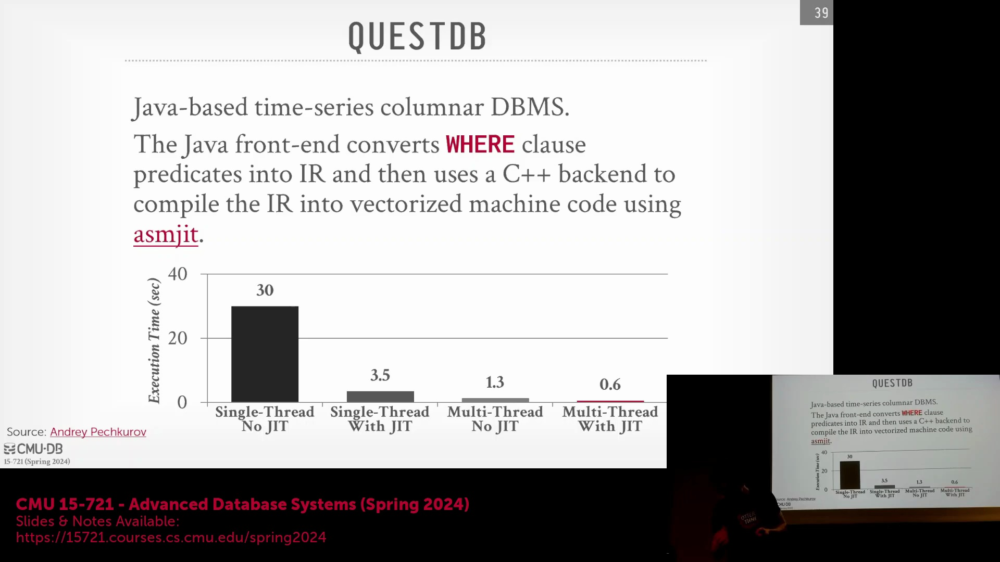
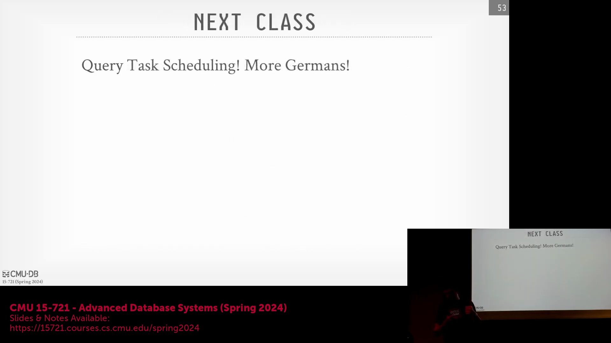

## 查询编译策略的总结

在总结代码生成(Code Generation)的相关讨论时，自适应的“单一存储(Single Store)”方法仍是编译型数据库(Compiled Database)最为务实的解决方案。通过将即时解释(Instant Interpretation)作为回退机制(Fallback Mechanism)与后台即时编译(Just-In-Time, JIT)相结合，开发人员获得了一个关键的调试层(Debugging Layer)，能够在不中断查询执行(Query Execution)的前提下精准定位故障。相比之下，“Flying Start”架构代表了一项极致的工程壮举(Engineering Feat)，其直接生成原始汇编代码(Raw Assembly Code)并配套先进的逆向调试工具(Reverse Debugger)。尽管该技术原理极为精妙，但如此深度的编译器集成(Compiler Integration)在实现与维护上均异常困难，这注定其只能作为特例存在，而非行业标准(Industry Standard)。

## 行业向向量化执行(Vectorized Execution)的转变

现代分析型系统(Analytical System)已大幅摒弃复杂的 JIT 编译与自定义汇编生成(Custom Assembly Generation)，转而全面拥抱向量化执行引擎(Vectorized Execution Engine)。正如 Databricks 关于 Photon 引擎的论文所强调的，此类架构选型(Architectural Choice)优先考量了工程可扩展性(Engineering Scalability)与长期可维护性(Long-term Maintainability)。尽管自定义代码编译(Custom Code Compilation)或许能带来边际的短期性能增益，但向量化技术显著降低了开发门槛，使更广泛的软件工程师群体得以参与代码库(Codebase)的优化与维护。这种协作优势(Collaborative Advantage)最终孕育出的数据库系统，在系统稳健性(System Robustness)与迭代演进速度(Iteration Speed)上，均全面超越了那些高度依赖专业编译器工程(Compiler Engineering)的架构。

## 课程总结：任务调度(Task Scheduling)与 Morsel 数据分块

接下来，课程的重心将从单节点执行模型(Single-node Execution Model)转向并行查询任务调度(Parallel Query Task Scheduling)。作为核心阅读材料(Core Reading Material)的《Morsels》论文将引入一项关键概念：将查询计划(Query Plan)拆解为离散的、数据驱动的数据分块(Data Chunks)。深入理解如何合理划分工作负载(Workload Partitioning)，并在可用 CPU 核心(CPU Core)上高效调度这些数据块，是构建高度并行(Highly Parallel)、多线程(Multi-threaded)数据库系统的基石。 

随着学期临近尾声，强烈建议同学们在当前的课程项目中，重点关注上述核心调度机制(Scheduling Mechanism)与并行化技术(Parallelization Technique)。精准把握高效执行引擎(Execution Engine)与智能任务分配(Intelligent Task Allocation)之间的平衡，将是成功构建现代高性能数据库架构(High-performance Database Architecture)的关键所在。