## 课程介绍与讲座范围

欢迎来到卡内基梅隆大学(Carnegie Mellon University)的高级数据库系统(Advanced Database Systems)课程。我们正式开始。在本次讲座中，我将尽可能全面地介绍查询编译(Query Compilation)与代码生成(Code Generation)的相关内容。

## 向量化与数据并行回顾

首先，我们将回顾上一讲的核心概念。我们探讨了如何利用 SIMD(Single Instruction, Multiple Data) 技术对核心数据库算法进行向量化(Vectorization)处理。 

这种方法实现了数据并行(Data Parallelism)，使数据库系统在处理多个元组时能够执行完全相同的指令序列。

## 查询编译与向量化：互补的技术

2011 年发表的关于查询编译与代码生成的奠基性论文，极大地推动了业界基于 LLVM 进行数据库查询优化的广泛研究。早期文献常给人造成一种误解，即向量化与编译技术是互斥的。尽管像 Hyper 数据库(Hyper) 的相关研究曾提出，采用推送模型(Push Model)和以数据为中心(Data-Centric)的处理策略可以替代向量化，但这两类技术在本质上并非互斥。在实际系统开发中，你完全可以且应当将两者结合使用。我们当前的重点是尽可能提升执行引擎(Execution Engine)的运行速度，尤其是针对顺序扫描(Sequential Scan)等基础操作。

## 代码特化与硬件效率的目标

代码特化(Code Specialization)的核心在于削减实际执行的指令数量。其目标是确保数据库系统仅执行特定查询所必需的精确指令，从而实质上为该查询生成一段定制化的硬编码程序。现代数据库系统会在后台处理异步 I/O(Asynchronous I/O)，通过预取大型 Parquet 或 ORC 文件来掩盖磁盘延迟(Disk Latency)。随着现代存储设备与网络设备的高速发展，CPU 执行已逐渐成为性能的关键瓶颈。业界著名研究指出，若要实现 10 倍的性能加速，需减少 90% 的指令执行量；而要实现 100 倍的加速，则需削减 99%。此类深度优化无法仅依赖标准的编译器标志(Compiler Flags)达成，必须借助代码特化进行针对性的工程设计。此外，我们还必须优化每条指令周期数(Cycles Per Instruction, CPI)。倘若剩余指令频繁停顿以等待 L3 缓存或主存数据，那么单纯减少指令数量将毫无意义。

## 代码生成方法：转译与嵌入式编译器
今天的讲座将探讨两种主流的代码生成技术。第一种是源码到源码编译(Source-to-Source Compilation)或称转译(Transpilation)，即数据库系统生成 C++ 或 Rust 等高级语言代码，随后交由传统编译器进行编译。第二种方法在 Hyper 的相关论文(Hyper-1)中有详细论述，其核心是在数据库内部直接生成低级中间表示(Low-Level Intermediate Representation, IR)，并调用 LLVM 等嵌入式编译器(Embedded Compiler)完成编译。这两种途径均能实现代码特化，但在工程复杂度与编译开销(Compilation Overhead)上各有取舍。在进入项目问答环节前，我们还将简要回顾采用这些不同技术路线的典型数据库系统。

## 通过特化消除运行时开销

代码特化的主要优势在于消除了大量用于判定算子类型、数据类型或进行表达式求值(Expression Evaluation)的 `switch` 语句与运行时虚函数表(Virtual Function Table, vtable)查找。得益于 SQL 的声明式特性，通过查询系统目录(System Catalog)，系统能够提前精确掌握所需的数据结构与查询语义。即便处理 Parquet 等外部数据格式，数据库亦可通过解析文件头验证数据模式(Schema)的对齐情况，进而触发相应的代码生成流程。传统由人工编写的代码（如经典的 Volcano/迭代器模型(Volcano/Iterator Model)）通常优先考虑工程便利性、可调试性与模块化。然而，此类设计中固有的间接调用与分支预测跳转对现代超标量处理器(Superscalar CPU)而言效率极低。机器生成的代码虽不具备人类可读性，却能够针对 CPU 的峰值性能进行极致优化。

## 传统执行模型的瓶颈

考虑一个涉及 A、B、C 三个表的三路连接(Three-Way Join)查询，该操作通常包含聚合(Aggregation)、过滤(Filtering)及连接逻辑。在 Volcano 模型下，各个算子会迭代获取子节点返回的元组、应用谓词条件(Predicate Conditions)，并将结果逐层向上推送。在运行时阶段，系统必须遍历基于指针构建的查询计划树(Query Plan Tree)，执行虚方法分派(Virtual Method Dispatch)，并通过函数指针动态解析抽象基类的具体实现。 

此类运行时开销会严重制约现代 CPU 的性能发挥。表达式求值同样存在严重的低效问题。以抽象表达式树(Abstract Expression Tree)形式表示的 `WHERE` 子句在求值时，需递归遍历每个节点、执行运算操作、查找查询上下文(Query Context)、绑定具体数值，并将中间结果逐层向上返回。这种低效的动态树遍历机制，充分凸显了采用编译期特化执行代码(Compiled Specialized Execution Code)的必要性。

---

## 运行时解释的高昂代价

尽管部分简单系统在运行时通过递归遍历节点来对表达式树(Expression Tree)进行求值，但更先进的架构通过预先编译完全规避了此类开销。传统的执行引擎(Execution Engine)依然依赖庞大的 `switch` 语句或函数指针查找(Function Pointer Lookup)来动态解析算子(Operator)类型、数据类型以及 WHERE 子句(WHERE Clause)表达式。在顺序扫描(Sequential Scan)处理数十亿个元组(Tuple)时，反复执行这些运行时检查的代价将极其高昂。尽管现代 PostgreSQL 已针对谓词(Predicate)评估采用了即时编译(Just-In-Time, JIT)，但其旧版本依赖于直接线程化技术(Direct Threading)（一种基于指针数组的解释器），在处理繁重的分析型工作负载(Analytical Workload)时效率依然低下。

## 针对 CPU 密集型操作的优化

代码特化(Code Specialization)的核心原则是对查询执行中的 CPU 密集型(CPU-Intensive)部分进行激进优化，即针对引擎耗时最长的环节进行深度处理。通过消除运行时间接调用(Run-time Indirect Call)、类型查找(Type Lookup)和虚表分发(Virtual Table Dispatch)，生成的代码表现得宛如开发人员为该特定查询计划(Query Plan)手动编写的硬编码程序。这种特化可应用于多个数据库层级：访问方法(Access Method)与扫描、存储过程(Stored Procedure)（例如 Oracle 将 PL/SQL 编译为受限的 C 方言 Pro*C）、算子执行（如连接与聚合）以及谓词求值(Predicate Evaluation)。尽管从理论上讲可以为恢复机制中的日志解析器进行编译，但现代联机分析处理(Online Analytical Processing, OLAP)系统的核心焦点依然严格集中在查询执行路径上。

## 全量编译与部分编译策略
系统在代码生成范围上采用不同的策略。诸如 HyPer 和 HiQ 等研究型及现代分析引擎采用全量查询编译(Whole-Query Compilation)，它们接收完整的优化后物理执行计划(Physical Execution Plan)，并为整个执行流水线(Pipeline)生成特化的本机代码(Native Code)。相反，PostgreSQL、旧版 Apache Spark 和 QuestDB 等传统或混合系统通常将编译限制在特定的热点路径(Hot Path)上，最常见的是 WHERE 子句求值。这种部分编译(Partial Compilation)方法所需的工程开销显著更小，因为它避免了重写整个解释引擎(Interpreter Engine)。出于学术与教学演示目的，我们通常假设系统已通过外部沙盒或清理机制处理了安全边界，从而暂时忽略代码注入(Code Injection)等风险；而企业级数据库系统（如 Oracle、SQL Server）则通过将动态生成的代码严格限制在安全的 C 语言子集内来规避此类安全隐患。

## 编译期信息的威力

编译技术带来的主要性能优势，源于彻底消除了运行时的动态解析开销。由于物理执行计划已预先完全解析，系统能够确切掌握属性类型(Attribute Type)、列偏移量(Column Offset)、数据尺寸与压缩方案(Compression Scheme)。系统无需再应对运行时意外状况或执行动态类型检查(Dynamic Type Checking)。高层关系算子(Relational Operator)与复杂表达式可被精简为底层硬件原语(Hardware Primitive)（例如 `>`、`<`、`==`），直接映射至高速且支持流水线化的 CPU 指令。此外，特化代码会极力避免在紧凑循环(Tight Loop)内部进行函数调用。尽管向量化执行模型(Vectorized Execution Model)仍会保留部分函数调用，但其通过批量处理元组有效分摊了分支预测与跳转开销，相较于逐条元组迭代的传统方式，性能损耗已微乎其微。

## 代码生成的方法

生成优化查询代码主要有两种途径：转译(Transpilation，即源码到源码编译 Source-to-Source Compilation)与嵌入式中间表示(Intermediate Representation, IR)编译。在转译模式下，数据库系统内置了生成标准高级源代码（例如生成标准 C++ 代码）的逻辑模块。随后，生成的代码将被交付给传统的外部编译器以生成共享对象(Shared Object)，最终通过动态链接(Dynamic Linking)加载，并依据标准化的入口点签名(Entry Point Signature)执行。早期列式存储(Columnar Storage)系统与 Amazon Redshift 广泛推广了这一方法。相比之下，嵌入式 IR 方法直接在数据库内存中生成更低层的表示，随后调用 LLVM 等嵌入式编译器(Embedded Compiler)进行编译。该方案允许采用更灵活的执行策略，包括直接解释执行(Direct Interpretation)、本机机器代码(Native Machine Code)生成，甚至直接输出原始汇编代码。

## 编译开销问题

转译方法面临一个显著的性能瓶颈：外部编译器延迟。学术原型与早期生产系统通常采用 `fork-exec` 模式，将 GCC 作为独立的操作系统进程来编译生成的源代码。GCC 被设计为通用的命令行工具，而非用于数据库的进程内调用(In-Process Invocation)。它在启动时会产生显著开销，包括解析系统配置、定位标准库、处理复杂的链接器标志(Linker Flag)以及在进程创建期间分配内存。这种 `fork-exec` 模型会引入显著的延迟与 CPU 上下文切换(CPU Context Switching)，使其极不适用于短耗时查询或交互式查询的关键路径(Critical Path)。

## 工程权衡与执行逻辑

尽管存在编译开销，转译在工程简易性上具备显著优势。生成与调试标准 C++ 代码远比操作复杂的 LLVM IR 直观得多，这使得系统维护与性能剖析(Performance Profiling)更为便捷。为阐明其解决的运行时低效问题，考虑一个基础的 `get-tuple`（获取元组）操作。在解释执行模型中，系统必须在每次访问元组时反复查询系统目录(System Catalog)以获取模式信息(Schema Information)、计算块偏移量(Block Offset)、验证表边界并执行指针解引用(Pointer Dereferencing)。

通过代码特化，所有的目录查找、偏移量计算与类型解析均在编译期完成。生成的代码采用硬编码的类型尺寸与内联指针运算，直接访问固定且已知偏移量处的内存区域。该机制完全绕过了解释层(Interpreter Layer)，消除了冗余的条件分支，并为大规模数据扫描与处理带来了巨大的吞吐量(Throughput)提升。

---

## 运行时解释的开销

传统数据库执行引擎(Execution Engine)通过在运行时动态遍历表达式树(Expression Tree)来对谓词(Predicate)进行求值。针对每个待处理的元组(Tuple)，系统必须提取数据值、遍历树节点、检查条件匹配、处理短路求值(Short-circuit Evaluation)、执行运行时类型转换(Runtime Type Casting)，并最终返回布尔结果。尽管这种高层级的解释逻辑在工程上易于实现，但在逐元组处理时重复执行动态查找与条件分支会引入巨大的冗余开销。在需要扫描数百万乃至数十亿行的分析型工作负载(Analytical Workload)中，此类解释瓶颈会严重制约系统的吞吐量(Throughput)与 CPU 利用效率。

## 将常量与逻辑嵌入生成的代码中

代码特化(Code Specialization)通过生成专为特定查询计划(Query Plan)定制的桩函数(Stub Function)，彻底消除了运行时解析的开销。所有的模式元数据(Schema Metadata)、元组尺寸(Tuple Size)、内存偏移量(Memory Offset)及列位置(Column Position)均被直接硬编码(Hard-coded)至编译后的二进制文件中，无需在执行期从系统目录(System Catalog)中动态获取。此外，生成的代码能够触发编译器更激进的优化策略，例如常量折叠(Constant Folding)。以 SQL 谓词 `value = input_param + 1` 为例，其中的 `+ 1` 算术运算会在编译期完成求值，并直接内联至机器码中。生成的 C++ 代码仅依赖标准运算符（如 `==`），这使得底层编译器能够施加最大深度的优化，同时完全规避了解释执行带来的额外损耗。

该架构能够无缝兼容复杂的 SQL 语法结构。由于生成的代码直接映射为原生 C++ 语言原语(Native C++ Primitives)，理论上任何 SQL 表达式——涵盖 `IN` 子句、数组操作(Array Operations)或嵌套条件逻辑——均可借助标准模板库(Standard Template Library, STL)或直接映射为 CPU 指令来实现。其唯一的限制在于需避免引入非标准的外部依赖，但核心执行逻辑总能被精准转化为高度优化且行为可预测的机器码(Machine Code)。

## 与数据库内部组件的无缝集成

源码到源码编译(Source-to-Source Compilation)的一项核心架构优势在于，其生成的代码在运行态上与静态编译至数据库内核的代码无异。由于数据库研发工程师直接掌控代码生成器(Code Generator)，他们能够无缝注入对任意内部子系统的调用请求——例如网络协议栈(Network Stack)、缓冲池管理器(Buffer Pool Manager)或事务管理器(Transaction Manager)——而无需依赖专用的桥接模块、外部函数接口(Foreign Function Interface, FFI)层，亦无需承受额外的上下文切换(Context Switching)开销。编译生成的共享对象(Shared Object)可直接链接数据库内部头文件与符号表，其行为表现与手工编写的引擎代码完全一致。尽管该方案要求开发者对内存生命周期(Memory Lifecycle)进行严格管控，但它为系统带来了无可比拟的执行灵活性与极致速度。

## 工程与调试优势
尽管相较于轻量级解释器或基于中间表示(Intermediate Representation, IR)的即时编译(Just-In-Time, JIT)方案，转译(Transpilation)具有较高的编译延迟(Compilation Latency)，但其在工程实践中提供了一项显著优势：卓越的可调试性(Debuggability)。当数据库生成标准 C++ 代码时，若发生崩溃，系统将输出可读的调用栈回溯(Stack Trace)与清晰的调试符号(Debug Symbols)。开发人员可直接挂载常规调试器（如 GDB 或 LLDB）以逐步跟踪编译后的执行逻辑并实时检查变量状态。为保障研发效率，代码生成器通常会在输出代码中嵌入元数据注释，将其精准映射回原始的查询计划节点(Query Plan Node)。这使得工程师能够直接针对**生成器逻辑(Code Generator Logic)**本身进行调试，而无需费力破译底层汇编代码或复杂的 LLVM IR，从而大幅降低了缺乏深厚编译器专业知识团队的系统维护负担。

## 性能基准测试：生成代码与手工优化代码

学术基准测试(Academic Benchmark)（尤以原始 Hyper 论文中的实验最为典型）系统性地对比了五个层级的执行模型(Execution Model)：基础的通用 Volcano 迭代器(Volcano Iterator)、C++ 模板特化迭代器(Template-specialized Iterator)、朴素的手工编码实现(Naive Hand-coded Implementation)、经过深度手工调优的版本(Manually Tuned Version)，以及最终的完全自动化代码生成(Fully Automated Code Generation)。值得注意的是，自动生成的 C++ 代码在性能上始终优于即便经过精心手工调优的实现方案。 

这一性能优势源于系统化且由编译器主导的优化机制(Compiler-driven Optimization)。传统手工编码需针对每种查询变体(Query Variant)单独进行调优，而设计精良的代码生成器则能集中应用各类优化策略：最大限度降低分支预测失败(Branch Misprediction)率、彻底消除动态内存分配(Dynamic Memory Allocation)，并积极实施函数内联(Function Inlining)。相关性能指标通常借助 CPU 硬件性能计数器(Hardware Performance Counters)（通过 `perf` 或 Intel VTune 等工具）进行采集。此类工具无需对目标代码进行插桩(Instrumentation)，即可精准追踪 L1/L2 缓存未命中率(Cache Miss Rate)、指令吞吐量(Instruction Throughput)及 CPU 流水线停顿(Pipeline Stall)情况。即便在现代硬件架构上，通过转译技术大幅削减 CPU 停顿时间，依然是构建高性能分析型数据库(Analytical Database)架构的基石。

---

## 编译开销与优化权衡

尽管早期的基准测试(Benchmark)是在 Core 2 Duo 等过时硬件上进行的，但相对性能差异仍具有极高的参考价值。 

在编译生成的 C++ 代码时，编译器优化标志(Compiler Optimization Flag)对编译时间与执行速度均有显著影响。采用 `-O1`（较低优化级别）可加快编译速度，但运行时性能(Run-time Performance)较弱；而采用 `-O2`（标准发布优化级别）会使编译开销(Compilation Overhead)激增三倍。针对复杂查询，这可能导致编译时间超过 600 毫秒，远超优化后查询仅需 10~20 毫秒的执行时间。若编译耗时达到甚至超过查询执行时间，该开销将完全抵消即时编译(Just-In-Time, JIT)的优势，此时对于短耗时查询(Short-running Query)，传统的解释执行(Interpretation Execution)反而更具效率。

## 通过代码缓存缓解编译延迟
为缓解编译开销，生产系统在生产代码后并不会将其丢弃，而是积极缓存编译产物(Compiled Artifact)，尤其是针对参数化查询(Parameterized Query)或预编译语句(Prepared Statement)。通过将查询计划(Query Plan)抽象为可接收运行时参数(Runtime Parameter)的可复用函数(Reusable Function)，系统有效避免了对结构相同查询的重复编译。尽管该策略牺牲了全特化代码(Fully Specialized Code)所能带来的部分常量折叠(Constant Folding)优化机会，但它大幅降低了累积编译成本，其设计理念与向量化执行模型(Vectorized Execution Model)中采用的预编译算子库(Pre-compiled Operator Library)有异曲同工之妙。

## 直接生成 LLVM IR：HyPer 的方案
学术界的 HiQ 系统验证了转译为 C++ 的可行性，但其性能常受限于 GCC 沉重的启动成本(Startup Overhead)与进程创建(Fork)开销。为突破此瓶颈，HyPer 系统彻底摒弃了 C++ 代码生成环节，转而在数据库进程内直接通过 C++ 宏生成 LLVM 中间表示(Intermediate Representation, IR)。随后，这些 IR 被直接馈送至 LLVM 编译器后端(Compiler Backend)以生成原生机器码(Native Machine Code)。通过内嵌编译器(In-process Compiler)并跳过基于文本的 C++ 代码生成与解析阶段，HyPer 在达成同等高度优化机器码目标的同时，显著压降了编译开销。

## 推送型执行与算子融合

HyPer 架构的标志性特征在于将代码编译与推送型执行(Push-based Execution)模型深度融合。区别于传统的 Volcano 迭代器模型(Volcano Iterator Model)（即自下而上从算子树拉取元组），推送型模型将多个物理算子(Physical Operator)紧密融合。编译器生成的代码确保单个元组在引擎拉取下一行输入前，能够贯穿整个执行流水线(Execution Pipeline)完成全部处理。这种算子融合(Operator Fusion)彻底消除了虚函数调用(Virtual Function Call)、循环边界检查(Loop Boundary Check)及中间结果物化(Intermediate Materialization)的开销，使 CPU 在每次迭代中能够执行最大化的有效工作。

## 流水线依赖与执行顺序

查询计划被拆分为多个独立的执行流水线，并由哈希表构建(Hash Table Build)或排序(Sort)等操作充当“流水线阻断器(Pipeline Breaker)”进行物理分隔。此类阻断器强制规定：在上游流水线将中间结果完全物化(Materialize)之前，下游算子(Downstream Operator)不得启动处理。系统会构建有向无环依赖图(Dependency Graph)以调度流水线，允许无数据依赖的分支（如独立的哈希构建任务）并发执行(Concurrent Execution)，同时对存在依赖的连接(Join)或投影(Projection)阶段施加严格的拓扑执行顺序。

## 用于流水线处理的嵌套循环生成

为支撑推送型模型，LLVM 代码生成器(Code Generator)会输出深度嵌套的循环结构(Deeply Nested Loop Structure)。每一层循环精确对应一个流水线阶段，从而将原本树状的关系算子树(Relational Operator Tree)高效扁平化为单一、连续的执行流(Execution Stream)。以多表连接为例，编译器将生成嵌套循环以扫描驱动表(Driving Table)、探测首个哈希表(Probe Hash Table)、探测次级哈希表，并最终产出结果元组(Result Tuple)——所有逻辑均收敛于最内层循环作用域内。该架构确保元组一旦流入流水线，便能在系统拉取下一行输入前，完成全链路所需的数据处理。

## 最大化 CPU 寄存器利用率

算子融合的核心目标之一是最大化 CPU 寄存器级别的局部性(Register-level Locality)。通过在嵌套循环执行期间，将元组属性值与中间计算结果严格驻留于 CPU 寄存器(CPU Register)中，系统大幅削减了昂贵的内存溢出(Memory Spill)与缓存逐出(Cache Eviction)开销。编译器采用积极的寄存器分配策略(Register Allocation)，将物理寄存器映射至活跃的元组字段，从而避免在元组彻底退出融合流水线前，对主存(Main Memory)或缓冲池(Buffer Pool)发起冗余的加载(Load)与存储(Store)指令。

## 性能基准测试与系统对比

在与同期系统的基准测试(Benchmark)对比中，HyPer 基于 LLVM 的推送执行模型始终大幅领先于其早期的 C++ 转译原型及传统执行引擎。实验对标对象涵盖向量化系统(Vectorized System)、基于解释器的列式存储数据库(Columnar Storage Database)（如 MonetDB 的操作码执行器(Opcode Executor)），以及成熟的行式数据库(Row-store Database)（受商业许可限制，文中匿名标记为 `db.x`）。尽管绝对执行时间因硬件代际更迭而有所变化，但相对性能差距清晰印证了核心结论：经 LLVM 编译与寄存器深度优化的推送型执行，彻底剥离了 Volcano 模型及早期向量化迭代器固有的解释开销与分支预测失败(Branch Misprediction)损耗，从而奠定了其在联机分析处理(Online Analytical Processing, OLAP)领域的性能标杆地位。

---

## 寄存器控制与性能优势
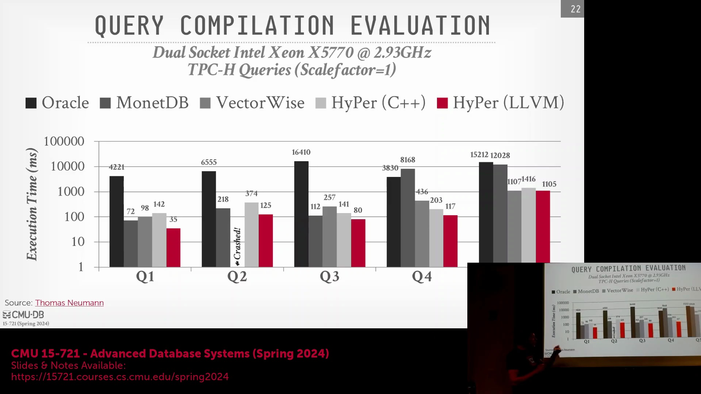
HyPer 基于 LLVM 的方案始终优于早期的 C++ 转译(Transpilation)系统，因为直接生成 LLVM 中间表示(Intermediate Representation, IR)能够对寄存器分配(Register Allocation)提供精确的底层控制。在转译模型中，系统需依赖外部 C++ 编译器以启发式方式(Heuristic Approach)决定数据的寄存器驻留策略，这通常难以最大化流水线执行效率。相比之下，LLVM 代码生成(Code Generation)允许数据库在整个推送型执行流水线(Push-based Execution Pipeline)中，显式地将元组数据驻留于 CPU 寄存器(CPU Register)内。即便是仅涉及聚合(Aggregation)与过滤(Filtering)（无复杂连接）的简单查询，此类激进的流水线处理与寄存器驻留技术亦能带来显著的性能跃升，使执行速度逼近硬件“裸机”(Bare-metal)极限。

## 编译开销与内存优化
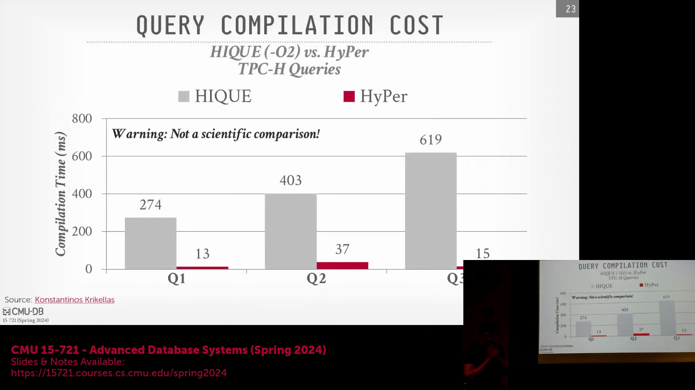
转译方案的主要缺陷在于派生外部编译器进程所引发的巨大编译延迟(Compilation Latency)。HyPer 通过将 LLVM 编译器直接嵌入数据库的地址空间(Address Space)，并在系统启动时完成一次性初始化，从而彻底规避了此问题。编译任务在专用的后台线程中执行，消除了重复的进程创建(Process Creation)、动态库加载(Dynamic Library Loading)及编译器配置解析开销。此项架构优化将编译耗时大幅压缩至 20 毫秒以内，使其得以切实应用于分析型工作负载(Analytical Workload)。即便仅对比纯执行时间（剔除编译耗时），得益于其卓越的推送型模型(Push-based Model)与确定性的寄存器管理(Deterministic Register Management)，HyPer 生成的原生 LLVM 代码依然展现出更快的执行速度。

## 即席查询瓶颈
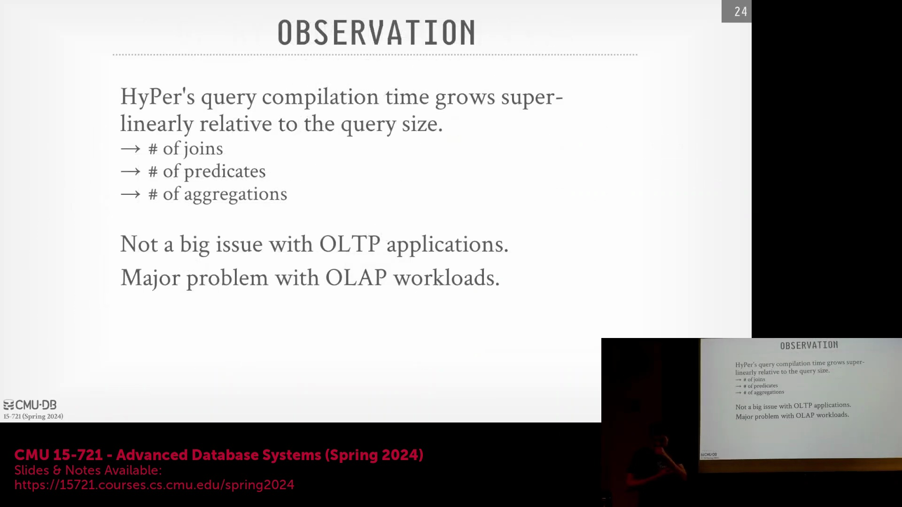
尽管联机事务处理(Online Transaction Processing, OLTP)系统可通过缓存预编译语句(Prepared Statement)轻松缓解编译开销，但联机分析处理(Online Analytical Processing, OLAP)环境常需执行高度不可预测的即席查询(Ad-hoc Query)，其编译成本往往随查询复杂度呈超线性增长(Super-linear Growth)。一个典型的现实案例是：当 HyPer 作为兼容 PostgreSQL 的加速插件集成至 Tableau 时，若通过 pgAdmin 连接数据库，系统会立即触发复杂的系统目录探查查询(System Catalog Probe Query)。尽管此类查询实际访问的数据量微乎其微，却会触发海量的编译任务，导致长达 20 秒的显著停顿(Stall)，令习惯于即时反馈(Instant Feedback)的用户误判系统处于无响应状态。这暴露出一个关键缺陷：对于高交互性或模式不可预测的工作负载，在执行前强制进行全量编译(Full Compilation)显然是不切实际的。

## 自适应执行：先解释后编译
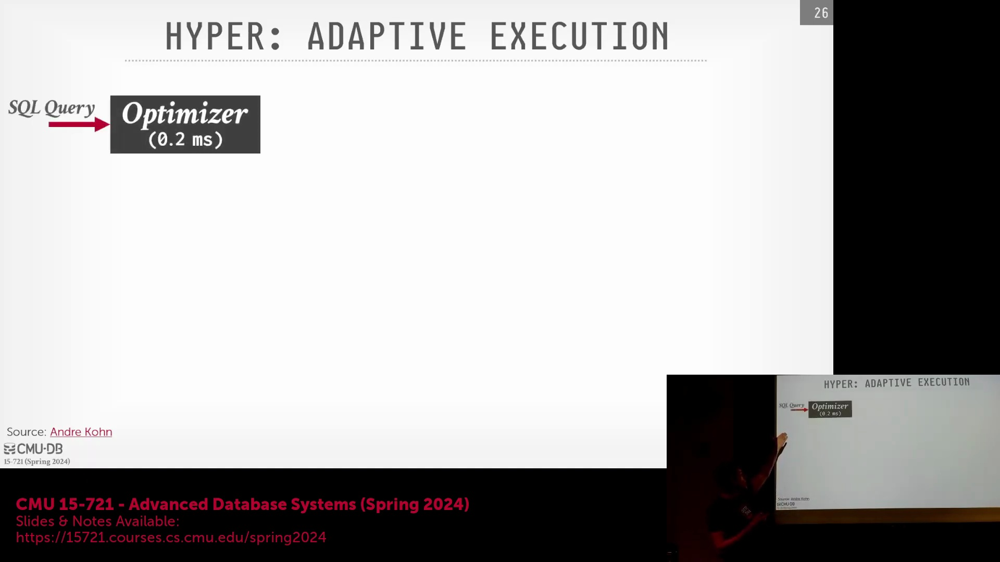
为攻克编译延迟瓶颈，HyPer 团队于 2018 年引入了自适应执行模型(Adaptive Execution Model)。该系统不再阻塞查询执行以等待原生机器码(Native Machine Code)编译完成，而是立即启用自定义的轻量级字节码解释器(Bytecode Interpreter)对生成的 LLVM IR 进行解释执行，从而即时启动数据处理。与此同时，后台 LLVM 编译器异步运行(Asynchronously)，将相同的中间表示(IR)转换为深度优化的 x86 机器码。此类混合架构(Hybrid Architecture)既确保了查询的瞬间启动(Instant Startup)，又能充分释放即时编译(Just-In-Time, JIT)带来的长期性能红利。

## 多级编译流水线
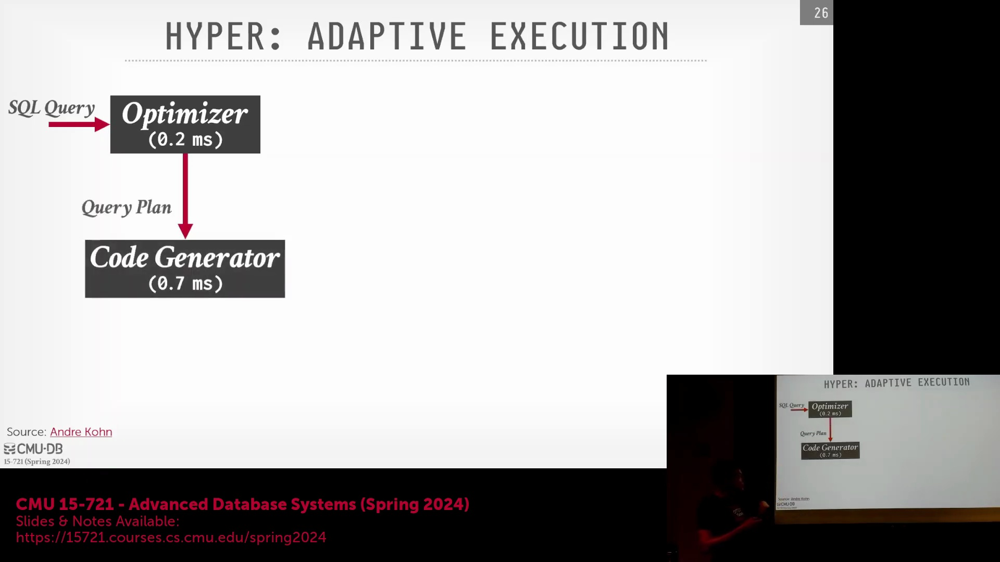
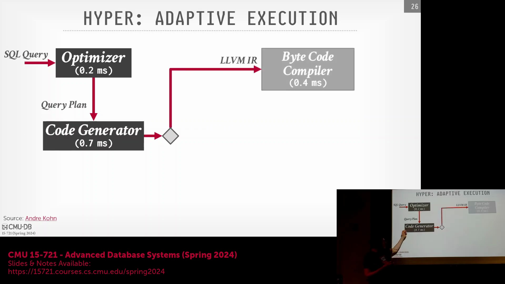
该自适应流水线(Adaptive Pipeline)以并行阶段运行，并附有精确的性能基准。当查询优化器(Query Optimizer)完成解析（约 0.2 毫秒）且代码生成器(Code Generator)产出 LLVM IR（约 0.7 毫秒）后，系统将同步开辟三条执行路径：
1. **字节码编译（约 0.4 毫秒）：** 将 IR 降级为轻量级自定义字节码(Custom Bytecode)，以供解释器即时执行。
2. **快速本机编译（约 6 毫秒）：** LLVM 采用低开销优化标志编译 IR，以极速生成可执行的 x86 代码。
3. **深度优化编译（约 25 毫秒）：** LLVM 启用激进的优化传递(Optimization Pass)（如 `-O2`），旨在为长耗时查询榨取极致的执行速度。

## 在任务边界无缝热切换
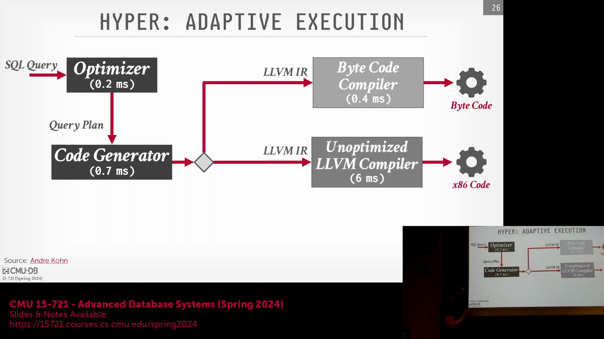
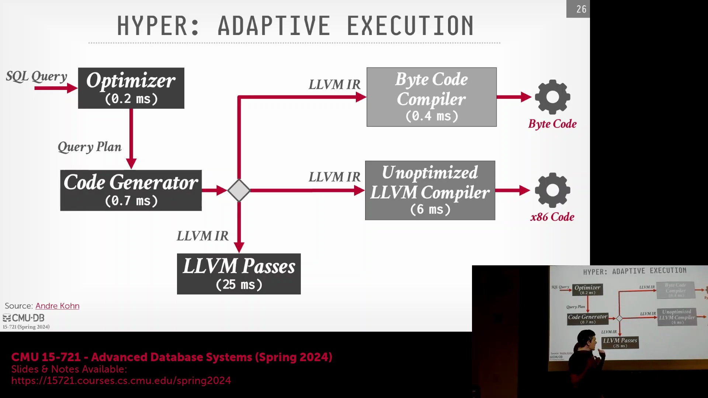
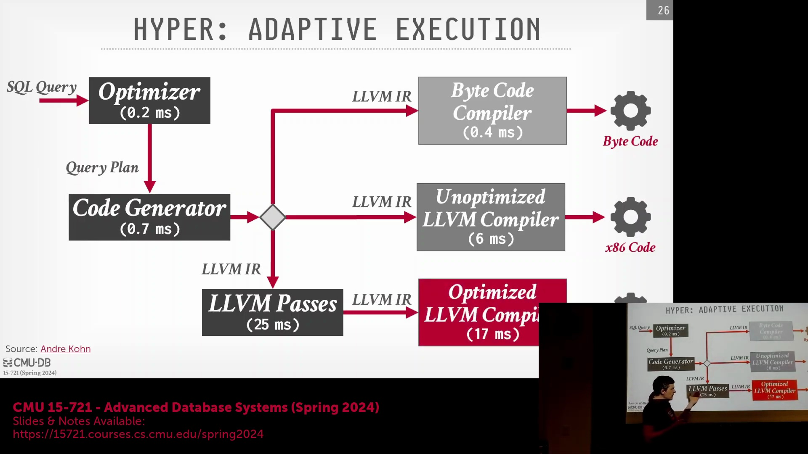
执行引擎将在预定义的任务边界(Task Boundary)处，于不同编译层级之间实现无缝热切换(Seamless Hot Switching)。工作线程(Worker Thread)负责按数据块(Morsel)粒度处理数据。每处理完一个数据块，系统便会检查是否存在更优的查询代码版本可供切换。若快速本机代码(Fast Native Code)在 6 毫秒内编译就绪，解释器将在拉取下一数据块前被即时替换。针对运行时间更长的查询，系统将进一步无缝切换至耗时约 25 毫秒的深度优化本机代码。初始字节码并非 x86 机器码，而是一种轻量级、类 JVM 的中间表示。该格式专为数据库代码生成输出量身定制，确保在免去完整编译器前端(Compiler Frontend)开销的前提下，仍能实现极速解释执行。此种自适应策略(Adaptive Strategy)既为短耗时查询提供了毫秒级即时响应能力，又为长周期分析型工作负载解锁了巅峰性能。

---

## 自适应执行与调试优势
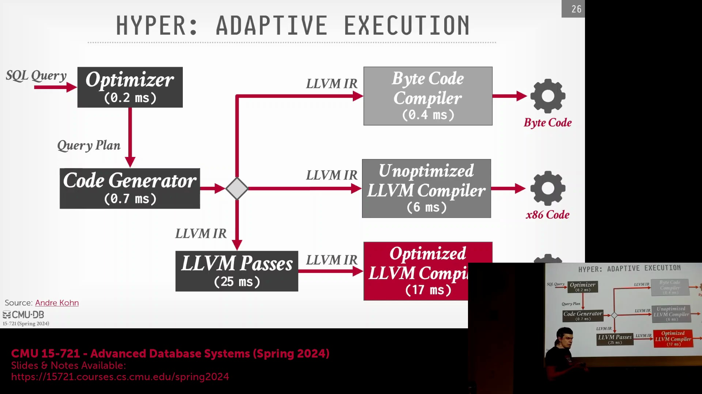
自适应执行模型(Adaptive Execution Model)为简单或短耗时查询(Short-running Query)提供了即时性能优势。通过将 LLVM 中间表示(LLVM IR)编译为轻量级自定义字节码(Custom Bytecode)，系统能够立即启动数据处理，而无需等待耗时的原生机器码编译(Native Code Compilation)。该策略在概念上与 SQLite 的基于操作码的虚拟机(Opcode-based Virtual Machine)高度相似。若查询在初始字节码执行阶段即可顺利完成，系统将完全规避约 6 毫秒的编译开销。除显著降低延迟外，字节码层(Bytecode Layer)还大幅提升了系统的可调试性(Debuggability)。当深度优化的原生二进制代码(Native Binary)发生崩溃时，工程师可无缝回退至字节码解释执行模式，借助标准调试器(Standard Debugger)逐行追踪执行流，精准定位引发故障的生成指令。这种混合架构(Hybrid Architecture)在保障研发效率的同时，有效确保了生产环境的稳定性。

## 在任务边界无缝热切换
从解释型字节码(Interpreted Bytecode)到优化 x86 机器码(Optimized x86 Machine Code)的转换，将在预定义的任务边界(Task Boundary)处无缝触发。执行引擎(Execution Engine)将查询计划(Query Plan)拆解为多个执行流水线(Pipeline)，并以离散的数据块(Data Chunk/Morsel)（例如每个任务实例处理 1,000 个元组(Tuple)）为单位推进数据处理。工作线程(Worker Thread)利用字节码解释器执行当前数据块，并在处理完毕后检查系统是否已就绪更优的编译版本。一旦可用，引擎将立即在拉取下一数据块前，将解释器替换为原生函数(Native Function)。由于两条执行路径承载完全相同的逻辑操作，查询结果保持高度一致。该即时切换机制(Instant Switching Mechanism)确保短查询成功规避编译延迟惩罚(Compilation Penalty)，而长耗时分析型查询(Long-running Analytical Query)则能在后台编译完成后自动切换至加速模式。

## 延迟的真实代价
尽管数毫秒的延迟在学术基准测试(Academic Benchmark)中看似微不足道，但在生产环境中却可能引发巨大的财务损耗。高频交易(High-Frequency Trading, HFT)机构往往在微秒级(Microsecond-level)进行极致优化，以捕捉稍纵即逝的市场套利(Market Arbitrage)机会。在互联网广告生态中，实时竞价(Real-Time Bidding, RTB)系统强制执行严苛的 50 毫秒服务级别协议(Service Level Agreement, SLA)；若未能在该时间窗口内返回有效出价，广告主将被直接剔除出竞价队列。主流电商平台的历史行业指标表明，每增加 100 毫秒的延迟，即意味着数百万美元的收入流失。因此，编译开销(Compilation Overhead)与执行速度(Execution Speed)之间的权衡(Trade-off)高度依赖于具体业务负载。尽管并非所有应用场景均需追求极致的低延迟优化(Low-latency Optimization)，但自适应执行架构(Adaptive Execution Architecture)确保了数据库在应对即席查询(Ad-hoc Query)时依然响应敏捷，同时亦能为复杂且长耗时的分析型工作负载(Analytical Workload)榨取峰值性能。

## 性能层级与系统格局
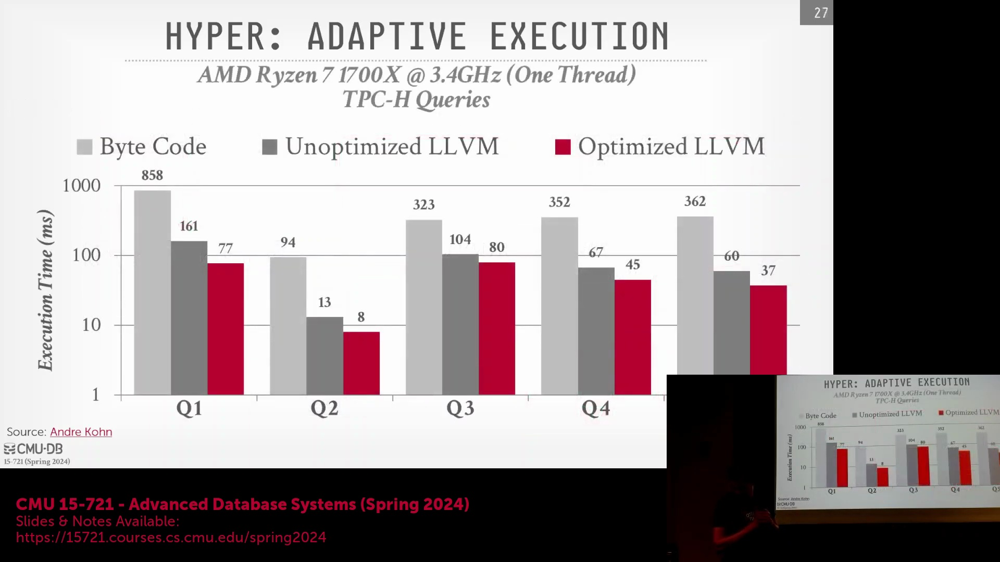
基准测试(Benchmark)结果清晰揭示了三个执行层级(Execution Tier)之间呈数量级跨越的性能差距：初始字节码解释(Initial Bytecode Interpretation)、基础 LLVM 编译（采用 `-O1` 优化标志）以及深度优化编译（采用 `-O2` 标志）。从字节码解释跨越至基础本机编译(Basic Native Compilation)带来了最为显著的性能跃升，而后续的激进优化(Aggressive Optimization)则根据查询复杂度(Query Complexity)提供边际性能增益(Marginal Gain)。由于基准测试通常以单线程(Single-threaded)模式运行查询，系统可充分利用剩余的 CPU 核心进行异步后台编译(Asynchronous Background Compilation)。除原始执行性能外，对多元化编译策略进行分类、调度与维护的能力，已成为现代数据库工程(Database Engineering)的核心竞争力。
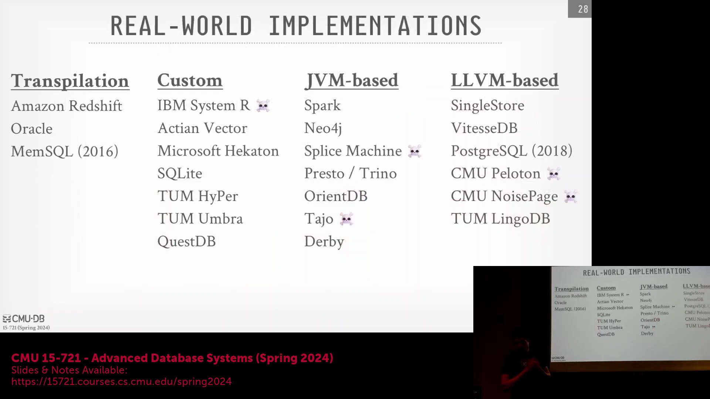
当前采用编译技术的数据库生态格局大致可划分为四类：源码转译系统(Source-to-Source Transpilation System)、定制化/基于 LLVM 的即时编译引擎(Custom/LLVM-based JIT Engine)、CLR 或 Java 虚拟机集成方案(CLR/JVM Integration)，以及已淘汰的研究原型(Research Prototype)。精准定位各系统在这一技术谱系(Technology Spectrum)中的坐标，有助于工程师理性评估编译延迟(Compilation Latency)、执行速度与系统维护复杂度(Maintenance Complexity)之间的工程权衡(Engineering Trade-off)。

## 20 世纪 70 年代的历史渊源
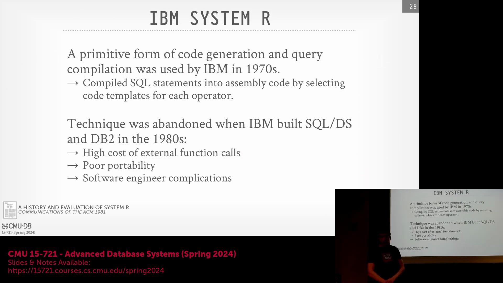
代码特化(Code Specialization)并非现代数据库的独创，其技术根源可追溯至 20 世纪 70 年代 IBM 研发的早期关系型数据库系统(Relational Database System)。作为标志性 System R 项目的前身，PRTV（Potted Relational Test Vehicle）率先实践了早期的查询编译(Query Compilation)形式。彼时，CPU 时钟频率(Clock Frequency)极为有限，内存层级架构(Memory Hierarchy)亦十分原始。在单线程硬件(Single-threaded Hardware)上动态解释执行查询计划(Dynamically Interpret Query Plan)将产生难以承受的计算开销，这迫使早期工程师将执行路径直接特化并编译为底层机器码。这一历史先驱(Historical Precedent)确立了一项至今仍具指导意义的数据库核心原则：当系统性能受限于 CPU 算力瓶颈(CPU Bottleneck)时，借助代码生成(Code Generation)彻底消除解释器开销，始终是突破性能天花板的最高效途径。

---

## 历史渊源：20 世纪 70 年代的代码生成

最早的查询编译(Query Compilation)实现可追溯至 20 世纪 70 年代 IBM 开创性的 System R 项目。继 PRTV(Potted Relational Test Vehicle) 原型之后，工程师直接基于优化后的查询计划(Query Plan)生成 IBM System/370 汇编代码(Assembly Code)，以高效执行扫描(Scan)与连接(Join)操作。在 CPU 时钟频率(Clock Frequency)极低且硬件性能羸弱的年代，动态解释(Dynamic Interpretation)查询计划将引发难以忍受的延迟。采用代码生成是一项关键的工程决策，旨在从当时极度受限的计算资源中榨取极限性能。

## 工程权衡与向解释执行的转变
尽管代码生成(Code Generation)具备显著的性能优势，但由于维护开销(Maintenance Overhead)过高，IBM 最终在后续的 SQL/DS 与 DB2 等商业版本中弃用了该技术。彼时数据库系统尚处萌芽期，内部应用程序接口(Internal API)频繁变更，致使汇编代码生成逻辑(Code Generation Logic)不断失效，需持续重构。此外，调试(Debugging)工作极为艰巨；一旦查询执行失败，工程师缺乏有效手段将运行时汇编错误(Run-time Assembly Error)追溯至最初生成的源码。在硬件性能逐步提升的背景下，维护与调试高度特化(Highly Specialized)汇编代码的工程负担，已远超其带来的运行时性能收益(Run-time Performance Benefit)。

## Vectorwise：构建时预生成的原语
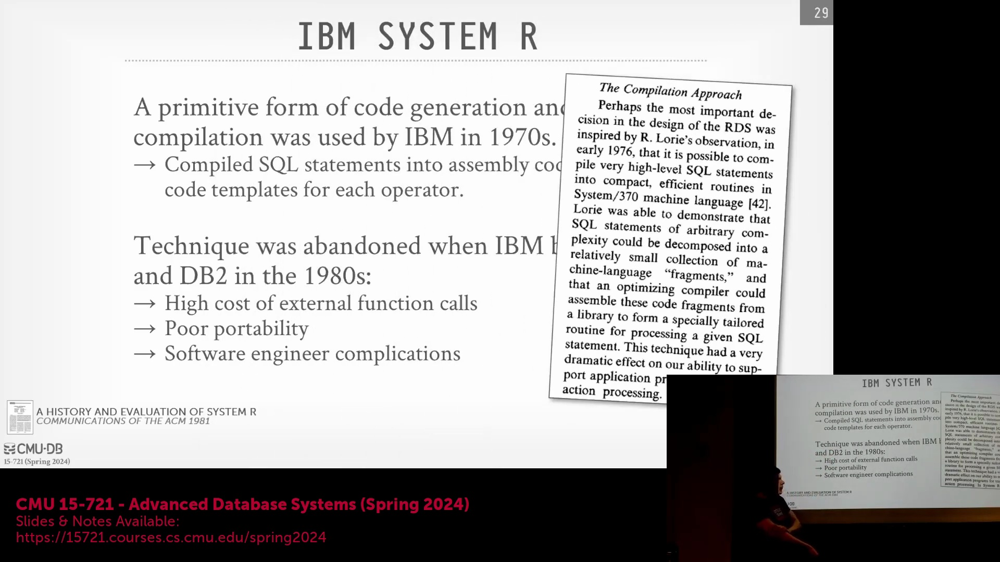
Vectorwise 系统并未采用运行时的即时编译(Just-In-Time, JIT Compilation)，而是转向了构建时特化(Build-time Specialization)方案。该系统利用脚本预生成数百个高度优化的 C++ 函数，穷尽了算子(Operator)、谓词(Predicate)与数据类型(Data Type)的各类组合（例如 `INT32 < constant`、`STRING = constant`）。 

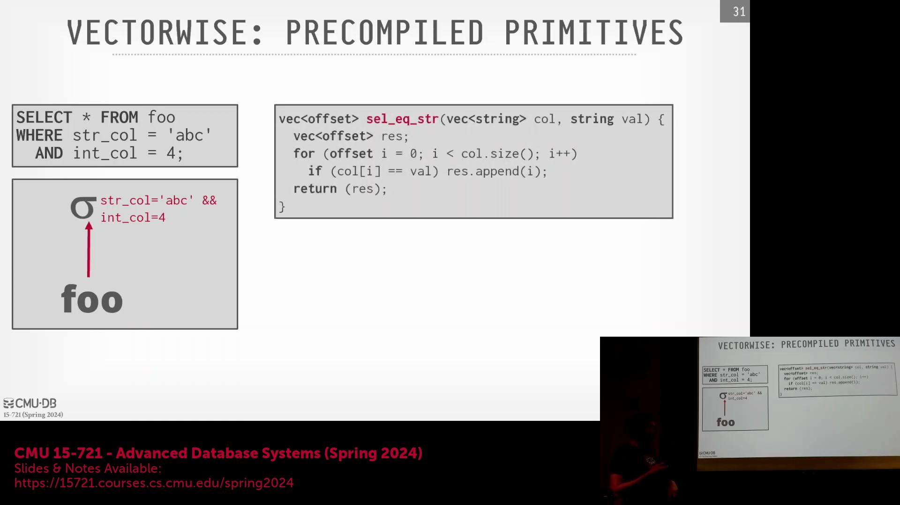
这些预编译原语(Pre-compiled Primitives)在部署前会被静态链接(Statically Linked)至数据库二进制文件(Database Binary)中。在运行时(Run-time)执行查询时，引擎通过组装指向对应预生成原语的函数指针数组(Array of Function Pointers)，动态构建执行流水线(Execution Pipeline)。 
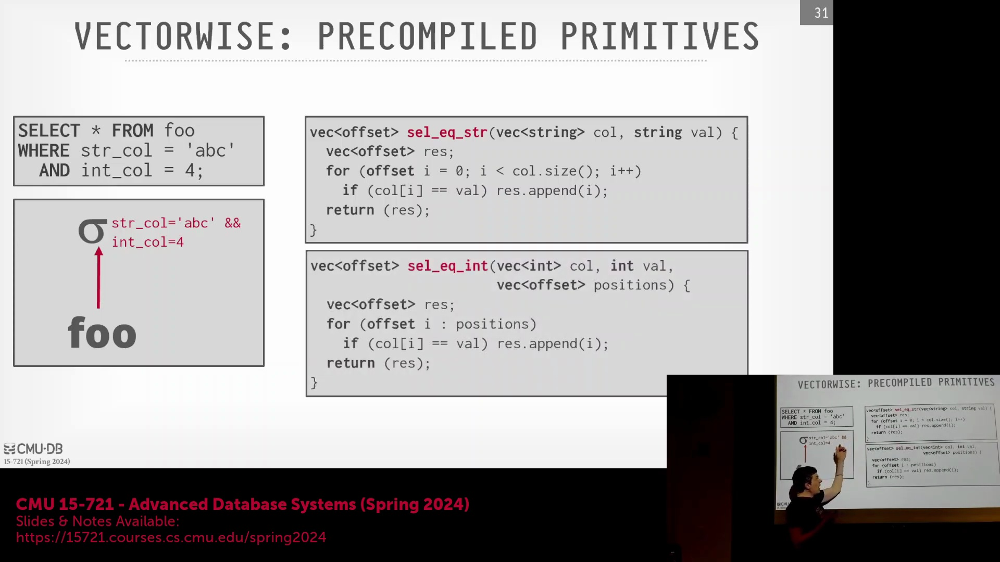
尽管函数指针跳转(Function Pointer Dispatch)对现代 CPU 而言通常代价高昂，但 Vectorwise 采用大型向量批次(Large Vector Batches)处理元组(Tuple)的策略有效缓解了该问题。每次间接调用的开销在整批数据中被大幅摊薄(Amortized)，从而在规避运行时编译延迟(Run-time Compilation Latency)的同时，提供了高度可预测且迅捷的执行性能。

## 运行时编译器选择与优化
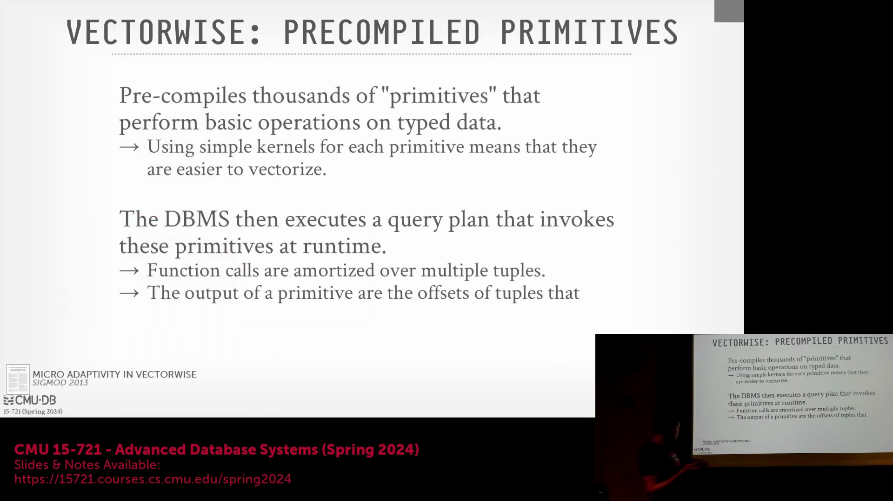
支撑该方向的学术研究进一步挖掘了预编译(Pre-compilation)的潜力。在实验环境中，研究人员利用 GCC、ICC、Clang 等多种编译器，配合不同的优化标志(Optimization Flag)对所有原语函数进行交叉编译。在运行时，系统内置的轻量级性能分析机制(Lightweight Profiling Mechanism)会评估目标硬件特征，并动态切换(Dynamic Switching)至针对该特定 CPU 架构(CPU Architecture)表现最优的机器码(Machine Code)实现。尽管这种多编译器运行时选择(Multi-compiler Runtime Selection)机制展现出可观的理论收益，但因系统架构过于复杂，最终被判定不具备商业发行(Commercial Release)的可行性。

## Amazon Redshift：全局代码缓存架构

Amazon Redshift 采用了类似 HiQ 的转译(Transpilation)技术，将查询片段(Query Fragment)转换为模板化 C++ 代码，深度融合了推送型执行(Push-based Execution)与向量化(Vectorization)技术。为彻底规避为每个查询频繁派生 GCC 进程所带来的巨大延迟开销(Latency Overhead)，Redshift 依托其云原生架构(Cloud-native Architecture)维护了一个庞大的全局编译代码缓存(Global Compiled Code Cache)。系统摒弃了针对独立数据库实例的冷编译(Cold Compilation)模式，转而查询集中式缓存(Centralized Cache)，该缓存汇聚了跨所有 Redshift 租户(Redshift Tenant)编译的查询代码片段。此举实现了高达 99.95% 的全局缓存命中率(Global Cache Hit Rate)。由于生成的代码仅封装特定操作逻辑与常量(Constant)，绝不触碰专有用户数据(Proprietary User Data)，因此跨租户共享缓存(Cross-tenant Cache Sharing)不会引发任何安全或隐私合规风险。每逢系统版本迭代，后台服务会自动执行缓存预热(Cache Warm-up)与重编译(Recompilation)，确保代码获取延迟始终远低于即时 GCC 编译时间。
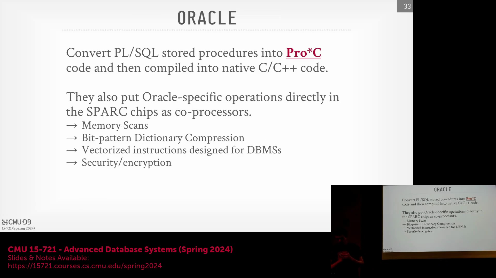

## Oracle：存储过程的转译
尽管 Oracle 并未对标准 SQL 查询实施即时编译(Just-In-Time, JIT Compilation)或谓词特化(Predicate Specialization)，但其成功将转译技术(Transpilation)应用于用户自定义逻辑。由 PL/SQL 编写的存储过程(Stored Procedure)与用户定义函数(User-Defined Function, UDF)会被自动转换为 Pro*C——一种 Oracle 专有的受限 C 语言方言(Restricted C Dialect)。随后，这些生成的 C 代码将编译为原生机器码(Native Machine Code)，彻底消除了过程式数据库逻辑(Procedural Database Logic)的解释开销(Interpretation Overhead)。这一实践充分证明，即便不直接集成于核心查询执行引擎(Core Query Execution Engine)，转译技术在优化应用层数据库函数(Application-level Database Function)方面依然具备极高的工程价值。

---

## Oracle、Hekaton 与硬件集成编译

传统数据库系统（如 Oracle）主要将转译(Transpilation)技术应用于存储过程(Stored Procedure)，而非标准 SQL 查询。PL/SQL 代码会被转换为 `Pro*C`（Oracle 专有的受限 C 语言方言(Restricted C Dialect)），随后编译为原生机器码(Native Machine Code)。通过严格限制生成的 C 语言子集，系统能够有效防止内存破坏(Memory Corruption)或非法跳转，从而确保其作为共享对象(Shared Object)安全执行。历史上，该理念曾与硬件级加速技术(Hardware Acceleration)高度契合。例如，Sun Microsystems 的 SPARC 处理器曾直接将数据压缩(Data Compression)等数据库操作固化至硅片(Silicon)中。类似地，Microsoft 的 Hekaton 内存数据库引擎(Memory-Optimized Database Engine)会将 SQL 语句与存储过程编译为 C 代码，并将其与公共语言运行时(Common Language Runtime, CLR)进行链接(Linking)。Hekaton 在生成的代码中内置了严格的缓冲区溢出(Buffer Overflow)防护与安全校验机制，以保障宿主环境(Host Environment)的稳定性。由于编译后的代码在同一地址空间(Address Space)内以共享对象形式运行，系统能够无缝调用其他 SQL Server 组件，充分展现了紧密集成编译模型(Tightly Integrated Compilation Model)的灵活性。

## SQLite 的可移植虚拟机架构

作为全球部署最广泛的数据库，SQLite 采用了一套独特的代码生成(Code Generation)策略，其核心目标是实现极致的可移植性(Portability)，而非盲目追求峰值性能。SQLite 并不直接生成原生机器码(Native Machine Code)，而是将查询计划(Query Plan)转化为一组专为定制虚拟机(Virtual Machine, VM)设计的自定义操作码序列(Custom Opcode Sequence)。在 SQLite 中执行 `EXPLAIN` 命令将输出该扁平化的 VM 指令列表(Instruction List)，而非传统的树状查询计划。该架构的核心理念是平台无关性(Architecture Independence)：为使数据库能在嵌入式设备、卫星或经过严格认证的航空系统中运行，且无需为每种新型指令集架构(Instruction Set Architecture, ISA)重写执行引擎，开发者仅需更新 VM 解释器(VM Interpreter)即可。生成的操作码在所有硬件平台上保持高度一致，而针对特定硬件的优化则完全封装于 VM 的 C 语言实现(C Implementation)之中。这种设计赋予了系统极高的可靠性(Reliability)与跨平台移植能力，代价则是放弃了即时编译器(JIT Compiler)中常见的深度硬件特定调优(Hardware-specific Tuning)。

## Umbra：直接汇编生成与反向调试

作为 HyPer 系统的继任者，Umbra 代表了对传统基于 LLVM 的即时编译(Just-In-Time, JIT Compilation)范式的彻底革新。Umbra 摒弃了生成 LLVM 中间表示(Intermediate Representation, IR)的传统路径，转而利用 C++ 宏直接从查询计划输出原始的 x86 或 ARM 汇编代码(Assembly Code)。随后，系统内置的自定义轻量级汇编器(Custom Lightweight Assembler)会将这些汇编指令直接翻译为机器码(Machine Code)。此举成功绕过了 LLVM 繁重的优化传递(Optimization Pass)，大幅缩减了编译启动时间(Compilation Startup Time)。Umbra 采用自适应执行模型(Adaptive Execution Model)：查询将立即基于快速生成的汇编代码启动执行，与此同时，后台线程会异步触发完整的 LLVM 优化流程。一旦高度优化的二进制文件(Highly Optimized Binary)准备就绪，执行引擎将在下一个任务边界(Task Boundary)无缝切换至该优化版本。为攻克动态汇编生成(Dynamic Assembly Generation)长期以来的调试(Debugging)难题，Umbra 团队自主研发了一款名为 "On Another Level" 的逆向调试器(Reverse Debugger)。该工具基于 `rr`(Record and Replay) 技术构建，能够将生成机器码中的运行时崩溃(Run-time Crash)精准回溯至原始的 C++ 代码生成逻辑行(Code Generation Logic)，使开发者能够依托完整的源码溯源信息，逐步排查(Query Troubleshooting)执行失败的查询。

## JVM 字节码与 Spark/Photon 的工程转向
基于 Java 的数据库系统通过生成 Java 虚拟机字节码(JVM Bytecode)而非 LLVM IR，以充分利用 JVM 生态中成熟的 HotSpot 编译器(HotSpot Compiler)。尽管该方案允许即时编译器自动完成向原生机器码的转换，但其背后隐含着显著的工程权衡(Engineering Trade-off)。Apache Spark 早期曾深入探索自定义代码生成(Custom Code Generation)，但 Databricks 随后果断转向，推出了 Photon 引擎——一个高度优化的向量化 C++ 执行层(Vectorized C++ Execution Layer)。这一战略转型(Strategic Pivot)主要源于高端人才的稀缺：精通编译器底层原理、汇编语言及 JIT 优化的专家极为难觅，而具备 C++ 向量化优化经验的工程师储备则相对充足。尽管自定义 JIT 编译可能在短期内带来性能红利，但向量化 C++ 引擎在长期可维护性(Long-term Maintainability)、更广泛的开发者社区贡献(Contributor Base)以及更敏捷的迭代周期(Iteration Cycle)上具备显著优势，最终为大规模分布式系统(Large-scale Distributed System)提供了更为卓越且可持续的性能表现。

## QuestDB：HFT 背景、JIT 与并行性的权衡

QuestDB 是一款源自英国、由前高频交易(High-Frequency Trading, HFT)工程师主导开发的时间序列列式数据库(Time-Series Columnar Database)，其架构展现了一种极为务实的 JIT 编译策略。QuestDB 并未对整个查询计划进行全量编译，而是聚焦于专门编译 `WHERE` 子句中的谓词逻辑(Predicate Logic)。系统采用 ASM（一款轻量级 Java 字节码操纵库(Java Bytecode Manipulation Library)，可视为极简版 LLVM）动态生成高度优化的 JVM 字节码。性能基准测试(Performance Benchmark)清晰揭示了其性能演进轨迹：基线单线程解释执行(Single-threaded Interpretation)耗时约 30 秒；引入 JIT 编译后骤降至约 3.5 秒；仅启用多线程(Multi-threading)亦能大幅超越基线；而将 JIT 编译与并行执行(Parallel Execution)深度融合，则能斩获绝对最优的性能表现。值得注意的是，QuestDB 优先实现了 JIT 功能，而后才补齐完整的并行处理能力，这在业界引发了关于系统功能开发优先级(Development Prioritization)的广泛探讨。尽管 JIT 技术能迅速带来单核性能(Single-core Performance)的跃升，但本次讲座着重强调：并行化通常能提供更广阔的横向扩展能力(Horizontal Scalability)。二者的有机结合，已然成为现代高性能分析引擎(High-performance Analytical Engine)的行业标准配置。

---

## 查询编译策略的总结

在总结代码生成(Code Generation)的相关讨论时，自适应的“单一存储(Single Store)”方法仍是编译型数据库(Compiled Database)最为务实的解决方案。通过将即时解释(Instant Interpretation)作为回退机制(Fallback Mechanism)与后台即时编译(Just-In-Time, JIT)相结合，开发人员获得了一个关键的调试层(Debugging Layer)，能够在不中断查询执行(Query Execution)的前提下精准定位故障。相比之下，“Flying Start”架构代表了一项极致的工程壮举(Engineering Feat)，其直接生成原始汇编代码(Raw Assembly Code)并配套先进的逆向调试工具(Reverse Debugger)。尽管该技术原理极为精妙，但如此深度的编译器集成(Compiler Integration)在实现与维护上均异常困难，这注定其只能作为特例存在，而非行业标准(Industry Standard)。

## 行业向向量化执行(Vectorized Execution)的转变

现代分析型系统(Analytical System)已大幅摒弃复杂的 JIT 编译与自定义汇编生成(Custom Assembly Generation)，转而全面拥抱向量化执行引擎(Vectorized Execution Engine)。正如 Databricks 关于 Photon 引擎的论文所强调的，此类架构选型(Architectural Choice)优先考量了工程可扩展性(Engineering Scalability)与长期可维护性(Long-term Maintainability)。尽管自定义代码编译(Custom Code Compilation)或许能带来边际的短期性能增益，但向量化技术显著降低了开发门槛，使更广泛的软件工程师群体得以参与代码库(Codebase)的优化与维护。这种协作优势(Collaborative Advantage)最终孕育出的数据库系统，在系统稳健性(System Robustness)与迭代演进速度(Iteration Speed)上，均全面超越了那些高度依赖专业编译器工程(Compiler Engineering)的架构。

## 课程总结：任务调度(Task Scheduling)与 Morsel 数据分块

接下来，课程的重心将从单节点执行模型(Single-node Execution Model)转向并行查询任务调度(Parallel Query Task Scheduling)。作为核心阅读材料(Core Reading Material)的《Morsels》论文将引入一项关键概念：将查询计划(Query Plan)拆解为离散的、数据驱动的数据分块(Data Chunks)。深入理解如何合理划分工作负载(Workload Partitioning)，并在可用 CPU 核心(CPU Core)上高效调度这些数据块，是构建高度并行(Highly Parallel)、多线程(Multi-threaded)数据库系统的基石。 

随着学期临近尾声，强烈建议同学们在当前的课程项目中，重点关注上述核心调度机制(Scheduling Mechanism)与并行化技术(Parallelization Technique)。精准把握高效执行引擎(Execution Engine)与智能任务分配(Intelligent Task Allocation)之间的平衡，将是成功构建现代高性能数据库架构(High-performance Database Architecture)的关键所在。