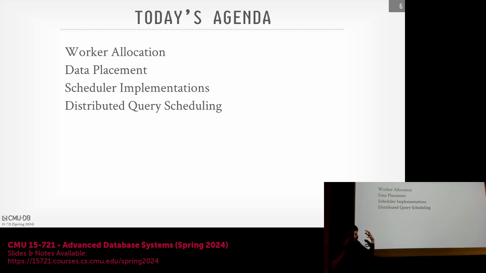
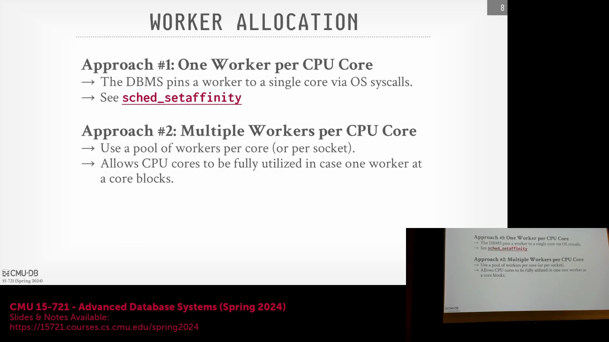
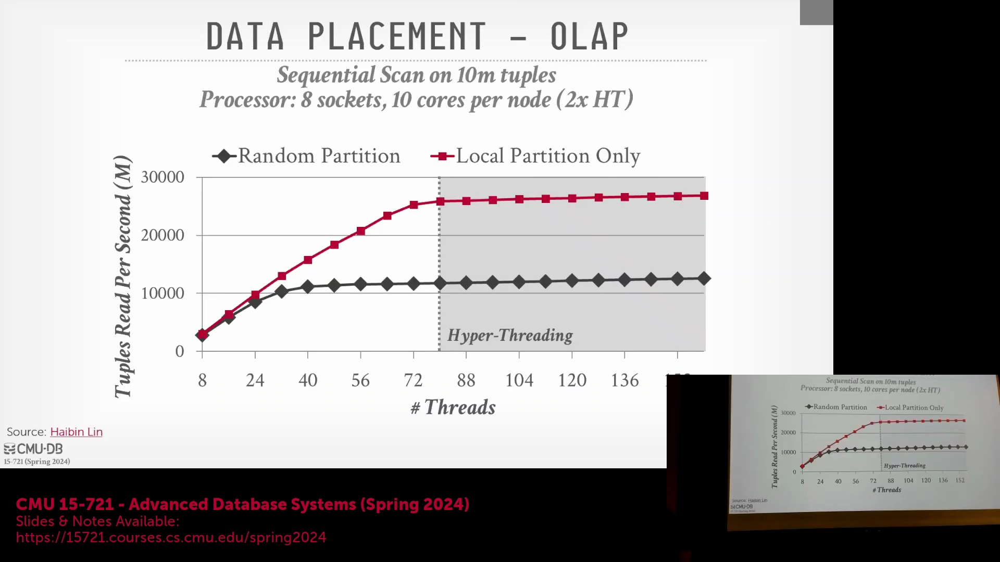

## 调度架构简介
讲座首先概述了现代数据库系统中查询调度(Query Scheduling)的不同实现路径。Umbra 和 Hyper 等系统采用专用的工作线程池(Worker Pools)，一旦任务就绪便由空闲线程持续处理。相比之下，SAP HANA 采用了一种更为精细的调度策略，支持动态挂起(Park)或休眠工作线程。调度设计中的另一个关键维度在于是否采用工作窃取(Work-Stealing)机制，这直接影响任务在系统中的分发与执行效率。

## 历史背景：进程与线程模型
理解数据库的进程模型(Process Model)是明确“工作节点”(Worker)实际内涵的基础。20 世纪 80 至 90 年代的早期数据库系统普遍采用“单进程单工作节点”(Process-per-Worker)架构。受限于当时缺乏可移植的线程库(Thread Library)，这些系统高度依赖 `POSIX` 的 `fork` 系统调用(System Call)。如今，绝大多数现代数据库系统已全面转向多线程架构(Multi-threaded Architecture)，但 PostgreSQL 仍是显著的例外，它保留了多进程模型，并依赖共享内存(Shared Memory)进行进程间通信(Inter-Process Communication, IPC)。广义而言，“工作节点”被定义为一种基础计算资源，专门负责执行分配的任务、处理算子实例(Operator Instance)并生成计算结果。

## 工作节点至核心的分配策略
在将工作节点映射至底层硬件时，将其分配给 CPU 核心(CPU Core)主要遵循两种策略。第一种策略是为每个物理核心分配一个专用的工作线程。该设计能有效规避资源争用(Resource Contention)，尤其是防止多个线程竞争同一硬件资源时引发的 L3 缓存颠簸(L3 Cache Thrashing)。针对表扫描(Table Scan)等被切分为多个数据块(Chunk)或碎块(Morsel)的操作，该模型会为每个数据块分配独立的工作线程。第二种策略则是在单个核心上并发调度多个工作线程。此设计的核心目的在于隐藏延迟(Hide Latency)：当某个线程因等待磁盘 I/O(Disk I/O)或遭遇缓存未命中(Cache Miss)而阻塞时，同一核心上的其他线程仍可继续推进，从而在不可预期的停顿期内最大化 CPU 利用率(CPU Utilization)。

## 优化 CPU 争用与超线程技术
为在计算密集型(Compute-bound)数据库负载中榨取极致性能，业界普遍建议禁用超线程技术(Hyper-Threading)，使工作线程直接绑定至物理硬件线程运行。此举可确保工作节点与物理核心(Physical Core)建立严格的一对一映射，从而彻底消除硬件层面的资源争用。尽管超线程理论上可通过在逻辑线程(Logical Thread)间快速切换寄存器状态来缓解阻塞，但现代 OLAP/OLTP 系统在架构上已高度优化，普遍具备缓存友好(Cache-Friendly)与无分支执行(Branchless)的特性，已将阻塞概率降至最低。SAP HANA 团队指出，在多插槽(Multi-Socket)高端服务器上，借助细粒度的线程挂起(Thread Parking)机制，允许单个核心承载多个工作节点或许能带来额外收益；但总体而言，将物理核心独占分配给数据库工作线程，能最有效地规避上下文切换(Context Switch)与缓存污染(Cache Pollution)。此外，后台进程(Background Processes)或系统守护进程(Daemons)绝不应与这些核心争夺计算资源。这进一步印证了一条核心原则：专用数据库服务器必须优先保障连续、无干扰、零争用的执行环境。
