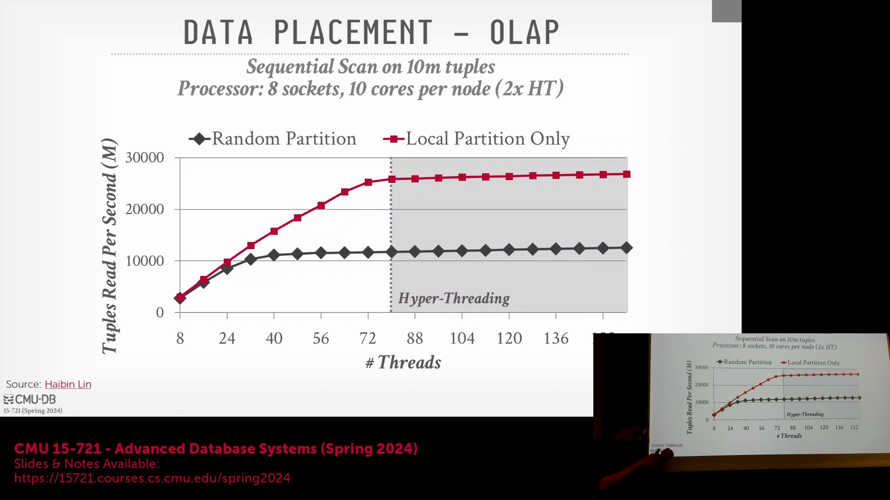
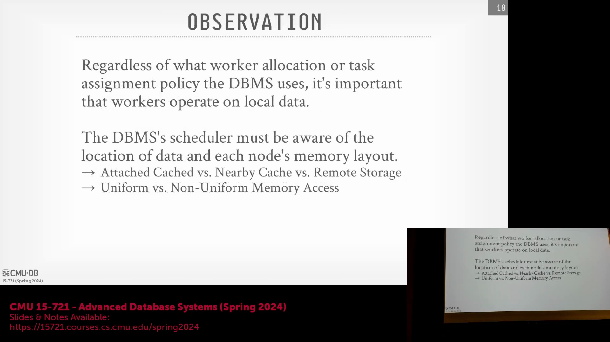

## 超线程对数据库性能的影响
对于专用数据库服务器，通常不建议启用超线程技术(Hyper-Threading)。当两个逻辑线程(Logical Threads)共享单个物理核心(Physical Core)时，它们会竞争执行单元(Execution Units)资源，并不可避免地相互污染 L3 缓存(L3 Cache)与分支预测器(Branch Predictor)。桌面环境因频繁遭遇输入/输出(I/O)停顿与用户交互，尚能容忍此现象；但高性能数据库系统多属计算密集型(Compute-Intensive)负载，更能从裸金属(Bare-Metal)执行中获益。在非统一内存访问(Non-Uniform Memory Access, NUMA)架构上的实验表明，在启用超线程前，由数据库自主控制的数据布局(Data Layout)可提供卓越的扩展性(Scalability)；而一旦启用超线程，性能便会迅速触及瓶颈。这是因为同一核心上的多线程会迅速耗尽内存带宽(Memory Bandwidth)，干扰硬件预取器(Hardware Prefetcher)的工作，并引发缓存争用(Cache Contention)，最终抵消了理论上的并发(Concurrency)优势。

## 任务分发：推式与拉式调度模型
向工作节点(Worker)分配计算任务主要遵循两种范式：推式(Push-Based)调度与拉式(Pull-Based)调度。在推式模型中，集中式调度器(Centralized Scheduler)负责维护工作节点状态的全局视图(Global View)并主动下发任务，这要求系统具备复杂的状态追踪机制，并能谨慎处理节点故障(Node Failure)。相反，现代系统广泛采用的拉式模型则维护一个集中式的待处理任务队列，并附带相应的元数据(Metadata)。空闲的工作节点会自主拉取下一个可用任务。该设计不仅简化了全局协调，将调度逻辑下沉至各个工作线程，还能通过将未被领取的任务保留在队列中，天然具备应对节点故障的容错能力。尽管拉式模型可能在共享队列上引发锁争用(Lock Contention)，但其架构的简洁性与高健壮性(Robustness)使其成为业界的首选方案。

## 调度智能化与运行时代价估算
拉式调度器(Pull-Based Scheduler)仍可通过在全局队列中对任务进行排序，来实现智能化的优先级管理(Priority Management)。然而，要将传统查询优化器(Query Optimizer)的代价估算(Cost Estimates)准确转化为精确的真实运行时间(Wall-Clock Execution Time)，依然颇具挑战。静态代价模型(Static Cost Model)通常仅能生成抽象的相对数值，往往难以与实际延迟直接对应；尽管部分企业级系统尝试输出时间预估，但其结果通常缺乏准确性。为应对这一难题，Umbra 等先进系统引入了动态反馈机制(Dynamic Feedback Mechanism)：它们在运行时(Runtime)持续监控任务的实际执行耗时，并利用这些实测数据优化后续的调度决策与优先级分配。这一实践充分印证了静态预测在本质上存在的不可靠性。

## 数据局部性的必要性
无论采用何种调度模型，保持数据局部性(Data Locality)始终是高性能查询执行(Query Execution)的基本要求。在无共享(Shared-Nothing)系统中，局部性体现为将任务分配给同一非统一内存访问(NUMA)节点内的计算核心，以避免代价高昂的跨 CPU 插槽互联(Cross-Socket Interconnect)开销。在分布式共享磁盘(Shared-Disk)架构（例如查询云对象存储(Object Storage)的云数据仓库）中，虽然底层存储延迟在各计算节点间基本一致，但缓存机制引入了新的局部性约束。由于计算节点会维护热点数据的本地缓存(Local Cache)，调度器必须优先将任务路由至已缓存目标数据分区(Data Partition)副本的节点。该策略能最大限度地降低网络开销(Network Overhead)，并确保计算资源的高效利用。
