## 简介与课程背景
欢迎来到卡内基梅隆大学高级数据库系统(Advanced Database Systems)课程。本期讲座在演播室现场观众面前录制。在简要回顾此前涵盖的杂项话题及行为面试(Behavioral Interviews)相关内容后，我们将把焦点直接转向数据库内核。

今天的讲座将探讨如何将此前生成的优化查询计划(Optimized Query Plan)实际部署到系统中并启动执行。
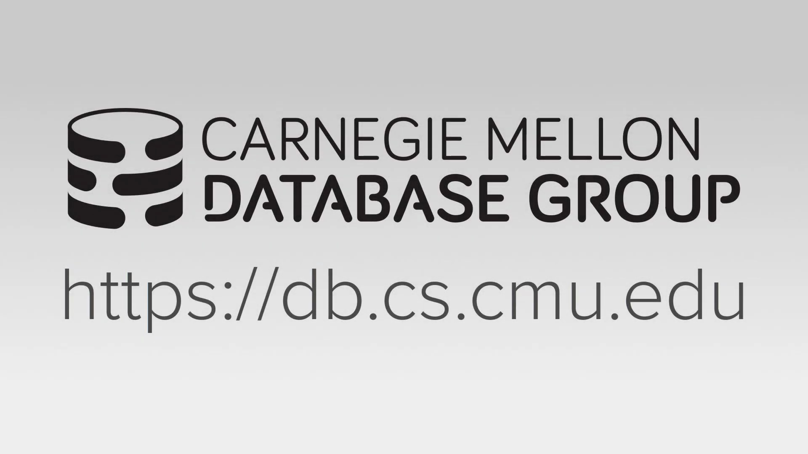

## 查询执行：编译与向量化
近期的讲座涵盖了查询优化(Query Optimization)，特别探讨了并行哈希连接(Parallel Hash Join)等连接策略。在执行这些查询计划时，主要存在两种编译路径：转译(Transpilation，即源码到源码的编译，例如生成 C++ 代码)，以及借助 LLVM 等编译器框架，通过底层中间表示(Intermediate Representation, IR)进行即时编译(Just-In-Time Compilation, JIT)。

然而，过去十年间业界的普遍趋势更倾向于采用基于单指令多数据流(Single Instruction, Multiple Data, SIMD) 的向量化(Vectorization)技术，通常还会结合自动向量化(Auto-vectorization)与转译(Transpilation)技术。构建和维护 JIT 编译扩展的工程开销极高。正如 Databricks Photon 论文所指出的，与其依赖少数专家攻克复杂的 JIT 开发路径，更高效的常规做法是投入更广泛的工程资源来优化 SIMD 实现，从而获得与传统编译方式相媲美的性能。

## 查询调度中的核心术语
今天的讨论聚焦于调度(Scheduling)，即确定如何将查询计划分配至系统中的不同工作节点(Worker)。为确保表述清晰，我们必须精确定义以下核心术语：**查询计划(Query Plan)** 是由关系算子(Relational Operators)构成的有向无环图(Directed Acyclic Graph, DAG)。**算子实例(Operator Instance)** 表示将特定算子应用于某数据块（例如扫描单个行组(Row Group)）的执行实例。**任务(Task)** 是包含多个算子实例的计算单元，通常位于同一流水线(Pipeline)内，随后将被分发至工作节点执行。**任务集(Task Set)**（或工作集(Work Set)）指执行给定查询所需的全部任务集合。
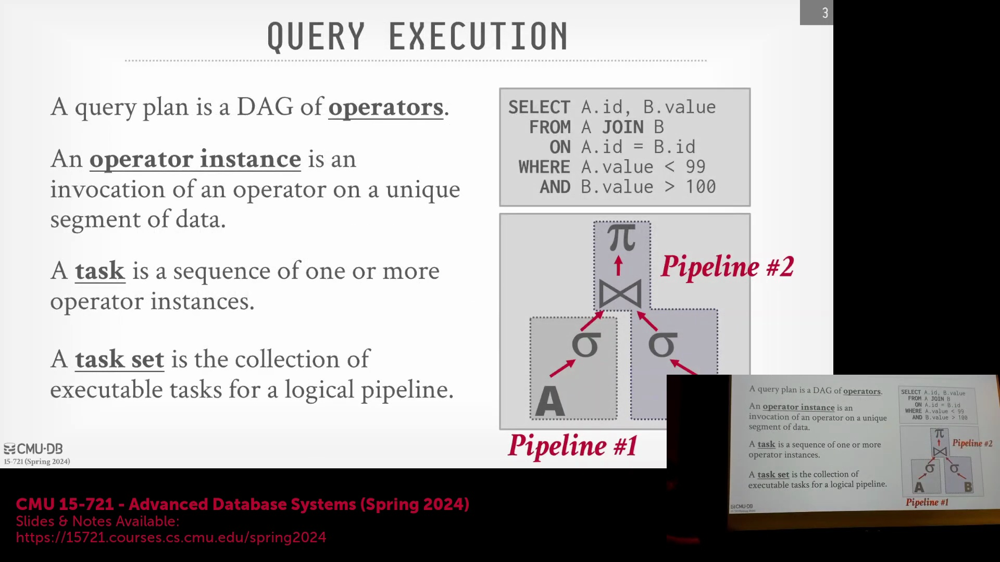
通过在查询规划阶段识别流水线阻断点(Pipeline Breakers)，我们可以将连续的流水线转化为离散的任务，进而实现高效的分发与执行。

## 单节点调度与数据放置
调度(Scheduling)的核心挑战在于如何将任务分配给工作节点(Worker，广义上可指 CPU 核心(Core)、线程(Thread)、进程(Process)或物理节点(Node))，同时精确追踪数据流向：即输入数据的来源，以及中间结果应缓存于何处或路由至何处。尽管 PostgreSQL 等传统系统通常将调度委托给操作系统(Operating System)，但现代高性能数据库均会在内核层面自行实现调度管理。

我们将首先聚焦于单节点调度(Single-Node Scheduling)，因为无论系统架构如何，其核心问题始终一致：决定任务的执行位置及输出数据的处理方式。在分布式环境中，BigQuery/Dremel 等系统虽会在流水线阻断点后引入数据洗牌(Shuffle)阶段以重新平衡工作节点负载，但其底层调度逻辑与单节点实现一脉相承。

## 调度目标：吞吐量、公平性与延迟
构建高性能查询调度器(Query Scheduler)需围绕几个核心目标展开。首先，必须**最大化吞吐量(Throughput)**，确保系统持续消费输入并产出结果，避免出现 CPU 或 I/O 空闲。其次，需维持**公平性(Fairness)**，确保没有任何查询会因资源被长期剥夺而发生饥饿(Starvation)。即使长时间运行的查询(Long-running Queries)被分配了较低优先级，它最终也必须能够顺利完成。

第三，系统必须通过最小化尾部延迟(Tail Latency，如 P999)来保持**高响应性(Responsiveness)**。这对短查询(Short Queries)尤为关键：若 100 毫秒的查询退化为 1000 毫秒，用户会立刻察觉；而 10 分钟的查询延迟 20 秒则往往不易被感知。优先调度短查询能显著提升用户对系统响应速度的主观体验。最后，调度器本身必须具备**低开销(Low Overhead)**。耗费过多计算时间去求解理论上“最优”的调度方案无异于本末倒置；系统应将绝大部分计算周期留给实际的查询执行。

## 背景概念与后续主题
在深入具体实现之前，我们将简要回顾一些基础概念：明确**工作节点(Worker)**的界定与部署位置、理解**数据分区(Data Partitioning)**，以及管理非统一内存访问(Non-Uniform Memory Access, NUMA) 架构下的**本地内存(Local Memory)与远程内存(Remote Memory)**。正如 Morsel-Driven 论文所强调的，调度的核心目标是确保工作节点始终处理本地数据，从而避免代价高昂的远程内存访问或跨节点网络传输。随后，我们将剖析三种不同的调度实现方案：Hyper 论文中提出的静态碎块驱动(Static Morsel-Driven)方法、Umbra 数据库中更为动态且复杂的调度机制，以及 SAP HANA 团队采用的替代策略。这一递进式的探讨将为理解现代查询执行协调(Query Execution Coordination)机制奠定坚实的基础。

---

## 调度架构简介
讲座首先概述了现代数据库系统中查询调度(Query Scheduling)的不同实现路径。Umbra 和 Hyper 等系统采用专用的工作线程池(Worker Pools)，一旦任务就绪便由空闲线程持续处理。相比之下，SAP HANA 采用了一种更为精细的调度策略，支持动态挂起(Park)或休眠工作线程。调度设计中的另一个关键维度在于是否采用工作窃取(Work-Stealing)机制，这直接影响任务在系统中的分发与执行效率。

## 历史背景：进程与线程模型
理解数据库的进程模型(Process Model)是明确“工作节点”(Worker)实际内涵的基础。20 世纪 80 至 90 年代的早期数据库系统普遍采用“单进程单工作节点”(Process-per-Worker)架构。受限于当时缺乏可移植的线程库(Thread Library)，这些系统高度依赖 `POSIX` 的 `fork` 系统调用(System Call)。如今，绝大多数现代数据库系统已全面转向多线程架构(Multi-threaded Architecture)，但 PostgreSQL 仍是显著的例外，它保留了多进程模型，并依赖共享内存(Shared Memory)进行进程间通信(Inter-Process Communication, IPC)。广义而言，“工作节点”被定义为一种基础计算资源，专门负责执行分配的任务、处理算子实例(Operator Instance)并生成计算结果。

## 工作节点至核心的分配策略
在将工作节点映射至底层硬件时，将其分配给 CPU 核心(CPU Core)主要遵循两种策略。第一种策略是为每个物理核心分配一个专用的工作线程。该设计能有效规避资源争用(Resource Contention)，尤其是防止多个线程竞争同一硬件资源时引发的 L3 缓存颠簸(L3 Cache Thrashing)。针对表扫描(Table Scan)等被切分为多个数据块(Chunk)或碎块(Morsel)的操作，该模型会为每个数据块分配独立的工作线程。第二种策略则是在单个核心上并发调度多个工作线程。此设计的核心目的在于隐藏延迟(Hide Latency)：当某个线程因等待磁盘 I/O(Disk I/O)或遭遇缓存未命中(Cache Miss)而阻塞时，同一核心上的其他线程仍可继续推进，从而在不可预期的停顿期内最大化 CPU 利用率(CPU Utilization)。

## 优化 CPU 争用与超线程技术
为在计算密集型(Compute-bound)数据库负载中榨取极致性能，业界普遍建议禁用超线程技术(Hyper-Threading)，使工作线程直接绑定至物理硬件线程运行。此举可确保工作节点与物理核心(Physical Core)建立严格的一对一映射，从而彻底消除硬件层面的资源争用。尽管超线程理论上可通过在逻辑线程(Logical Thread)间快速切换寄存器状态来缓解阻塞，但现代 OLAP/OLTP 系统在架构上已高度优化，普遍具备缓存友好(Cache-Friendly)与无分支执行(Branchless)的特性，已将阻塞概率降至最低。SAP HANA 团队指出，在多插槽(Multi-Socket)高端服务器上，借助细粒度的线程挂起(Thread Parking)机制，允许单个核心承载多个工作节点或许能带来额外收益；但总体而言，将物理核心独占分配给数据库工作线程，能最有效地规避上下文切换(Context Switch)与缓存污染(Cache Pollution)。此外，后台进程(Background Processes)或系统守护进程(Daemons)绝不应与这些核心争夺计算资源。这进一步印证了一条核心原则：专用数据库服务器必须优先保障连续、无干扰、零争用的执行环境。

---

## 超线程对数据库性能的影响
对于专用数据库服务器，通常不建议启用超线程技术(Hyper-Threading)。当两个逻辑线程(Logical Threads)共享单个物理核心(Physical Core)时，它们会竞争执行单元(Execution Units)资源，并不可避免地相互污染 L3 缓存(L3 Cache)与分支预测器(Branch Predictor)。桌面环境因频繁遭遇输入/输出(I/O)停顿与用户交互，尚能容忍此现象；但高性能数据库系统多属计算密集型(Compute-Intensive)负载，更能从裸金属(Bare-Metal)执行中获益。在非统一内存访问(Non-Uniform Memory Access, NUMA)架构上的实验表明，在启用超线程前，由数据库自主控制的数据布局(Data Layout)可提供卓越的扩展性(Scalability)；而一旦启用超线程，性能便会迅速触及瓶颈。这是因为同一核心上的多线程会迅速耗尽内存带宽(Memory Bandwidth)，干扰硬件预取器(Hardware Prefetcher)的工作，并引发缓存争用(Cache Contention)，最终抵消了理论上的并发(Concurrency)优势。

## 任务分发：推式与拉式调度模型
向工作节点(Worker)分配计算任务主要遵循两种范式：推式(Push-Based)调度与拉式(Pull-Based)调度。在推式模型中，集中式调度器(Centralized Scheduler)负责维护工作节点状态的全局视图(Global View)并主动下发任务，这要求系统具备复杂的状态追踪机制，并能谨慎处理节点故障(Node Failure)。相反，现代系统广泛采用的拉式模型则维护一个集中式的待处理任务队列，并附带相应的元数据(Metadata)。空闲的工作节点会自主拉取下一个可用任务。该设计不仅简化了全局协调，将调度逻辑下沉至各个工作线程，还能通过将未被领取的任务保留在队列中，天然具备应对节点故障的容错能力。尽管拉式模型可能在共享队列上引发锁争用(Lock Contention)，但其架构的简洁性与高健壮性(Robustness)使其成为业界的首选方案。

## 调度智能化与运行时代价估算
拉式调度器(Pull-Based Scheduler)仍可通过在全局队列中对任务进行排序，来实现智能化的优先级管理(Priority Management)。然而，要将传统查询优化器(Query Optimizer)的代价估算(Cost Estimates)准确转化为精确的真实运行时间(Wall-Clock Execution Time)，依然颇具挑战。静态代价模型(Static Cost Model)通常仅能生成抽象的相对数值，往往难以与实际延迟直接对应；尽管部分企业级系统尝试输出时间预估，但其结果通常缺乏准确性。为应对这一难题，Umbra 等先进系统引入了动态反馈机制(Dynamic Feedback Mechanism)：它们在运行时(Runtime)持续监控任务的实际执行耗时，并利用这些实测数据优化后续的调度决策与优先级分配。这一实践充分印证了静态预测在本质上存在的不可靠性。

## 数据局部性的必要性
无论采用何种调度模型，保持数据局部性(Data Locality)始终是高性能查询执行(Query Execution)的基本要求。在无共享(Shared-Nothing)系统中，局部性体现为将任务分配给同一非统一内存访问(NUMA)节点内的计算核心，以避免代价高昂的跨 CPU 插槽互联(Cross-Socket Interconnect)开销。在分布式共享磁盘(Shared-Disk)架构（例如查询云对象存储(Object Storage)的云数据仓库）中，虽然底层存储延迟在各计算节点间基本一致，但缓存机制引入了新的局部性约束。由于计算节点会维护热点数据的本地缓存(Local Cache)，调度器必须优先将任务路由至已缓存目标数据分区(Data Partition)副本的节点。该策略能最大限度地降低网络开销(Network Overhead)，并确保计算资源的高效利用。

---

## 拉式调度与局部性权衡
在拉式调度(Pull-based Scheduling)架构中，工作节点(Worker)会自主从全局队列中获取任务，这在负载均衡(Load Balancing)与数据局部性(Data Locality)之间引入了一个根本性的权衡。与严格的先进先出(First-In-First-Out, FIFO)队列不同，Hyper 等现代系统通常采用优先级队列(Priority Queue)或哈希表(Hash Table)，允许工作节点根据任务可用性而非僵化的顺序进行选择。虽然工作窃取(Work-Stealing)机制允许空闲节点从繁忙的队列中获取任务，但如果被窃取任务的数据位于远程节点(Remote Node)上，这可能会损害数据局部性。各系统的策略不尽相同：Umbra 和 SAP HANA 等系统严格执行局部性原则，绝不窃取远程任务；而其他系统则可能为了不让 CPU 核心空闲而选择执行非本地任务(Non-local Task)。这凸显了一个关键的设计分歧：是优先追求极致的数据局部性，还是最大化整体线程利用率(Thread Utilization)。
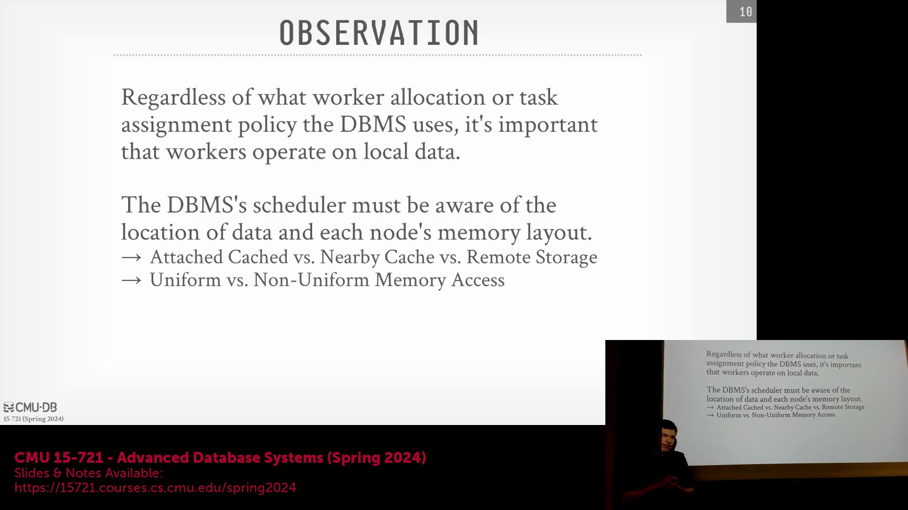

## 分布式缓存与跨节点干扰
在分布式共享磁盘(Shared-Disk)架构中，系统通常利用本地挂载的临时存储（如云实例上的 NVMe 驱动器）作为高速缓存(Cache)，以规避远程对象存储(Object Storage)的延迟与成本。更复杂的策略则探索利用其他计算节点(Compute Node)作为邻近缓存来满足数据请求。然而，系统通常会刻意避免直接从其他节点获取缓存数据。若某节点已出现性能降级(Performance Degradation)（这通常是触发工作窃取的原因），向其路由额外的跨节点数据请求(Cross-Node Data Request)只会进一步加剧其瓶颈。因此，调度器通常更倾向于直接从集中式存储(Centralized Storage)获取数据，而非冒着干扰已超负荷节点的风险。

## 数据分区与文件级放置策略
数据分区(Data Partitioning)通过哈希(Hash)、范围(Range)或轮询(Round-Robin)等策略将数据集分散至不同计算资源上，以平衡负载并最小化连接操作(Join Operations)时的数据洗牌(Shuffle)。在现代数据湖仓(Data Lakehouse)环境中，数据以不可变文件(Immutable Files)的形式存储于云端，复杂的重新分区(Repartitioning)往往不切实际。因此，系统通常默认在文件或行组(Row Group)级别采用简单的轮询分布策略。该方法大幅降低了目录元数据(Catalog Metadata)的开销，并简化了数据放置(Data Placement)逻辑。系统目录(System Catalog)会记录哪个工作节点或服务器负责处理哪个文件，从而使调度器能够将扫描任务(Scan Task)精准路由至指定的负责节点。这种结构化的分配方式在无需承担动态数据重平衡(Data Rebalancing)开销的前提下，最大化了本地缓存的利用率。

## 将物理计划转换为可执行任务
在明确工作节点分配、推/拉(Push/Pull)策略以及数据放置(Data Placement)策略后，系统必须将优化后的物理查询计划(Physical Query Plan)转换为可执行的任务。流水线阻断点(Pipeline Breakers)自然划定了这些任务的边界，将独立的执行阶段隔离开来。对于联机事务处理(Online Transaction Processing, OLTP)负载，此转换相对直接，因为查询通常仅包含依赖极少的单一流水线。调度器只需下发任务以立即执行，其核心职责侧重于并发控制(Concurrency Control)与资源仲裁(Resource Arbitration)，而非复杂的任务编排(Task Orchestration)。

## OLAP 复杂度与静态调度基础
由于存在深度的流水线依赖(Pipeline Dependencies)，联机分析处理(Online Analytical Processing, OLAP)负载的调度变得尤为复杂。为确保执行正确性并避免结果遗漏，调度器必须强制遵循严格的执行顺序：在所有上游依赖流水线完全执行完毕并物化其中间结果(Materialization of Intermediate Results)之前，下游流水线严禁启动。此类依赖链天然限制了完全并行化(Full Parallelization)的潜力，因而需要精细的协调。同样重要的是，调度决策必须基于物理查询计划(Physical Query Plan)而非逻辑查询计划(Logical Query Plan)，因为前者包含了将算子映射至具体硬件资源所必需的算法实现细节。应对此类复杂性的基础方法是静态调度(Static Scheduling)，即在查询生命周期的初始阶段，由优化器或调度器预先计算出完整的任务分配、资源划分及执行拓扑。
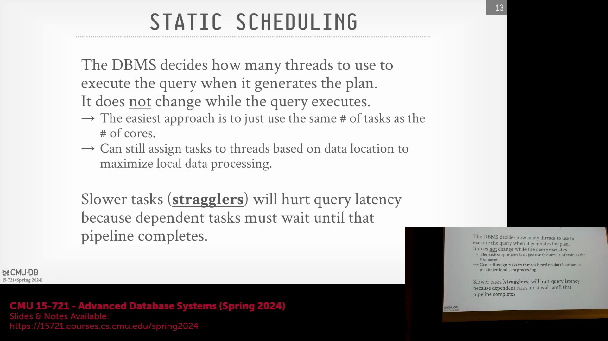

---

## 静态调度的局限性
静态调度(Static Scheduling)涉及将任务预先刚性分配给工作节点(Worker)或 CPU 核心(CPU Core)，通常以优化初始数据局部性(Initial Data Locality)为目标。虽然实现简单，但该方法完全缺乏运行时(Runtime)适应性。其根本缺陷在于“拖尾(Straggler)问题”：当数据分布倾斜(Data Skew)，或某些查询谓词(Query Predicates)具有高度选择性但计算代价高昂时，某个工作节点处理其分配数据块的速度可能会显著慢于其他节点。由于下游流水线阶段(Downstream Pipeline Stages)通常依赖于上游任务的完成，这单个缓慢的工作节点会导致所有其他核心陷入停滞，从而形成严重的性能瓶颈，彻底抵消并行执行(Parallel Execution)带来的收益。

## 引入 Morsel 驱动并行
为缓解运行时差异和拖尾问题，Morsel 驱动并行(Morsel-Driven Parallelism)模型引入了动态的即时任务分配机制。在该架构中，数据表被水平切分为易于管理的数据块，称为“Morsel”（概念上等同于现代数据库中的行组(Row Group)）。系统采用拉式(Pull-Based)分配模型，每个核心运行一个专用的工作线程(Worker Thread)，自主从中央队列中拉取任务。工作线程会优先处理位于其本地非统一内存访问(NUMA)区域内的 Morsel 任务，以最小化跨 CPU 插槽互联(Cross-Socket Interconnect)的延迟。然而，若本地无可用任务，工作线程将主动执行全局队列中的下一个可用任务，而不受数据局部性约束，从而确保核心保持忙碌状态，并有效掩盖缓慢拖尾任务(Straggler Tasks)带来的影响。这一极具影响力的设计已被业界广泛采用，尤为显著的是，它构成了 DuckDB 查询执行(Query Execution)的基石。

## 协作式调度与扩展性挑战
Morsel 驱动执行依赖于协作式调度(Cooperative Scheduling)范式：系统中不设专用的调度分发线程。相反，确定下一个最佳任务的逻辑被分散至所有工作节点中，它们通过轮询方式共同访问一个全局任务队列(Global Task Queue)。虽然这简化了系统架构并分散了决策压力，但原始研究对保护共享全局哈希表(Shared Global Hash Table)或队列所需的同步开销(Synchronization Overhead)并未深入探讨。随着现代多路服务器(Multi-Socket Servers)的核心数量扩展至数十甚至数百个，对该中心化数据结构的访问争用(Access Contention)成为了关键的性能瓶颈。面向大规模硬件设计的系统明确指出了这一局限性，证明若不引入过高的锁开销(Lock Overhead)或缓存行颠簸(Cache-Line Bouncing)代价，单个全局队列便无法高效扩展至高核心数环境。
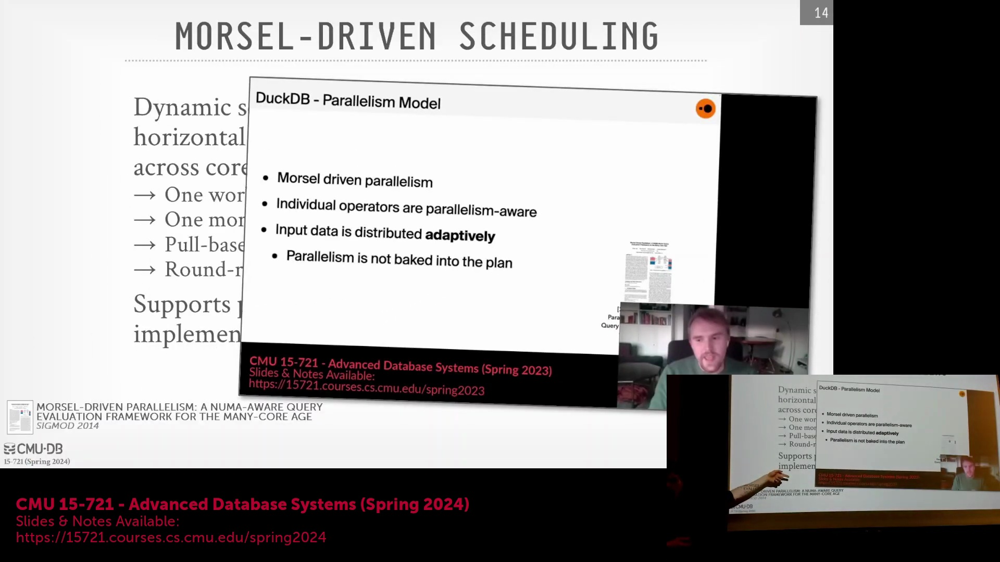

## 优化 Morsel 粒度以提升性能
确定 Morsel 的最佳粒度(Morsel Granularity)是一项关键的系统工程权衡(System Engineering Trade-off)。若 Morsel 过小，工作节点将耗费过多 CPU 周期在任务队列争用上，导致调度开销(Scheduling Overhead)反客为主成为主要瓶颈。反之，若 Morsel 过大，系统实际上将退化回静态调度模式，单个过大的数据块极易制造出拖尾任务，进而导致整个流水线停滞。奠基性的 Hyper 论文指出，每个 Morsel 包含约 10 万条元组(Tuple)是该架构的最佳平衡点，有效兼顾了并行度(Parallelism)与队列争用。Peloton 和 NoisePage 等其他研究型系统则尝试了不同的粒度策略，例如固定 10MB 的数据块或仅含 1000 条元组的微块，以优化内存布局(Memory Layout)、指针运算(Pointer Arithmetic)及缓存行为(Cache Behavior)。
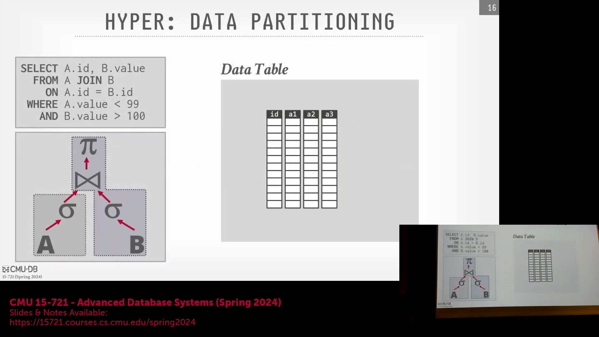

## 执行流程、局部性与流水线依赖
在执行期间，每个工作节点利用本地内存(Local Memory)处理其分配的 Morsel，并将所有中间结果写入核心本地缓冲区(Core-Local Buffer)。该设计严格避免向远程 NUMA 内存(Remote NUMA Memory)写入数据，从而保护了关键内存带宽，并最小化了跨 CPU 互联延迟。然而，严格的流水线依赖(Pipeline Dependencies)仍会强制引入同步屏障(Synchronization Barrier)：当下游阶段需要上游结果时，若前置流水线尚未完全物化中间结果，工作节点必须进入空闲状态。试图通过切换至其他并发查询(Concurrent Queries)来缓解此类空闲时间会引入新的复杂性，因为共享缓冲池(Shared Buffer Pool)可能面临严重争用，或需执行代价高昂的数据驱逐(Data Eviction)与上下文交换。归根结底，尽管 Morsel 驱动执行最大化了硬件利用率(Hardware Utilization)并缓解了数据倾斜问题，但其性能根本上仍受制于复杂查询计划中固有的顺序依赖关系(Sequential Dependencies)。
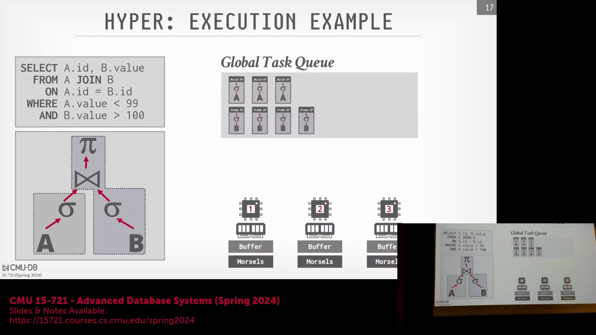
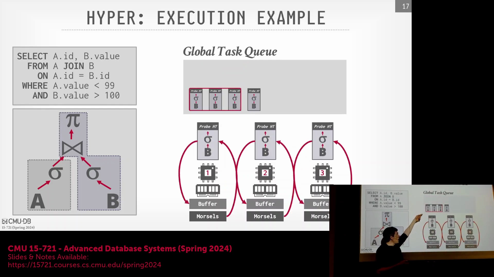

---

## 流水线亲和性与工作窃取权衡
为最大化吞吐量(Throughput)并最小化跨 CPU 插槽延迟(Cross-Socket Latency)，调度器通过实施流水线亲和性(Pipeline Affinity)策略，将消耗中间结果的下游任务分配至与生成该结果相同的物理核心(Physical Core)。当工作节点(Worker)耗尽本地任务队列(Local Task Queue)时，为避免核心闲置(Core Idling)，它可能会跨非统一内存访问(Non-Uniform Memory Access, NUMA)区域执行工作窃取(Work-Stealing)以获取远程数据。系统设计将 NUMA 互联延迟(NUMA Interconnect Latency)视为必要的权衡(Trade-off)，其核心逻辑在于：远程内存访问(Remote Memory Access)的代价仍低于 CPU 周期停滞(CPU Cycle Stalling)所带来的机会成本(Opportunity Cost)。尽管理论上可通过精确的启发式算法(Heuristic Algorithm)确定最佳窃取时机（以避免原任务在数毫秒内即完成的情况），但维护此类微观预测所需的状态开销(State Maintenance Overhead)往往难以承受。在以十万条元组(Tuple)为执行粒度(Execution Granularity)、操作在毫秒级完成的场景下，激进的工作窃取策略仍是一种更简单且更有效的近似方案(Approximation)。
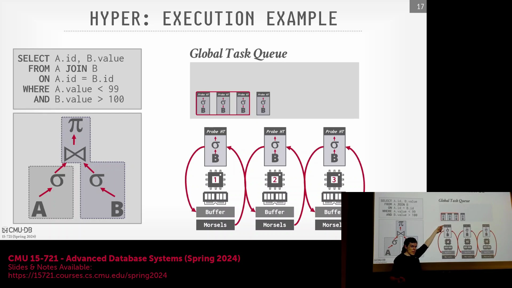

## 缓冲区管理与交换算子同步
Morsel 驱动架构(Morsel-Driven Architecture)通过将每个任务严格分配至互不重叠的数据块(Morsel)来实现数据隔离(Data Isolation)，从而消除了对部分结果进行同步的需求。然而，管理中间输出带来了新的挑战。工作节点将结果写入核心本地缓冲区(Core-Local Buffer)以维持缓存效率(Cache Efficiency)，但激进的工作窃取可能导致缓冲区耗尽(Buffer Exhaustion)。若在执行期间动态重平衡(Dynamic Rebalancing)或刷新(Flush)这些缓冲区，将产生过高的协调开销(Coordination Overhead)。因此，系统通常假设内存充足，或选择暂时挂起处理直至当前流水线阶段完成。此外，流水线边界由串行执行的交换算子(Exchange Operators)进行同步控制。与可高度并行的扫描(Scan)或连接(Join)任务不同，此类算子无法并行化；系统必须由单一线程聚合所有上游子流水线的输入，合并中间数据，并在进入下一调度阶段前将最终输出物化(Materialization)。

## Hyper Morsel 调度器的局限性
尽管初代 Hyper 调度器已被广泛采用，但仍存在若干架构局限性(Architectural Limitations)。任务与数据块(Morsel)之间严格的映射关系，结合固定的“单核单工作线程”(One-Worker-Per-Core)模型，严重阻碍了工作负载的动态重平衡(Dynamic Rebalancing)。若单个拖尾任务(Straggler Task)因数据倾斜(Data Skew)或高计算代价谓词(High-Cost Predicates)而滞后，其余所有工作节点均被迫空闲等待。此外，该模型隐含假设了每条元组的处理代价是均匀的，这一假设在处理复杂逻辑或高选择性过滤(High-Selectivity Filtering)条件时往往失效。同时，依赖共享的全局哈希表(Global Hash Table)进行任务排队会引发锁争用瓶颈(Contention Bottleneck)，难以在现代多路服务器(Multi-Socket Hardware)上实现良好扩展。最关键的是，该调度器缺乏服务质量(Quality of Service, QoS)控制机制。它以一种尽最大努力(Best-Effort)的自由调度模式运行，允许单个长时运行的分析查询独占所有工作线程。这将导致新抵达的短查询(Short Query)面临资源匮乏，并严重恶化系统的尾部延迟(Tail Latency)与用户主观响应体验。

## Umbra 调度器：时间片与优先级衰减
为突破上述局限，原 Hyper 团队独立设计并开发了其继任系统 Umbra。在企业并购导致 Hyper 知识产权转移至 Tableau/Salesforce 后，Umbra 系统从零开始重构，并对其底层执行模型(Execution Model)进行了根本性的重新设计。Umbra 摒弃了僵化的任务与数据块绑定机制，转而采用基于时间片(Time Slice)的执行单元(Execution Quanta)。在每个时间片内，任务可连续处理多个数据块，直至分配的时间预算(Time Budget)耗尽，随后主动让出 CPU 控制权。该方法实现了细粒度资源共享(Fine-Grained Resource Sharing)，同时避免了同步部分任务完成状态所带来的复杂性。至关重要的是，Umbra 引入了自动指数级优先级衰减(Exponential Priority Decay)机制：随着查询运行时间的延长，其调度优先级将呈指数级系统性降低。该机制确保了短小、交互式的查询(Interactive Queries)能够被快速交错调度，并优先于长时运行的后台负载执行。从而在维持高整体吞吐量(Overall Throughput)的同时，有效根治了服务质量层面的资源饥饿(Resource Starvation)问题。

---

## 动态 Morsel 大小调整与执行时间估算
调度器无法预先预测任务的执行时间，因此依赖于持续的运行时监控(Runtime Monitoring)来自适应地管理工作负载的粒度(Workload Granularity)。系统并非在内存中物理复制或调整数据大小，而是根据观测到的性能表现，动态调整*后续* Morsel 的逻辑边界(Logical Boundaries)。若任务持续以快于约 1 毫秒的目标阈值完成，调度器会以指数方式(Exponential Manner)增大后续分配任务的 Morsel 尺寸。反之，若执行时间过长，则会收紧边界（即减小数据分块大小）。这种持续校准实现了一项关键平衡：它在最大限度降低频繁查询全局队列带来的状态维护开销(State Maintenance Overhead)的同时，有效避免了因任务块过大或分布不均而引发的拖尾问题(Straggler Problem)。

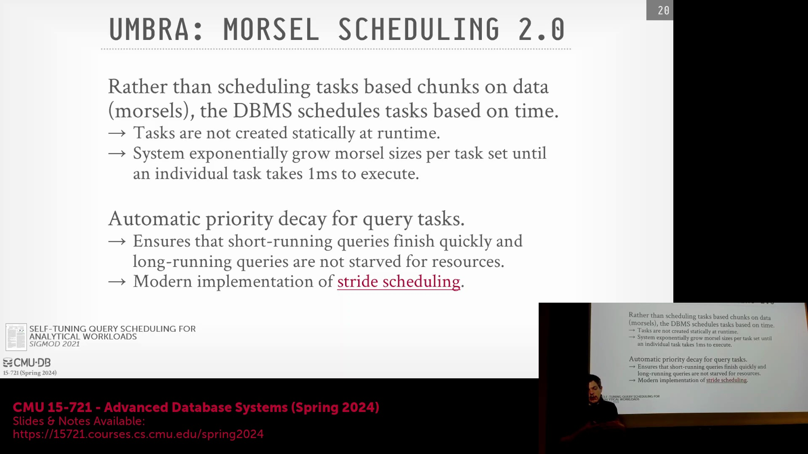

## 优先级衰减与基于水位线的公平调度
为防止长时间运行的分析查询(Analytical Query)独占系统资源并降低短小交互式工作负载(Interactive Workload)的响应速度，调度器实现了自动指数级优先级衰减(Exponential Priority Decay)机制。查询在初始阶段享有高优先级，但随着执行时间的延长，其调度优先级会系统性地降低。为确保公平性(Fairness)并防止长时运行任务陷入饥饿(Starvation)，系统采用了结合全局水位线(Global Watermark)（或称“通行证”(Pass)）计数器的步长调度算法(Stride Scheduling Algorithm)。新抵达的短查询会被分配特定的水位线值，使其能够在执行队列中获得优先调度；而长时间运行的查询则会通过累积调度信用(Scheduling Credit)，逐步提升其水位线。一旦其水位线超过全局阈值(Global Threshold)，系统便会为其分配 CPU 时间片(CPU Time Slice)。该机制确保了长查询最终得以完成，同时不会阻塞新进入的交互式查询。

## 去中心化通知与基于槽位的任务队列
Umbra 调度器的一项重大架构转变是摒弃了集中式且依赖重度锁机制(Heavyweight Locking)的全局任务队列(Global Task Queue)。取而代之的是，系统采用了一个包含任务元数据指针(Metadata Pointer)的全局槽位(Slot)数组，并结合每个工作节点(Worker)上的线程局部存储(Thread-Local Storage, TLS)来跟踪本地状态。工作节点通过维护特定的位掩码(Bitmask)（如 `active`、`change` 和 `return` 掩码），即可在本地监控队列状态，而无需执行持续的同步操作(Synchronization Operations)。
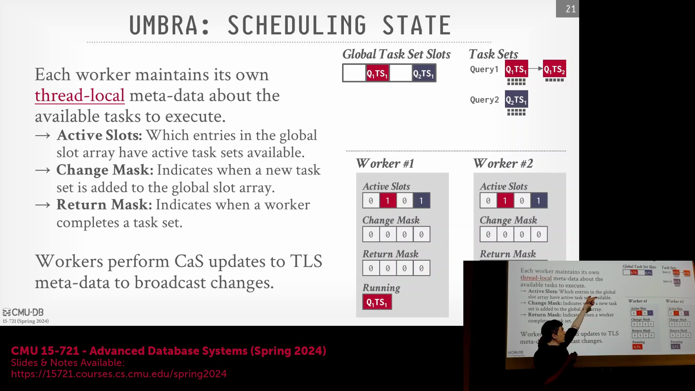
当一个任务集(Task Set)完成且新任务集入队时，系统通过在系统互联总线(Interconnect Bus)上执行原子比较并交换(Compare-And-Swap, CAS)操作，翻转其他工作节点返回掩码(`return` Bitmask)中的特定位。此举有效避免了昂贵的推式协调开销(Push-Based Coordination Overhead)。

该机制的作用类似于轻量级的消息公告板(Message Bulletin Board)：它仅广播队列状态已发生变更，而无需传输实际的任务数据(Task Data)，亦无需依赖重量级的同步闩锁(Synchronization Latches)。

当工作线程(Worker Thread)下一次进入调度例程(Scheduling Routine)时，它会检查本地掩码(Local Bitmask)；一旦检测到变更通知，便自主从全局槽位数组中拉取(Pull)更新后的任务信息。
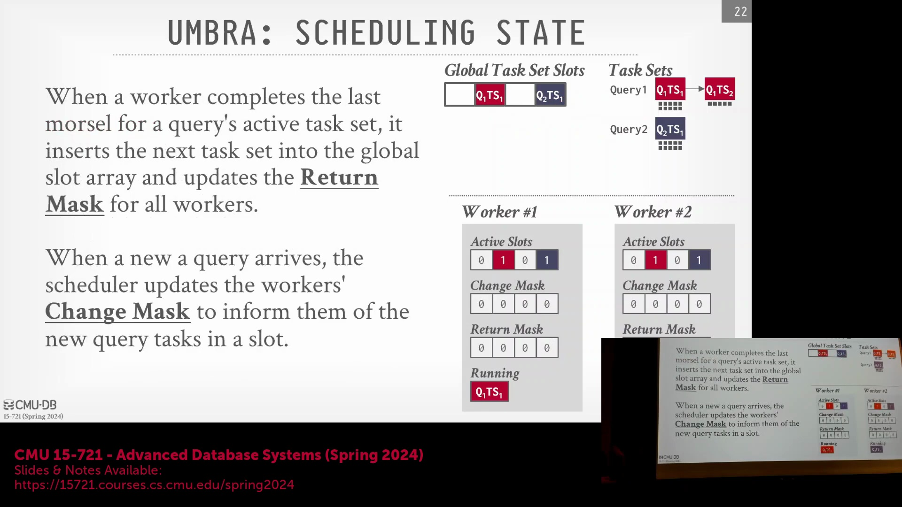
通过限制活跃槽位(Active Slots)的数量（例如上限为 128 个），并依赖原子位翻转操作(Atomic Bit-Flip Operations)替代完整的数据传输或锁争用(Lock Contention)，该架构在多核系统(Multi-Core Systems)上实现了极高的可扩展性(Scalability)。
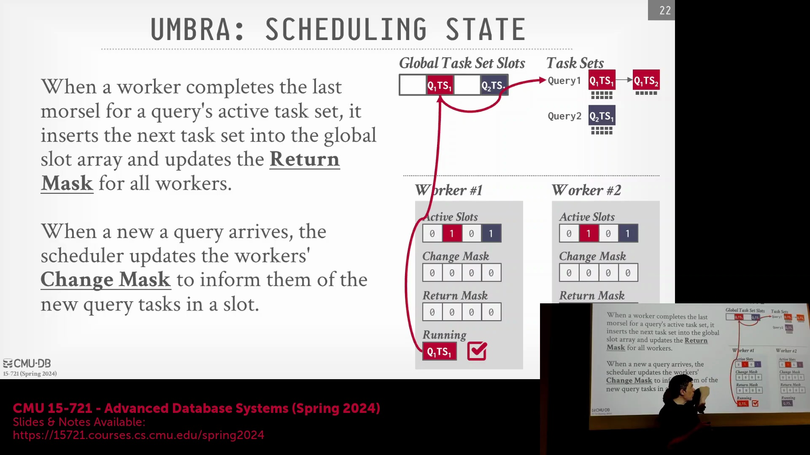
这种去中心化的拉式方法(Decentralized Pull-Based Approach)确保了工作节点始终维持高利用率(High Utilization)，能够动态适应(Dynamically Adapt)不断变化的工作负载，并彻底规避了传统集中式调度器(Centralized Scheduler)固有的性能瓶颈。
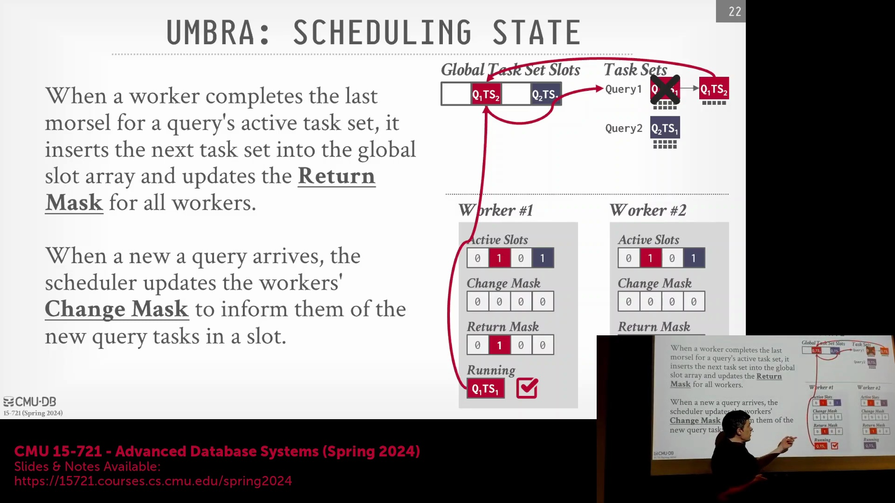
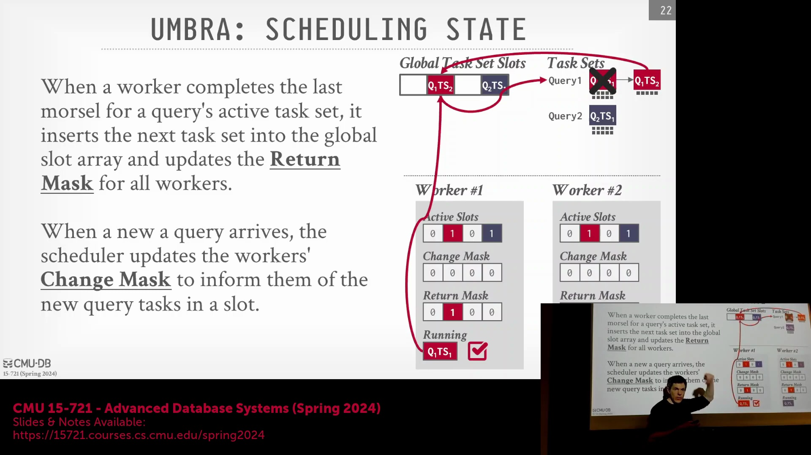

---

## 协作式调度与任务通知

该调度架构采用基于拉取(pull-based)的协作式模型，而非依赖集中式的调度线程。当新查询到达时，会被置入全局任务队列中。调度器（或协调器）无需使用专用线程直接分配任务，只需翻转变更掩码(change mask)中的一个比特位，即可向工作线程发出新任务就绪的信号。工作线程会独立轮询全局任务集，通过检查变更掩码(change mask)和返回掩码(return mask)来认领任务。尽管分发此类通知会产生一定的簿记开销(bookkeeping overhead)，但借助线程局部存储(Thread-Local Storage, TLS)与简单的原子位翻转操作来管理状态，相较于依赖复杂消息分发的重量级推送式(push-based)调度器，该架构在多核系统中具备显著更高的可扩展性。

## 优先级管理与衰减
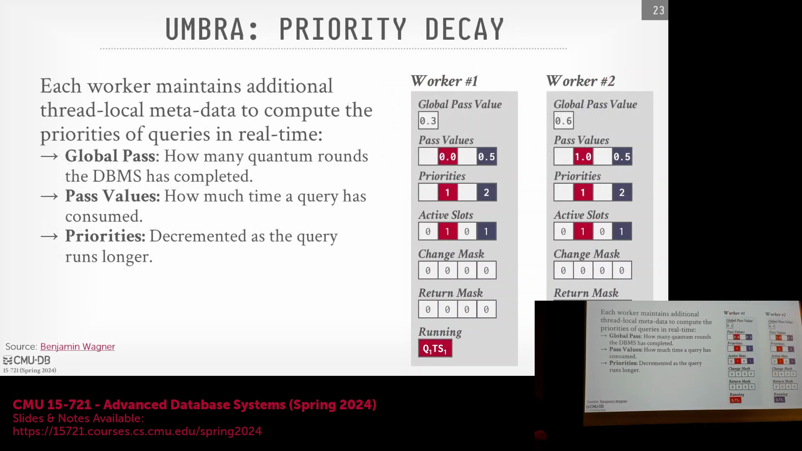
任务的执行顺序由全局与局部优先级指标共同决定。系统通过维护全局轮次计数(global pass count)为查询分配整数优先级，同时结合特定工作线程对该查询已完成的工作量来计算局部优先级。该系统的一项关键特性是优先级衰减(priority aging)：查询的运行时间越长，其优先级便会自然降低。这种动态调整机制确保了计算资源的公平分配，并有效防止长耗时查询无限期地独占工作线程。

## SAP HANA 的线程管理架构

与将调度权直接委托给宿主操作系统的传统数据库系统不同，SAP HANA 实现了一套高度复杂的自管理线程模型(self-managed thread model)。该设计通过在单个非统一内存访问(NUMA)节点内同时支持工作窃取(work stealing)与动态线程扩缩容(dynamic thread scaling)，有效规避了操作系统层面的调度限制。HANA 采用两种工作队列：硬队列(hard queue)用于必须在特定 CPU 插槽或 NUMA 节点本地执行的任务（如区域专属的垃圾回收或网络 I/O 任务）；软队列(soft queue)则用于通用任务，此类任务虽不可跨节点被窃取，但可由同一 NUMA 节点内的任意空闲线程执行。

## HANA 中的工作线程状态

为优化资源利用率，HANA 将线程划分为四个独立的池。活跃线程(Active threads)负责实际执行计算任务。非活跃线程(Inactive threads)处于内核阻塞状态，等待条件变量(condition variables)、闩锁(latches)或同步事件。空闲线程(Free threads)保持自旋状态，持续轮询任务队列以获取待处理工作。停放线程(Parked threads)已将控制权交还给操作系统内核（类似于休眠让出状态）。当工作负载骤增时，唤醒处于停放状态的线程，其计算开销远低于从零创建新进程或线程。

## 队列执行与多插槽架构优化

在实际运行中，多版本并发控制(MVCC)垃圾回收等后台维护任务会被路由至硬队列，而标准查询操作则进入软队列。HANA 的内部实验表明，在大型多插槽服务器上，完全禁用工作窃取(work stealing)（即强制所有任务进入硬队列）的实际性能反而优于允许任务在不同 NUMA 节点间迁移。这种自管理模式对联机事务处理(OLTP)工作负载尤为高效；同时，为兼顾联机分析处理(OLAP)与 OLTP 的混合需求，HANA 在架构设计中引入了这些灵活的线程调度变体。

## SQL Server 的 SQL OS 抽象层

SQL Server 内置一个名为 SQL OS 的自定义抽象层，该架构于 2006 年首次引入。SQL OS 并非完整的操作系统，其核心作用是为数据库引擎上层屏蔽底层硬件与宿主操作系统的实现细节。微软设计该抽象层的初衷在于：每当底层硬件架构更新（如 CPU 核心数增加或 NUMA 拓扑结构变化）时，数据库内核无需频繁重写调度与数据搬迁逻辑。通过封装底层细节，SQL OS 使得数据库引擎能够自主实现非抢占式(non-preemptive)线程调度，从而保障性能表现的跨平台一致性，并显著降低对特定硬件架构的依赖。

---

## 非抢占式调度与数据库协程
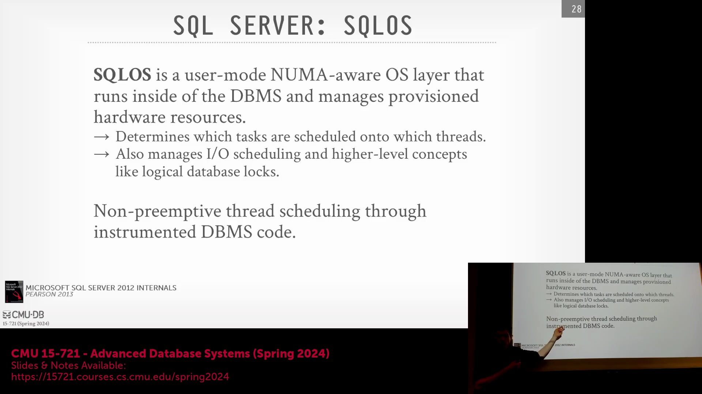
现代高性能数据库系统通常采用协作式非抢占调度模型(Cooperative Non-preemptive Scheduling Model)来管理并发(concurrency)。与允许操作系统内核强制中断线程并重新分配硬件资源的抢占式调度(Preemptive Scheduling)不同，数据库的非抢占式调度器依赖于线程主动让出控制权。这要求在数据库代码库中植入显式的让出(yield)指令，将执行权交还给内部调度器，以便其评估是否切换至其他任务。该调度范式由 SQL Server 于 2006 年通过其 SQL OS 抽象层率先引入，远早于 C++ 与 Go 等现代编程语言广泛支持内置协程(coroutines)的时代。

## 时间片与执行跟踪

为确保资源的公平分配，并防止长耗时操作导致其他任务陷入饥饿(starvation)状态，系统可为快照扫描(snapshot scan)等特定算子(operator)分配固定的执行时间片(time slice)（例如 4 毫秒）。算子在处理数据时会持续追踪已消耗的 CPU 时间。一旦执行时长超出预设阈值，线程便会触发让出操作，将控制权交还给调度器。尽管频繁查询系统时钟会带来较高的计算开销，但现代 CPU 提供的硬件时间戳计数器(Timestamp Counter, TSC)等指令集实现了高效且低开销的时间计量，使该机制在生产环境中具备高度的可行性。

## 针对锁争用的条件让出
内置的数据库调度器通过支持条件让出(conditional yield)机制，提供了远比宿主操作系统(Host OS)更为精细的控制粒度。例如，当线程尝试获取被其他事务持有的数据库锁(database lock)时，可向调度器附加特定条件交出控制权：“在该锁释放前，请勿重新调度本线程。”此时，数据库调度器既不会让线程陷入高开销的自旋等待(spin-waiting)以浪费 CPU 周期，也不会将控制权盲目交还给操作系统，而是将该线程挂起至等待队列，仅在锁资源满足条件时才高效地重新唤醒它。此举大幅降低了上下文切换(context switch)的开销，并有效提升了系统整体吞吐量(throughput)。

## 内部调度器的工业界实现
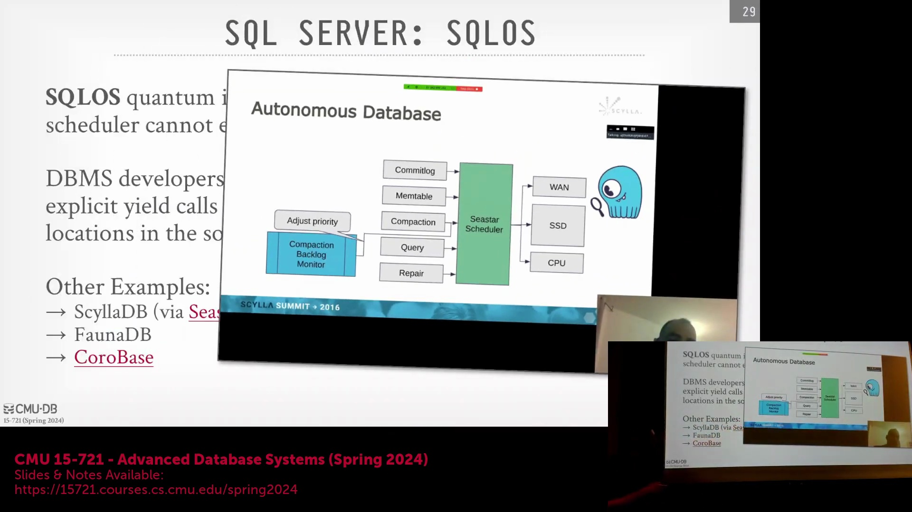
当前，众多数据库系统已采用自定义协程(coroutines)或调度框架，以规避操作系统的调度限制。例如，CeliaDB 实现了一套名为 C-star 的复杂框架，用于在工作线程池(worker thread pool)间管理协作式执行(cooperative execution)。FaunaDB 则采用了一种更为精简但高效的策略：在发起每次磁盘 I/O(disk I/O)请求前，主动将控制权让出给内部调度器。此外，西蒙菲莎大学(Simon Fraser University)研发的学术实验型系统（如 CorBase）已将线程局部协程(thread-local coroutines)直接集成至其核心架构中。这些工业界与学术界的实践印证了一个日益显著的共识：数据库内核级调度是实现可预测高吞吐量(predictable high throughput)性能的关键所在。

## 分布式调度与架构哲学

当工作负载扩展至多机集群时，分布式调度(distributed scheduling)不仅需继承单节点协调(single-node coordination)的全部复杂性，还需额外应对网络延迟(network latency)、跨节点通信(cross-node communication)及远程状态管理(remote state management)等挑战。以 Snowflake 为代表的云原生架构(cloud-native architectures)证明，现代系统已能够无缝融合本地协作式调度与分布式工作窃取(distributed work stealing)。本讲座传递的核心架构理念十分明确：为追求极致性能，数据库系统必须完全自主掌控线程管理，而非将其委托给通用操作系统。尽管构建类似 SQL OS 的自定义调度器会显著增加工程复杂度，但它彻底消除了不可预测的操作系统内核干扰，从而能够实现高度优化且具备工作负载感知(workload-aware)特性的执行流。

## 课程总结与后续主题

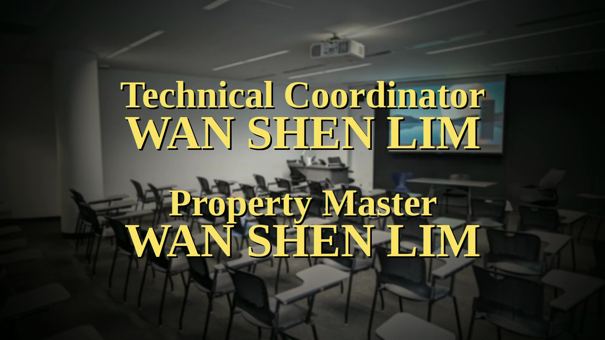

本模块至此结束了对查询调度(query scheduling)、协调机制(coordination mechanisms)及内部线程模型(internal thread model)的深入探讨。后续课程将聚焦于高级连接算法(advanced join algorithms)，首先详细讲解哈希连接(hash joins)，随后引入多路连接策略(multi-way join strategies)。此外，针对同学们先前提出的疑问，课程将增设关于硬件性能计数器(hardware performance counters)的专题概述。最后，下周的教学安排将转向项目进度汇报(project progress updates)，旨在将上述理论调度概念与实际动手开发系统紧密衔接。