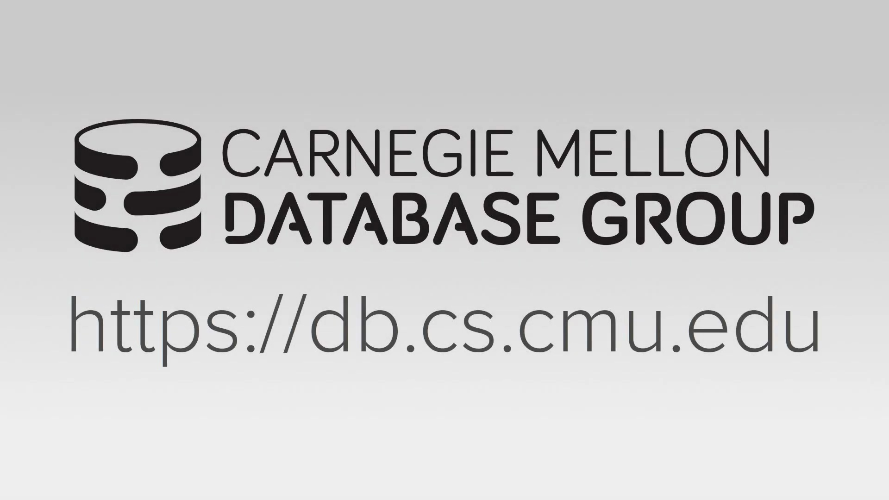
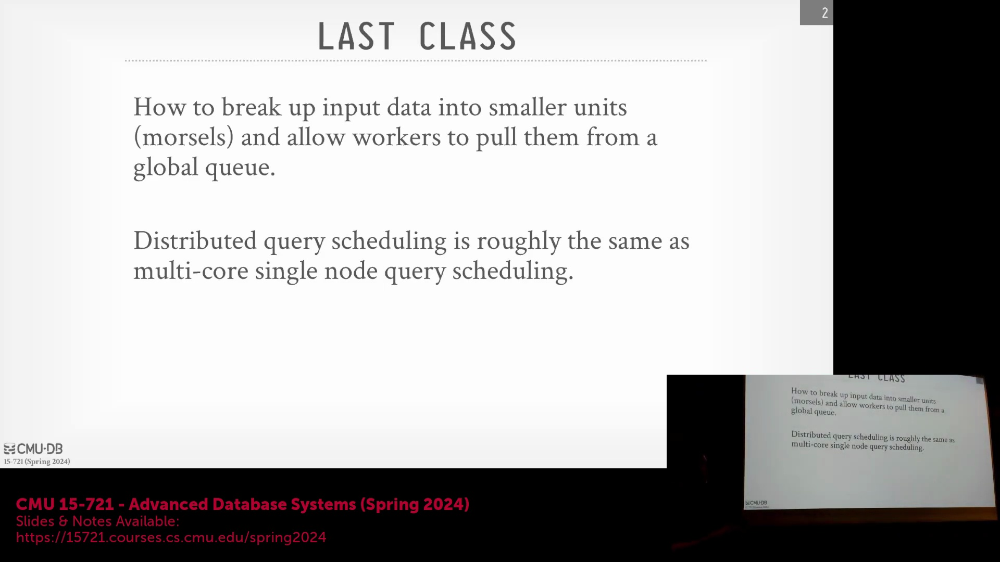
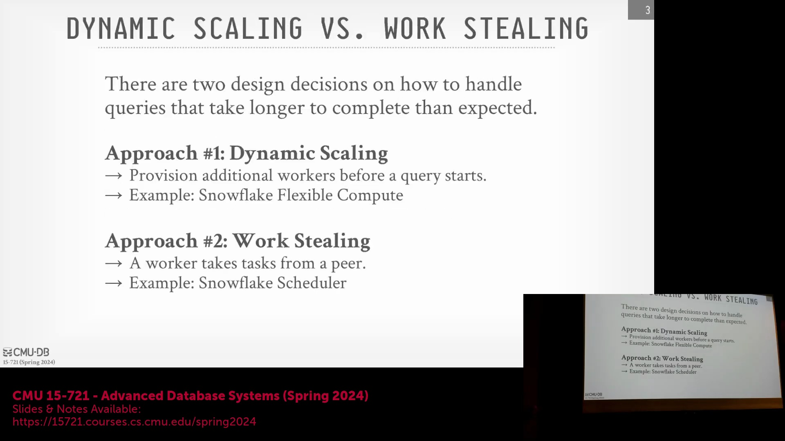
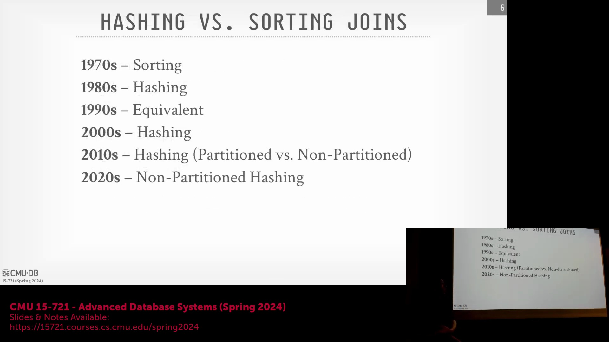
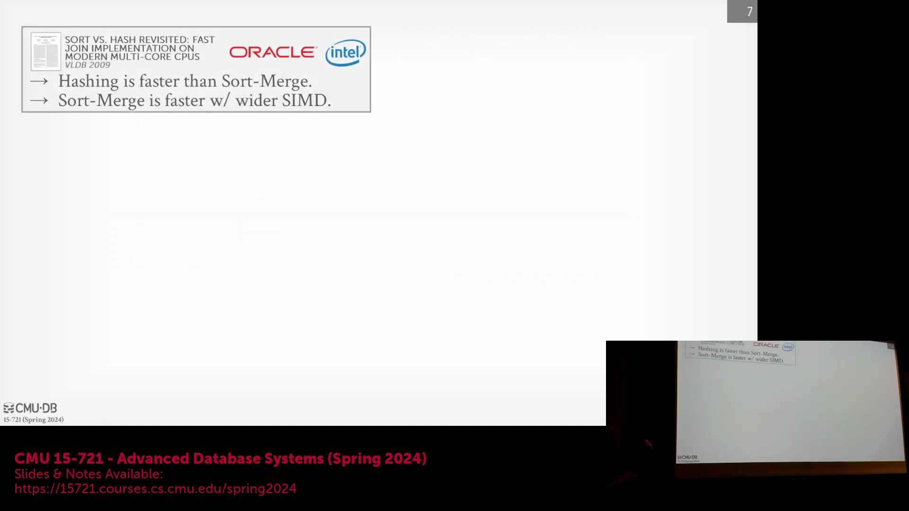

## 课程介绍与授课范围
卡内基梅隆大学(CMU)的高级数据库系统课程(Advanced Database Systems，在配备现场观众的教学演播室录制)继续深入探讨哈希连接(Hash Join)。尽管理想情况下这些内容可拆分为两节课，但本次授课旨在单次课程中尽可能涵盖更多基础与进阶内容。

## 回顾：数据分块(Morsel)与拉取式调度
承接上一讲内容，本部分将回顾数据库系统如何解析查询计划(Query Plan)、定位目标数据，并将其分割为更小的处理单元——数据分块(Morsel)。在拉取式调度(Pull-based Scheduling)模型中，工作线程(Worker Threads)从全局队列中拉取数据分块，该模型的性能始终优于推送式调度(Push-based Scheduling)方案。尽管不同系统在数据分块的底层实现上存在差异，但将大型数据集拆分为易于管理的数据块这一核心理念，仍是并行数据处理的基本策略。

## 分布式系统与任务调度
尽管前述讨论主要聚焦于单节点架构(Single-node Architecture)，但这些调度概念可自然延伸至分布式环境。在分布式系统中，核心差异在于需重点考虑节点间的网络延迟，而非假设各节点间存在共享内存访问(Shared Memory Access)。任务分发通常采用分层架构：既可将离散任务直接分配至特定节点，也可将任务批(Batch)委托给某一节点，由其负责在本地工作线程间进行二次分发。这两种模型在延迟管理与负载均衡(Load Balancing)方面各有优劣。

## 动态扩缩容与工作窃取机制
现代查询执行高度依赖动态扩缩容(Dynamic Scaling)与工作窃取机制(Work Stealing)，以缓解拖尾任务(Straggler Tasks)造成的瓶颈，并实现负载的动态再平衡。动态扩缩容在云环境中尤为高效，系统可实时监测任务需求何时超出可用工作线程的承载能力，并临时调配额外的水平计算资源(Horizontal Compute Resources)。以 Snowflake 为例，该系统利用支持共享数据层的“弹性计算集群(Elastic Compute Clusters)”来加速查询，且无需承担永久性硬件开销，此种能力在传统的固定本地部署(On-premises Deployment)中难以复现。相对而言，工作窃取机制允许空闲线程主动从繁忙线程处“窃取”未完成任务。其具体实现策略因系统而异：部分系统（如 Hyper）会直接从对等线程的 CPU 缓存(CPU Cache)中抓取数据以实现极低延迟；而另一些系统（如 Snowflake）则倾向于从分布式远程存储中拉取数据，以避免干扰源节点的计算性能。

## 转向并行哈希连接
本讲将重点转向连接操作(Join Operators)，这是关系型数据库中最核心的算子之一，本文将特别聚焦其并行执行机制。分析将基于单节点上下文展开，并假设编排层(Orchestration Layer)已妥善处理跨集群的数据移动(Data Movement)。当所有待连接数据均驻留于内存时，核心工程挑战即转化为如何最大化系统吞吐量(Throughput)。本节课将概述并行连接算法的历史演进，详解并行哈希连接的构建模块(Building Blocks)，探讨各类哈希方案(Hashing Schemes)，并深入剖析指定学术论文中的复杂概念。

## 并行连接算法与 CPU 优化目标
并行连接算法的根本目标是将连接操作并行分发至多个工作线程，使性能优化重心从传统的磁盘 I/O 转移至内存多核利用率(Multi-core Utilization)。尽管课程后续将探讨多路连接(Multi-way Joins)，但二元连接(Binary Joins)仍是绝大多数业务场景的行业标准。在算法选型上，哈希连接凭借卓越的性能在 OLAP 系统(OLAP Systems)中占据主导地位；排序合并连接(Sort-Merge Joins)专用于已预处理排序的数据集；而嵌套循环连接(Nested Loop Joins)通常仅适用于极小数据表。针对此类操作的优化需与现代 CPU 架构深度契合：需最小化线程同步开销(Thread Synchronization Overhead)、避免高昂的跨 NUMA 节点内存访问(Cross-NUMA Memory Access)，并确保内存数据对齐以规避 CPU 流水线停顿(Pipeline Stalls)。

## 连接算法的历史演进
基于排序(Sort-based)与基于哈希(Hash-based)的连接算法之间的性能博弈，始终随硬件算力的演进而不断更迭。20 世纪 70 年代，早期数据库系统依赖外部归并排序(External Merge Sort)来处理超出有限内存容量的数据表。80 年代，一项日本研究项目首创了 Grace 哈希连接(Grace Hash Join)，确立了递归分区(Recursive Partitioning)与磁盘溢出(Disk Spilling)技术，并与专用数据库硬件深度结合。至 90 年代，基础理论研究证明，在当时的硬件条件下，哈希连接与归并连接在性能上趋于等价。然而，自 2000 年以来，哈希连接持续展现出显著的速度优势，由此引发了当代学术界的核心争议：在构建哈希表前是否必须进行数据分区(Data Partitioning)，抑或是采用更简化的非分区(Non-partitioning)方案，以在绝大多数场景下提供“足够好”的性能表现。

## 现代分区策略与 SIMD 考量
近期学术界与工业界的研究凸显了分区连接(Partitioned Joins)在工程实践中的复杂性。尽管分区哈希连接在理论模型中速度更快，但其正确实现的复杂度极高，致使众多现代数据库系统倾向于采用非分区变体(Non-partitioned Variants)以降低整体工程开销(Engineering Overhead)。此外，2009 年 Intel 与 Oracle 联合发表的论文中曾提出历史性优化方案，探索利用 512 位 SIMD 寄存器(SIMD Registers)来加速排序合并连接。尽管此类针对特定硬件的微架构优化偶尔会刷新性能基准(Performance Benchmarks)，但哈希连接依然是高性能分析型查询处理(Analytical Query Processing)的默认首选方案。
