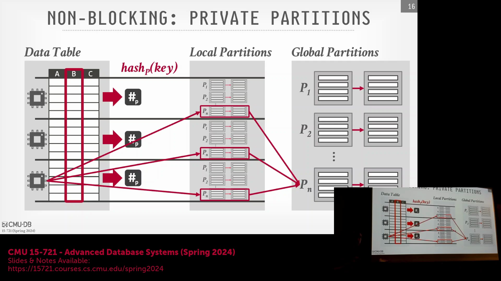
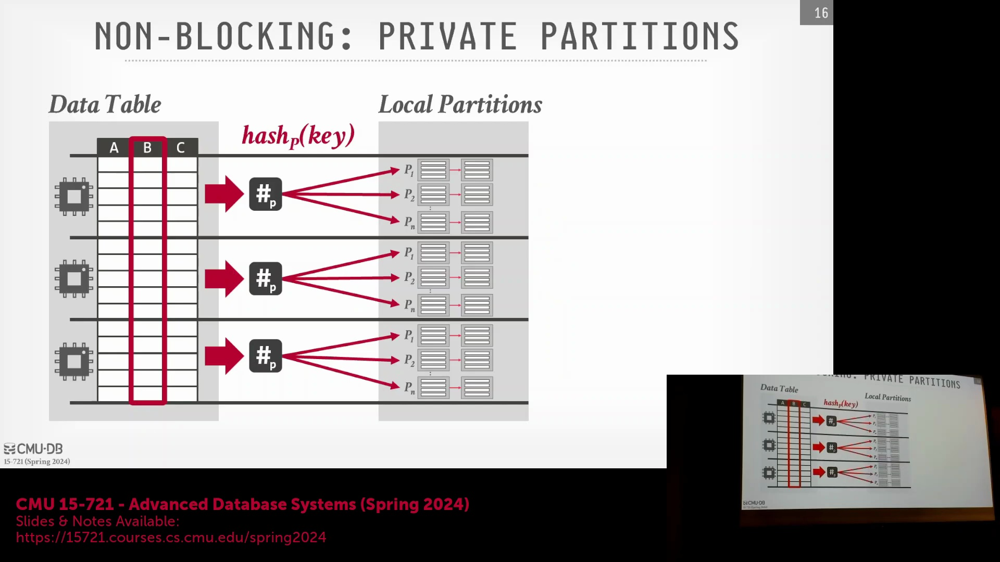
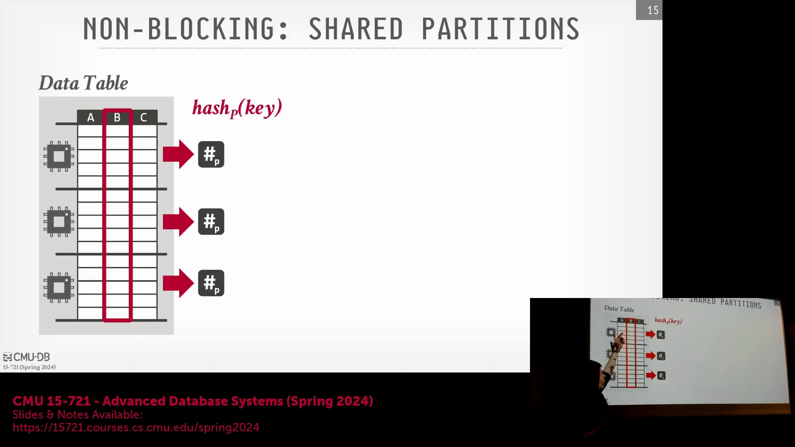
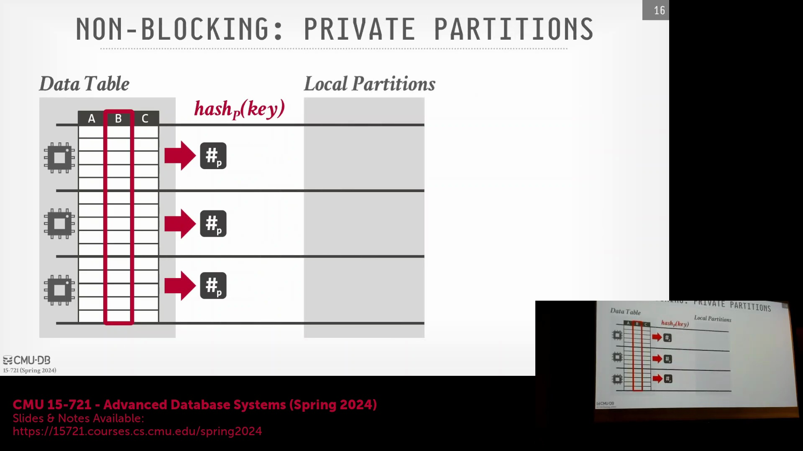
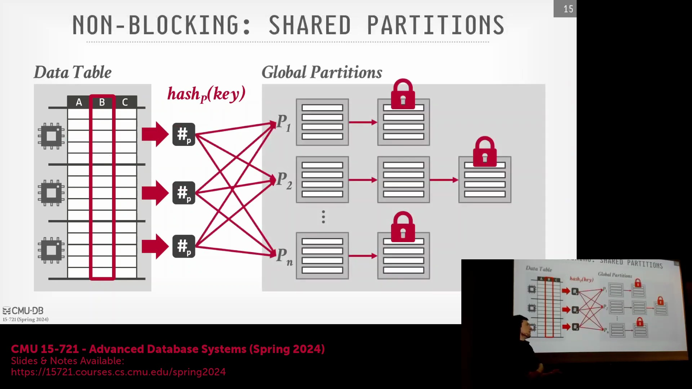
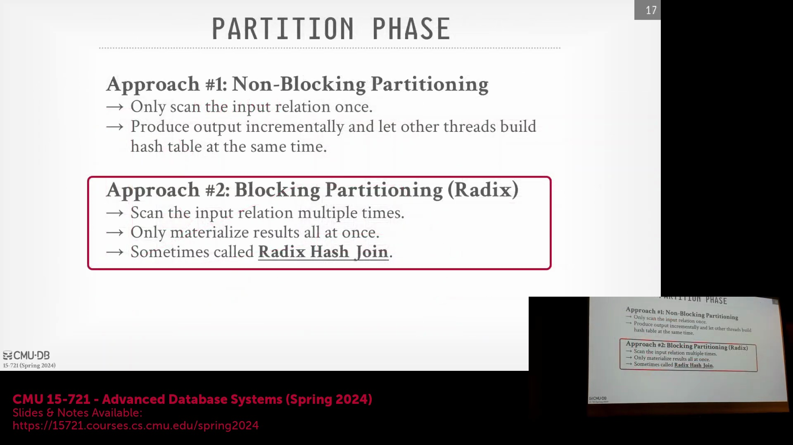
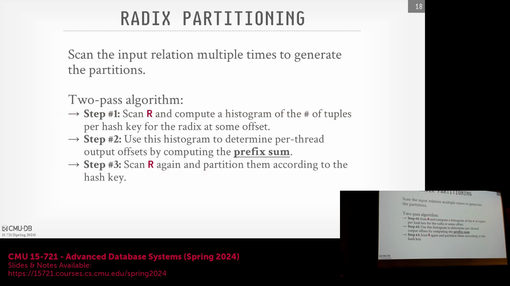

## 初始分区阶段(Initial Partitioning Phase)与缓存局部性(Cache Locality)

在初始分区阶段，每个数据块均在单个核心(Core)内进行处理，理想情况下应完全驻留于本地 L3 缓存(L3 Cache)中。由于各核心独立执行该操作，只要分区数据能完全装入缓存，便无需跨越 NUMA(Non-Uniform Memory Access)节点进行数据读写。然而，后续的合并步骤(Merge Step)将引入显著的开销。在此阶段，各核心需收集分散于其他核心所属不同 NUMA 区域的分区数据（例如分区 1）。由于涉及跨 CPU 插槽(CPU Socket)的内存访问及随之增加的延迟，聚合此类数据并将其写回目标 NUMA 区域的计算成本极高。

## 延迟物化(Late Materialization)与早期物化(Early Materialization)的权衡
在延迟物化与早期物化之间的选择将显著影响分区过程中的数据移动成本。采用延迟物化时，系统仅传输轻量级元数据（如连接键(Join Key)与元组 ID(Tuple ID)），从而最大限度地降低带宽消耗。相反，早期物化需搬运完整的元组，单行数据可能包含多达 20 列。尽管早期物化避免了后续的二次物化，但跨越 NUMA 边界传输大量数据有效载荷的开销通常会抵消该优势。最终的最优策略取决于具体工作负载(Workload)特性及数据倾斜(Data Skew)的程度。

## 硬件感知(Hardware-Aware)与本地分区(Local Partitioning)的挑战

在硬件无关策略(Hardware-Agnostic Strategy)与硬件感知策略之间做出抉择需经过审慎评估。尽管在系统启动时运行微基准测试(Micro-benchmark)可揭示硬件性能上限，但受不可预测的数据倾斜影响，实际表现常会偏离预期。在本地分区场景中，当核心向共享分区缓冲区(Shared Partition Buffer)写入数据时，尤其在分区数据量超出 L3 缓存容量时，将不得不频繁进行跨 NUMA 区域内存访问。此类跨节点访问会严重拖累性能，因此若条件允许，严格实施本地分区策略更为可取；但这依然高度依赖于底层内存架构与数据分布特征。

## 合并步骤(Merge Step)与无锁执行(Lock-Free Execution)

最终的合并步骤旨在将所有核心的微型分区(Micro-partitions)汇总至最终输出缓冲区中。每个核心均在其 L3 缓存内独立维护一组微型分区。合并期间，指定核心将顺序扫描属于特定逻辑分区的微型分区，并将其追加至全局缓冲区。该过程效率极高，因其完全依赖内存复制(`memcpy`)，无额外处理开销。关键在于，由于各核心仅读取自身维护的微型分区并写入专属的最终缓冲区，故不存在线程竞争(Thread Contention)，无需引入闩锁(Latches)或锁(Locks)等同步原语(Synchronization Primitives)，从而实现了完全的无锁执行。

## 确定分区数量与处理数据倾斜(Data Skew)
分区数量并非必须与 CPU 核心数(CPU Core Count)严格对应。尽管二者匹配可简化系统实现，但在数据分布严重倾斜时会导致性能骤降。若某一分区包含十亿个键值(Key)，而其余分区仅含数千个，该庞大分区将在后续处理中成为性能瓶颈。为缓解此问题，系统通常会生成远多于可用核心数的分区。这种超额分配(Over-provisioning)策略可将倾斜数据分散至多个分区桶(Partition Bucket)中，从而避免单个线程在构建(Build)或探测(Probe)阶段过载。

## SIMD(Single Instruction, Multiple Data)的局限性与数据暂存(Data Staging)的优势
SIMD 指令在合并阶段带来的性能收益微乎其微，因该操作本质上是顺序内存复制(Sequential Memory Copy)。此暂存步骤的核心目的在于优化后续的哈希表(Hash Table)操作。通过在分区阶段将数据预排序并分组至连续的分区块中，系统提前支付了内存停滞(Memory Stalls)的开销。当后续的构建与探测阶段扫描这些已分区缓冲区时，缓存未命中(Cache Miss)与内存停滞的次数将显著降低，进而实现更可预测且高效的执行流程。

## 降低竞争与内存开销的权衡(Trade-off)

增加分区总数能有效降低并行写入期间的线程竞争(Thread Contention)。随着可用分区桶数量的增加，多个线程同时竞争同一闩锁或写入同一内存位置的概率将大幅下降。然而，该策略也引入了显著的权衡：分配过多分区可能导致内存利用率低下(Low Memory Utilization)。若分区桶采用预分配(Pre-allocation)机制，但因数据分布稀疏导致实际填充率不足，系统将白白消耗宝贵的内存资源。因此，调整分区数量需在降低竞争与提升内存效率之间寻求最佳平衡。

## 基数分区(Radix Partitioning)简介

基数分区通过确保数据仅写入输出缓冲区一次，有效解决了物化过程中的低效问题。该算法需对输入关系(Input Relation)进行多轮遍历(Pass)。首轮遍历中，系统构建直方图(Histogram)以统计特定基数位(Radix Digits)（即从连接键哈希值中提取的数值）的出现频次。随后，系统计算直方图的前缀和(Prefix Sum)，以确定输出缓冲区中各分区的精确起始偏移量(Offset)。在后续遍历中，数据将直接写入这些预计算的位置。基数位通过对哈希键执行位移(Shift)与掩码(Masking)操作提取，从而构建出精确且可预测的内存布局，彻底避免了重复物化(Repeated Materialization)的开销。