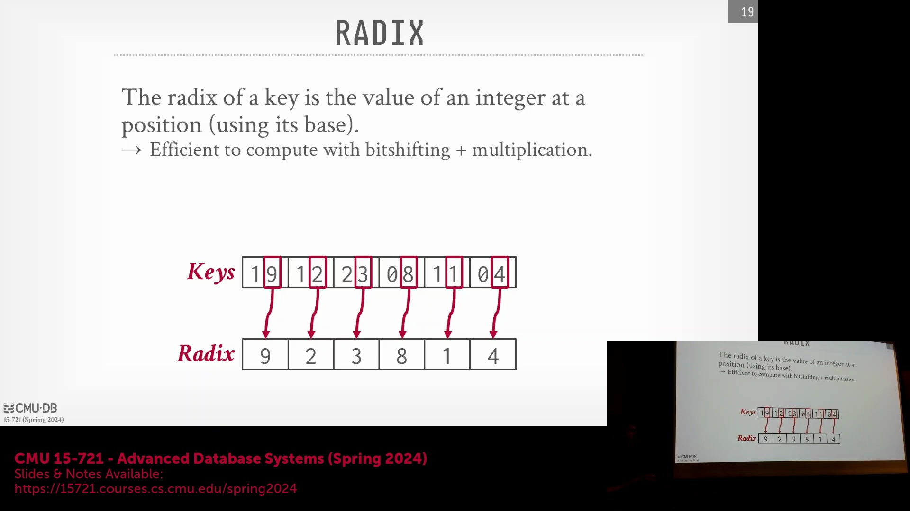
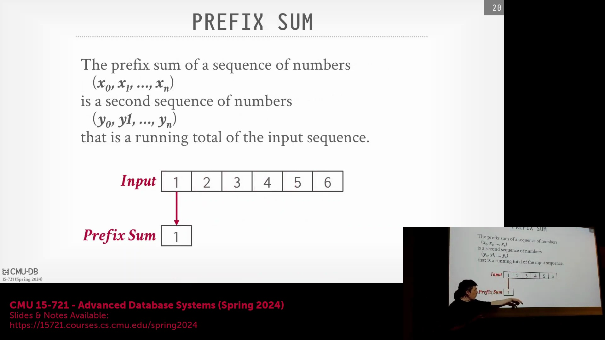
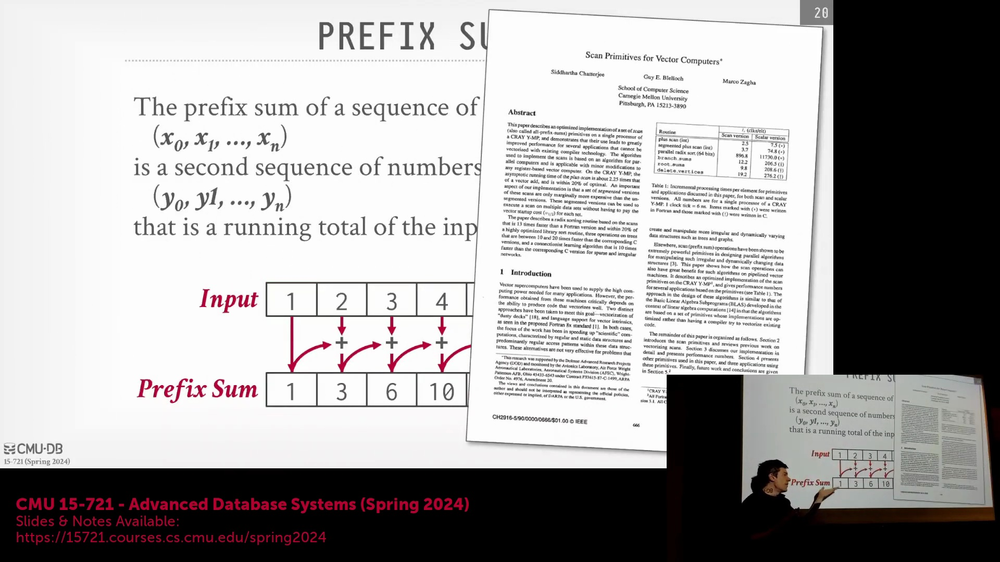
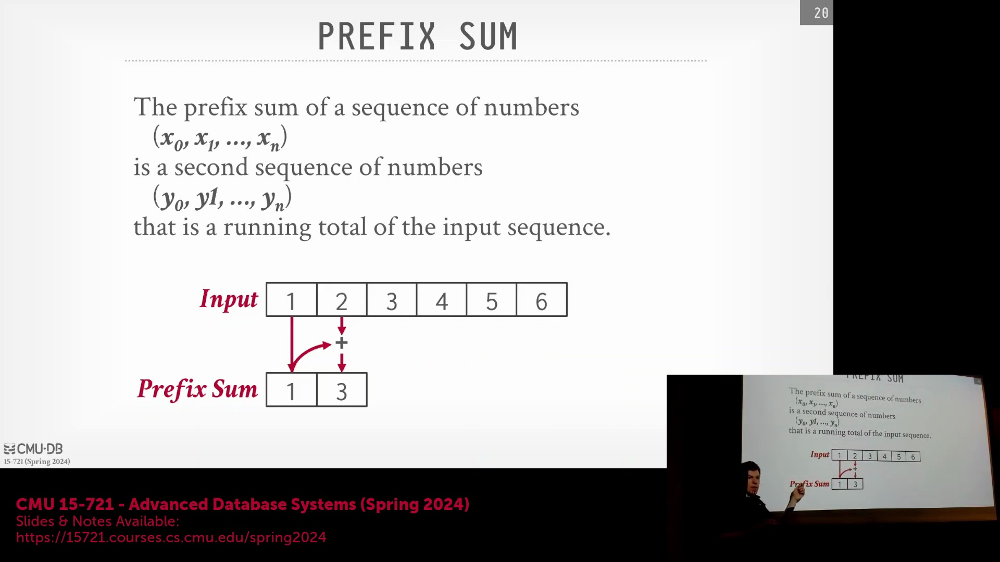
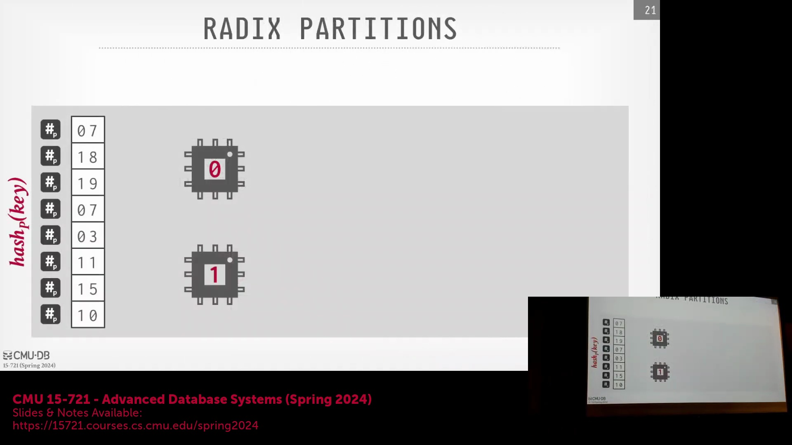
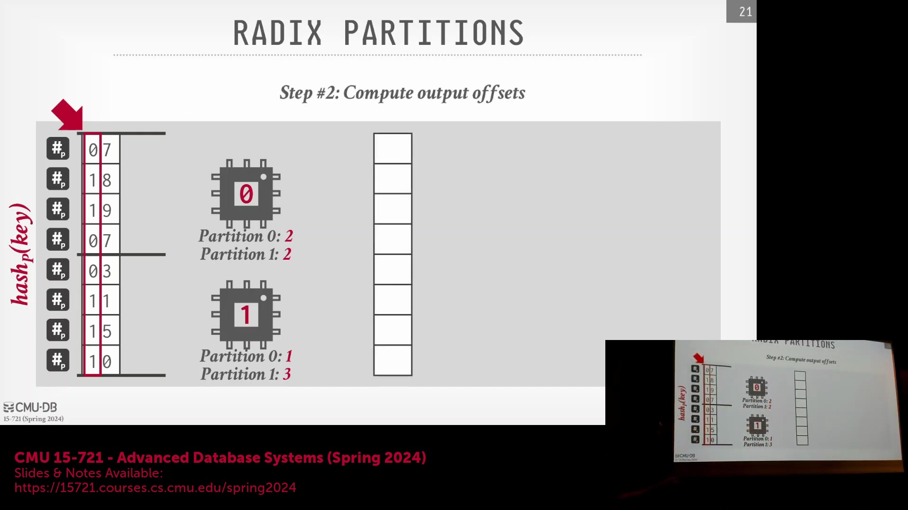
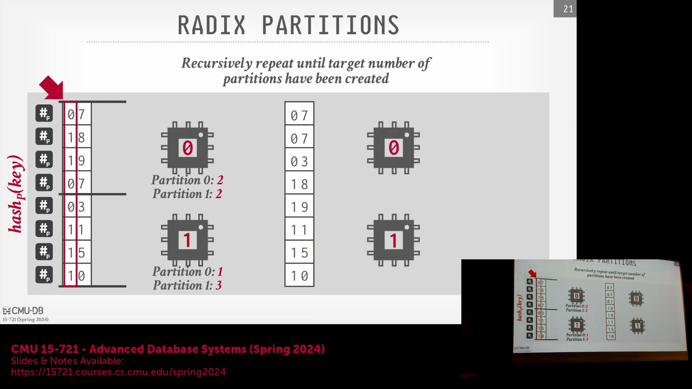
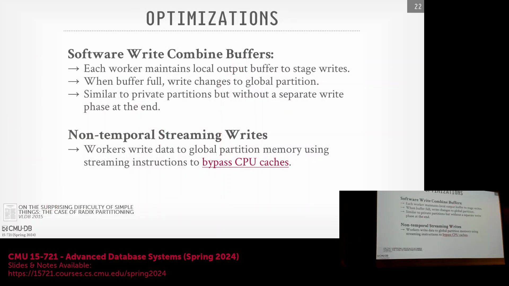
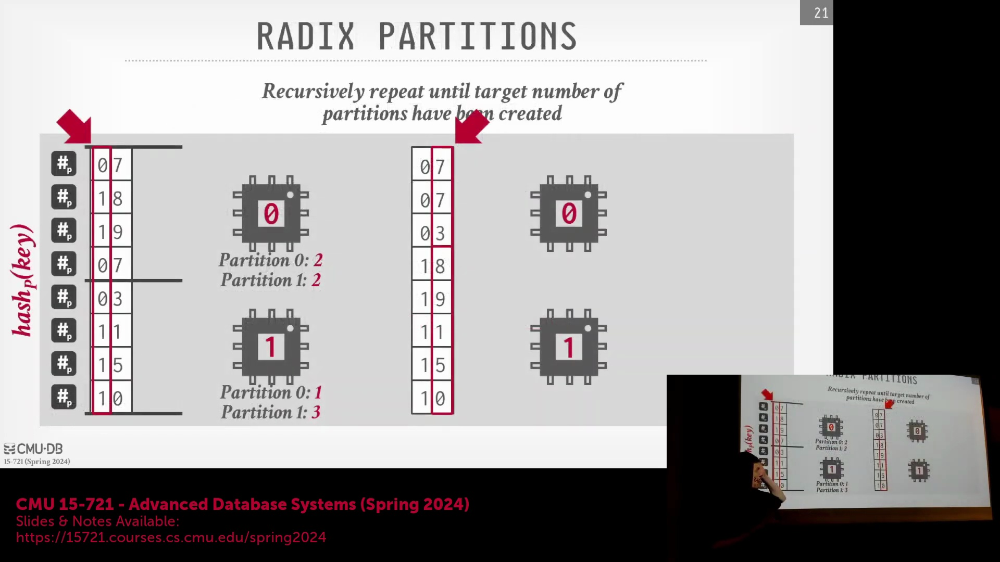
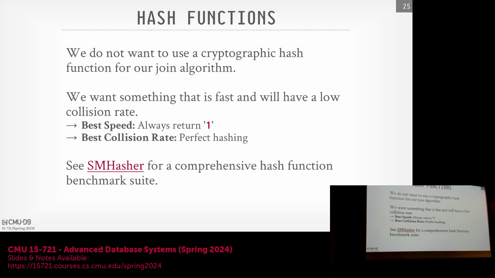

## 直方图(Histogram)与前缀和(Prefix Sum)计算

基数分区(Radix Partitioning)过程首先从哈希连接键(Hash Join Key)中提取特定的数位，即基数位(Radix Digits)。这些基数位决定了每条记录所属的分区桶(Partition Bucket)。在算法的首次遍历(Pass)阶段，系统会构建一个直方图(Histogram)，以统计每个基数值在数据集中的出现频率。随后，系统对该直方图计算前缀和(Prefix Sum，即累计总和)。该前缀和数组充当查找表(Lookup Table)的角色，为最终连续输出缓冲区中的每个分区提供精确的起始内存偏移量(Starting Memory Offset)。

## 基于偏移量确定的无锁分区(Lock-Free Partitioning)

预先计算前缀和的主要架构优势在于彻底消除了写入阶段的线程同步(Thread Synchronization)需求。一旦前缀和计算完毕并分发给所有工作线程(Worker Threads)，每个线程即可明确其负责分区的精确内存范围。因此，各线程能够并发写入数据，且无需依赖闩锁(Latches)、原子计数器(Atomic Counters)或锁协调机制。高效计算前缀和的理念在数据库系统研究中已相当成熟；例如，Guy Blelloch 在 20 世纪 90 年代中期的奠基性工作深入探索了用于加速并行扫描操作(Parallel Scan Operations)的向量化(SIMD)算法，凸显了学界围绕该问题长达数十年的持续优化历程。

## 示例演示与处理数据倾斜(Data Skew)

以双 CPU 场景为例，系统扫描输入的哈希值，并依据其基数值确定分区位置。借助预先计算的前缀和，系统为各分区分配互不重叠的内存区域：分区 0 从偏移量 0 开始，分区 1 的起始偏移量则取决于分区 0 的累计记录数。两个核心可同时向各自分配的内存范围写入数据，互不干扰且无协调开销。若数据集存在严重的数据倾斜(Data Skew)，导致单个分区体积异常庞大，算法将递归地对下一个数位应用基数分区逻辑，进一步细分超载分区，直至实现工作负载(Workload)的均衡分布。

## 优化写入性能：软件缓冲区与流式写入

该分区策略的朴素实现(Naive Implementation)常因随机内存写入(Random Memory Writes)和严重的 CPU 缓存污染(CPU Cache Pollution)而性能不佳。为缓解此问题，系统引入了两项关键优化。首先，采用**软件写合并缓冲区(Software Write-Combining Buffer)**：线程不再将数据零散地直接写入主存，而是先将其暂存至小型私有缓冲区，待缓冲区满载后再批量刷新。其次，**非临时流式写入(Non-Temporal Streaming Write)**借助专用 CPU 指令完全绕过缓存层次结构(Cache Hierarchy)，以类直接内存访问的路径将数据直写主存。

关于此写入架构需明确一点：与传统分区算法需额外增加合并阶段(Merge Phase)以将私有缓冲区数据移至全局缓冲区不同，基数分区因起始偏移量已预先确定，仅需单次遍历(Single Pass)即可直接将数据写入最终输出缓冲区(Final Output Buffer)。

通过融合批量缓冲(Batch Buffering)、绕过缓存的流式写入以及精确的偏移量计算，基数分区在现代硬件架构上成功实现了吞吐量(Throughput)最大化与开销(Overhead)最小化。

## 哈希表构建(Hash Table Build)与构建阶段(Build Phase)

数据高效分区完成后，系统随即进入并行哈希连接(Parallel Hash Join)的构建阶段(Build Phase)。此阶段针对内表/构建侧表(Inner Table / Build-Side Relation)的哈希连接键进行处理，并将相应记录插入哈希表(Hash Table)中。一个完整的哈希表主要由两大核心组件构成：一是哈希函数(Hash Function)，负责将任意输入数据映射至固定大小的整数空间；二是底层数据结构，专门用于处理哈希冲突(Hash Collision)。由于哈希函数无法保证为每个唯一键(Unique Key)生成绝对唯一的输出值，该数据结构必须能够高效应对多个元组映射至同一哈希桶(Hash Bucket)的情形。

## 哈希函数(Hash Function)的权衡：速度与冲突率

哈希函数的选型需在计算速度与冲突概率(Collision Probability)之间寻求平衡。一种极端是采用如 `return 1` 的平凡函数(Trivial Function)，其计算仅需极少的 CPU 周期，但会引发灾难性的哈希冲突，导致所有记录堆积于单一桶中，使查找性能退化至 O(n) 复杂度。另一种极端是完美哈希(Perfect Hashing)，理论上可为每个可能的键生成唯一映射，实现零冲突。然而，在实际的动态数据集(Dynamic Dataset)中，真正的完美哈希往往仅具理论意义，或计算开销过大。因此，生产级数据库系统通常采用高度优化的通用哈希函数(Off-the-Shelf Hash Function)，在极速计算与均匀的键分布(Key Distribution)之间提供切实可行的折中方案。