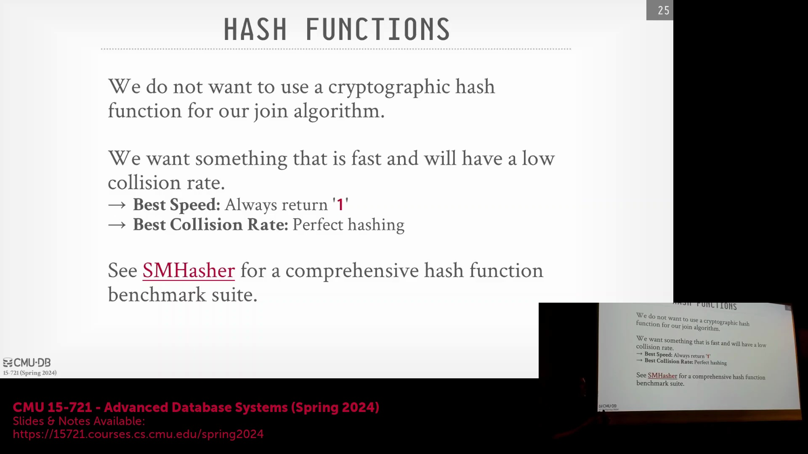
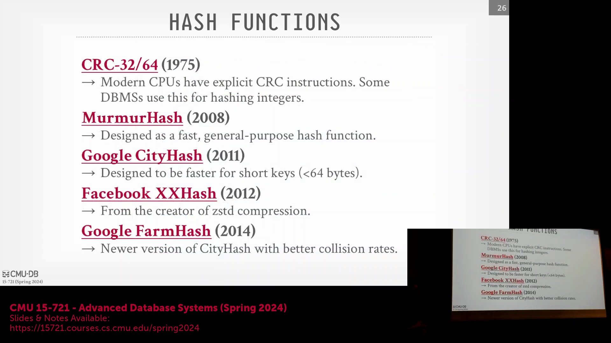
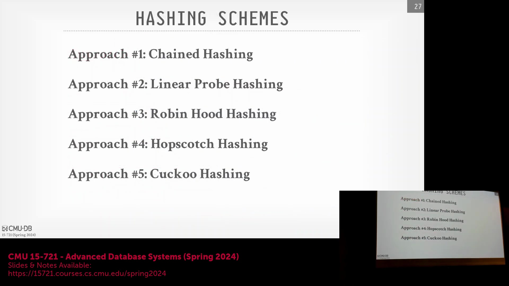
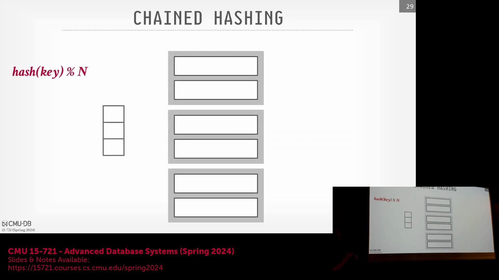
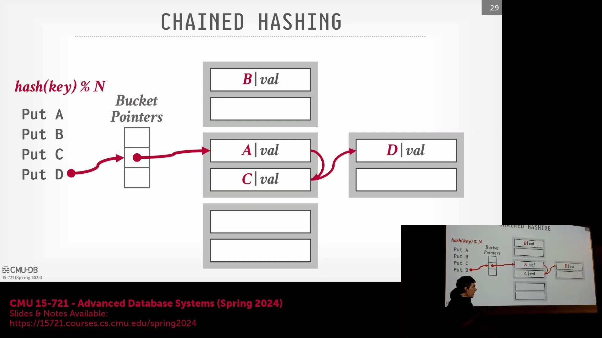
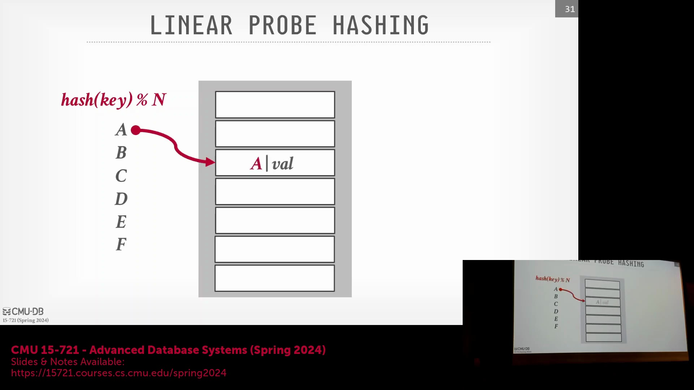

## 选择哈希函数：基准测试与权衡

尽管完美哈希函数(Perfect Hash Function)在理论上可彻底消除冲突，但其高昂的计算成本使其难以在动态工作负载(Dynamic Workload)中落地。因此，绝大多数生产级数据库系统依赖经过深度优化的现成哈希函数(Off-the-Shelf Hash Function)。开发人员常参考 SMHasher 仓库(SMHasher Repository)等资源，该仓库对各类哈希实现的冲突率(Collision Rate)、吞吐量(Throughput)及算法性能进行了系统性的基准测试(Benchmark)。

哈希函数的选型需在执行速度(Execution Speed)与抗冲突能力(Collision Resistance)之间取得平衡。精心构造的对抗性输入(Adversarial Input)可能导致单一算法性能骤降，因此系统设计通常需在平均情况性能(Average-Case Performance)与最坏情况(Worst-Case Performance)间进行权衡。业界常见选择包括：CRC32（依托专用 CPU 指令实现极高运算速度，极适整数类型）、MurmurHash（应用广泛且支持 SIMD 向量化查找(SIMD Vectorized Lookup)）、Google 推出的 CityHash 与 FarmHash（专为长字符串键优化），以及 Facebook 的 XXHash v3（在综合性能与冲突率控制上表现优异）。在实际部署中，系统通常会针对整数与字符串数据类型分别选用不同的哈希函数(Hash Function)，以实现效率最大化。

## 链式哈希与指针级优化

链式哈希(Chained Hashing)是最广为人知的冲突解决策略(Collision Resolution Strategy)，为 Java 的 `HashMap` 与 C++ 的 `unordered_map` 等标准库实现提供核心支撑。该结构维护一个桶指针数组(Array of Bucket Pointers)，每个指针指向一个动态大小的链表(Dynamic Linked List)。当发生哈希冲突时，系统会顺序遍历(Sequential Traversal)对应链表，直至匹配到目标键或定位到用于插入的空槽(Empty Slot)。该方案实现简单直观，但随着链表增长，易受指针追逐(Pointer Chasing)困扰，导致缓存效率(Cache Efficiency)显著下降。

为缓解链表遍历带来的性能开销，Hyper 等现代数据库系统引入了一项巧妙的内存优化(Memory Optimization)技术。在 x86-64 架构中，虚拟内存地址(Virtual Memory Address)仅占用 64 位指针中的低 48 位。数据库工程师复用未使用的高 16 位，直接在指针值中嵌入一个紧凑的布隆过滤器(Bloom Filter)。执行查找操作(Lookup Operation)时，系统首先校验该内嵌过滤器。若过滤器判定目标键不存在于当前桶的链表中，系统将直接跳过整个顺序扫描(Sequential Scan)。该技术免除了额外的内存读取(Memory Read)开销，并在查找失败(Lookup Failure)时显著降低了缓存污染(Cache Pollution)。

## 开放寻址哈希与线性探测

开放寻址哈希(Open Addressing Hashing)提供了一种替代架构，它将所有键值对条目直接存储于连续的槽位数组(Contiguous Slot Array)中。与依赖外部链表不同，冲突通过在同一数组内探测(Probe)后续槽位来解决。其中最常用的变体为线性探测(Linear Probing)，该算法顺序向前扫描直至发现空槽。尽管二次探测(Quadratic Probing)通过按指数级递增偏移量跳跃，能有效缓解一次聚集(Primary Clustering)问题，但会引入高度随机的内存访问模式(Memory Access Pattern)，从而削弱缓存性能。因此，数据库系统普遍倾向于采用线性探测，因其具备优异的顺序内存局部性(Sequential Memory Locality)与可预测的 CPU 预取行为(CPU Prefetching Behavior)。

在插入(Insertion)或查找(Lookup)期间，算法首先对键进行哈希运算以获取初始槽位索引(Initial Slot Index)，随后执行线性扫描(Linear Scan)。若命中目标键则查找成功；若遭遇空槽，则表明该键不存在于表中。此类连续内存布局使现代 CPU 能够将多个潜在候选项(Potential Candidates)同时加载至缓存行(Cache Line)中，相较于基于指针的链式哈希，极大加速了探测操作。

## 表饱和与主动扩容策略

随着哈希表(Hash Table)逐渐逼近容量上限(Capacity Limit)，开放寻址方案的主要缺陷开始显现。键值被不断推离其理想的哈希位置(Ideal Hash Position)，导致探测序列(Probe Sequence)拉长，查找性能退化至近似线性扫描的复杂度。若探测序列绕回起始索引(Wrap Around)仍无法寻得空槽，则表明哈希表已完全填满，必须触发扩容操作(Resize Operation)。扩容的计算成本极高，涉及对所有历史条目的重新哈希(Rehashing)与内存重新分配(Memory Reallocation)。为规避动态扩容(Dynamic Resizing)带来的性能损耗，数据库系统通常利用对工作负载的先验知识(Prior Knowledge)：鉴于待插入元组(Tuple)数量通常可预先估算，系统会按预期容量的两倍左右进行内存预分配(Pre-allocation)。这种前瞻性的容量设定(Proactive Sizing)确保了较低的负载因子(Load Factor)，最大限度抑制了冲突，使整个哈希连接(Hash Join)过程维持近似 O(1) 的时间复杂度，有效避免了中断性重新分配(Disruptive Reallocation)对执行流水线的干扰。