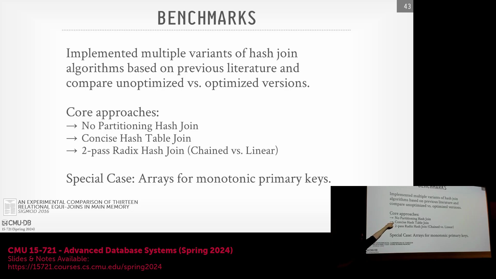
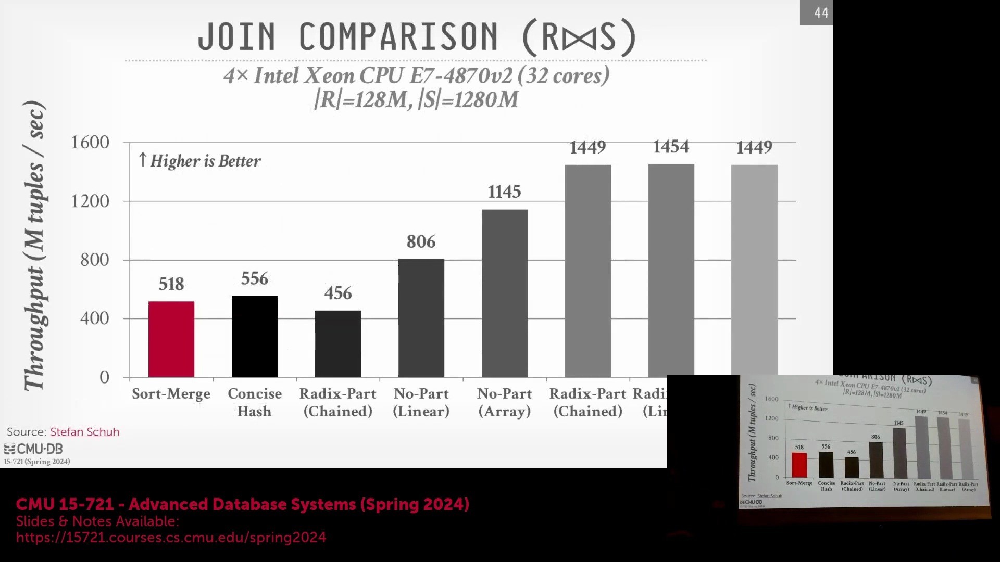
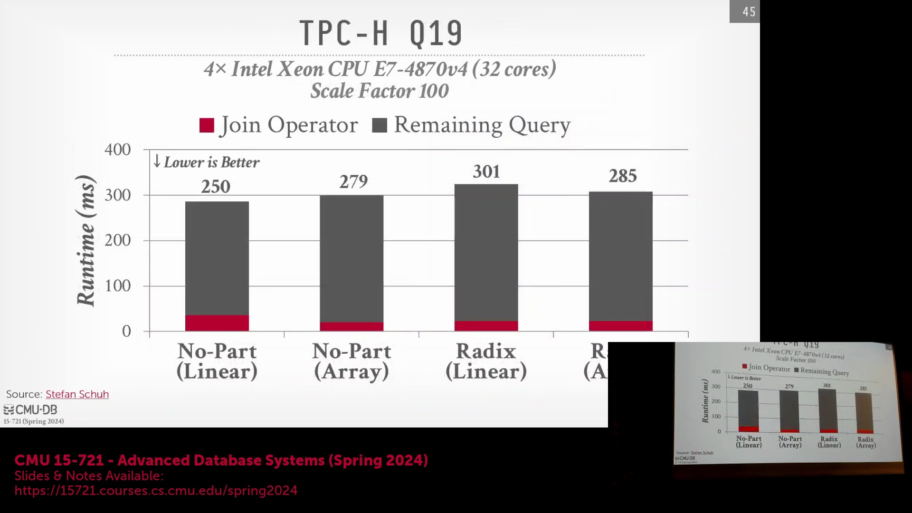
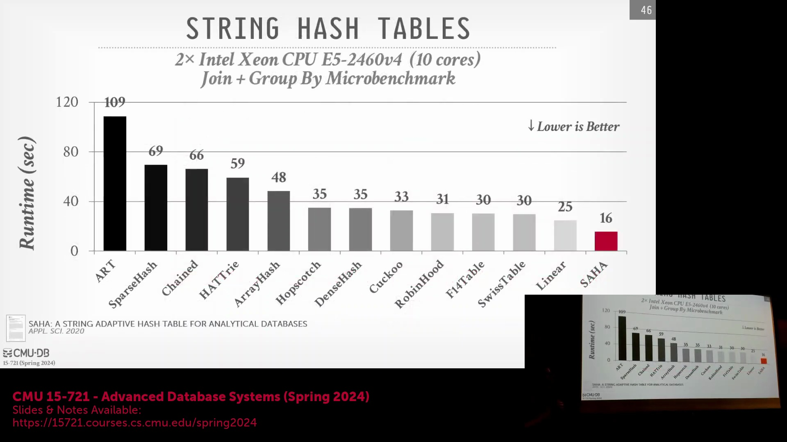
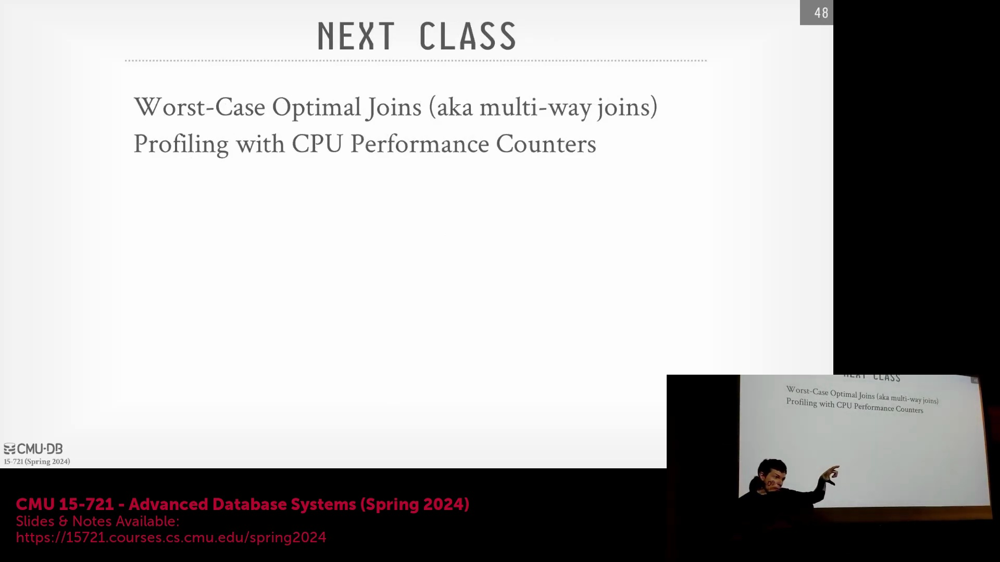
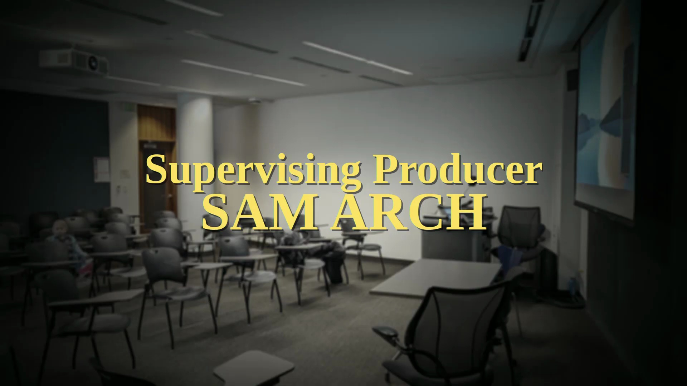

## DB2 BLU 实现方案与基础至优化技术谱系

讨论首先从考察 DB2 BLU(DB2 BLU Acceleration)等专用架构入手，该架构将打包数组(Packed Arrays)与布隆过滤器(Bloom Filters)相结合。文中指出，此类高度定制化(Highly Customized)的实现极少在其原生生态系统之外得到广泛应用。随后，焦点转向对比基础开源算法实现与经过深度优化、具备硬件感知能力(Hardware-Aware)的变体。文中引入了一张性能可视化图表，用于映射可用技术方案的演进谱系，并依据其工程复杂度(Engineering Complexity)及与底层 CPU 架构(CPU Architecture)的契合度进行分类。

## 基数分区性能与工程简洁性的权衡

基准测试(Benchmark)图表分析表明，当基数分区(Radix Partitioning)与任意标准哈希方案（如链式哈希(Chained Hashing)、线性探测(Linear Probing)、开放寻址(Open Addressing)，或直接利用哈希键作为索引的基础线性数组(Direct-Addressing Linear Array)）结合使用时，始终能实现最高的吞吐量(Throughput)。然而，在异构架构中正确实现这些硬件专属优化(Hardware-Specific Optimizations)的难度极大。对于绝大多数生产工作负载(Production Workloads)而言，摒弃基数分区的简单线性数组方案取得了极佳的平衡：它在提供稳健性能的同时，显著降低了工程复杂度、维护开销(Maintenance Overhead)以及特定硬件平台上的性能回退(Performance Regression)风险。

## 真实查询开销与瓶颈分布

对完整查询执行流程(Query Execution Flow)（尤其是 TPC-H Query 19）的实证分析(Empirical Analysis)显示，哈希连接(Hash Join)操作本身通常仅占总运行时间的 10% 至 13%。剩余耗时主要被上游与下游操作占据，涵盖数据摄入(Data Ingestion)、谓词过滤(Predicate Filtering)、结果物化(Result Materialization)以及更宏观的查询计划编排(Query Plan Orchestration)。这一时间分解证实，尽管哈希连接是核心组件，但在分析型工作负载(Analytical Workloads)中，它极少成为绝对的单一瓶颈(Single Bottleneck)。因此，采用直接且无分区的线性实现(Non-Partitioned Linear Implementation)通常是更为务实的工程决策，可有效避免在微观优化(Micro-Optimization)上陷入边际收益递减(Diminishing Returns)的困境。

## ClickHouse 针对字符串的专用哈希表架构

讲座重点剖析了 ClickHouse 针对基于字符串的哈希连接(String-Based Hash Join)所采用的高度优化策略。ClickHouse 并未依赖单一庞大的数据结构，而是对外暴露统一的逻辑接口(Uniform Logical Interface)，底层由多个专用哈希表变体(Specialized Hash Table Variants)协同支撑。每个变体均针对特定的字符串长度范围（例如 ≤16 字节、17–32 字节等）进行了精细化调优(Fine-Tuning)。在与 ART、链式哈希、跳房子哈希(Hopscotch Hashing)、布谷鸟哈希(Cuckoo Hashing)、罗宾汉哈希(Robin Hood Hashing)、F14 哈希表(F14 Hash Table)、Swiss Tables 以及基础线性探测等先进替代方案进行基准对比时，ClickHouse 基于尺寸感知(Size-Aware)的专用化方案始终展现出更卓越的性能。该方法凸显了面向数据类型优化(Data-Type-Aware Optimization)的实际收益，尽管此类工程洞见多通过技术博客发布，而非正式学术出版物。

## 工程实用主义：反对过度设计的理由

讲座得出的一个关键结论探讨了系统是否应投入资源开发复杂的变长字符串哈希表(Variable-Length String Hash Table)或激进的分区方案(Aggressive Partitioning Scheme)。尽管理论分析与受控环境下的微基准测试(Micro-Benchmarks)均偏向于这些专用方法，但实际工程实现(Empirical Implementation)需耗费大量资源，并会引入显著的维护复杂性(Maintenance Complexity)。例如，分区技术在隔离环境(Isolated Environment)中确实表现更优，但要在异构硬件配置中进行稳健调优(Robust Tuning)却极具挑战。因此，大多数生产级数据库(Production-Grade Databases)将简洁性置于首位，倾向于采用单一且经过充分验证的通用实现(Universal Implementation)，而非通过过度设计(Over-Engineering)去追逐边际算法收益(Marginal Algorithmic Gains)。

## 课程总结与后续安排

本系列讲座(Lecture Series)最后概述了后续课程安排。接下来的课程将深入探讨最坏情况最优连接算法(Worst-Case Optimal Join Algorithms)，并提供使用硬件性能计数器(Hardware Performance Counters)进行性能剖析(Performance Profiling)的实操指导。此外，提醒学生留意下周三即将举行的项目进度汇报(Project Progress Update)。课程在非正式的鼓励性致辞与轻松的课堂互动中落下帷幕，讲师强调在课程收官阶段，应保持学习节奏、注重代码实践(Code Practice)并集中精力备战最终考核。