## 课程介绍与授课范围
卡内基梅隆大学(CMU)的高级数据库系统课程(Advanced Database Systems，在配备现场观众的教学演播室录制)继续深入探讨哈希连接(Hash Join)。尽管理想情况下这些内容可拆分为两节课，但本次授课旨在单次课程中尽可能涵盖更多基础与进阶内容。

## 回顾：数据分块(Morsel)与拉取式调度
承接上一讲内容，本部分将回顾数据库系统如何解析查询计划(Query Plan)、定位目标数据，并将其分割为更小的处理单元——数据分块(Morsel)。在拉取式调度(Pull-based Scheduling)模型中，工作线程(Worker Threads)从全局队列中拉取数据分块，该模型的性能始终优于推送式调度(Push-based Scheduling)方案。尽管不同系统在数据分块的底层实现上存在差异，但将大型数据集拆分为易于管理的数据块这一核心理念，仍是并行数据处理的基本策略。

## 分布式系统与任务调度
尽管前述讨论主要聚焦于单节点架构(Single-node Architecture)，但这些调度概念可自然延伸至分布式环境。在分布式系统中，核心差异在于需重点考虑节点间的网络延迟，而非假设各节点间存在共享内存访问(Shared Memory Access)。任务分发通常采用分层架构：既可将离散任务直接分配至特定节点，也可将任务批(Batch)委托给某一节点，由其负责在本地工作线程间进行二次分发。这两种模型在延迟管理与负载均衡(Load Balancing)方面各有优劣。

## 动态扩缩容与工作窃取机制
现代查询执行高度依赖动态扩缩容(Dynamic Scaling)与工作窃取机制(Work Stealing)，以缓解拖尾任务(Straggler Tasks)造成的瓶颈，并实现负载的动态再平衡。动态扩缩容在云环境中尤为高效，系统可实时监测任务需求何时超出可用工作线程的承载能力，并临时调配额外的水平计算资源(Horizontal Compute Resources)。以 Snowflake 为例，该系统利用支持共享数据层的“弹性计算集群(Elastic Compute Clusters)”来加速查询，且无需承担永久性硬件开销，此种能力在传统的固定本地部署(On-premises Deployment)中难以复现。相对而言，工作窃取机制允许空闲线程主动从繁忙线程处“窃取”未完成任务。其具体实现策略因系统而异：部分系统（如 Hyper）会直接从对等线程的 CPU 缓存(CPU Cache)中抓取数据以实现极低延迟；而另一些系统（如 Snowflake）则倾向于从分布式远程存储中拉取数据，以避免干扰源节点的计算性能。

## 转向并行哈希连接
本讲将重点转向连接操作(Join Operators)，这是关系型数据库中最核心的算子之一，本文将特别聚焦其并行执行机制。分析将基于单节点上下文展开，并假设编排层(Orchestration Layer)已妥善处理跨集群的数据移动(Data Movement)。当所有待连接数据均驻留于内存时，核心工程挑战即转化为如何最大化系统吞吐量(Throughput)。本节课将概述并行连接算法的历史演进，详解并行哈希连接的构建模块(Building Blocks)，探讨各类哈希方案(Hashing Schemes)，并深入剖析指定学术论文中的复杂概念。

## 并行连接算法与 CPU 优化目标
并行连接算法的根本目标是将连接操作并行分发至多个工作线程，使性能优化重心从传统的磁盘 I/O 转移至内存多核利用率(Multi-core Utilization)。尽管课程后续将探讨多路连接(Multi-way Joins)，但二元连接(Binary Joins)仍是绝大多数业务场景的行业标准。在算法选型上，哈希连接凭借卓越的性能在 OLAP 系统(OLAP Systems)中占据主导地位；排序合并连接(Sort-Merge Joins)专用于已预处理排序的数据集；而嵌套循环连接(Nested Loop Joins)通常仅适用于极小数据表。针对此类操作的优化需与现代 CPU 架构深度契合：需最小化线程同步开销(Thread Synchronization Overhead)、避免高昂的跨 NUMA 节点内存访问(Cross-NUMA Memory Access)，并确保内存数据对齐以规避 CPU 流水线停顿(Pipeline Stalls)。

## 连接算法的历史演进
基于排序(Sort-based)与基于哈希(Hash-based)的连接算法之间的性能博弈，始终随硬件算力的演进而不断更迭。20 世纪 70 年代，早期数据库系统依赖外部归并排序(External Merge Sort)来处理超出有限内存容量的数据表。80 年代，一项日本研究项目首创了 Grace 哈希连接(Grace Hash Join)，确立了递归分区(Recursive Partitioning)与磁盘溢出(Disk Spilling)技术，并与专用数据库硬件深度结合。至 90 年代，基础理论研究证明，在当时的硬件条件下，哈希连接与归并连接在性能上趋于等价。然而，自 2000 年以来，哈希连接持续展现出显著的速度优势，由此引发了当代学术界的核心争议：在构建哈希表前是否必须进行数据分区(Data Partitioning)，抑或是采用更简化的非分区(Non-partitioning)方案，以在绝大多数场景下提供“足够好”的性能表现。

## 现代分区策略与 SIMD 考量
近期学术界与工业界的研究凸显了分区连接(Partitioned Joins)在工程实践中的复杂性。尽管分区哈希连接在理论模型中速度更快，但其正确实现的复杂度极高，致使众多现代数据库系统倾向于采用非分区变体(Non-partitioned Variants)以降低整体工程开销(Engineering Overhead)。此外，2009 年 Intel 与 Oracle 联合发表的论文中曾提出历史性优化方案，探索利用 512 位 SIMD 寄存器(SIMD Registers)来加速排序合并连接。尽管此类针对特定硬件的微架构优化偶尔会刷新性能基准(Performance Benchmarks)，但哈希连接依然是高性能分析型查询处理(Analytical Query Processing)的默认首选方案。

---

## AVX-512 与现代数据布局的影响
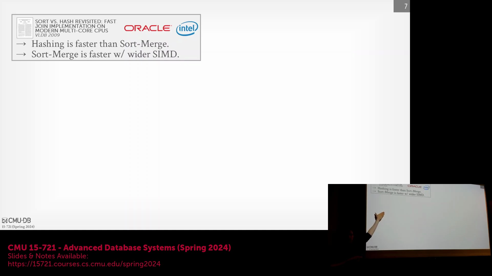
2009年的历史研究指出，尽管哈希连接(Hash Join)通常速度更快，但 AVX-512 指令集(Advanced Vector Extensions 512-bit)的引入可能会使排序合并连接(Sort-Merge Join)具备极强的竞争力。然而，这一优势仅在数据已预先按连接键(Join Key)排序的前提下才成立。在现代数据湖(Data Lake)与湖仓一体(Lakehouse Architecture)环境中，数据通常以随机写入的 Parquet 文件(Parquet Files)形式存储，这意味着数据极少会预先按连接键进行排序或分区(Data Partitioning)。因此，针对此类分析型工作负载(Analytical Workloads)，哈希连接依然是占据主导地位且最具工程实用性的选择。

## 连接算法研究的历史演进
过去十年间，学术界关于分区哈希连接(Partitioned Hash Join)与非分区哈希连接(Non-Partitioned Hash Join)的争论经历了显著演变。威斯康星大学(University of Wisconsin)的早期研究证实，分区哈希连接的性能通常优于非分区方案。2012年，Hyper 数据库团队曾初步断言，即便不依赖 AVX-512 指令集，经过高度优化的排序合并连接亦能超越哈希连接；然而仅一年后，该团队便撤回了这一结论，再次确认哈希连接才是更优的基准方案。与此同时，欧洲研究团队引入了基数哈希连接(Radix Hash Join)的优化方案，并指出由于硬件配置(Hardware Configuration)、工作负载(Workload)及底层实现细节的差异，不同学术成果之间难以进行直接的性能对标。Umbra 研究团队后续证实，在完整的数据库系统上下文(System Context)中，基数哈希连接的确能实现最快的执行速度；但他们同时强调，针对不同数据分布与硬件特征进行精准调优(Precision Tuning)的难度极高。

## 实际工程权衡与收益递减
尽管复杂的连接实现在理论模型中具备性能优势，但现实中的生产级数据库系统通常仅采用一种“足够好(Good Enough)”的均衡方案。绝大多数生产级系统会避免维护多种哈希表(Hash Table)变体，或在分区与非分区策略间进行动态切换，ClickHouse 是其中为数不多的显著例外。萨尔大学(Saarland University)的研究强调，尽管哈希连接至关重要，但在应用基础优化后，其往往不再构成整体查询执行时间(Query Execution Time)的绝对主导瓶颈。进一步的微优化(Micro-optimization)所带来的收益会迅速呈现边际递减效应；例如，将单条元组(Tuple)的处理时钟周期(Clock Cycles)从 12 降至 11，通常无法对端到端查询性能(End-to-End Query Performance)产生实质性提升。因此，工程优化的焦点应从苛求微小的周期数节省，转向深入理解宏观的算法设计原则(Algorithmic Design Principles)。

## 硬件无关与硬件感知的设计范式
高性能数据库的算法设计范式通常可划分为两类：硬件无关(Hardware-Oblivious)与硬件感知(Hardware-Conscious)。硬件无关算法会刻意忽略缓存大小(Cache Size)、TLB 容量(Translation Lookaside Buffer Capacity)及线程数等底层 CPU 规格，优先保障算法在不断演进的处理器架构与指令集架构(Instruction Set Architecture, ISA)间的可移植性(Portability)与代码可维护性。相反，硬件感知方法会显式调整数据布局(Data Layout)与执行策略，以精准匹配特定的缓存层级(Cache Hierarchy)、非统一内存访问(Non-Uniform Memory Access, NUMA)节点架构及处理器微架构特性。尽管硬件感知设计能够榨取极致的性能表现，但随着硬件迭代或跨 x86 与 ARM 等指令集架构迁移时，此类算法极易面临架构耦合度过高、适配性脆弱(Fragility)的风险。

## 最小化同步与最大化数据局部性
并行连接算法的工程实现主要遵循两大核心目标。首要目标是极致最小化同步开销(Synchronization Overhead)。这并非强制要求全盘采用无锁(Lock-Free)设计，而是需通过精细化的闩锁(Latch)管理机制来规避线程竞争(Thread Contention)，并确保工作线程不会因争抢共享缓冲区(Shared Buffer)或哈希表而陷入阻塞。其次，必须通过最大化数据局部性(Data Locality)来压降内存访问延迟。工作线程应优先处理驻留于本地 CPU 缓存(L1/L2 Cache 或共享 L3 Cache)及本地 NUMA 内存域(NUMA Memory Domain)内的数据。其核心理念与传统磁盘 I/O 处理范式如出一辙：在数据被逐出缓存或加载新数据块之前，尽可能在高速存储层级中对该数据执行最大数量的运算操作。该原则同样适用于 CPU 寄存器(Register)与缓存行(Cache Line)，因为频繁访问主存的延迟将迅速演变为 CPU 执行流水线(Execution Pipeline)的性能瓶颈。

## 缓存污染、TLB 开销与访问模式

当系统遭遇缓存污染(Cache Pollution)与 TLB 污染时，查询性能将出现断崖式下跌。若无效或随机数据填满 CPU 缓存，将导致活跃缓存行被强制驱逐(Eviction)，进而引发代价高昂的缓存缺失(Cache Miss)。更为严峻的是，跨越海量缓存行随机访问分散的内存地址，会致使转换后备缓冲器(Translation Lookaside Buffer, TLB)中的页表条目被频繁换出。当缓存缺失与 TLB 缺失(TLB Miss)并发时，单次逻辑地址查找将承受双重性能惩罚。为缓解上述开销，算法设计应优先采用顺序扫描(Sequential Scan)，极力规避纯粹的随机访问模式。在随机访问不可避免的场景下，数据结构设计必须严格保障空间局部性(Spatial Locality)，确保工作线程能够反复命中相同的本地缓存行。综上所述，优化基数连接(Radix Join)的实现需精密权衡指令数量(Instruction Count)、内存占用(Memory Footprint)与 CPU 周期消耗；其中的分区阶段(Partitioning Phase)作为关键预处理机制，旨在重塑数据分布以严格契合底层硬件约束。

---

## 缓存局部性与顺序访问的预处理

通过对构建表(Build Table)与探测表(Probe Table)的数据进行预处理，并将其划分为离散的线程本地数据块(Thread-Local Data Chunks)，并行连接算法能够有效消除跨核心互联流量(Cross-core Interconnect Traffic)。该设计使每个工作线程(Worker Thread)能够在专用缓冲区上执行顺序扫描(Sequential Scan)，完全免去线程间通信(Inter-thread Communication)的开销。尽管分区步骤(Partitioning Phase)会引入额外的初始指令周期，但整体执行速度将获得显著提升，因为它成功规避了核心连接操作期间的硬件级瓶颈、缓存竞争(Cache Contention)与同步停顿(Synchronization Stalls)。

## 哈希连接在 OLAP 系统中的关键作用
哈希连接(Hash Join)依然是在线分析处理(Online Analytical Processing, OLAP)数据库系统中至关重要的核心算子(Operator)。尽管连接操作并非在所有查询(Query)中均占据绝对主导的执行成本，但在数据密集型工作负载(Data-Intensive Workloads)下，它通常是主要的性能瓶颈。工程优化的核心目标是在整个连接执行期间维持 CPU 核心的 100% 利用率，这需通过极力削减因数据从 DRAM 加载至 CPU 缓存(Cache)所引发的流水线停顿(Pipeline Stalls)来实现。优化此类内存传输(Memory Transfer)过程对于维持系统峰值吞吐量(Peak Throughput)至关重要。

## 高层架构：分区、构建与探测
从宏观架构(High-Level Architecture)来看，并行哈希连接(Parallel Hash Join)主要划分为三个阶段。首阶段为**分区(Partitioning)**，该阶段为可选步骤，主要依据连接键(Join Key)的哈希值，将内表/构建表(Inner/Build Table)与外表/探测表(Outer/Probe Table)拆分为多个独立分区(Partitions)。随后进入**构建(Build)**阶段，每个工作线程将被分配至特定分区，负责构建单一逻辑哈希表(Single Logical Hash Table)的本地片段(Local Fragment)。维护全局统一的逻辑视图对于规避哈希查找时的假阴性(False Negatives，即漏匹配)至关重要。最终在**探测(Probe)**阶段，工作线程顺序扫描其对应的外部分区，向哈希表发起查找以匹配记录，合并关联元组(Tuples)，并将结果集(Result Set)推送至下游执行流水线(Execution Pipeline)中。
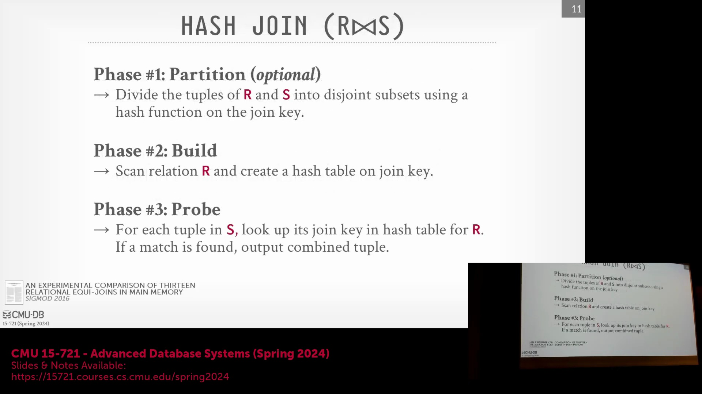

## 被忽视的结果物化成本
学术界基准测试(Academic Benchmarks)往往严重低估最终结果物化(Result Materialization)步骤对整体性能的影响。诸多早期研究仅测量构建(Build)与探测(Probe)阶段的速率，却忽略了将匹配元组合并并复制至输出缓冲区(Output Buffer)所施加的 CPU 与缓存压力。在生产级系统中，此类近似内存拷贝(`memcpy`)的操作具有不可规避性。萨尔大学(Saarland University)等研究团队明确指出，在微基准测试(Micro-benchmarks)或单指令多数据流(SIMD)/向量化连接(Vectorized Joins)研究中省略物化环节，将导致性能评估严重失真。真实的数据库系统评估必须将此末端流水线阶段纳入考量，方能准确反映生产环境中的实际开销(Overhead)。
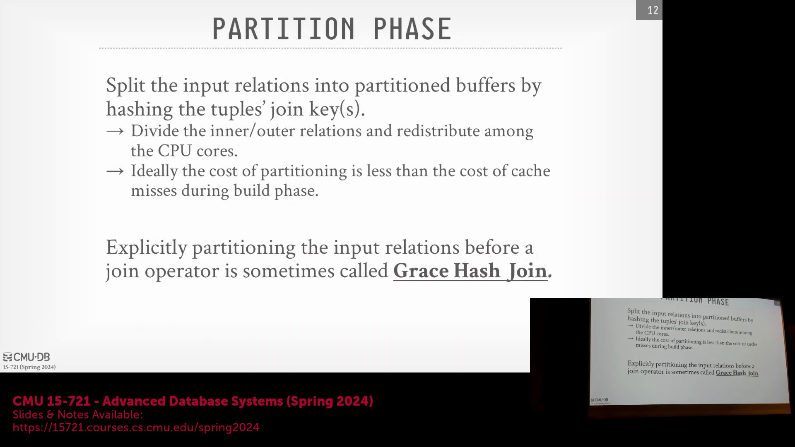

## 深入分区阶段
分区阶段(Partitioning Phase)的核心宗旨在于优化数据局部性(Data Locality)。通过将输入关系(Input Relations)重新路由至各个 CPU 核心，使每个工作线程仅处理专属的数据子集，线程即可在零跨 NUMA 节点内存访问(Cross-NUMA Memory Access)的前提下执行缓冲区顺序扫描。执行分区指令的额外开销，始终能被缓存命中率(Cache Hit Rate)的提升与内存访问延迟(Memory Access Latency)的降低所完全抵消。若输入数据在加载时已预先按连接键完成分区（在现代数据湖(Data Lake)架构中极为罕见），则可安全跳过此步骤。否则，系统将采用内存内分区(In-Memory Partitioning)策略，将传统的基于磁盘的 Grace 哈希连接(Disk-based Grace Hash Join)算法针对现代硬件特性进行深度适配。
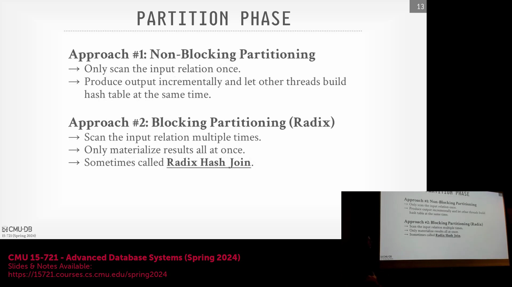

## 非阻塞与阻塞分区策略
实现分区阶段主要存在两种架构范式。**非阻塞分区(Non-blocking Partitioning)**允许所有工作线程并发执行并同步填充分区缓冲区。该方案实现相对直观，但必须依赖闩锁(Latches)等同步原语来防止并发写入导致的数据覆盖(Data Corruption)。相比之下，**阻塞式/基数分区(Blocking/Radix Partitioning)**的实现更为复杂：它通常需对数据进行多轮遍历(Multi-pass Traversal)，但通过在填充阶段前精确预计算写入偏移量(Write Offsets)，彻底消除了线程间同步(Inter-thread Synchronization)的开销。

## 共享全局分区与线程局部存储
在非阻塞分区架构中，系统需在共享缓冲区模型与私有缓冲区模型间进行权衡。采用**共享全局分区(Shared Global Partitions)**意味着各线程可随时向任意目标分区写入数据，因此必须在目标哈希桶(Target Hash Buckets)上频繁加闩锁以规避数据损坏。替代方案为**线程局部存储(Thread-Local Storage)**模型，该系统为每个 CPU 核心分配 `N` 个微型分区(Mini-Partitions)。由于各核心在其私有缓冲区上以单线程模式(Single-threaded Mode)运行，该方案彻底清除了初始写入阶段的所有同步开销。然而，其代价是在流程末端引入了强制性的合并阶段(Merge Phase)，需将这些微型分区聚合重组至最终的全局分区结构中。
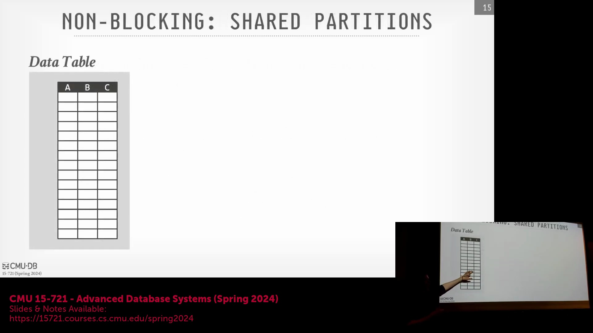

## 共享分区的执行机制
在共享非阻塞模型(Shared Non-blocking Model)中，数据表在逻辑上被划分为 `N` 个分区缓冲区。在处理数据分块(Morsels)时，工作线程对连接键执行哈希运算以定位目标分区，并将元组追加至对应的共享缓冲区，其底层机制类似于链式哈希表(Chained Hash Table)。鉴于并发写入(Concurrent Writes)的不可预测性，数据插入前必须在对应哈希桶上获取闩锁。该方案的核心权衡极为明确：算法在缓冲区填充阶段需承担高昂的同步开销，但所有数据已直接落位至最终的全局分区，使得后续清理阶段(Cleanup Phase)实现零额外开销(Zero Overhead)。
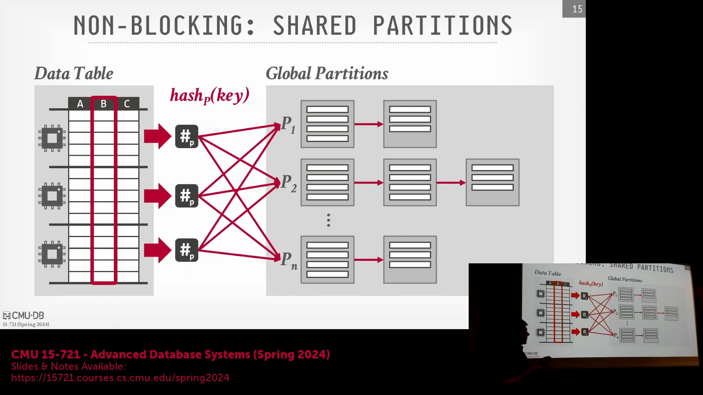

## 线程局部分区与合并开销
线程局部方案(Thread-Local Approach)则将上述权衡关系完全反转。各核心独立维护 `N` 个微型分区，允许在初始数据遍历(Initial Data Pass)期间执行完全无锁的高速写入(Lock-free Writes)。性能瓶颈随之转移至末端合并阶段，系统需在此协调数据聚合操作。通常，系统会指派特定核心负责收集归属于同一全局分区 ID(Global Partition ID)的所有微型分区，并将其拼接至统一的全局缓冲区。尽管该设计彻底消除了运行时的闩锁竞争(Latch Contention)，但最终的合并遍历(Merge Pass)极易演变为执行流水线的阻塞点(Pipeline Stall Point)；若缺乏精细优化，将引入显著的端到端延迟(End-to-End Latency)。
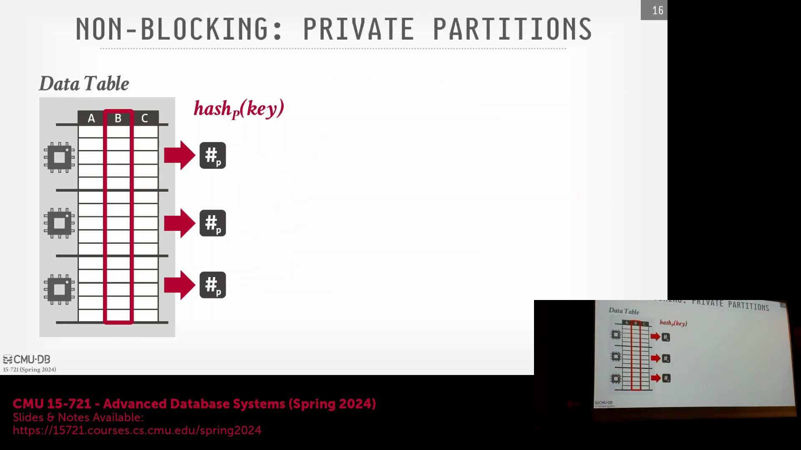
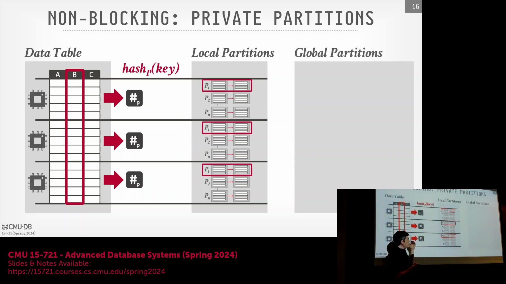

---

## 初始分区阶段(Initial Partitioning Phase)与缓存局部性(Cache Locality)

在初始分区阶段，每个数据块均在单个核心(Core)内进行处理，理想情况下应完全驻留于本地 L3 缓存(L3 Cache)中。由于各核心独立执行该操作，只要分区数据能完全装入缓存，便无需跨越 NUMA(Non-Uniform Memory Access)节点进行数据读写。然而，后续的合并步骤(Merge Step)将引入显著的开销。在此阶段，各核心需收集分散于其他核心所属不同 NUMA 区域的分区数据（例如分区 1）。由于涉及跨 CPU 插槽(CPU Socket)的内存访问及随之增加的延迟，聚合此类数据并将其写回目标 NUMA 区域的计算成本极高。

## 延迟物化(Late Materialization)与早期物化(Early Materialization)的权衡
在延迟物化与早期物化之间的选择将显著影响分区过程中的数据移动成本。采用延迟物化时，系统仅传输轻量级元数据（如连接键(Join Key)与元组 ID(Tuple ID)），从而最大限度地降低带宽消耗。相反，早期物化需搬运完整的元组，单行数据可能包含多达 20 列。尽管早期物化避免了后续的二次物化，但跨越 NUMA 边界传输大量数据有效载荷的开销通常会抵消该优势。最终的最优策略取决于具体工作负载(Workload)特性及数据倾斜(Data Skew)的程度。

## 硬件感知(Hardware-Aware)与本地分区(Local Partitioning)的挑战

在硬件无关策略(Hardware-Agnostic Strategy)与硬件感知策略之间做出抉择需经过审慎评估。尽管在系统启动时运行微基准测试(Micro-benchmark)可揭示硬件性能上限，但受不可预测的数据倾斜影响，实际表现常会偏离预期。在本地分区场景中，当核心向共享分区缓冲区(Shared Partition Buffer)写入数据时，尤其在分区数据量超出 L3 缓存容量时，将不得不频繁进行跨 NUMA 区域内存访问。此类跨节点访问会严重拖累性能，因此若条件允许，严格实施本地分区策略更为可取；但这依然高度依赖于底层内存架构与数据分布特征。

## 合并步骤(Merge Step)与无锁执行(Lock-Free Execution)

最终的合并步骤旨在将所有核心的微型分区(Micro-partitions)汇总至最终输出缓冲区中。每个核心均在其 L3 缓存内独立维护一组微型分区。合并期间，指定核心将顺序扫描属于特定逻辑分区的微型分区，并将其追加至全局缓冲区。该过程效率极高，因其完全依赖内存复制(`memcpy`)，无额外处理开销。关键在于，由于各核心仅读取自身维护的微型分区并写入专属的最终缓冲区，故不存在线程竞争(Thread Contention)，无需引入闩锁(Latches)或锁(Locks)等同步原语(Synchronization Primitives)，从而实现了完全的无锁执行。

## 确定分区数量与处理数据倾斜(Data Skew)
分区数量并非必须与 CPU 核心数(CPU Core Count)严格对应。尽管二者匹配可简化系统实现，但在数据分布严重倾斜时会导致性能骤降。若某一分区包含十亿个键值(Key)，而其余分区仅含数千个，该庞大分区将在后续处理中成为性能瓶颈。为缓解此问题，系统通常会生成远多于可用核心数的分区。这种超额分配(Over-provisioning)策略可将倾斜数据分散至多个分区桶(Partition Bucket)中，从而避免单个线程在构建(Build)或探测(Probe)阶段过载。

## SIMD(Single Instruction, Multiple Data)的局限性与数据暂存(Data Staging)的优势
SIMD 指令在合并阶段带来的性能收益微乎其微，因该操作本质上是顺序内存复制(Sequential Memory Copy)。此暂存步骤的核心目的在于优化后续的哈希表(Hash Table)操作。通过在分区阶段将数据预排序并分组至连续的分区块中，系统提前支付了内存停滞(Memory Stalls)的开销。当后续的构建与探测阶段扫描这些已分区缓冲区时，缓存未命中(Cache Miss)与内存停滞的次数将显著降低，进而实现更可预测且高效的执行流程。

## 降低竞争与内存开销的权衡(Trade-off)

增加分区总数能有效降低并行写入期间的线程竞争(Thread Contention)。随着可用分区桶数量的增加，多个线程同时竞争同一闩锁或写入同一内存位置的概率将大幅下降。然而，该策略也引入了显著的权衡：分配过多分区可能导致内存利用率低下(Low Memory Utilization)。若分区桶采用预分配(Pre-allocation)机制，但因数据分布稀疏导致实际填充率不足，系统将白白消耗宝贵的内存资源。因此，调整分区数量需在降低竞争与提升内存效率之间寻求最佳平衡。

## 基数分区(Radix Partitioning)简介

基数分区通过确保数据仅写入输出缓冲区一次，有效解决了物化过程中的低效问题。该算法需对输入关系(Input Relation)进行多轮遍历(Pass)。首轮遍历中，系统构建直方图(Histogram)以统计特定基数位(Radix Digits)（即从连接键哈希值中提取的数值）的出现频次。随后，系统计算直方图的前缀和(Prefix Sum)，以确定输出缓冲区中各分区的精确起始偏移量(Offset)。在后续遍历中，数据将直接写入这些预计算的位置。基数位通过对哈希键执行位移(Shift)与掩码(Masking)操作提取，从而构建出精确且可预测的内存布局，彻底避免了重复物化(Repeated Materialization)的开销。

---

## 直方图(Histogram)与前缀和(Prefix Sum)计算

基数分区(Radix Partitioning)过程首先从哈希连接键(Hash Join Key)中提取特定的数位，即基数位(Radix Digits)。这些基数位决定了每条记录所属的分区桶(Partition Bucket)。在算法的首次遍历(Pass)阶段，系统会构建一个直方图(Histogram)，以统计每个基数值在数据集中的出现频率。随后，系统对该直方图计算前缀和(Prefix Sum，即累计总和)。该前缀和数组充当查找表(Lookup Table)的角色，为最终连续输出缓冲区中的每个分区提供精确的起始内存偏移量(Starting Memory Offset)。

## 基于偏移量确定的无锁分区(Lock-Free Partitioning)

预先计算前缀和的主要架构优势在于彻底消除了写入阶段的线程同步(Thread Synchronization)需求。一旦前缀和计算完毕并分发给所有工作线程(Worker Threads)，每个线程即可明确其负责分区的精确内存范围。因此，各线程能够并发写入数据，且无需依赖闩锁(Latches)、原子计数器(Atomic Counters)或锁协调机制。高效计算前缀和的理念在数据库系统研究中已相当成熟；例如，Guy Blelloch 在 20 世纪 90 年代中期的奠基性工作深入探索了用于加速并行扫描操作(Parallel Scan Operations)的向量化(SIMD)算法，凸显了学界围绕该问题长达数十年的持续优化历程。

## 示例演示与处理数据倾斜(Data Skew)

以双 CPU 场景为例，系统扫描输入的哈希值，并依据其基数值确定分区位置。借助预先计算的前缀和，系统为各分区分配互不重叠的内存区域：分区 0 从偏移量 0 开始，分区 1 的起始偏移量则取决于分区 0 的累计记录数。两个核心可同时向各自分配的内存范围写入数据，互不干扰且无协调开销。若数据集存在严重的数据倾斜(Data Skew)，导致单个分区体积异常庞大，算法将递归地对下一个数位应用基数分区逻辑，进一步细分超载分区，直至实现工作负载(Workload)的均衡分布。

## 优化写入性能：软件缓冲区与流式写入

该分区策略的朴素实现(Naive Implementation)常因随机内存写入(Random Memory Writes)和严重的 CPU 缓存污染(CPU Cache Pollution)而性能不佳。为缓解此问题，系统引入了两项关键优化。首先，采用**软件写合并缓冲区(Software Write-Combining Buffer)**：线程不再将数据零散地直接写入主存，而是先将其暂存至小型私有缓冲区，待缓冲区满载后再批量刷新。其次，**非临时流式写入(Non-Temporal Streaming Write)**借助专用 CPU 指令完全绕过缓存层次结构(Cache Hierarchy)，以类直接内存访问的路径将数据直写主存。

关于此写入架构需明确一点：与传统分区算法需额外增加合并阶段(Merge Phase)以将私有缓冲区数据移至全局缓冲区不同，基数分区因起始偏移量已预先确定，仅需单次遍历(Single Pass)即可直接将数据写入最终输出缓冲区(Final Output Buffer)。

通过融合批量缓冲(Batch Buffering)、绕过缓存的流式写入以及精确的偏移量计算，基数分区在现代硬件架构上成功实现了吞吐量(Throughput)最大化与开销(Overhead)最小化。

## 哈希表构建(Hash Table Build)与构建阶段(Build Phase)

数据高效分区完成后，系统随即进入并行哈希连接(Parallel Hash Join)的构建阶段(Build Phase)。此阶段针对内表/构建侧表(Inner Table / Build-Side Relation)的哈希连接键进行处理，并将相应记录插入哈希表(Hash Table)中。一个完整的哈希表主要由两大核心组件构成：一是哈希函数(Hash Function)，负责将任意输入数据映射至固定大小的整数空间；二是底层数据结构，专门用于处理哈希冲突(Hash Collision)。由于哈希函数无法保证为每个唯一键(Unique Key)生成绝对唯一的输出值，该数据结构必须能够高效应对多个元组映射至同一哈希桶(Hash Bucket)的情形。

## 哈希函数(Hash Function)的权衡：速度与冲突率

哈希函数的选型需在计算速度与冲突概率(Collision Probability)之间寻求平衡。一种极端是采用如 `return 1` 的平凡函数(Trivial Function)，其计算仅需极少的 CPU 周期，但会引发灾难性的哈希冲突，导致所有记录堆积于单一桶中，使查找性能退化至 O(n) 复杂度。另一种极端是完美哈希(Perfect Hashing)，理论上可为每个可能的键生成唯一映射，实现零冲突。然而，在实际的动态数据集(Dynamic Dataset)中，真正的完美哈希往往仅具理论意义，或计算开销过大。因此，生产级数据库系统通常采用高度优化的通用哈希函数(Off-the-Shelf Hash Function)，在极速计算与均匀的键分布(Key Distribution)之间提供切实可行的折中方案。

---

## 选择哈希函数：基准测试与权衡

尽管完美哈希函数(Perfect Hash Function)在理论上可彻底消除冲突，但其高昂的计算成本使其难以在动态工作负载(Dynamic Workload)中落地。因此，绝大多数生产级数据库系统依赖经过深度优化的现成哈希函数(Off-the-Shelf Hash Function)。开发人员常参考 SMHasher 仓库(SMHasher Repository)等资源，该仓库对各类哈希实现的冲突率(Collision Rate)、吞吐量(Throughput)及算法性能进行了系统性的基准测试(Benchmark)。

哈希函数的选型需在执行速度(Execution Speed)与抗冲突能力(Collision Resistance)之间取得平衡。精心构造的对抗性输入(Adversarial Input)可能导致单一算法性能骤降，因此系统设计通常需在平均情况性能(Average-Case Performance)与最坏情况(Worst-Case Performance)间进行权衡。业界常见选择包括：CRC32（依托专用 CPU 指令实现极高运算速度，极适整数类型）、MurmurHash（应用广泛且支持 SIMD 向量化查找(SIMD Vectorized Lookup)）、Google 推出的 CityHash 与 FarmHash（专为长字符串键优化），以及 Facebook 的 XXHash v3（在综合性能与冲突率控制上表现优异）。在实际部署中，系统通常会针对整数与字符串数据类型分别选用不同的哈希函数(Hash Function)，以实现效率最大化。

## 链式哈希与指针级优化

链式哈希(Chained Hashing)是最广为人知的冲突解决策略(Collision Resolution Strategy)，为 Java 的 `HashMap` 与 C++ 的 `unordered_map` 等标准库实现提供核心支撑。该结构维护一个桶指针数组(Array of Bucket Pointers)，每个指针指向一个动态大小的链表(Dynamic Linked List)。当发生哈希冲突时，系统会顺序遍历(Sequential Traversal)对应链表，直至匹配到目标键或定位到用于插入的空槽(Empty Slot)。该方案实现简单直观，但随着链表增长，易受指针追逐(Pointer Chasing)困扰，导致缓存效率(Cache Efficiency)显著下降。

为缓解链表遍历带来的性能开销，Hyper 等现代数据库系统引入了一项巧妙的内存优化(Memory Optimization)技术。在 x86-64 架构中，虚拟内存地址(Virtual Memory Address)仅占用 64 位指针中的低 48 位。数据库工程师复用未使用的高 16 位，直接在指针值中嵌入一个紧凑的布隆过滤器(Bloom Filter)。执行查找操作(Lookup Operation)时，系统首先校验该内嵌过滤器。若过滤器判定目标键不存在于当前桶的链表中，系统将直接跳过整个顺序扫描(Sequential Scan)。该技术免除了额外的内存读取(Memory Read)开销，并在查找失败(Lookup Failure)时显著降低了缓存污染(Cache Pollution)。

## 开放寻址哈希与线性探测

开放寻址哈希(Open Addressing Hashing)提供了一种替代架构，它将所有键值对条目直接存储于连续的槽位数组(Contiguous Slot Array)中。与依赖外部链表不同，冲突通过在同一数组内探测(Probe)后续槽位来解决。其中最常用的变体为线性探测(Linear Probing)，该算法顺序向前扫描直至发现空槽。尽管二次探测(Quadratic Probing)通过按指数级递增偏移量跳跃，能有效缓解一次聚集(Primary Clustering)问题，但会引入高度随机的内存访问模式(Memory Access Pattern)，从而削弱缓存性能。因此，数据库系统普遍倾向于采用线性探测，因其具备优异的顺序内存局部性(Sequential Memory Locality)与可预测的 CPU 预取行为(CPU Prefetching Behavior)。

在插入(Insertion)或查找(Lookup)期间，算法首先对键进行哈希运算以获取初始槽位索引(Initial Slot Index)，随后执行线性扫描(Linear Scan)。若命中目标键则查找成功；若遭遇空槽，则表明该键不存在于表中。此类连续内存布局使现代 CPU 能够将多个潜在候选项(Potential Candidates)同时加载至缓存行(Cache Line)中，相较于基于指针的链式哈希，极大加速了探测操作。

## 表饱和与主动扩容策略

随着哈希表(Hash Table)逐渐逼近容量上限(Capacity Limit)，开放寻址方案的主要缺陷开始显现。键值被不断推离其理想的哈希位置(Ideal Hash Position)，导致探测序列(Probe Sequence)拉长，查找性能退化至近似线性扫描的复杂度。若探测序列绕回起始索引(Wrap Around)仍无法寻得空槽，则表明哈希表已完全填满，必须触发扩容操作(Resize Operation)。扩容的计算成本极高，涉及对所有历史条目的重新哈希(Rehashing)与内存重新分配(Memory Reallocation)。为规避动态扩容(Dynamic Resizing)带来的性能损耗，数据库系统通常利用对工作负载的先验知识(Prior Knowledge)：鉴于待插入元组(Tuple)数量通常可预先估算，系统会按预期容量的两倍左右进行内存预分配(Pre-allocation)。这种前瞻性的容量设定(Proactive Sizing)确保了较低的负载因子(Load Factor)，最大限度抑制了冲突，使整个哈希连接(Hash Join)过程维持近似 O(1) 的时间复杂度，有效避免了中断性重新分配(Disruptive Reallocation)对执行流水线的干扰。

---

## 哈希表扩容与构建-探测权衡

在开放寻址哈希表(Open Addressing Hash Table)中，标准的扩容策略(Resizing Strategy)通常是初始分配约为预期条目数(Entries)两倍的容量，并在哈希表趋于饱和时再次将容量翻倍。然而，传统的线性探测(Linear Probing)存在一个关键的性能瓶颈：随着哈希表逐渐填满，键值(Key)会被不断推离其理想哈希位置(Ideal Hash Position)，导致查找操作(Lookup Operation)中产生漫长且不可预测的顺序扫描(Sequential Scan)。数据库系统通过利用哈希连接(Hash Join)独特的两阶段结构——构建阶段(Build Phase)与探测阶段(Probe Phase)——来缓解这一问题。通过主动承担构建阶段额外的计算开销(Computational Overhead)，系统可提前重组哈希表结构，以最大限度地缩短探测距离(Probe Distance)。此项优化策略有意以更高的写入/构建成本(Write/Build Cost)为代价，换取显著更快且更具可预测性的读取/探测操作(Read/Probe Operation)。

## 罗宾汉哈希的概念与现实争议
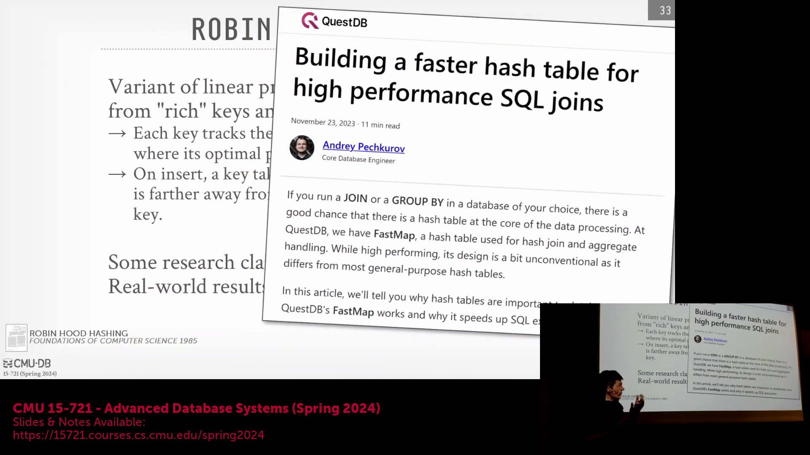

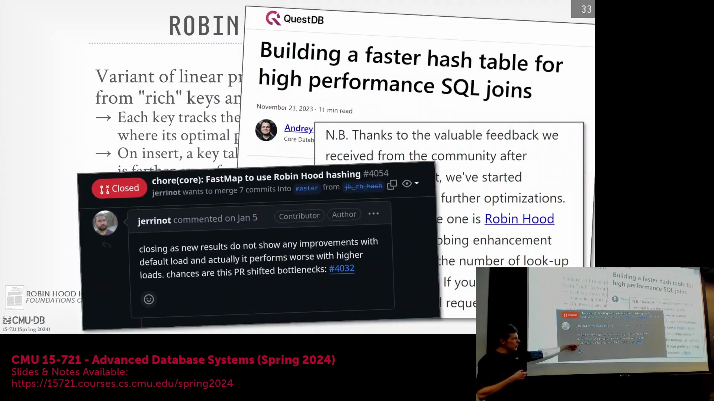
罗宾汉哈希(Robin Hood Hashing)于 20 世纪 80 年代提出，通过“劫富济贫”的位移策略(Displacement Strategy)有效解决了线性探测的效率低下问题。在插入操作(Insertion)中，若新键的理想槽位已被占用，算法会对比现有键的当前探测距离(Probe Distance，即跳数(Hop Count))与待插入键的预期距离。若待插入键距离其理想位置更远，算法将执行位置交换，将现有键向后推移(Displace Backward)。尽管近年来的学术文献(Academic Literature)普遍认为其优于标准线性探测，但在实际工程实现中的表现却存在争议。例如，QuestDB 最初基于早期基准测试(Benchmark)的乐观结果采用了罗宾汉哈希，但最终发现其在生产工作负载(Production Workload)中性能不升反降，遂撤销了该变更。InfluxDB 也报告了类似经历，这凸显了理论优势(Theoretical Advantage)并不总能普遍转化为不同数据分布与硬件配置下的实际性能提升(Actual Performance Gain)。

## 插入机制与探测保证
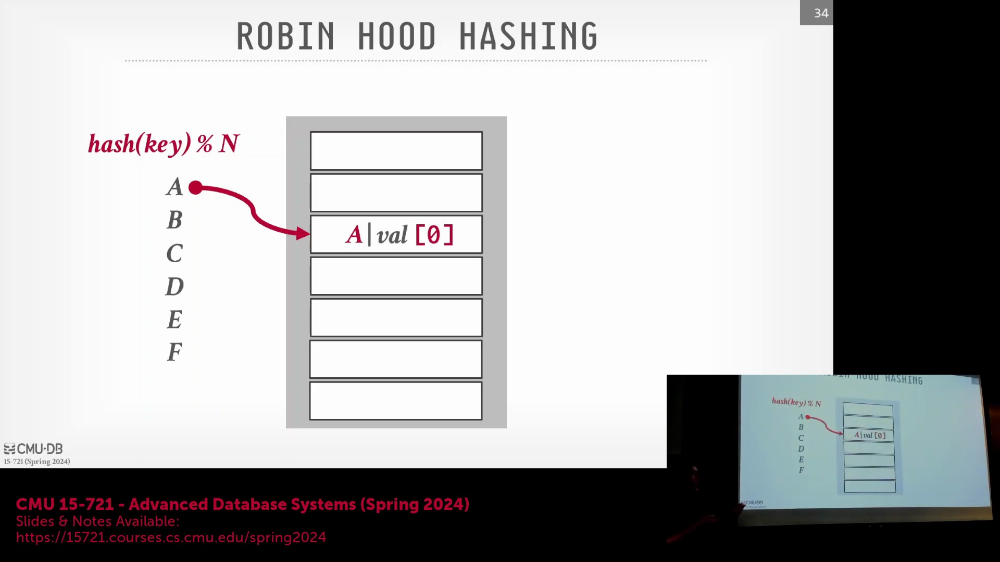
该核心机制要求在每个键值旁额外存储一个“跳数”(Hop Count)，用于记录其偏离原始哈希位置(Original Hash Position)的距离。执行插入时，算法需动态评估是继续顺序插入还是触发键值交换。例如，若键 `E` 距离其理想位置 2 步，并遭遇了键 `D`（距离理想位置仅 1 步），`E` 将抢占(Displace)该槽位，而 `D` 被向后推移，随后系统递归地重新评估(Recursive Re-evaluation)后续位置，直至为 `D` 找到合适槽位。该过程高度依赖条件分支判断(Conditional Branching)与内存复制操作(Memory Copy)，导致插入操作的计算开销显著增加。然而，查找过程(Lookup Process)保持严格的确定性：探测将持续进行，直至命中目标键或遭遇空槽(Empty Slot)，从而保证零假阴性(False Negative)（即绝不会漏报已存在的键值）。得益于其位移逻辑(Displacement Logic)，算法可确保绝不会存在有效键逻辑上位于空槽之后的情况，因此一旦遇到空槽即可安全终止查找。

## 方差降低与工作负载敏感性
在罗宾汉哈希表中，所有条目的跳数(Hop Count)总和在数学层面与标准线性探测等效；该算法并未减少数据位移的绝对次数。相反，它大幅降低了这些距离的方差(Variance)。通过平滑键值的分布，它有效规避了最坏情况(Worst-Case Scenario)，即少数键被推离极远，而多数键仍滞留于理想位置。这使得探测时间(Probe Time)高度可预测。对于存在数据倾斜的工作负载，其表现通常更优，因为高频访问的键会被优先拉近至理想槽位。尽管可叠加布隆过滤器(Bloom Filter)等辅助结构以快速剔除(Fast Reject)不存在的键，但罗宾汉哈希的核心性能增益仍高度依赖于具体的访问模式(Access Pattern)、查询倾斜度(Query Skewness)，以及系统对构建开销(Build Overhead)与探测延迟(Probe Latency)之间权衡的容忍度。

## 跳房子哈希：有界邻域
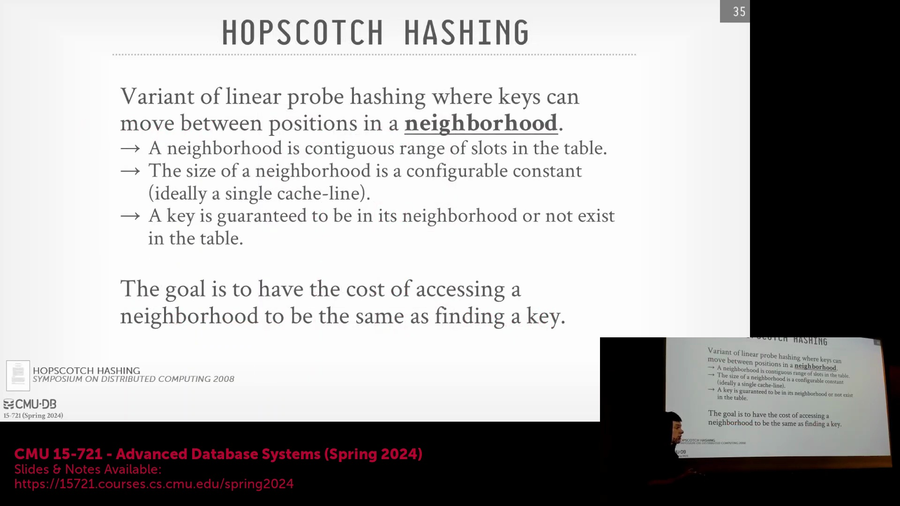
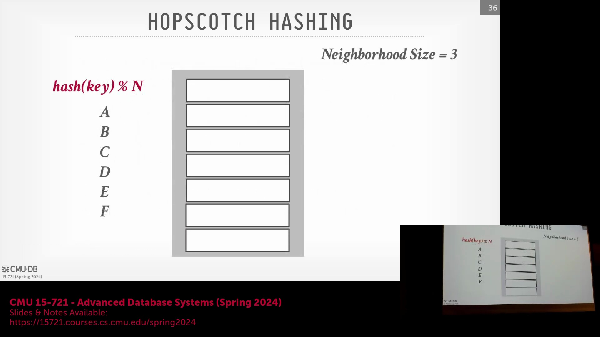
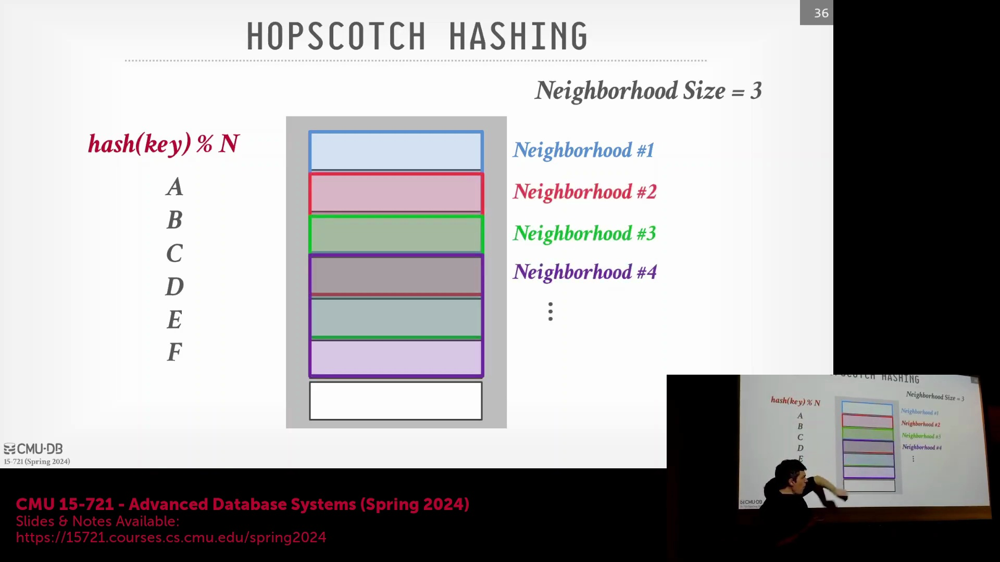
跳房子哈希(Hopscotch Hashing)通过引入严格的边界约束(Boundary Constraint)扩展了罗宾汉哈希的理念：键值仅允许在其理想哈希位置周围预定义的“邻域”(Neighborhood)内进行位移。该邻域的大小通常经过精心设计，以严格对齐 CPU 缓存行(CPU Cache Line)的容量（例如覆盖连续的 3-4 个槽位）。通过限制位移范围，算法可确保任意有效键或空槽(Empty Slot)均驻留于同一缓存行内，从而保证无论键在邻域内的具体位置如何，内存访问延迟(Memory Access Latency)均保持一致。若在尝试受限交换(Restricted Swap)后，目标邻域内仍无可用空间，哈希表将立即触发扩容操作。该方法有效限制了最大探测长度(Maximum Probe Length)，彻底消除了异常冗长扫描的风险，且相较于无界线性探测(Unbounded Linear Probing)或罗宾汉探测，能更高效地利用现代 CPU 缓存层次结构(CPU Cache Hierarchy)。

---

## 跳房子哈希：邻域约束与插入
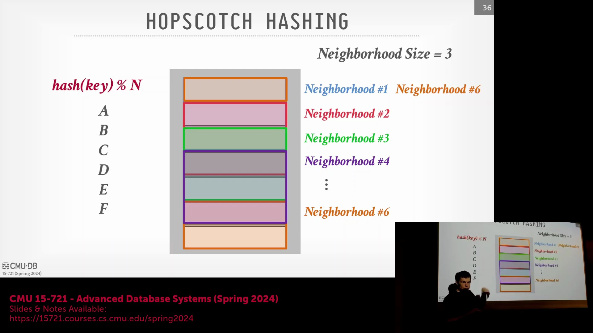
跳房子哈希(Hopscotch Hashing)通过定义固定大小（例如三个连续槽位）且相互重叠的“邻域”(Neighborhood)，为探测长度(Probe Length)引入了严格的边界约束。执行插入操作时，新键必须驻留于其目标邻域内。例如，键 `A` 经哈希映射至邻域 3，因哈希表当前为空，故占据该邻域的首个槽位。键 `B` 映射至邻域 1 并占据对应槽位。后续键 `C` 与 `D` 的插入虽遵循线性探测(Linear Probing)模式，但被严格限制在各自的目标邻域范围内。 
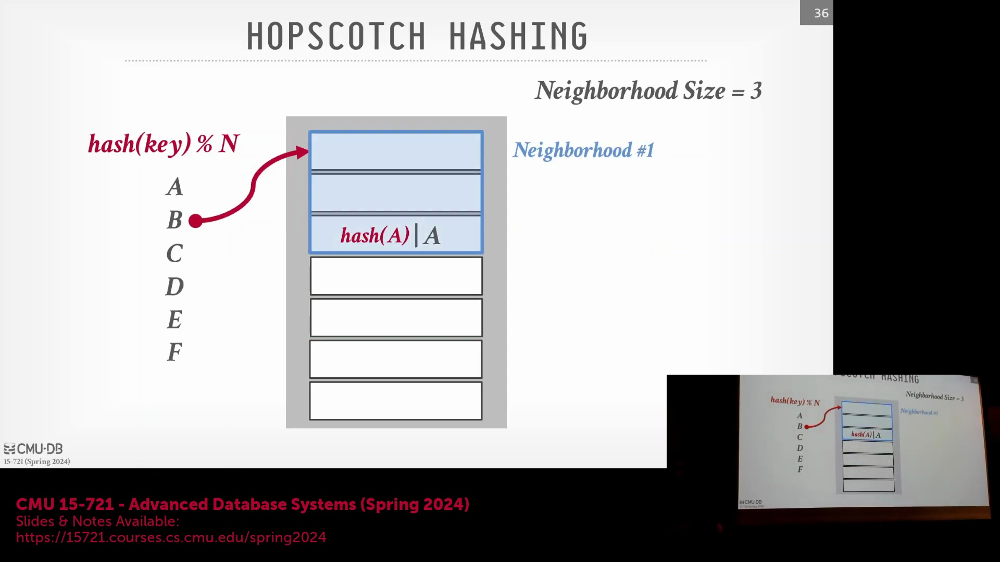
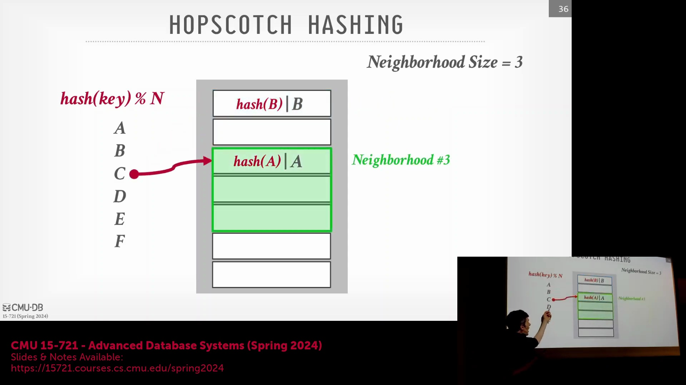
当键 `E` 尝试插入邻域 3 时，若发现该邻域已满，算法不会进行无限制的向前扫描，而是遍历现有条目，甄别出哪些条目在逻辑上合法属于邻域 3。 
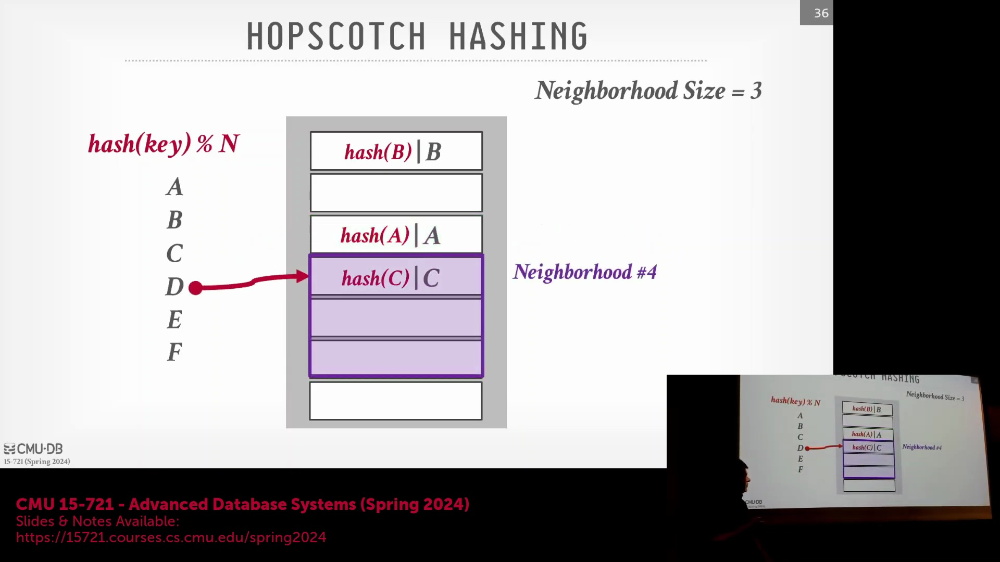
算法识别到 `D` 的原始哈希位置实为邻域 4。鉴于邻域 4 内存在空闲槽位，`D` 被向后推移一个槽位，迁移至其另一有效位置。 
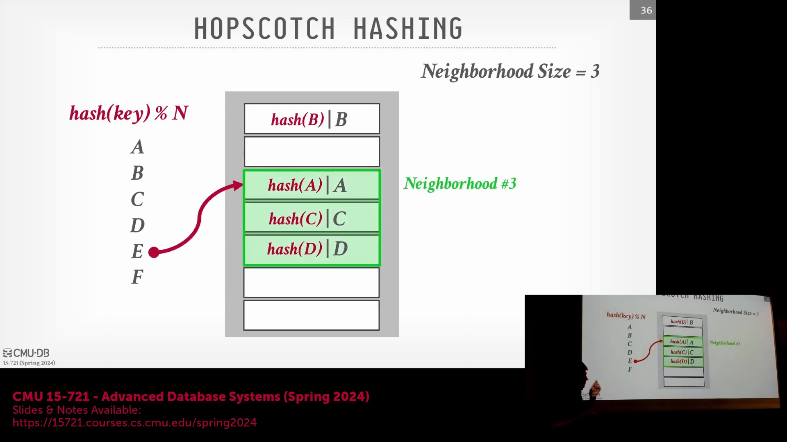
此项定向交换(Directional Swap)成功释放了邻域 3 中的一个槽位，使 `E` 得以顺利插入。该机制确保所有键与其理想哈希位置(Ideal Hash Position)之间的偏移量始终维持在可预测且严格对齐缓存行(Cache-Line Aligned)的范围内。

## 跳房子哈希的复杂度、交换机制与扩容触发条件
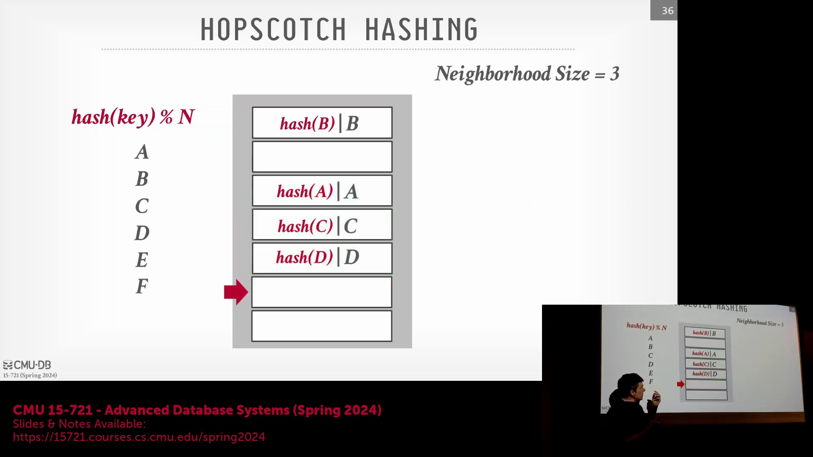
邻域交换逻辑(Neighborhood Swap Logic)相较于标准线性探测或罗宾汉哈希(Robin Hood Hashing)更为复杂，在构建阶段(Build Phase)会引入更高的计算开销(Computational Overhead)。然而，该成本是严格有界且可均摊的(Amortized Cost)。关键的性能权衡在于，现代 CPU 架构极度偏好简单指令流；在诸多实际基准测试(Benchmark)中，跳房子哈希复杂的条件分支(Conditional Branching)与交换操作反而可能导致性能逊于更简单的方案。
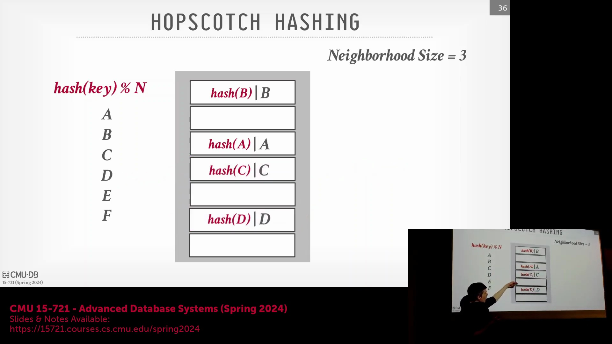
跳房子哈希的一项根本限制在于其严格的扩容触发条件(Resizing Trigger Condition)：若某邻域已满，且其中任意条目均无法合法迁移(Migrate)至相邻的空闲槽位，算法将强制终止当前插入并触发全表扩容(Resize Operation)，即便表中其他区域仍存在空闲空间。此特性使扩容过程对数据分布(Data Distribution)与物化策略(Materialization Strategy)高度敏感。采用延迟物化(Late Materialization)的系统尚可承受此开销，但存储完整元组（即早期物化 Early Materialization）的系统在扩容时将面临高昂的数据复制成本。为缓解该问题，QuestDB 等数据库系统采用元组外置存储策略，将完整元组存放于独立堆区(Heap)，哈希表中仅保留行偏移量(Row Offset)，从而将扩容降级为轻量级的指针重分配(Pointer Reallocation)操作。

## 布谷鸟哈希：多函数驱逐与有界查找
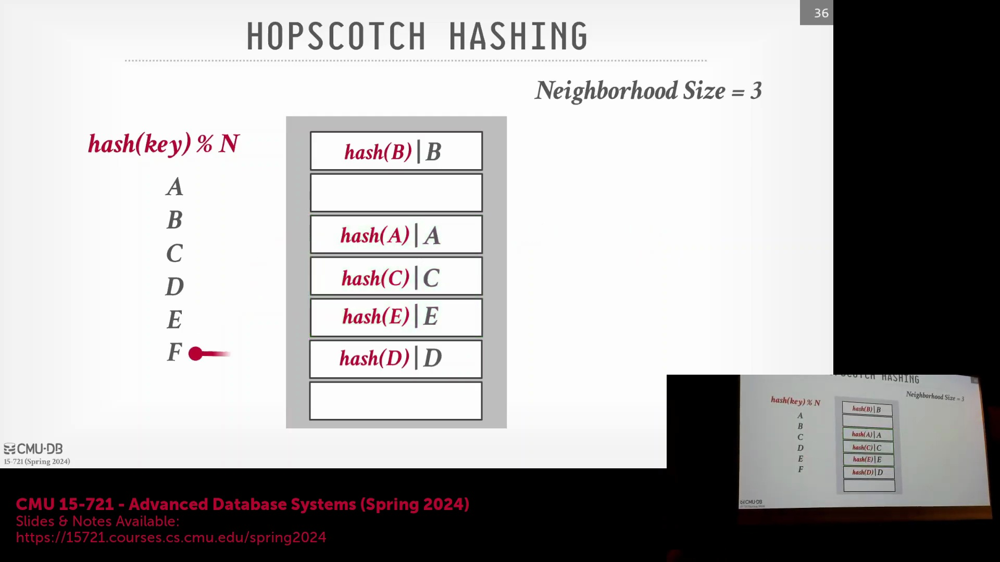
布谷鸟哈希(Cuckoo Hashing，注：学术上易与双重哈希 Double Hashing 区分)采用固定的确定性驱逐机制(Deterministic Eviction Mechanism)，取代了无限制的线性扫描。该算法摒弃单一哈希函数，转而使用多个哈希函数（通常为两个，且采用不同种子 Seed），为每个键精确生成两个候选槽位(Candidate Slot)。执行插入时，若任一候选槽位为空，键将直接写入。若两槽位均被占用，算法会随机“踢出”(Evict)一个现有键以腾出空间，随后利用备用哈希函数尝试重新插入(Re-insert)被驱逐的键。
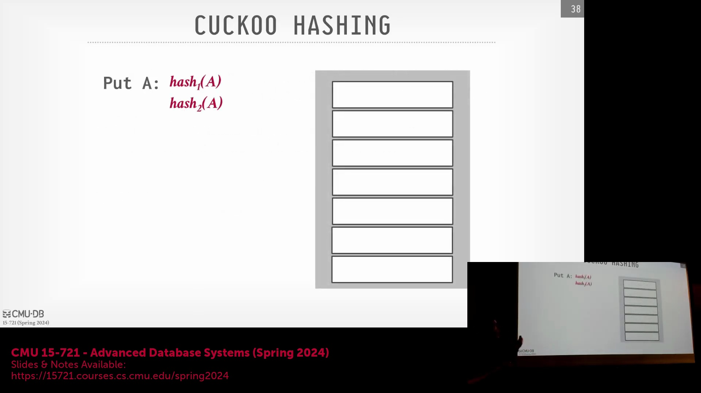
此驱逐链(Eviction Chain)将持续执行，直至定位到空闲槽位。为防范无限循环(Infinite Loop)，算法会记录已访问路径，一旦检测到环路(Cycle)即中止操作并强制触发扩容。该架构带来显著的性能收益：查找操作(Lookup Operation)被严格限定为 O(1) 时间复杂度，最多仅需两次哈希运算与两次内存访问(Memory Access)。IBM DB2 等系统正是利用此特性，实现了高度可预测的探测端延迟(Probe Latency)。

## 工作负载权衡：针对读密集型访问的优化
尽管罗宾汉哈希、跳房子哈希与布谷鸟哈希显著提升了构建阶段(Build Phase)的算法复杂度与 CPU 周期消耗(CPU Cycle Consumption)，但其工程设计明确针对读取密集型工作负载(Read-Intensive Workload)进行了优化。在数据库系统中，哈希连接(Hash Join)通常被视为“一次写入，多次读取”(Write-Once, Read-Many)操作：哈希表仅在构建阶段实例化一次，随后在探测阶段(Probe Phase)需对大规模关系表(Relation)执行数百万次探测查询。以构建速度换取有界(Bounded)、缓存友好(Cache-Friendly)且分支可预测(Branch-Predictable)的查找性能，对于探测吞吐量(Probe Throughput)主导整体查询执行时间(Query Execution Time)的分析型(OLAP)与事务型(OLTP)数据库而言，是一项具备严密数学依据的架构权衡(Architectural Trade-off)。

## 哈希表存储布局与键表示

实现开放寻址哈希(Open Addressing Hashing)需审慎决策哈希表槽位(Slot)内实际存储的物理数据形态。对于变长数据(Variable-Length Data)，直接存储完整元组将引发兼容性问题，因开放寻址强制要求固定槽位尺寸以保障内存寻址的可预测性。业界通用的解决方案是存储指向独立元组堆(Tuple Heap)的 64 位偏移量(Offset)或指针。该设计虽最小化了槽位体积并简化了扩容逻辑，却在连接操作(Join Operation)期间引入了指针解引用(Pointer Dereferencing)的额外开销。此外，系统还需抉择存储原始连接键(Join Key)抑或预计算哈希值(Precomputed Hash Value)。存储哈希值可在冲突解决(Collision Resolution)时启用高效的整数比较，规避高昂的字符串或多列比对成本，但会额外增加单槽内存占用。数据库架构师(Database Architect)必须依据工作负载特征与硬件缓存容量(Hardware Cache Capacity)，在空间效率(Space Efficiency)与 CPU 消耗(CPU Consumption)之间持续寻求最优平衡。

## 探测阶段优化：横向信息传递
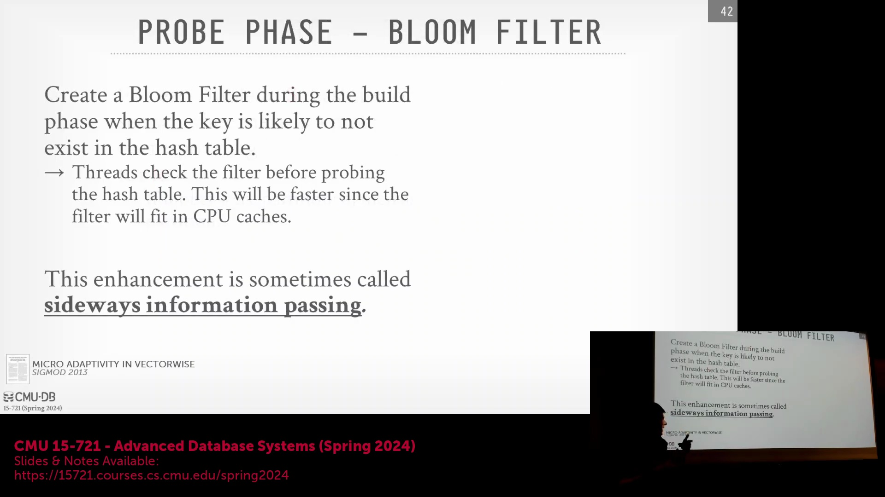
探测阶段(Probe Phase)本质上是顺序执行的，需遍历外表(Outer Relation)并频繁查询哈希表。然而，引入布隆过滤器(Bloom Filter)可大幅提升该阶段性能，此类优化在查询优化领域被称为“横向信息传递”(Sideways Information Passing, SIP)。在构建阶段，系统会并行构建一个紧凑的布隆过滤器。在发起哈希表探测前，查询引擎优先检索该过滤器。得益于布隆过滤器零假阴性(Zero False Negative)的数学特性，若判定目标键不存在，即可确证其不在数据集中，系统从而直接跳过(Skip)代价高昂的哈希表查找操作。该技术在 Hyper 与 Umbra 等现代数据库中得到广泛部署，部分实现还会叠加桶级布隆过滤器(Bucket-Level Bloom Filter)，以彻底规避不必要的链式遍历(Chained Traversal)。

## 过渡到性能基准测试

理论探讨随后转向实证性能分析(Empirical Performance Analysis)，在受控工作负载(Controlled Workload)下对各类分区与哈希策略进行横向对比。基准测试(Benchmark)不仅将无分区基线(Non-Partitioned Baseline)与基数分区变体(Radix Partitioning Variants)进行对照，还评估了专为 IBM DB2 研发、后被 ClickHouse 等系统采纳用于处理字符串密集型工作负载(String-Intensive Workload)的专用数据结构——如简洁哈希表(Concise Hash Table)。这些实证评估量化了算法复杂度(Algorithmic Complexity)、缓存局部性(Cache Locality)及硬件感知优化(Hardware-Aware Optimization)如何切实转化为现代并行数据库引擎(Modern Parallel Database Engine)中可度量的吞吐量(Throughput)提升。

---

## DB2 BLU 实现方案与基础至优化技术谱系

讨论首先从考察 DB2 BLU(DB2 BLU Acceleration)等专用架构入手，该架构将打包数组(Packed Arrays)与布隆过滤器(Bloom Filters)相结合。文中指出，此类高度定制化(Highly Customized)的实现极少在其原生生态系统之外得到广泛应用。随后，焦点转向对比基础开源算法实现与经过深度优化、具备硬件感知能力(Hardware-Aware)的变体。文中引入了一张性能可视化图表，用于映射可用技术方案的演进谱系，并依据其工程复杂度(Engineering Complexity)及与底层 CPU 架构(CPU Architecture)的契合度进行分类。

## 基数分区性能与工程简洁性的权衡

基准测试(Benchmark)图表分析表明，当基数分区(Radix Partitioning)与任意标准哈希方案（如链式哈希(Chained Hashing)、线性探测(Linear Probing)、开放寻址(Open Addressing)，或直接利用哈希键作为索引的基础线性数组(Direct-Addressing Linear Array)）结合使用时，始终能实现最高的吞吐量(Throughput)。然而，在异构架构中正确实现这些硬件专属优化(Hardware-Specific Optimizations)的难度极大。对于绝大多数生产工作负载(Production Workloads)而言，摒弃基数分区的简单线性数组方案取得了极佳的平衡：它在提供稳健性能的同时，显著降低了工程复杂度、维护开销(Maintenance Overhead)以及特定硬件平台上的性能回退(Performance Regression)风险。

## 真实查询开销与瓶颈分布

对完整查询执行流程(Query Execution Flow)（尤其是 TPC-H Query 19）的实证分析(Empirical Analysis)显示，哈希连接(Hash Join)操作本身通常仅占总运行时间的 10% 至 13%。剩余耗时主要被上游与下游操作占据，涵盖数据摄入(Data Ingestion)、谓词过滤(Predicate Filtering)、结果物化(Result Materialization)以及更宏观的查询计划编排(Query Plan Orchestration)。这一时间分解证实，尽管哈希连接是核心组件，但在分析型工作负载(Analytical Workloads)中，它极少成为绝对的单一瓶颈(Single Bottleneck)。因此，采用直接且无分区的线性实现(Non-Partitioned Linear Implementation)通常是更为务实的工程决策，可有效避免在微观优化(Micro-Optimization)上陷入边际收益递减(Diminishing Returns)的困境。

## ClickHouse 针对字符串的专用哈希表架构

讲座重点剖析了 ClickHouse 针对基于字符串的哈希连接(String-Based Hash Join)所采用的高度优化策略。ClickHouse 并未依赖单一庞大的数据结构，而是对外暴露统一的逻辑接口(Uniform Logical Interface)，底层由多个专用哈希表变体(Specialized Hash Table Variants)协同支撑。每个变体均针对特定的字符串长度范围（例如 ≤16 字节、17–32 字节等）进行了精细化调优(Fine-Tuning)。在与 ART、链式哈希、跳房子哈希(Hopscotch Hashing)、布谷鸟哈希(Cuckoo Hashing)、罗宾汉哈希(Robin Hood Hashing)、F14 哈希表(F14 Hash Table)、Swiss Tables 以及基础线性探测等先进替代方案进行基准对比时，ClickHouse 基于尺寸感知(Size-Aware)的专用化方案始终展现出更卓越的性能。该方法凸显了面向数据类型优化(Data-Type-Aware Optimization)的实际收益，尽管此类工程洞见多通过技术博客发布，而非正式学术出版物。

## 工程实用主义：反对过度设计的理由

讲座得出的一个关键结论探讨了系统是否应投入资源开发复杂的变长字符串哈希表(Variable-Length String Hash Table)或激进的分区方案(Aggressive Partitioning Scheme)。尽管理论分析与受控环境下的微基准测试(Micro-Benchmarks)均偏向于这些专用方法，但实际工程实现(Empirical Implementation)需耗费大量资源，并会引入显著的维护复杂性(Maintenance Complexity)。例如，分区技术在隔离环境(Isolated Environment)中确实表现更优，但要在异构硬件配置中进行稳健调优(Robust Tuning)却极具挑战。因此，大多数生产级数据库(Production-Grade Databases)将简洁性置于首位，倾向于采用单一且经过充分验证的通用实现(Universal Implementation)，而非通过过度设计(Over-Engineering)去追逐边际算法收益(Marginal Algorithmic Gains)。

## 课程总结与后续安排

本系列讲座(Lecture Series)最后概述了后续课程安排。接下来的课程将深入探讨最坏情况最优连接算法(Worst-Case Optimal Join Algorithms)，并提供使用硬件性能计数器(Hardware Performance Counters)进行性能剖析(Performance Profiling)的实操指导。此外，提醒学生留意下周三即将举行的项目进度汇报(Project Progress Update)。课程在非正式的鼓励性致辞与轻松的课堂互动中落下帷幕，讲师强调在课程收官阶段，应保持学习节奏、注重代码实践(Code Practice)并集中精力备战最终考核。