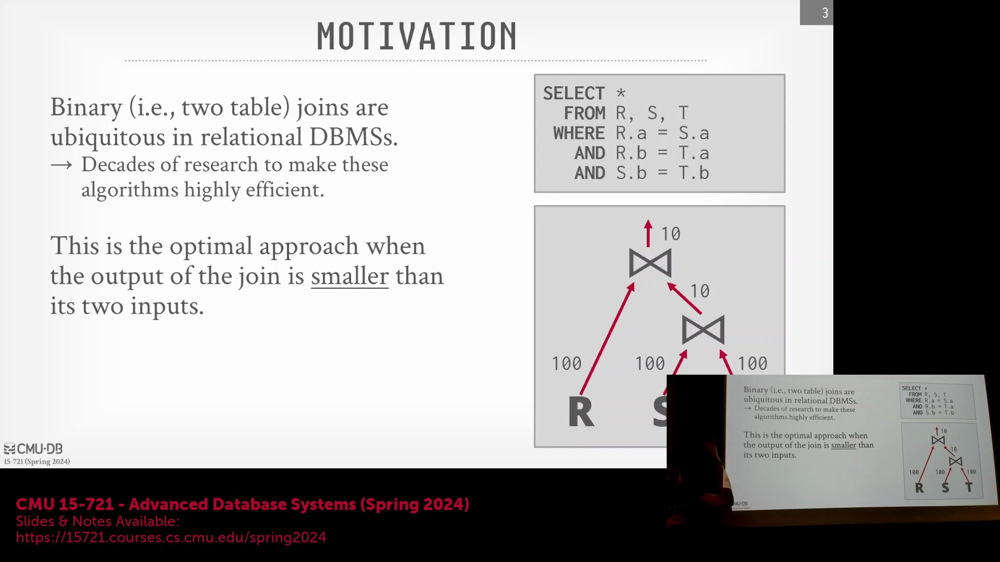
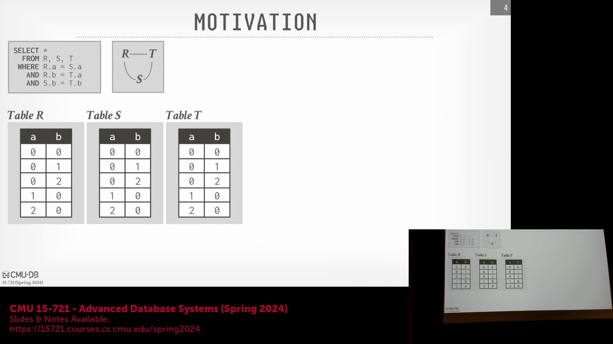
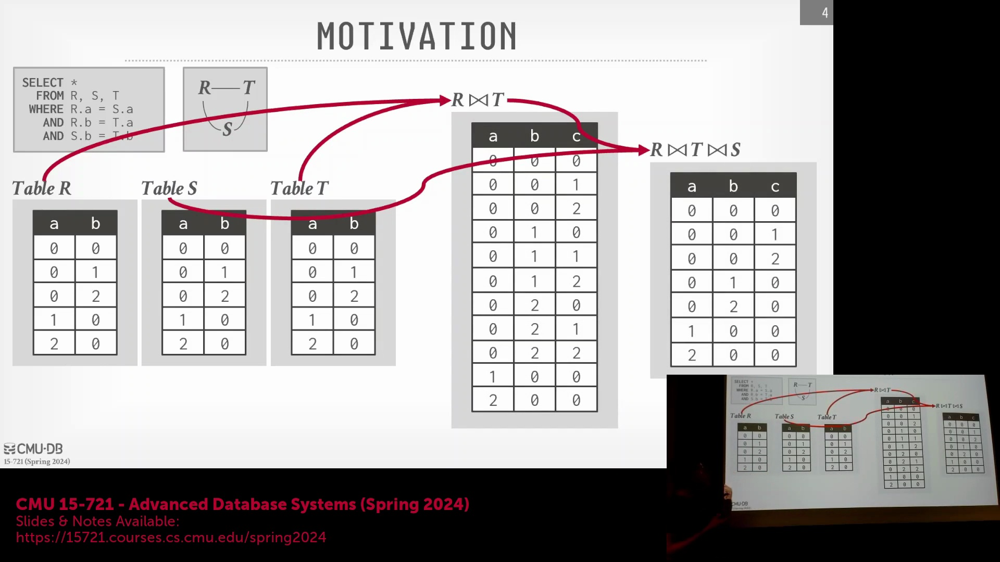
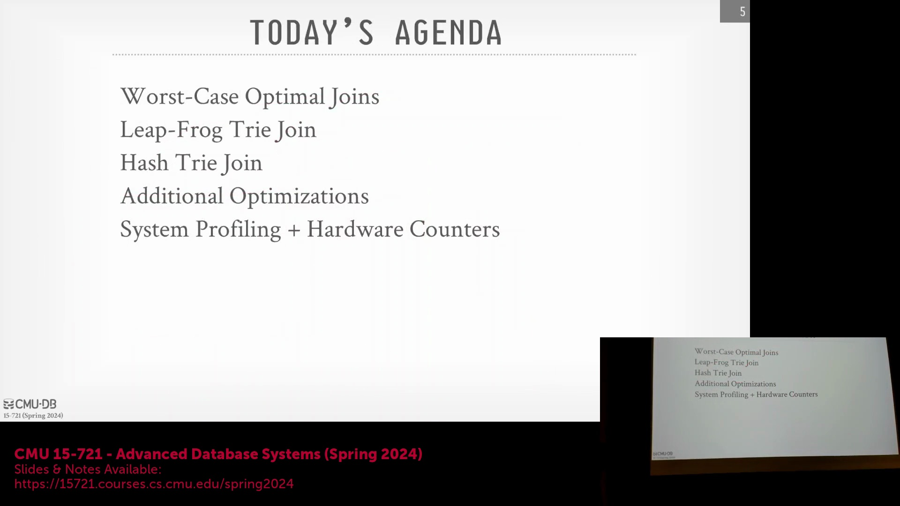
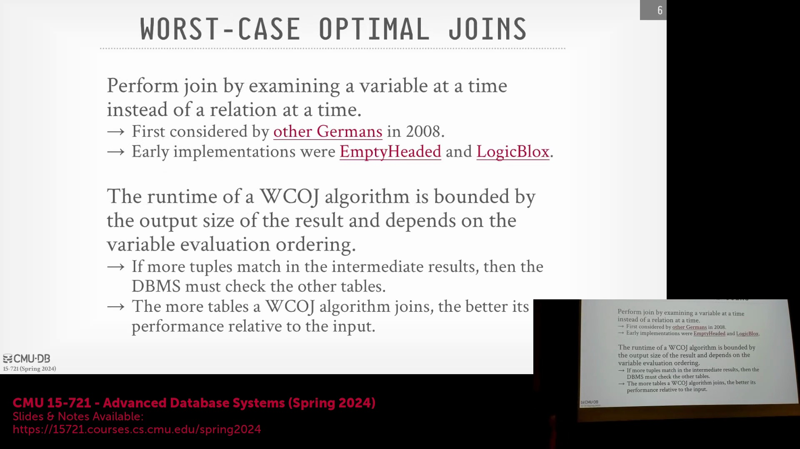

## 课程简介与讲座概览
欢迎来到卡内基梅隆大学的高级数据库系统(Advanced Database Systems)课程，本讲座在演播室现场观众面前录制。今天的讲座将对外公开提供，内容将探讨一个与入门课程及上一讲所讲的并行执行(Parallel Execution)截然不同的主题。我们将深入分析这种新方法背后的动机，回顾其早期的代表性实现之一，并审视后续研究者是如何对其进行改进的。最后，我将结合 DuckDB 的设计经验指出：如果数据库系统的其他核心组件从一开始就设计得当，您可能实际上并不需要引入这些复杂的技术。

## 回顾：并行哈希连接与底层优化
在上一节课中，我们重点探讨了如何优化哈希连接(Hash Join)以实现极致性能，特别强调了如何在单台机器的多个工作线程上进行并行执行(Parallel Execution)，而非跨分布式节点处理。正如前文所述，处理数据倾斜或多样化数据集颇具挑战，因此在实践中常采用非分区哈希连接(Non-partitioned Hash Join)。现代关系型数据库系统(RDBMS)中的查询优化器(Query Optimizer)通常已能有效应对这些数据模式。得益于数十年的学术研究，哈希连接的性能已被优化至极其贴近硬件底层的水平；工程团队甚至致力于为每个元组(Tuple)节省哪怕一个 CPU 周期(CPU Cycle)（例如，将执行时间从每个元组 12 个周期压缩至 11 个周期）。在这一微观层级上，传统优化方法所能挖掘的潜力已微乎其微。

## 中间结果膨胀问题
当连接算子(Join Operator)的输出规模小于其输入规模时，二元连接(Binary Join)通常是首选且更高效的方法。例如，对表 R、S 和 T 进行连接，逻辑上可能仅产生 10 个最终元组(Tuple)。然而，当连接算子的中间输出发生膨胀并远超输入规模时，便会引发重大挑战。根据数据分布和连接条件(Join Condition)的不同，中间步骤可能会生成海量元组，且必须在内存中进行物化(Materialization)。一旦超出内存容量限制，系统就必须将数据溢出(Spill)至本地磁盘，甚至是 S3 等远程对象存储(Remote Object Storage)中。这将导致存储与计算资源的大量浪费，因为这些被物化的中间元组绝大多数会在后续连接步骤中被过滤丢弃。无论查询优化器选择何种连接顺序（如先 R-S 后 T，先 R-T 后 S，或先 S-T 后 R），中间结果膨胀问题依然存在，从而在最坏情况下给数据处理带来沉重负担。

## 多路连接：一种以属性为中心的方法
为了解决中间结果膨胀问题，我们需要一种新策略，能够在元组(Tuple)被完全物化(Materialization)之前，尽早识别并剔除不匹配的记录。这正是多路连接(Multi-way Join)的用武之地。多路连接打破了传统按顺序两两组合表(Binary Join)的执行范式，转而采用以属性为中心(Attribute-centric)的操作视角。该算法会同时从所有参与连接的表中提取连接键(Join Key)属性并进行比对，仅当相关属性子集真正匹配时，才会继续构建输出或执行额外比较。这种以属性为中心的范式从根本上改变了我们处理三表及以上连接的方式，使系统能够立即短路(Short-circuit)无用计算，从而大幅提升效率。

## 最坏情况最优连接：历史与核心机制
多路连接(Multi-way Join)的概念构想最早可追溯至 20 世纪 80 年代，但“最坏情况最优”(Worst-Case Optimal, WCO)连接的理论证明与工程实现直到 2000 年代末才真正成型，其中 2008 年的一篇奠基性论文具有里程碑意义。早期的代表性实现包括斯坦福大学开发的 EmptyHeaded 系统，以及商业数据库 LogicBlox（后者采用 Datalog 而非 SQL 作为查询语言）。WCO 连接的核心优势在于：其时间复杂度(Time Complexity)主要取决于最终结果集的大小及参与比较的属性数量，而非输入表的原始规模。得益于这一特性，算法一旦在某个连接键(Join Key)属性上发现失配，便能立即短路(Short-circuit)后续比对，从而彻底避免了传统二元连接(Binary Join)中固有的冗余计算。值得注意的是，参与 WCO 连接的表数量越多，其相较于传统分阶段二元连接的性能优势往往越显著，因为它能够同步评估所有表的匹配条件。

## 单属性连接键与短路机制
在讲座讨论环节，有听众提出疑问：当连接键(Join Key)仅包含单个属性时，上述多路连接与短路机制该如何应用？实际上，若连接条件仅涉及单一属性，问题本身会大幅简化，因为不存在需要交叉比对的其他属性列。尽管此时跨多列进行短路比较(Short-circuiting)带来的性能增益会自然减弱，但多路连接(Multi-way Join)的核心逻辑依然适用。算法仍可同步扫描所有表中的单属性连接键，但在单键场景下，跳过冗余多属性比较所节省的计算开销相对有限，因此性能优势不再如多表多键场景那般显著。