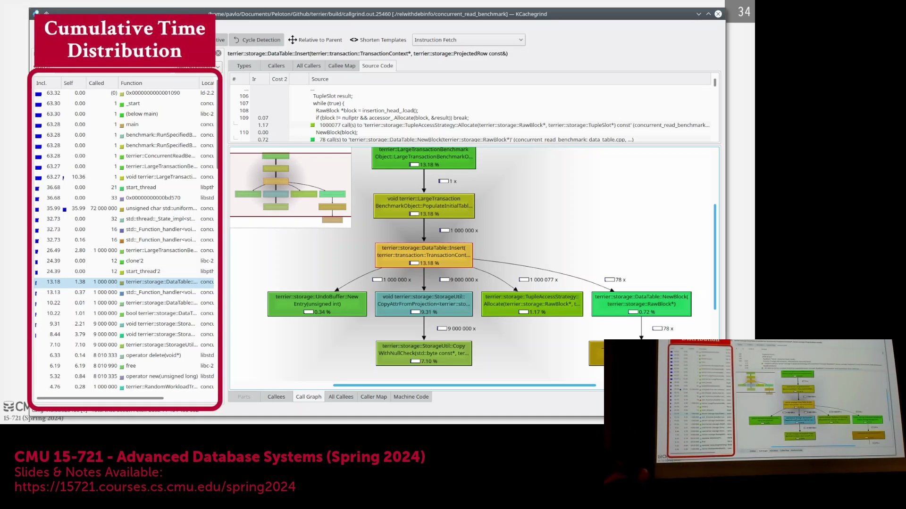
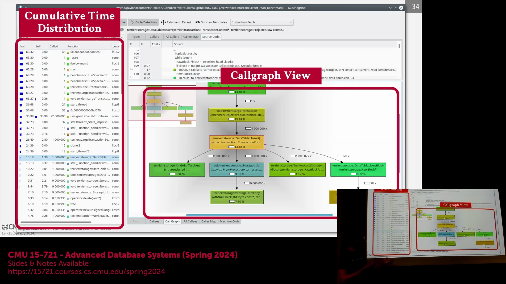
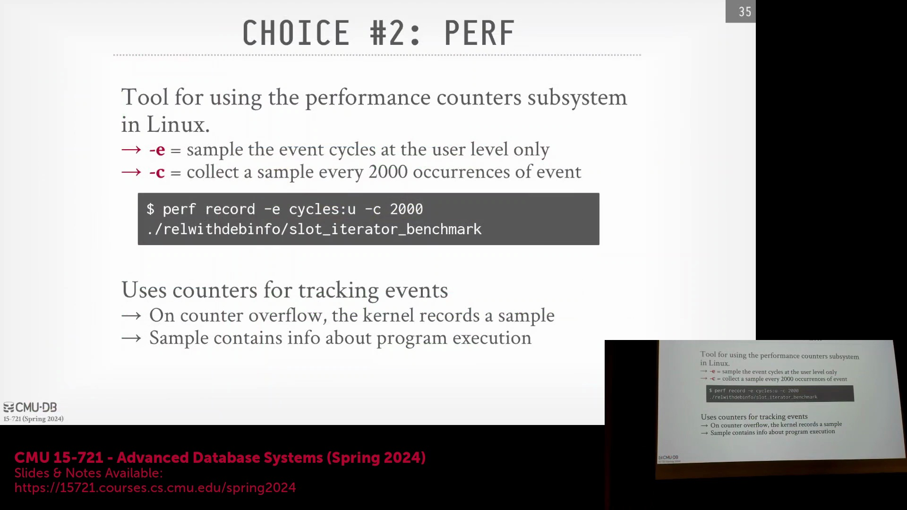
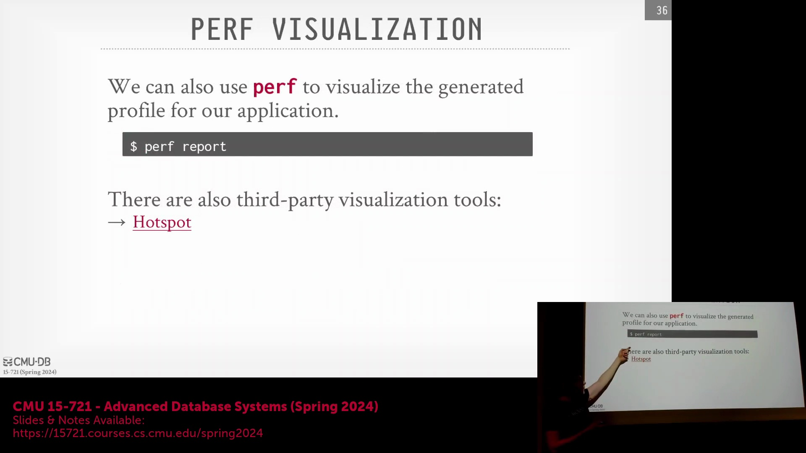
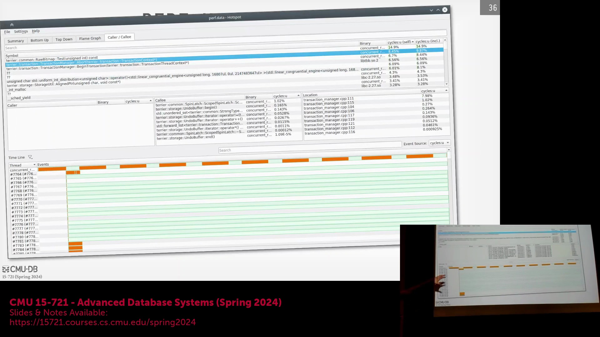
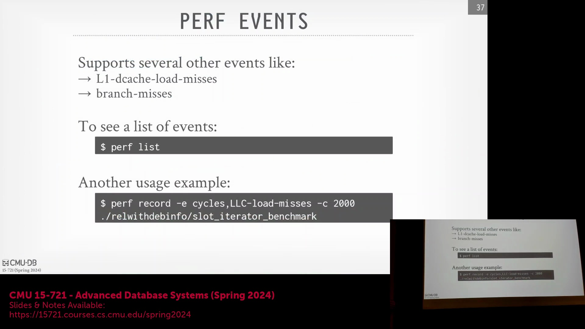
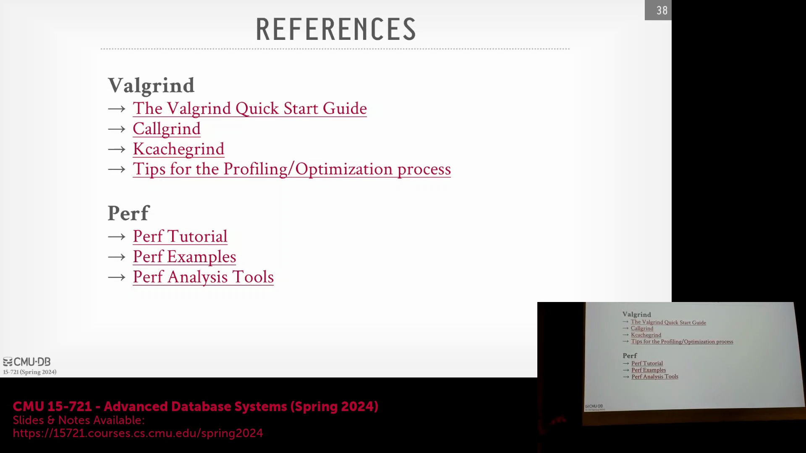
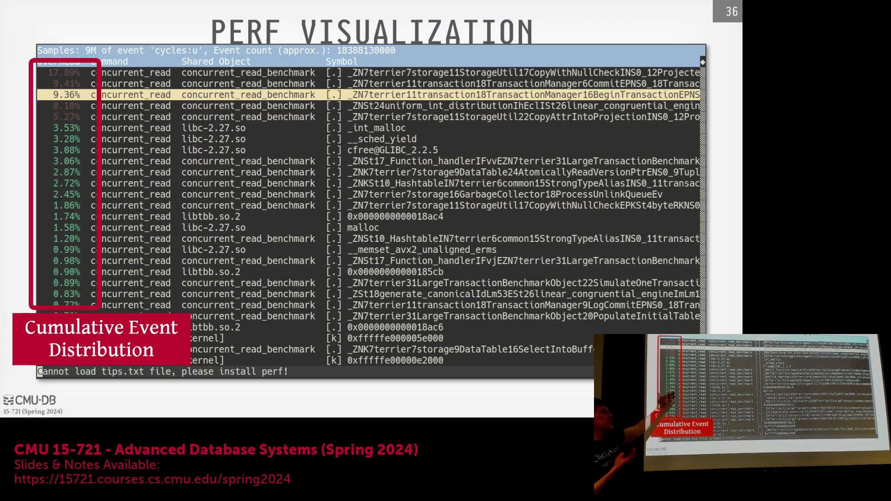
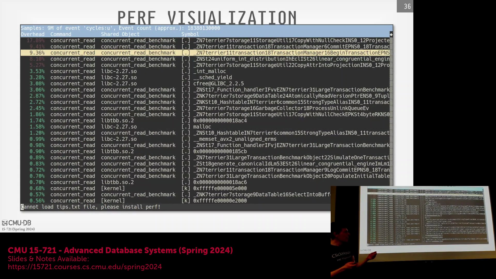
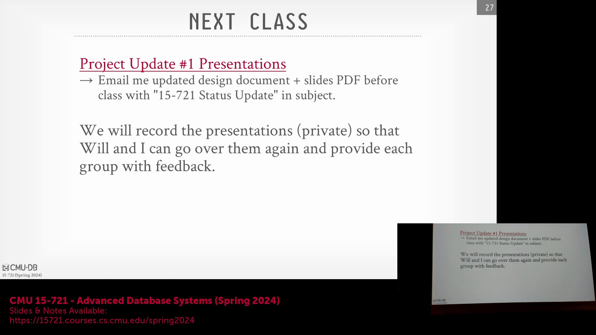

## 调用图可视化与函数分析

性能剖析工具(Profiling Tools)能够直观地可视化程序的执行流程。通过它，你可以一览所有函数，追溯其调用方(Caller)，并统计每个函数的调用次数。该工具还会计算各函数所占的总执行时间百分比，从而呈现代码库不同区域的时间消耗分布。当程序调用缺乏调试符号(Debug Symbols)的预编译库(Precompiled Libraries)时，剖析器可能仅显示库名称和内存地址。为获取更详尽的信息，建议自行编译这些依赖库。此外，调用图(Call Graph)视图支持你深入钻取特定函数，以查看更细致的执行信息。

## 剖析开销与时间测量失真
像 Callgrind 这类工具会在程序运行期间动态生成剖析信息(Profiling Information)。由于它们在用户态运行，无需特殊硬件权限，但会对目标代码进行大量插桩(Instrumentation)，因此会显著拖慢执行速度。受此影响，与标准运行相比，挂钟时间(Wall-Clock Time)的测量结果可能会出现严重失真。这种性能损耗会深刻改变并发代码的行为：原本存在的竞态条件(Race Conditions)可能因时序变化而消失，或者因程序执行节奏被大幅打乱，暴露出人为引入的异常问题(Artifacts)。

## 使用 `perf` 进行硬件级剖析
一种更高效的替代方案是使用 `perf` (Linux Profiler)。该工具通常需要 `root` 权限以访问底层的硬件性能计数器(Hardware Performance Counters)。你可以配置 `perf` 按固定的时钟周期(Clock Cycles)间隔进行采样，灵活调整事件监控频率与跟踪粒度。与高开销的插桩工具不同，`perf` 能让程序以接近原生速度运行。需要注意的是，它会持续将剖析数据写入转储文件(Dump File，如 `perf.data`)，这可能会对磁盘 I/O(Disk I/O)敏感型应用产生轻微干扰，但整体开销仍远低于传统的 Callgrind 类剖析器。

## `perf report`、火焰图与第三方工具

程序运行结束后，执行 `perf report` 命令将生成一份排序清晰的可视化视图，精准定位程序耗时最多的代码区域。只要在编译时保留了调试符号(Debug Symbols)，你即可深入各个函数，逐行审查代码执行热点(Hotspots)。借助 `hotspot` 或火焰图(Flame Graph)生成器等第三方可视化工具，这些抽象数据将变得直观易懂，瓶颈所在一目了然。此外，你可以指示 `perf` 采集特定的硬件指标，例如 CPU 时钟周期(CPU Cycles)、末级缓存未命中(Last-Level Cache Misses)及 CPU 利用率。针对 Rust(Rust) 开发者，`cargo flamegraph` 可与 `perf` 无缝集成以生成高保真火焰图，但访问硬件计数器仍需配置相应的权限或环境变量。

## 优化特定函数与问答环节

当某个特定函数占据绝大部分执行时间时，`perf report` 支持将其隔离，以便进行行级(Line-level)性能数据分析。这有助于快速定位低效模式，例如频繁的内存分配(Memory Allocation)或异常的控制流路径(Control Flow)。相较于传统剖析器，`perf` 的核心优势在于它能揭示函数 *为何* 运行缓慢——通过追踪硬件级事件（如缓存行为、TLB 未命中(TLB Misses)、指令周期(Instruction Cycles)），而非仅仅统计 *耗时*。为避免生成海量冗余数据，可采用定向剖析技术，例如设置内核探针(Kernel Probes)或函数入口/出口钩子(Function Entry/Exit Hooks)，仅在关键代码段采集指标。最佳实践是：先定位高层级瓶颈，再逐层下钻以剖析底层的硬件限制。

## 管理编译器优化与汇编代码检查

高级编译器优化(Compiler Optimization，如 `-O3`)会激进地执行函数内联(Inlining)或死代码消除(Dead Code Elimination)，这给传统调试与剖析带来了挑战。需注意，调试符号的生成与优化标志(Optimization Flags)是相互独立的。为防止编译器重写或优化掉待剖析的目标函数，可显式添加 `noinline` 等编译器属性(Attribute)。现代剖析工具支持并排展示原始源代码与对应的汇编代码(Assembly Code)，使开发者能够直观验证优化器的代码转换逻辑。直接审查汇编输出，通常是理解高级编译优化如何影响性能表现的最可靠途径。

## 课程总结与结束语

本次关于性能剖析(Performance Profiling)与硬件计数器(Hardware Counters)的技术讲解至此告一段落。下节课将主要安排学生项目展示(Student Presentations)，请务必在课前提交所有演示幻灯片(Project Slides)与项目文档。 

聊些轻松的话题，请大家尽情享受二月里这反常的暖阳。无论是前往健身房进行力量训练，还是课后放松休憩，都请注意劳逸结合、把握节奏。 

祝大家身体健康，记得多补充水分。我们下节课再见！

