## 课程简介与讲座概览
欢迎来到卡内基梅隆大学的高级数据库系统(Advanced Database Systems)课程，本讲座在演播室现场观众面前录制。今天的讲座将对外公开提供，内容将探讨一个与入门课程及上一讲所讲的并行执行(Parallel Execution)截然不同的主题。我们将深入分析这种新方法背后的动机，回顾其早期的代表性实现之一，并审视后续研究者是如何对其进行改进的。最后，我将结合 DuckDB 的设计经验指出：如果数据库系统的其他核心组件从一开始就设计得当，您可能实际上并不需要引入这些复杂的技术。

## 回顾：并行哈希连接与底层优化
在上一节课中，我们重点探讨了如何优化哈希连接(Hash Join)以实现极致性能，特别强调了如何在单台机器的多个工作线程上进行并行执行(Parallel Execution)，而非跨分布式节点处理。正如前文所述，处理数据倾斜或多样化数据集颇具挑战，因此在实践中常采用非分区哈希连接(Non-partitioned Hash Join)。现代关系型数据库系统(RDBMS)中的查询优化器(Query Optimizer)通常已能有效应对这些数据模式。得益于数十年的学术研究，哈希连接的性能已被优化至极其贴近硬件底层的水平；工程团队甚至致力于为每个元组(Tuple)节省哪怕一个 CPU 周期(CPU Cycle)（例如，将执行时间从每个元组 12 个周期压缩至 11 个周期）。在这一微观层级上，传统优化方法所能挖掘的潜力已微乎其微。

## 中间结果膨胀问题
当连接算子(Join Operator)的输出规模小于其输入规模时，二元连接(Binary Join)通常是首选且更高效的方法。例如，对表 R、S 和 T 进行连接，逻辑上可能仅产生 10 个最终元组(Tuple)。然而，当连接算子的中间输出发生膨胀并远超输入规模时，便会引发重大挑战。根据数据分布和连接条件(Join Condition)的不同，中间步骤可能会生成海量元组，且必须在内存中进行物化(Materialization)。一旦超出内存容量限制，系统就必须将数据溢出(Spill)至本地磁盘，甚至是 S3 等远程对象存储(Remote Object Storage)中。这将导致存储与计算资源的大量浪费，因为这些被物化的中间元组绝大多数会在后续连接步骤中被过滤丢弃。无论查询优化器选择何种连接顺序（如先 R-S 后 T，先 R-T 后 S，或先 S-T 后 R），中间结果膨胀问题依然存在，从而在最坏情况下给数据处理带来沉重负担。

## 多路连接：一种以属性为中心的方法
为了解决中间结果膨胀问题，我们需要一种新策略，能够在元组(Tuple)被完全物化(Materialization)之前，尽早识别并剔除不匹配的记录。这正是多路连接(Multi-way Join)的用武之地。多路连接打破了传统按顺序两两组合表(Binary Join)的执行范式，转而采用以属性为中心(Attribute-centric)的操作视角。该算法会同时从所有参与连接的表中提取连接键(Join Key)属性并进行比对，仅当相关属性子集真正匹配时，才会继续构建输出或执行额外比较。这种以属性为中心的范式从根本上改变了我们处理三表及以上连接的方式，使系统能够立即短路(Short-circuit)无用计算，从而大幅提升效率。

## 最坏情况最优连接：历史与核心机制
多路连接(Multi-way Join)的概念构想最早可追溯至 20 世纪 80 年代，但“最坏情况最优”(Worst-Case Optimal, WCO)连接的理论证明与工程实现直到 2000 年代末才真正成型，其中 2008 年的一篇奠基性论文具有里程碑意义。早期的代表性实现包括斯坦福大学开发的 EmptyHeaded 系统，以及商业数据库 LogicBlox（后者采用 Datalog 而非 SQL 作为查询语言）。WCO 连接的核心优势在于：其时间复杂度(Time Complexity)主要取决于最终结果集的大小及参与比较的属性数量，而非输入表的原始规模。得益于这一特性，算法一旦在某个连接键(Join Key)属性上发现失配，便能立即短路(Short-circuit)后续比对，从而彻底避免了传统二元连接(Binary Join)中固有的冗余计算。值得注意的是，参与 WCO 连接的表数量越多，其相较于传统分阶段二元连接的性能优势往往越显著，因为它能够同步评估所有表的匹配条件。

## 单属性连接键与短路机制
在讲座讨论环节，有听众提出疑问：当连接键(Join Key)仅包含单个属性时，上述多路连接与短路机制该如何应用？实际上，若连接条件仅涉及单一属性，问题本身会大幅简化，因为不存在需要交叉比对的其他属性列。尽管此时跨多列进行短路比较(Short-circuiting)带来的性能增益会自然减弱，但多路连接(Multi-way Join)的核心逻辑依然适用。算法仍可同步扫描所有表中的单属性连接键，但在单键场景下，跳过冗余多属性比较所节省的计算开销相对有限，因此性能优势不再如多表多键场景那般显著。

---

## 数据结构与单属性连接的局限性
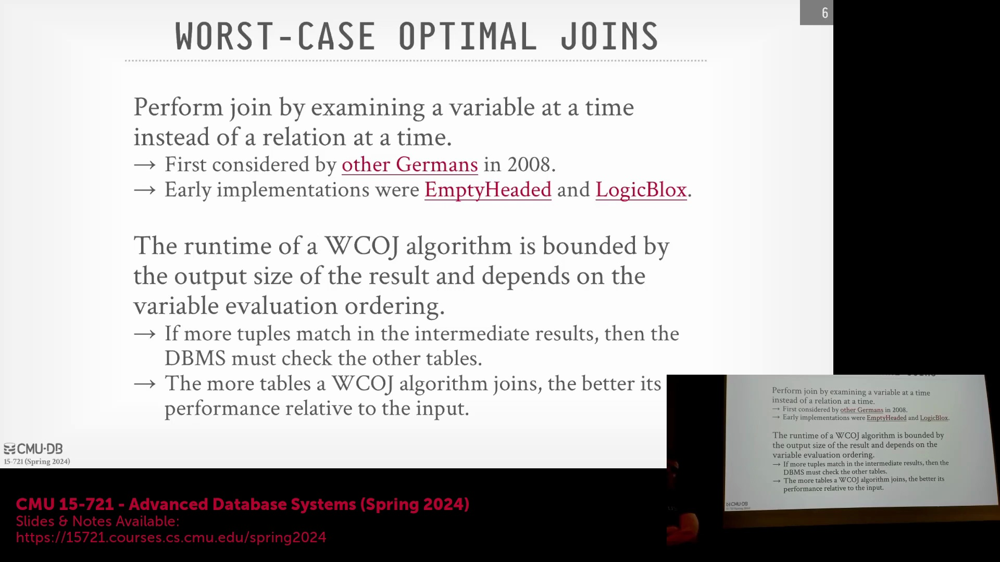
当处理单属性连接(Single-Attribute Join)时，系统往往难以充分发挥 Trie树(Trie Tree)或嵌套哈希表(Nested Hash Table)（如 EmptyHeaded 系统所采用）等高级数据结构的性能优势。尽管在单属性场景下，某些特定算法的计算复杂度仍具优势，但学术文献中探讨的优化技术（如单例优化(Singleton Optimization)与快速下探至叶子节点(Fast Leaf Descent)）在连接操作仅发生于单一层次时通常难以奏效。此外，若中间结果集(Intermediate Result Set)的体积急剧膨胀，此类方法亦无法高效执行，这凸显了在特定场景下采用差异化策略的必要性。

## 属性顺序的重要性
除了传统的表连接顺序（例如，确保 `A JOIN B JOIN C` 遵循正确的执行序列）外，多路连接(Multi-Way Join)还需审慎考量**属性顺序(Attribute Order)**。其核心目标是尽早对属性值进行比较，以准确评估选择率(Selectivity)。通过即时过滤不匹配的数据，系统能够避免冗余计算，并有效防止中间结果集的不必要膨胀。

## 定义“最坏情况最优连接”
“最坏情况最优连接”(Worst-Case Optimal Join)这一概念在数据库领域备受瞩目。该定义源自滑铁卢大学的一位教授，其团队目前正在开发嵌入式图数据库 Kuzu。从形式化角度而言，它描述了一类连接算法，其最坏情况下的运行时间能够与任何连接算法已知的理论下界(Theoretical Lower Bound)相匹配。简言之，当查询模式与数据分布呈现最不利场景（例如，连接条件近似于笛卡尔积(Cartesian Product)）时，该算法的性能将优于其他所有方法。它并非依赖某种“神奇”的对数级加速，而是确保在中间结果可能发生爆炸性增长的情况下，其性能依然优于传统的二元连接(Binary Join)策略。

该术语初看易生歧义；据传，计算机科学家唐纳德·克努特(Donald Knuth)在被问及相关算法时，也曾对其确切含义表示过疑惑。归根结底，此类算法专为应对中间结果大规模膨胀的最坏情况而设计，旨在确保在该极端场景下仍能达到最优性能。

## 行业应用与 SQL/PGQ 标准
目前，仅有极少数生产级系统实现了此类算法。早期的先驱包括 LogicBlox，以及 Umbra 论文中探讨的分析系统，该系统在图遍历(Graph Traversal)操作中采用了早期版本的跳跃哈希连接(Leapfrog Hash Join)。LogicBlox 的核心团队随后创立了 RelationalAI 公司，该公司基于 Julia 语言继续深耕此项技术，在关系型引擎之上集成了更新版本的跳跃连接算法。

随着官方 SQL 标准近期引入 **SQL/PGQ**(Property Graph Queries) 扩展，相关研究的重要性日益凸显。该扩展允许用户在关系表上定义属性图(Property Graph)，并直接在 SQL 中执行模式匹配(Pattern Matching)或图遍历，其设计深受 Cypher 等图查询语言启发。尽管目前仅 Oracle 等少数主流厂商提供支持，但预计在未来五年内，该标准将在 OLAP(Online Analytical Processing) 系统中获得广泛采用。而高效执行此类图遍历操作，其底层核心正是最坏情况最优连接算法的实现。

## 跳跃字典树连接（Leapfrog Trie Join）的实现细节
跳跃字典树连接(Leapfrog Trie Join)构成了多路连接的基础实现范式。该算法假设数据已预先排序，或在执行前针对连接键(Join Key)即时构建了索引或Trie树。在现代处理 Parquet 等列式存储格式的系统（数据通常无序，且未原生维护外部元数据结构(Metadata Structure)）中，这些Trie树需预先计算并独立加载，或在数据扫描阶段动态构建。以 Umbra 为代表的系统通过引入惰性求值(Lazy Evaluation)与惰性物化(Lazy Materialization)机制来优化该流程，从而规避全量顺序扫描(Sequential Scan)及完整索引构建所带来的高昂前期开销。

在该架构中，参与连接的每张表均维护独立的Trie树，且树中的每一层级严格对应连接键中的某一特定属性。这种层次化组织使得高效的多维匹配成为可能，同时避免了物化(Materialization)庞大中间元组(Intermediate Tuple)的开销。

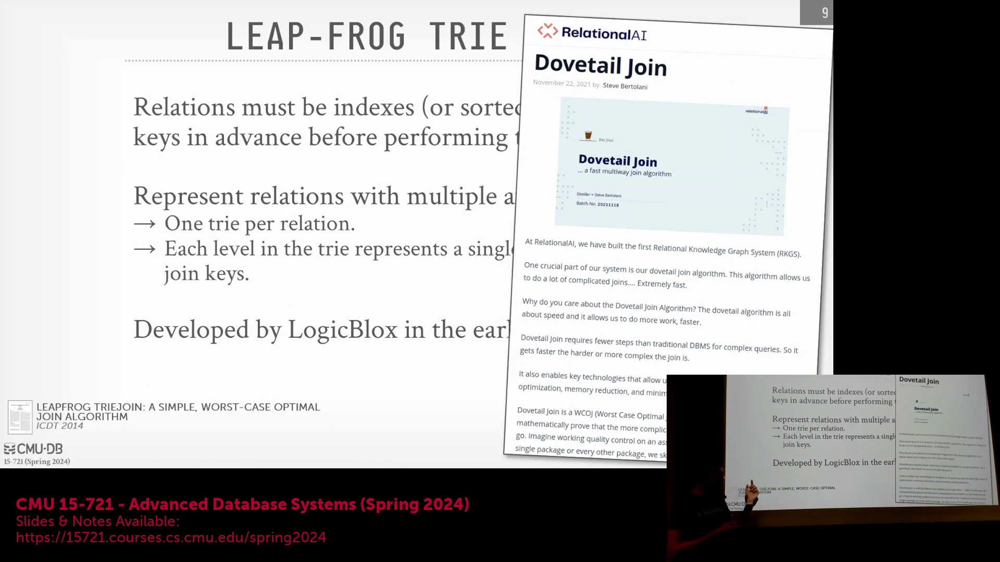
此外，RelationalAI 还推出了该概念的演进版本——**燕尾连接(Dovetail Join)**，据称其性能已超越初代的跳跃哈希连接。尽管目前公开的详细技术文档有限，但该算法代表了工业界持续优化多路连接机制的不懈探索。

## 迭代策略与燕尾连接（Dovetail Join）
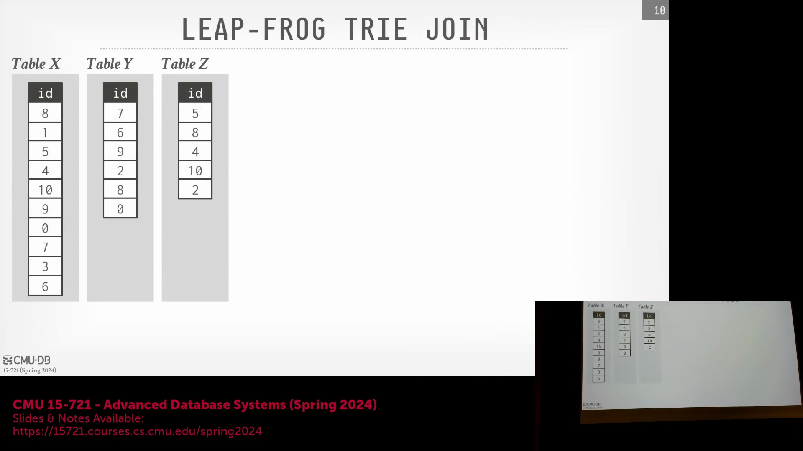
此类算法的核心机制在于：首先对数据进行排序或建立索引，随后利用同步迭代器(Synchronized Iterators)并发遍历所有参与连接的表。系统通过交叉比对各迭代器指向的属性值，即可高效识别匹配项。其关键在于，得益于数据的有序性，算法在执行过程中完全无需对连接键进行回溯(Backtracking)。一旦发现值不匹配，迭代器仅需向前跳跃(Skip)至下一个潜在相关值，直接跳过无关条目，从而始终保持最优的时间复杂度。

## 逐步连接示例演示
为阐明上述机制，现以三个表（`X`、`Y`、`Z`）在单一属性上进行连接为例。初始状态下，各表的迭代器均指向其首元素（例如，`X` 指向 0，`Y` 指向 0，`Z` 指向 2）。算法首先比对各迭代器当前的顶层值，识别出当前最小值（0）小于其他迭代器指向的最大值（2）。鉴于 0 绝不可能与 2 匹配，`X` 的迭代器将向前跳跃，定位至首个大于或等于 2 的值（本例中为 3）。

此比对与跳跃过程将在各表迭代器间循环执行。每当任一迭代器发生跳跃，算法便会立即重新评估各指针的值。若此时某表迭代器仍指向 0，而其他迭代器已分别指向 2 和 3，该迭代器同样会跳跃至 ≥ 3 的下一个有效值。这种同步的“跳跃”机制确保系统仅当所有迭代器严格对齐至同一数值时，才暂停跳跃并输出匹配元组。该设计从根本上消除了冗余的比较操作与中间物化(Intermediate Materialization)开销。

---

## 继续跳跃连接迭代
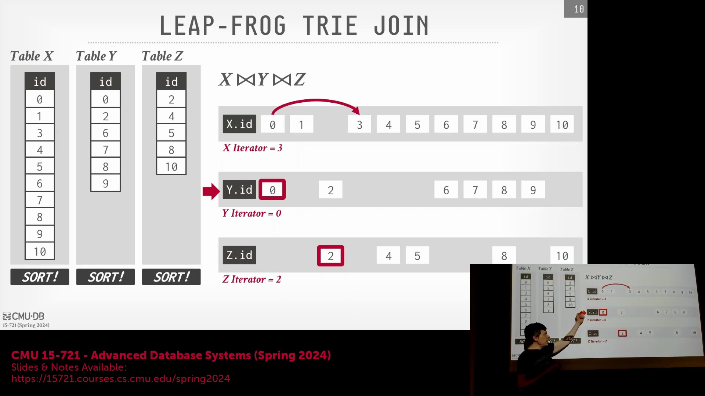
跳跃机制通过同步多张表的迭代器(Iterator)位置得以持续推进。若某迭代器指向的值严格小于其他迭代器指向的最大值，系统即可判定该位置无法产生匹配。此时，迭代器无需执行低效的线性扫描(Linear Scan)，而是直接“跳跃”(Skip)至大于或等于该最大值的下一个有效值。该过程循环往复，直至所有迭代器精确对齐至同一数值，从而确认匹配项。尽管其概念直观清晰，但要高效执行此类跳跃操作，仍需依赖专门设计的底层数据结构(Underlying Data Structure)。

## 针对数据库的 Trie 树适配

为支持快速跳跃与多维匹配(Multi-Dimensional Matching)，该算法核心依赖于 **Trie树(Trie Tree)**（发音为 "try"），该术语最初由卡内基梅隆大学教授 Edward Fredkin 提出。有别于传统字符串Trie树将单词逐层拆分为单一字符或数字，数据库系统对此结构进行了针对性改造：每个节点直接存储完整的属性值(Attribute Value)。Trie树的每一层级严格对应连接键(Join Key)中的特定属性。系统会剔除给定属性的重复值，并通过指针(Pointer)进行分支，以映射后续属性的唯一子值(Unique Child Values)。
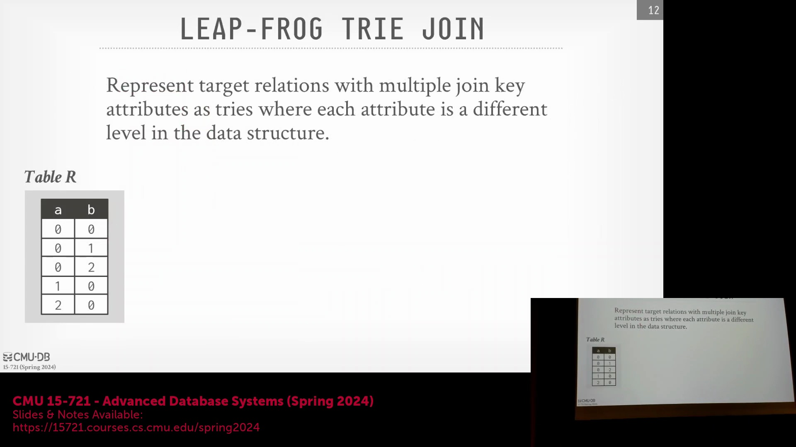

## Trie 树构建与属性映射
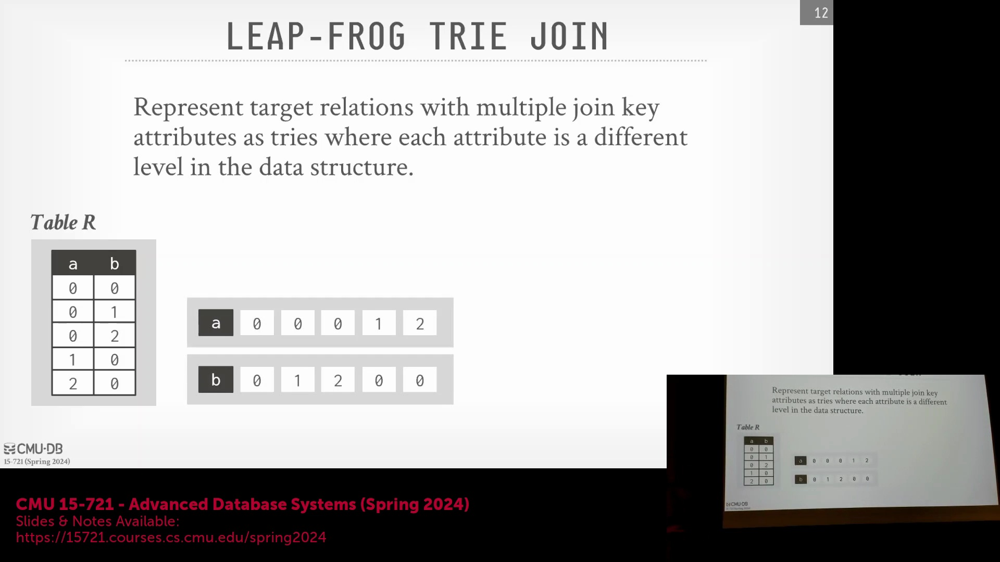
为便于可视化(Visualization)，Trie树通常采用水平布局进行展示。从根节点(Root Node)出发，第一层节点由初始属性的唯一值（如属性 A）填充。随后，从每个 A 节点延伸出的边(Edge)将用于存储第二属性（如属性 B）的对应唯一值。此种层次化模式(Hierarchical Pattern)将逐级延伸，直至连接键中的所有属性均被映射完毕。
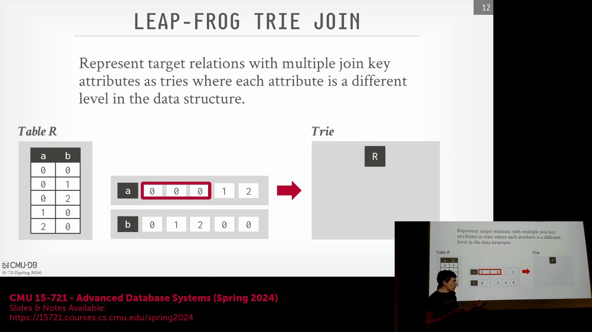
核心在于，共享同一父节点的所有值在叶子层级(Leaf Level)必须保持严格的排序顺序。该有序特性对于在连接执行阶段实现高效的顺序求交(Sequential Intersection)至关重要。

## 执行多路连接示例
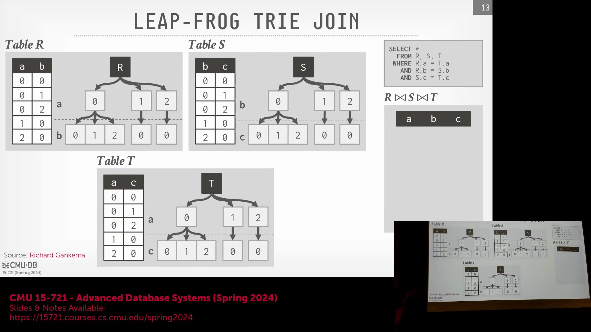
现以对三张表（R、S、T）执行连接为例，连接条件为 `R.a = T.a`、`R.b = S.b` 及 `S.c = T.c`。查询优化器(Query Optimizer)首先确立全局属性求值顺序(Global Attribute Evaluation Order)（A → B → C）。执行流程自 R 表的 Trie 树根节点起步，定位首个 A 值（例如 0）。该值随即用于探测(Probe) T 表的 Trie 树；若存在匹配的 `T.a = 0`，算法便继续推进。随后，流程下探至 B 层级。R 表的 B 值（例如 0）将探测 S 表的 Trie 树以寻找匹配的 `S.b`。一旦在目标表间确认了 A 与 B 的匹配关系，系统即抵达最终层级（C）。此时，迭代器将遍历 S 与 T 表中的 C 值并计算其交集(Intersection)，进而结合已知的遍历路径（A=0, B=0 及匹配的 C）重构结果元组(Result Tuple)。该过程将系统性地遍历特定 A 值下的所有 B 值，随后回溯(Backtrack)以处理下一个 A 值，循环往复直至穷尽所有有效组合。

## 属性求值顺序的限制
在此架构下，一项严格的约束在于：Trie树的层级结构必须与查询优化器所确定的全局求值顺序(Global Evaluation Order)精确对齐。即便某张表缺失部分连接属性，其 Trie 树亦不可任意重排层级（例如，若优化器指定顺序为 A → B → C，则绝不可将 C 置于 B 之前）。在多路探测(Multi-Way Probing)与求交循环中，强制所有表专属的 Trie 树遵循统一的遍历顺序(Traversal Order)，是维持各迭代器同步的强制性要求。

## 性能权衡：预计算与动态构建

该策略的落地引入了显著的架构权衡(Architectural Trade-off)。以 EmptyHeaded 论文提出的方案为例，其主张在查询执行前预先计算并物化(Materialize)所有潜在连接顺序的 Trie 树。然而，正如 Umbra 论文所指出，当面对海量数据集(Large-Scale Dataset)（含数十亿元组）或需支持增量更新(Incremental Update)的系统时，此做法将变得极为低效且脱离实际。无论是从磁盘加载预物化的结构，还是为每次查询全盘重建，均会产生难以承受的性能开销。因此，现代数据库系统更倾向于采用动态构建策略，结合惰性求值(Lazy Evaluation)与惰性物化(Lazy Materialization)技术，仅在连接执行过程中按需动态生成数据结构中必需的部分。

---

## 动态属性排序的挑战

为每一种可能的属性排序预计算并物化连接结构(Join Structure)是极低效的。尽管查询初始可能具备最优的属性求值顺序(Attribute Evaluation Order)（例如 `A → D → C`），但引入不同的 `WHERE` 子句或过滤谓词(Filter Predicates)将彻底颠覆最优的连接执行顺序。若要在运行时动态适应此类查询变更，并在执行前物化所有可能的组合，将带来难以承受的存储与计算开销，致使静态预计算(Static Precomputation)在实际工作负载(Practical Workloads)中变得完全不切实际。

## 多路连接中嵌套哈希表的缺点
作为替代方案，斯坦福大学的 EmptyHeaded 系统提出采用嵌套哈希表(Nested Hash Table)来替代Trie树。然而，在多路连接(Multi-Way Join)的语境下，该策略因涉及重复的哈希查找(Hash Lookup)与冲突解决(Collision Resolution)开销，导致执行成本显著攀升。每次查找均需执行键值比较(Key-Value Comparison)并维护额外指针以处理冲突，这严重破坏了内存访问的空间局部性(Spatial Locality)。此类随机的内存跳跃(Random Memory Jumps)极易引发 CPU 缓存抖动(Cache Thrashing)，彻底瓦解了传统二元哈希连接(Binary Hash Join)所依赖的数据局部性(Data Locality)。此外，处理变长字符串(Variable-Length Strings)通常需依赖字典编码(Dictionary Encoding)，这在深层数值比较阶段会引入额外的间接寻址(Indirection)与查找开销。

## 基于哈希的跳跃字典树连接
为突破上述架构瓶颈，Umbra 研究团队提出了一种优化版跳跃字典树连接(Leapfrog Trie Join)，其核心在于存储属性的 **64位哈希值(64-bit Hash Value)** 而非原始数据本身。通过将所有连接键统一规范化为固定长度的64位整数，系统在遍历过程中彻底消除了类型检查(Type Checking)、条件分支逻辑(Branch Logic)及字典间接寻址(Dictionary Indirection)。该设计实现了“基于数据统一性的代码特化(Code Specialization)”，使得初始比对成本极低，算法无需加载实际数据即可快速过滤(Fast Filtering)不匹配的元组。尽管哈希冲突(Hash Collision)理论上可能引发误报(False Positives)，但采用 MurmurHash 或 xxHash 等高鲁棒性(Robust)哈希函数可将该风险降至极低。任何残余冲突均会在叶子层级(Leaf Level)通过最终且精确的元组比较(Tuple Comparison)予以安全消解。
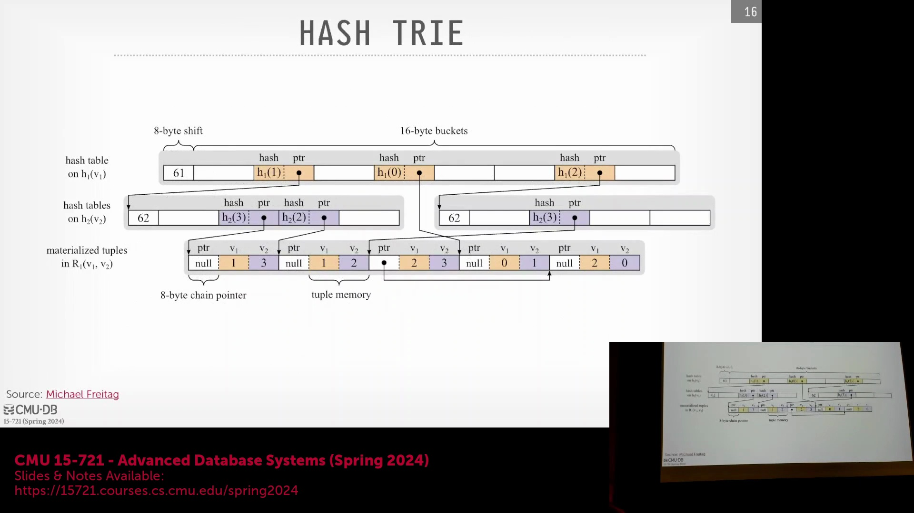

## 指针标记与嵌入式元数据
真正的性能飞跃源于系统对指针(Pointer)的存储与管理机制。得益于 x86-64 架构仅使用 48 位进行物理内存寻址(Physical Memory Addressing)的特性，系统巧妙地在每个 64 位指针的高位未使用区域（16位）中嵌入了关键的遍历元数据(Traversal Metadata)。此紧凑架构(Compact Architecture)包含以下核心标志：
- **单元组标志位(Single-Tuple Flag)**：标识该路径是否直接指向单一叶子节点，且中途无任何分支。
- **扩展标志位(Expansion Flag)**：用于指示子节点是否已分配物理内存，从而支撑惰性物化(Lazy Materialization)机制。
- **链长计数器(Chain Length Counter, 14-bit)**：精确记录叶子层级预期的元素数量，使引擎得以动态推算节点大小，无需额外维护独立的元数据头(Metadata Header)。
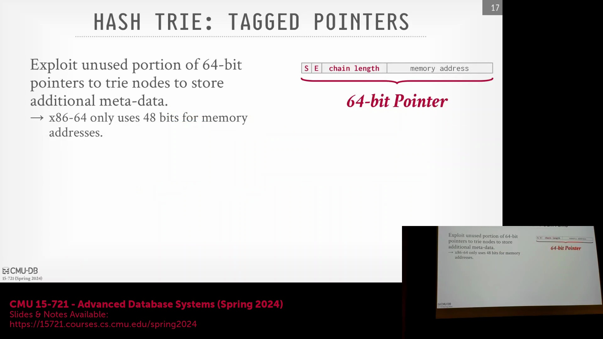

## 单元组快速路径与惰性物化
随着遍历深入Trie树，哈希表规模通常逐渐收敛，极易出现中间节点仅含单一子条目(Single Child Entry)的路径。系统无需为此类单子节点(Single-Child Nodes)分配并遍历冗余的哈希桶(Hash Buckets)，而是借助内嵌的单元组标志位开辟一条“快速路径(Fast Path)”。指针将动态绕过所有中间层级，直接跳转至底层叶子节点(Leaf Node)。结合惰性扩展机制(Lazy Expansion)（即子节点仅在首次访问且扩展标志位触发时才进行物化），该优化大幅削减了内存占用(Memory Footprint)，将初始化延迟(Initialization Latency)降至最低，并确保最坏情况最优连接算法(Worst-Case Optimal Join Algorithm)在分析型查询(Analytical Query)执行中持续保持极致性能。

---

## Trie(字典树)结构与延迟构建(Lazy Construction)概念
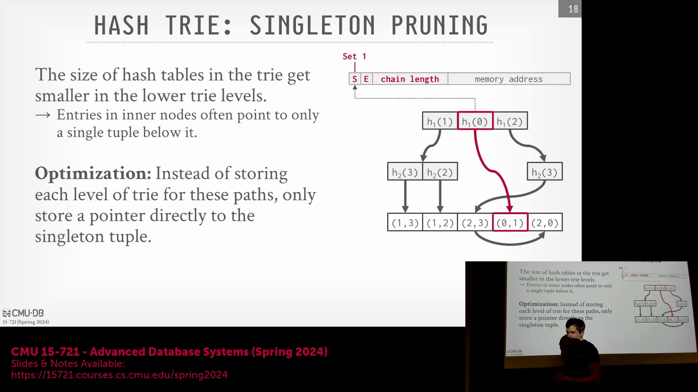
本节首先阐述了一种统一控制机制如何应用于 Trie(字典树) 结构的任意层级。在遍历过程中，系统依赖一个扩展位(Expansion Bit)来决定路径走向。若该位指示无需进一步展开，算法将直接跳转至底层叶节点。该设计确保了内存与结构开销仅在确有需要时才会产生，避免了前期预先分配整棵树所带来的资源浪费。

## 按需节点分配(On-Demand Node Allocation)机制
该优化的核心在于延迟物化(Late Materialization)。与传统在连接操作前预先填充完整 Trie(字典树) 的方法不同，该策略在初始阶段仅构建根节点与底层叶节点元组。在执行连接操作时，若无需对中间路径进行比较，系统便会跳过这些节点的实例化过程。当查找操作遍历至扩展位(Expansion Bit)为 0 的路径时，算法会快速下探至底层，扫描叶节点链表(Leaf Linked List)以寻找匹配项，随后按需动态分配缺失的中间节点。待中间节点填充完毕后，节点指针将更新为指向底层链表的特定区段，同时扩展位被置为 1，以告知后续遍历该路径已完全展开。

## 多路连接(Multi-way Join)中的内存效率
这种延迟分配策略有效缓解了在涉及三张及以上大表进行多路连接时所面临的严重内存压力。为所有参与连接的数据集预先构建完整的哈希表(Hash Table)或 Trie(字典树) 结构往往代价高昂，尤其是在处理 TB 级数据时。通过将结构创建推迟至绝对必要时，系统最大限度地避免了因遍历未实际使用路径而引发的存储与内存激增(Memory Explosion)。初始数据遍历阶段负责完成哈希计算并构建基础链表，从而确保后续连接操作能够高效扩展，避免在前期遭遇资源瓶颈。

## 真实世界图数据集上的性能评估
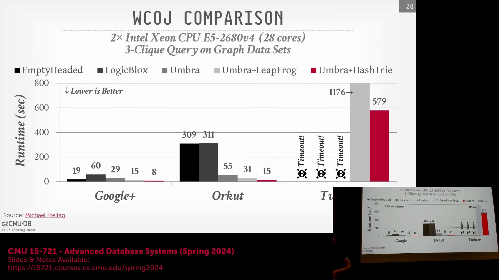
与 EmptyHeaded、LogicBlox 和 Umbra 等系统的基准对比突显了该方法的实际优势。在高度互联的社交图数据集（如 Google+、Orkut 和 Twitter）上计算三元环(Triangle)时，传统的预构建数据结构常因内存过度分配而导致查询超时。相比之下，延迟物化(Late Materialization)通过避免不必要的节点实例化，有效规避了这些性能瓶颈。测试结果表明，Umbra 的 HashTrie(哈希字典树) 性能显著优于 Leapfrog Triejoin(蛙跳字典树连接)，尤其是在中间结果集可能迅速膨胀的稠密图(Dense Graph)环境中。

## 自适应连接策略选择
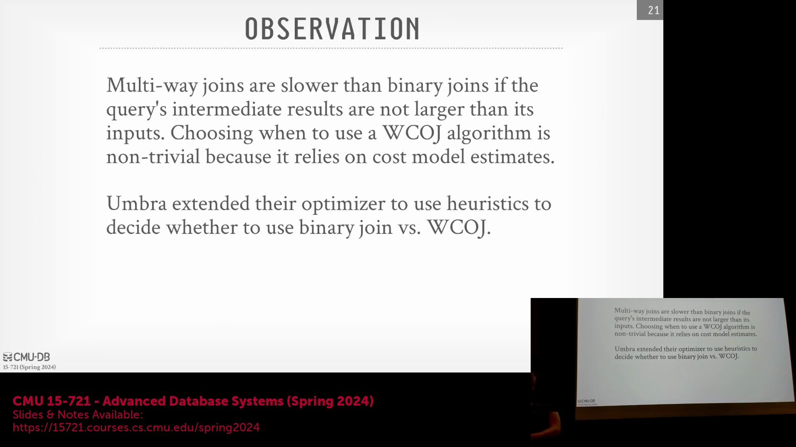
尽管多路连接具有显著优势，但对于 TPC-H 等中间结果不会急剧膨胀的标准工作负载(Workload)，二元连接(Binary Join)依然表现高效。最优的查询执行方案要求数据库系统能够根据查询特征动态切换连接策略。现代查询优化器利用启发式规则(Heuristics)与收集的系统统计信息(Statistics)，动态评估针对特定查询计划采用多路连接还是二元连接能获得更优性能。这种自适应能力确保系统仅在确需抑制中间结果膨胀时才启用多路连接；而对于标准的外键-主键关系，则默认采用高效的二元连接。

## 将图查询扩展集成到关系型系统中
荷兰国家数学与计算机科学研究中心(CWI)的最新研究表明，关系型数据库可通过复用数十年的 RDBMS(关系型数据库管理系统) 优化经验，高效支持 SQL/PGQ(属性图查询) 扩展。许多专用图数据库通常依赖较为低效的顶点与边存储模型，反而忽略了经过长期实践验证的关系型技术进展。通过集成向量化执行(Vectorized Execution)、高级查询优化与最坏情况最优连接(Worst-Case Optimal Join)算法等技术，传统关系型系统的性能已能够超越原生图数据库平台。这一范式转变表明，应直接将成熟的关系型基础设施应用于图查询工作负载，而非依赖本质上存在局限的专用图存储引擎。

---

## 图数据库优化与因子化技术

现有的图数据库在很大程度上未能采纳向量化执行(Vectorized Execution)和数据压缩(Data Compression)等现代关系型数据库(Relational Database)的优化进展，而是选择了独立发展的路径，这使其面临被传统系统超越的风险。为了专门解决图查询(Graph Query)和三角查询(Triangle Query)中常见的中间结果(Intermediate Result)“急剧膨胀”问题，可以应用一种名为**因子化（Factorization）**的高效优化技术。 

与因子化收益甚微的二元连接(Binary Join)不同，该技术能够有效避免在复杂连接操作期间重复物化相同的元组。系统不再存储每条冗余记录，而是维护唯一值的紧凑表示(Compact Representation)，并配备专用的计数字段(Count Column)来跟踪元组的出现频率。 

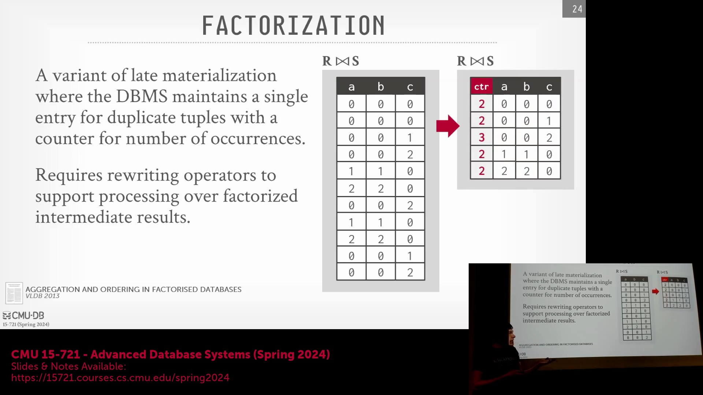
实现该方法需要系统级感知(System-level Awareness)：所有查询算子(Query Operator)必须显式识别因子化数据结构，并在计算过程中正确解析计数字段。尽管该技术目前尚未得到充分利用，但这种直观的优化方案预计将在不久的将来被主流关系型数据库引擎广泛采用。

## 基准测试对比：Neo4j 与关系型系统
近期的学术基准测试(Benchmark)凸显了传统图数据库与配备了图查询扩展(Graph Query Extension)的现代关系型系统之间存在显著的性能差距。一项对比评估针对集成 SQL/PG 支持及最坏情况最优连接(Worst-Case Optimal Join, WCOJ)算法的 DuckDB 扩展版本(DuckDB Extension)、Neo4j 以及采用 `tri-hash` 哈希实现的 Umbra 数据库展开。 

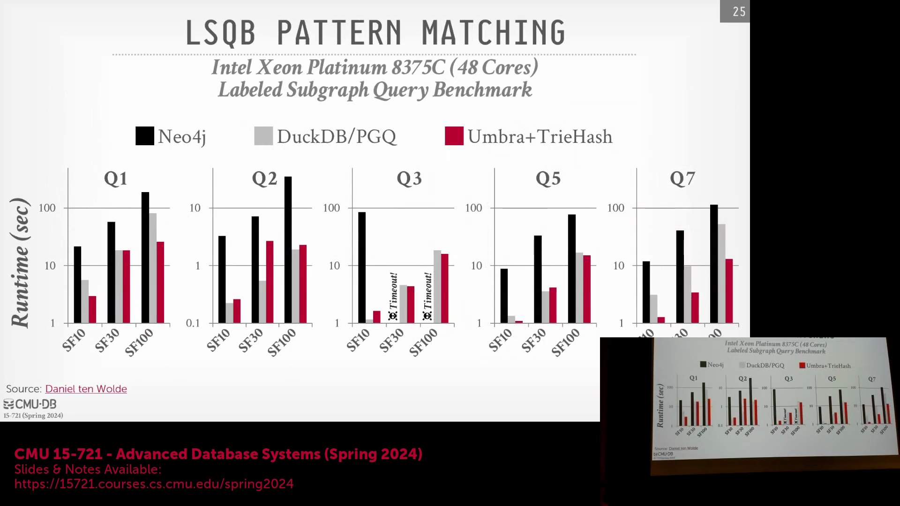
尽管 Neo4j 长期占据市场主导地位、资金充裕，且被广泛视为默认的图数据库解决方案，但在不同规模系数(Scale Factor)的 LDBC (Linked Data Benchmark Council) 基准测试套件中，其表现始终不尽如人意。Neo4j 的架构依赖于通过指针连接的独立顶点(Vertex)与边(Edge)数据结构，这种设计难以匹敌现代列式(Columnar)及关系型系统所具备的缓存友好(Cache-Friendly)、向量化执行以及针对连接优化的执行流水线(Execution Pipeline)。

## 未来研究与 SQL/PG 标准化
图查询优化仍是一个高度活跃的研究领域。尽管目前仅有少数系统完全支持最坏情况最优连接算法，但该特性正迅速普及。近期的学术成果（如伦敦大学学院(UCL)研发的 `Sonic Join`）展现了持续的性能优化，其表现已超越传统的 `Hash-Trie` 连接方法。 

历史上，工业界实现通常比学术研究滞后三至五年，但 SQL/PG 图查询扩展的持续标准化正加速其工程落地。随着主流关系型数据库逐步集成这些高级图处理能力，市场对专用独立图数据库的实际需求预计将持续缩减。

## 课程安排与项目展示
接下来的课程将聚焦于项目演示，定于周三进行。为确保公平，每个团队将严格分配五分钟的展示时间，且演示顺序将与上一次会议相反。 

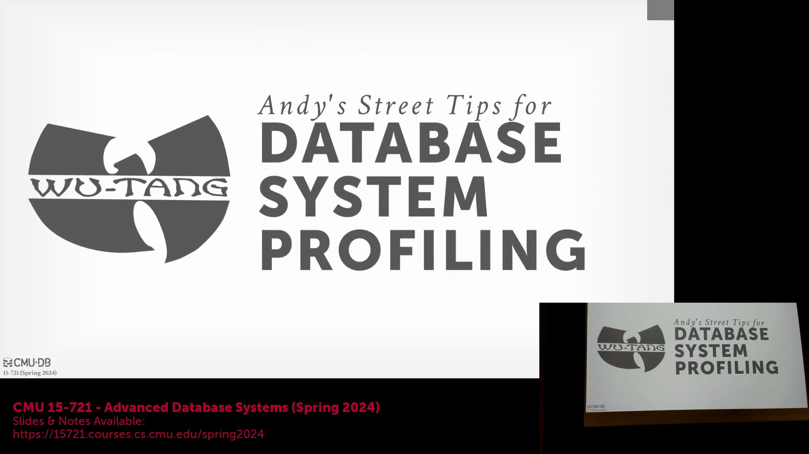
为提供结构化且具可操作性的反馈(Structured and Actionable Feedback)，所有演示均将在讲师的笔记本电脑上进行本地录制(Local Recording)。录像将严格保密，不会对外公开。讲师将在周末审看录像，并向各团队提供详细的评估反馈。

## 系统性能分析基础与阿姆达尔定律
进入系统性能剖析(System Profiling)阶段，理解如何识别瓶颈并确定优化优先级至关重要。一种基础的手动剖析技术是在 GDB 等调试器(Debugger)中运行程序，通过反复中断执行来记录调用栈(Stack Trace)中的活跃函数。如果某个特定函数（如 `foo`）在 10 次随机采样中断(Sampling Pause)中出现了 6 次，则表明该程序约 60% 的运行时间都消耗在该例程上。

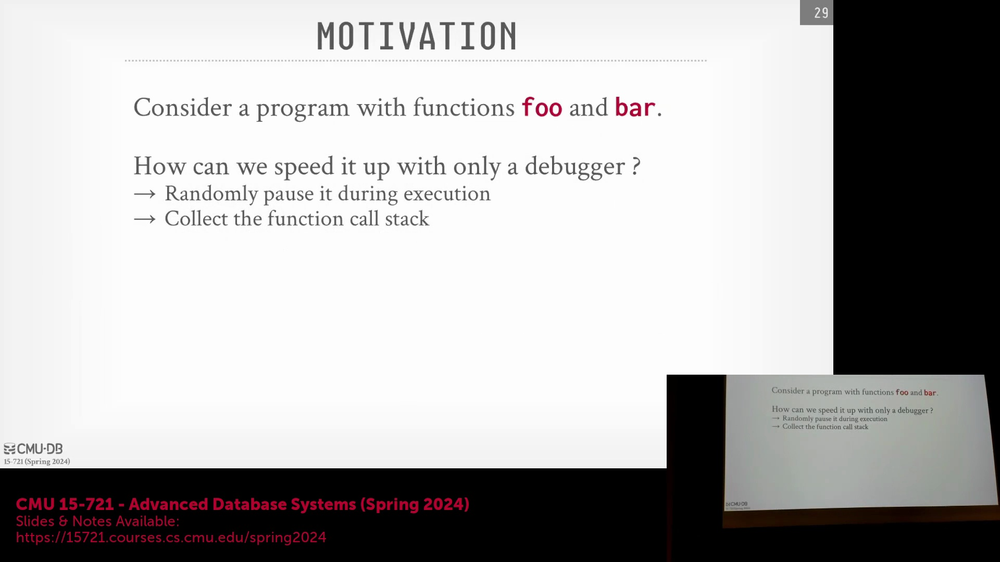
这一观察结果直接关联至**阿姆达尔定律（Amdahl's Law）**，该定律用于量化仅优化系统局部组件时所能获得的理论最大加速比(Speedup)。例如，若一个占用 60% 执行时间的函数被优化至运行速度翻倍，整个系统的加速比上限也仅约为 1.4 倍。这一数学原理对开发人员合理评估优化工作的收益边界至关重要。

## 高级性能分析工具：Valgrind 与 Perf
现代性能剖析主要依赖两大工具生态：Valgrind 与 Perf。Valgrind 基于重量级二进制插桩(Heavyweight Binary Instrumentation)运行，将计时器与跟踪机制注入用户空间(User Space)的执行流中。它提供详尽的分析报告，并内置专用工具集，如用于检测内存泄漏的 `Memcheck`、用于剖析函数执行耗时的 `Callgrind`，以及用于跟踪堆内存(Heap Memory)动态分配的 `Massif`。

另一方面，Perf 已成为当代性能剖析的事实标准工具。它通过直接与 CPU 硬件性能计数器(Hardware Performance Counters)交互，有效规避了重量级的插桩(Instrumentation)开销。这些计数器原生追踪底层硬件指标，例如 L1/L2/L3 缓存未命中(Cache Miss)、分支预测失败(Branch Misprediction)、每指令周期数(Cycles Per Instruction, CPI) 以及总指令数(Total Instructions)。在编译时包含调试符号(Debug Symbols)的前提下，Perf 能够将此类硬件级统计信息直接映射至源代码的具体行号，使开发人员无需承受传统插桩的性能损耗，即可获取关于性能瓶颈的精确洞察与优化指导。

---

## 调用图可视化与函数分析

性能剖析工具(Profiling Tools)能够直观地可视化程序的执行流程。通过它，你可以一览所有函数，追溯其调用方(Caller)，并统计每个函数的调用次数。该工具还会计算各函数所占的总执行时间百分比，从而呈现代码库不同区域的时间消耗分布。当程序调用缺乏调试符号(Debug Symbols)的预编译库(Precompiled Libraries)时，剖析器可能仅显示库名称和内存地址。为获取更详尽的信息，建议自行编译这些依赖库。此外，调用图(Call Graph)视图支持你深入钻取特定函数，以查看更细致的执行信息。

## 剖析开销与时间测量失真
像 Callgrind 这类工具会在程序运行期间动态生成剖析信息(Profiling Information)。由于它们在用户态运行，无需特殊硬件权限，但会对目标代码进行大量插桩(Instrumentation)，因此会显著拖慢执行速度。受此影响，与标准运行相比，挂钟时间(Wall-Clock Time)的测量结果可能会出现严重失真。这种性能损耗会深刻改变并发代码的行为：原本存在的竞态条件(Race Conditions)可能因时序变化而消失，或者因程序执行节奏被大幅打乱，暴露出人为引入的异常问题(Artifacts)。

## 使用 `perf` 进行硬件级剖析
一种更高效的替代方案是使用 `perf` (Linux Profiler)。该工具通常需要 `root` 权限以访问底层的硬件性能计数器(Hardware Performance Counters)。你可以配置 `perf` 按固定的时钟周期(Clock Cycles)间隔进行采样，灵活调整事件监控频率与跟踪粒度。与高开销的插桩工具不同，`perf` 能让程序以接近原生速度运行。需要注意的是，它会持续将剖析数据写入转储文件(Dump File，如 `perf.data`)，这可能会对磁盘 I/O(Disk I/O)敏感型应用产生轻微干扰，但整体开销仍远低于传统的 Callgrind 类剖析器。

## `perf report`、火焰图与第三方工具

程序运行结束后，执行 `perf report` 命令将生成一份排序清晰的可视化视图，精准定位程序耗时最多的代码区域。只要在编译时保留了调试符号(Debug Symbols)，你即可深入各个函数，逐行审查代码执行热点(Hotspots)。借助 `hotspot` 或火焰图(Flame Graph)生成器等第三方可视化工具，这些抽象数据将变得直观易懂，瓶颈所在一目了然。此外，你可以指示 `perf` 采集特定的硬件指标，例如 CPU 时钟周期(CPU Cycles)、末级缓存未命中(Last-Level Cache Misses)及 CPU 利用率。针对 Rust(Rust) 开发者，`cargo flamegraph` 可与 `perf` 无缝集成以生成高保真火焰图，但访问硬件计数器仍需配置相应的权限或环境变量。

## 优化特定函数与问答环节

当某个特定函数占据绝大部分执行时间时，`perf report` 支持将其隔离，以便进行行级(Line-level)性能数据分析。这有助于快速定位低效模式，例如频繁的内存分配(Memory Allocation)或异常的控制流路径(Control Flow)。相较于传统剖析器，`perf` 的核心优势在于它能揭示函数 *为何* 运行缓慢——通过追踪硬件级事件（如缓存行为、TLB 未命中(TLB Misses)、指令周期(Instruction Cycles)），而非仅仅统计 *耗时*。为避免生成海量冗余数据，可采用定向剖析技术，例如设置内核探针(Kernel Probes)或函数入口/出口钩子(Function Entry/Exit Hooks)，仅在关键代码段采集指标。最佳实践是：先定位高层级瓶颈，再逐层下钻以剖析底层的硬件限制。

## 管理编译器优化与汇编代码检查

高级编译器优化(Compiler Optimization，如 `-O3`)会激进地执行函数内联(Inlining)或死代码消除(Dead Code Elimination)，这给传统调试与剖析带来了挑战。需注意，调试符号的生成与优化标志(Optimization Flags)是相互独立的。为防止编译器重写或优化掉待剖析的目标函数，可显式添加 `noinline` 等编译器属性(Attribute)。现代剖析工具支持并排展示原始源代码与对应的汇编代码(Assembly Code)，使开发者能够直观验证优化器的代码转换逻辑。直接审查汇编输出，通常是理解高级编译优化如何影响性能表现的最可靠途径。

## 课程总结与结束语

本次关于性能剖析(Performance Profiling)与硬件计数器(Hardware Counters)的技术讲解至此告一段落。下节课将主要安排学生项目展示(Student Presentations)，请务必在课前提交所有演示幻灯片(Project Slides)与项目文档。 

聊些轻松的话题，请大家尽情享受二月里这反常的暖阳。无论是前往健身房进行力量训练，还是课后放松休憩，都请注意劳逸结合、把握节奏。 

祝大家身体健康，记得多补充水分。我们下节课再见！

