## UDF 区域处理与查询优化
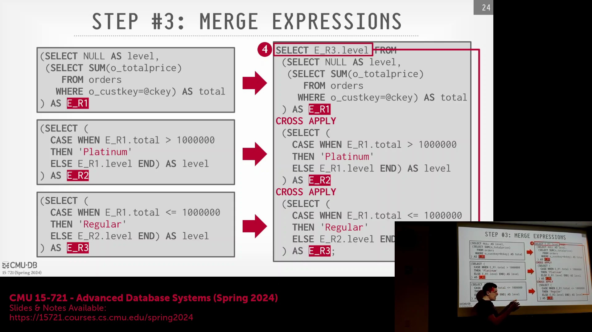
在此展示不同区域(Regions)的示例中，用户定义函数(User-Defined Function, UDF)可能包含任意逻辑，这些逻辑往往无法通过单一的 `CASE WHEN` 语句来表达。然而，一旦UDF以其结构化形式传递给查询优化器(Query Optimizer)，优化器便能分析各个 `CASE` 分支并识别出互不相交的区域。由于优化器已具备处理 `WHERE` 子句的能力，它能够智能地将这些互斥区域合并，从而免去了开发人员编写冗长代码的负担。

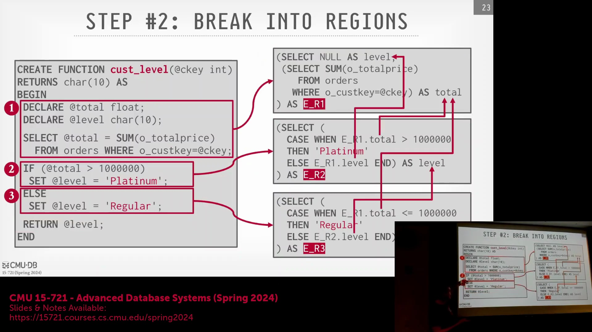
参考相关研究（即 Froid论文(Froid)）可知，将 SQL 转换为中间表示(Intermediate Representation, IR)的过程变得清晰明了。这种IR与传统编译器(Compiler)及编程语言处理中使用的表示形式类似，其目标是将UDF逻辑转换为数据库查询优化器能够原生理解并直接操作的格式。

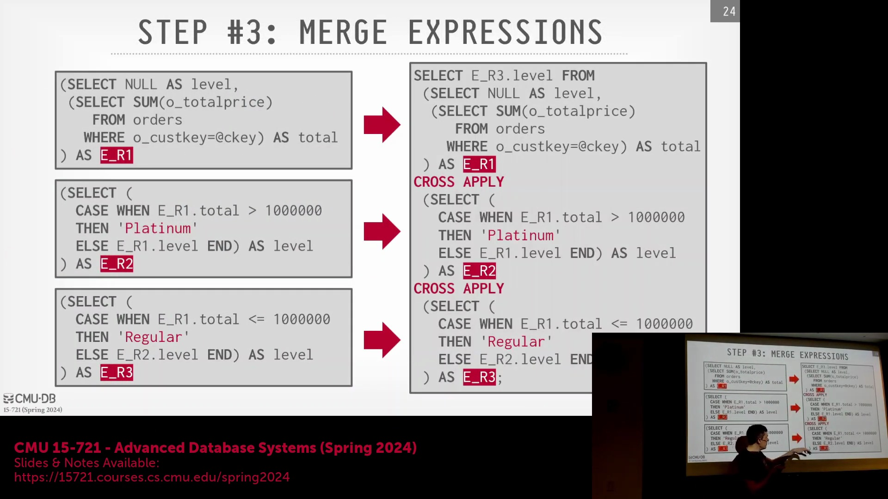

## SQL 转换与表达式内联
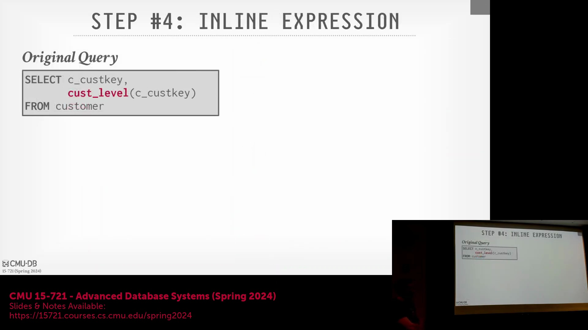
下一步是将UDF表达式实际内联(Expression Inlining)至原始调用查询中。当UDF调用出现在客户记录级别时，该调用会被完整替换为转换后的UDF代码块。此转换将函数调用扁平化为关系代数(Relational Algebra)表达式，使得优化器能够直接对其进行处理。

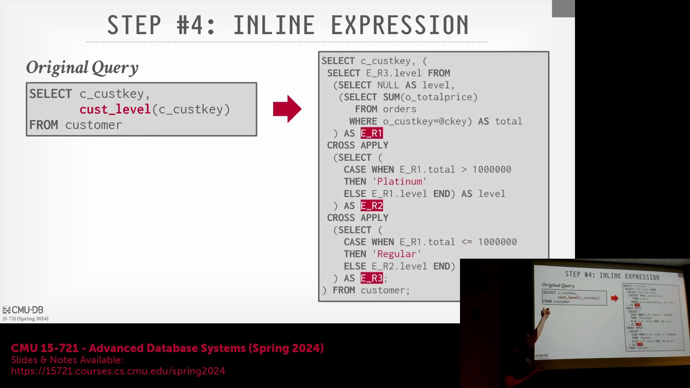

## 处理覆盖逻辑与查询简化
为演示优化器如何处理控制流(Control Flow)，考虑以下场景：`ELSE` 子句被移除，或修改为始终将某字段设置为特定值（例如 `'regular'`）。即使用户编写的逻辑在表面上看似存在冲突或覆盖了先前的赋值，查询优化器也必须能够推断出：无论控制流经过哪些中间分支，最终值都将被确定性地覆盖。 

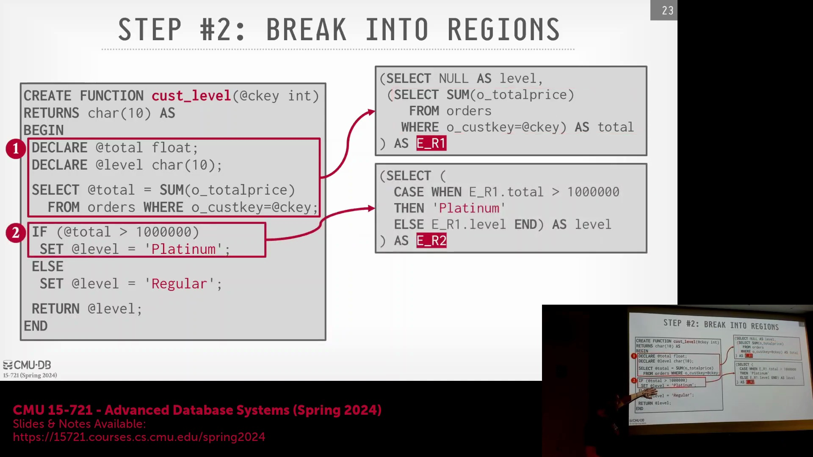
若逻辑无条件地规定 `SET level = 'regular'`，原始的 `CASE WHEN` 结构实际上将被剥离。优化器会识别出中间计算（如 `ER2 level` 或 `ER3 level`）是冗余的，因为它们最终都会被常量赋值覆盖。随后，优化器将执行计划简化为 `SELECT 'regular' AS level`，从而彻底消除无效的控制流。

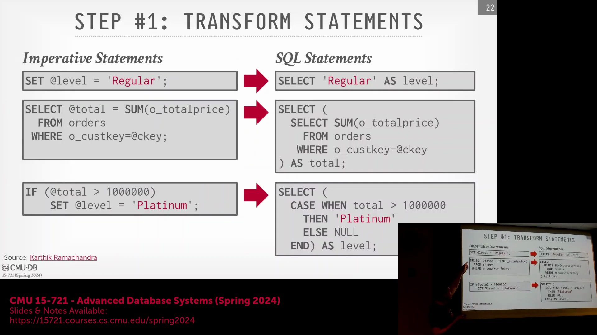

## 连接转换与执行流程
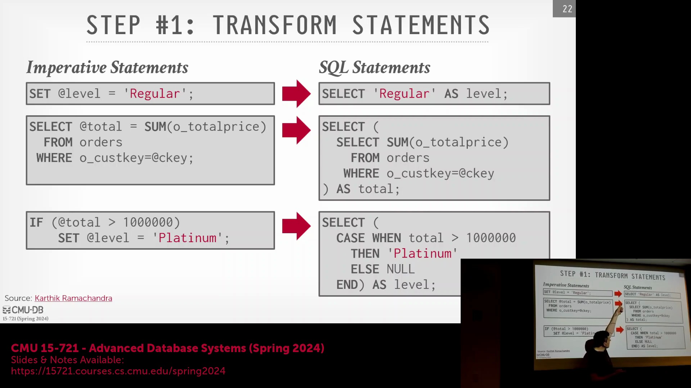
当转换后的查询传递给诸如 SQL Server 等高级查询优化器时，`CROSS APPLY` 等复杂结构会被简化为标准的左外连接(Left Outer Join)操作。此时，数据库引擎不再将UDF视为黑盒(Black Box)，而是能够识别出 `customer` 表与 `orders` 表之间存在的隐式连接。

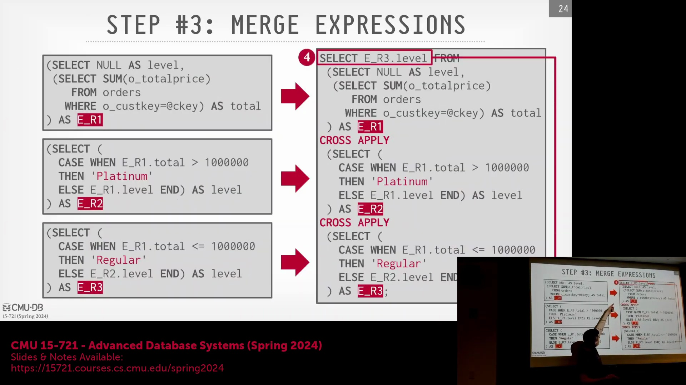
生成的执行计划(Execution Plan)将遍历每条客户记录，并与订单表执行左外连接以计算聚合值（例如购买的商品总数）。若客户无订单，结果将正确返回 `NULL`。该方法使优化器能够采用哈希连接(Hash Join)等高效算法，彻底取代了逐行执行函数的低效方式。

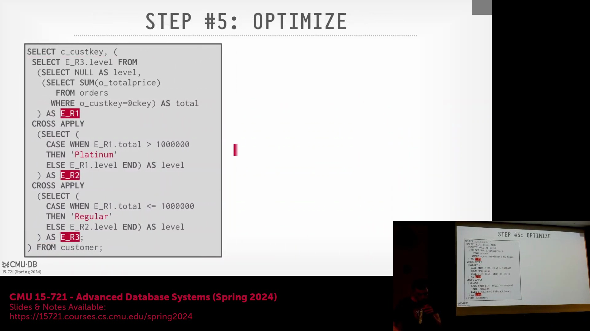

## 并行化与类编译器优化
由于UDF不再是黑盒，查询得以实现完全并行化(Parallelization)。记录间的函数调用不再存在异常的数据依赖关系，从而允许多个线程并发处理数据。此外，该方法消除了为每条记录维护调用栈(Call Stack)所带来的函数调用开销。 

该架构的一大优势在于，无需对查询优化器本身进行底层工程改造。由于优化器本就精通标准 SQL 查询的优化，它能够自动将数十年来积累的优化技术直接应用于已内联的UDF代码，既不会引入性能退化(Performance Regression)，也无需编写定制化补丁。

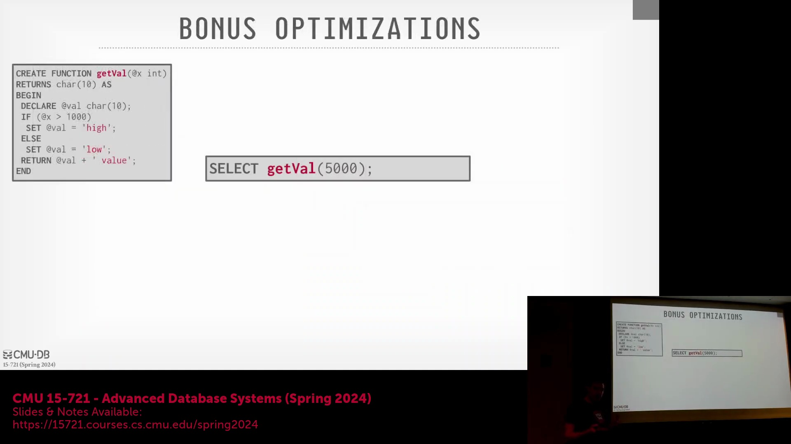
若查询优化器足够先进，它将能提供与传统优化编译器（如 Clang 或 GCC）同等的优化收益。数据库引擎实质上会将内联后的 SQL 逻辑视作已编译代码，并应用高级静态分析(Static Analysis)技术进行处理。

## UDF 优化实际示例
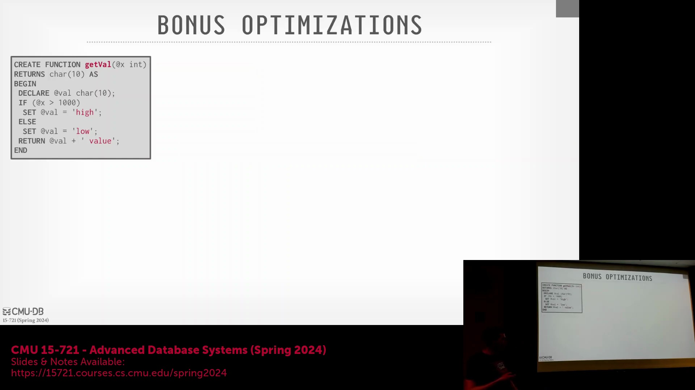
考虑一个接收整数并返回 `'high value'` 或 `'low value'` 的简单UDF。当使用常量（例如 `5000`）调用时，初始转换生成的查询可能仍包含 `CASE WHEN` 语句和 `OUTER APPLY` 操作。然而，成熟的优化器会立即识别出输入值为常量。

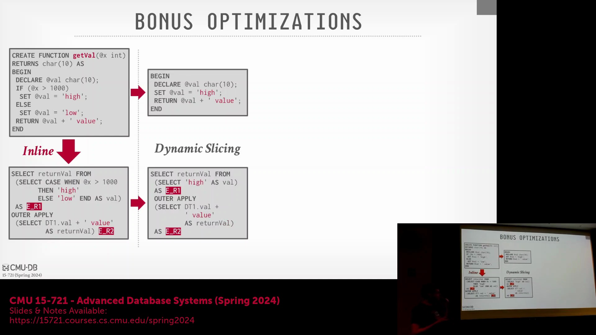
借助动态切片(Dynamic Slicing)技术，优化器能够确定当输入为 `5000` 时，返回 `'low value'` 的 `ELSE` 分支永远不会被执行。随后，优化器将执行死代码消除(Dead Code Elimination)，彻底剥离冗余的条件逻辑。在编译期，系统会对“值是否大于 `1000`”这一分支条件进行求值，仅保留结果为真的执行路径。

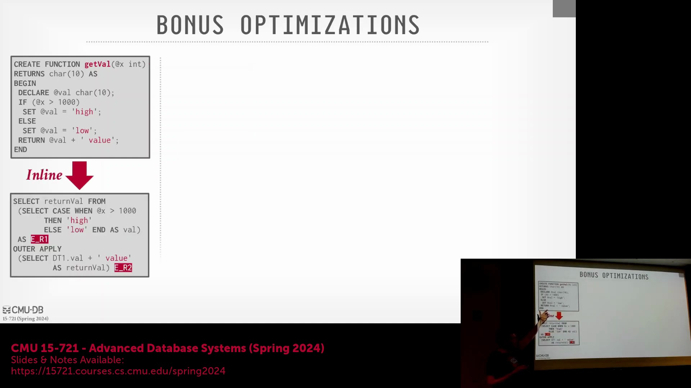

## 常量传播与最终优化步骤
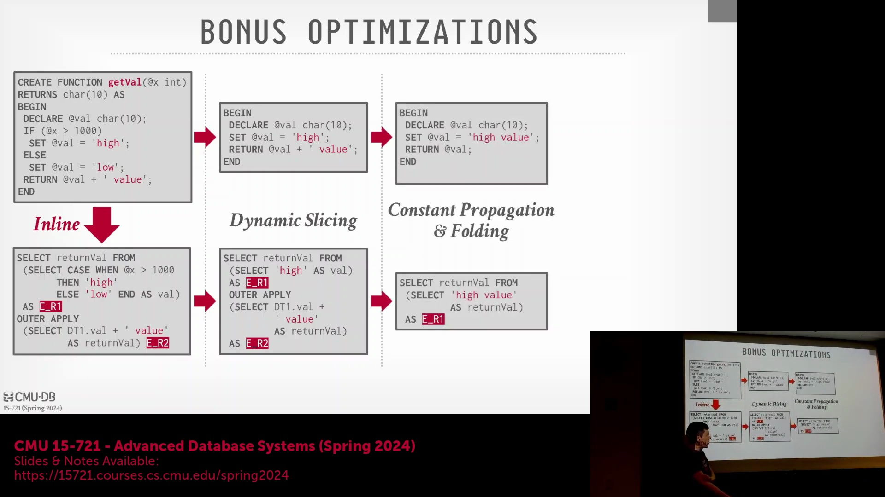
随后，优化器将应用常量传播与折叠(Constant Propagation and Folding)。字符串拼接（如将 `'high'` 与 `'value'` 连接）不再作为运行时的独立步骤执行，而是在编译期预先计算出最终结果 `'high value'`。进一步的死代码消除会剔除不必要的变量声明与返回赋值操作。最终，执行计划被简化为一条极高效的语句：`SELECT 'high value'`。这充分展示了现代查询优化器如何在无需人工显式干预的情况下，使UDF的执行性能逼近原生编译代码。

## UDF 优化的局限性与适用范围
尽管此类优化功能强大，但并未涵盖所有SQL结构。根据所引用的研究（2019年），该系统目前支持标量函数(Scalar Functions)与集合函数(Set-Returning Functions)、`SELECT` 查询、`IF-THEN-ELSE` 控制流、多个 `RETURN` 语句以及基础关系运算符（`EXISTS`、`NOT EXISTS`、`IS NULL`、`IN` 等）。然而，系统暂不支持异常处理(Exception Handling)、动态SQL(Dynamic SQL)或数据修改语句（`UPDATE`、`INSERT`、`DELETE`）。因此，UDF虽无法完全替代标准SQL，但在受支持的功能范围内使用时，仍能带来显著的性能提升。

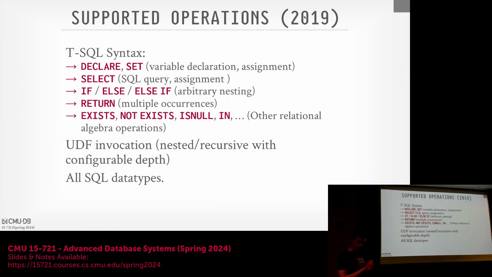