## 课程介绍与主题转换
卡内基梅隆大学的高级数据库系统(Advanced Database Systems)课程采用现场观众录制形式。嗨，我非常激动，我有个问题。嘿！嘿！嘿！没人知道钱就在那儿。好的，今天的课程内容与我们整个学期探讨的主题略有不同。到目前为止，我们主要聚焦于数据库系统(Database System)最底层的内部机制，以及如何提升查询的执行速度。
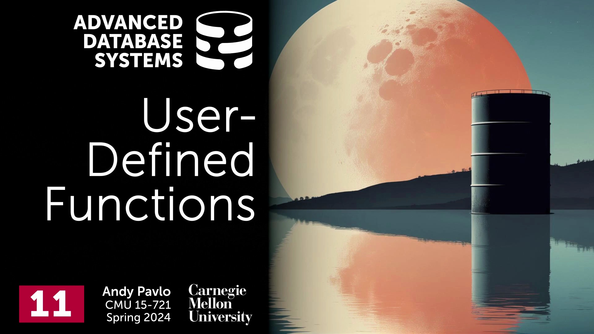
因此，今天的主题将有所转变，我们将视角上移至系统架构的更高层级。在 SQL 查询(SQL Query)抵达查询优化器(Query Optimizer)之前，我们将运用一系列技巧，并结合底层架构设计来加速查询处理。从此刻起，本学期的内容重心将发生转移：下一讲将探讨如何高效地进行数据库数据的导入与导出，随后的一周我们将投入大量时间深入讲解查询优化器。我知道我还需要更新并发布下周的阅读论文，但我会在今天或明天完成这项工作。
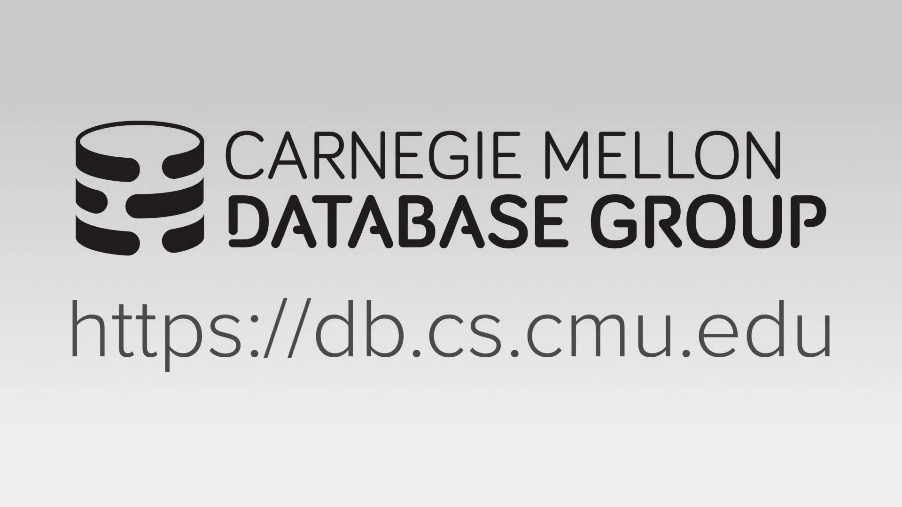

## 连接算法回顾与嵌入式逻辑简介
在进入正题前简单回顾一下：我们此前用了两节课深入探讨连接算法(Join Algorithm)，并详细讲解了如何执行并行哈希连接(Parallel Hash Join)，因为正如我所强调的，这是每个数据库系统都必须掌握的核心技术。在关系模型(Relational Model)中，连接操作通常基于等值条件。而一旦需要执行连接，哈希连接(Hash Join)往往是最快的选择。随后，我们花了一整节课讨论最坏情况最优连接(Worst-Case Optimal Join, WCOJ)。尽管目前仅有极少数系统实现了该技术，但随着业界开始在数据库上开展更多图计算(Graph Computing)相关工作，这必将成为未来十年所有数据库系统必须支持的功能。
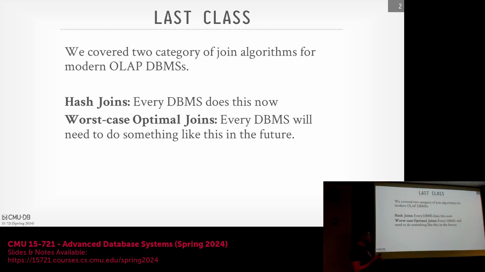
回到今天的讲座，我们将重点讨论如何在数据库系统中嵌入更复杂的逻辑以执行查询。目前，业界大致将这类技术归类为嵌入式数据库逻辑(Embedded Database Logic)。

## 嵌入式逻辑的优势与实际考量
在典型数据库系统所支持的应用场景中，用户通常通过某个应用程序或工具与系统进行交互。他们要么直接输入原始 SQL 查询，要么通过仪表盘(Dashboard)触发请求，随后应用程序将 SQL 查询发送至数据库，系统完成完整计算并返回结果。因此，查询能够执行的操作范围以及对数据进行的计算，完全受限于数据库系统自身实际支持的功能。正因如此，在某些场景下（尤其在 Python Pandas 生态(Python Pandas Ecosystem)中极为常见），开发者会直接使用 `SELECT *` 将全量数据从数据库导出，加载至 Jupyter Notebook 或 Pandas 中进行额外计算，最后再将结果写回数据库服务器。如果我们能避免这种模式（部分场景可避免，部分则不可避免），数据库系统显然能更透彻地理解你在查询中意图对数据执行的操作，从而进行针对性优化（前提是你运用我们今天将讨论的技术）。但无论如何，在数据所在位置直接进行处理，总比反复将其导出至外部应用程序更为高效。这正是我们通过嵌入数据库逻辑所要实现的目标。

因此，其优势显而易见。正如我所言，如果你能避免网络往返(Network Round Trip)，例如仅需发起一个查询请求即可完成所需结果的所有计算，那将非常高效，而无需在客户端与服务器间反复交互。显然，若当前数据发生变更，这在湖仓一体(Lakehouse)架构的语境下或许影响不大，但与其处理本地过时的数据快照，将所有计算推送到数据库服务器意味着一旦新数据到达，你便能立即获取最新结果。我们暂且不深入讨论事务(Transaction)，但试想一下：若在事务环境中执行 `BEGIN`，运行查询并获取结果后在应用端处理，此时数据库服务器会在我进行客户端计算期间持续持有锁。因此，若能将所有计算逻辑推送到数据库服务器，就无需经历这些冗长的网络往返。

这一点在业界仍存争议：是否应允许开发者通过更优的数据库内嵌逻辑来实现业务功能，从而避免在应用层重复造轮子。之所以说它存在争议，是因为在大型企业或公司中，负责编写应用程序的工程师与负责管理数据库服务器的人员通常并非同一团队。应用开发者往往遵循敏捷的工程迭代周期，而数据库团队则通常较为保守。开发者可能会说：“嘿，这是我新写的用户定义函数(User-Defined Function, UDF)或存储过程(Stored Procedure)。”但数据库管理员(DBA)可能会想：“我得先进行代码审查。这可能需要几周时间才能实际部署。”最终，开发者不得不放弃复用，转而在不同的代码库中重新实现相同的功能。我们在 Velox 论文中肯定见过类似案例，对吧？文中提到 Facebook 内部竟然存在 11 种不同的 `substring`（子串）实现。最后一点涵盖了上述所有场景。现在，我们将能够扩展数据库系统的功能，使其突破内置能力的限制。而这最后一点，正是用户定义类型(User-Defined Type, UDT)和用户定义函数最初的设计动机之一，也是 Stonebraker 教授经常探讨的话题。例如，当年他们构建 Ingres 数据库并试图将其推向银行业市场时，发现所有银行均使用儒略历(Julian Calendar)来计算账户利息，而世界其他地区通用的是格里高利历(Gregorian Calendar)。当时的 Ingres 并未内置儒略历日期类型，这意味着开发者必须修改数据库源码以添加该类型。但如果系统原生支持用户定义类型、用户定义函数及其他扩展机制，开发者便能在不重新编译二进制文件的情况下灵活扩展系统功能。

## 嵌入式逻辑的分类：UDF 与存储过程
嵌入式数据库逻辑可分为多种类型，其中最常见的是用户定义函数(User-Defined Function, UDF)和存储过程(Stored Procedure)。两者在概念上相似，均为可在数据库服务器内部运行的过程化代码函数。核心区别在于：对于存储过程，你无需在 SQL 查询中调用它，可以在查询外部直接执行。例如，我可以调用 `EXECUTE` 命令并传入函数名，它会像 RPC 调用(Remote Procedure Call)一样独立运行。而 UDF 则必须嵌入在 `SELECT` 语句或 SQL 查询内部。在 SQL Server 等部分系统中，两者有明确区分：用户定义函数不允许更新表数据，即你不能在 UDF 中执行 `INSERT`、`UPDATE` 或 `DELETE` 操作。PostgreSQL 同样禁止此类行为。只有在 SQL Server 的存储过程中，才允许调用数据更新查询。这些基础概念大家应该已较为熟悉，而今天的重点将聚焦于用户定义函数。
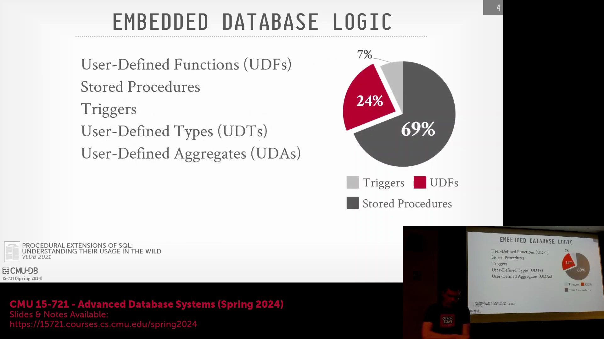

## 深入探讨用户定义函数
这份调查数据源自你们此前阅读过的 FOIA 论文的后续研究。研究人员实际调研了 Azure 云平台中的真实客户数据库，统计了真实业务中 UDF 和存储过程的分布情况，并得出了如下饼图。
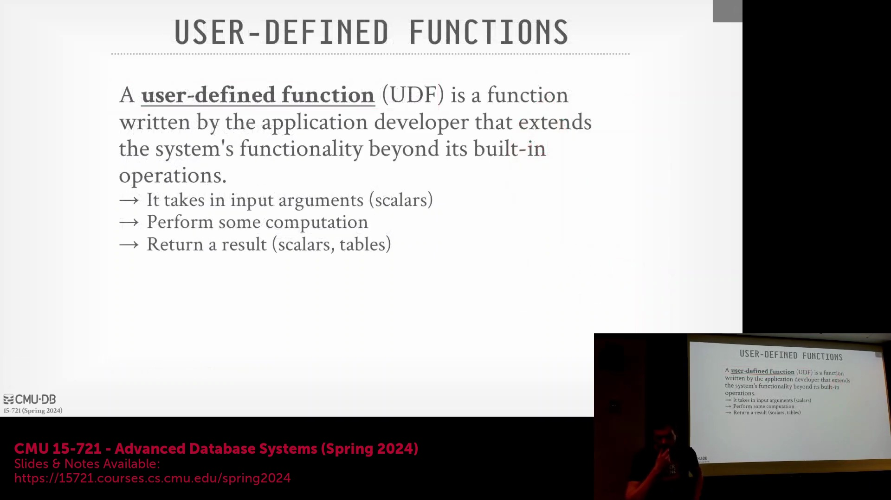
关于用户定义函数，在座各位应该已经复习过相关概念。UDF 本质上是应用开发者编写的函数，旨在扩展数据库系统的功能边界，使其超越内置操作与函数的限制。SQL 标准明确规定了 `substring` 函数，每个遵循 SQL 标准的系统都会提供各自的实现。但如果因业务需要，我必须使用某种非常特殊的 `substring` 变体，指望数据库系统原生支持是不现实的。此时，我可以将其编写为用户定义函数，精准实现所需逻辑，从而使我的应用在技术上具备跨平台可移植性。在许多数据库迁移服务中（例如“从 Oracle 迁移至 PostgreSQL”或“从 Teradata 迁移至 PostgreSQL”），服务商常会将客户在不同专有数据库中使用的自定义函数提取出来，重新实现为用户定义函数以确保业务兼容性。UDF 的函数逻辑本身非常直观：接收若干输入参数（通常为标量(Scalar)），执行特定计算后，返回一个标量值或数据表(Table)作为结果。为便于今天讨论，我们假设 UDF 为纯函数(Pure Function)，即它们不会产生副作用，也不会调用外部服务。尽管在某些数据库系统中，你确实可以向远程服务发起 RPC 调用，但为保持讨论简洁，我们假设所有计算均在函数内部完成，不会“逃逸”至外部环境。当然，一个函数内部可以嵌套调用其他函数。

## 应用工作流与优化预览
从概念模型来看，典型的工作流如下：这是我们的应用程序，我们希望执行一些 SQL 语句，其中穿插着程序逻辑（如条件分支等），调用外部库，执行更多 SQL，随后再次执行程序逻辑，如此循环往复。

优化后的变化在于：如果我们能将图中这两部分逻辑提取出来，封装为函数并嵌入数据库服务器，现在便可重写应用程序，仅需通过调用查询和函数即可完成任务。
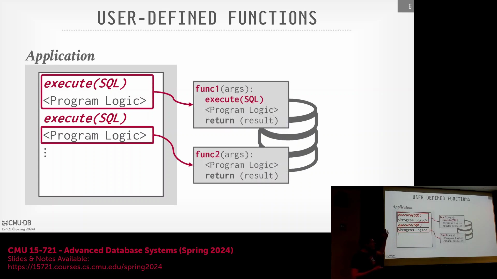
如此一来，便消除了客户端与服务器间的反复交互（例如反复拉取大量数据、在本地处理后再传递给下一个查询等）。我可以将所有数据与计算逻辑始终保留在服务器端。
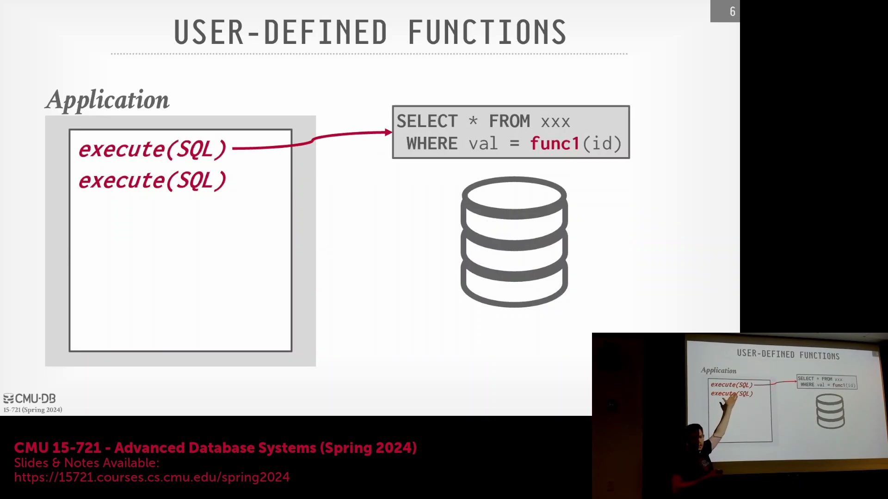
当然，对于某些特定场景（例如调用 PyTorch 等机器学习库(Machine Learning Library)），将所有逻辑下沉至数据库可能并不合理。若要用数据库服务器的原生 UDF 语言重写所有内容，目前已有相关工具及 PostgreSQL 等系统的扩展插件支持调用 PyTorch，它们本质上为这些外部库提供了 UDF 包装器(UDF Wrapper)。正如我所强调的，我们今天暂且忽略此类复杂场景。好了，接下来我们将探讨 UDF 的应用背景与性能挑战，随后重点介绍三种优化 UDF 的技术。第一种是内联方法(Inlining Approach)。

---

## 课程概述：UDF 优化技术
本节首先概述了优化用户定义函数(User-Defined Function, UDF)的三种主要技术：内联技术(Inlining)（参考微软相关论文）、将 UDF 转换为结合横向连接(Lateral Join)的公共表表达式(Common Table Expression, CTE)，以及批处理(Batching)策略。讲座还将评估当前主流现代数据库系统对这些优化方法的支持情况。

## SQL 函数与外部语言 UDF
用户定义函数(UDF)通常接收输入参数、执行处理逻辑并返回输出结果，但它们可划分为两个截然不同的类别。第一类是纯 SQL 函数(Pure SQL Function)，其函数体完全由顺序执行的 SQL 语句构成，最终查询的结果集将直接作为函数返回值。此类函数既可直接调用，也可嵌入至 `FROM` 或 `WHERE` 子句中。从查询优化(Query Optimization)的角度来看，SQL 函数的行为类似于宏(Macro)：数据库引擎会将函数体内的 SQL 语句直接展开并内联至主查询中，形成嵌套查询结构，从而使查询优化器(Query Optimizer)能够对其进行全局分析与优化。正是由于这种透明性，SQL Server 等系统会严格限制 UDF 执行 `UPDATE` 等数据修改操作。若将数据变更语句混入展开后的查询中，极易打乱原有的执行顺序，进而引发不可预测的副作用(Side Effects)。

在随后的问答环节中对此作了进一步澄清：若允许在 SQL 函数内部执行数据更新操作，数据库通常会强制采用严格的顺序执行模型，即按顺序复制并逐一执行这些语句。该机制与 PostgreSQL 中的视图重写规则(View Rewriting Rule)颇为相似。
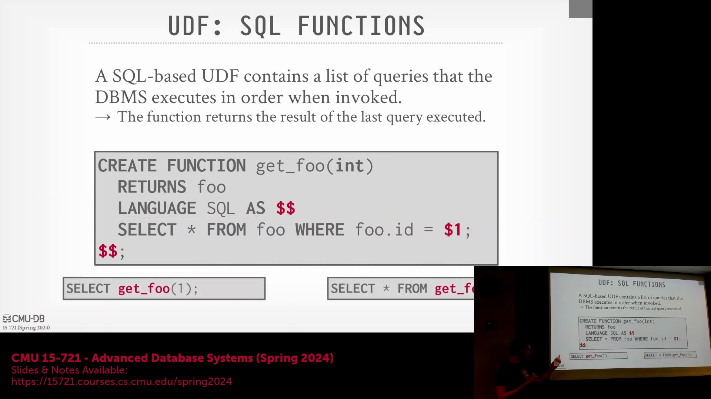

## 历史背景与过程语言标准
第二类涵盖使用外部过程语言(External Procedural Language)编写的 UDF。SQL 标准为此定义了持久存储模块(Persistent Stored Module, SQL/PSM)规范，但各大数据库厂商通常会根据自身需求实现特定的方言(Dialect)。这类语言在语法结构上与 Ada 或 Pascal 相似，通常要求显式声明变量。主流实现包括 Oracle 的 PL/SQL、PostgreSQL 的 PL/pgSQL 以及 IBM DB2 的 SQL PL。本次讲座将重点聚焦于 Transact-SQL(T-SQL)。T-SQL 由 Sybase 于 20 世纪 80 年代开发，是业界早期支持 UDF 的先驱之一。微软在 90 年代初获得 Sybase 代码库授权并推出 SQL Server，由此奠定了 T-SQL 中采用 `@` 前缀定义变量以及其鲜明的过程化编程(Procedural Programming)风格。尽管 Sybase 如今仅留存于部分传统企业环境中，但 T-SQL 依托 SQL Server 的广泛应用，至今仍保持着强劲的发展势头。
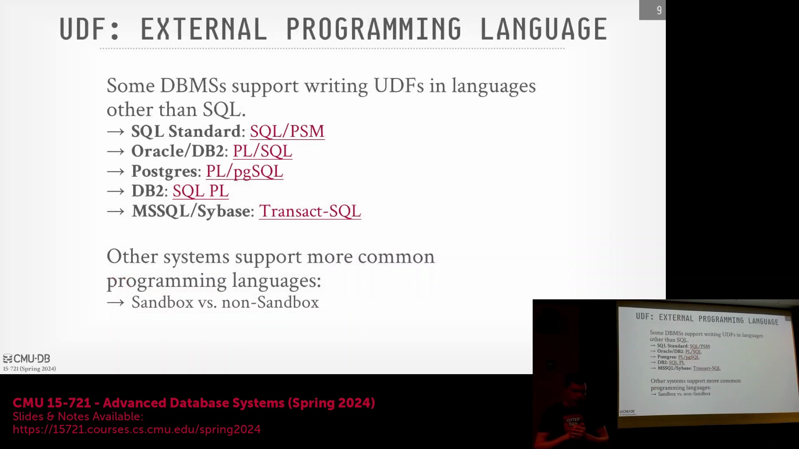

## 语言生态、安全性与实际优势
PostgreSQL 支持使用多种编程语言编写 UDF，涵盖 Tcl、Python、Perl 甚至 C 语言。然而，业界强烈不建议直接使用基于 C 语言编写的 UDF，因其存在显著的安全与稳定性风险：这类函数直接在数据库进程的地址空间(Address Space)中运行，若内存管理不当，极易导致整个数据库服务器崩溃(Crash)。Oracle 数据库通过将 C 语言代码转译为更安全的中间表示，并将其隔离在独立的进程(Independent Process)中运行，从而有效缓解了该风险。尽管引入外部语言 UDF 会带来一定的复杂性，但其优势依然显著：它们能够促进业务逻辑在不同应用层（如移动端与 Web 后端）之间的复用，彻底消除冗余的网络往返(Network Round-Trip)开销，并大幅简化复杂业务规则或分析逻辑的表达——若仅依赖纯 SQL 实现这些逻辑，往往显得冗长且难以维护。
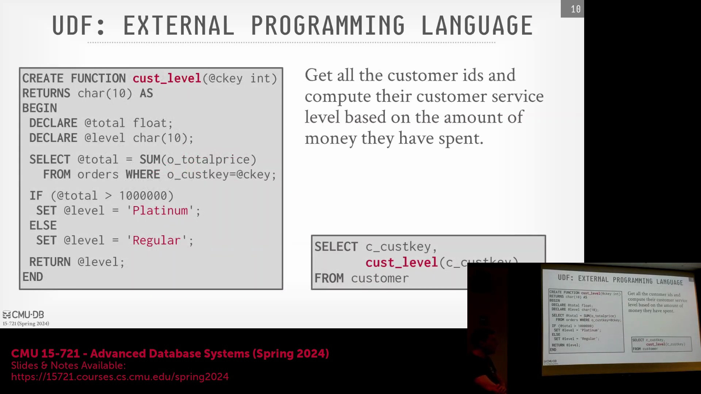

## 优化挑战：不透明性与执行限制
制约 UDF 广泛采用的核心瓶颈在于查询优化器面临的黑盒不透明性(Black-Box Opacity)。当 UDF 采用外部语言编写时，查询优化器(Query Optimizer)无法探查其内部实现逻辑，因而难以准确估算执行成本(Execution Cost)或结果集的选择性(Selectivity)。例如，在 `WHERE` 子句中将数据列与 UDF 的返回值进行比较时，优化器因无法预知函数行为，往往只能生成次优甚至低效的执行计划(Execution Plan)。这种逻辑隔离也严重阻碍了查询的并行化(Parallelization)与向量化执行(Vectorized Execution)，常常迫使数据库引擎退化为低效的逐行处理模式（即隐式嵌套循环连接(Implicit Nested Loop Join)）。在极端场景下，UDF 甚至会在运行时动态拼接并执行 SQL 字符串，这使优化器完全丧失全局视野，彻底无法进行有效的全局查询规划(Global Query Planning)。

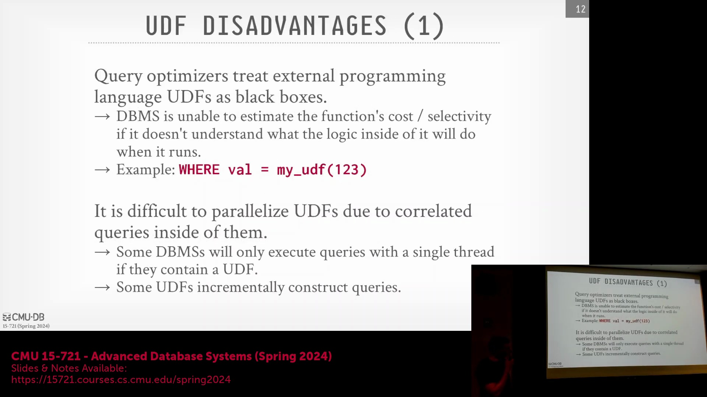

---

## UDF(User-Defined Function) 的不透明性与 RBAR(Row By Agonizing Row) 问题
用户定义函数(User-Defined Function)对数据库优化器(Database Optimizer)构成了重大挑战，因为其内部的 SQL 逻辑或查询在运行前完全不可见。这种不透明性迫使执行引擎(Execution Engine)陷入微软所称的“逐行痛苦处理”(Row By Agonizing Row)模式。系统未能利用基于集合的处理(Set-based Processing)方式，而是逐行遍历外层查询，并为每一个元组(Tuple)单独调用 UDF。由于优化器无法洞察函数内部逻辑，系统无法识别将操作合并为高效连接(Join)或缓存重复查询结果的机会。尽管静态代码分析(Static Code Analysis)表明该模式在代码库中的出现率不足 5%，但其对运行时性能(Runtime Performance)的影响却极为显著。
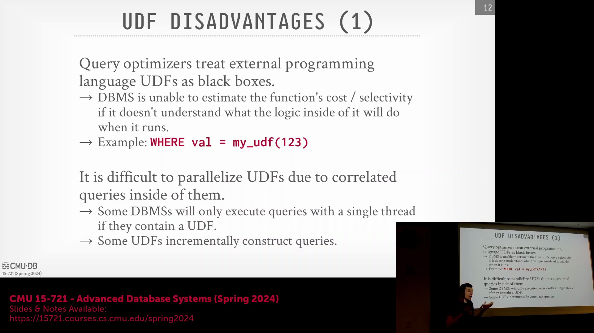

## 业界共识与严重的性能退化(Performance Degradation)
标量 UDF(Scalar UDF)对查询性能的负面影响已在数据库行业中得到广泛记录与认可。微软在 2006 年的一篇知名博文中直言不讳地将 T-SQL 标量函数称为“魔鬼”，并展示了一个典型案例：仅将业务逻辑封装在 UDF 中，执行时间便从 2.6 秒激增至 38 秒。这并非 SQL Server 独有的问题；所有主流关系型数据库管理系统(RDBMS)都面临同样的瓶颈。截至 2008 年，微软虽发布了关于编译型 UDF(Compiled UDF)的更新文档，但仍严厉批评 RBAR 执行模式，将标量 UDF 描述为事实上的“性能杀手”。业界的共识始终明确：尽管 UDF 显著提升了开发者的生产力与代码模块化程度，但其固有的性能开销要求进行系统性的优化。
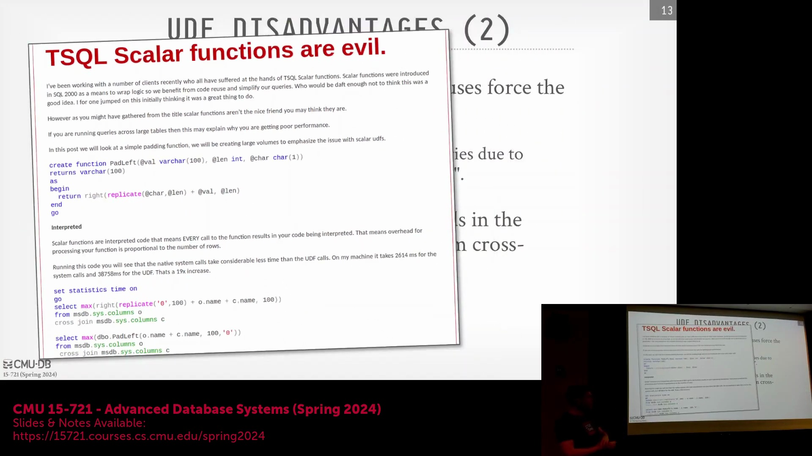
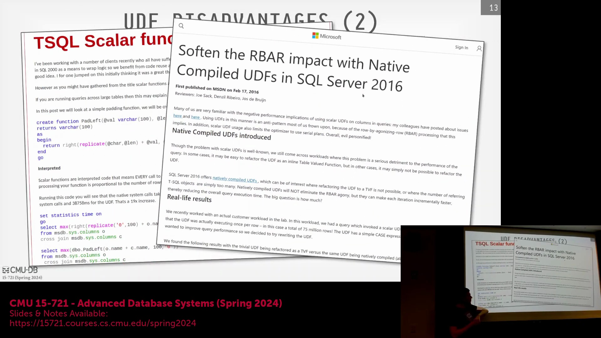

## 案例分析：TPC-H 基准测试(TPC-H Benchmark) 查询 12 与 13 小时的执行耗时骤增
为阐明 UDF 不透明性带来的极端后果，Floyd 的论文以 TPC-H 查询 12 为例，提供了一个极具说服力的案例。原本用于校验客户键(Customer Key)是否为空的简单 `WHERE` 子句，被替换为一个在客户表上执行验证查找(Validation Lookup)的 UDF。在未使用 UDF 的情况下，该查询仅需 0.8 秒即可完成。然而，引入这种过程式包装(Procedural Wrapping)后，执行时间竟暴涨至 13 小时。由于优化器无法识别该函数的简单逻辑，默认采用了逐行评估(Row-by-Row Evaluation)策略，从而产生了巨大的函数调用开销。值得注意的是，包含变量声明或使用显式 `RETURN` 子句的 UDF 会阻碍简单的内联优化，而纯 SQL UDF(Pure SQL UDF，不含过程式元素)则更易于优化。“Freud”项目等先进的内联研究(Inlining Research)表明，将此类函数转换回声明式(Declarative)形式后，执行时间可从 13 小时大幅缩减至约 900 毫秒。

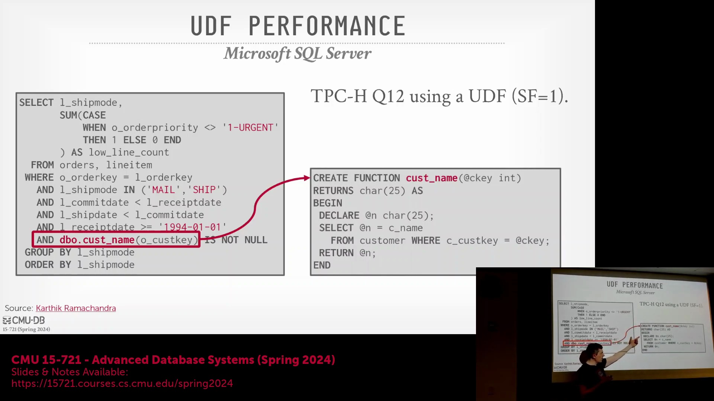

## UDF 优化的四种核心方法
数据库厂商历来采用四种核心策略来缓解 UDF 带来的性能瓶颈。首先是**编译(Compilation)**，即将解释执行(Interpreted Execution)的 UDF 代码转换为本机机器指令(Native Machine Instructions)。尽管此举降低了单次调用开销（Oracle 与 SQL Server 2016 及以上版本已实现该特性），但对查询优化器而言，该函数依然是一个黑盒(Black Box)。其次是**语言扩展与编译提示(Language Extensions & Pragmas)**，例如 SingleStore 的 MPL 语言，允许开发者嵌入并行化提示(Parallelization Hints)，但优化器的可见性依然有限。第三种也是当前研究的前沿重点是**内联(Inlining)**，它将 UDF 转换为声明式关系代数表达式(Declarative Relational Algebra Expressions)，使其能够无缝融入主查询计划(Query Plan)中进行全局优化。第四种是**批量执行(Batch Execution)**，它将 UDF 重写为可同时处理多个元组的集合查询，从而彻底消除了逐行调用函数的开销。

## 内联机制与子查询转换(Subquery Transformation)
现代 UDF 优化高度依赖于内联技术（在学术研究中常以“Freud”项目为代表，在 SQL Server 中则称为“UDF 内联”(UDF Inlining)）。该技术在查询进入基于成本的优化器(Cost-Based Optimizer, CBO)阶段之前，应用静态转换规则将 UDF 逻辑转化为关系代数表达式。内联能否成功，关键取决于数据库处理与重写嵌套子查询(Nested Subquery)的能力。理想情况下，优化器会对这些嵌套查询进行去相关化(Decorrelation)处理，并将其展平(Flattening)为标准的连接(Join)操作。若无法去相关，系统则可能将子查询结果物化(Materialization)至临时表中，以供后续连接操作使用。为保留原始过程式 UDF(Procedural UDF)所要求的严格执行顺序，系统会引入横向连接(Lateral Join)以将各操作按序串联。尽管该技术对声明式 SQL UDF 极为有效，但若底层过程式逻辑过于复杂，此转换流程仍可能失败或导致性能退化。
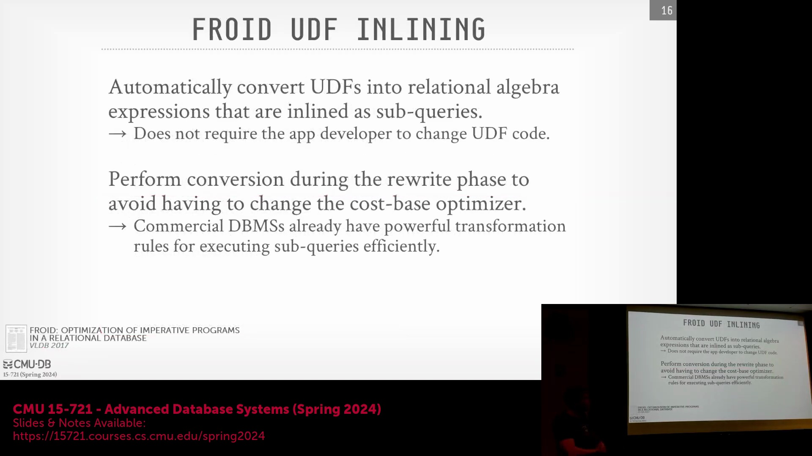
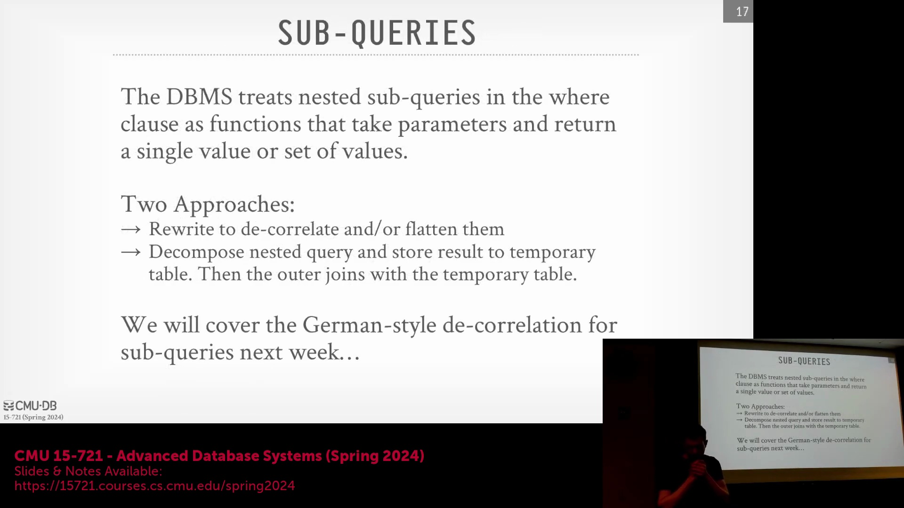

---

## 查询重写与子查询展平

在优化用户定义函数(User-Defined Function, UDF)之前，理解查询优化器(Query Optimizer)如何处理嵌套子查询(Nested Subquery)至关重要。在执行计划(Execution Plan)不支持有向无环图(Directed Acyclic Graph, DAG)的数据库系统中，优化器必须对这些嵌套结构进行重写。理想的优化策略是去相关化(Decorrelation)与展平(Flattening)，即将嵌套查询转换为标准的连接操作(Join Operation)。例如，当查询试图将 `order` 表与 `user` 表进行连接时，高级优化器可能会识别出所需的所有数据实际上已完整存在于 `order` 表中。在此最佳情况下，优化器能够完全消除对 `user` 表的访问，避免逐行评估(Row-by-Row Evaluation)，从而获得显著的性能提升。若无法实现展平，优化器则会回退至物化策略(Materialization)，将子查询结果存储至临时表(Temporary Table)中，以便后续执行连接操作。
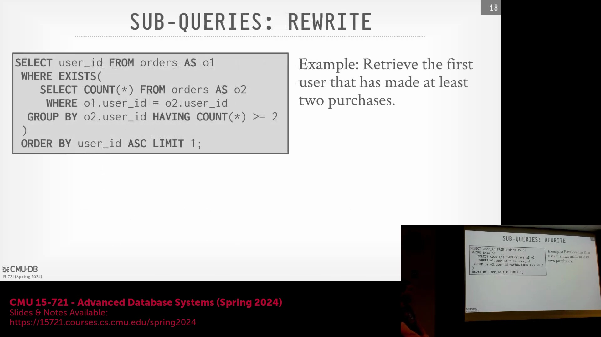
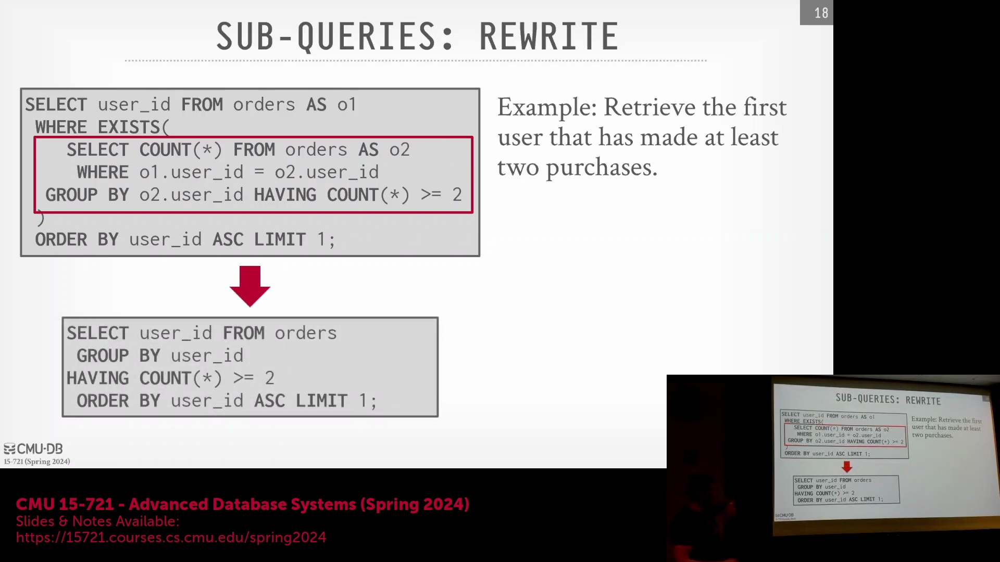

## 横向连接在执行顺序中的作用
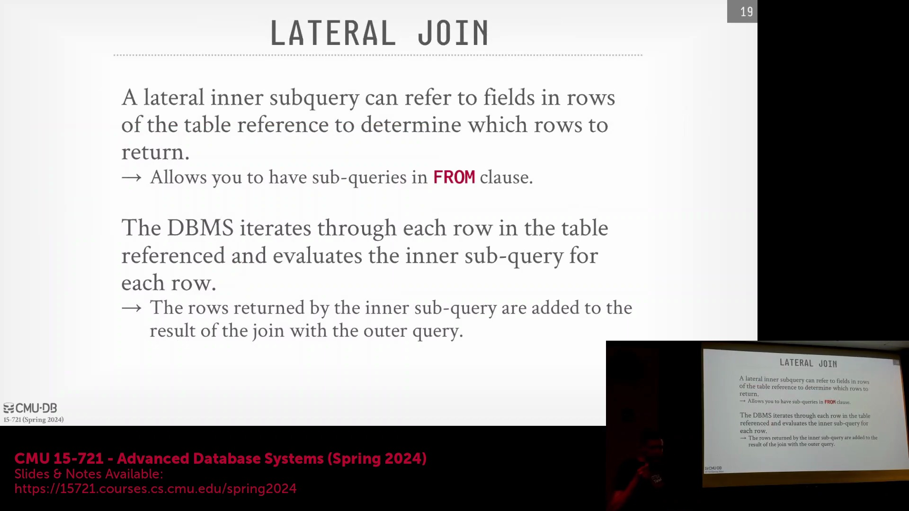
横向连接(Lateral Join)是实现 UDF 内联(Inlining)的一项关键机制。与标准连接(Standard Join)不同（标准连接中 `FROM` 子句内的子查询相互隔离且无法交叉引用），横向连接允许子查询直接引用同一嵌套层级中前置表(Preceding Table)的列或属性。这一特性对于保留过程式 UDF(Procedural UDF)逻辑所要求的严格执行顺序至关重要。从概念上讲，其工作原理类似于嵌套循环(Nested Loop)：针对前置表中的每一个元组(Tuple)，横向子查询都会独立执行，并能完全访问外部上下文(Outer Context)。这确保了变量间的依赖关系能够按序解析，从而精准复现原始函数的控制流(Control Flow)。
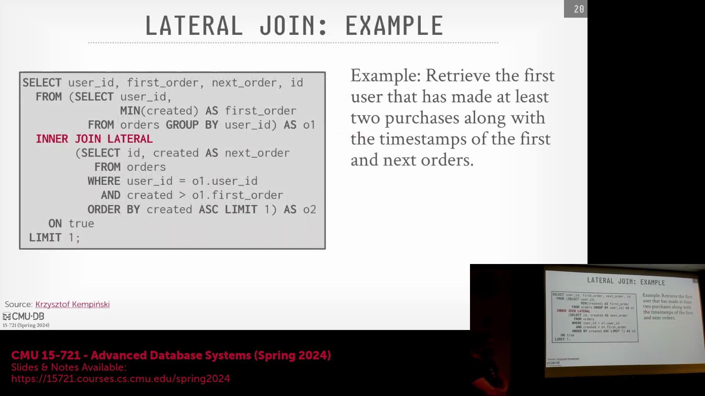

## “Freud”方法：五步内联概述
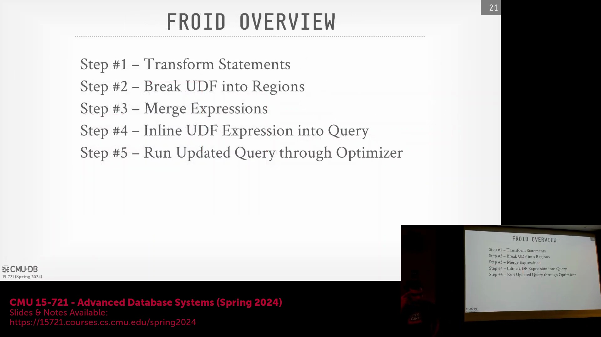
“Freud”内联技术通过结构化的五个步骤，将过程式 UDF 转换为声明式关系代数(Declarative Relational Algebra)表达式。首先，将过程式语句(Procedural Statements)（如 T-SQL、PL/pgSQL）转换为等效的 SQL 查询。其次，依据数据依赖关系(Data Dependency)将 UDF 划分为多个逻辑区域(Logical Regions)。第三步，对每个区域内的表达式进行合并优化。第四步，利用横向连接将这些逻辑区域串联，以严格保留原有的执行顺序。最后，在查询进入基于成本的优化器(Cost-Based Optimizer, CBO)之前，将生成的 SQL 结构直接嵌入至调用查询中。该方法依赖于静态转换规则(Static Transformation Rules)，使得标准优化器无需依赖专门的成本模型(Cost Model)即可高效处理生成的子查询。

## 第一步：将过程式逻辑转换为 SQL
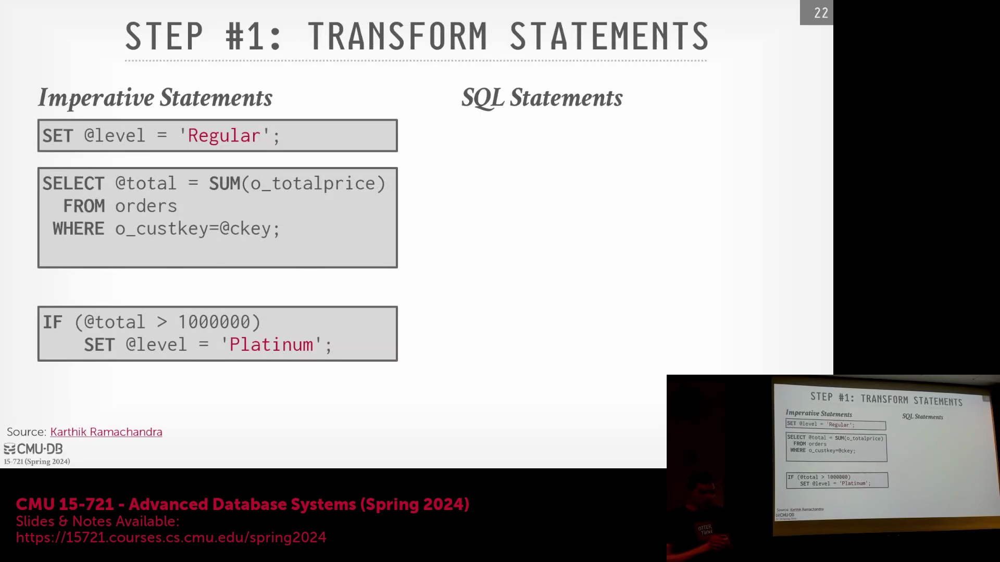
初始转换步骤将 UDF 语句直接映射(Mapping)为标准的 SQL 结构。变量声明与赋值操作会被转换为不含 `FROM` 子句的 `SELECT` 语句，用于对常量值或表达式进行投影(Projection)。过程式赋值操作（例如将聚合结果(Aggregation Result)存储至变量中）则会被转换为嵌套的 `SELECT` 查询，并为输出结果设置别名。
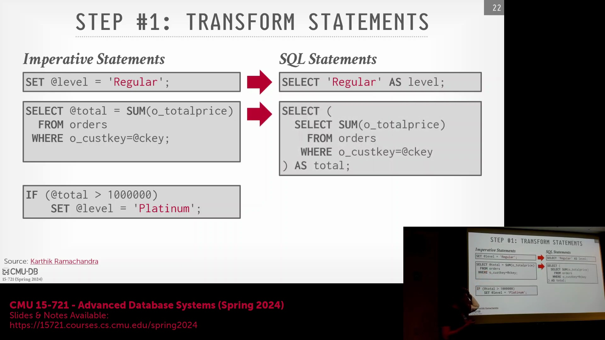
关键在于，`IF` 等控制流结构(Control Flow Structures)会被替换为符合 SQL 标准的 `CASE WHEN` 表达式。例如，针对 `total` 变量的条件检查会被转化为一个 `CASE` 代码块，依据预设阈值输出 `"platinum"` 或 `NULL`，随后将其投影至最终结果集中。尽管此示例展示了一对一的映射关系，但在处理复杂逻辑时，系统可能需要合并多条语句，或将单条语句拆分至多个 SQL 查询中。
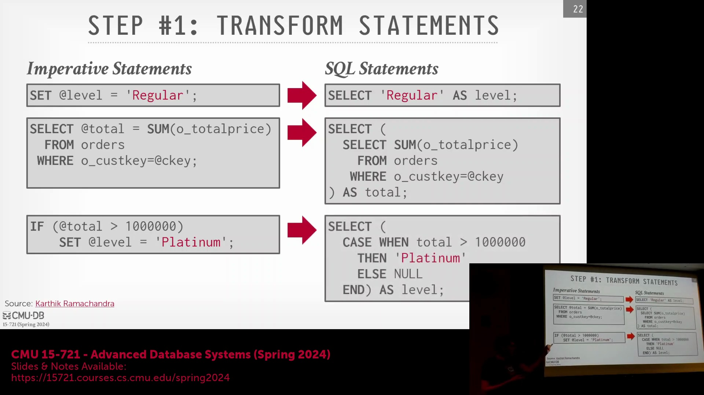

## 第二步与第三步：区域划分与临时表生成
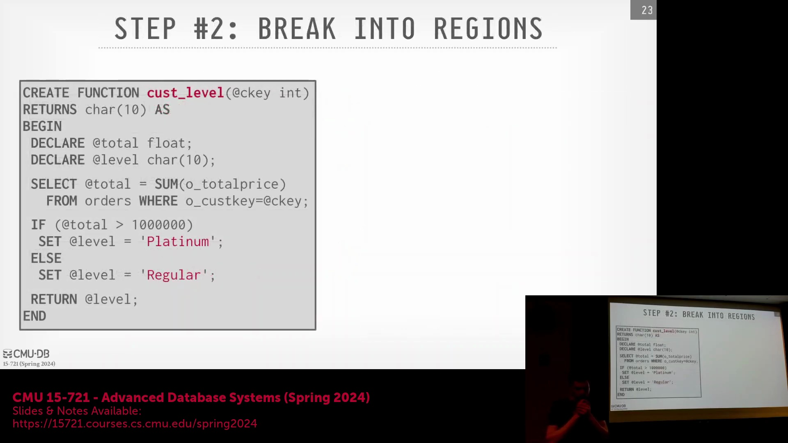
完成语法转换后，优化器将 UDF 划分为离散的区域(Discrete Regions)以隔离依赖关系。每个区域转换后的 SQL 代码会被封装至子查询中，并物化(Materialization)为瞬时的内存临时表(In-Memory Temporary Table)（例如 `ER1`、`ER2`）。这些表充当仅在查询执行期间存活的中间结果集(Intermediate Result Set)。通过此种代码划分方式，系统能够显式追踪 `total` 或 `level` 等变量如何在区域间传递，确保下游区域在不违反作用域规则(Scope Rules)的前提下，正确引用上游区域的计算结果。
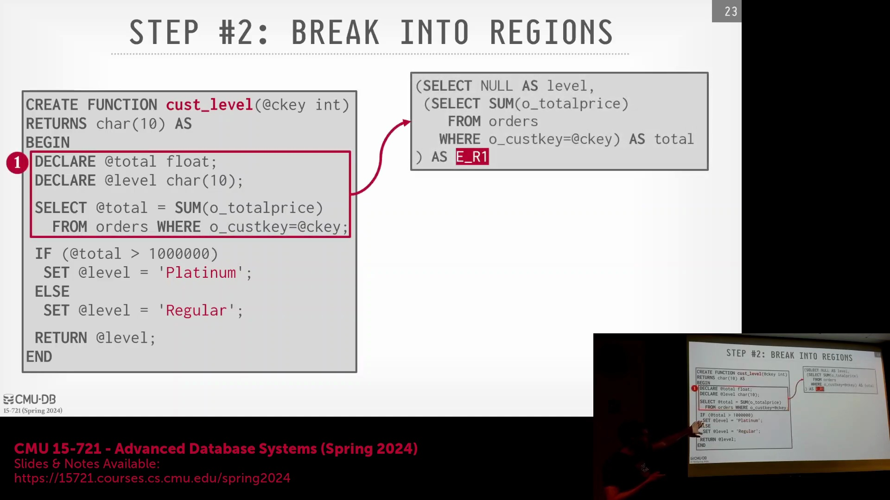

## 第四步与第五步：使用横向连接进行链接及处理返回
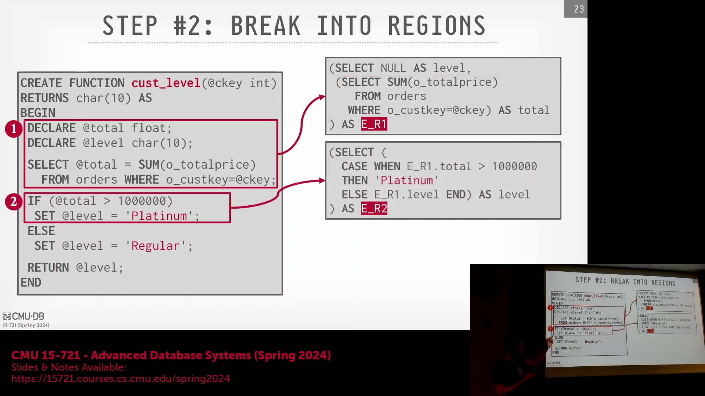
为串联这些已划分的逻辑区域，系统采用横向连接（在 SQL Server 中称为 `CROSS APPLY`，在 PostgreSQL/SQLite/Oracle 中称为 `LATERAL`）。该机制使得每个后续区域的子查询均能访问前序区域生成的临时表，从而精准满足区域间的依赖关系（如条件 `total > 1000000`）。
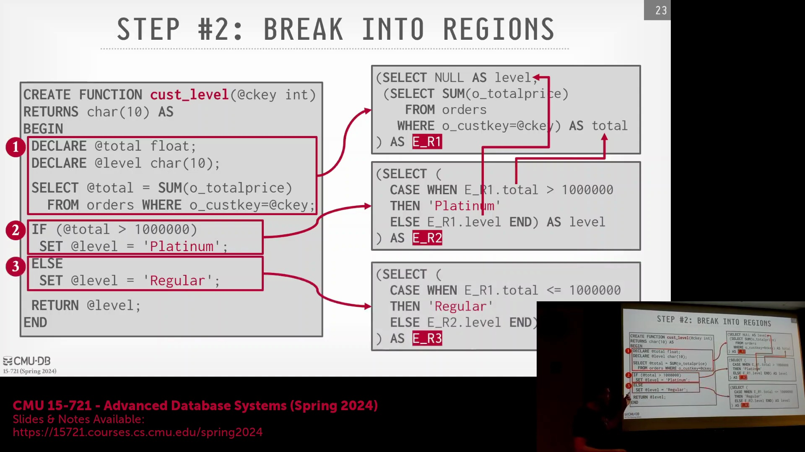
UDF 末尾的 `RETURN` 语句仅被视为该组装查询结构的最终投影操作(Final Projection)。通过将所有逻辑封装于一个引用最终临时表的单一 `SELECT` 语句中，过程式函数被完全内联(Inlined)为一个庞大的声明式查询(Declarative Query)。
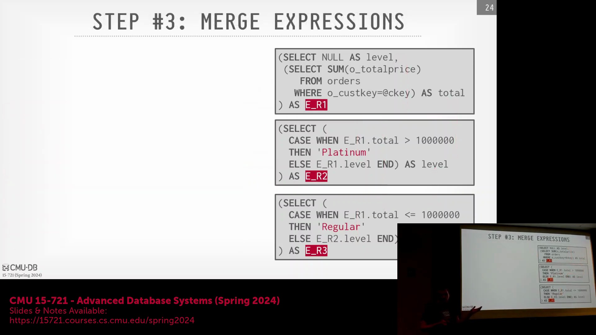
随后，该最终结构被嵌入至原始调用查询中，使基于成本的优化器得以应用标准的连接重排序(Join Reordering)与谓词下推(Predicate Pushdown)等优化策略，从而将执行时间从数小时大幅压缩至毫秒级。

## 处理复杂控制流（问答环节）
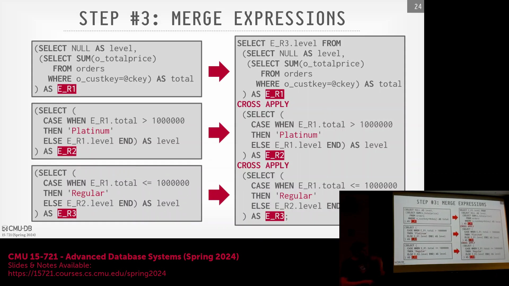
在转换过程中，常会涉及控制流划分的细节问题，例如为何 `ELSE` 代码块可能被视为独立的区域。实际上，这主要取决于内联算法(Inlining Algorithm)的严格程度与设计策略。尽管从逻辑层面而言，`IF/ELSE` 结构可直接映射为单个 `CASE WHEN` 表达式，但面对复杂的过程式逻辑时，通常需将不同分支拆分为独立区域，以便精准追踪变量状态与执行路径。优化器的核心目标是在查询简洁性与语义正确性之间取得平衡，确保在将最终查询移交至标准优化流程前，所有过程式依赖均能通过横向连接或条件投影(Conditional Projection)得到显式解析。

---

## UDF 区域处理与查询优化

在此展示不同区域(Regions)的示例中，用户定义函数(User-Defined Function, UDF)可能包含任意逻辑，这些逻辑往往无法通过单一的 `CASE WHEN` 语句来表达。然而，一旦UDF以其结构化形式传递给查询优化器(Query Optimizer)，优化器便能分析各个 `CASE` 分支并识别出互不相交的区域。由于优化器已具备处理 `WHERE` 子句的能力，它能够智能地将这些互斥区域合并，从而免去了开发人员编写冗长代码的负担。

参考相关研究（即 Froid论文(Froid)）可知，将 SQL 转换为中间表示(Intermediate Representation, IR)的过程变得清晰明了。这种IR与传统编译器(Compiler)及编程语言处理中使用的表示形式类似，其目标是将UDF逻辑转换为数据库查询优化器能够原生理解并直接操作的格式。

## SQL 转换与表达式内联

下一步是将UDF表达式实际内联(Expression Inlining)至原始调用查询中。当UDF调用出现在客户记录级别时，该调用会被完整替换为转换后的UDF代码块。此转换将函数调用扁平化为关系代数(Relational Algebra)表达式，使得优化器能够直接对其进行处理。

## 处理覆盖逻辑与查询简化
为演示优化器如何处理控制流(Control Flow)，考虑以下场景：`ELSE` 子句被移除，或修改为始终将某字段设置为特定值（例如 `'regular'`）。即使用户编写的逻辑在表面上看似存在冲突或覆盖了先前的赋值，查询优化器也必须能够推断出：无论控制流经过哪些中间分支，最终值都将被确定性地覆盖。 

若逻辑无条件地规定 `SET level = 'regular'`，原始的 `CASE WHEN` 结构实际上将被剥离。优化器会识别出中间计算（如 `ER2 level` 或 `ER3 level`）是冗余的，因为它们最终都会被常量赋值覆盖。随后，优化器将执行计划简化为 `SELECT 'regular' AS level`，从而彻底消除无效的控制流。

## 连接转换与执行流程

当转换后的查询传递给诸如 SQL Server 等高级查询优化器时，`CROSS APPLY` 等复杂结构会被简化为标准的左外连接(Left Outer Join)操作。此时，数据库引擎不再将UDF视为黑盒(Black Box)，而是能够识别出 `customer` 表与 `orders` 表之间存在的隐式连接。

生成的执行计划(Execution Plan)将遍历每条客户记录，并与订单表执行左外连接以计算聚合值（例如购买的商品总数）。若客户无订单，结果将正确返回 `NULL`。该方法使优化器能够采用哈希连接(Hash Join)等高效算法，彻底取代了逐行执行函数的低效方式。

## 并行化与类编译器优化
由于UDF不再是黑盒，查询得以实现完全并行化(Parallelization)。记录间的函数调用不再存在异常的数据依赖关系，从而允许多个线程并发处理数据。此外，该方法消除了为每条记录维护调用栈(Call Stack)所带来的函数调用开销。 

该架构的一大优势在于，无需对查询优化器本身进行底层工程改造。由于优化器本就精通标准 SQL 查询的优化，它能够自动将数十年来积累的优化技术直接应用于已内联的UDF代码，既不会引入性能退化(Performance Regression)，也无需编写定制化补丁。

若查询优化器足够先进，它将能提供与传统优化编译器（如 Clang 或 GCC）同等的优化收益。数据库引擎实质上会将内联后的 SQL 逻辑视作已编译代码，并应用高级静态分析(Static Analysis)技术进行处理。

## UDF 优化实际示例

考虑一个接收整数并返回 `'high value'` 或 `'low value'` 的简单UDF。当使用常量（例如 `5000`）调用时，初始转换生成的查询可能仍包含 `CASE WHEN` 语句和 `OUTER APPLY` 操作。然而，成熟的优化器会立即识别出输入值为常量。

借助动态切片(Dynamic Slicing)技术，优化器能够确定当输入为 `5000` 时，返回 `'low value'` 的 `ELSE` 分支永远不会被执行。随后，优化器将执行死代码消除(Dead Code Elimination)，彻底剥离冗余的条件逻辑。在编译期，系统会对“值是否大于 `1000`”这一分支条件进行求值，仅保留结果为真的执行路径。

## 常量传播与最终优化步骤

随后，优化器将应用常量传播与折叠(Constant Propagation and Folding)。字符串拼接（如将 `'high'` 与 `'value'` 连接）不再作为运行时的独立步骤执行，而是在编译期预先计算出最终结果 `'high value'`。进一步的死代码消除会剔除不必要的变量声明与返回赋值操作。最终，执行计划被简化为一条极高效的语句：`SELECT 'high value'`。这充分展示了现代查询优化器如何在无需人工显式干预的情况下，使UDF的执行性能逼近原生编译代码。

## UDF 优化的局限性与适用范围
尽管此类优化功能强大，但并未涵盖所有SQL结构。根据所引用的研究（2019年），该系统目前支持标量函数(Scalar Functions)与集合函数(Set-Returning Functions)、`SELECT` 查询、`IF-THEN-ELSE` 控制流、多个 `RETURN` 语句以及基础关系运算符（`EXISTS`、`NOT EXISTS`、`IS NULL`、`IN` 等）。然而，系统暂不支持异常处理(Exception Handling)、动态SQL(Dynamic SQL)或数据修改语句（`UPDATE`、`INSERT`、`DELETE`）。因此，UDF虽无法完全替代标准SQL，但在受支持的功能范围内使用时，仍能带来显著的性能提升。

---

## UDF 优化的局限性与 SQL 的必要性

本节讨论首先从当前用户定义函数(User-Defined Function, UDF)优化技术的局限性入手。SQL Server 等数据库系统在内联(Inlining) UDF 时，特意排除了对数据修改语句（如 `UPDATE`）、动态SQL(Dynamic SQL)及异常处理(Exception Handling)的支持。尽管这一设计决策在 SQL Server 中行之有效，但也凸显了 PostgreSQL(Postgres) 等其他数据库系统所面临的约束。这自然引出一个问题：既然 UDF 能被如此深度优化，为何我们仍需要 SQL？答案是，这两种编程范式缺一不可。某些操作本质上更适合由数据库引擎直接执行，且 UDF 内部也常需发起独立的 SQL 查询。因此，SQL 绝不会被取代；相反，经过优化的 UDF 必须与传统 SQL 协同运作。

## Froid 的性能结果与现实影响
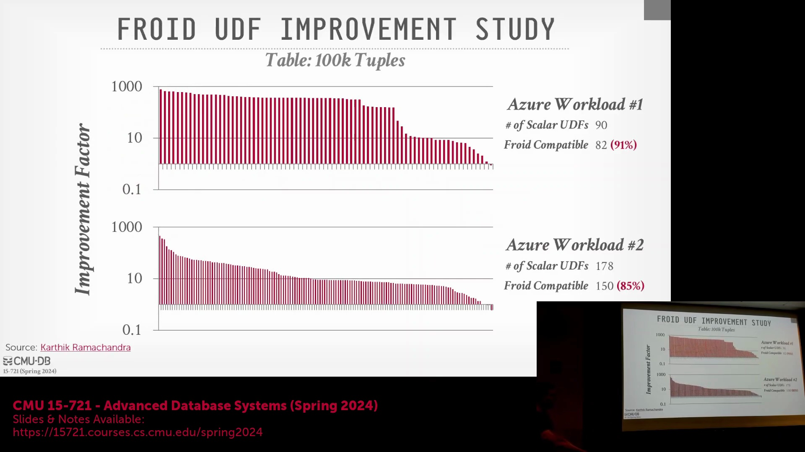
《Froid》论文展示了基于真实客户工作负载(Workload)的令人信服的实验结果。研究人员从生产环境中提取了 UDF，并验证了将其内联后带来的巨大性能收益。在一个工作负载中，90 个 UDF 有 82 个成功完成内联；在另一工作负载中，170 个 UDF 有 150 个具备兼容性。性能提升数据呈长尾分布，仅有一个 UDF 出现性能回退(Performance Regression)，原因是优化器难以处理海量的横向连接(Lateral Joins)。值得注意的是，部分客户的查询速度提升了近 1000 倍。在数据库系统中，除非彻底重写应用程序或从根本上重构存储架构，否则极少能实现如此显著的性能跃升。Froid 的核心优势在于，它无需对现有的 UDF 代码进行任何修改，即可交付巨大的性能增益。

## 开发时间线与采用指标
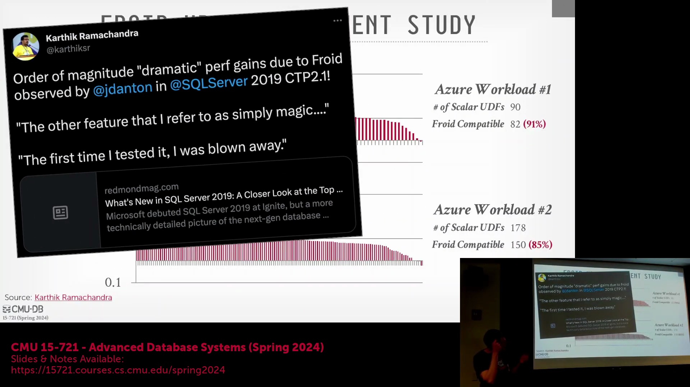
Froid 背后的创新可追溯至 Kartik，他曾就读于印度理工学院孟买分校（IIT Bombay），随后在威斯康星大学麦迪逊分校的 Grace Systems Lab 从事研究，最终加入微软。其基础研究论文发表于 2016 至 2017 年间，仅三年后，微软便在 SQL Server 2019 中成功交付了该功能，完成了令人瞩目的学术向工业界的工程化落地。来自实际用户的反馈极为积极，开发者仅需启用相应的功能开关(Feature Flag)，便报告了高达 20 倍的性能提升。在一个有据可查的案例中，某查询的执行时间从 4 分钟骤降至仅 9 秒。此外，对排名前 100 的 Azure 数据库进行的分析表明，约 60% 的 UDF 与 Froid 的内联机制完全兼容。
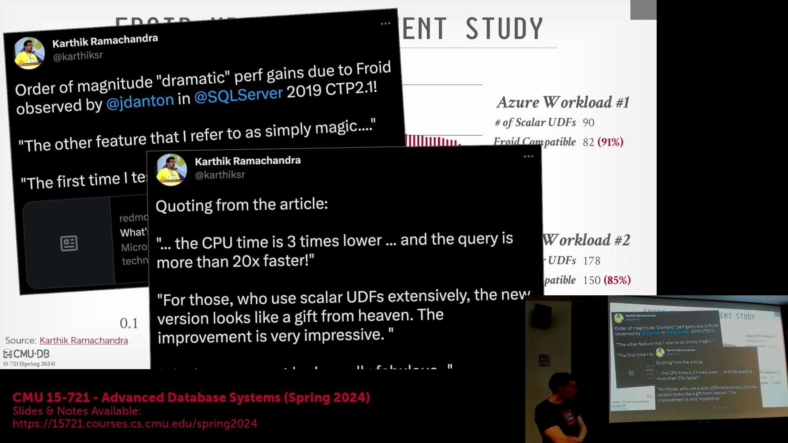
如此高的兼容率充分彰显了该方法的实用价值，使传统企业级应用程序无需经历手动重构，即可自动受益于现代数据库优化技术。

## 技术挑战与不支持的结构
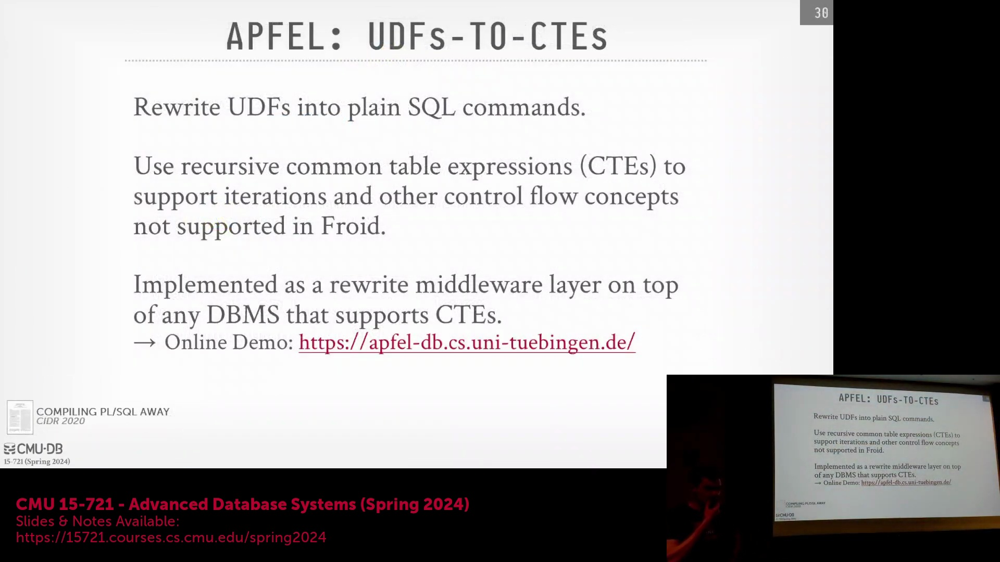
尽管取得了上述成功，但仍有若干技术挑战阻碍着 UDF 的普遍内联。标量用户定义函数(Scalar UDF，返回单个值)与表值用户定义函数(Table-Valued UDF)之间存在关键差异，当前的内联方法尚无法无缝覆盖所有变体。尽管数据库系统会强制执行超时机制以防止无限循环，但这并非内联技术的核心障碍。真正的瓶颈在于复杂的控制流(Control Flow)结构，例如深层递归、复杂循环及异常处理。异常处理的作用类似于 `goto` 语句，会导致程序流突然跳转至代码的其他部分，从而破坏关系代数转换模型。尽管后续名为《Agify》的研究论文探索了通过将循环和聚合逻辑重写为用户定义聚合函数(User-Defined Aggregate Functions)来解决问题，但该技术从未投入生产环境使用。因此，当前的内联框架特意排除了此类复杂结构，以确保系统稳定性与查询结果的正确性。

## 替代编译方案：独立中间件
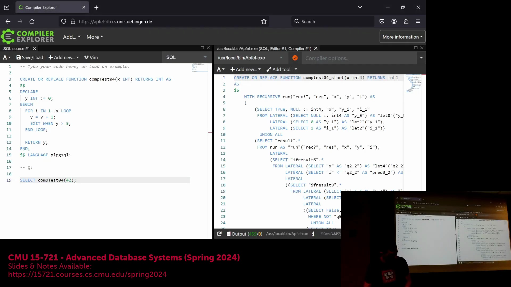
除 Froid 外，卑尔根大学的研究人员还提出了一种基于独立编译器中间件(Standalone Compiler Middleware)的替代方案。该外部工具不再完全依赖数据库内部的查询优化器，而是将 UDF 转换为可组合的 SQL 表达式，并大量借助横向连接和公共表表达式(Common Table Expression, CTE)来处理 Froid 难以应对的循环与过程式(Procedural)结构。该工具以预处理器(Preprocessor)的形式运行，在代码送达数据库引擎之前，便将原始的过程式代码转换为复杂但纯粹的关系型查询。

在一项基于 PostgreSQL 的演示中，一个简单的 UDF 被输入至该编译器，随后输出了一条冗长的 SQL 语句，其中密集使用了横向连接与显式的变量赋值逻辑。 
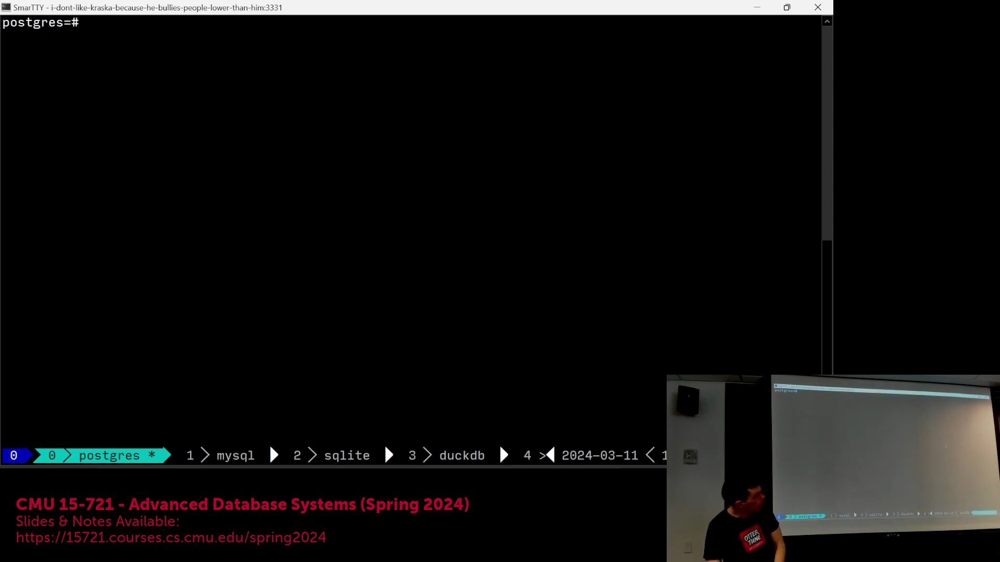
采用原生方式执行时，原始 UDF 的处理耗时约为 0.5 秒。然而，当转换后的 SQL 查询在数据库中运行时，执行时间骤降至仅 2 毫秒。 
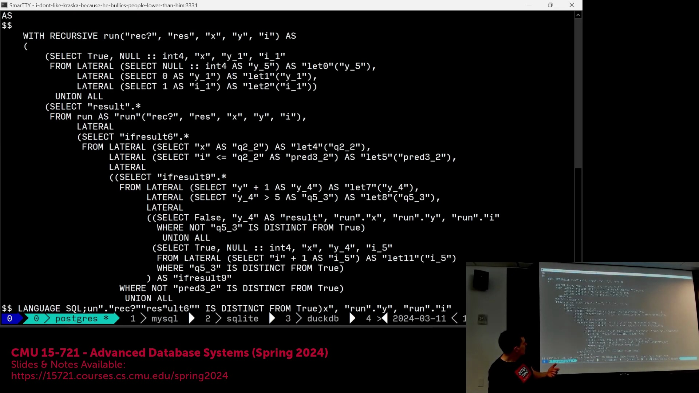
这一巨大的性能差距，鲜明地对比了传统函数调用的固有开销与中间件生成的高度优化的基于集合的执行计划(Set-based Execution Plan)之间的效率差异。 
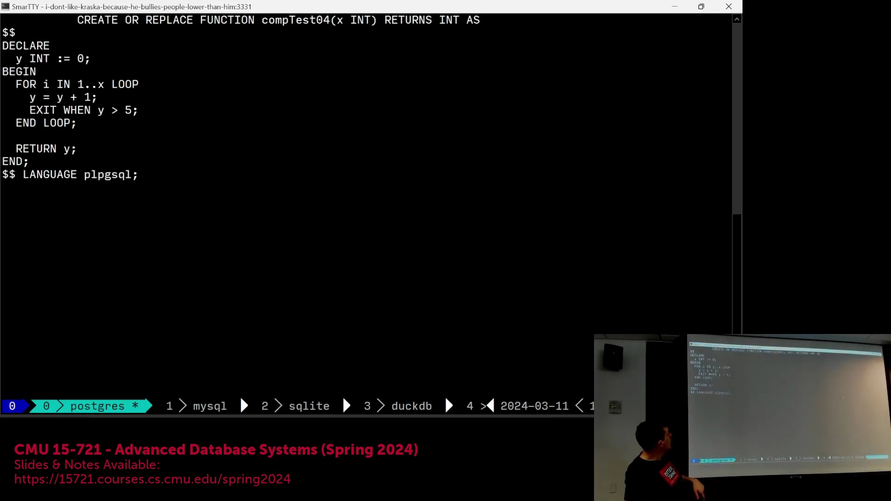
一旦嵌入的 SQL 逻辑以纯粹的关系形式呈现，数据库优化器便能高效地将其展开并进行深度优化。这充分证明，该中间件方案对于缺乏复杂内部 UDF 内联能力的数据库系统具有极高的应用价值。

## 编译流水线：从 UDF 到递归 CTE
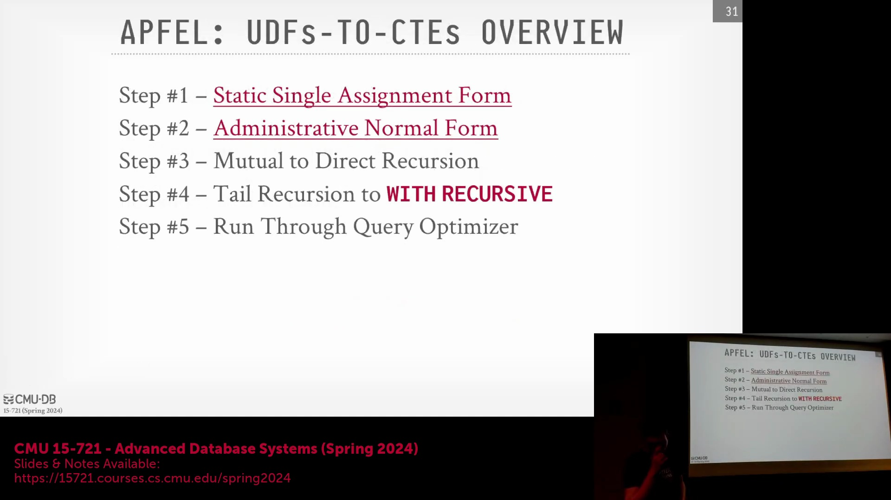
该编译方法的理论基础构建于一个严格的多阶段转换流水线(Transformation Pipeline)之上。原始 UDF 代码首先被转换为静态单赋值(Static Single Assignment, SSA)形式。这种中间表示(Intermediate Representation)通过将任意的过程逻辑拆分为带标签的代码块，并借助显式的 `goto` 跳转来定义控制流，从而实现代码的扁平化，有效映射出每一条潜在的执行路径。
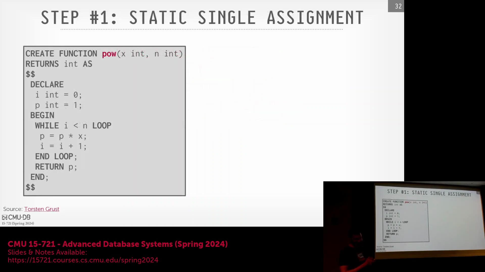
随后，SSA 形式被进一步转换为管理范式(Administrative Normal Form, ANF)。此阶段利用相互尾递归(Mutual Tail Recursion)函数对区域代码块进行化简，从而构建出原始逻辑的结构化数学表示。接着，通过特定算法，这些相互递归的函数被转换为直接递归形式。

最终，直接递归结构通过递归公共表表达式(Recursive Common Table Expression, Recursive CTE)映射为标准 SQL。这将生成一个完全关系化的查询，可无缝交由数据库的查询优化器处理。例如，一个包含累加器与幂次计算循环的简单 PAL 函数，会被系统性地分解为包含显式跳转指令的 SSA 代码块。这种条理严密的转换流程使编译器能够妥善处理原本无法内联的复杂控制流，成功弥合了过程式编程与关系型查询执行之间的技术鸿沟。

---

## 从 SSA 到递归 CTE
在编译流水线(Compilation Pipeline)中，用户定义函数(User-Defined Function, UDF)首先被转换为静态单赋值(Static Single Assignment, SSA)形式。这是传统编译器(Compiler)中的一种标准技术，其核心原则是每个变量在整个执行流程中仅被赋值一次。随后，该SSA表示形式被进一步转换为管理范式(Administrative Normal Form, ANF)。此阶段对控制逻辑进行结构化重组，以支持尾递归(Tail Recursion)的生成。在该范式下，函数可递归调用自身或其他函数，形成能够高效表示循环结构的调用链。所有的计算操作均发生在递归尾调用之前，当满足终止条件时，最后一次迭代将跳出循环并返回最终结果。为进一步提升简化程度，相互递归(Mutual Recursion)会被转换为直接递归(Direct Recursion)。这确保了递归调用仅作为函数执行的最后一步，且控制流保持单向传递。这一特性保证了最内层递归调用的输出能够准确映射至最外层的 `SELECT` 语句，从而允许将完整的过程式逻辑无缝嵌入嵌套的SQL查询中。

将直接递归形式转换为SQL的过程，核心在于将控制流与变量状态精确映射至递归公共表表达式(Recursive Common Table Expression, Recursive CTE)。编译器会构建嵌套查询以完成变量初始化，转换 `IF/ELSE` 条件分支，并将核心递归逻辑直接注入SQL语句。借助这一系统化的映射机制，复杂的过程式循环与分支结构被成功转化为标准的、可供查询优化器深度优化的关系型SQL。

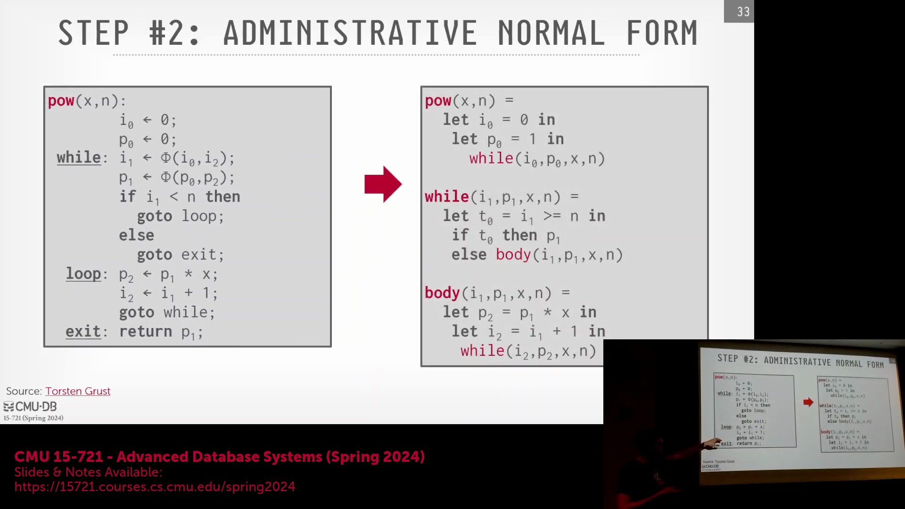

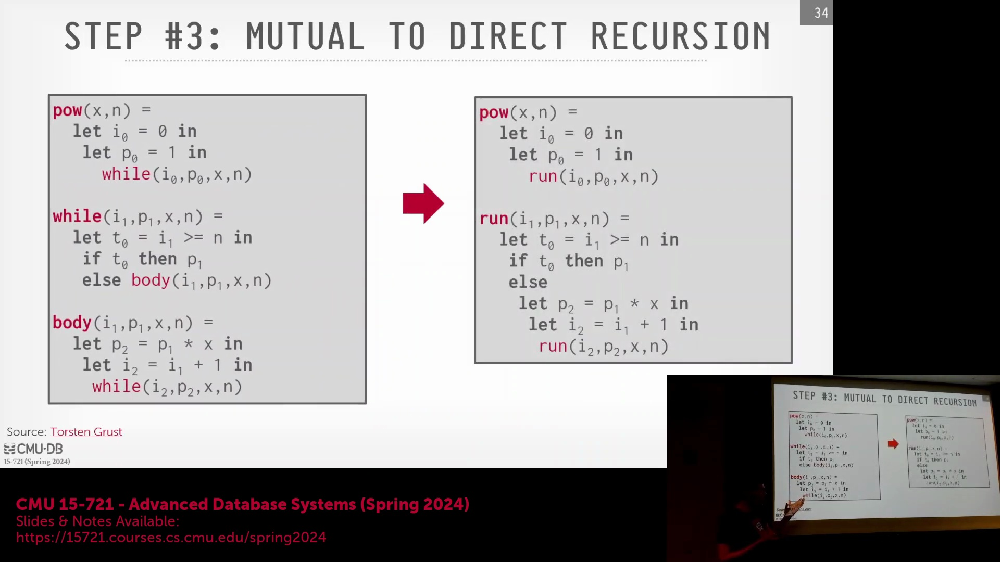

## 性能对比与优化器限制
在评估该方法时，研究人员将其与 PostgreSQL(Postgres) 等系统中的原生UDF执行机制进行了对比。此类系统通常缺乏类似微软Froid的内置内联(Inlining)功能。对于逻辑极为简单的函数，由于解析复杂CTE会引入额外开销，直接调用原生UDF的实际执行速度反而可能更快。然而，当UDF作用于超大规模数据表时，基于集合的CTE(Set-based CTE)方案便开始展现出显著的性能优势。尽管存在优势，但其性能提升幅度仍不及在 SQL Server 中显著，这主要归因于 PostgreSQL 的查询优化器(Query Optimizer)在激进优化方面相对保守。该优化器尚无法执行同等深度的优化策略（例如常量折叠(Constant Folding)、死代码消除(Dead Code Elimination)或高级连接重排序(Join Reordering)），从而限制了此编译转换方法的理论性能上限。

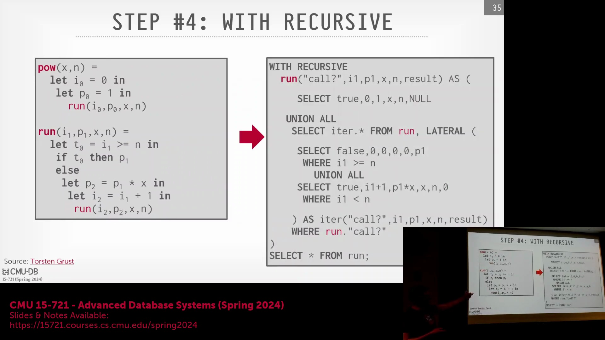

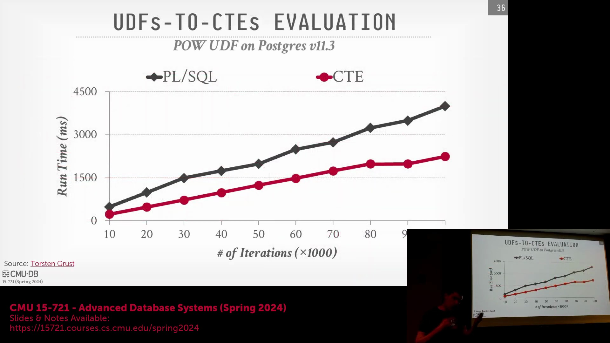

## 批处理方法：状态表与顺序更新
作为递归CTE的替代方案，“批处理”(Batch Processing)技术最初由学术研究探索提出，随后其演进方向与FEL项目及早期Froid论文的研究路径逐渐趋同。与Froid架构不同，批处理方案无需对底层查询优化器进行任何修改。取而代之的是，它将UDF逻辑转换为一系列作用于临时状态表(Temporary State Table)的 `UPDATE` 语句。该状态表实质上是UDF过程式变量(Procedural Variables)的关系型映射载体。在调用UDF时，系统会动态创建一个临时表，其列结构严格对应函数内部定义的各个局部变量。随后，系统通过执行一系列 `UPDATE` 查询来模拟过程式步骤，以批处理方式集中更新状态表，彻底摒弃了传统的逐行(Row-by-Row)执行模式。

## 执行机制与广泛的泛化能力
状态表中设有一个特殊的布尔型返回列，用于标记哪些元组(Tuple)应当作为最终结果集返回。表中的每一行均精确对应一个传入UDF的输入元组。批处理机制摒弃了单条记录的独立处理模式，转而针对所有输入元组并发更新整个状态表。这种基于集合的执行(Set-based Execution)模式使得成千上万个UDF调用得以并行处理，每一行数据均通过 `UPDATE` 语句独立维护并演进其状态。迭代计算通常借助 `generate_series` 函数结合横向连接(Lateral Join)来驱动控制。

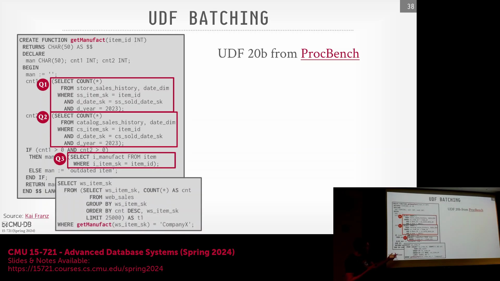

该架构具备极强的泛化能力，甚至有潜力支持那些会破坏传统内联机制的特性，例如异常处理(Exception Handling)与动态SQL(Dynamic SQL)。其中，异常状态可通过追踪表内的状态变迁来进行管理；而动态查询则可通过将拼接生成的SQL字符串暂存为状态变量来妥善处理。这使得批处理方案成为一种更为灵活、且与优化器无关(Optimizer-Agnostic)的过程式执行替代方案。

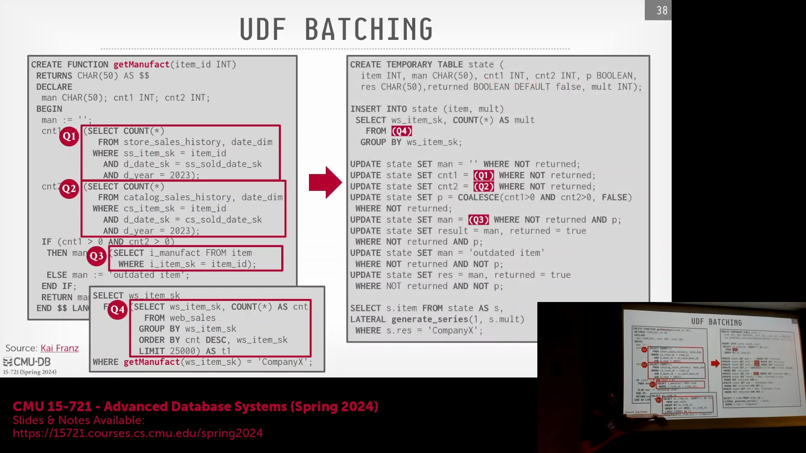

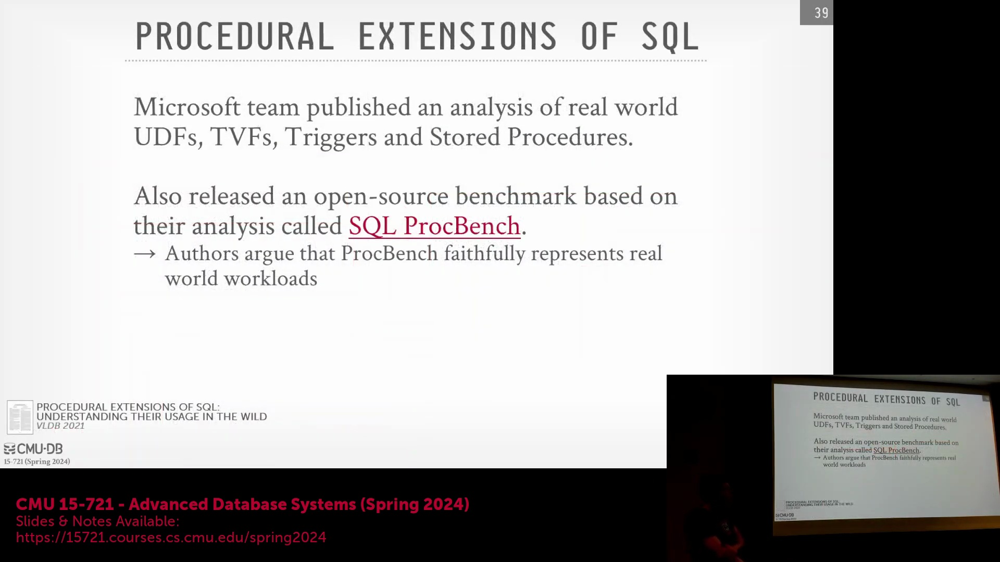

## ProcBench 与实际 UDF 分类
为科学评估上述技术，Froid团队开发了 `ProcBench` 基准测试(Benchmark)。该基准旨在高度还原企业生产环境中观察到的真实UDF工作负载(Workload)特征。`ProcBench` 依据结构特征将UDF划分为多个类别，以便针对性地验证不同的优化路径。其中的首要大类为无输入参数(Parameter-less)的UDF。例如，形如 `SELECT max_return_reason_web()` 的函数无需传入参数，通常仅执行单次调用即可返回静态值或聚合结果。深入理解此类分类体系，有助于数据库研究人员针对生产系统中最常见的主流过程模式，量身定制高效的编译优化策略。

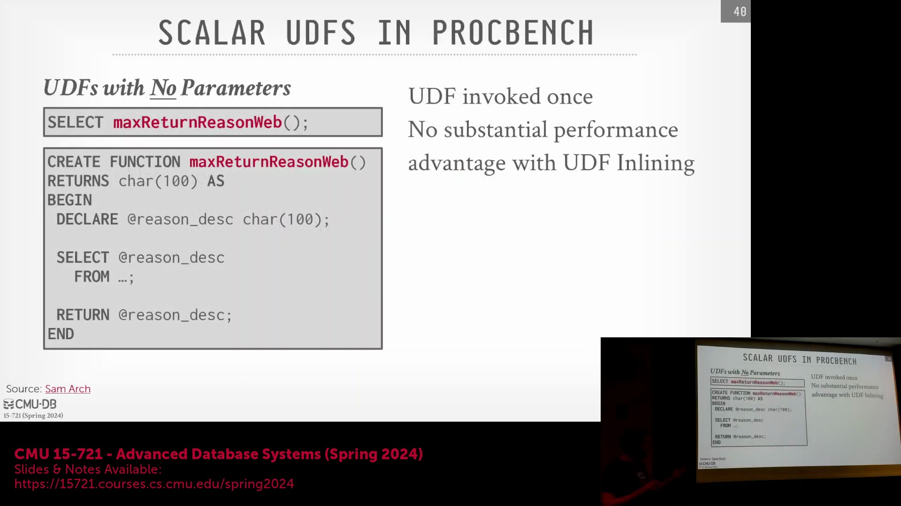

---

## 内联的局限性与迭代调用的重要性

当用户定义函数(User-Defined Function, UDF)仅被调用一次时，采用内联(Inlining)或批处理(Batch Processing)技术并无显著优势。在此场景下，函数作为独立单元执行，优化过程引入的额外开销往往无法转化为实质性的性能收益。这些技术的真正价值体现在 UDF 接收输入参数并在外部调用查询中进行迭代时。当函数在大型数据集上逐行(Row-by-Row)执行时，将其过程式逻辑转换为基于集合的运算(Set-based Operations)对于实现显著的性能提升至关重要。

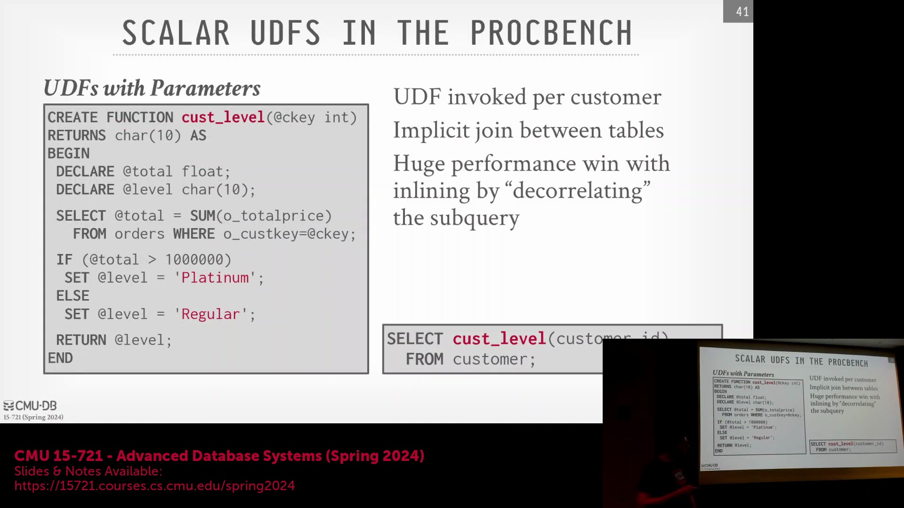

## 去关联化挑战与优化器的复杂性
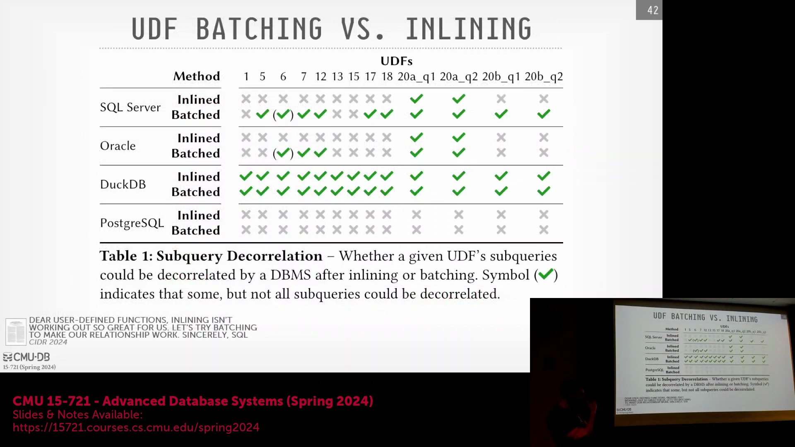
尽管微软通过 Froid 项目开创了内联技术，但基于 ProcBench 基准测试(Benchmark)的分析表明，其查询优化器(Query Optimizer)仅能成功内联一小部分现实生产环境中的 UDF。许多查询未能内联，或内联后未带来性能提升，根本原因在于优化器无法正确地对结果子查询执行去关联化(Decorrelation)操作。内联转换通常会生成极其复杂、充斥着横向连接(Lateral Join)的嵌套 SQL 结构。若优化器无法理清这些复杂的依赖关系，便无法将执行计划(Execution Plan)扁平化(Flattening)，导致查询退化为低效的嵌套循环(Nested Loop)，而无法采用高效的基于集合的连接(Set-based Join)策略。

SQL Server 的去关联化逻辑严重依赖于 2001 年论文中确立的手工编写规则(Hand-crafted Rules)，这些规则诞生于 Froid 或 AppFell 等工具生成的现代“庞然大物”(Monster)式查询出现之前。由于这些规则从未更新以应对复杂的横向连接链，微软的优化器在处理大量内联转换时显得力不从心。相比之下，PostgreSQL(Postgres) 等系统缺乏处理此类复杂逻辑的优化器能力，而 Oracle 通常会对这类复杂模式采取保守策略。根本瓶颈并不在于内联技术本身，而在于底层优化器无法对转换后的 SQL 进行有效的推理与扁平化处理。

## DuckDB 的成功与高级优化器架构
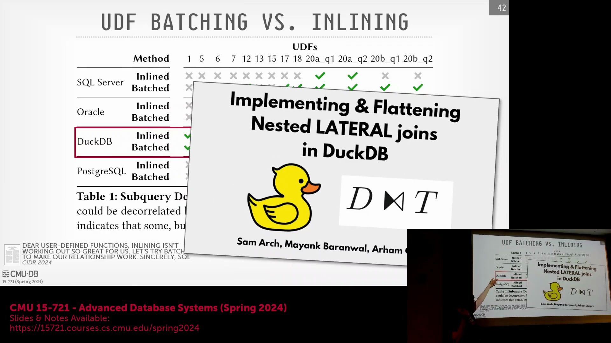
DuckDB 在此方面表现优异，成功处理了 ProcBench 中几乎所有的 UDF。这一能力最初源于 CMU 15-721 课程的一项学生项目，该项目扩展了 DuckDB 以扁平化嵌套的横向连接，从而直接支持了前文探讨的内联与批处理技术。该 Pull Request (PR) 已被合并至主代码库，意味着现代 DuckDB 发行版已原生集成这一高级优化逻辑。这充分彰显了开源数据库快速吸收学术研究成果、弥合与商业系统性能差距的能力。

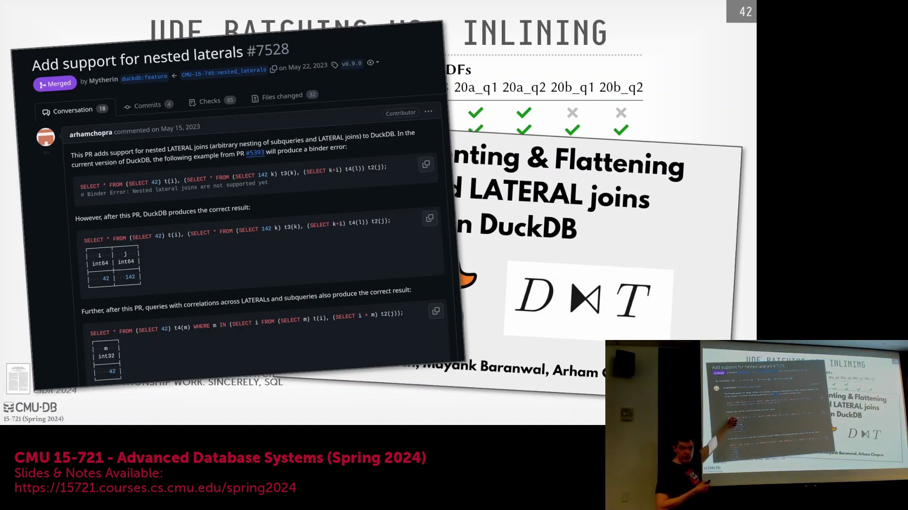
DuckDB 以及 Umbra 和 Hyper 等系统的卓越性能，归功于其更为先进的去关联化架构。这些现代优化器不再依赖传统的基于树的执行计划(Tree-based Execution Plan)与静态重写规则(Static Rewrite Rules)，而是利用有向无环图(Directed Acyclic Graph, DAG)来实现嵌套查询间的计算复用(Computation Reuse)。此外，它们引入了依赖连接(Dependent Join)等新型关系操作，以显式追踪 `WHERE` 与 `FROM` 子句间的依赖关系。该架构能够高效处理各类复杂的子查询组合并完成去关联，使其极为契合现代 UDF 编译器所生成的复杂 SQL 语句。

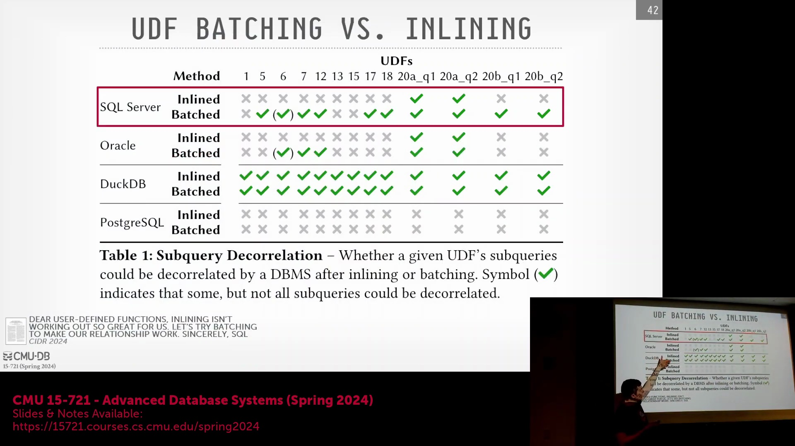

## 复杂控制流的转换：技术实现
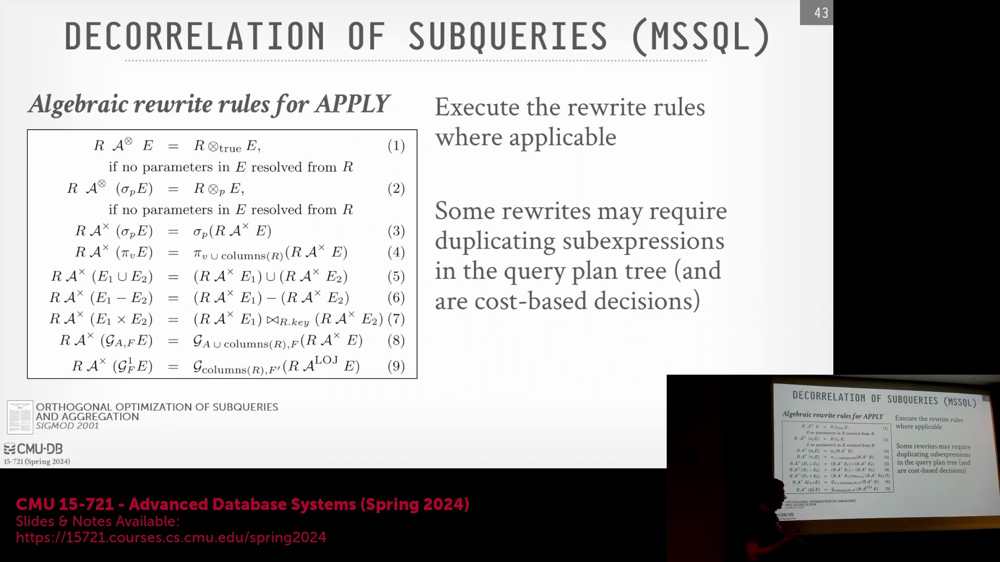
一项关键技术挑战在于如何将过程式控制流(Procedural Control Flow)（尤其是嵌套的 `if/else` 代码块与变量覆盖逻辑）准确转换为关系型运算。当 UDF 包含涉及动态重新赋值的多重条件分支时，直接转换变得异常棘手。编译器的解决方案是在查询初始阶段对变量进行初始化（例如赋予默认的 `NULL` 值），并以链式结构顺序执行状态转换(State Transition)。每个条件代码块都被转化为独立的关系运算步骤，并显式引用上一步骤输出的列。

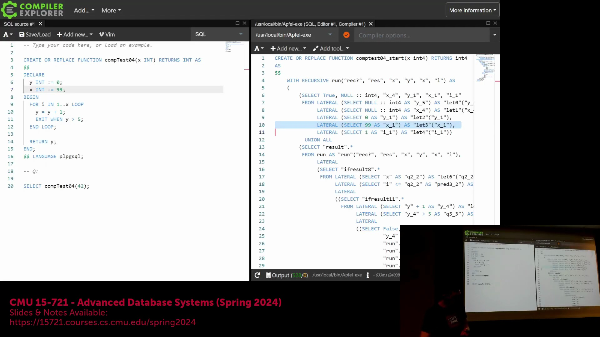
借助 `CASE WHEN` 表达式或顺序表引用等结构，编译器能够精确建模状态变迁。若条件满足，则计算新值；否则，沿用上一步的旧值。这种逐步的区域化映射确保了即使存在复杂且重叠的条件逻辑，也能在 SQL 中被忠实还原，而不会丢失原始的过程式语义(Procedural Semantics)。该转换本质上构建了一个中间结果集管道，每一阶段都会对数据状态进行细化，直至产出最终结果。

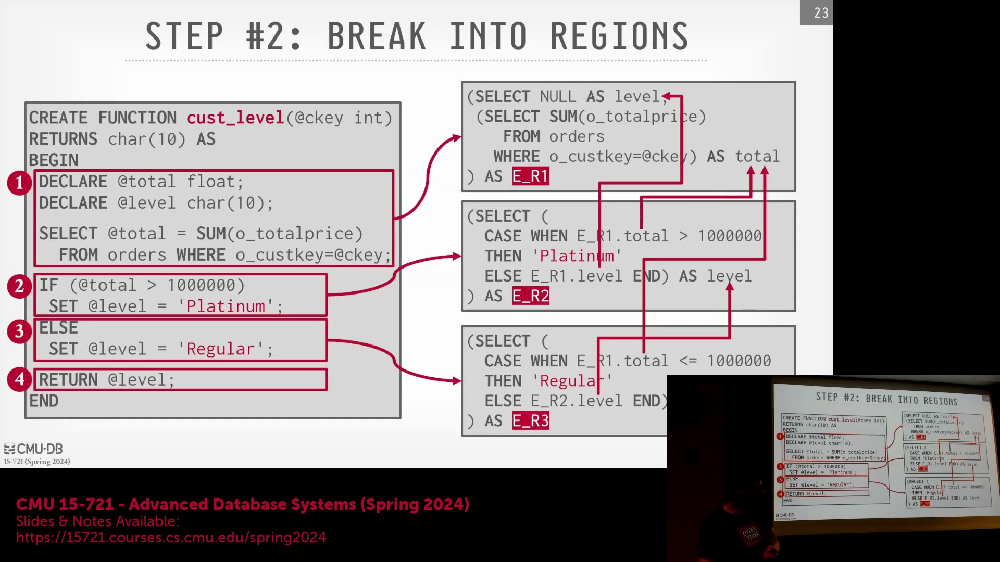

## 未来方向：嵌入式数据库与 Apache Arrow
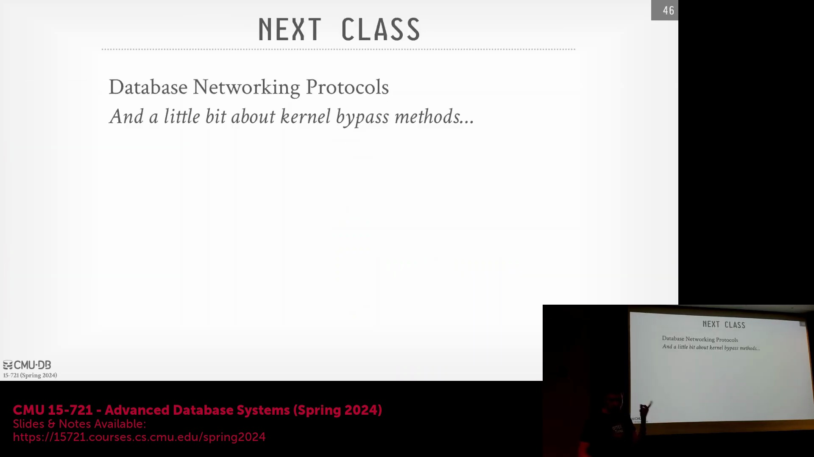
讲座末尾简要预告了下期课程的核心议题：研究焦点将从在数据库内部嵌入应用逻辑（即 UDF）转向一种新兴范式——将数据库引擎直接嵌入应用程序中。该范式依托 Apache Arrow 等现代数据交换格式，旨在彻底消除传统的网络通信瓶颈。传统的客户端-服务器(Client-Server)协议难以胜任高吞吐量的 OLAP 查询(Online Analytical Processing Query)，而 Arrow 提供的零拷贝(Zero-Copy)与列式内存布局(Columnar Memory Layout)，能够实现应用程序与 DuckDB 等嵌入式数据库(Embedded Database)之间无缝、高速的数据传输。课程要求学生研读一篇详述此架构演进的基础论文，为后续探讨进程内数据库(In-Process Database)如何重塑现代数据处理性能奠定理论基础。

---

## 初次交锋与情绪沉淀

Cat，这是我首次与酒瓶交锋。将这三瓶置入冷冻室，好让我能将其彻底饮尽。当心些，宝贝，你仍有一饮而尽的余力。只因苦痛早已将我浸透，个中滋味并非你我能够轻易断言。

## 群体共鸣与灵魂救赎

你与酒瓶旁的姑娘们一同把酒尽欢。头儿，把那包药收起来吧。此刻，你的灵魂终将得以救赎。

## 自我接纳与内心归宿

所以，尽管饮下吧，直到它真正与你相契。比利·丹斯只是在静候，等待能与那些脆弱之人共饮的时刻。像个真正的男人那样，去寻一只猫，觅得内心的安宁。
