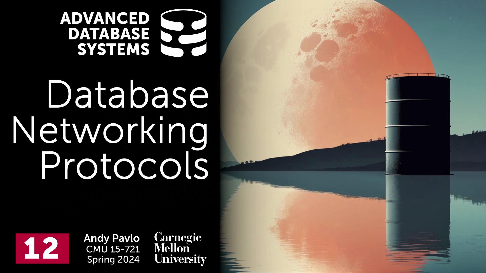
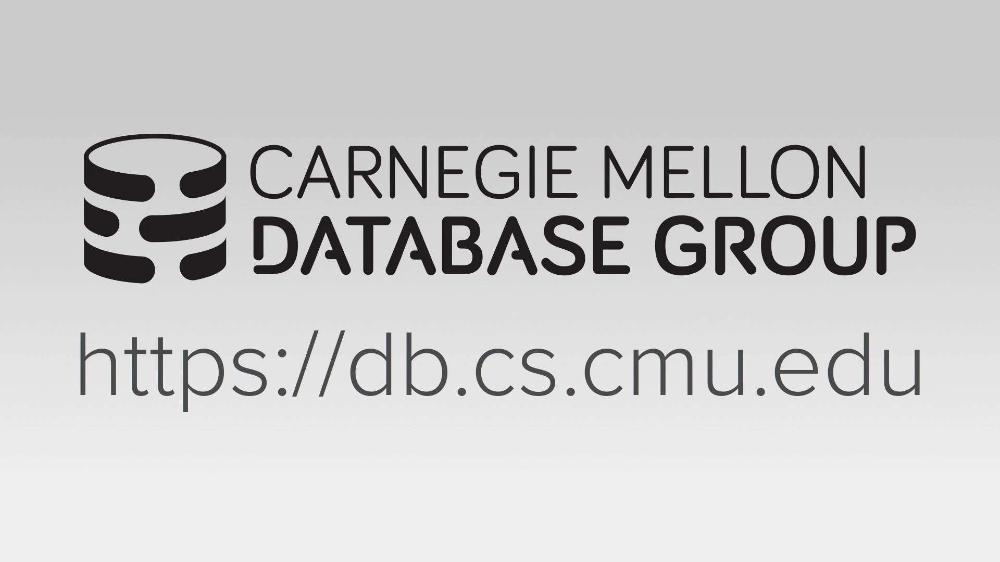
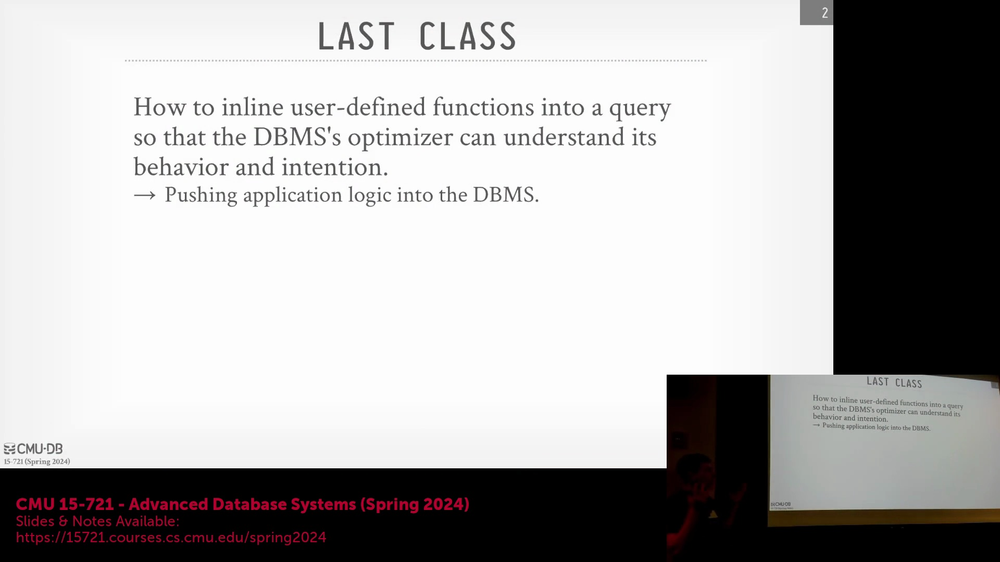
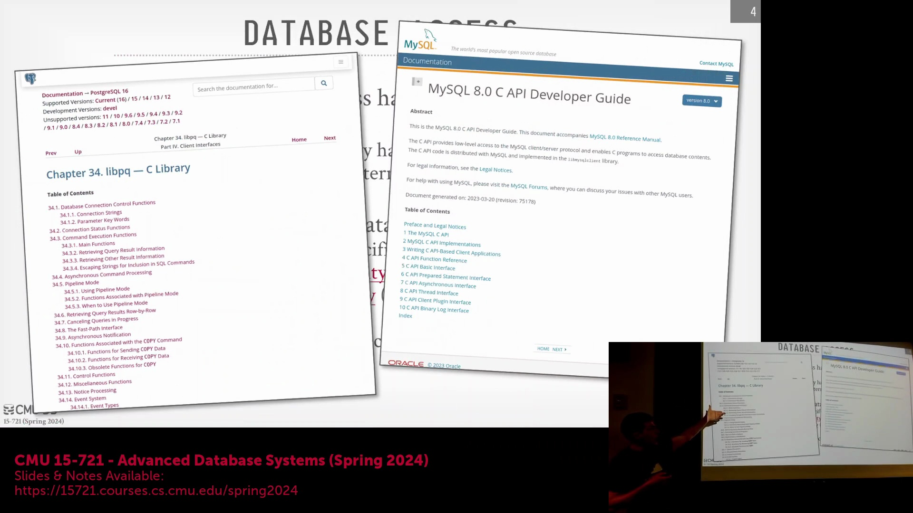
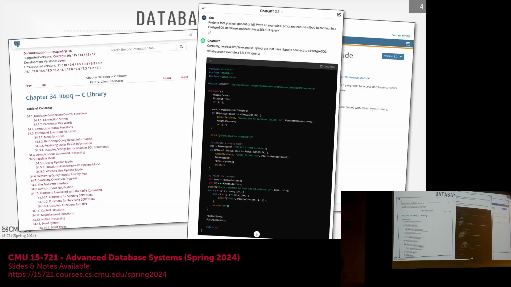
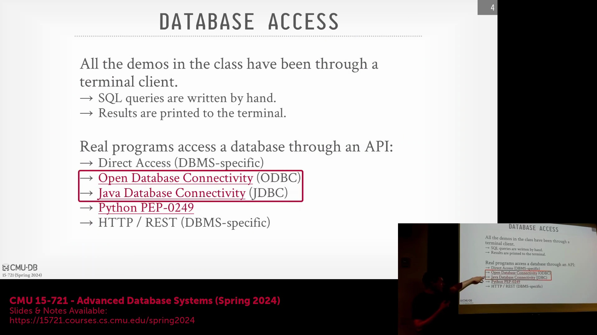
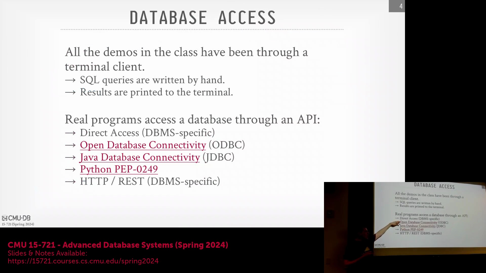
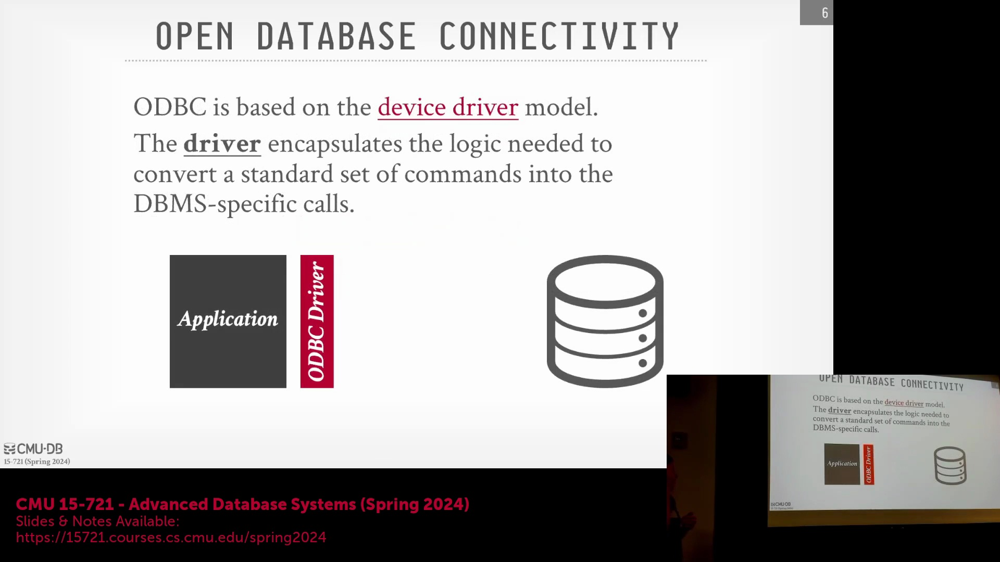

## 课程介绍与开场致辞

欢迎来到卡内基梅隆大学高级数据库系统(Advanced Database Systems)课程。本讲座在演播室现场观众面前录制。今天这节课，我们将深入探讨网络协议(Networking Protocols)。

## 学期规划与核心教学目标

目前，课程进度已步入本学期的第二个三分之一阶段。本周及接下来的两周，我们将重点探讨查询优化(Query Optimization)。随后，我们将开始研读关于主流数据库系统的论文，以深入理解其工作原理，并观察我们在课程中讨论的核心概念是如何被这些系统的开发公司实际应用的。 

上节课我们重点讨论了如何将应用层编写的用户定义函数(User-Defined Function)直接嵌入数据库系统内部，并通过查询进行执行。借助内联技术(Inlining)，我们可以将用户定义函数的逻辑结构转换为 SQL 或关系代数(Relational Algebra)，并将其暴露给查询优化器(Query Optimizer)，以便推导出准确的执行逻辑。而今天的课程内容则正好相反：我们将探讨如何将数据从数据库系统中导出，并传输至应用程序端进行客户端处理。

## 访问 API、网络协议与现代数据工作负载
我们将首先剖析不同类型的数据库访问接口(Application Programming Interface)，随后深入探讨网络协议的底层细节。这与本次布置的阅读论文密切相关。该论文探讨了数据在网络传输过程中的实际比特流(Bitstream)形态，并分析了传统协议为何在现代应用场景（例如数据科学家使用 Pandas 或 Python Notebook）中效率低下。在此类场景中，开发者往往只需执行一条 `SELECT *` 语句，拉取海量数据集，随后在客户端完成所有后续处理。我们将揭示当今主流数据库系统为何普遍缺乏针对此类数据工作负载(Data Workload)进行优化的协议。事实证明，其解决方案正是 Apache Arrow 以及在该论文发表后逐步成型的数据库连接库规范。 

我们还将涵盖服务器端的优化技术，例如通过内核旁路(Kernel Bypass)或用户态旁路(User-Space Bypass)来加速网络栈(Network Stack)，以及将数据高效加载至 DataFrame 的客户端操作。尽管这些技术概念大多适用于分布式数据库(Distributed Database)中工作节点、优化器或调度器之间的后端通信，但本课程的核心关注点将始终聚焦于：如何高效地向外部客户端暴露数据。

## 数据序列化与底层连接层

上节课中，我演示了如何打开 PostgreSQL 终端、编写 SQL 查询，并将结果直接打印到屏幕上。这是一种最基础的访问方式，即通过网络传输供人类阅读的纯文本。然而，绝大多数应用程序需要以二进制格式接收数据，以便进行进一步的程序化处理。尽管部分遗留系统(Legacy Systems)仍向终端发送纯文本，但现代数据库系统已主要依赖于二进制数据序列化(Binary Data Serialization)技术。

开发者通常不会直接将应用数据对接至 `psql` 等命令行终端。相反，应用程序会根据其开发语言（如 C#、C++、Python 等）调用特定的连接库(Connection Library)。我们最关注的底层架构，是负责在网络上传输比特流的低级网络 API(Low-level Network API)。数据库厂商通常会提供专有的 C 语言库（例如 PostgreSQL 的 `libpq`）来底层处理连接建立、身份认证与查询执行。虽然开发者可以直接调用这些底层库编写原生 C 程序，但在实际开发中，大家通常更倾向于依赖更高层级的抽象接口。

## 向标准化与数据库无关 API 的演进

更高层级的抽象包括对象关系映射(Object-Relational Mapping)框架，例如 Django、Active Record（Ruby on Rails）或 Sequelize（Node.js）。这些框架在底层通常会调用低级的 C API。而真正的行业价值，则体现在如 JDBC(Java Database Connectivity) 或 Python DB-API 这样标准化且与数据库无关(Database-Agnostic)的 API 规范上。这些规范的核心目标是让开发者能够基于统一接口进行编程。理论上，若决定更换底层数据库系统，应用程序代码无需大幅修改，尽管不同数据库的 SQL 方言(SQL Dialect)差异可能仍需要少量适配。

回顾历史，在 20 世纪 80 年代末至 90 年代初之前，数据库连接完全依赖于厂商特定(Vendor-Specific)的 C 语言库，这导致应用程序的可移植性极差。早期的标准化尝试（如 Sybase 的 DB Library）旨在建立开放标准，但未能获得广泛普及。真正的行业突破出现在微软与 Simba Technologies 合作推出 ODBC(Open Database Connectivity) 之时。如今，几乎每款数据库系统都实现了对 ODBC 的支持，甚至包括 MongoDB 这类非关系型/NoSQL 系统。这是因为 ODBC 本质上仅负责传输命令字符串，并不限定具体的查询语言。

## ODBC 架构与驱动程序模型

ODBC 基于设备驱动程序模型(Device Driver Model)运行，其机制类似于操作系统中的硬件驱动程序。正如安装新显卡时需要厂商提供驱动以便操作系统与之通信一样，数据库厂商也会提供实现了该规范的 ODBC 驱动程序。当应用程序执行查询时，请求会先交由 ODBC 驱动程序处理，由其负责将请求转发至数据库服务器、接收返回结果，并将其编组(Marshaling)为符合 ODBC 规范的数据格式。

驱动程序还承担着关键的数据类型转换任务。例如，当客户端期望接收 32 位整数，而服务器返回的是 64 位整数时，驱动程序会自动完成位宽转换。此外，它还抽象了服务器的专有功能，负责映射与迭代结果集(Result Set)、执行参数绑定(Parameter Binding)，并抹平客户端与服务器运行环境之间的差异，从而为开发者提供一致且高度可移植的编程体验。